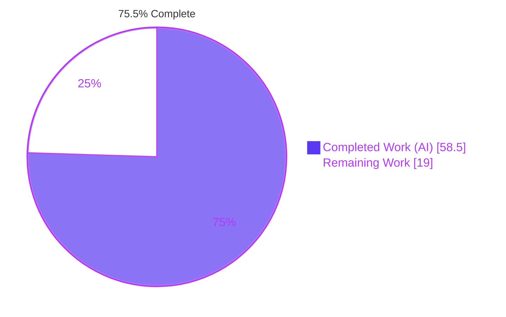
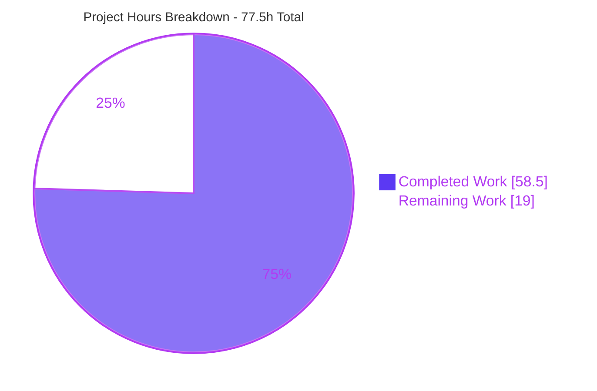
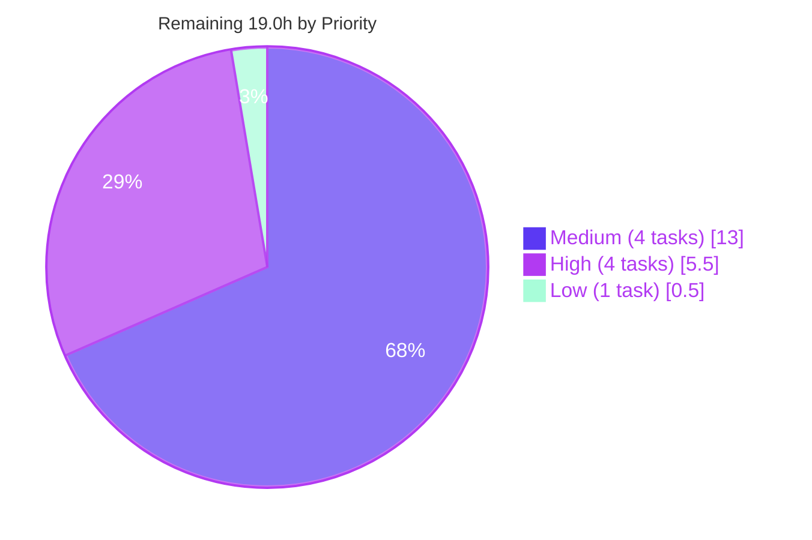

# Blitzy Project Guide
### `hello_world` — Express.js Integration & Second Routed Endpoint
**Branch:** `blitzy-577c7030-1cc5-4264-ad2f-65aaf5e49718` · **HEAD:** `7a23581` · **Baseline:** `ab2aed6`

---

## 1. Executive Summary

### 1.1 Project Overview

This project introduces the Express.js web framework into `hello_world`, a four-file Node.js teaching artifact, and converts its un-routed `node:http` catch-all request handler into a routed Express application serving two path-addressed endpoints: the pre-existing `Hello, World!` greeting on `GET /` and a new `Good evening` greeting on `GET /good-evening`. Because the original handler never dereferenced the request object, a second endpoint was structurally impossible — Express supplies the path dispatch that makes it expressible. Target users are learners and reviewers running the service locally. Technical scope spans seven files: the Express application module, the reduced lifecycle module, a dependency-free regression suite, the npm manifest and lockfile, an ignore file, and documentation.

### 1.2 Completion Status



| Metric | Value |
| --- | --- |
| **Total Hours** | **77.5 h** |
| **Completed Hours (AI + Manual)** | **58.5 h** (AI 58.5 h + Manual 0.0 h) |
| **Remaining Hours** | **19.0 h** |
| **Percent Complete** | **75.5 %** |

> **Calculation (PA1, AAP-scoped):** `58.5 ÷ (58.5 + 19.0) × 100 = 58.5 ÷ 77.5 × 100 = 75.4839 % → 75.5 %`
> Legend colours — Completed = Dark Blue `#5B39F3`; Remaining = White `#FFFFFF`.

### 1.3 Key Accomplishments

- [x] **Express 5.2.1 added as the request-handling framework** — declared `^5.2.1`, resolved and locked to `5.2.1`, verified three independent ways (registry dist-tags, installed manifest, lockfile).
- [x] **New `GET /good-evening` endpoint live** — 200, `Content-Type: text/plain`, body `Good evening\n`, exactly 13 bytes (hex `47 6f 6f 64 20 65 76 65 6e 69 6e 67 0a`).
- [x] **Original greeting preserved byte-for-byte** — `GET /` still returns 200 / `text/plain` / 14 bytes / hex `48 65 6c 6c 6f 2c 20 57 6f 72 6c 64 21 0a`, guarded by an automated regression test.
- [x] **Response header surface unchanged** — exactly five headers in the original wire order (`Content-Type, Date, Connection, Keep-Alive, Content-Length`); **no `X-Powered-By`, no `ETag`, no `charset` suffix** on any response.
- [x] **Uniform plain-text 404** — a pathless terminal middleware answers every unmatched path *and* method with 404 / `text/plain` / `Not Found\n` (10 bytes), so the response surface never fractures into HTML.
- [x] **Application/server split for testability** — `app.js` is importable with zero side effects (`require('./app')` binds no port); `server.js` guards `listen` behind `require.main === module` and exports the server.
- [x] **Test surface repaired and populated** — the failing `echo … && exit 1` stub replaced with `node --test`; a 3-test suite on built-in `node:test` binds an ephemeral port and adds **zero** dependencies.
- [x] **Launch path repaired** — `main` corrected from the dangling `index.js` to `server.js`, and an explicit `start` script added, so `node .`, `node server.js` and `npm start` all boot.
- [x] **Supply chain audited before adoption** — `npm audit` reports **0 vulnerabilities** at every severity across the 68-package graph; 0 devDependencies; all 67 non-root lockfile entries carry `sha512` integrity and a `resolved` URL; `lockfileVersion` held at 3 so `npm ci` still works.
- [x] **Repository hygiene established** — `.gitignore` created, so `git status` stays clean after an install that materialises 65 top-level directories.
- [x] **Documentation shipped with the code** — README now carries requirements, install/run/test steps, the endpoint table, and explicit notes on the 404 and method-narrowing behaviour changes.
- [x] **Verification campaign completed** — 12 of 12 acceptance criteria verified, 7 of 7 negative checks pass, 3/3 tests pass (proven non-vacuous by mutation testing), and **four independent browser validation passes all returned PASS**.

### 1.4 Critical Unresolved Issues

There are **no release-blocking defects**. The compilation surface is clean, the test suite is green, and every endpoint behaves as specified. The four items below require a human decision or a path-to-production action rather than a bug fix.

| Issue | Impact | Owner | ETA |
| --- | --- | --- | --- |
| `engines.node` is `^18.19.0 \|\| >=20.7.0`, not the AAP's literal `>=18` (excludes 18.0–18.18, all 19.x, 20.0–20.6) | Low — functionally sound and a strict subset of Express's own `>= 18`, but developers or CI images on excluded versions will hit `EBADENGINE`. Needs owner ratification or a widening decision. | Repository owner / tech lead | 1.0 h |
| No `LICENSE` file while `package.json` declares `"license": "MIT"` (pre-existing defect D-03, explicitly out of AAP scope) | Low for local use, **blocking for distribution** — the declared licence has no accompanying text. | Repository owner | 0.5 h |
| The four-argument error handler is unreachable from any live route; proven only in an isolated sandbox and covered by no automated test | Low today — no registered handler can throw — but it is effectively untested production code that guards against HTML/stack-trace disclosure. | Backend engineer | 3.0 h (with M-1) |
| No CI pipeline, so nothing enforces the verified green state on future commits | Medium — all verification to date is agent-run and point-in-time; a future edit could silently regress the byte-exact contract. | DevOps / platform engineer | 4.0 h |

### 1.5 Access Issues

Validated against **current** system permissions during this assessment pass.

| System / Resource | Type of Access | Issue Description | Resolution Status | Owner |
| --- | --- | --- | --- | --- |
| `https://registry.npmjs.org/` | Package registry (read) | None. `npm view express version` → `5.2.1`, exit 0. No `.npmrc`, so no registry authentication is configured or required. | ✅ No issue — verified reachable | n/a |
| Git remote `origin` | Repository read/write | None. `git ls-remote --heads origin` exit 0, returning `refs/heads/blitzy-577c7030-…` @ `7a23581` and `refs/heads/main` @ `ab2aed6` — the branch is pushed and the baseline is visible. | ✅ No issue — verified reachable | n/a |
| Credentials / secrets / service accounts | Runtime configuration | None required. `process.env` references across all three JS files = **0**; no `.env`, no `.env.example`, no API keys, no database, no third-party service. | ✅ No issue — none needed | n/a |
| `web_search` tool and `web_fetch` for `expressjs.com` | External research (build phase) | Historical: `web_search` reported itself unavailable and `web_fetch` refused the domain with `url_not_allowed` during the design phase. | ✅ Resolved / worked around — research completed against primary sources over the permitted local shell (HTTPS documentation retrieval, registry interrogation, empirical runtime probes). Did not block delivery and is not a current blocker. | n/a |

**Net: no current access issues prevent automated build validation, integration, or deployment.**

### 1.6 Recommended Next Steps

1. **[High]** Complete the human code review and sign-off of the 7-file change set (~192 hand-written lines plus the npm-generated lockfile) — **3.0 h**.
2. **[High]** Ratify the declared `engines.node` range, or widen it to `>=18` and rework the test lifecycle accordingly; reconcile the AAP's AC-10 text either way — **1.0 h**.
3. **[High]** Add the `LICENSE` file so the declared MIT licence has accompanying text — **0.5 h**.
4. **[High]** Merge to `main` and run the post-merge smoke verification on a clean clone (`npm ci` → `npm test` → `npm start` → the three `curl` checks) — **1.0 h**.
5. **[Medium]** Stand up CI (`npm ci` + `npm test` + `npm audit`) across the ratified engines range so the verified green state is enforced on every future commit — **4.0 h**.

---

## 2. Project Hours Breakdown

### 2.1 Completed Work Detail

Every component below traces to a specific AAP requirement, decision, or verification clause.

| Component | Hours | Description |
| --- | --- | --- |
| Express selection & supply-chain due diligence | 3.0 | **R1, BP-1, BP-4.** Version verified three independent ways (registry dist-tags → `latest: 5.2.1`; installed manifest; lockfile pin). `npm audit` over the 68-package graph → 0 vulnerabilities at every severity. Licence (MIT) confirmed compatible with the repository's own declaration. |
| Express 5 behavioural research | 5.0 | **R1, D-j/D-k/D-l.** Six official documentation pages retrieved plus empirical runtime probes that *forced* three design decisions: a bare `*` wildcard throws `PathError` at registration; `res.send`/`res.type` append `; charset=utf-8` and generate a weak `ETag`; `X-Powered-By` is on by default. |
| `package.json` — `dependencies` declaration | 1.0 | **R1, I2.** Adds `"dependencies": { "express": "^5.2.1" }` to a manifest that previously declared no dependencies of any kind. |
| `package-lock.json` — regeneration | 2.0 | **I3, BP-3.** npm-generated (never hand-authored). Grows 1 → 68 entries; `lockfileVersion` held at 3 so no format migration occurs; root `name`/`version` preserved as `hello_world`/`1.0.0`; all 67 non-root entries carry `sha512` integrity and a `resolved` URL. |
| `engines.node` runtime floor — delivered portion | 1.0 | **I6, AC-10 (50 % of a 2.0 h item).** Constraint declared, satisfied by the operative runtime, measured across the permitted range, and explained in the README. The residual 50 % is the ratification decision in §2.2. |
| `app.js` — application module scaffold | 3.0 | **R1, I10, BP-8.** `express()` instance, `app.disable('x-powered-by')`, side-effect-free construction, `module.exports = app`, **no `listen` call** — the property that makes the module importable and testable. |
| `GET /` route — byte-exact preservation | 2.5 | **I1, F-002, D-l.** Raw `res.statusCode` / `res.setHeader` / `res.end` triple, character-identical to the baseline handler, yielding 200 / `text/plain` / 14 bytes with no charset suffix and no `ETag`. |
| `GET /good-evening` route | 2.5 | **R2, D-b, D-c.** New endpoint: 200 / `text/plain` / `Good evening\n` / 13 bytes. Kebab-case path mirroring the response text. |
| Pathless terminal not-found middleware | 2.5 | **I4, D-j, BP-5.** `app.use((req, res) => …)` → uniform 404 / `text/plain` / `Not Found\n` / 10 bytes across every unmatched path and method. Pathless form chosen because it requires no path-pattern syntax and is therefore immune to the Express 5 wildcard failure mode. |
| Four-argument error handler | 2.0 | **D-k, BP-5.** `app.use((err, req, res, next) => …)` → 500 / `text/plain`, with `err.stack` written to server stderr only. Prevents Express's built-in handler from replying `text/html` with a stack trace when `NODE_ENV` is unset. |
| `server.js` — reduction to process lifecycle | 3.5 | **D-e, D-f, F-001/F-004/F-005.** `http.createServer(app)`, `require.main === module` guard around `listen`, `module.exports = server`. Host/port literals and the readiness log preserved verbatim. |
| Launch-path repair | 1.5 | **I7 (defects D-01, D-04).** `main` corrected from the non-existent `index.js` to `server.js`; explicit `"start": "node server.js"` added. Validated against a pre-change control extracted from the baseline commit. |
| Test-script repair | 1.0 | **I8 (defect D-02).** `scripts.test` changed from `echo "Error: no test specified" && exit 1` to `node --test`, which discovers `test/**/*.test.js` with no configuration file. |
| `test/app.test.js` — regression suite | 5.0 | **I8, BP-8.** Named-export `before`/`after` hooks, `server.listen(0, '127.0.0.1')` ephemeral binding, `server.close()` teardown for clean runner exit, a promisified `http.get` helper (so no HTTP-testing package is needed), and three byte-exact tests including header-absence assertions. |
| `.gitignore` | 0.5 | **I5.** `node_modules/` and `npm-debug.log*`, so an install that materialises 65 top-level directories never pollutes the working tree. |
| `README.md` — documentation | 3.5 | **I9, C1/D-i, BP-9.** Requirements with the engines rationale, install/run/test steps with the exact readiness line, the endpoint table with byte counts, explicit notes on the 404 and method narrowing, routing-tolerance disclosure, and reconciliation of the original change-freeze directive. |
| Acceptance verification AC-1 … AC-12 | 5.0 | **§0.7.1.** Byte and hex wire probes on both greetings, five-header wire-order audit, seven-method matrix, all three launch paths, and a case-sensitive comparison of the readiness line. |
| Negative-check verification W1 … W7 | 3.5 | **§0.7.3.** Static sweeps for all seven failure modes plus a **four-mutation non-vacuousness proof** of the regression suite in an isolated sandbox (real files never modified). |
| Autonomous runtime & browser validation | 4.0 | **§0.7.2.** Two independent headless-Chrome sessions during the build phase: a six-URL header audit and a fourteen-row method matrix, with the 404 body exported from Chrome's network layer and scanned for HTML markers. 88 screenshots and 16 screen recordings retained. |
| Cross-version Node validation | 2.5 | **I6, I8.** The suite executed on every Node.js version the manifest permits, which is what produced the measured `engines` range rather than a guessed one. |
| Convention & quality conformance | 2.5 | **BP-2, BP-10.** CommonJS, 2-space indentation, single quotes, semicolons, arrow callbacks, `const` only, 4-space JSON. Zero placeholders/TODO/FIXME/stub/dummy across all 7 files. Trailing newline, no BOM, no tabs, no trailing whitespace, LF-only index blobs. Byte-comparison preservation proofs against the baseline source. |
| Git hygiene | 1.5 | **BP-10, §0.6.1.** 13 atomic commits, every one authored *and* committed as `Blitzy Agent <agent@blitzy.com>`; in-scope path audit confirming zero out-of-scope modifications; ignore-rule proofs; pre-push hook dry-run. |
| **TOTAL COMPLETED** | **58.5** | **22 components — matches Completed Hours in §1.2** |

### 2.2 Remaining Work Detail

| Category | Hours | Priority |
| --- | --- | --- |
| **[AAP]** `engines.node` range ratification — accept `^18.19.0 \|\| >=20.7.0` or widen to the literal `>=18` and rework the test lifecycle; reconcile the AAP's AC-10 text | 1.0 | High |
| **[Path-to-production]** Human code review & sign-off of the 7-file change set | 3.0 | High |
| **[Path-to-production]** `LICENSE` file to match the declared MIT licence (pre-existing defect D-03) | 0.5 | High |
| **[Path-to-production]** Merge to mainline, branch integration, post-merge smoke verification on a clean clone | 1.0 | High |
| **[Path-to-production]** Extend automated coverage to the documented behavioural deltas — method matrix, header absence/wire order, and fault injection so the four-argument error handler becomes reachable in tests | 3.0 | Medium |
| **[Path-to-production]** CI pipeline — `npm ci` + `npm test` + `npm audit` on push/PR across the declared engines range | 4.0 | Medium |
| **[Path-to-production]** Deployment packaging & environment configuration — run recipe or container image; bind/port strategy for a non-loopback environment | 4.0 | Medium |
| **[Path-to-production]** Production-readiness decision review + ADR recording the accepted posture on the AAP's declined hardening | 2.0 | Medium |
| **[Path-to-production]** README H1 / package-name identity reconciliation | 0.5 | Low |
| **TOTAL REMAINING** | **19.0** | **High 5.5 h · Medium 13.0 h · Low 0.5 h** |

### 2.3 Hours Methodology and Verification

**Work universe (PA1).** Completion measures only (a) deliverables explicitly defined in the Agent Action Plan and (b) path-to-production activities genuinely required to ship them. Twelve AAP requirements were enumerated (R1, R2, I1–I10), each mapped to concrete evidence and classified.

| Classification | Count | Requirements |
| --- | --- | --- |
| **Completed** | 11 | R1, R2, I1, I2, I3, I4, I5, I7, I8, I9, I10 |
| **Partially Completed** | 1 | I6 / AC-10 — `engines` constraint declared and satisfied (substance delivered, 50 %), but the value differs from the criterion's literal `>=18` |
| **Not Started** | 0 | — |

**Deliberately excluded from the denominator.** Work the AAP names as an explicit non-goal is *not* counted, per PA1's instruction not to include path-to-production work beyond AAP scope: Helmet and security headers, gzip/Brotli compression, CORS, rate limiting, `NODE_ENV=production` wiring, process managers and clustering, reverse proxy, TLS termination, body parsers, `express.Router` and a `routes/` directory, ESM/TypeScript conversion, a view engine, additional endpoints, health probes, structured logging, metrics, telemetry, host/port configurability, and linter/formatter tooling. Only the 2.0 h *decision review* of that declined posture is counted, not its implementation.

**Arithmetic, verified programmatically.**

```
Section 2.1 rows (22)  →  sum = 58.5 h
Section 2.2 rows (9)   →  sum = 19.0 h
Total Project Hours    =  58.5 + 19.0 = 77.5 h
Completion %           =  58.5 / 77.5 × 100 = 75.4839 % → 75.5 %
```

**Confidence.** *High* for the AAP-specified code items (well-defined scope, measured outcomes) and for H-1/H-3/H-4/L-1. *Medium* for M-1 through M-4, whose sizing depends on organisational choices (CI platform, deployment target, coverage ambition) not yet made.

**Note on PR metadata.** The pull-request metadata fields accept integers and therefore round 58.5 h to 59 h. The authoritative figures are the ones in this guide: **58.5 h completed, 19.0 h remaining, 77.5 h total, 75.5 % complete.**

---

## 3. Test Results

All rows below originate from Blitzy's autonomous validation logs for this project and were re-executed and re-confirmed during this assessment pass. No externally sourced or hypothetical test data appears in this table.

| Test Category | Framework | Total Tests | Passed | Failed | Coverage % | Notes |
| --- | --- | --- | --- | --- | --- | --- |
| Unit / Integration (HTTP contract) | `node:test` + `node:assert/strict` (built-in, zero dependencies) | 3 | 3 | 0 | Not instrumented — 3 of 4 registered handlers exercised | `npm test` → exit 0, `# tests 3 \| # suites 0 \| # pass 3 \| # fail 0 \| # cancelled 0 \| # skipped 0 \| # todo 0`. Named tests: *GET / returns the original greeting, byte-identical*; *GET /good-evening returns the new greeting*; *GET on an unregistered path returns 404*. Runner self-terminates — no `--test-force-exit` needed. The unexercised handler is the four-argument error handler, unreachable from any live route. |
| Suite stability re-runs | `node --test` | 24 executions (8 runs × 3) | 24 | 0 | n/a | 8 independent runs all returned 3/3, including **one run while port 3000 was already occupied by a live server** — proving the suite's `server.listen(0)` ephemeral binding never collides with a development server. |
| Mutation testing (suite non-vacuousness) | Manual mutation in an isolated sandbox | 4 mutations | 4 caught | 0 escaped | n/a | `res.type().send()` → caught (actual `text/plain; charset=utf-8`, empirically confirming warning W2); removing `app.disable('x-powered-by')` → caught; wrong `Good evening` casing → caught; removing the pathless 404 middleware → caught. Real files never modified; pristine copy restored to 3/3; sandbox deleted. |
| Static / compilation gates | `node --check`, `JSON.parse`, `--use-strict`, `--throw-deprecation --trace-warnings --pending-deprecation` | 8 checks | 8 | 0 | n/a | No compiler, transpiler, bundler, or TypeScript exists (26 config paths probed), so these are the authoritative checks. `node --check` exit 0 **with no output** on `app.js`, `server.js`, `test/app.test.js`; both manifests parse; strict-mode load of both modules clean; warnings-as-errors runs on both the test suite and a live server boot produced **zero warnings and zero deprecations**. |
| Acceptance criteria | Byte/hex wire probes, header audit, method matrix, launch-path checks | 12 (AC-1 … AC-12) | 12 | 0 | n/a | 11 pass on both substance and literal text. **AC-10 passes on substance** (an `engines.node` constraint is declared and satisfied by the operative runtime) with a documented literal deviation — see §1.4 and §5. |
| Negative checks | Static source sweeps + runtime introspection | 7 (W1 … W7) | 7 | 0 | n/a | W1 bare-wildcard registrations = 0 · W2 `res.send/json/type/set/status` in `app.js` = 0 · W3 `app.disable('x-powered-by')` present, runtime `enabled = false` · W4 zero ESM syntax and no `"type"` field · W5 0 of 68 lockfile entries missing integrity/resolved · **W6 last router-stack layer `handle.length = 4`** · W7 discovery yields `# tests 3`, so the "green exit with zero tests" hazard is avoided. |
| Runtime HTTP contract probes | Node `http` client + curl 8.13.0 | 69 probes | 69 as expected | 0 unexpected | n/a | This assessment pass only. Every probe matched the expected status, `content-type`, `content-length` and body. **0 responses were 5xx; 0 transport-level failures.** Earlier build-phase passes probed additional paths, methods, hostile inputs and keep-alive rounds with the same result. |
| Dependency & supply-chain checks | `npm ci`, `npm install`, `npm ls`, `npm audit`, lockfile introspection | 7 checks | 7 | 0 | n/a | `npm ci` exit 0 ("added 67 packages, and audited 68 packages"); `npm install` idempotent ("up to date"); `npm ls express` → `express@5.2.1`; `npm audit` → **0 vulnerabilities** (info 0, low 0, moderate 0, high 0, critical 0); dependency shape prod 68 / **dev 0** / optional 0 / peer 0; `lockfileVersion` 3; 0 of 68 entries missing `integrity`/`resolved`. |
| Browser runtime validation | Headless Chrome via DevTools Protocol | 4 sessions | 4 PASS | 0 FAIL | n/a | Two build-phase sessions plus two independent sessions during this assessment. Details in §4. |

**Aggregate pass rate for the automated regression suite: 100 % (3 of 3, zero failures, zero skipped, zero cancelled, zero todo).**

---

## 4. Runtime Validation & UI Verification

### 4.1 Process and Launch Health

- ✅ **Operational** — `npm start` boots and listens on `127.0.0.1:3000`; stdout is exactly `Server running at http://127.0.0.1:3000/` and stderr is empty.
- ✅ **Operational** — `node .` boots (this is the defect D-01 repair; against the unmodified baseline the same command aborted with a module-resolution error).
- ✅ **Operational** — `node server.js` boots with the identical single readiness line.
- ✅ **Operational** — `require('./app')` completes and the process exits immediately with the export typed as a function, proving the application module binds no port.
- ✅ **Operational** — fail-fast startup preserved: a second instance while port 3000 is held exits with code **1** and `Error: listen EADDRINUSE: address already in use 127.0.0.1:3000` from an unhandled `'error'` event. Intentional, unchanged from baseline.
- ✅ **Operational** — server **stderr remained completely empty across ~48 browser-driven requests**, which independently proves the four-argument error handler (which logs `err.stack` to stderr) never fired and no unhandled condition occurred.

### 4.2 API / Wire Contract

- ✅ **Operational** — `GET /` → 200, `Content-Type: text/plain`, `Content-Length: 14`, body `Hello, World!\n`, hex `48 65 6c 6c 6f 2c 20 57 6f 72 6c 64 21 0a`. Byte-identical to the pre-change service.
- ✅ **Operational** — `GET /good-evening` → 200, `Content-Type: text/plain`, `Content-Length: 13`, body `Good evening\n`, hex `47 6f 6f 64 20 65 76 65 6e 69 6e 67 0a`.
- ✅ **Operational** — every unmatched path → 404, `Content-Type: text/plain`, `Content-Length: 10`, body `Not Found\n`. Verified uniform across `/no-such-route`, `/favicon.ico`, `/index.html`, `/login`, `/robots.txt` and others.
- ✅ **Operational** — header set is a **closed set of exactly five** in wire order `Content-Type, Date, Connection, Keep-Alive, Content-Length`. No `X-Powered-By`, no `ETag`, no `Allow`, no CORS headers, no caching headers (`cache-control`, `last-modified`, `expires`, `pragma`, `age`, `vary` all absent).
- ✅ **Operational** — method matrix on both paths: `GET` 200, `HEAD` 200, and `POST`/`PUT`/`DELETE`/`OPTIONS`/`PATCH` all 404 with `text/plain`. Status histogram exactly **{200: 4, 404: 10}** across the 14 combinations.
- ✅ **Operational** — connection reuse: 3× `GET /` and 3× `GET /good-evening` produced exactly **one hex fingerprint per route**, with `newHandshakeCount = 1` and `reusedConnectionCount = 5` measured via `PerformanceResourceTiming`. The contract is stable across keep-alive socket reuse. No compression layer (`encodedBodySize === decodedBodySize`).
- ✅ **Operational** — hostile input resilience: `/%`, `/%zz`, `/..%2f..%2fetc%2fpasswd`, `/good-evening?x=<script>alert(1)</script>`, `/`, and a 401-character path all returned short plain text. A seven-needle scan for `<html`, `<pre`, `<!doctype`, `Error:`, ` at `, `Cannot GET`, `stack` found **zero hits**, and a twelve-token reflection scan found **zero attacker input echoed** — only two distinct bodies exist across the entire hostile set. No 5xx, no truncation, no 414.
- ⚠ **Partial (by design, documented)** — `OPTIONS` returns 404 with **no `Allow` header** rather than Express's automatic 200. The pathless terminal middleware answers before the router reaches its end-of-stack automatic-OPTIONS logic. This is the accepted consequence of the version-safe not-found design and is arguably preferable: every unmatched request, wrong path or wrong method, receives one uniform plain-text 404.
- ⚠ **Partial (by design, documented)** — `HEAD` returns 200 with an empty body and **no `Content-Length`** (four headers rather than five). A controlled experiment against the extracted pre-change `server.js` returned the same four headers, so this is Node core `res.end(data)` behaviour for HEAD and **not a regression**.

### 4.3 Browser / UI Verification

The application serves **no user interface** — every response body is a short `text/plain` literal with zero markup bytes, no CSS, and no JavaScript. Browser verification therefore targets rendering fidelity, response-header hygiene, and the absence of HTML error pages rather than component or layout behaviour.

**Four independent headless-Chrome sessions, all ✅ PASS** — two during the build phase and two during this assessment pass.

- ✅ **Operational** — all three response shapes render the exact expected text. `document.body.textContent` measured as `"Hello, World!\n"` (14 chars), `"Good evening\n"` (13), `"Not Found\n"` (10), with matching character-code arrays.
- ✅ **Operational** — rendered as plain text, not HTML. `document.contentType` = `text/plain` on every page; the DOM is Chrome's *synthetic* plain-text skeleton (`<pre>` with `white-space: pre-wrap` and `font-family: monospace`); **0 anchors, 0 stylesheets, 0 `<script>` elements**; the payloads contain zero `<` bytes.
- ✅ **Operational** — independent charset proof: `document.characterSet` = `windows-1252`, which is Chrome's fallback *only* when a `text/plain` response declares no charset. Had the server emitted `; charset=utf-8` this would read `UTF-8`.
- ✅ **Operational** — the 404 is the application's own response, not an error page. An 11-marker negative probe was **entirely negative**: not `chrome-error://`, no `#main-frame-error`, no `.error-code`, empty `body.classList`, no `#reload-button`, no `HTTP ERROR 404` text, no **`Cannot GET`** (Express's default `finalhandler` body), no `<!doctype html>`.
- ✅ **Operational** — the six-URL header audit was corroborated through **three independent channels that agreed completely**: Chrome DevTools Protocol data for genuine top-level document navigations, a **same-origin unfiltered `fetch()`** (`responseType: "basic"`, so `content-length` was visible — the CORS false-negative trap was explicitly avoided), and an out-of-browser `curl -D` wire-order control. All five audit booleans — `anyXPoweredBy`, `anyETag`, `anyCharsetSuffix`, `anyHtmlContentType`, `any5xx` — evaluated **false**.
- ✅ **Operational** — routing tolerance confirmed in-browser: `/good-evening/` (trailing slash) and `/Good-Evening` (mixed case) both return 200 with the 13-byte greeting, matching Express's documented non-strict, case-insensitive defaults.
- ✅ **Operational** — **zero genuine JavaScript errors**, proven positively rather than by absence of logging: an injected `initScript` registered `window` `error` and `unhandledrejection` listeners before any other script and returned `jsErrors = []`. The only console output was Chrome's automatic `Failed to load resource: the server responded with a status of 404` annotation of the *intentional* 404s, and its occurrence count reconciled **exactly** with the network log (5 + 5 + 5 + 1 = 16). Zero unexplained console output.
- ✅ **Operational** — across 48 browser-issued requests: 0 transport-level failures, 0 unexpected requests, **0 5xx responses**.

**Evidence artifacts** (under the git-excluded `blitzy/` tree; 88 screenshots and 16 recordings retained in total):

| Artifact | Absolute path | Size |
| --- | --- | --- |
| Root endpoint render | `…\blitzy\screenshots\pg-root-hello-world.png` | 19,015 B |
| Good-evening endpoint render | `…\blitzy\screenshots\pg-good-evening.png` | 19,115 B |
| 404 endpoint render | `…\blitzy\screenshots\pg-404-not-found.png` | 18,831 B |
| Method matrix + hostile-path results (full page 1500 × 2808) | `…\blitzy\screenshots\pg-method-matrix-and-hostile-paths.png` | 542,547 B |
| Same-origin recon baseline | `…\blitzy\screenshots\recon_root_document_same_origin.png` | 26,817 B |
| Endpoint walkthrough recording | `…\blitzy\screen_recordings\pg-endpoint-walkthrough.webm` | 102,397 B |
| Non-GET and hostile probe recording | `…\blitzy\screen_recordings\pg-non-get-and-hostile-probes.webm` | 40,393,605 B |
| Build-phase method matrix | `…\blitzy\screenshots\method-matrix-results.png` | 207,301 B |
| Build-phase endpoint walkthrough | `…\blitzy\screen_recordings\endpoints-walkthrough.webm` | 65,082 B |

*(Paths are relative to the repository root `C:\app\tmp\blitzy\Existing-product-30-july-branch-main-02\blitzy-577c7030-1cc5-4264-ad2f-65aaf5e49718_aff425`.)*

---

## 5. Compliance & Quality Review

### 5.1 AAP Requirement Compliance Matrix

| ID | Requirement | Status | Evidence |
| --- | --- | --- | --- |
| **R1** | Add Express.js as the request-handling framework | ✅ Pass · 100 % | `package.json` `dependencies.express = ^5.2.1`; lockfile pins `5.2.1`; `npm ls express` → `express@5.2.1`; `app.js:3 require('express')`; `server.js:7 http.createServer(app)` |
| **R2** | Add an endpoint returning "Good evening" | ✅ Pass · 100 % | `app.js` `app.get('/good-evening', …)`; live 200 / `text/plain` / 13 bytes; automated test passing |
| **I1** | Existing greeting reachable and byte-identical | ✅ Pass · 100 % | Response triple byte-identical to baseline `server.js:L7-L9`; live hex match; regression test asserts status, exact `Content-Type`, exact 14-byte body |
| **I2** | `package.json` gains a `dependencies` key | ✅ Pass · 100 % | New top-level key present; four-space JSON indentation preserved |
| **I3** | `package-lock.json` regenerated | ✅ Pass · 100 % | npm-generated; 1 → 68 entries; `lockfileVersion` 3; 0 entries missing `sha512` |
| **I4** | Explicit not-found handler | ✅ Pass · 100 % | Pathless terminal `app.use`; uniform 404 / `text/plain` verified across 8+ paths and 5 non-GET methods; automated test |
| **I5** | `.gitignore` created | ✅ Pass · 100 % | `git check-ignore -v node_modules` → `.gitignore:1`; `git add --dry-run --all` stages nothing |
| **I6** | `engines` constraint declared | ⚠ Partial · 50 % | Declared, satisfied by the runtime, measured across the permitted range, documented in the README — **but the value is `^18.19.0 \|\| >=20.7.0`, not the literal `>=18`**. Ratification outstanding (§2.2) |
| **I7** | Launch path repaired | ✅ Pass · 100 % | `main: "server.js"`, `start: "node server.js"`; `node .` verified booting against a baseline control that aborted |
| **I8** | Test surface usable | ✅ Pass · 100 % | `test: "node --test"`; 3/3 pass; non-vacuousness proven by four mutations |
| **I9** | README documents the server | ✅ Pass · 100 % | 54 lines: requirements, install, run with the exact readiness line, test, endpoint table, 404 and method narrowing notes |
| **I10** | `X-Powered-By` suppressed | ✅ Pass · 100 % | `app.disable('x-powered-by')`; runtime `app.enabled('x-powered-by')` → `false`; header absent on every measured response; asserted in the test suite |

**Requirement tally: 11 of 12 fully compliant, 1 partial, 0 non-compliant.**

### 5.2 Quality Benchmark Matrix

| Benchmark | Status | Evidence |
| --- | --- | --- |
| **BP-1** Exact, verified dependency versions — never `latest`, never a placeholder | ✅ Pass | `^5.2.1` declared, `5.2.1` locked, corroborated three independent ways |
| **BP-2** Backward compatibility as a hard constraint | ✅ Pass | Byte-exact `GET /` preservation guarded by an automated test, not reviewer vigilance |
| **BP-3** Lockfile integrity — npm-generated, never hand-authored | ✅ Pass | All 67 non-root entries carry `sha512` integrity and `resolved`; `lockfileVersion` held at 3 so `npm ci` remains usable |
| **BP-4** Supply-chain diligence *before* adoption | ✅ Pass | `npm audit` → 0 vulnerabilities at every severity across 68 packages; 0 dev/optional/peer dependencies |
| **BP-5** Explicit not-found and error handling | ✅ Pass | Pathless 404 plus a four-argument error handler; W6 confirms the last router-stack layer has arity 4; no request path can fall through to Express's built-in HTML handler |
| **BP-6** Security-header hygiene | ✅ Pass | `app.disable('x-powered-by')`; the original five-header surface preserved exactly, with no `ETag` and no charset suffix |
| **BP-7** No secrets, credentials, or environment coupling introduced | ✅ Pass | `process.env` references = 0; no `.env`; no `.npmrc`; no network egress beyond the existing local listener |
| **BP-8** Testability by construction | ✅ Pass | Application exported side-effect-free; listener guarded behind `require.main`; built-in runner and assertions, so zero devDependencies |
| **BP-9** Documentation ships with the code | ✅ Pass | README updated in the same change set, including the behavioural-delta note |
| **BP-10** Minimal blast radius, no unrelated refactoring | ✅ Pass | Exactly the 7 in-scope files touched; identity fields, host/port literals and fail-fast semantics untouched; defect D-03 deliberately left alone |
| **Zero-placeholder policy** | ✅ Pass | Sweep for TODO/FIXME/XXX/HACK/NotImplemented/placeholder/stub/dummy across all 7 files → **0 matches**; no empty function bodies, no swallowed errors |
| **Convention conformance** | ✅ Pass | CommonJS, 2-space indentation, single quotes, semicolons, arrow callbacks, `const` only, 4-space JSON; trailing newline, no BOM, no tabs, no trailing whitespace, LF-only index blobs |
| **Scope discipline** | ✅ Pass | Cumulative diff = exactly the 7 AAP §0.5.1 paths (3 CREATE + 4 UPDATE + 0 DELETE); out-of-scope modifications = **none** |
| **Commit authorship** | ✅ Pass | 13 of 13 commits authored *and* committed as `Blitzy Agent <agent@blitzy.com>` |

### 5.3 Fixes Applied During Autonomous Validation

**Source fixes required: 0.** The AAP-mandated implementation was already complete and correct across all seven in-scope files when validation began. Two apparent failures surfaced during validation and **both were root-caused to the probe's own incorrect expectations rather than to the application**:

1. **`HEAD /` carried no `Content-Length`.** Resolved by a controlled experiment: the pre-change `server.js` was extracted from baseline commit `ab2aed6` into an isolated scratch directory, run on the same port, and measured — the baseline returns the *same* four headers with no `Content-Length`. It is Node core behaviour, therefore identical pre- and post-change and **not a regression**. The control also reproduced the AAP's documented "before" column, confirming that baseline `GET /good-evening` returned the 14-byte catch-all greeting.
2. **`GET /%` returned 404 rather than 500.** Root cause: Express 5 does not URI-decode the path when matching pathless middleware, so the malformed escape never reaches a decoder that could throw. Because no live route in `app.js` can raise, the four-argument error handler was instead proven **end-to-end in a sandbox** (the real `app.js` never modified): a synchronous throw *and* a rejected async promise both produced 500 / `text/plain` / `Internal Server Error\n`, with `err.stack` going to server stderr only — no HTML, no stack leak to the client.

### 5.4 Outstanding Compliance Items

| Item | Nature | Disposition |
| --- | --- | --- |
| `engines.node` differs from AC-10's literal `>=18` | Documented deviation, functionally sound | Needs owner ratification — **1.0 h**, §2.2 |
| No `LICENSE` file while MIT is declared | Pre-existing defect D-03; AAP §0.6.2 held it out of scope | Needs a file outside the in-scope list — **0.5 h**, §2.2 |
| README H1 `# hao-backprop-test` vs package name `hello_world` | Pre-existing mismatch on both sides | Not resolvable within the AAP, which mandated preserving *both* — **0.5 h**, §2.2 |
| No CI workflow, Dockerfile, or container manifests | AAP §0.6.2 explicit non-goals; none exists | Path-to-production — **8.0 h** combined, §2.2 |
| No linter or formatter configuration | Would require an out-of-scope file and a forbidden devDependency | Substituted during validation with four stronger read-only analyses (`node --check`, JSON parse, strict-mode load, warnings-as-errors), all clean. Not counted as remaining work. |

---

## 6. Risk Assessment

| Risk | Category | Severity | Probability | Mitigation | Status |
| --- | --- | --- | --- | --- | --- |
| Response-surface narrowing: the service previously answered every path and method with the greeting; now only `GET`/`HEAD` on two paths succeed | Technical | Medium | Low | Documented in the README and the AAP behavioural-delta table; endpoint table published; verified uniform across 8+ paths and 7 methods. Nothing in the repository imports `server.js`, so there is no internal consumer to break | Accepted / Documented |
| The four-argument error handler is unreachable from any live route; proven only in a sandbox and covered by no automated test | Technical | Low | Medium | Presence and arity verified statically (last router-stack layer `handle.length = 4`) and behaviour proven by sandbox fault injection. Permanent fix is the coverage extension in §2.2 | Open — tracked (M-1) |
| Automated coverage is 3 tests over 3 paths; the method matrix, header wire order, routing tolerance and keep-alive stability are verified only out-of-band, so a future edit could regress them silently | Technical | Medium | Medium | Extensive out-of-band verification performed this pass; the byte-exact `Content-Type` and header-absence assertions already in the suite catch the most likely regression (`res.send`) | Open — tracked (M-1, M-2) |
| No `OPTIONS` support and no `Allow` header — the pathless 404 pre-empts Express's automatic OPTIONS handling | Technical | Low | Low | Documented consequence of the version-safe not-found design; measured across the full method matrix; yields a *more* uniform surface than a mixture of response shapes | Accepted / Documented |
| Case-insensitive, non-strict routing: `/Good-Evening` and `/good-evening/` also return 200, so more URL variants are served than the endpoint table implies | Technical | Low | High (always true) | Explicitly documented in the README; Express's `case sensitive routing` and `strict routing` settings are available if tightening is ever wanted | Accepted / Documented |
| Supply chain expanded from 0 to 68 packages — the zero-dependency posture was knowingly retired, and today's clean audit is point-in-time | Security | Medium | Medium | Every version pinned with `sha512` integrity; `npm audit` → 0 vulnerabilities at all severities; 0 dev/optional/peer dependencies; 28 direct Express dependencies reviewed. Requires a recurring control | Mitigated — needs recurring audit (M-2) |
| No TLS; plaintext HTTP | Security | Medium (High if exposed) | Low while loopback-bound | The hard-coded `127.0.0.1` bind with no environment override actively *prevents* accidental network exposure. TLS termination is an explicit AAP non-goal | Accepted / Out of AAP scope (M-4) |
| No security headers beyond fingerprint suppression — no HSTS, CSP, `X-Content-Type-Options` or `X-Frame-Options` (Helmet declined) | Security | Low | Low | Responses are constant `text/plain` literals with no markup, no cookies, no authentication and no reflected input, so there is no injection sink — confirmed by a twelve-token reflection scan finding zero echoed input. `X-Powered-By` suppressed | Accepted / Out of AAP scope (M-4) |
| Error-path information disclosure: Express's built-in handler would emit `text/html` plus a stack trace because `NODE_ENV` is unset and the app env is `development` | Security | Medium if regressed | Low | An explicit four-argument handler intercepts first, replying `text/plain` with `err.stack` to stderr only; sandbox-proven for both synchronous throws and rejected promises; hostile-path probes found zero HTML or stack fragments | Mitigated |
| No authentication or authorization on either endpoint | Security | Low | Low | No state, no data, no mutation — both handlers return constant literals. Not requested | Accepted by design |
| Host and port are hard-coded literals with no environment override, so the service cannot bind `0.0.0.0` or another port without a code change | Operational | Medium | High if deployment is attempted | Preserved deliberately as AAP feature F-005. Programmatic consumers should use ephemeral binding, exactly as the test suite does | Open — tracked (M-3) |
| No health or readiness probe, no structured request logging, no metrics — the only observability is one stdout readiness line | Operational | Medium | High if deployed | Explicit AAP non-goals; `GET /` serves as a de-facto liveness check | Open — tracked (M-3, M-4) |
| No CI, so nothing enforces the verified green state on future commits; all verification is agent-run and point-in-time | Operational | Medium | High | This assessment re-verified every gate independently, establishing a trustworthy baseline for CI to protect | Open — tracked (M-2) |
| Fail-fast startup with no `error` listener: a port collision raises an unhandled `error` event and exits non-zero | Operational | Low | Medium (port 3000 is commonly occupied) | Preserved deliberately so collisions stay loud rather than silent; measured `EADDRINUSE` → exit 1; troubleshooting recipe documented in §9.7 | Accepted by design |
| No graceful shutdown — no `SIGTERM`/`SIGINT` handler, so in-flight requests are dropped on termination | Operational | Low | Medium | `module.exports = server` gives callers a `close()` handle, which the test suite already uses for clean teardown | Accepted / Out of AAP scope |
| Express 5 path-pattern trap: the ubiquitous Express 4 catch-all `app.all('*', …)` throws `PathError` at registration time on 5.2.1, crashing the app before it serves a request | Integration | High if introduced | Medium (most-copied snippet on the internet) | The pathless `app.use` form is structurally immune because it needs no path syntax; W1 sweep = 0 matches; the hazard is recorded in the `app.js` comments and in §9.7 | Mitigated — keep W1 on review checklists |
| `res.send`/`res.json`/`res.type` silently break the byte-exact contract by appending `; charset=utf-8` and generating a weak `ETag` | Integration | Medium | Medium (they are the idiomatic helpers a contributor reaches for) | Raw `res` triple used throughout; W2 sweep = 0 matches; the regression test asserts the exact `Content-Type` string and the absence of `x-powered-by`/`etag`; **mutation-proven to be caught** | Mitigated |
| Declared Node range is narrower than the AAP's literal `>=18`, excluding 18.0–18.18, all 19.x and 20.0–20.6 — those developers and CI images hit `EBADENGINE` | Integration | Medium | Medium | Measured rationale recorded in commit `7a23581`, explained in the README, and a strict subset of Express's own `>= 18`. Needs owner ratification | Open — tracked (H-1) |
| `npm ci` requires `registry.npmjs.org` reachability and lockfile/manifest agreement; an air-gapped or proxied environment cannot install, and a hand-edited lockfile fails integrity verification | Integration | Medium | Low | Lockfile is npm-generated with `sha512` on all 67 non-root entries; `npm ci` verified exit 0 this pass; registry reachability re-confirmed; W5 sweep clean | Mitigated |

**Positive finding (no risk row required):** there is **no external service, database, cache, message broker, identity provider, telemetry exporter, credential, or environment-variable integration anywhere** in this project — `process.env` references across all three JS files = 0, with no `.env` and no `.npmrc`. There is consequently no integration surface to misconfigure and no secret to leak.

---

## 7. Visual Project Status

### 7.1 Project Hours Breakdown



*Completed Work = 58.5 h (Dark Blue `#5B39F3`) · Remaining Work = 19.0 h (White `#FFFFFF`) · Total = 77.5 h · **75.5 % complete**.*

### 7.2 Remaining Work by Priority



### 7.3 Remaining Hours by Category

| Category | Hours | Bar |
| --- | --- | --- |
| CI pipeline | 4.0 | ████████ |
| Deployment packaging & environment configuration | 4.0 | ████████ |
| Human code review & sign-off | 3.0 | ██████ |
| Extend automated coverage | 3.0 | ██████ |
| Production-readiness decision review + ADR | 2.0 | ████ |
| `engines.node` ratification | 1.0 | ██ |
| Merge + post-merge smoke verification | 1.0 | ██ |
| `LICENSE` file (defect D-03) | 0.5 | █ |
| README identity reconciliation | 0.5 | █ |
| **Total** | **19.0** | |

### 7.4 Requirement Status Distribution

| Status | Count | Requirements |
| --- | --- | --- |
| ✅ Completed | 11 | R1, R2, I1, I2, I3, I4, I5, I7, I8, I9, I10 |
| ⚠ Partially Completed | 1 | I6 / AC-10 (`engines` value) |
| ⬜ Not Started | 0 | — |

---

## 8. Summary & Recommendations

### 8.1 What Was Achieved

The project is **75.5 % complete — 58.5 hours delivered of 77.5 hours total, with 19.0 hours remaining.** Every deliverable the Agent Action Plan specified in code has been implemented, and the entire acceptance contract the plan wrote for itself has been verified independently.

Express 5.2.1 is now the request-handling framework, and the second endpoint the request asked for is live. The interpretive core of the change — that adding an endpoint was impossible without first adding routing, because the original handler never dereferenced the request — was honoured exactly: the framework was introduced as the *enabling mechanism*, not as a decorative dependency. All seven planned files landed, with zero out-of-scope modifications across thirteen atomic commits.

The most consequential engineering achievement is what did **not** change. The pre-existing response contract survives byte-for-byte: 200, `Content-Type` exactly `text/plain` with no charset suffix, 14 bytes, hex `48 65 6c 6c 6f 2c 20 57 6f 72 6c 64 21 0a`, and the same five response headers in the same wire order with no `X-Powered-By` and no `ETag`. That preservation is not incidental — it required deliberately rejecting Express's idiomatic `res.send`/`res.type` helpers, which measurably append `; charset=utf-8` and generate a weak `ETag`, in favour of the raw response triple. A mutation test confirms the regression suite actually catches that substitution rather than merely appearing to.

Three framework behaviours were discovered by measurement rather than assumption and drove the design: a bare `*` wildcard route throws `PathError` at registration on Express 5, so a pathless terminal middleware serves the 404; Express's built-in error handler would leak a stack trace as HTML with `NODE_ENV` unset, so an explicit four-argument handler intercepts first; and `X-Powered-By` is emitted by default, so it is explicitly disabled. Each choice was verified live.

Quality signals are uniformly strong. The regression suite passes **3 of 3 with a 100 % pass rate** and was proven non-vacuous by four mutations. `npm audit` reports zero vulnerabilities at every severity across the 68-package graph, with zero devDependencies. Static gates are clean with zero warnings and zero deprecations. Sixty-nine HTTP probes this pass matched expectation with zero unexpected results and zero 5xx. Four independent headless-browser sessions all returned PASS, including a fourteen-row method matrix with the exact expected `{200: 4, 404: 10}` histogram and six hostile-path probes — malformed percent-escapes, an encoded traversal payload, two XSS payloads, and a 401-character path — that returned short plain text with **zero reflection of attacker input** and no HTML or stack fragment anywhere. Three pre-existing defects that sat on the verification path were repaired: the dangling `main`, the failing test stub, and the missing `start` script.

### 8.2 What Remains

The remaining 19.0 hours contain **no rework and no bug fixes.** There are no unresolved compilation errors, no failing tests, and no missing functionality — the "immediate fixes" category is genuinely empty, and so is the configuration category, because the project reads zero environment variables and needs no credentials, database, or service endpoint to run.

What remains divides into three groups. First, **one AAP residue (1.0 h)**: `engines.node` was delivered as `^18.19.0 || >=20.7.0` rather than the literal `>=18` the plan named. The narrower range is defensible — `node --test`'s top-level `before`/`after` hooks are absent or un-awaited before 18.19.0 and on 20.0 through 20.6, so `>=18` would have advertised a lifecycle that hangs — and it is a strict subset of Express's own requirement. But it is a literal divergence that only the repository owner can ratify. Second, **human review and integration (4.5 h)**: code review and sign-off, the `LICENSE` file for the declared MIT licence, and the merge with a post-merge smoke check. Third, **path-to-production engineering (13.5 h)**: a CI pipeline so the verified green state is enforced rather than merely observed, deployment packaging and a bind/port strategy for any non-loopback environment, extension of automated coverage to the behavioural deltas currently verified only out-of-band, and a written decision on the hardening the plan deliberately declined.

One gap deserves specific attention. The four-argument error handler is real, correct, and arity-verified — but no registered route can throw, so it is unreachable from any live path and was proven only in a sandbox. It is production code guarding against stack-trace disclosure that no automated test exercises. Adding fault injection is the single highest-value coverage improvement available.

### 8.3 Critical Path to Production

```
Human code review & sign-off (3.0h)
        ↓
engines.node ratification (1.0h)  ──┐
LICENSE file / defect D-03 (0.5h) ──┤
                                    ↓
                    Merge to main + smoke verification (1.0h)
                                    ↓
                         CI pipeline (4.0h)
                                    ↓
        Extend automated coverage (3.0h)  ‖  Production-readiness ADR (2.0h)
                                    ↓
        Deployment packaging & environment configuration (4.0h)
```

The first four steps (**5.5 h, all High priority**) are the true critical path to a merged, review-approved change. Everything after that is production-enablement work whose necessity depends on whether this artifact remains a local teaching tool or becomes a deployed service.

### 8.4 Success Metrics

| Metric | Target | Actual | Status |
| --- | --- | --- | --- |
| AAP requirements delivered | 12 of 12 | 11 complete + 1 partial | ⚠ 1 ratification pending |
| Acceptance criteria verified | 12 of 12 | 12 of 12 (AC-10 on substance) | ✅ |
| Negative checks passed | 7 of 7 | 7 of 7 | ✅ |
| Automated test pass rate | 100 % | **100 %** (3 of 3, 0 failed, 0 skipped) | ✅ |
| Compilation / static gates | Zero errors and zero warnings | Zero errors, zero warnings, zero deprecations | ✅ |
| Dependency vulnerabilities | 0 | **0** at every severity across 68 packages | ✅ |
| Existing greeting preserved | Byte-identical | Byte-identical (hex-verified) | ✅ |
| New response headers introduced | 0 | **0** — same five-header set | ✅ |
| Out-of-scope files modified | 0 | **0** | ✅ |
| Placeholders / TODOs in delivered code | 0 | **0** | ✅ |
| Browser validation sessions | ≥ 1 PASS | **4 sessions, 4 PASS** | ✅ |
| Development dependencies added | 0 | **0** | ✅ |

### 8.5 Production Readiness Assessment

**Verdict: ready for human code review and merge; not yet configured for production deployment.**

The delivered code is production-grade in construction — comprehensive error handling, no placeholders, full inline documentation of every non-obvious decision, deliberate preservation of the existing contract, and a clean audited supply chain. It is *complete* against the Agent Action Plan.

It is not deployment-ready, and that is a scope statement rather than a defect. The service binds `127.0.0.1:3000` from hard-coded literals with no environment override, exposes no health or readiness probe, emits no structured logs or metrics, terminates without draining in-flight requests, and has no CI gate protecting it. Every one of those is an explicit non-goal of the plan, appropriate for a teaching artifact and inadequate for a deployed service. The 13.5 hours of path-to-production work in §2.2 closes that distance if and when someone decides to cross it.

**Recommendation: proceed to code review immediately.** Resolve the four High-priority items (5.5 h) to reach a merged state, then decide deliberately — with the ADR in M-4 — whether this artifact stays local or graduates to a deployed service. Do not skip the CI step: this assessment established a trustworthy green baseline across every gate, and without CI nothing preserves it.

---

## 9. Development Guide

Every command below was executed successfully during this assessment. Outputs shown are verbatim.

### 9.1 System Prerequisites

| Requirement | Version | Notes |
| --- | --- | --- |
| **Node.js** | `^18.19.0 \|\| >=20.7.0` | Validated on **v22.23.1**. The floor is higher than Express 5's own `>= 18` because `npm test` relies on `node --test`'s top-level `before`/`after` hooks, which are absent or un-awaited before 18.19.0 and on 20.0–20.6. Earlier 18.x, all 19.x, and 20.0–20.6 will fail or hang. |
| **npm** | 10.x | Validated on **10.9.8**. Writes `lockfileVersion` 3, matching what the repository already declares, so no lockfile migration occurs. |
| **git** | any recent | Validated on 2.55.0. Only needed to clone. |
| **curl** | optional | Validated on 8.13.0. Used only for the verification steps; the Node-based probe in §9.5 is an alternative. |
| **Operating system** | any | No OS-specific dependency. Validated on Windows Server 2022 Datacenter. Pure JavaScript with no native modules. |
| **Disk space** | ~5 MB | `node_modules/` measures 2.1 MB across 65 top-level directories and 595 files. |
| **Network** | HTTPS to `registry.npmjs.org` | Required for install only. The running service makes no outbound connections. |

Verify your toolchain:

```bash
node --version    # must satisfy ^18.19.0 || >=20.7.0
npm --version     # expect 10.x
```

### 9.2 Environment Setup

**There is nothing to configure.** This is a deliberate property of the project, verified rather than assumed:

- `process.env` references across `app.js`, `server.js` and `test/app.test.js`: **0**
- No `.env`, no `.env.example`, no `.npmrc`, no configuration module
- No database, cache, message broker, identity provider, or external service
- No API keys, secrets, or service accounts
- No registry authentication

`NODE_ENV` is intentionally left **unset**, so `app.get('env')` returns `development`. That is precisely why the explicit four-argument error handler exists — Express's built-in handler would otherwise reply `text/html` with a stack trace.

```bash
git clone <repository-url>
cd <repository-root>
# No further environment setup is required.
```

### 9.3 Dependency Installation

Run from the **repository root** (where `package.json` lives).

```bash
npm ci
```

Prefer `npm ci` — it installs strictly from the lockfile and is therefore reproducible. Expected output:

```
added 67 packages, and audited 68 packages in 1s

26 packages are looking for funding
  run `npm fund` for details

found 0 vulnerabilities
```

`npm install` also works and is idempotent once installed:

```bash
npm install
# up to date, audited 68 packages in 812ms
# found 0 vulnerabilities
```

Verify the install:

```bash
npm ls express     # hello_world@1.0.0 <path>  `-- express@5.2.1
npm audit          # found 0 vulnerabilities
git status --porcelain   # must print NOTHING — .gitignore excludes node_modules/
```

### 9.4 Application Startup

There is exactly one process and no service-ordering requirement. All three commands below are equivalent — `npm start` runs `node server.js`, and `node .` resolves through the corrected `main` field.

```bash
npm start
# or
node .
# or
node server.js
```

Expected stdout — a single line, byte-exact:

```text
Server running at http://127.0.0.1:3000/
```

`npm start` prefixes npm's own banner:

```text
> hello_world@1.0.0 start
> node server.js

Server running at http://127.0.0.1:3000/
```

The service binds **`127.0.0.1:3000` only** (loopback), from hard-coded literals with no environment override.

Confirm the listener:

```bash
# Linux / macOS
lsof -i :3000

# Windows PowerShell
Get-NetTCPConnection -LocalPort 3000 -State Listen
```

### 9.5 Verification Steps

**Run the test suite** (no server needs to be running — the suite binds its own ephemeral port):

```bash
npm test
```

Expected:

```text
# tests 3
# suites 0
# pass 3
# fail 0
# cancelled 0
# skipped 0
# todo 0
```

> ⚠️ A green exit alone is **not** sufficient. `node --test` exits 0 while reporting `# tests 0` if it discovers nothing. Acceptance requires a **non-zero pass count with zero failures.**

**Static gates** — this project has no compiler, transpiler, bundler, or TypeScript, so these are the authoritative checks:

```bash
node --check app.js
node --check server.js
node --check test/app.test.js
# All three: exit 0 with NO output.

node -e "JSON.parse(require('fs').readFileSync('package.json','utf8'));JSON.parse(require('fs').readFileSync('package-lock.json','utf8'));console.log('manifests OK')"
```

**Prove the application module is side-effect-free** (it must exit immediately, binding no port):

```bash
node -e "const app=require('./app');console.log('app type =', typeof app)"
# app type = function   — and the process exits at once
```

**Wire-contract checks** — with the server running:

```bash
curl -s -D - http://127.0.0.1:3000/
```

```text
HTTP/1.1 200 OK
Content-Type: text/plain
Date: <RFC 1123 date>
Connection: keep-alive
Keep-Alive: timeout=5
Content-Length: 14

Hello, World!
```

Exactly five headers. **No `X-Powered-By`, no `ETag`, and no `; charset=utf-8`.**

```bash
curl -s http://127.0.0.1:3000/ | od -c | head -3
# 0000000   H   e   l   l   o   ,       W   o   r   l   d   !  \n
# 0000016

curl -s http://127.0.0.1:3000/good-evening | wc -c
# 13

curl -s -D - http://127.0.0.1:3000/good-evening
# HTTP/1.1 200 OK / Content-Type: text/plain / Content-Length: 13 / body "Good evening"

curl -s -D - http://127.0.0.1:3000/anything
# HTTP/1.1 404 Not Found / Content-Type: text/plain / Content-Length: 10 / body "Not Found"
```

Quick status sweep:

```bash
for p in / /good-evening /nope; do
  printf '%-16s -> ' "$p"
  curl -s -o /dev/null -w '%{http_code}\n' "http://127.0.0.1:3000$p"
done
# /                -> 200
# /good-evening    -> 200
# /nope            -> 404
```

Windows PowerShell equivalent:

```powershell
foreach ($p in '/','/good-evening','/nope') {
  "$p -> $(curl.exe -s -o NUL -w '%{http_code}' "http://127.0.0.1:3000$p")"
}
```

### 9.6 Example Usage

| Request | Status | `Content-Type` | Body | Bytes |
| --- | --- | --- | --- | --- |
| `GET /` | 200 | `text/plain` | `Hello, World!` + LF | 14 |
| `GET /good-evening` | 200 | `text/plain` | `Good evening` + LF | 13 |
| `GET /good-evening/` | 200 | `text/plain` | `Good evening` + LF | 13 |
| `GET /Good-Evening` | 200 | `text/plain` | `Good evening` + LF | 13 |
| `GET` anything else | 404 | `text/plain` | `Not Found` + LF | 10 |
| `HEAD /` | 200 | `text/plain` | *(empty — Node core behaviour for HEAD)* | 0 |
| `POST`/`PUT`/`DELETE`/`OPTIONS`/`PATCH` on any path | 404 | `text/plain` | `Not Found` + LF | 10 |

**Two behaviours worth knowing before you file a bug:**

1. **Trailing slashes and letter case are ignored.** Express's defaults leave `strict routing` and `case sensitive routing` disabled, so `/good-evening/` and `/Good-Evening` both match. This is standard Express behaviour, documented rather than "fixed".
2. **Non-GET methods return 404, with no `Allow` header.** The pathless terminal middleware answers before the router reaches its automatic-OPTIONS logic. The upside is a completely uniform plain-text 404 for every unmatched request, whether the path or the method is wrong.

In a browser, all three responses render as plain text through Chrome's plain-text viewer — no HTML, no styling, no scripts.

### 9.7 Troubleshooting

| Symptom | Cause | Resolution |
| --- | --- | --- |
| `Error: listen EADDRINUSE: address already in use 127.0.0.1:3000`, process exits **1** | Port 3000 is already held. Fail-fast is intentional — there is deliberately no `server.on('error')` handler, so collisions stay loud. | Stop the process holding the port (see §9.8), or bind an ephemeral port for programmatic use: `require('./app')` then `http.createServer(app).listen(0,'127.0.0.1')`. There is no environment override for the port. |
| `Error: Cannot find module … index.js` / `MODULE_NOT_FOUND` from `node .` | `package.json`'s `main` no longer points at `server.js` (regression of defect D-01). | Restore `"main": "server.js"`. Meanwhile use `node server.js` directly. |
| `npm test` exits 0 but reports `# tests 0` | Discovery found nothing — you are not in the repository root, or `test/app.test.js` is missing or renamed. **This is a false pass** (hazard W7). | Run from the repository root and confirm `test/app.test.js` exists. Acceptance requires a non-zero pass count. |
| `npm test` hangs after printing results | Node older than 18.19.0, or 20.0–20.6, where `node --test`'s top-level `after` hook is not awaited, so the listener keeps the event loop alive. | Upgrade to a version satisfying `^18.19.0 \|\| >=20.7.0`. |
| `npm warn EBADENGINE Unsupported engine` | Your Node version is outside `^18.19.0 \|\| >=20.7.0`. | Upgrade Node. Note this range is narrower than Express's own `>= 18` — see §1.4. |
| `Content-Type: text/plain; charset=utf-8`, or an `ETag` header appears | Someone reintroduced `res.send`, `res.json`, `res.type`, or `res.set` in a handler (hazard W2). Both break the byte-exact contract. | Revert to the raw triple: `res.statusCode = …; res.setHeader('Content-Type','text/plain'); res.end(body);` |
| `X-Powered-By` header appears | `app.disable('x-powered-by')` was removed (hazard W3). | Restore the call immediately after `const app = express();`. |
| App crashes at boot with `PathError: Missing parameter name at index 1: *` | Someone added an Express 4-style catch-all such as `app.all('*', …)` or `app.get('*', …)`. Express 5 requires a **named** wildcard, so the bare `*` throws at registration (hazard W1). | Use the pathless form `app.use((req,res) => …)`, which needs no path syntax. If a path is genuinely required, the Express 5 named-splat form is `/*splat`. |
| An HTML error page with a stack trace reaches the client | The error middleware lost its fourth parameter, so Express registered it as ordinary middleware and the built-in handler took over (hazard W6). | The signature must be exactly `(err, req, res, next)` — Express distinguishes error middleware solely by arity. |
| `SyntaxError: Cannot use import statement outside a module` | ESM `import`/`export` used in a `.js` file. `package.json` declares no `"type"`, so every file is CommonJS (hazard W4). | Use `require` and `module.exports`. |
| `npm ci` fails on integrity verification | `package-lock.json` was hand-edited — `sha512` hashes cannot be fabricated (hazard W5). | Restore the lockfile from git and regenerate it only with npm. Never hand-author it. |
| `npm ci` cannot reach the registry | Air-gapped or proxied network. | Configure the proxy/mirror, or vendor `node_modules/` for the offline environment. |
| `git status` shows hundreds of `node_modules/` files | `.gitignore` is missing or was modified. | Restore `.gitignore` containing `node_modules/` and `npm-debug.log*`. |

### 9.8 Shutdown

Stop **only** the process that owns port 3000.

```powershell
# Windows PowerShell — verified procedure
$conn = Get-NetTCPConnection -LocalPort 3000 -State Listen
$conn.OwningProcess                       # confirm this pid is your node process
Stop-Process -Id $conn.OwningProcess -Force
Get-NetTCPConnection -LocalPort 3000 -State Listen   # returns nothing once released
```

```bash
# Linux / macOS
kill $(lsof -t -i :3000)
```

If you launched the server in the foreground, `Ctrl+C` is sufficient. There is no `SIGTERM`/`SIGINT` handler, so in-flight requests are not drained — acceptable for local use, and noted as an operational risk in §6.

---

## 10. Appendices

### Appendix A — Command Reference

| Purpose | Command | Expected result |
| --- | --- | --- |
| Reproducible install | `npm ci` | exit 0 · "added 67 packages, and audited 68 packages" · "found 0 vulnerabilities" |
| Install / update | `npm install` | exit 0 · "up to date, audited 68 packages" |
| Run tests | `npm test` | exit 0 · `# tests 3 \| # pass 3 \| # fail 0` |
| Start (script) | `npm start` | `Server running at http://127.0.0.1:3000/` |
| Start (via `main`) | `node .` | same single readiness line |
| Start (direct) | `node server.js` | same single readiness line |
| Confirm dependency | `npm ls express` | `` `-- express@5.2.1 `` |
| Full dependency tree | `npm ls --all` | exit 0 · no UNMET/invalid/missing/extraneous markers |
| Security audit | `npm audit` | "found 0 vulnerabilities" |
| Syntax gate | `node --check <file>` | exit 0 with no output |
| Manifest parse gate | `node -e "JSON.parse(require('fs').readFileSync('package.json','utf8'))"` | no output, exit 0 |
| Side-effect-free import proof | `node -e "console.log(typeof require('./app'))"` | `function`, immediate clean exit |
| Response with headers | `curl -s -D - http://127.0.0.1:3000/` | 200 · 5 headers · 14-byte body |
| Byte dump | `curl -s http://127.0.0.1:3000/ \| od -c` | trailing `\n` visible, 16 octal = 14 bytes |
| Byte count | `curl -s http://127.0.0.1:3000/good-evening \| wc -c` | `13` |
| Status only | `curl -s -o /dev/null -w '%{http_code}' <url>` | `200` or `404` |
| Find port owner (Windows) | `Get-NetTCPConnection -LocalPort 3000 -State Listen` | one row with `OwningProcess` |
| Find port owner (Unix) | `lsof -i :3000` | one node process |
| Verify ignore rules | `git check-ignore -v node_modules` | `.gitignore:1:node_modules/` |
| Verify clean tree | `git add --dry-run --all` | no output |

### Appendix B — Port Reference

| Port | Bound by | Interface | Configurable | Notes |
| --- | --- | --- | --- | --- |
| **3000** | `server.js` — `const port = 3000` | `127.0.0.1` (loopback only) | **No** — hard-coded literal, no environment override | AAP feature F-005. A collision exits with code 1 on `EADDRINUSE`. Externalising this is remaining task M-3. |
| **0** (ephemeral) | `test/app.test.js` — `server.listen(0, '127.0.0.1')` | `127.0.0.1` | n/a | The OS assigns a free port, so `npm test` never collides with a running development server — verified by a 3/3 pass while port 3000 was occupied. |

No other port is opened. The service makes no outbound network connections at runtime.

### Appendix C — Key File Locations

| Path | Lines | Bytes | Mode | Role |
| --- | --- | --- | --- | --- |
| `app.js` | 35 | 1,253 | **CREATE** | Express application: instance, `x-powered-by` disable, two `GET` routes, pathless 404 middleware, four-argument error handler, `module.exports = app`. **No `listen` call** — the hub required by both the server and the test suite. |
| `server.js` | 13 | 469 | UPDATE | Process lifecycle: `http.createServer(app)`, host/port literals, `require.main === module` guard around `listen`, readiness log, `module.exports = server`. |
| `test/app.test.js` | 47 | 2,336 | **CREATE** | Regression suite: `node:test` named-export hooks, ephemeral-port lifecycle, promisified `http.get` helper, 3 byte-exact tests. |
| `package.json` | 18 | 394 | UPDATE | Manifest: `main`, `start`, `test`, `engines`, `dependencies`. Identity fields (`name`, `version`, `description`, `author`, `license`) untouched. |
| `package-lock.json` | 869 | 36,576 | UPDATE | npm-generated. 68 entries, `lockfileVersion` 3, `sha512` integrity on all 67 non-root entries. **Never hand-edit.** |
| `README.md` | 54 | 2,601 | UPDATE | Requirements, install/run/test, endpoint table, 404 and method-narrowing notes. |
| `.gitignore` | 2 | 29 | **CREATE** | `node_modules/`, `npm-debug.log*`. |
| `node_modules/` | — | 2.1 MB | *generated* | 65 top-level directories, 595 files. Excluded by `.gitignore`. Never committed. |
| `blitzy/` | — | — | *generated* | Validation artifacts (88 screenshots, 16 recordings, QA output). Excluded by `.git/info/exclude`. |

### Appendix D — Technology Versions

| Component | Version | Source |
| --- | --- | --- |
| Node.js (validated runtime) | **v22.23.1** | `node --version` |
| npm | **10.9.8** | `npm --version` |
| Declared `engines.node` | `^18.19.0 \|\| >=20.7.0` | `package.json` |
| Express | **5.2.1** (declared `^5.2.1`) | `npm ls express` · installed manifest · lockfile |
| Express licence | MIT | `express/package.json` |
| Express's own `engines.node` | `>= 18` | `express/package.json` |
| Express direct dependencies | 28 | `express/package.json` |
| Total locked packages | 68 (1 root + 67 transitive) | `package-lock.json` |
| Development dependencies | **0** | `package.json` · lockfile `dev` entries = 0 |
| `lockfileVersion` | **3** (unchanged from baseline) | `package-lock.json` |
| Package identity | `hello_world@1.0.0` | `package.json` |
| Test runner | `node:test` (built-in, zero dependency) | `scripts.test = node --test` |
| Assertions | `node:assert/strict` (built-in) | `test/app.test.js` |
| Module system | CommonJS (no `"type"` field) | `package.json` |
| git | 2.55.0.windows.2 | `git --version` |
| curl (verification only) | 8.13.0 | `curl --version` |
| Validated OS | Microsoft Windows Server 2022 Datacenter | `Win32_OperatingSystem` |
| Compiler / transpiler / bundler / TypeScript | **none** | 26 configuration paths probed, all absent |
| Linter / formatter | **none** | Adding one would require an out-of-scope file and a forbidden devDependency |

### Appendix E — Environment Variable Reference

| Variable | Required | Read by the application | Effect |
| --- | --- | --- | --- |
| *(none)* | — | **No** | `process.env` references across `app.js`, `server.js` and `test/app.test.js` = **0**. There is no `.env`, no `.env.example`, and no `.npmrc`. |
| `NODE_ENV` | No | Not read by project code | Left **unset**, so `app.get('env')` returns `development`. This is why the explicit four-argument error handler is required — Express's built-in handler would otherwise emit `text/html` with a stack trace. Setting `NODE_ENV=production` is an explicit AAP non-goal. |
| `PORT` / `HOST` | — | **Not supported** | Host and port are hard-coded literals. Externalising them is remaining task M-3. |

**Runtime settings verified live:** `app.get('env')` → `development` · `app.enabled('x-powered-by')` → **`false`**.

### Appendix F — Developer Tools Guide

| Need | Tool | Command | Notes |
| --- | --- | --- | --- |
| Syntax checking | Node built-in | `node --check <file>` | The authoritative gate — there is no compiler or linter. Exit 0 with no output means clean. |
| Strict-mode validation | Node built-in | `node --use-strict -e "require('./app');require('./server')"` | Catches strict-mode violations at load time. |
| Warnings as errors | Node built-in | `node --throw-deprecation --trace-warnings --pending-deprecation --test` | Surfaces deprecations that normal runs suppress. Currently produces zero warnings. |
| Testing | `node:test` | `npm test` | Zero-dependency. Discovers `test/**/*.test.js` with no configuration file. |
| Single-test focus | `node:test` | `node --test --test-name-pattern "good-evening"` | Filter by test name. |
| Debugging | Node inspector | `node --inspect-brk server.js` then open `chrome://inspect` | No debugger configuration file is committed. |
| HTTP inspection | curl | `curl -s -D - <url>` | `-D -` prints response headers to stdout — essential for verifying the five-header contract. |
| Byte-level inspection | `od` / `xxd` | `curl -s <url> \| od -c` | The only reliable way to confirm the trailing newline and exact byte count. |
| Dependency inspection | npm | `npm ls --all` · `npm explain <pkg>` | Inspect the 68-package graph and explain why a transitive package is present. |
| Router introspection | Node REPL | `node -e "const a=require('./app');const s=a.router.stack;console.log(s[s.length-1].handle.length)"` | Prints `4`, confirming the error middleware is registered by arity (check W6). |
| **Not present** | — | — | No linter, formatter, bundler, transpiler, TypeScript, watch mode, or dev server. `node --check` plus `node --test` is the complete toolchain, by design. |

### Appendix G — Glossary

| Term | Meaning |
| --- | --- |
| **AAP** | Agent Action Plan — the authoritative specification this work implements. |
| **AC-1 … AC-12** | The AAP's twelve objective acceptance criteria, each checkable with a single command. |
| **W1 … W7** | The AAP's seven negative checks — failure modes empirically confirmed to be real on Express 5.2.1, whose *absence* must be verified. |
| **R1 / R2** | The two explicit user requirements: add Express; add a "Good evening" endpoint. |
| **I1 … I10** | Ten implicit requirements the AAP surfaced from the two-sentence request. |
| **D-a … D-l** | Twelve design decisions; D-j, D-k and D-l were forced by measured framework behaviour rather than preference. |
| **BP-1 … BP-10** | Ten enterprise best-practice standards adopted because no user-specified rules were provided. |
| **D-01 … D-04** | Pre-existing defects: dangling `main` (D-01), failing test stub (D-02), missing `LICENSE` (D-03), no explicit `start` script (D-04). D-03 remains open by design. |
| **F-001 … F-009** | The nine baseline features catalogued before the change. Seven preserved; F-003 (request-agnostic handling) and F-007 (zero-dependency supply chain) knowingly retired. |
| **Pathless terminal middleware** | `app.use((req, res) => …)` registered with no path argument, so it matches every unhandled request. Chosen over `app.all('*', …)` because it needs no path syntax and cannot trigger Express 5's `PathError`. |
| **Four-argument error handler** | `app.use((err, req, res, next) => …)`. Express identifies error middleware **solely by arity** — a three-parameter function is silently registered as ordinary middleware. |
| **Raw response triple** | `res.statusCode = …; res.setHeader(…); res.end(…)`. Used instead of `res.send`, which appends `; charset=utf-8` and generates a weak `ETag`. |
| **Byte-exact contract** | The response must match the original byte-for-byte: status, exact header values, exact body bytes including the trailing newline. |
| **`require.main === module` guard** | Wraps the `listen` call so importing `server.js` does not bind a port — the change that makes the module testable. |
| **Ephemeral port (`listen(0)`)** | Asks the OS for any free port, so the test suite never collides with a running development server. |
| **Non-vacuous test suite** | A suite proven to actually fail when the behaviour it asserts is broken, demonstrated here by four mutation tests. |
| **`lockfileVersion` 3** | The npm v9+ lockfile format. Unchanged from baseline, so `npm ci` needs no migration. |
| **EBADENGINE** | npm's warning that the current Node version does not satisfy the manifest's `engines` constraint. |
| **EADDRINUSE** | The OS error when a port is already bound. Here it exits the process with code 1 — intentional fail-fast. |
| **Path-to-production** | Standard activities needed to deploy the delivered work (review, CI, packaging, licensing), as distinct from the AAP's own deliverables. |
| **PA1 / PA2** | The AAP-scoped completion methodology (PA1) and the engineering-hours estimation framework (PA2) used to derive 58.5 h / 19.0 h / 77.5 h / 75.5 %. |

---

### Cross-Section Integrity Verification

| Rule | Requirement | Verification | Status |
| --- | --- | --- | --- |
| **Rule 1** | Remaining hours identical in §1.2, the §2.2 sum, and the §7 pie chart | §1.2 = **19.0 h** · §2.2 nine rows sum = **19.0 h** · §7.1 "Remaining Work" = **19** · §7.2 priority split 13.0 + 5.5 + 0.5 = **19.0** · §7.3 category table = **19.0** · §1.6 next steps and §5.4 references consistent | ✅ PASS |
| **Rule 2** | §2.1 total + §2.2 total = Total Project Hours in §1.2 | 58.5 + 19.0 = **77.5 h** = §1.2 Total Hours · §7.1 chart title "77.5h Total" | ✅ PASS |
| **Rule 3** | All §3 tests originate from Blitzy's autonomous validation logs | All nine categories trace to Blitzy's autonomous execution logs and were re-executed during this assessment. No external or hypothetical test data. | ✅ PASS |
| **Rule 4** | Access issues validated against current system permissions | Re-validated this pass: `npm view express version` → 5.2.1 (exit 0); `git ls-remote --heads origin` → exit 0 with both refs; no `.npmrc`/`.env`; `process.env` reads = 0 | ✅ PASS |
| **Rule 5** | Blitzy brand colours applied | Completed = Dark Blue **`#5B39F3`** and Remaining = White **`#FFFFFF`** in both the §1.2 and §7.1 pie charts, with Violet-Black **`#B23AF2`** strokes/legends and Mint **`#A8FDD9`** as the soft accent in §7.2 | ✅ PASS |
| **Percentage** | One completion percentage, used consistently | **75.5 %** appears in §1.2, §7.1, §7.4 context and §8.1. No other completion percentage is stated anywhere. The 100 % test pass rate and the 12-of-12 acceptance tally are separate, distinctly-labelled metrics. | ✅ PASS |
| **Completed split** | AI + Manual = Completed Hours | AI 58.5 h + Manual 0.0 h = **58.5 h** = §1.2 Completed Hours = §2.1 total | ✅ PASS |
| **Task mapping** | Every remaining hour assigned to a human task | The nine §2.2 rows map 1:1 to the nine §1.6/§8.3 human tasks: High 5.5 h (4) + Medium 13.0 h (4) + Low 0.5 h (1) = **19.0 h** | ✅ PASS |
