# Technical Specification

# 1. Introduction

## 1.1 Executive Summary

### 1.1.1 Project Overview

This Technical Specification documents a deliberately minimal Node.js HTTP service. The entire repository consists of **four files and 39 lines of content** at a single, flat root directory — there are no subdirectories, no third-party dependencies, and no build step.

`README.md` identifies the project as `hao-backprop-test` and states, in its only substantive line, that it is a *"test project for backprop integration. Do not touch!"* That single sentence is the sole declaration of intent anywhere in the codebase, and it establishes two things simultaneously: the artifact exists to serve an external integration exercise, and it is under an explicit change freeze.

The executable substance of the system is `server.js` — a 14-line CommonJS module that requires Node's built-in `http` module, binds an HTTP listener to `127.0.0.1:3000`, and answers **every** inbound request with an identical `200 OK` / `text/plain` / `Hello, World!\n` response before logging its listening URL once at startup. `package.json` and `package-lock.json` supply package metadata only; the lockfile records the root package alone, confirming that zero external packages are installed or resolved.

| Attribute | Observed Value | Source of Truth |
|---|---|---|
| Repository / project name | `hao-backprop-test` | `README.md` (line 1) |
| npm package name | `hello_world` | `package.json` (line 2) |
| Version | `1.0.0` | `package.json`, `package-lock.json` |
| Description | "Hello world in Node.js" | `package.json` (line 4) |
| License declaration | MIT (field only; no `LICENSE` file present) | `package.json`, `package-lock.json` |
| Author | `hxu` | `package.json` (line 9) |
| Runtime surface | Node.js core `http` module, CommonJS | `server.js` (line 1) |
| Declared dependencies | None (`dependencies` and `devDependencies` absent) | `package.json`, `package-lock.json` |

Note that three different identifiers refer to the same artifact: the README project name (`hao-backprop-test`), the npm package name (`hello_world`), and the Git remote repository name (`Existing-product-30-july-branch-main-02`). No file in the repository reconciles these names. Throughout this specification the system is referred to by its README identity, `hao-backprop-test`.

### 1.1.2 Core Business Problem Being Solved

The problem this repository addresses is **not** an end-user or domain problem. It is a tooling and verification problem: an integration or automation pipeline — named "backprop" in `README.md` — requires a target codebase that is small enough to reason about exhaustively, deterministic enough to assert against, and free of any external moving parts that could confound a test result.

| Problem Dimension | How the Repository Addresses It | Supporting Evidence |
|---|---|---|
| Need for a stable integration target | A named, version-pinned (`1.0.0`) project whose stated purpose is integration testing, protected by an explicit "Do not touch!" directive | `README.md`, `package.json` |
| Need for deterministic, assertable output | Every request — regardless of method, path, query string, headers, or body — returns the same status code, header, and 14-byte body | `server.js` (lines 6–10); verified by issuing `GET /`, `POST /anything/deep?q=1`, and `DELETE /foo`, all returning `200` / `text/plain` / `Hello, World!\n` |
| Need to eliminate environmental variance | No third-party packages to install, resolve, or version-drift; no database, cache, queue, or network egress | `package-lock.json` records only the root package; `server.js` imports only `http` |
| Need for a bounded blast radius | Listener bound to the loopback interface, so the service is unreachable from outside its own host | `server.js` (line 3); verified — a request to the host's routable address could not connect |
| Need for near-zero comprehension cost | 39 lines total across four files, no framework abstractions, no subdirectories to traverse | Full-repository file inventory |

Framed positively, the repository is a **canonical HTTP smoke-test fixture**: the smallest artifact that still exercises a real network listener, a real request/response cycle, and a real package manifest.

### 1.1.3 Key Stakeholders and Users

No file in the repository contains a stakeholder register, ownership matrix, contribution guide, or issue template. The roles below are therefore inferred **only** from artifacts that are directly observable in the repository, and each is labelled with the evidence that supports it.

| Stakeholder / User | Relationship to the System | Evidence in Repository |
|---|---|---|
| The "backprop" integration process | Primary consumer; the reason the project exists | `README.md` states the project is a "test project for backprop integration" |
| Package author (`hxu`) | Declared author of the npm package metadata | `package.json` `author` field |
| Repository maintainer (commit author `Sandeep01Kumar`) | Committed the entire contents in a single "Add files via upload" commit on branch `main` | Git history: commit `ab2aed6`, the only commit in the repository |
| Engineers running the smoke test | Operators who launch the process locally and observe the startup log and HTTP response | `server.js` startup log; `npm start` resolves to `node server.js` via npm's default script |
| Any HTTP client on the same host | End consumer of the single response; must be same-host because of the loopback bind | `server.js` (lines 3, 12); verified loopback-only reachability |
| Technical documentation consumers | Readers of this specification who need an authoritative account of the artifact's behavior and limits | This document |

There is no evidence of external customers, tenants, end-user personas, administrative roles, or differentiated permissions — the service has exactly one behavior for exactly one class of caller.

### 1.1.4 Expected Business Impact and Value Proposition

The repository declares **no** revenue targets, adoption goals, cost-saving estimates, service-level agreements, or performance budgets. Any such figures would be fabrications. The value proposition is instead expressed entirely through properties of the artifact that can be verified by inspection and execution:

| Value Driver | Verifiable Basis | Resulting Benefit |
|---|---|---|
| Zero-dependency supply chain | `package-lock.json` locks only the root package; `server.js` imports only Node's built-in `http` | No install step, no transitive-dependency risk, no version drift between runs |
| Deterministic response contract | Constant `200` / `text/plain` / `Hello, World!\n` for all requests, confirmed across three HTTP methods and arbitrary paths | Integration assertions can be exact-match and never flaky on payload |
| Instant, side-effect-free startup | Listener is created and bound during module evaluation; the only side effects are the socket and one `console.log` | Fast, repeatable start/stop cycles with nothing to clean up |
| Minimal audit surface | 39 content lines; one executable file with no exports, classes, or functions | Full behavior can be reviewed in minutes; regressions are trivially visible in diffs |
| Contained exposure | Loopback-only bind on `127.0.0.1:3000` | No inbound network attack surface beyond the local host |
| Explicit change freeze | "Do not touch!" directive in `README.md` | Downstream integrations can treat the artifact's behavior as a fixed baseline |

The corresponding trade-off is equally explicit and is documented throughout this specification: the artifact provides no tests (`npm test` is a hard-coded failure stub that exits with code `1`), no configurability (host and port are literals in source), no error handling (a port conflict raises an unhandled `EADDRINUSE` and terminates the process), and no operational tooling. Its business value derives from being *small and unchanging*, not from being production-hardened.


## 1.2 System Overview

### 1.2.1 Project Context

#### 1.2.1.1 Business Context and Positioning

`hao-backprop-test` is not a market-facing product and contains no artifact that would suggest commercial positioning — there is no pricing model, no marketing copy, no product documentation set, no changelog, no roadmap, and no public API contract. Its position is that of an **internal control artifact**: a fixed, known-good baseline against which an external integration process ("backprop", per `README.md`) can be exercised.

The repository's own metadata reinforces this framing. `package.json` describes the package simply as "Hello world in Node.js" and pins it at version `1.0.0`; the Git history contains exactly one commit (`ab2aed6`, "Add files via upload") that introduced all four files at once. There is no incremental development history, no branch topology beyond `main`, and no tags — the artifact was published as a finished, static fixture rather than evolved as a product.

The `README.md` instruction "Do not touch!" is therefore best read as a positioning statement: the value of this codebase is its **invariance**. Any change to `server.js` would change the observable contract that downstream integrations assert against.

#### 1.2.1.2 Current System Limitations

The repository is not replacing or upgrading a predecessor system — no migration notes, deprecated modules, or legacy code paths exist, and the single-commit history precludes an in-repository predecessor. The limitations below are therefore properties of the current artifact itself. Each was confirmed either by reading the file or by executing the code.

| Limitation | Concrete Evidence | Practical Consequence |
|---|---|---|
| Broken `main` entry point | `package.json` declares `main: index.js`, but no `index.js` exists; `node .` fails with `MODULE_NOT_FOUND` and Node's advice to "verify that the package.json has a valid main entry" | The package cannot be started or required through its declared entry point; the real entry point is the undeclared `server.js` |
| No explicit `start` script | `scripts` contains only `test` | Launching depends on `node server.js` directly, or on npm's built-in default that happens to resolve `server.js` |
| Test command always fails | `scripts.test` is `echo "Error: no test specified" && exit 1`; executing `npm test` prints that message and exits with code `1` | There is no regression safety net; any CI system wired to `npm test` would fail by construction |
| Hard-coded network configuration | `hostname` and `port` are literal constants in `server.js` (lines 3–4); no `process.env` read appears anywhere | Host and port cannot be changed without editing source — which the README forbids |
| Loopback-only binding | `server.js` binds `127.0.0.1`; a request to the host's routable address could not connect | The service is unreachable from another container, host, or network segment |
| No error handling | No `server.on('error')` handler exists; starting a second instance raises an unhandled `Error: listen EADDRINUSE: address already in use 127.0.0.1:3000` and terminates the process | Port contention or bind failure produces a crash with a raw stack trace, not a handled condition |
| No graceful shutdown | No `SIGTERM`/`SIGINT` handler and no `server.close()` call | In-flight requests are not drained; the process relies on abrupt termination |
| Nothing exported | `server.js` has no `module.exports` and defines no named functions or classes | No part of the behavior can be imported and unit-tested in isolation |
| Single-process, single-instance | No clustering, worker threads, or process manager configuration | Throughput is bounded by one event loop, and the loopback port permits only one instance per host |
| No observability | One `console.log` at startup; no metrics, tracing, structured logs, or health endpoint | Runtime state can only be inferred from the startup line and HTTP responses |
| License asserted but not shipped | MIT appears as a field in `package.json` and `package-lock.json`; no `LICENSE` file exists | The license text is not distributed with the code |
| No runtime version pin | No `engines` field, no `.nvmrc` | The supported Node.js range is undefined by the repository |
| No automation or packaging | No CI/CD workflow files, no `Dockerfile`, no IaC, no lint/format/type-check configuration | Every build, run, and verification step is manual |

#### 1.2.1.3 Integration with the Existing Enterprise Landscape

The system integrates with essentially nothing. `server.js` imports one module — Node's built-in `http` — and makes no outbound calls of any kind. There is no database driver, ORM, cache client, message-broker client, HTTP client, service-discovery registration, secrets-manager lookup, identity provider, or telemetry exporter anywhere in the repository.

The complete set of interfaces through which any external system can interact with this one is as follows:

| Integration Surface | Direction | Mechanism and Evidence |
|---|---|---|
| HTTP endpoint on `127.0.0.1:3000` | Inbound | `server.js` listener; accepts any method and path, returns a constant response |
| Process stdout | Outbound | Single `console.log` emitting `Server running at http://127.0.0.1:3000/` on successful bind |
| Process exit code | Outbound | `npm test` exits `1`; an unhandled bind error terminates the process non-zero |
| npm / Node.js toolchain | Tooling | `package.json` and `package-lock.json` (lockfile v3) describe the package to npm; no packages are installed |
| Git remote on GitHub | Source control | Branch `main` tracks `origin/main`; the entire repository arrived in one upload commit |

Because the listener is bound to the loopback interface, every consumer must execute on the same host as the process. This is the single most important constraint on how the system can be integrated: it is a *co-located* smoke-test target, not a network service.

### 1.2.2 High-Level Description

#### 1.2.2.1 Primary System Capabilities

| Capability | Behavior | Evidence |
|---|---|---|
| Serve HTTP on a fixed local address | Creates and binds an HTTP listener on `127.0.0.1:3000` during module evaluation | `server.js` lines 3–4, 12–14 |
| Return a constant response | Sets status `200`, header `Content-Type: text/plain`, and body `Hello, World!\n` (14 bytes) for every request | `server.js` lines 7–9; verified for `GET`, `POST` with a body, and `DELETE` on arbitrary paths |
| Accept any request shape | Method, path, query string, headers, and body are ignored — the `req` parameter is never read | `server.js` line 6; verified identical output for `/` and `/anything/deep?q=1` |
| Emit a startup readiness signal | Logs `Server running at http://127.0.0.1:3000/` from the `listen` callback | `server.js` lines 12–14 |
| Declare package identity | Supplies name, version, description, author, and license to the npm toolchain | `package.json`, `package-lock.json` |
| Declare a reproducible, empty dependency set | Lockfile v3 containing only the root package entry | `package-lock.json` |

Protocol-level response headers beyond `Content-Type` — namely `Content-Length: 14`, `Date`, `Connection: keep-alive`, and `Keep-Alive: timeout=5` — are contributed automatically by Node's `http` module, not by application code.

#### 1.2.2.2 Major System Components

The system has no subdirectories; the four root files constitute the complete component inventory.

| Component | Role | Notable Characteristics |
|---|---|---|
| `server.js` | The only executable component: HTTP listener, request handler, and startup logger | 14 lines, CommonJS, zero exports, no functions or classes declared, single built-in import |
| `package.json` | Package manifest and script surface | Declares identity and license; `main` points at a non-existent `index.js`; only script is a failing `test` stub |
| `package-lock.json` | Dependency resolution record | Lockfile version 3; `packages` map contains only the root `""` entry, proving an empty dependency graph |
| `README.md` | Sole documentation and governance artifact | Two lines: project name and the purpose plus change-freeze statement |

Within `server.js` there are three logical responsibilities, all inlined into one file scope: configuration (two literal constants), request handling (one anonymous callback), and lifecycle start (one `listen` call with a logging callback).

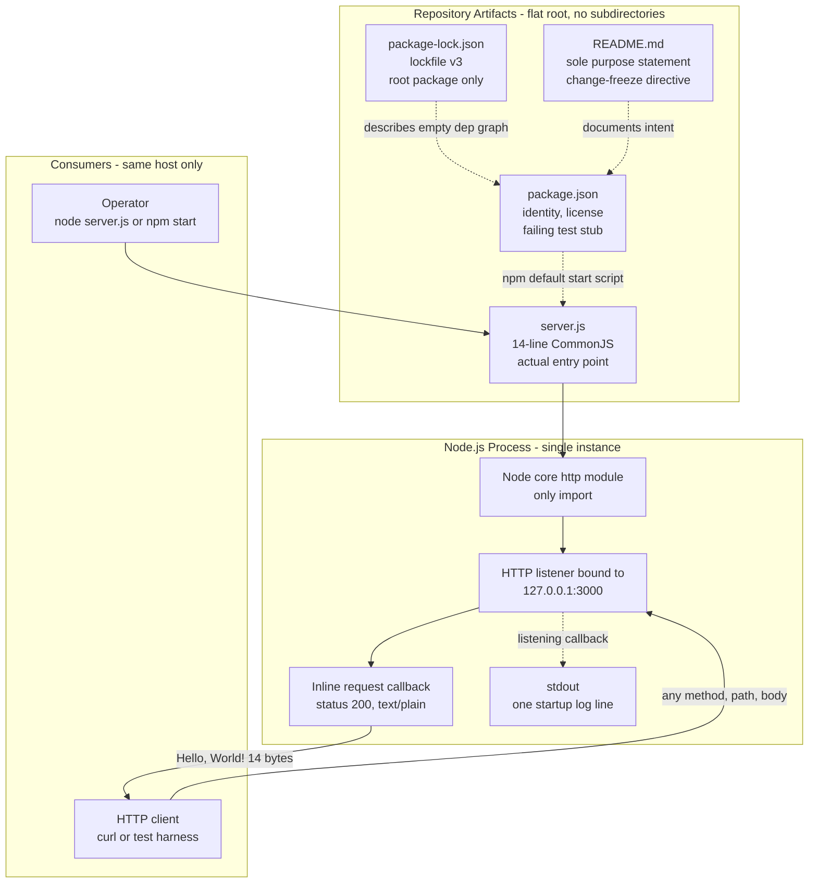
```mermaid
flowchart TB
    subgraph Artifacts["Repository Artifacts - flat root, no subdirectories"]
        Readme["README.md<br/>sole purpose statement<br/>change-freeze directive"]
        Manifest["package.json<br/>identity, license<br/>failing test stub"]
        Lock["package-lock.json<br/>lockfile v3<br/>root package only"]
        Source["server.js<br/>14-line CommonJS<br/>actual entry point"]
    end

    subgraph Runtime["Node.js Process - single instance"]
        HttpMod["Node core http module<br/>only import"]
        Listener["HTTP listener bound to<br/>127.0.0.1:3000"]
        Handler["Inline request callback<br/>status 200, text/plain"]
        Stdout["stdout<br/>one startup log line"]
    end

    subgraph Consumers["Consumers - same host only"]
        Operator["Operator<br/>node server.js or npm start"]
        ClientApp["HTTP client<br/>curl or test harness"]
    end

    Operator --> Source
    Manifest -.->|"npm default start script"| Source
    Lock -.->|"describes empty dep graph"| Manifest
    Readme -.->|"documents intent"| Manifest
    Source --> HttpMod
    HttpMod --> Listener
    Listener --> Handler
    Listener -.->|"listening callback"| Stdout
    ClientApp -->|"any method, path, body"| Listener
    Handler -->|"Hello, World! 14 bytes"| ClientApp
```

#### 1.2.2.3 Core Technical Approach

The technical approach is deliberate minimalism: use the platform's own primitives and add nothing.

- **Runtime and module system.** Plain CommonJS on Node.js, loaded via `require`. No transpiler, bundler, or type system is present, so the source that is committed is exactly the source that executes.
- **No framework.** HTTP is served by Node's core `http` module rather than a web framework, eliminating routing tables, middleware chains, and dependency trees.
- **Configuration by literal.** The bind address and port are module-level `const` bindings, making the network contract statically readable from source.
- **Single anonymous handler.** One callback answers all traffic; there is no dispatch logic to traverse, which is what makes the response contract constant.

```javascript
const server = http.createServer((req, res) => {
  res.statusCode = 200;
  res.setHeader('Content-Type', 'text/plain');
```

- **Start-on-import lifecycle.** The `listen` call executes at module evaluation time, so importing or running the file *is* starting the service; readiness is signalled by the log line in the completion callback.
- **Fail-fast posture.** With no error listener registered, bind failures surface as unhandled exceptions that terminate the process immediately — verified with a deliberate `EADDRINUSE` collision.

### 1.2.3 Success Criteria

#### 1.2.3.1 Measurable Objectives

The repository contains **no** stated objectives, acceptance criteria, service-level agreements, performance budgets, benchmark suites, or monitoring configuration, and its `npm test` script is a hard-coded failure. Consequently, the objectives below are not quoted from the repository — they are the concrete, repeatable verifications that define "working" for this artifact, each paired with the result actually observed during this investigation.

| Objective | Verification Method | Observed Result |
|---|---|---|
| Source is syntactically valid | `node --check server.js` | Passes |
| Process starts and binds | Run `node server.js`; observe stdout | Prints `Server running at http://127.0.0.1:3000/` |
| Endpoint returns the expected contract | `GET http://127.0.0.1:3000/` | `200 OK`, `Content-Type: text/plain`, `Content-Length: 14`, body `Hello, World!\n` |
| Response is request-agnostic | `POST /anything/deep?q=1` with a body; `DELETE /foo` | Byte-identical `200` / `text/plain` / 14-byte responses |
| Exposure is loopback-only | Request the host's routable address on port 3000 | Connection refused, confirming the intended containment |
| Dependency graph stays empty | Inspect `package-lock.json` `packages` map | Only the root `""` entry present |
| Launch path is reproducible | `npm start` | Resolves to `node server.js` and serves `200` |

#### 1.2.3.2 Critical Success Factors

| Success Factor | Why It Is Critical | Anchor in the Repository |
|---|---|---|
| Behavioral invariance | Downstream integrations assert against a fixed response; drift invalidates them | "Do not touch!" directive in `README.md` |
| Zero external dependencies | Preserves reproducibility and removes supply-chain and install-time variance | Empty dependency set in `package.json` and `package-lock.json` |
| Port `3000` availability on the host | The hard-coded bind cannot be relocated, and contention is unhandled | `server.js` line 4; observed `EADDRINUSE` crash |
| Correct launch invocation | The declared `main` is broken, so `node .` fails | Use `node server.js` or `npm start` |
| Co-location of caller and service | Loopback binding forbids remote callers | `server.js` line 3; verified unreachable off-host |
| A Node.js runtime capable of running the code | No `engines` range or `.nvmrc` pins a version | Verified working on the Node.js 22 runtime present in the verification environment |

#### 1.2.3.3 Key Performance Indicators

**The repository defines no KPIs.** There is no metrics endpoint, no instrumentation library, no tracing, no dashboard definition, and no threshold or target value in any file. Publishing numeric targets here would be invention. What the artifact does expose are the following directly observable signals, which a consuming integration may choose to measure externally:

| Observable Signal | Where It Is Observed | Target Defined in Repository |
|---|---|---|
| Startup readiness log line | Process stdout, emitted once from the `listen` callback | None |
| HTTP status code | Response line — constant `200` | None |
| Response body size | `Content-Length: 14` (`Hello, World!\n`) | None |
| Response content type | `Content-Type: text/plain` | None |
| Process exit status | Non-zero on unhandled bind failure; `1` from `npm test` | None |

Anything beyond these signals — latency percentiles, throughput, availability, error budgets — would have to be measured by external tooling that this repository neither includes nor references.


## 1.3 Scope

Scope below reflects what the repository **actually contains and does**, as verified by reading all four files and executing the code. Because the codebase is exhaustively small, the in-scope list is complete rather than representative, and the out-of-scope list enumerates concrete absences confirmed by full-repository inspection.

### 1.3.1 In-Scope

#### 1.3.1.1 Core Features and Functionalities

**Must-have capabilities.** These are the capabilities without which the artifact would not fulfil its stated purpose as an integration-test target.

| # | Must-Have Capability | Implementation |
|---|---|---|
| 1 | Bind an HTTP listener to a known local address and port | `http.createServer(...)` followed by `server.listen(3000, '127.0.0.1', ...)` in `server.js` |
| 2 | Respond `200 OK` to every inbound request | `res.statusCode = 200` in the inline request callback |
| 3 | Declare `text/plain` content type | `res.setHeader('Content-Type', 'text/plain')` |
| 4 | Return the exact body `Hello, World!\n` | `res.end('Hello, World!\n')` — 14 bytes, confirmed via `Content-Length` |
| 5 | Signal readiness on stdout after a successful bind | `console.log` inside the `listen` completion callback |
| 6 | Present valid npm package metadata | `package.json` (name, version, description, author, license) |
| 7 | Guarantee an empty, reproducible dependency graph | `package-lock.json` v3 containing only the root package entry |
| 8 | Document purpose and the change-freeze constraint | `README.md` |

**Primary user workflows.** Only two actors interact with the system: an operator who runs the process, and a same-host HTTP client that calls it.

| Workflow | Steps | Observable Outcome |
|---|---|---|
| Start the service | Run `node server.js`, or `npm start` (which npm resolves to `node server.js` because no explicit `start` script exists) | Startup line `Server running at http://127.0.0.1:3000/` on stdout; process remains in the foreground |
| Exercise the endpoint | Issue any HTTP request to `http://127.0.0.1:3000` from the same host | `200 OK`, `Content-Type: text/plain`, `Content-Length: 14`, body `Hello, World!\n` |
| Confirm request-agnostic behavior | Vary method, path, query string, and body | Byte-identical response every time; verified with `GET /`, `POST /anything/deep?q=1` with a payload, and `DELETE /foo` |
| Inspect package metadata | Read `package.json` / `package-lock.json`, or run npm metadata commands | Identity `hello_world@1.0.0`, MIT license field, zero dependencies |
| Run the declared test command | `npm test` | Prints `Error: no test specified` and exits with code `1` — a deliberate stub, in scope only as documented behavior |
| Stop the service | Terminate the foreground process | Process exits immediately; there is no drain or shutdown hook |

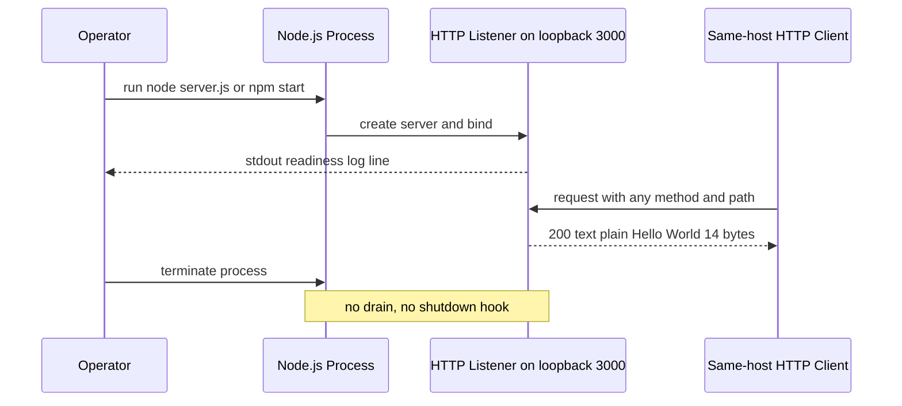
```mermaid
sequenceDiagram
    participant Op as Operator
    participant Proc as Node.js Process
    participant Srv as HTTP Listener on loopback 3000
    participant Cli as Same-host HTTP Client
    Op->>Proc: run node server.js or npm start
    Proc->>Srv: create server and bind
    Srv-->>Op: stdout readiness log line
    Cli->>Srv: request with any method and path
    Srv-->>Cli: 200 text plain Hello World 14 bytes
    Op->>Proc: terminate process
    Note over Proc,Srv: no drain, no shutdown hook
```

**Essential integrations.** The complete integration set is intentionally tiny and is fully in scope:

- Inbound HTTP over TCP on `127.0.0.1:3000`, served by Node's core `http` module.
- The Node.js runtime itself — the only import in the codebase is the built-in `http` module.
- The npm toolchain, via `package.json` and the lockfile, for identity, script execution, and (empty) dependency resolution.
- Process stdout as the readiness channel, and the process exit status as the failure channel.
- Git/GitHub as the distribution mechanism for the source (branch `main` tracking `origin/main`).

**Key technical requirements.**

| Requirement | Specification | Source |
|---|---|---|
| Language and module system | JavaScript, CommonJS (`require`) — no transpilation or type checking | `server.js` line 1 |
| Runtime | Node.js with the standard `http` module; no version range is pinned by the repository | `server.js`; absence of `engines` / `.nvmrc` |
| Bind address | `127.0.0.1` (loopback only) | `server.js` line 3 |
| Port | `3000`, hard-coded and required to be free | `server.js` line 4 |
| Response contract | Status `200`, `Content-Type: text/plain`, body `Hello, World!\n` | `server.js` lines 7–9 |
| Dependencies | Exactly zero, at runtime and in development | `package.json`, `package-lock.json` |
| Launch invocation | `node server.js` or `npm start`; `node .` is unsupported because `main` names a missing `index.js` | Verified `MODULE_NOT_FOUND` failure |
| Change control | Source is frozen — "Do not touch!" | `README.md` |

#### 1.3.1.2 Implementation Boundaries

**System boundary.** The system is a single Node.js process on a single host. Everything inside the boundary is the four repository files and the one process they start; everything outside is out of scope, including the operating system, the Node.js runtime distribution, the terminal that launches the process, any client software that calls the endpoint, and any process supervisor that might restart it.

| Boundary Dimension | What Is Inside Scope | Explicit Limit |
|---|---|---|
| Process | One foreground Node.js process, started by evaluating `server.js` | No clustering, worker threads, or supervisor integration |
| Network | One TCP listener on `127.0.0.1:3000`, inbound only | No outbound calls of any kind; no non-loopback interface |
| Filesystem | Reads none, writes none at runtime | No file, log, or artifact is produced on disk |
| Code surface | Four root files; no subdirectories exist | No modules, packages, or exported APIs |
| Runtime state | The listening socket and per-request response objects only | No sessions, caches, queues, or persisted state |

**User groups covered.** Two groups, neither of which is authenticated or differentiated: operators who start and stop the process, and same-host HTTP clients (interactive tools such as `curl`, or automated harnesses) that issue requests. The repository defines no roles, permissions, accounts, tenants, or personas, and the handler cannot distinguish one caller from another because it never inspects the request.

**Geographic and market coverage.** None is defined or implied. There is no deployment target, region configuration, CDN, DNS name, hosting manifest, or environment matrix anywhere in the repository. Coverage is precisely "the host on which the process runs" — the loopback binding makes geography irrelevant, and there is no market-facing distribution channel beyond the source repository itself.

**Data domains included.** The system holds and processes no domain data. The only data it emits is a single hard-coded 14-byte ASCII string; the only data it receives is discarded unread.

| Data Element | Classification | Handling |
|---|---|---|
| Response body `Hello, World!\n` | Static literal in source | Emitted verbatim to every caller |
| Inbound request line, headers, body | Transient, never read | Ignored entirely; the `req` parameter is unused |
| Startup log line | Operational text on stdout | Written once, not persisted |
| Package metadata (name, version, author, license) | Static configuration | Read only by the npm toolchain |

There is no personal data, no credentials or secrets, no configuration data loaded at runtime, and no persistence layer of any kind.

### 1.3.2 Out-of-Scope

#### 1.3.2.1 Explicitly Excluded Features and Capabilities

Each exclusion below was confirmed by full-file reads of all four files plus an exhaustive filesystem search that returned no matching artifacts.

| Excluded Area | Confirmed Absence |
|---|---|
| Web framework and routing | No Express/Fastify/Koa/Nest; no route table, path matching, or middleware chain — one callback answers everything |
| Request processing | No body parsing, query parsing, header inspection, content negotiation, or input validation; `req` is never read |
| Method and status differentiation | No `405`, `404`, `4xx`, or `5xx` path — every request yields `200` |
| Security controls | No authentication, authorization, sessions, CSRF/CORS handling, rate limiting, or security headers |
| Transport security | No HTTPS/TLS, certificates, or secure-header configuration; traffic is plaintext HTTP |
| Persistence and messaging | No database, ORM, migration, cache, object store, or message broker |
| Configuration management | No `process.env` usage, `.env` file, config module, or CLI flags — host and port are literals |
| Error handling and resilience | No `try/catch`, no `server.on('error')`, no retry, timeout, circuit breaker, or graceful shutdown |
| Observability | No metrics, tracing, structured logging, health/readiness endpoint, or log aggregation — one `console.log` total |
| Automated testing | No test files, runner, fixtures, or assertions; `npm test` is a hard-coded failure exiting `1` |
| Code quality tooling | No ESLint, Prettier, TypeScript, `tsconfig.json`, or editor/style configuration |
| Build and packaging | No compiler, bundler, minifier, or build script; the committed source is executed directly |
| CI/CD and automation | No `.github/` workflows, no pipeline definitions of any kind |
| Containerization and IaC | No `Dockerfile`, compose file, Helm chart, or Terraform/CloudFormation |
| Scalability mechanisms | No clustering, load balancing, autoscaling, or reverse-proxy configuration |
| API contract artifacts | No OpenAPI/Swagger, GraphQL schema, or protobuf definitions |
| Client-side or UI code | No HTML, CSS, templates, static assets, or front-end framework |
| Library consumption | No exports from `server.js`, so the behavior cannot be imported by another module |
| Legal packaging | No `LICENSE` file, `NOTICE`, `CONTRIBUTING`, `CODEOWNERS`, or security policy — MIT exists only as a manifest field |
| Dependency management | No third-party packages, no `.npmrc`, no private registry configuration |

#### 1.3.2.2 Future Phase Considerations

The repository contains **no roadmap, backlog, TODO comment, issue template, milestone, or changelog**, and `README.md` explicitly instructs that the project not be modified. There is therefore no planned future phase to document, and none should be inferred.

For completeness, the items below are the prerequisites that would have to be resolved *before* any functional extension could be undertaken. They are recorded as observed gaps, not as commitments or planned work:

| Prerequisite Gap | Nature of the Gap |
|---|---|
| Entry-point correction | `package.json` `main` references a non-existent `index.js`; `node .` fails today |
| Executable test contract | The `test` script is a deliberate failure, so no change can be validated automatically |
| Externalized configuration | Host and port would have to move out of source literals before any non-default deployment |
| Non-loopback binding decision | Any remote consumer requires changing the bind address, which also introduces security considerations that do not exist today |
| Runtime version policy | No `engines` range or `.nvmrc` establishes which Node.js versions are supported |
| Error-handling strategy | Bind failures currently crash the process unhandled |
| Change-freeze reconciliation | The README directive would need revising, since it currently forbids modification |

#### 1.3.2.3 Integration Points Not Covered

| Integration Point | Status |
|---|---|
| Outbound HTTP or RPC to any service | Not implemented — no HTTP client, no `fetch` usage, no service calls |
| Databases, caches, and message brokers | No drivers, connection strings, or client libraries present |
| Identity providers and secret stores | No OAuth/OIDC/JWT/LDAP integration; no secrets-manager or vault access |
| Telemetry, APM, and log pipelines | No exporters, agents, or collector configuration |
| Service discovery, gateways, and reverse proxies | No registration, ingress definition, or proxy configuration |
| Container orchestration and cloud platforms | No image build, deployment manifest, or platform-specific configuration |
| Package registries beyond public npm defaults | No registry configuration; nothing is published or consumed |
| Webhooks, schedulers, and queues | No inbound webhook handlers, cron definitions, or job processing |
| Non-loopback network clients | Structurally impossible while the bind address remains `127.0.0.1` |

#### 1.3.2.4 Unsupported Use Cases

| Use Case | Why It Is Unsupported |
|---|---|
| Production or internet-facing hosting | Loopback-only bind, plaintext HTTP, no auth, no error handling, no observability, no process supervision |
| Serving distinct content per route or method | The single handler ignores the request and always returns the same 14 bytes |
| Accepting or persisting user input | The request body is never read and there is no storage layer |
| Running multiple concurrent instances on one host | Port `3000` is hard-coded; a second instance crashes with unhandled `EADDRINUSE` |
| Remote or cross-host access | Verified unreachable from the host's routable address |
| Starting via the declared package entry point | `node .` fails with `MODULE_NOT_FOUND` for the missing `index.js` |
| Importing the server as a library | `server.js` exports nothing and starts listening on import |
| Gating a CI pipeline on `npm test` | The script exits `1` by design and can never pass as configured |
| Load, soak, or performance benchmarking as a specified activity | No benchmark harness, performance target, or measurement tooling exists in the repository |
| Serving as a template for feature development | `README.md` forbids modification; the artifact's value depends on remaining unchanged |


## 1.4 References

### 1.4.1 Repository Files and Folders Examined

Every file in the repository was read in full; the inventory below is therefore complete rather than a sample.

- `README.md` - Established the project identity `hao-backprop-test`, the sole statement of purpose ("test project for backprop integration"), and the explicit change-freeze directive ("Do not touch!") that underpins the invariance requirement in 1.2.1.1 and the scope constraints in 1.3.
- `package.json` - Established package identity (`hello_world`, version `1.0.0`), the description "Hello world in Node.js", author `hxu`, the MIT license field, the `main: index.js` entry point that references a non-existent file, the absence of a `start` script, and the deliberately failing `test` script (`echo "Error: no test specified" && exit 1`). Also established the absence of `dependencies`, `devDependencies`, and an `engines` range.
- `package-lock.json` - Established lockfile version 3 with a `packages` map containing only the root `""` entry, proving an empty third-party dependency graph and confirming the MIT license declaration.
- `server.js` - Established the entire executable behavior: the single built-in `http` import, the hard-coded `hostname` (`127.0.0.1`) and `port` (`3000`) constants, the inline request callback setting status `200` / `Content-Type: text/plain` / body `Hello, World!\n`, the `server.listen` call with its startup `console.log`, and the absence of exports, routing, request inspection, error handling, and shutdown logic.
- `/` (repository root folder) - Established the flat structure: exactly four tracked files and **no subdirectories**, confirming there are no `src/`, `lib/`, `test/`, `.github/`, or configuration folders and that no deeper traversal is possible.

### 1.4.2 Verification Activities Performed

The following inspections and executions supplied the empirical evidence cited throughout this section.

| Activity | What It Confirmed |
|---|---|
| `git ls-files`, `find` over the checkout | The four-file inventory; zero subdirectories; no `.gitignore`, `LICENSE`, CI workflow, `Dockerfile`, TypeScript, test, or `.env` artifacts; no `index.js` |
| `git log` / `git remote -v` | Single commit `ab2aed6` ("Add files via upload") on branch `main`, tracking `origin/main` at `Sandeep01Kumar/Existing-product-30-july-branch-main-02` |
| `node --check server.js` | The single source file is syntactically valid |
| `node server.js` plus HTTP requests (`GET /`, `POST /anything/deep?q=1` with a body, `DELETE /foo`) | The startup log line, and byte-identical `200` / `text/plain` / `Content-Length: 14` / `Hello, World!\n` responses regardless of method, path, query, or payload |
| Request to the host's routable address on port `3000` | Connection refused — loopback-only exposure |
| `npm test` | Prints `Error: no test specified` and exits with code `1` |
| `node .` | Fails with `MODULE_NOT_FOUND` for the missing `index.js` declared as `main` |
| `npm start` | Succeeds via npm's built-in default script, running `node server.js` and serving `200` |
| Second instance while port `3000` was occupied | Unhandled `Error: listen EADDRINUSE: address already in use 127.0.0.1:3000`, terminating the process |
| Filesystem-wide search for `.blitzyignore` | No such file exists, so no documentation exclusions applied |

### 1.4.3 External and Cross-Document Sources

- **No external web sources are cited in this section.** A single web lookup for current Node.js release lines was attempted and the search facility was unavailable; consequently every statement in section 1 rests solely on repository evidence and the in-environment verifications listed above. Where a runtime version is mentioned (Node.js 22 in the verification environment), it is reported as an environment observation, not as a repository-declared requirement.
- **No other Technical Specification sections were available for cross-reference** at the time of authoring, as section 1 is the first section of this document. Detailed treatment of the technology stack, architecture, and operational concerns is deferred to the relevant later sections.


# 2. Product Requirements

## 2.1 Feature Catalog

The repository contains **no requirements document, backlog, issue template, roadmap, or acceptance-criteria file**. Every feature below was therefore reverse-derived from artifacts that exist in the repository — the four root files `server.js`, `package.json`, `package-lock.json`, and `README.md` — and from behavior observed by executing the code. Nothing is included that could not be traced to a specific file and line range.

Because the executable surface is a single 14-line module, the catalog is **exhaustive rather than representative**: the nine features below account for every observable capability of the artifact. Features are deliberately decomposed to the level at which each can be independently tested, which is why the response contract (F-002) and its request-invariance property (F-003) are catalogued separately even though both are realised by the same handler.

### 2.1.1 Feature Inventory

| ID | Feature Name | Category | Priority |
|---|---|---|---|
| F-001 | HTTP Listener Lifecycle | Runtime & Network Service | Critical |
| F-002 | Constant HTTP Response Contract | HTTP Response Contract | Critical |
| F-003 | Request-Agnostic Deterministic Handling | HTTP Response Contract | Critical |
| F-004 | Startup Readiness Signal | Observability | High |
| F-005 | Static Network Binding Configuration | Configuration | High |
| F-006 | npm Package Identity and Metadata | Packaging & Metadata | Medium |
| F-007 | Zero-Dependency Locked Supply Chain | Dependency Management | High |
| F-008 | npm Lifecycle Script Surface | Developer Tooling | Low |
| F-009 | Purpose Documentation and Change-Freeze Directive | Documentation & Governance | Medium |

| ID | Status | Primary Source Anchor |
|---|---|---|
| F-001 | Completed | `server.js` L1, L6, L10, L12, L14 |
| F-002 | Completed | `server.js` L7–L9 |
| F-003 | Completed | `server.js` L6 (`req` never dereferenced), L7–L9 |
| F-004 | Completed | `server.js` L12–L14 |
| F-005 | Completed | `server.js` L3–L4, consumed at L12–L13 |
| F-006 | Completed | `package.json` L2–L5, L9–L10 |
| F-007 | Completed | `package.json` (no dependency keys); `package-lock.json` L4–L12 |
| F-008 | Completed — `test` is a deliberate non-functional stub | `package.json` L6–L8 |
| F-009 | Completed | `README.md` L1–L2 |

All nine features carry the status **Completed** because each is present in the committed source and behaves exactly as written; this was confirmed by executing the artifact. No feature is in a Proposed, Approved, or In-Development state — the repository has a single commit (`ab2aed6`), no branches beyond `main`, and no tags, so there is no in-flight work to report. The one qualification is F-008, where the `test` script is *implemented* but is a hard-coded failure by construction; that distinction is carried through to §2.2 and §2.5 rather than being softened here.

### 2.1.2 F-001: HTTP Listener Lifecycle

**Metadata**

| Attribute | Value |
|---|---|
| Unique ID | F-001 |
| Feature Name | HTTP Listener Lifecycle |
| Feature Category | Runtime & Network Service |
| Priority Level | Critical |
| Status | Completed |

**Description**

| Dimension | Detail |
|---|---|
| Overview | Creates a TCP/HTTP listener with Node's core `http` module and binds it to the configured loopback host and port during module evaluation. `server.js` L1 requires `http`, L6 calls `http.createServer(...)`, and L12 calls `server.listen(port, hostname, callback)`. Binding occurs as a side effect of loading the file, so running the module *is* starting the service. |
| Business Value | Provides the live network endpoint that the "backprop" integration exercise (`README.md` L2) needs in order to exercise a real request/response cycle rather than a mock. |
| User Benefits | An operator obtains a running endpoint from one command (`node server.js` or `npm start`) with no install, build, or configuration step. |
| Technical Context | CommonJS module, no framework, no clustering, no worker threads, and no process supervision. There is no `server.on('error')` handler, no `server.close()`, and no `SIGTERM`/`SIGINT` handler anywhere in the file (grep for all of these returns zero matches), so bind failure terminates the process and shutdown is abrupt. |

**Dependencies**

| Dependency Class | Detail |
|---|---|
| Prerequisite Features | F-005 (Static Network Binding Configuration) — the `hostname` and `port` constants at L3–L4 are the arguments passed to `listen` at L12. |
| System Dependencies | A Node.js runtime providing the built-in `http` module; an available TCP port `3000` on the loopback interface of the host. |
| External Dependencies | None. `require('http')` at L1 is the only import in the repository, and `npm ls --all` reports `(empty)`. |
| Integration Requirements | Inbound HTTP over TCP on `127.0.0.1:3000`. Callers must be co-located on the same host: a request to the host's routable address on port 3000 fails to connect, which was verified against the container's routable IP. |

### 2.1.3 F-002: Constant HTTP Response Contract

**Metadata**

| Attribute | Value |
|---|---|
| Unique ID | F-002 |
| Feature Name | Constant HTTP Response Contract |
| Feature Category | HTTP Response Contract |
| Priority Level | Critical |
| Status | Completed |

**Description**

| Dimension | Detail |
|---|---|
| Overview | Every response is produced by three consecutive statements in the inline handler: `res.statusCode = 200` (L7), `res.setHeader('Content-Type', 'text/plain')` (L8), and `res.end('Hello, World!\n')` (L9). The emitted body is 14 bytes, which Node reports as `Content-Length: 14`. |
| Business Value | Gives downstream integrations a fixed, byte-exact contract to assert against; because the payload never varies, assertions can be exact-match and cannot become flaky on content. |
| User Benefits | A caller can validate the full contract — status line, content type, and body — with a single request and no parsing logic. |
| Technical Context | There is no status-code branching, no `404`/`405`/`5xx` path, no content negotiation, and no templating. The only header set by application code is `Content-Type`; `Date`, `Connection`, `Keep-Alive`, and `Content-Length` are contributed automatically by Node's `http` module and were observed in the response. |

**Dependencies**

| Dependency Class | Detail |
|---|---|
| Prerequisite Features | F-001 (HTTP Listener Lifecycle) — the handler is invoked only through the listener created at L6 and bound at L12. |
| System Dependencies | Node's `http` module response object (`ServerResponse`) for `statusCode`, `setHeader`, and `end`. |
| External Dependencies | None. |
| Integration Requirements | Any HTTP client capable of reading a status line, headers, and a plain-text body. No authentication, negotiation, or handshake beyond HTTP itself is required. |

### 2.1.4 F-003: Request-Agnostic Deterministic Handling

**Metadata**

| Attribute | Value |
|---|---|
| Unique ID | F-003 |
| Feature Name | Request-Agnostic Deterministic Handling |
| Feature Category | HTTP Response Contract |
| Priority Level | Critical |
| Status | Completed |

**Description**

| Dimension | Detail |
|---|---|
| Overview | The handler signature at L6 is `(req, res)`, but `req` is never referenced in L7–L9. Consequently the HTTP method, path, query string, headers, and body have no effect on the response. Verified with `GET /`, `POST /anything/deep?q=1` carrying an `X-Custom` header and a `payload=ignored` body, `DELETE /foo`, and `HEAD /` — all returned status `200`, `text/plain`, and a 14-byte body. |
| Business Value | Determinism is the property that makes the artifact usable as a control fixture: a test can vary its request arbitrarily and still expect one known answer, so a failed assertion always indicates an environmental or integration fault rather than input-dependent logic. |
| User Benefits | No route table, API schema, or request-shaping knowledge is needed; any request the client can form is valid. |
| Technical Context | Implemented by omission rather than by explicit code — there is no router, no middleware chain, no body parser, and no query parser. This also means the service cannot distinguish one caller from another and can never return a client-error status. |

**Dependencies**

| Dependency Class | Detail |
|---|---|
| Prerequisite Features | F-002 (Constant HTTP Response Contract) — invariance is a property *of* that constant response; both are produced by the same handler block at L6–L10. |
| System Dependencies | None beyond the listener that dispatches to the handler. |
| External Dependencies | None. |
| Integration Requirements | None. Any well-formed HTTP request is accepted; malformed framing is handled by Node's `http` parser, not by application code. |

### 2.1.5 F-004: Startup Readiness Signal

**Metadata**

| Attribute | Value |
|---|---|
| Unique ID | F-004 |
| Feature Name | Startup Readiness Signal |
| Feature Category | Observability |
| Priority Level | High |
| Status | Completed |

**Description**

| Dimension | Detail |
|---|---|
| Overview | The `listen` completion callback (L12–L14) writes a single line to stdout via `console.log`, using a template literal that interpolates the configuration constants: the observed output is exactly `Server running at http://127.0.0.1:3000/`. |
| Business Value | Supplies the only machine-observable readiness gate the artifact has. An automation harness can wait for this line before issuing requests instead of polling blindly. |
| User Benefits | The operator receives immediate, unambiguous confirmation of both success and the exact URL to call. |
| Technical Context | This is the complete observability surface of the system. There is no structured logging, log level, metrics endpoint, tracing, health/readiness route, request logging, or log file — a single `console.log` is the only output statement in the codebase. |

**Dependencies**

| Dependency Class | Detail |
|---|---|
| Prerequisite Features | F-001 (the callback fires only after a successful bind) and F-005 (the interpolated host and port come from L3–L4). |
| System Dependencies | Process stdout must be attached and writable. |
| External Dependencies | None; no log shipper, collector, or telemetry exporter is present. |
| Integration Requirements | Consumers must scrape process stdout. Because the line is emitted once and is not persisted anywhere, a harness must capture it at launch time. |

### 2.1.6 F-005: Static Network Binding Configuration

**Metadata**

| Attribute | Value |
|---|---|
| Unique ID | F-005 |
| Feature Name | Static Network Binding Configuration |
| Feature Category | Configuration |
| Priority Level | High |
| Status | Completed |

**Description**

| Dimension | Detail |
|---|---|
| Overview | Two immutable module-level bindings declare the entire network contract: `const hostname = '127.0.0.1'` (L3) and `const port = 3000` (L4). They are consumed by `server.listen` (L12) and by the readiness log line (L13). |
| Business Value | The network contract is statically readable from source, so a consumer knows the exact endpoint without inspecting the running process, environment, or any external configuration store. |
| User Benefits | Zero configuration to supply at launch; the endpoint is identical on every host and every run. |
| Technical Context | Configuration is intentionally not externalised. `server.js` contains zero `process.env` reads, there is no CLI-argument parsing, no `.env` file, no config module, and no `engines` or `.nvmrc` runtime pin anywhere in the repository. Changing the host or port therefore requires editing source, which `README.md` L2 forbids. |

**Dependencies**

| Dependency Class | Detail |
|---|---|
| Prerequisite Features | None — this is the base configuration layer that F-001 and F-004 consume. |
| System Dependencies | The declared host must exist on the machine (loopback always does) and the declared port must be free. |
| External Dependencies | None; no secrets manager, parameter store, or configuration service is referenced. |
| Integration Requirements | Every integrating component must hard-code or derive the same `127.0.0.1:3000` target, because the artifact offers no discovery mechanism and no way to advertise an alternative address. |

### 2.1.7 F-006: npm Package Identity and Metadata

**Metadata**

| Attribute | Value |
|---|---|
| Unique ID | F-006 |
| Feature Name | npm Package Identity and Metadata |
| Feature Category | Packaging & Metadata |
| Priority Level | Medium |
| Status | Completed |

**Description**

| Dimension | Detail |
|---|---|
| Overview | The 11-line `package.json` declares `name: hello_world` (L2), `version: 1.0.0` (L3), `description: "Hello world in Node.js"` (L4), `main: index.js` (L5), `author: hxu` (L9), and `license: MIT` (L10). `npm ls` resolves the package as `hello_world@1.0.0`. |
| Business Value | Gives the artifact a stable, version-pinned identity that a test harness or inventory process can reference, and makes the package addressable by the npm toolchain. |
| User Benefits | Standard npm commands (`npm ls`, `npm start`, `npm test`) work against the project without additional setup. |
| Technical Context | Three different identifiers refer to this one artifact — the README project name `hao-backprop-test`, the npm package name `hello_world`, and the Git remote name; no file reconciles them. Two declarations do not match reality: `main` names an `index.js` that does not exist (confirmed absent), and the MIT license exists only as a manifest field with no `LICENSE` file shipped (also confirmed absent). Both are tracked as defects in §2.5. |

**Dependencies**

| Dependency Class | Detail |
|---|---|
| Prerequisite Features | None. |
| System Dependencies | A JSON parser and the npm CLI for metadata resolution. |
| External Dependencies | None; the package is not published to, or consumed from, any registry, and no `.npmrc` or registry configuration exists. |
| Integration Requirements | Consistency with `package-lock.json` (F-007), which repeats `name`, `version`, and `license` for the root package; the two files agree on `hello_world@1.0.0` / MIT. |

### 2.1.8 F-007: Zero-Dependency Locked Supply Chain

**Metadata**

| Attribute | Value |
|---|---|
| Unique ID | F-007 |
| Feature Name | Zero-Dependency Locked Supply Chain |
| Feature Category | Dependency Management |
| Priority Level | High |
| Status | Completed |

**Description**

| Dimension | Detail |
|---|---|
| Overview | `package.json` declares neither `dependencies` nor `devDependencies`, and `package-lock.json` (L4–L12) is a lockfile-version-3 file whose `packages` map contains only the root `""` entry. `npm ls --all` prints `hello_world@1.0.0` followed by `(empty)`, and no `node_modules` directory exists. |
| Business Value | Eliminates supply-chain and version-drift risk from the integration exercise: there is nothing to install, nothing to resolve, and no transitive package that could change behavior between runs. |
| User Benefits | The project runs immediately after clone with no `npm install` step and no network access to a registry. |
| Technical Context | The lockfile still asserts `requires: true` (L5) and repeats the root identity, so it is a valid lockfile that formally records an empty graph rather than an absent one. The single library the code uses — Node's `http` — is part of the runtime and therefore never appears in the dependency graph. |

**Dependencies**

| Dependency Class | Detail |
|---|---|
| Prerequisite Features | F-006 (npm Package Identity and Metadata) — the lockfile's root entry mirrors the manifest's name, version, and license. |
| System Dependencies | The npm CLI for lockfile interpretation; a Node.js runtime whose standard library supplies `http`. |
| External Dependencies | None by design. This is the feature's defining property. |
| Integration Requirements | Any build or CI process must tolerate an install step that resolves nothing; verification of this feature is a static inspection of the lockfile rather than an install. |

### 2.1.9 F-008: npm Lifecycle Script Surface

**Metadata**

| Attribute | Value |
|---|---|
| Unique ID | F-008 |
| Feature Name | npm Lifecycle Script Surface |
| Feature Category | Developer Tooling |
| Priority Level | Low |
| Status | Completed — the `test` script is a deliberate non-functional stub |

**Description**

| Dimension | Detail |
|---|---|
| Overview | The manifest's `scripts` block (L6–L8) contains exactly one entry: `test`, defined as `echo "Error: no test specified" && exit 1`. Running `npm test` prints that message and exits with code `1`. No `start` script is declared, yet `npm start` works because npm falls back to its built-in default and runs `node server.js`, producing the readiness line and a serving endpoint. |
| Business Value | Provides a conventional launch entry point (`npm start`) without adding configuration, and makes the *absence* of a test suite explicit and machine-detectable rather than silent. |
| User Benefits | Operators can start the service with the idiomatic npm command; the failing `test` output states plainly why nothing was verified. |
| Technical Context | This is the artifact's weakest surface. The `test` script can never pass as written, so no regression safety net exists and any pipeline gated on `npm test` fails by construction. Separately, `node .` — the invocation that follows the declared `main` — fails with `MODULE_NOT_FOUND` for the missing `index.js`, so the supported launch paths are `node server.js` and `npm start` only. |

**Dependencies**

| Dependency Class | Detail |
|---|---|
| Prerequisite Features | F-006 (the scripts live in the manifest) and, for the launch path, F-001 (the script's target is the listener module). |
| System Dependencies | The npm CLI and a POSIX-compatible shell for `echo` and `&&`; the Node.js runtime for the `start` fallback. |
| External Dependencies | None; no test runner, assertion library, or CI service is present or referenced. |
| Integration Requirements | Automation must treat `npm test` as a known non-zero exit and must not use `node .`. Verification of the artifact has to be performed by external means (an HTTP request), because the repository ships no executable test. |

### 2.1.10 F-009: Purpose Documentation and Change-Freeze Directive

**Metadata**

| Attribute | Value |
|---|---|
| Unique ID | F-009 |
| Feature Name | Purpose Documentation and Change-Freeze Directive |
| Feature Category | Documentation & Governance |
| Priority Level | Medium |
| Status | Completed |

**Description**

| Dimension | Detail |
|---|---|
| Overview | `README.md` is two lines: the project name `hao-backprop-test` (L1) and the statement `test project for backprop integration. Do not touch!` (L2). That single sentence is simultaneously the only declaration of purpose in the repository and its only governance control. |
| Business Value | Establishes the artifact as a frozen baseline. Because downstream integrations assert against fixed behavior, the change-freeze directive is what allows those assertions to remain valid over time. |
| User Benefits | A newcomer learns the project's entire intent and the constraint on modifying it in one sentence, with no documentation set to traverse. |
| Technical Context | The freeze is a social control, not a technical one — there is no `CODEOWNERS`, branch-protection artifact, `CONTRIBUTING` guide, lint gate, or passing test to enforce it. It is enforceable in practice only by comparing the committed files against a known baseline; the working tree is clean at commit `ab2aed6`, and SHA-256 digests for all four files are recorded in §2.5 for exactly that purpose. |

**Dependencies**

| Dependency Class | Detail |
|---|---|
| Prerequisite Features | None. |
| System Dependencies | None; the file is static Markdown read by humans. |
| External Dependencies | The "backprop" integration process named in L2 is external to this repository and is not defined, configured, or referenced anywhere in the code. |
| Integration Requirements | The directive constrains every other feature: F-002, F-003, and F-005 can only be treated as fixed contracts for as long as the freeze holds. Any change to `server.js` invalidates the response contract that consumers assert against. |


## 2.2 Functional Requirements Table

Each feature from §2.1 is decomposed below into numbered requirements using the format `F-XXX-RQ-YYY`. Every acceptance criterion is stated as an operation that can be executed against the artifact and produces a deterministic result; each was verified during the investigation, either by reading the exact source line or by running the code.

Two conventions apply throughout. First, **no performance target is quoted** where the repository defines none — the codebase contains no benchmark, threshold, timeout, budget, or SLA in any file, so the "Performance Criteria" rows state what was observed and record the absence of a declared target. Second, requirements describe contracts the artifact **actually satisfies**; declared behavior that does *not* work is tracked separately in §2.2.10 so that the gap is visible without being misrepresented as a met requirement.

### 2.2.1 F-001 — HTTP Listener Lifecycle

**Requirement Details**

| Requirement ID | Description | Acceptance Criteria |
|---|---|---|
| F-001-RQ-001 | Instantiate an HTTP server using only the Node.js core `http` module | `server.js` L1 is the only `require` in the repository and L6 calls `http.createServer`; `node --check server.js` passes; no framework package appears in the dependency graph |
| F-001-RQ-002 | Bind the listener during module evaluation, so that loading the module starts the service | Running `node server.js` produces an accepting listener with no further action; a request issued after the readiness line returns `200` |
| F-001-RQ-003 | Accept connections only on the loopback interface | A request to `127.0.0.1:3000` returns `200`; a request to the host's routable address on port `3000` fails to connect (observed HTTP status `000`, "Couldn't connect to server") |
| F-001-RQ-004 | Terminate with a non-zero exit status when the port cannot be bound | With port `3000` occupied, a second instance emits an unhandled `error` event — `Error: listen EADDRINUSE: address already in use 127.0.0.1:3000`, `code: 'EADDRINUSE'`, `errno: -98` — and the process exits non-zero |
| F-001-RQ-005 | Continue serving until externally terminated, without draining in-flight work | The process stays in the foreground after the readiness line and keeps answering requests; `server.js` contains no `SIGTERM`/`SIGINT` handler and no `server.close()` call, so termination is abrupt |

| Requirement ID | Priority | Complexity |
|---|---|---|
| F-001-RQ-001 | Must-Have | Low |
| F-001-RQ-002 | Must-Have | Low |
| F-001-RQ-003 | Must-Have | Low |
| F-001-RQ-004 | Must-Have | Low |
| F-001-RQ-005 | Must-Have | Low |

**Technical Specifications**

| Aspect | Specification |
|---|---|
| Input Parameters | `server.listen(port, hostname, callback)` at L12 — `port` = `3000` (number), `hostname` = `'127.0.0.1'` (string), `callback` = zero-argument arrow function. No command-line arguments or environment variables are read. |
| Output/Response | A bound listening socket on the loopback interface, plus the readiness line described by F-004. On failure, an unhandled `Error` carrying `code: 'EADDRINUSE'`. |
| Performance Criteria | None declared anywhere in the repository. Observed characteristics: one process, one event loop, no clustering or worker threads, and Node's default keep-alive behavior (`Keep-Alive: timeout=5` appeared in responses). No connection limit, socket timeout, or throughput target is set in code. |
| Data Requirements | None. No filesystem read or write occurs at runtime; the only runtime state is the listening socket and per-request response objects. |

**Validation Rules**

| Rule Class | Specification |
|---|---|
| Business Rules | Exactly one instance can run per host because the port is a fixed literal; the caller must be co-located with the process because the bind address is loopback. |
| Data Validation | None performed by application code. HTTP framing and protocol validation are delegated entirely to Node's `http` parser. |
| Security Requirements | The loopback bind is the only containment control implemented. There is no TLS, authentication, authorization, rate limiting, request-size limit, or security header, and no error handler to prevent a crash on bind failure. |
| Compliance Requirements | None declared. No policy, standard, regulation, or control framework is referenced in any file of the repository. |

### 2.2.2 F-002 — Constant HTTP Response Contract

**Requirement Details**

| Requirement ID | Description | Acceptance Criteria |
|---|---|---|
| F-002-RQ-001 | Set HTTP status `200` on every response | Status `200` observed for `GET /`, `POST /anything/deep?q=1`, `DELETE /foo`, and `HEAD /`; L7 is the only status assignment in the codebase |
| F-002-RQ-002 | Set `Content-Type: text/plain` on every response | The header is present and exactly `text/plain` in every observed response; produced by the single `res.setHeader` call at L8 |
| F-002-RQ-003 | Terminate every response with the exact 14-byte body `Hello, World!\n` | Response body is byte-identical across all observed requests and `Content-Length: 14` is returned; a byte count of the literal confirms 14 bytes including the trailing newline |
| F-002-RQ-004 | Set no application response headers beyond `Content-Type` | Application code contains exactly one `setHeader` call; the remaining observed headers (`Date`, `Connection: keep-alive`, `Keep-Alive: timeout=5`, `Content-Length`) are contributed by Node's `http` module |

| Requirement ID | Priority | Complexity |
|---|---|---|
| F-002-RQ-001 | Must-Have | Low |
| F-002-RQ-002 | Must-Have | Low |
| F-002-RQ-003 | Must-Have | Low |
| F-002-RQ-004 | Should-Have | Low |

**Technical Specifications**

| Aspect | Specification |
|---|---|
| Input Parameters | Only the `res` (`ServerResponse`) object supplied by the listener. No value in the response is derived from the request. |
| Output/Response | `HTTP/1.1 200 OK`; headers `Content-Type: text/plain` and `Content-Length: 14` plus Node-supplied `Date`, `Connection: keep-alive`, `Keep-Alive: timeout=5`; body `Hello, World!\n`. |
| Performance Criteria | None declared. The response is a constant literal, so serving it requires no I/O, no computation, and no lookup — the handler performs three statements and returns. |
| Data Requirements | A single static ASCII string literal in source (L9). There is no data store, cache, template, or externalised content file. |

**Validation Rules**

| Rule Class | Specification |
|---|---|
| Business Rules | The response is invariant. Any deviation in status code, content type, or body bytes is a contract breach for downstream assertions and would violate the change freeze recorded in F-009. |
| Data Validation | No output schema or validation exists. Validation is unnecessary in practice because the body is a compile-time literal that cannot vary at runtime. |
| Security Requirements | The body contains no user data, no secrets, and no reflected request content, so there is no injection or information-leakage vector through the response. No security headers (for example HSTS, CSP, or `X-Content-Type-Options`) are set. |
| Compliance Requirements | None declared. |

### 2.2.3 F-003 — Request-Agnostic Deterministic Handling

**Requirement Details**

| Requirement ID | Description | Acceptance Criteria |
|---|---|---|
| F-003-RQ-001 | The response must not vary with the HTTP method | `GET`, `POST`, `DELETE`, and `HEAD` all returned status `200` with `Content-Type: text/plain`, and a 14-byte body for the body-bearing methods |
| F-003-RQ-002 | The response must not vary with path or query string | `GET /` and `POST /anything/deep?q=1` produced identical status, content type, and body |
| F-003-RQ-003 | Request headers and body must be ignored and never parsed | The `req` parameter declared at L6 is never dereferenced in L7–L9; a request carrying header `X-Custom: abc` and body `payload=ignored` returned the identical response |
| F-003-RQ-004 | No request may cause application code to emit a non-`200` status | L7 is the only status assignment; the file contains no `404`, `405`, `4xx`, or `5xx` branch, and no conditional logic of any kind |

| Requirement ID | Priority | Complexity |
|---|---|---|
| F-003-RQ-001 | Must-Have | Low |
| F-003-RQ-002 | Must-Have | Low |
| F-003-RQ-003 | Must-Have | Low |
| F-003-RQ-004 | Must-Have | Low |

**Technical Specifications**

| Aspect | Specification |
|---|---|
| Input Parameters | `req` (`IncomingMessage`) is received by the handler but unused; functionally the feature consumes no input. |
| Output/Response | Identical in every case to the F-002 contract. |
| Performance Criteria | None declared. Because nothing is parsed, per-request application work is constant and independent of request size; a request body is received by Node but never read by application code. |
| Data Requirements | None. No request datum is read, retained, logged, or persisted. |

**Validation Rules**

| Rule Class | Specification |
|---|---|
| Business Rules | Determinism is the fixture's core guarantee. The service cannot differentiate callers, tenants, routes, or methods, and therefore has exactly one behavior for exactly one class of caller. |
| Data Validation | Explicitly absent. No input validation, sanitisation, size limit, content-type check, or query parsing is performed by application code. |
| Security Requirements | Because input is never read, it cannot be injected into the response or into any downstream system. Conversely, there is no method allow-listing, request-size limiting, or abuse control in application code. |
| Compliance Requirements | None declared. Request data is never stored, so no retention or data-subject obligation arises from this feature. |

### 2.2.4 F-004 — Startup Readiness Signal

**Requirement Details**

| Requirement ID | Description | Acceptance Criteria |
|---|---|---|
| F-004-RQ-001 | Emit exactly one readiness line to stdout after a successful bind | Process stdout contains `Server running at http://127.0.0.1:3000/` exactly once per start, written from the `listen` completion callback at L12–L14 |
| F-004-RQ-002 | Derive the readiness line from the same constants used for binding | L13 is a template literal interpolating `${hostname}` and `${port}` from L3–L4, so the logged URL cannot diverge from the address actually bound at L12 |
| F-004-RQ-003 | Emit no per-request or shutdown logging | The `console.log` at L13 is the only output statement in the repository; no output was produced while serving requests or on termination |

| Requirement ID | Priority | Complexity |
|---|---|---|
| F-004-RQ-001 | Must-Have | Low |
| F-004-RQ-002 | Should-Have | Low |
| F-004-RQ-003 | Should-Have | Low |

**Technical Specifications**

| Aspect | Specification |
|---|---|
| Input Parameters | None — the `listen` callback takes no arguments. |
| Output/Response | One line of unstructured text on stdout (file descriptor 1), newline-terminated. |
| Performance Criteria | None declared. The line is emitted once at startup; no logging occurs on the request path, so logging contributes nothing to per-request cost. |
| Data Requirements | No log persistence, rotation, or aggregation. The line exists only in the process's stdout stream and is not written to disk. |

**Validation Rules**

| Rule Class | Specification |
|---|---|
| Business Rules | The line is the readiness contract: a harness may treat its appearance as the signal that traffic can be sent. Absence of the line means the bind did not succeed. |
| Data Validation | None. The string is produced by interpolation and is neither validated nor schema-checked. |
| Security Requirements | The line discloses only the loopback bind address. No credentials, tokens, request data, or stack traces are logged by application code. |
| Compliance Requirements | None declared. The repository states no audit-logging, log-retention, or traceability obligation. |

### 2.2.5 F-005 — Static Network Binding Configuration

**Requirement Details**

| Requirement ID | Description | Acceptance Criteria |
|---|---|---|
| F-005-RQ-001 | Declare the bind host as an immutable module-level constant with value `127.0.0.1` | `server.js` L3 reads `const hostname = '127.0.0.1';` |
| F-005-RQ-002 | Declare the bind port as an immutable module-level constant with value `3000` | `server.js` L4 reads `const port = 3000;` |
| F-005-RQ-003 | Provide no runtime mechanism to override the declared values | `server.js` contains zero `process.env` reads; there is no command-line argument parsing, and the repository contains no `.env`, config file, `.npmrc`, or `.nvmrc` |
| F-005-RQ-004 | Use the declared values as the single source of truth for both binding and logging | L12 passes both constants to `listen`; L13 interpolates the same two constants into the readiness line |

| Requirement ID | Priority | Complexity |
|---|---|---|
| F-005-RQ-001 | Must-Have | Low |
| F-005-RQ-002 | Must-Have | Low |
| F-005-RQ-003 | Must-Have | Low |
| F-005-RQ-004 | Should-Have | Low |

**Technical Specifications**

| Aspect | Specification |
|---|---|
| Input Parameters | None. Both values are literals in source; no configuration input channel exists. |
| Output/Response | Two in-memory constants consumed by F-001 (binding) and F-004 (logging). |
| Performance Criteria | None declared. Configuration resolution involves no I/O and completes as part of module parsing. |
| Data Requirements | No configuration store, schema, or defaults file. The repository also declares no `engines` range, so no runtime-version constraint is expressed. |

**Validation Rules**

| Rule Class | Specification |
|---|---|
| Business Rules | Host and port are frozen under F-009; relocating the service to another address or port requires a source change, which the README directive forbids. |
| Data Validation | None. The values are not range-checked or validated; an invalid value would surface only as a bind error at runtime. |
| Security Requirements | The `127.0.0.1` literal is the single most consequential security control in the artifact — it is what makes the service unreachable from any other host. |
| Compliance Requirements | None declared. No secret or credential appears in configuration, so no secret-management obligation arises. |

### 2.2.6 F-006 — npm Package Identity and Metadata

**Requirement Details**

| Requirement ID | Description | Acceptance Criteria |
|---|---|---|
| F-006-RQ-001 | Provide a parseable npm manifest declaring name, version, description, author, and license | `package.json` parses as valid JSON; fields present at L2–L4 and L9–L10; `npm ls` resolves the package as `hello_world@1.0.0` |
| F-006-RQ-002 | Pin the version to a fixed semantic version that is consistent across manifest and lockfile | `1.0.0` appears at `package.json` L3 and at `package-lock.json` L3 and L9 |
| F-006-RQ-003 | Declare the MIT license in package metadata | `"license": "MIT"` appears at `package.json` L10 and `package-lock.json` L10 |

| Requirement ID | Priority | Complexity |
|---|---|---|
| F-006-RQ-001 | Must-Have | Low |
| F-006-RQ-002 | Must-Have | Low |
| F-006-RQ-003 | Should-Have | Low |

**Technical Specifications**

| Aspect | Specification |
|---|---|
| Input Parameters | None at runtime; the manifest is read by the npm CLI, not by `server.js`. |
| Output/Response | Package identity surfaced to npm — for example the `> hello_world@1.0.0 test` and `> hello_world@1.0.0 start` banners observed when running the scripts. |
| Performance Criteria | None declared. |
| Data Requirements | Static JSON of 251 bytes. It must remain valid JSON for any npm command to execute. |

**Validation Rules**

| Rule Class | Specification |
|---|---|
| Business Rules | Manifest identity must match the lockfile root entry (F-007); the two agree on `hello_world@1.0.0` and MIT. Because nothing is published to a registry, the package name need not be globally unique. |
| Data Validation | Performed only by npm's own manifest handling; nothing in the repository validates or lints the manifest. |
| Security Requirements | The manifest contains no credentials, tokens, or registry authentication, and no `.npmrc` exists. It also declares no lifecycle hooks, so no code executes implicitly on install. |
| Compliance Requirements | MIT is asserted as a metadata field only — no `LICENSE` file is distributed with the code, so the license text itself is not shipped (see D-03 in §2.2.10). |

### 2.2.7 F-007 — Zero-Dependency Locked Supply Chain

**Requirement Details**

| Requirement ID | Description | Acceptance Criteria |
|---|---|---|
| F-007-RQ-001 | Declare zero runtime and zero development dependencies | `package.json` contains no `dependencies` and no `devDependencies` key |
| F-007-RQ-002 | Ship a lockfile that records only the root package | `package-lock.json` L4 declares `"lockfileVersion": 3`; the `packages` map at L6–L12 contains only the root `""` entry and no `node_modules/*` keys |
| F-007-RQ-003 | Require no install step before the service can run | No `node_modules` directory exists in the checkout; `npm ls --all` prints `hello_world@1.0.0` followed by `(empty)`; `node server.js` starts successfully without any prior `npm install` |

| Requirement ID | Priority | Complexity |
|---|---|---|
| F-007-RQ-001 | Must-Have | Low |
| F-007-RQ-002 | Must-Have | Low |
| F-007-RQ-003 | Must-Have | Low |

**Technical Specifications**

| Aspect | Specification |
|---|---|
| Input Parameters | None. |
| Output/Response | A resolved but empty dependency tree, reported by npm as `(empty)`. |
| Performance Criteria | None declared. The observable consequence is that startup requires no resolution, download, or install work at all. |
| Data Requirements | Static JSON of 247 bytes that must stay consistent with the manifest's root fields (`name`, `version`, `license`). |

**Validation Rules**

| Rule Class | Specification |
|---|---|
| Business Rules | Emptiness is itself the requirement — introducing any dependency would reintroduce version drift and undermine the invariance the fixture provides. |
| Data Validation | Lockfile integrity is validated only by npm. The repository configures no `npm ci` gate, no `npm audit` step, and no integrity or provenance check. |
| Security Requirements | Third-party attack surface is nil and there is no transitive-vulnerability exposure. The trade-off is that no dependency-scanning or SBOM tooling exists either, because there would be nothing to scan. |
| Compliance Requirements | No SBOM, license-scan report, or dependency policy artifact is present. Third-party license obligations are trivially empty given the empty graph. |

### 2.2.8 F-008 — npm Lifecycle Script Surface

**Requirement Details**

| Requirement ID | Description | Acceptance Criteria |
|---|---|---|
| F-008-RQ-001 | Provide a `test` script that reports the absence of tests and exits non-zero | `npm test` prints `Error: no test specified` and exits with code `1`; the script is defined at `package.json` L7 as `echo "Error: no test specified" && exit 1` |
| F-008-RQ-002 | Support launch through `npm start` | `npm start` emits the `> node server.js` banner followed by the readiness line, and a subsequent request returns `200`. This works via npm's built-in default resolution because no `start` script is declared |
| F-008-RQ-003 | Support launch through the explicit module path | `node server.js` starts the listener and a subsequent request returns `200` |

| Requirement ID | Priority | Complexity |
|---|---|---|
| F-008-RQ-001 | Must-Have | Low |
| F-008-RQ-002 | Should-Have | Low |
| F-008-RQ-003 | Must-Have | Low |

**Technical Specifications**

| Aspect | Specification |
|---|---|
| Input Parameters | An npm script name supplied on the command line (`test` or `start`). No script accepts arguments or flags. |
| Output/Response | `npm test` → the fixed message on stdout and exit code `1`. `npm start` → npm banner, the F-004 readiness line, and a foreground serving process. |
| Performance Criteria | None declared. |
| Data Requirements | The `scripts` object at `package.json` L6–L8. No test fixtures, reports, coverage data, or build artifacts are produced or stored. |

**Validation Rules**

| Rule Class | Specification |
|---|---|
| Business Rules | `npm test` must not be treated as a quality gate — it cannot pass as written, so verification of this artifact has to be performed externally by issuing an HTTP request. Automation must also avoid `node .`, which does not resolve. |
| Data Validation | None. The script performs no assertion and inspects nothing. |
| Security Requirements | The `test` script executes only `echo` within a shell and performs no network or filesystem access. No `preinstall`/`postinstall` or other lifecycle hooks are declared, so `npm install` runs no arbitrary code. |
| Compliance Requirements | None declared. The repository defines no coverage threshold, quality gate, or CI policy — there are no workflow definitions of any kind. |

### 2.2.9 F-009 — Purpose Documentation and Change-Freeze Directive

**Requirement Details**

| Requirement ID | Description | Acceptance Criteria |
|---|---|---|
| F-009-RQ-001 | State the project's purpose in repository documentation | `README.md` L2 states that the project is a test project for backprop integration; L1 names it `hao-backprop-test` |
| F-009-RQ-002 | State an explicit change-freeze directive | `README.md` L2 contains the directive `Do not touch!` |
| F-009-RQ-003 | Keep the artifact byte-identical while the freeze is in effect | `git status --porcelain` returns no output at commit `ab2aed6`, and the SHA-256 digest of each tracked file matches the baseline recorded in §2.5.4 |

| Requirement ID | Priority | Complexity |
|---|---|---|
| F-009-RQ-001 | Must-Have | Low |
| F-009-RQ-002 | Must-Have | Low |
| F-009-RQ-003 | Must-Have | Low |

**Technical Specifications**

| Aspect | Specification |
|---|---|
| Input Parameters | None; the file is static Markdown consumed by human readers. |
| Output/Response | Two lines of Markdown totalling 73 bytes. |
| Performance Criteria | None declared. |
| Data Requirements | The README content itself. No additional documentation set, changelog, architecture decision record, or contribution guide exists. |

**Validation Rules**

| Rule Class | Specification |
|---|---|
| Business Rules | Modification is prohibited by the directive. The artifact's value derives from invariance, so the freeze governs every other feature in this catalog. |
| Data Validation | No automated enforcement exists. The freeze is verifiable only by diffing or checksumming the tracked files against the recorded baseline. |
| Security Requirements | None implemented. The repository contains no `CODEOWNERS`, branch-protection artifact, commit-signing configuration, or review gate, and no passing test that a change could break. |
| Compliance Requirements | No `CONTRIBUTING`, `SECURITY`, or governance policy file exists in the repository. |

### 2.2.10 Declared-but-Unsatisfied Behavior

The following four items are behaviors that repository metadata *declares* but that do not hold when exercised. They are recorded as defects rather than as requirements so that no unmet declaration is presented as a satisfied contract. Each was confirmed by execution or by a filesystem check.

| ID | Declared Behavior | Observed Result |
|---|---|---|
| D-01 | `package.json` L5 declares `"main": "index.js"`, implying the package can be loaded or started through its entry point | `index.js` does not exist in the repository; `node .` fails with `Cannot find module '<repo>/index.js'. Please verify that the package.json has a valid "main" entry` (`MODULE_NOT_FOUND`) |
| D-02 | `package.json` L7 declares a `test` script, implying a verification capability | The script is `echo "Error: no test specified" && exit 1` and always exits `1`; the repository contains no test file, runner, or assertion, so `npm test` can never pass |
| D-03 | `package.json` L10 and `package-lock.json` L10 declare the MIT license | No `LICENSE` file is present in the repository, so the license text is not distributed with the code |
| D-04 | `npm start` is the conventional launch command, implying a declared `start` script | No `start` script exists in `scripts` (L6–L8); the command works only because npm falls back to its built-in default that resolves `server.js` |

| ID | Affected Features | Consequence for Consumers |
|---|---|---|
| D-01 | F-006, F-008 | Automation must invoke `node server.js` or `npm start`; the declared entry point cannot be used |
| D-02 | F-008 | No regression safety net; any pipeline gated on `npm test` fails by construction |
| D-03 | F-006 | License terms must be obtained from the manifest field rather than from a shipped license file |
| D-04 | F-008 | The launch path depends on npm's default behavior rather than on an explicit, self-documenting script |


## 2.3 Feature Relationships

Every relationship documented below is visible in the source: it is either a direct data flow between two lines of `server.js`, a field repeated across two manifest files, or a control dependency exercised when the artifact runs. No relationship is inferred from convention. Because the codebase has no internal module boundaries — a single 14-line file plus three metadata files — the relationship graph is small and fully enumerable.

### 2.3.1 Feature Dependency Map

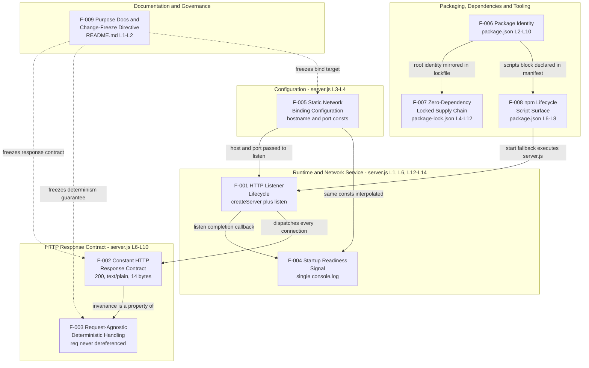
```mermaid
flowchart TB
    subgraph ConfigLayer["Configuration - server.js L3-L4"]
        F005["F-005 Static Network<br/>Binding Configuration<br/>hostname and port consts"]
    end

    subgraph RuntimeLayer["Runtime and Network Service - server.js L1, L6, L12-L14"]
        F001["F-001 HTTP Listener<br/>Lifecycle<br/>createServer plus listen"]
        F004["F-004 Startup Readiness<br/>Signal<br/>single console.log"]
    end

    subgraph ContractLayer["HTTP Response Contract - server.js L6-L10"]
        F002["F-002 Constant HTTP<br/>Response Contract<br/>200, text/plain, 14 bytes"]
        F003["F-003 Request-Agnostic<br/>Deterministic Handling<br/>req never dereferenced"]
    end

    subgraph PackagingLayer["Packaging, Dependencies and Tooling"]
        F006["F-006 Package Identity<br/>package.json L2-L10"]
        F007["F-007 Zero-Dependency<br/>Locked Supply Chain<br/>package-lock.json L4-L12"]
        F008["F-008 npm Lifecycle<br/>Script Surface<br/>package.json L6-L8"]
    end

    subgraph GovernanceLayer["Documentation and Governance"]
        F009["F-009 Purpose Docs and<br/>Change-Freeze Directive<br/>README.md L1-L2"]
    end

    F005 -->|"host and port passed to listen"| F001
    F005 -->|"same consts interpolated"| F004
    F001 -->|"listen completion callback"| F004
    F001 -->|"dispatches every connection"| F002
    F002 -->|"invariance is a property of"| F003
    F006 -->|"root identity mirrored in lockfile"| F007
    F006 -->|"scripts block declared in manifest"| F008
    F008 -->|"start fallback executes server.js"| F001
    F009 -.->|"freezes response contract"| F002
    F009 -.->|"freezes determinism guarantee"| F003
    F009 -.->|"freezes bind target"| F005
```

**Dependency matrix.** Solid edges above are runtime or data dependencies; dashed edges are governance constraints.

| Consumer Feature | Depends On | Nature of the Dependency |
|---|---|---|
| F-001 HTTP Listener Lifecycle | F-005 | Data — the `hostname` and `port` constants (L3–L4) are the arguments to `server.listen` at L12 |
| F-004 Startup Readiness Signal | F-001 | Control — the log statement executes only inside the `listen` completion callback (L12–L14) |
| F-004 Startup Readiness Signal | F-005 | Data — L13 interpolates the same two constants, so the logged URL cannot diverge from the bound address |
| F-002 Constant HTTP Response Contract | F-001 | Control — the handler at L6–L10 is invoked only by the listener created at L6 and bound at L12 |
| F-003 Request-Agnostic Handling | F-002 | Structural — invariance is a property of the constant response; both are produced by the same handler block |
| F-007 Zero-Dependency Locked Supply Chain | F-006 | Data — the lockfile root entry repeats the manifest's `name`, `version`, and `license` |
| F-008 npm Lifecycle Script Surface | F-006 | Structural — the `scripts` object is a member of the manifest |
| F-001 HTTP Listener Lifecycle | F-008 | Control — `npm start` resolves to `node server.js`, which triggers module evaluation and therefore binding |
| F-002, F-003, F-005 | F-009 | Governance — the change-freeze directive is what allows these contracts to be treated as fixed |

Two features have **no prerequisites**: F-005 (configuration literals) and F-009 (documentation). F-006 has no prerequisite feature either, but it is a prerequisite for both F-007 and F-008.

### 2.3.2 Integration Points

The complete set of interfaces across which this system exchanges anything with the outside world is five items. Each is mapped to the feature that owns it.

| Integration Point | Direction | Owning Feature(s) |
|---|---|---|
| HTTP over TCP on `127.0.0.1:3000` | Inbound | F-001 (accepts), F-002 and F-003 (answer) |
| Process stdout — one readiness line | Outbound | F-004 |
| Process exit status — `1` from `npm test`, non-zero on unhandled bind failure | Outbound | F-008 (test stub), F-001 (bind failure) |
| npm CLI reading `package.json` scripts and identity | Tooling | F-006, F-007, F-008 |
| Node.js core `http` module | Runtime library | F-001, F-002, F-003 |

Two properties of this set matter for integration planning. First, the inbound HTTP point is reachable **only from the same host** — a request to the machine's routable address on port `3000` fails to connect, so any integrating component must be co-located. Second, there are **no outbound integration points at all**: `server.js` makes no network call, opens no file, and reads no environment variable, so the process cannot reach a database, cache, broker, identity provider, telemetry collector, or any other service.

The end-to-end control flow across these points is shown below; it also identifies which feature governs each step and where the single failure branch leads.

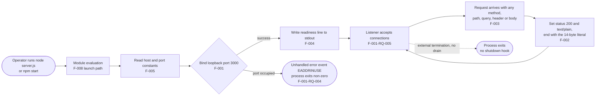
```mermaid
flowchart LR
    Launch(["Operator runs node server.js<br/>or npm start"]) --> Evaluate["Module evaluation<br/>F-008 launch path"]
    Evaluate --> Resolve["Read host and port constants<br/>F-005"]
    Resolve --> Bind{"Bind loopback port 3000<br/>F-001"}
    Bind -->|"success"| Ready["Write readiness line to stdout<br/>F-004"]
    Bind -->|"port occupied"| Crash(["Unhandled error event EADDRINUSE<br/>process exits non-zero<br/>F-001-RQ-004"])
    Ready --> Accept["Listener accepts connections<br/>F-001-RQ-005"]
    Accept --> Arrive["Request arrives with any method,<br/>path, query, header or body<br/>F-003"]
    Arrive --> Answer["Set status 200 and text/plain,<br/>end with the 14-byte literal<br/>F-002"]
    Answer --> Accept
    Accept -.->|"external termination, no drain"| Stop(["Process exits<br/>no shutdown hook"])
```

This flow is the feature-level view of the same behavior charted structurally in §1.2.2.2 (component diagram) and from the actor's perspective in §1.3.1.1 (operator and client sequence diagram).

### 2.3.3 Shared Components

There is no shared-library layer in this repository — no `src/`, `lib/`, or `utils/` directory exists, and the root has no subdirectories at all. "Shared components" therefore means the small number of concrete artifacts that more than one feature reads or is realised by.

| Shared Component | Location | Features Sharing It |
|---|---|---|
| `hostname` and `port` constants | `server.js` L3–L4 | F-001 (passes them to `listen`) and F-004 (interpolates them into the log line) — the only genuine shared data in the codebase |
| The single inline request handler | `server.js` L6–L10 | F-002 and F-003 are both realised by this one block; F-003 exists precisely because the block ignores `req` |
| The `server` object returned by `createServer` | `server.js` L6, used at L12 | F-001 (creation and binding) and, indirectly, F-004 (its `listen` callback hosts the log statement) |
| Node.js core `http` module | Required at `server.js` L1 | F-001, F-002, and F-003 — the only library any feature depends on |
| Package identity `hello_world@1.0.0` and license `MIT` | `package.json` L2–L3, L10 and `package-lock.json` L2–L3, L8–L10 | F-006 and F-007 — the same three fields are asserted in both files and agree |
| `package.json` as a container | `package.json` | F-006 (identity fields), F-007 (absence of dependency keys), F-008 (`scripts` block) |

### 2.3.4 Common Services

**The repository implements no common services.** There is no shared logger, configuration loader, error handler, middleware pipeline, validation utility, dependency-injection container, HTTP client wrapper, or helper module. This is not an omission in the investigation — the executable surface is one file with no functions, no classes, and no exports, so there is nowhere for a cross-cutting service to live.

The table below records the cross-cutting concerns a service of this kind would normally centralise, together with how each is actually handled here.

| Cross-Cutting Concern | Shared Service Present | How It Is Actually Handled |
|---|---|---|
| Configuration | No | Two literal constants at `server.js` L3–L4; zero `process.env` reads and no config file anywhere in the repository |
| Logging | No | One inline `console.log` at L13; no logger abstraction, level, format, or transport |
| Error handling | No | None. There is no `try`/`catch`, no `server.on('error')`, and no process-level handler, so a bind failure becomes an unhandled `error` event |
| Request routing and middleware | No | None. A single anonymous callback answers every request; no dispatch layer exists |
| Input validation | No | None. The `req` object is never read, so nothing is parsed or validated |
| Authentication and authorization | No | None implemented; the loopback bind at L3 is the only access control |
| Health and readiness checks | No | No HTTP health route. The startup line (F-004) is the only readiness signal, and it is emitted once rather than being pollable |
| Lifecycle and shutdown management | No | No `SIGTERM`/`SIGINT` handler and no `server.close()`; termination is abrupt with no connection draining |
| Metrics and tracing | No | None. No instrumentation, exporter, or span is present anywhere |
| Persistence and caching | No | None. The process performs no filesystem or database I/O at runtime |

The practical consequence for feature relationships is that all nine features are coupled through **file scope** rather than through interfaces: any change to `server.js` touches F-001 through F-005 simultaneously, because they share one module with no seams. This is the structural reason the change-freeze directive in F-009 is the artifact's primary control.


## 2.4 Implementation Considerations

The considerations below are organised by dimension, with a row for every feature so that each feature's technical constraints, performance profile, scalability limits, security implications, and maintenance obligations can be read in one place. Every entry states an observed property of the repository; where the repository defines nothing, that absence is recorded rather than filled in with an assumed industry default.

### 2.4.1 Technical Constraints

| Feature | Constraint | Evidence and Consequence |
|---|---|---|
| F-001 | Binding happens as a side effect of module evaluation, and the module exports nothing | `server.listen` is called at top level (L12) and `server.js` contains no `module.exports`; the listener therefore cannot be created without also being started, and no part of the behavior can be imported for isolated testing |
| F-001 | No error, timeout, or shutdown handling exists | Zero matches for `try`, `catch`, `on('error'`, `process.on`, `SIGTERM`, `SIGINT`, and `server.close` in `server.js`; a bind failure becomes an unhandled `error` event and in-flight requests are never drained |
| F-002 | The response is a source literal, not content | `res.end('Hello, World!\n')` at L9; changing status, content type, or body requires editing source, which `README.md` L2 forbids |
| F-003 | The request object is structurally unavailable to any logic | `req` is declared at L6 and never dereferenced; adding any request-dependent behavior would break the invariance guarantee the fixture provides |
| F-004 | Readiness is a one-shot stdout line, not a pollable endpoint | The single `console.log` at L13; a consumer that misses the line at launch has no way to query readiness afterwards |
| F-005 | Host and port are compile-time literals with no override channel | L3–L4 constants; zero `process.env` reads, no CLI parsing, and no `.env`, config file, or `.npmrc` in the repository |
| F-006 | The declared entry point does not resolve | `main: index.js` at L5 with no `index.js` present (defect D-01); `node .` fails with `MODULE_NOT_FOUND`, so only `node server.js` and `npm start` are usable |
| F-007 | The dependency graph must remain empty to preserve the artifact's value | `package.json` has no dependency keys and `package-lock.json` L6–L12 records only the root entry; adding a package would reintroduce resolution and drift |
| F-008 | The `test` script cannot succeed and no runner exists | `echo "Error: no test specified" && exit 1` at L7 (defect D-02); verification must be performed externally by issuing an HTTP request |
| F-009 | The freeze is a documentation directive with no technical enforcement | `README.md` L2; there is no `CODEOWNERS`, branch-protection artifact, lint gate, or passing test that could block a change |

### 2.4.2 Performance Requirements

**The repository declares no performance requirement of any kind.** There is no benchmark harness, load-test script, latency or throughput target, timeout setting, memory budget, or metrics instrumentation in any of the four files. The column below therefore records the performance-relevant characteristics that were *observed*, and explicitly states that no target is defined. Any latency, throughput, or availability figure attributed to this artifact would have to come from external measurement that the repository neither includes nor references.

| Feature | Declared Target | Observed Characteristic |
|---|---|---|
| F-001 | None | Single process on a single event loop; no clustering, worker threads, or process manager. Node's default connection handling applies unmodified — responses carried `Connection: keep-alive` and `Keep-Alive: timeout=5`, neither of which is configured in code |
| F-002 | None | Serving a response requires three statements and no I/O, computation, or lookup; the payload is a fixed 14 bytes, so response size is constant regardless of load |
| F-003 | None | Per-request application work is independent of request size because nothing is parsed; a request body is received by Node but never read by application code |
| F-004 | None | Logging occurs exactly once at startup and never on the request path, so it contributes nothing to per-request cost |
| F-005 | None | Configuration resolution is part of module parsing and involves no I/O |
| F-006 | None | Manifest is 251 bytes of static JSON, read by the npm CLI rather than at runtime |
| F-007 | None | No install, download, or resolution step is required before startup — `npm ls --all` reports `(empty)` and no `node_modules` directory exists |
| F-008 | None | `npm test` completes immediately with exit code `1`; `npm start` adds only npm's own process-spawn overhead ahead of `node server.js` |
| F-009 | None | Static Markdown of 73 bytes; no runtime cost |

### 2.4.3 Scalability Considerations

| Feature | Scaling Limit | Why It Cannot Be Relaxed Without a Source Change |
|---|---|---|
| F-001 | One instance per host; throughput bounded by one event loop | Port `3000` is a literal, so a second instance on the same host dies with unhandled `EADDRINUSE` (observed `errno: -98`). No clustering or worker-thread code exists to use additional cores |
| F-002 | None inherent — the handler is stateless | The response holds no session, cache, or connection state, so it would scale horizontally in principle; the limit is imposed by F-001 and F-005, not by the response logic |
| F-003 | None inherent | Ignoring the request removes any per-caller state or affinity requirement; again the binding constraints, not the handler, cap scale |
| F-004 | Readiness signals are indistinguishable across instances | The log line contains only host and port (L13) — no process ID, instance ID, or timestamp — so multiple instances could not be told apart from stdout alone |
| F-005 | The bind target cannot be varied per instance or per environment | No environment variable, argument, or config file is read, so running on a second port or binding a routable interface requires editing L3–L4 |
| F-006 | Not applicable | Package metadata is scale-invariant |
| F-007 | Not applicable, and favourable | An empty graph means install time and supply-chain surface do not grow with deployment count |
| F-008 | Single-command surface with no parallelism concerns | `scripts` contains one entry; there is no build, watch, or matrix execution to parallelise |
| F-009 | The freeze forecloses scaling work | Every change that would improve scalability — externalised config, clustering, a routable bind — is a source modification the directive prohibits |

### 2.4.4 Security Implications

| Feature | Security Implication | Supporting Evidence |
|---|---|---|
| F-001 | Loopback binding is the only access control, and it is effective; conversely the absence of an error handler makes availability fragile | A request to the host's routable address on port `3000` could not connect; an occupied port terminates the process instead of degrading gracefully |
| F-001 | No transport security | No HTTPS, TLS configuration, or certificate material exists anywhere in the repository; traffic is plaintext HTTP |
| F-002 | The response cannot leak data, but sets no protective headers | The body is a source literal containing no user data, secrets, or reflected input; `Content-Type` is the only header set by application code — no HSTS, CSP, or `X-Content-Type-Options` |
| F-003 | Unread input eliminates injection paths, and simultaneously removes all input controls | `req` is never dereferenced, so nothing can be parsed, deserialised, or forwarded; equally there is no method allow-list, request-size limit, or abuse control in application code |
| F-004 | Log output discloses nothing sensitive | The single line contains only the loopback host and port; no credentials, tokens, headers, or stack traces are logged by application code |
| F-005 | The `127.0.0.1` literal is the artifact's primary security control | L3. Changing it to a routable address would expose an unauthenticated, plaintext, unmonitored service — which is why this constant, more than any other line, is what the freeze protects |
| F-006 | The manifest carries no secrets and triggers no implicit code execution | No credentials, tokens, or registry authentication are present; no `.npmrc` exists; and no `preinstall`/`postinstall` or other lifecycle hooks are declared |
| F-007 | Third-party attack surface is nil; no scanning is configured because there is nothing to scan | `package-lock.json` records only the root package; there is no `npm audit` step, SBOM, integrity gate, or provenance check in the repository |
| F-008 | The `test` script is inert | It runs only `echo` in a shell and performs no network or filesystem access |
| F-009 | The change freeze is unenforced, which is the residual governance risk | No `CODEOWNERS`, `SECURITY` policy, commit-signing configuration, branch-protection artifact, or CI check exists to prevent a modification |

### 2.4.5 Maintenance Requirements

| Feature | Maintenance Consideration | Supporting Evidence |
|---|---|---|
| F-001 | Any edit is a whole-file edit; nothing can be regression-tested in isolation | `server.js` has no exports, no named functions, and no classes, so F-001 through F-005 share one module with no seams |
| F-001 | Runtime upgrades are unvalidated by the repository | No `engines` range and no `.nvmrc`; the artifact was confirmed working on the Node.js 22 runtime present in the verification environment, but the repository itself expresses no supported range |
| F-002 | The response contract is the artifact's public interface and must be diffed carefully | Three lines (L7–L9) define everything a consumer asserts against; a one-character change to the literal breaks every downstream assertion |
| F-003 | Invariance must be actively preserved during any future edit | Adding a single `req` reference would introduce request-dependent behavior and invalidate the determinism guarantee |
| F-004 | The log line and the bind address must be changed together | They already are coupled through the shared constants (L12–L13), so maintaining that coupling is the safe pattern to preserve |
| F-005 | Externalising configuration is a prerequisite for any redeployment | Host and port live only in source; there is no configuration layer to extend |
| F-006 | Two metadata defects remain open and would need correcting before any packaging work | `main` points at a missing `index.js` (D-01) and MIT is declared without a shipped `LICENSE` file (D-03); the artifact is also referred to by three different names across README, manifest, and Git remote |
| F-007 | The lockfile must be kept consistent with the manifest | Both assert `hello_world@1.0.0` and MIT; introducing any dependency would change the maintenance profile from "static inspection" to "resolution and audit" |
| F-008 | There is no automated regression detection, so verification is manual | `npm test` exits `1` by construction and no CI workflow definition exists anywhere in the repository; confirming the artifact still works means starting it and issuing a request |
| F-009 | The maintenance policy is "do not change", and provenance offers no version history to bisect | Single commit `ab2aed6` with no tags and no changelog; the practical maintenance action is verifying the files still match their recorded digests (§2.5.4) |

### 2.4.6 Binding Constraint Summary

Five constraints determine almost everything about how these features can be used, extended, or verified. They are consolidated here because each one cuts across multiple features.

| Constraint | Features Affected | Nature |
|---|---|---|
| Loopback-only bind (`server.js` L3) | F-001, F-005, and by extension F-002 and F-003 | Callers must be co-located; the service can never be reached remotely as written |
| Hard-coded port `3000` (`server.js` L4) | F-001, F-005 | One instance per host; contention is fatal and unhandled |
| No configuration input channel | F-005, and every feature that depends on the bind target | Environment-specific deployment is impossible without editing source |
| No executable test and no CI | F-008, and verification of all other features | Every acceptance criterion in §2.2 must be checked manually or by an external harness |
| Documentation-only change freeze (`README.md` L2) | All nine features | Remediation of any constraint above conflicts with the artifact's stated governance |


## 2.5 Traceability and Requirement Governance

This sub-section closes the loop between the 32 requirements defined in §2.2, the artifacts that implement them, the method by which each can be verified, and the version of the artifact to which they apply. It also records the assumptions and constraints that the requirements depend on, so that a future reader can tell which statements are properties of the code and which are conditions of its environment.

### 2.5.1 Requirement-to-Source Traceability Matrix

All 32 requirements trace to a concrete anchor. `S` denotes static verification (reading the file or a filesystem check); `E` denotes execution against the running artifact. Every row below was verified during this investigation.

| Requirement ID | Feature | Primary Source Anchor | Verification |
|---|---|---|---|
| F-001-RQ-001 | F-001 | `server.js` L1, L6 | S — `node --check` plus source read |
| F-001-RQ-002 | F-001 | `server.js` L12 | E — `node server.js`, then a request returns `200` |
| F-001-RQ-003 | F-001 | `server.js` L3, L12 | E — loopback `200`; routable address fails to connect |
| F-001-RQ-004 | F-001 | `server.js` (absence of an `error` listener) | E — second instance dies with `EADDRINUSE`, `errno -98` |
| F-001-RQ-005 | F-001 | `server.js` (absence of signal handlers and `close`) | S + E — grep returns zero matches; process serves until terminated |
| F-002-RQ-001 | F-002 | `server.js` L7 | E — `200` on `GET`, `POST`, `DELETE`, `HEAD` |
| F-002-RQ-002 | F-002 | `server.js` L8 | E — `Content-Type: text/plain` in every response |
| F-002-RQ-003 | F-002 | `server.js` L9 | E — body byte-identical, `Content-Length: 14` |
| F-002-RQ-004 | F-002 | `server.js` L8 (single `setHeader`) | S + E — one header set in code; the rest are Node-supplied |
| F-003-RQ-001 | F-003 | `server.js` L6–L10 | E — four HTTP methods produce identical results |
| F-003-RQ-002 | F-003 | `server.js` L6–L10 | E — `/` and `/anything/deep?q=1` identical |
| F-003-RQ-003 | F-003 | `server.js` L6 (`req` unused) | S + E — custom header and body ignored |
| F-003-RQ-004 | F-003 | `server.js` L7 (only status assignment) | S — no conditional or alternate status path exists |
| F-004-RQ-001 | F-004 | `server.js` L12–L14 | E — exactly one readiness line on stdout |
| F-004-RQ-002 | F-004 | `server.js` L13 | S — template literal interpolates L3–L4 constants |
| F-004-RQ-003 | F-004 | `server.js` (single output statement) | S + E — no output during request serving |
| F-005-RQ-001 | F-005 | `server.js` L3 | S — `const hostname = '127.0.0.1'` |
| F-005-RQ-002 | F-005 | `server.js` L4 | S — `const port = 3000` |
| F-005-RQ-003 | F-005 | `server.js` (no `process.env`); repository root | S — zero env reads; no `.env`, config file, or `.npmrc` |
| F-005-RQ-004 | F-005 | `server.js` L12–L13 | S — both consumers read the same two constants |
| F-006-RQ-001 | F-006 | `package.json` L2–L4, L9–L10 | S + E — valid JSON; `npm ls` resolves `hello_world@1.0.0` |
| F-006-RQ-002 | F-006 | `package.json` L3; `package-lock.json` L3, L9 | S — `1.0.0` consistent across both files |
| F-006-RQ-003 | F-006 | `package.json` L10; `package-lock.json` L10 | S — `"license": "MIT"` in both |
| F-007-RQ-001 | F-007 | `package.json` (no dependency keys) | S — neither `dependencies` nor `devDependencies` present |
| F-007-RQ-002 | F-007 | `package-lock.json` L4–L12 | S — lockfile v3, root-only `packages` map |
| F-007-RQ-003 | F-007 | Repository root (no `node_modules`) | E — `npm ls --all` prints `(empty)`; server starts without install |
| F-008-RQ-001 | F-008 | `package.json` L7 | E — `npm test` prints the message and exits `1` |
| F-008-RQ-002 | F-008 | `package.json` L6–L8 (no `start` script) | E — `npm start` runs `node server.js`; request returns `200` |
| F-008-RQ-003 | F-008 | `server.js` (module path) | E — `node server.js` starts the listener |
| F-009-RQ-001 | F-009 | `README.md` L1–L2 | S — purpose statement present |
| F-009-RQ-002 | F-009 | `README.md` L2 | S — `Do not touch!` present |
| F-009-RQ-003 | F-009 | All four tracked files | S — clean working tree; digests match §2.5.4 |

**Coverage summary.**

| Feature | Requirements | Verification Mix |
|---|---|---|
| F-001 | 5 (RQ-001 … RQ-005) | 1 static, 3 executed, 1 both |
| F-002 | 4 (RQ-001 … RQ-004) | 3 executed, 1 both |
| F-003 | 4 (RQ-001 … RQ-004) | 1 static, 2 executed, 1 both |
| F-004 | 3 (RQ-001 … RQ-003) | 1 static, 1 executed, 1 both |
| F-005 | 4 (RQ-001 … RQ-004) | 4 static |
| F-006 | 3 (RQ-001 … RQ-003) | 2 static, 1 both |
| F-007 | 3 (RQ-001 … RQ-003) | 2 static, 1 executed |
| F-008 | 3 (RQ-001 … RQ-003) | 3 executed |
| F-009 | 3 (RQ-001 … RQ-003) | 3 static |

Every feature has at least one requirement, every requirement has exactly one owning feature, and no requirement is orphaned. Twelve of the 32 requirements are satisfiable by static inspection alone, which matters because the artifact ships no executable test of its own.

### 2.5.2 Feature-to-Specification Cross-Reference

| Feature | Related Specification Sections | What the Cross-Reference Adds |
|---|---|---|
| F-001, F-005 | §1.2.2.1 Primary System Capabilities; §1.3.1.1 Key Technical Requirements | Capability-level statement of the bind address, port, and launch invocation |
| F-002, F-003 | §1.1.2 Core Business Problem; §1.2.3.1 Measurable Objectives | Explains why deterministic output is the artifact's reason for existing, and records the same verification results |
| F-004 | §1.2.1.3 Integration with the Existing Enterprise Landscape | Frames stdout as one of only three outbound surfaces |
| F-006, F-007 | §1.1.1 Project Overview; §1.2.2.2 Major System Components | Records the identity fields and the component inventory the manifests describe |
| F-008 | §1.2.1.2 Current System Limitations; §1.3.2.4 Unsupported Use Cases | Documents the broken `main` entry and why a pipeline cannot be gated on `npm test` |
| F-009 | §1.2.1.1 Business Context and Positioning; §1.3.2.2 Future Phase Considerations | Establishes invariance as the artifact's value and confirms no roadmap exists |
| All features | §1.3.2.1 Explicitly Excluded Features | Enumerates the confirmed absences that bound every requirement above |
| Process flows | §1.2.2.2 (component flowchart); §1.3.1.1 (operator sequence diagram); §2.3.1 and §2.3.2 (feature dependency map and control-flow chart) | The four diagrams describe the same behavior structurally, from the actor's view, and at feature level |

### 2.5.3 Defect Traceability

| Defect ID | Requirements / Features Affected | Constraint It Produces |
|---|---|---|
| D-01 — `main` names a missing `index.js` | F-006-RQ-001 context; F-008-RQ-002, F-008-RQ-003 | Launch must use `node server.js` or `npm start`; the declared entry point is unusable (§2.4.1) |
| D-02 — `test` script can never pass | F-008-RQ-001 | No automated regression detection; all §2.2 acceptance criteria must be checked externally (§2.4.6) |
| D-03 — MIT declared with no `LICENSE` file | F-006-RQ-003 | License text is not distributed with the code (§2.2.6) |
| D-04 — no explicit `start` script | F-008-RQ-002 | The launch path depends on npm's built-in default rather than a self-documenting script (§2.2.8) |

### 2.5.4 Requirement Versioning and Change Control

The repository provides no changelog, no release notes, no tags, and no issue tracker, so requirement versioning can only be anchored to the two identifiers that do exist: the declared package version and the single commit.

| Version Anchor | Value | Source |
|---|---|---|
| Declared artifact version | `1.0.0` | `package.json` L3 and `package-lock.json` L3, L9 |
| Commit identity | `ab2aed661c5640c9d00987041e329bd4ea2260a7` — "Add files via upload" | Git history; the only commit in the repository |
| Branch / tags | `main` tracking `origin/main`; zero tags | `git branch -vv`; tag count is `0` |
| Working-tree state at documentation time | Clean — no modifications, additions, or deletions | `git status --porcelain` produced no output |

**All requirement IDs in §2.2 are therefore version `1.0.0` requirements as of commit `ab2aed6`.** Because there is no prior revision, there is no requirement history to diff and no superseded requirement to record.

Change control is exercised through documentation alone (F-009). To make the freeze verifiable rather than aspirational, the digests below were computed for the four tracked files; comparing them is the concrete test behind requirement F-009-RQ-003.

| Artifact | SHA-256 Digest |
|---|---|
| `server.js` | `332fc2d04eb5b8f3cb230855457af80d0dfc246f958d6e49615610d656acc2e0` |
| `package.json` | `799709b94f9f9bacef7aef7ec364e1a82a9cd1becdcbfdfffe4dd6856b7875f0` |
| `package-lock.json` | `46f7913cb1848efd80561b7957eb6dcb9a182c190a31d3c81108fb2ca1454612` |
| `README.md` | `01d06517896c3daac71340634381b86bb51840352dcf63b3dcd3a49780567b43` |

Any change to `server.js` alters its digest and, by definition, alters the response contract that F-002 and F-003 guarantee — which is precisely the outcome the README directive exists to prevent.

### 2.5.5 Assumptions

These conditions are required for the requirements above to hold but are **not** guaranteed by anything in the repository. Each is recorded with the evidence that makes it an assumption rather than a specification.

| ID | Assumption | Basis for Treating It as an Assumption |
|---|---|---|
| A-01 | A Node.js runtime whose standard library provides `http` is installed and compatible with the source | The repository declares no `engines` range and no `.nvmrc`; the artifact was confirmed working on the Node.js 22 runtime present in the verification environment, but no supported range is expressed |
| A-02 | TCP port `3000` on the loopback interface is free when the process starts | The port is a literal (L4) and contention is fatal — an occupied port produces an unhandled `EADDRINUSE` and process exit |
| A-03 | Every consumer of the HTTP endpoint runs on the same host as the process | Forced by the loopback bind (L3); a request to the host's routable address could not connect |
| A-04 | The npm CLI is available where the F-008 script paths are used | `npm test` and `npm start` require npm; `node server.js` does not |
| A-05 | Whoever needs the readiness signal captures process stdout at launch | The line is emitted once (L13) and is not persisted or pollable |
| A-06 | The "backprop" integration process named in `README.md` L2 is external to this repository | No file defines, configures, or references it; it is named only in documentation |
| A-07 | Verification of the artifact is performed by an external harness or operator | `npm test` exits `1` by construction and no test file, runner, or CI definition exists |
| A-08 | The three identifiers `hao-backprop-test` (README), `hello_world` (npm package), and the Git remote name denote the same artifact | No file in the repository reconciles the three names |

### 2.5.6 Constraints

| ID | Constraint | Source of the Constraint |
|---|---|---|
| C-01 | The service is reachable only from its own host | `server.js` L3 binds `127.0.0.1`; verified unreachable from the routable address |
| C-02 | Exactly one instance may run per host | `server.js` L4 fixes port `3000`; a second instance crashes unhandled |
| C-03 | No configuration can be supplied at runtime | Zero `process.env` reads, no CLI parsing, and no config file, `.env`, or `.npmrc` in the repository |
| C-04 | Bind failures crash the process and shutdown never drains work | No `error` listener, no `try`/`catch`, no signal handler, and no `server.close()` in `server.js` |
| C-05 | No behavior can be imported or unit-tested in isolation | `server.js` has no exports, no named functions, and no classes |
| C-06 | No automated verification exists in the repository | `test` script always exits `1`; no test files and no CI workflow definitions of any kind |
| C-07 | The source is under a change freeze | `README.md` L2 — "Do not touch!" |
| C-08 | No supported runtime version range is defined | No `engines` field and no `.nvmrc` |
| C-09 | The declared package entry point cannot be used | `main: index.js` with no `index.js` present; `node .` fails `MODULE_NOT_FOUND` |
| C-10 | The MIT license text is not distributed with the code | License appears only as a manifest field; no `LICENSE` file exists |
| C-11 | Traffic is unauthenticated plaintext HTTP | No TLS material, no authentication or authorization code, and no security headers anywhere in the repository |

C-01 through C-04 and C-07 are the constraints that most directly limit the feature set; C-06 is the one that most affects how these requirements can be validated, since every acceptance criterion in §2.2 must be exercised manually or by tooling that lives outside this repository.


## 2.6 References

### 2.6.1 Repository Files and Folders Examined

Every file in the repository was read in full; the file list below is therefore complete rather than selective.

- `server.js` — the only executable component; established F-001 through F-005 in their entirety. Specific anchors used: L1 (`require('http')`), L3–L4 (`hostname` and `port` constants), L6 (`createServer` with the unused `req` parameter), L7–L9 (status, header, body), L12–L14 (`listen` and the readiness log).
- `package.json` — established F-006 (identity fields at L2–L4, L9–L10), F-007 (absence of `dependencies` and `devDependencies`), F-008 (`scripts` block at L6–L8), and defects D-01, D-03, D-04.
- `package-lock.json` — established F-007; lockfile version 3 at L4, `requires: true` at L5, and a `packages` map at L6–L12 containing only the root entry.
- `README.md` — established F-009; L1 supplies the project name and L2 supplies both the purpose statement and the change-freeze directive.
- Repository root (`""`) — the folder listing established the flat, four-file topology with no subdirectories, which bounds the entire feature catalog. It also confirmed the absence of `index.js`, `LICENSE`, `node_modules`, `.env`, CI workflow definitions, container or IaC files, test files, and lint/type-check configuration — each of which underpins a specific constraint in §2.4 and §2.5.6.

### 2.6.2 Verification Activities

Requirements were validated by running the artifact; the following activities produced the acceptance-criteria evidence recorded in §2.2 and the verification column in §2.5.1.

- `node --check server.js` — confirmed the single source file parses (F-001-RQ-001).
- Launching via `node server.js` and via `npm start` — confirmed binding, the exact readiness line, and the npm default-script fallback (F-001-RQ-002, F-004-RQ-001, F-008-RQ-002, F-008-RQ-003).
- HTTP requests using `GET /`, `POST /anything/deep?q=1` with a custom header and body, `DELETE /foo`, and `HEAD /` — confirmed the constant `200` / `text/plain` / `Content-Length: 14` / `Hello, World!\n` contract and its invariance (F-002-RQ-001 … RQ-004, F-003-RQ-001 … RQ-003).
- A request to the host's routable address on port `3000` — confirmed loopback-only reachability (F-001-RQ-003, constraint C-01).
- Starting a second instance against an occupied port — confirmed the unhandled `EADDRINUSE` error (`errno -98`) and non-zero exit (F-001-RQ-004, constraint C-04).
- `npm test` — confirmed the message `Error: no test specified` and exit code `1` (F-008-RQ-001, defect D-02).
- `node .` — confirmed `MODULE_NOT_FOUND` for the missing `index.js` (defect D-01, constraint C-09).
- `npm ls --all` and a `node_modules` existence check — confirmed the empty dependency graph and the absence of an install step (F-007-RQ-003).
- Source greps for `process.env`, `module.exports`, `try`, `catch`, `on('error'`, `process.on`, `SIGTERM`, `SIGINT`, and `server.close` — all returned zero matches, establishing constraints C-03, C-04, and C-05.
- `git log`, `git branch -vv`, tag count, and `git status --porcelain` — established the version anchors in §2.5.4 (single commit `ab2aed6`, branch `main`, zero tags, clean working tree).
- SHA-256 digests of the four tracked files — established the invariance baseline that makes F-009-RQ-003 testable.

### 2.6.3 Cross-Referenced Specification Sections

- §1.1 Executive Summary — corroborated package identity, version, license declaration, author, and the framing of deterministic output as the artifact's purpose.
- §1.2 System Overview — corroborated the component inventory, the primary-capability list, the integration surfaces, the current-limitations set reused as constraints in §2.4, and the absence of declared KPIs.
- §1.3 Scope — corroborated the must-have capability list, the operator and client workflows, the implementation boundaries, and the confirmed exclusions that bound every requirement in §2.2.

### 2.6.4 External Sources

No external source was used. Every statement in §2.1 through §2.5 rests on the four repository files, on behavior observed by executing the artifact, or on the Section 1 content cited above. No web reference was required, because the repository declares no third-party dependency, no runtime version range, and no external standard against which an outside fact would need to be checked.


# 3. Technology Stack

## 3.1 Programming Languages

The language inventory for `hao-backprop-test` is exhaustive rather than representative. A census of Git-tracked files (`git ls-files`) returns exactly four entries resolving to three file extensions — `.js`, `.json`, and `.md` — and the repository contains **zero subdirectories**, so there is no second platform, tier, or build target whose languages could differ from the root.

### 3.1.1 Language and Format Inventory

| Language / Format | Files | Role in the System | Byte Share |
|---|---|---|---|
| JavaScript (Node.js, CommonJS) | `server.js` | Sole executable implementation — HTTP listener, request handler, startup logger | 342 B (37.5%) |
| JSON | `package.json`, `package-lock.json` | Declarative package manifest and dependency-resolution record consumed by the npm CLI | 498 B (54.5%) |
| Markdown | `README.md` | Purpose statement and change-freeze directive | 73 B (8.0%) |

There is no second implementation language anywhere in the repository. The extension census returned `2 × json`, `1 × md`, `1 × js` and nothing else.

### 3.1.2 JavaScript — The Sole Implementation Language

#### 3.1.2.1 Platform Binding and Module System

`server.js` is JavaScript executed directly by the Node.js runtime. Line 1 establishes the platform binding and the module system in a single statement:

```javascript
const http = require('http');
```

`require` is the CommonJS loader, and `package.json` declares **no `"type"` field**, so Node resolves `.js` files in this package as CommonJS by default. This was confirmed programmatically — reading `package.json` reports `type` as absent. Consequently:

- The committed source is byte-for-byte the source that executes. There is no transpilation, bundling, minification, or emit step between the repository and the running process.
- The module is loaded in **sloppy mode** — `server.js` contains no `'use strict'` directive, and CommonJS modules are not implicitly strict.
- `require('http')` resolves to a Node.js **builtin**, verified via `require('module').builtinModules.includes('http')` returning `true`. The language surface therefore extends only as far as the runtime's own standard library.

#### 3.1.2.2 ECMAScript Feature Level Actually Exercised

The repository declares no target language level — there is no `tsconfig.json`, no Babel configuration, and no `browserslist` or `engines` field. The effective floor must therefore be derived from the syntax actually used. `server.js` exercises exactly three post-ES5 features:

| Feature Used | Line | ECMAScript Edition |
|---|---|---|
| `const` block-scoped bindings | L1, L3, L4, L6 | ES2015 (ES6) |
| Arrow function expressions | L6, L12 | ES2015 (ES6) |
| Template literal with interpolation | L13 | ES2015 (ES6) |

The effective minimum language level is therefore **ES2015 / ES6**. Nothing newer appears: there are no classes, `async`/`await`, Promises, destructuring, rest/spread, optional chaining, nullish coalescing, ES-module `import`/`export`, or top-level `await`. `node --check server.js` passes, confirming the file parses cleanly.

This matters for compatibility: because the code stays at the ES2015 floor and touches only long-stable core APIs, the practical range of Node.js versions capable of running it is very wide — but that range is a *property of the code*, not a guarantee the repository makes (see §3.1.4).

#### 3.1.2.3 Language and Runtime API Surface Consumed

The entire program is built from four runtime surfaces. No other API — language-level or platform-level — is touched.

| API Surface | Provided By | Usage Site |
|---|---|---|
| `http.createServer(requestListener)` | Node.js core `http` | `server.js` L6 |
| `http.Server#listen(port, host, callback)` | Node.js core `http` | `server.js` L12 |
| `http.ServerResponse` — `statusCode`, `setHeader()`, `end()` | Node.js core `http` | `server.js` L7–L9 |
| `console.log()` | Node.js global console | `server.js` L13 |

Notably, `process` is never referenced. A repository-wide grep for `process.env` returns **zero matches**, so no language-level environment access exists: the `hostname` and `port` values at L3–L4 are source literals with no override channel (feature F-005).

### 3.1.3 Declarative and Documentation Formats

JSON and Markdown are not implementation languages here; they carry configuration and governance.

| Format | File | What It Declares |
|---|---|---|
| JSON | `package.json` (L1–L11) | Package identity `hello_world@1.0.0`, `description`, `main`, one `scripts` entry, `author`, `license` |
| JSON | `package-lock.json` (L1–L13) | `lockfileVersion: 3`, `requires: true`, and a `packages` map containing only the root `""` entry |
| Markdown | `README.md` (L1–L2) | Project name `hao-backprop-test`; the sentence establishing purpose and the "Do not touch!" freeze |

Neither JSON file is read at runtime by application code — `server.js` never requires or parses them. They are consumed exclusively by the npm CLI. No other structured-configuration dialect is present: the absence sweep found **no YAML, TOML, INI, `.env`, `.cfg`, or HCL file of any kind** anywhere in the repository.

### 3.1.4 Selection Criteria and Justification

The repository contains no architecture decision record, design note, or rationale document. The criteria below are therefore **derived from observable properties of the choices themselves**, not quoted from the repository, and each is paired with the evidence that supports it.

| Criterion | How the Language Choice Satisfies It | Evidence |
|---|---|---|
| Zero build friction | JavaScript on Node.js runs the committed file directly; no compiler or bundler stands between source and process | No `tsconfig.json`, Babel, webpack, Vite, Rollup, or esbuild configuration exists |
| Zero install friction | The only import is a runtime builtin, so the artifact runs immediately after clone with no registry access | `npm ls --all` → `(empty)`; no `node_modules/` directory |
| Minimal comprehension cost | A 14-line single-file program with no exports, classes, or standalone functions can be reviewed exhaustively in one sitting | `server.js`; corroborated by the file summary reporting no classes, functions, types, or exports |
| Auditability of the frozen contract | Because there is no emit step, a diff of `server.js` *is* a diff of runtime behavior — essential to the F-009 change freeze | `README.md` L2; SHA-256 baselines recorded in §2.5 |
| Native HTTP capability without third parties | Node's standard library ships a production-grade HTTP server, so the fixture needs no framework to expose a real listener | `server.js` L1, L6, L12 |
| Determinism of the response contract | An untyped, unbranched 3-statement handler has no configuration or input surface that could vary output | `server.js` L7–L9; verified byte-identical across `GET` and `POST` with a body |

CommonJS specifically — rather than ES modules — is consistent with the same criteria: it requires no `"type": "module"` declaration, no `.mjs` extension, and no loader configuration, keeping the manifest at the seven fields it actually has.

### 3.1.5 Language-Level Constraints and Dependencies

Every constraint below was verified by inspection and is a direct consequence of the language and module-system choices.

| Constraint | Verified Basis | Consequence |
|---|---|---|
| No supported runtime range is declared | `engines` absent from `package.json`; no `.nvmrc`, `.node-version`, or `.tool-versions` file | The repository expresses no Node.js compatibility contract. The artifact was confirmed working on **Node.js v22.23.1** (an LTS build of the "Jod" line, per `process.release.lts`), but that is an environment measurement, not a repository requirement |
| No static type system | No TypeScript, no `tsconfig.json`, no JSDoc type annotations, no `.d.ts` files | Type errors surface only at runtime; there is no compile-time gate |
| No linting or formatting standard | No ESLint, Prettier, or `.editorconfig` configuration | Style and correctness conventions are unenforced |
| CommonJS binds the language to the Node.js platform | `require('http')` at L1 | The code cannot run in a browser, a Deno/Bun ESM-only context, or any environment lacking Node's builtin `http` |
| Nothing is exported, so nothing is importable | No `module.exports` in `server.js` | The language surface is a program, not a library — behavior cannot be unit-tested in isolation (see F-008) |
| No package-manager pin | `packageManager` field absent; no `.npmrc`, `yarn.lock`, `pnpm-lock.yaml`, or `bun.lockb` | The JavaScript toolchain is whatever npm happens to be installed; the only version signal is `lockfileVersion: 3` (§3.3.2) |
| Start-on-evaluation semantics | `server.listen(...)` executes at module scope (L12) | Loading the module *is* starting the service — an unavoidable property of a script-style CommonJS entry point with no export boundary |

### 3.1.6 Languages Verifiably Not Present

The default technology stack proposed for projects of this kind names several additional languages and platforms. A full-repository sweep confirms that **none** of them appears in `hao-backprop-test`, and this section records that non-adoption explicitly so it is not mistaken for an omission.

| Language / Platform Component | Status in This Repository | Verification |
|---|---|---|
| Python (with Flask, Django, or FastAPI) | Not present | No `.py` file; no `requirements.txt`, `pyproject.toml`, `setup.py`, `Pipfile`, or `poetry.lock`; zero content matches for `flask`, `django`, `fastapi` |
| TypeScript | Not present | No `.ts`/`.tsx` file; no `tsconfig.json`; zero content matches for `typescript` |
| React / React Native (web or cross-platform UI) | Not present | No `.jsx`/`.tsx` file; zero content matches for `react`, `vue`, `angular`, `svelte`, `tailwind`; no HTML, CSS, or static asset of any kind |
| Swift (iOS) / Kotlin (Android) / Objective-C (macOS) | Not present | No `.swift`, `.kt`, or `.m` file; no `Podfile`, `Package.swift`, `*.xcodeproj`, or Gradle build file |
| Electron (desktop) | Not present | No Electron dependency or main/renderer entry; the only entry point is a CommonJS HTTP server |
| Any other compiled or JVM language | Not present | No `.go`, `.java`, `.rs`, or `.cs` source; no `go.mod`, `Cargo.toml`, `pom.xml`, or `*.csproj` |

The single-language posture is not an accident of scope — it is the mechanism by which the artifact keeps its behavior invariant and its audit surface to a handful of lines.


## 3.2 Frameworks &amp; Libraries

`hao-backprop-test` uses **no application framework and no library outside the Node.js standard library**. This is not an incidental gap — it is the defining architectural property of the artifact, and it is verifiable from a single line of source: `server.js` L1 contains the only `require(` call in the repository, and its argument is a runtime builtin.

### 3.2.1 Framework and Library Inventory

| Tier | Component | Version | Source of Version |
|---|---|---|---|
| Framework / HTTP server | Node.js core `http` module | Identical to the runtime version (builtin, not independently versioned) | `require('module').builtinModules.includes('http')` → `true` |
| Framework / logging | Node.js `console` global | Identical to the runtime version | `server.js` L13 |
| Application framework | *None* | — | No `dependencies` key in `package.json`; zero content matches for `express`, `fastify`, `koa`, `hapi`, `nest` |
| Supporting libraries | *None* | — | `package-lock.json` `packages` map contains only the root `""` entry; `npm ls --all` → `(empty)` |

The framework tier and the runtime tier are the same artifact here. Because `http` ships inside Node.js, it carries no semantic version of its own, appears in no dependency graph, and cannot drift independently of the runtime — a property that directly serves the determinism requirement behind features F-002 and F-003.

### 3.2.2 Node.js Core `http` — The Only Framework-Tier Component

#### 3.2.2.1 API Subset Consumed

`server.js` exercises three members of the `http` surface and nothing else. The module exposes a far larger API (`Agent`, `ClientRequest`, `IncomingMessage`, `METHODS`, `STATUS_CODES`, and others), none of which is touched.

| `http` API | Site | Purpose in the System |
|---|---|---|
| `http.createServer(requestListener)` | `server.js` L6 | Creates the `Server` instance and registers the single inline handler |
| `http.Server#listen(port, host, callback)` | `server.js` L12 | Binds the TCP socket and fires the readiness callback (F-001) |
| `http.ServerResponse` — `statusCode`, `setHeader()`, `end()` | `server.js` L7–L9 | Emits the constant response contract (F-002) |

No HTTP **client** capability is used: `http.request`, `http.get`, and the global `fetch` are all absent from the source, consistent with the finding that the system makes no outbound calls.

#### 3.2.2.2 Behavior the Framework Tier Contributes Beyond Application Code

A meaningful portion of the observable HTTP contract is produced by `http` rather than by `server.js`. Application code sets exactly one header; the remainder were observed on the wire during verification and originate in the module's own response serialisation and connection management.

| Response Element | Contributed By | Observed Value |
|---|---|---|
| `Content-Type` | Application code (`server.js` L8) | `text/plain` |
| Status line | Application code sets the code; `http` renders the line | `HTTP/1.1 200 OK` |
| `Content-Length` | Node core `http` | `14` |
| `Date` | Node core `http` | RFC-1123 timestamp per response |
| `Connection` / `Keep-Alive` | Node core `http` default connection handling | `keep-alive` / `timeout=5` |
| Malformed-request framing rejection | Node core `http` parser | Handled below application code entirely |

This division matters for anyone asserting against the endpoint: only `Content-Type`, the status code, and the 14-byte body are guaranteed by repository source. The keep-alive timeout of 5 seconds is a runtime default, **not** a configured value — no timeout, `keepAliveTimeout`, `headersTimeout`, or `maxHeaderSize` setting appears anywhere in the repository.

### 3.2.3 Runtime Platform Components

Because the application layer is so thin, the components embedded in the Node.js binary constitute the majority of the executing software. The versions below were measured from `process.versions` in the verification environment and are recorded for reproducibility; the repository itself pins none of them.

| Component | Measured Version | Role Relative to This System |
|---|---|---|
| Node.js | v22.23.1 (`process.release.lts` → `Jod`) | Hosts the process, supplies `http` and `console` |
| V8 | 12.4.254.21-node.56 | Executes the ES2015-level JavaScript |
| libuv | 1.51.0 | Event loop, TCP accept/read/write for the listener |
| OpenSSL | 3.5.7 | Linked into the binary but **never invoked** — no HTTPS, TLS, or `crypto` usage exists in the source |
| zlib | 1.3.1-e00f703 | Linked but unused — no compression is configured or negotiated |
| Node ABI (`NODE_MODULE_VERSION`) | 127 | Irrelevant in practice: with zero dependencies there are no native addons to match |

Platform: `linux` / `x64`, as reported by `process.platform` and `process.arch`.

### 3.2.4 Supporting Libraries

There are none, at either the runtime or the development tier. This was established three independent ways rather than inferred from a single file:

- `package.json` declares no `dependencies`, `devDependencies`, `peerDependencies`, `optionalDependencies`, `bundledDependencies`, or `overrides` — verified by programmatic field inspection, not visual reading.
- `package-lock.json` L6–L12 contains a `packages` map whose only key is `""`, the canonical root-project key documented by the npm CLI. There is no resolved package, no `resolved` URL, and no `integrity` hash anywhere in the file.
- `npm ls --all` prints `hello_world@1.0.0` followed by `└── (empty)`, and no `node_modules/` directory exists in the checkout.

Categories of supporting library that a service of this shape would ordinarily carry were each checked by content grep and returned **zero matches**: HTTP clients (`axios`), configuration (`dotenv`), logging (`winston`, `pino`, `bunyan`, `morgan`), validation, database drivers, and utility belts. §3.3 records the dependency posture in full.

### 3.2.5 Framework and Library Layering

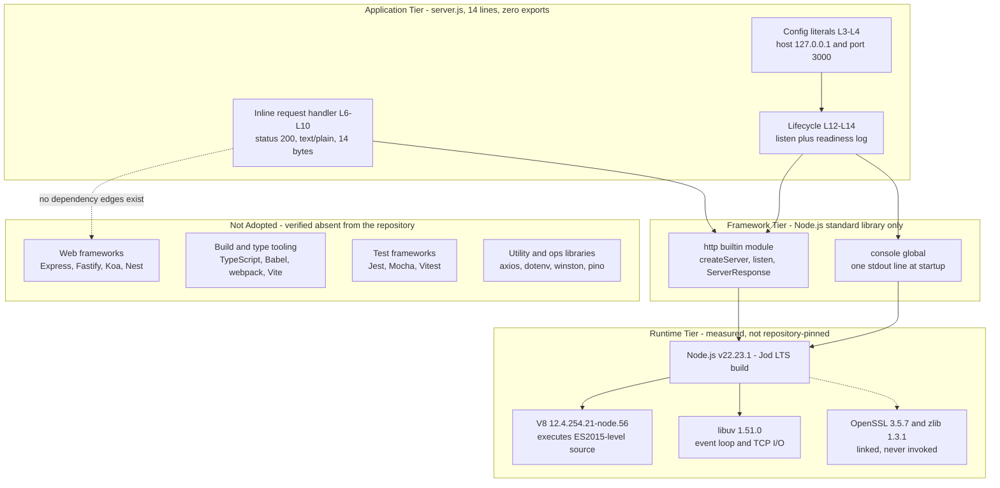
```mermaid
flowchart TB
    subgraph AppTier["Application Tier - server.js, 14 lines, zero exports"]
        Cfg["Config literals L3-L4<br/>host 127.0.0.1 and port 3000"]
        Handler["Inline request handler L6-L10<br/>status 200, text/plain, 14 bytes"]
        Lifecycle["Lifecycle L12-L14<br/>listen plus readiness log"]
    end

    subgraph StdLib["Framework Tier - Node.js standard library only"]
        HttpMod["http builtin module<br/>createServer, listen, ServerResponse"]
        ConsoleG["console global<br/>one stdout line at startup"]
    end

    subgraph RuntimeTier["Runtime Tier - measured, not repository-pinned"]
        NodeRt["Node.js v22.23.1 - Jod LTS build"]
        V8Eng["V8 12.4.254.21-node.56<br/>executes ES2015-level source"]
        LibuvC["libuv 1.51.0<br/>event loop and TCP I/O"]
        SslLib["OpenSSL 3.5.7 and zlib 1.3.1<br/>linked, never invoked"]
    end

    subgraph NotAdopted["Not Adopted - verified absent from the repository"]
        NoWeb["Web frameworks<br/>Express, Fastify, Koa, Nest"]
        NoBuild["Build and type tooling<br/>TypeScript, Babel, webpack, Vite"]
        NoTest["Test frameworks<br/>Jest, Mocha, Vitest"]
        NoUtil["Utility and ops libraries<br/>axios, dotenv, winston, pino"]
    end

    Cfg --> Lifecycle
    Handler --> HttpMod
    Lifecycle --> HttpMod
    Lifecycle --> ConsoleG
    HttpMod --> NodeRt
    ConsoleG --> NodeRt
    NodeRt --> V8Eng
    NodeRt --> LibuvC
    NodeRt -.-> SslLib
    Handler -.->|"no dependency edges exist"| NoWeb
```

### 3.2.6 Compatibility Requirements

| Requirement | Status in the Repository | Practical Implication |
|---|---|---|
| Node.js version range | **Not declared** — `engines` absent, no `.nvmrc`, `.node-version`, or `.tool-versions` | No compatibility contract exists. The artifact is confirmed working on Node.js v22.23.1; any other version is unvalidated by the repository |
| Module-system compatibility | CommonJS required — `require('http')` at L1, no `"type"` field | The file cannot be loaded by an ESM-only loader without a wrapper; no `.mjs` or dual-export path exists |
| Language-level compatibility | ES2015 floor (`const`, arrow functions, template literal) | The syntax, not the API surface, is the binding language constraint |
| npm version compatibility | Implied by `lockfileVersion: 3` | Per the npm CLI documentation, lockfile version `3` is used by npm v9 and above and is backwards compatible to npm v7. The lockfile was verified readable by npm 11.18.0 |
| Package-manager compatibility | No pin — `packageManager` field absent; no `yarn.lock`, `pnpm-lock.yaml`, or `bun.lockb` | Any npm-compatible client can operate on the project, but reproducibility of the *toolchain* is not guaranteed by the repository |
| Native-addon ABI compatibility | Not applicable | Zero dependencies means zero compiled addons, so ABI 127 imposes no constraint |
| Build-tool compatibility | Not applicable | There is no build step; no compiler, bundler, or transpiler version needs to be reconciled |
| Port availability | `3000` on the loopback interface must be free | Not a software-version constraint but a hard runtime prerequisite (F-001/F-005); contention terminates the process |

### 3.2.7 Justification for the No-Framework Decision

The repository contains no architecture decision record, so the reasoning below is derived from the artifact's stated purpose — "test project for backprop integration. Do not touch!" (`README.md` L2) — and from properties that can be verified in the code.

| Consideration | Why a Zero-Framework Stack Serves It | Contrasting Cost of Adopting a Framework |
|---|---|---|
| Behavioral invariance (F-002, F-003, F-009) | The full response contract is three consecutive statements; a diff of `server.js` is a complete diff of behavior | A framework introduces middleware ordering, default headers, and error pages that can change across patch releases and silently alter the contract |
| Empty, auditable supply chain (F-007) | Nothing to install, resolve, audit, or pin; no transitive graph to review | Even a minimal framework brings a transitive tree that must be locked, scanned, and periodically updated |
| Reproducibility across runs and hosts | With no registry interaction, `git clone` followed by `node server.js` is the entire setup path | An `npm install` step adds network dependence and a class of environment-specific failure the fixture is designed to eliminate |
| Comprehension cost as an integration target | The complete request path is visible in one screen, with no dispatch layer to trace | Routing tables and middleware chains obscure which code produced a response — undesirable when the artifact exists to be reasoned about exhaustively |
| Security surface | No third-party code executes; no lifecycle scripts run on install (no `preinstall`/`postinstall` declared) | Every added package is additional executing code and an additional advisory feed to track |
| Fitness for purpose | Node's `http` already provides a real TCP listener and a real HTTP parser, so the fixture exercises genuine protocol behavior without abstraction | A framework would add capability the artifact explicitly does not need — routing, negotiation, parsing (all listed out of scope in §1.3.2.1) |

The trade-offs of this posture are equally real and are documented rather than glossed: the absence of a framework means there is no built-in error handling, no graceful shutdown, no request logging, no security-header defaults, and no configuration layer. Those gaps are consequences of the same decision that delivers the invariance the artifact exists to provide.


## 3.3 Open Source Dependencies

The third-party open-source dependency set of `hao-backprop-test` is **empty at every tier** — production, development, peer, optional, and bundled. This is a declared and locked property of the artifact (feature F-007), not an artefact of an incomplete install, and it was confirmed by four independent measurements rather than by reading a single file.

### 3.3.1 Dependency Inventory

| Dependency Class | Declared Count | Resolved Count | Evidence |
|---|---|---|---|
| `dependencies` (production) | 0 | 0 | Key absent from `package.json`; `npm pkg get dependencies` → `{}` |
| `devDependencies` | 0 | 0 | Key absent from `package.json` |
| `peerDependencies` / `optionalDependencies` | 0 | 0 | Both keys absent; `npm audit` reports `peer: 0`, `optional: 0` |
| `bundleDependencies` / `overrides` | 0 | 0 | Both keys absent |

A single command confirms the whole picture at once: `npm pkg get dependencies devDependencies peerDependencies optionalDependencies bundleDependencies overrides` returns `{}` — every one of those keys is absent from the manifest, not merely empty.

The only library the code consumes is Node's builtin `http` (`server.js` L1). Builtins are part of the runtime distribution, are never installed, and by definition never appear in a dependency graph — so the empty graph is fully consistent with the program functioning.

### 3.3.2 Package Registry and Lockfile Semantics

| Aspect | Observed Value | Interpretation |
|---|---|---|
| Package ecosystem | npm | The only manifest/lockfile pair in the repository; no `yarn.lock`, `pnpm-lock.yaml`, `bun.lockb`, or non-JavaScript manifest exists |
| Effective registry | `https://registry.npmjs.org/` | This is npm's **default**, not a repository declaration — no `.npmrc` and no `publishConfig` exist, so the repository configures no registry, scope, mirror, or authentication |
| Lockfile format | `lockfileVersion: 3` (`package-lock.json` L4) | Per the npm CLI documentation, version `3` is the format used by npm v9 and above and is backwards compatible to npm v7. This is the **only** toolchain-version signal the repository itself emits |
| Lockfile `requires` flag | `true` (L5) | Standard top-level marker retained by npm; it does not imply any required package |
| Locked package entries | One — the root project, keyed `""` (L6–L12) | The npm documentation states the root project is keyed as `""`; every other key would be a relative path to an installed package. There are none |
| `resolved` URLs | 0 occurrences | Nothing was ever fetched from a registry — verified by grep across the lockfile |
| `integrity` (SRI) hashes | 0 occurrences | No tarball digests exist because no tarball is referenced |
| Installed tree | Absent | No `node_modules/` directory; `npm ls --all` → `hello_world@1.0.0` then `└── (empty)` |

The lockfile is therefore best characterised as a **positive assertion of emptiness**: it is a syntactically valid, current-format lockfile that formally records a zero-package graph, rather than a missing or stale file that merely fails to record dependencies. That distinction is what makes the zero-dependency guarantee auditable.

```json
"packages": { "": { "name": "hello_world", "version": "1.0.0", "license": "MIT" } }
```

### 3.3.3 License Posture of the Package Itself

The repository declares itself open source but does not ship the corresponding legal text.

| Item | Observed | Consequence |
|---|---|---|
| `license` field in `package.json` (L10) | `MIT` | Tooling and registries will report the package as MIT-licensed |
| `license` field in `package-lock.json` root entry (L10) | `MIT` | Manifest and lockfile agree, so no metadata conflict exists |
| `LICENSE` / `LICENSE.md` file | **Absent** | The MIT text is not distributed with the code — tracked as defect **D-03** in §2.5 |
| `NOTICE`, `SECURITY.md`, `CONTRIBUTING.md`, `CODEOWNERS` | **Absent** | No attribution, vulnerability-reporting, or ownership policy accompanies the declaration |

Because there are no third-party packages, there is correspondingly **no inbound license obligation** — no copyleft, attribution, or notice requirement flows into this artifact from any dependency. The only license question is the outbound one recorded above.

### 3.3.4 Supply-Chain Security Posture

The security implications of the empty dependency set were measured, not assumed.

| Control / Risk Dimension | Measured Result | Basis |
|---|---|---|
| Known vulnerabilities in third-party code | **0** across info, low, moderate, high, and critical | `npm audit --json` → `auditReportVersion: 2`, `vulnerabilities: {}`, all severity counters `0`, third-party dependency total `0` (the reported `prod: 1` is the root package itself) |
| Transitive attack surface | None | Lockfile contains no non-root entry; there is no transitive tree to enumerate |
| Install-time code execution | None | `npm pkg get scripts` returns only the `test` entry — there is no `preinstall`, `install`, `postinstall`, `prepare`, `prepack`, or `prepublish` hook, so `npm install` runs no repository-authored code |
| Registry-substitution / typosquat exposure | None in practice | No package name is ever resolved; no `.npmrc` redirects a registry; no scope is configured |
| Artifact-integrity verification | Not applicable to dependencies; available for source | No `integrity` hashes exist because nothing is fetched. Integrity of the artifact itself is instead verifiable against the SHA-256 digests recorded in §2.5 |
| Automated dependency scanning | **Not configured** | No `npm audit` step, Dependabot/Renovate configuration, SBOM, or provenance/attestation gate exists anywhere in the repository — there is no CI pipeline to host one (§3.6) |
| Vendored or committed third-party code | None | Git tracks exactly four files; no vendored source, no `node_modules/` in history |

The net posture is unusual and worth stating plainly: the **third-party** supply-chain risk of this repository is nil, and that is precisely the property the artifact is designed to deliver — it removes dependency resolution as a variable from any integration exercise that consumes it. The residual risks lie entirely elsewhere: an unpinned runtime (§3.1.5), an unenforced change freeze (F-009), and no automated verification (§3.6.4).

### 3.3.5 Constraints Imposed by the Zero-Dependency Contract

| Constraint | Implication |
|---|---|
| Adding any package changes the artifact's character | It would convert verification from static inspection into resolution, install, and audit, and would reintroduce version drift between runs — the exact variance the fixture exists to eliminate |
| Any consuming pipeline must tolerate a no-op install | `npm install` and `npm ci` have nothing to fetch; a pipeline that treats an empty install as a failure would misreport the project |
| No offline/air-gapped install concern exists | Because nothing is fetched, the project runs without registry access — a deliberate benefit rather than a limitation |
| The lockfile must be kept in step with the manifest | Both currently assert `hello_world@1.0.0` and `MIT`; divergence would be the first observable symptom of an unauthorised change under the F-009 freeze |


## 3.4 Third-Party Services

`hao-backprop-test` integrates with **no third-party service at runtime**. The running process opens exactly one socket — an inbound listener on the loopback interface — and never initiates an outbound connection. This section records the verified absence of each service category the section prompt calls for, then documents the only external relationships that genuinely exist, both of which are *tooling and distribution* concerns rather than runtime integrations.

### 3.4.1 Runtime Service Integrations

**None.** The evidence is categorical rather than circumstantial:

| Check | Result |
|---|---|
| Outbound-call primitives in `server.js` (`fetch`, `http.request`, `http.get`, `https`, `net.`, `dns.`, `child_process`, `axios`, `got`, `WebSocket`, `XMLHttpRequest`, `URL()`) | **Zero matches** — no outbound network call and no subprocess spawn is possible |
| URL literals anywhere in the repository | Exactly **one**: the template literal `http://${hostname}:${port}/` at `server.js` L13, used solely to compose the stdout readiness message. It is not an endpoint the code calls |
| Third-party endpoints, webhook targets, callback URLs, or service base URLs | **None** in any of the four files |
| Credential material (`secret`, `token`, `api_key`, `password`, `credential`, `bearer`, `client_id`) | **Zero matches** across all tracked files — there is nothing to authenticate with, because there is nothing to authenticate to |
| Environment-variable configuration that could inject a service endpoint | **None** — zero `process.env` reads; no `.env` file, config module, or CLI parsing |

Because `server.js` reads no configuration and holds no client library, an external service cannot be introduced without a source change — which the F-009 change freeze forbids.

### 3.4.2 External APIs and Integrations — Verified Absent

| Category | Status | Verification |
|---|---|---|
| REST / GraphQL / gRPC APIs consumed | Not present | No HTTP client, no GraphQL client, no protobuf definition or `.proto` file |
| APIs exposed to third parties | Not applicable as a service integration | One endpoint exists, but it is bound to `127.0.0.1` and is unreachable off-host; no API contract artifact (OpenAPI/Swagger) is published |
| Payment / commerce providers | Not present | Zero content matches for `stripe` |
| AI / LLM providers and frameworks | Not present | Zero content matches for `langchain`, `openai`, `anthropic` |
| Message brokers, queues, and event buses | Not present | No broker client, no queue configuration, no subscriber or publisher code |
| Email, SMS, or notification services | Not present | No transport library or provider SDK |
| Feature-flag or configuration services | Not present | No SDK and no remote-config fetch — configuration is two source literals (F-005) |

### 3.4.3 Authentication and Identity Services — Verified Absent

| Category | Status | Verification |
|---|---|---|
| Hosted identity providers (Auth0, Okta, Cognito, Keycloak) | Not present | Zero content matches for `auth0`, `okta`, `cognito`, `keycloak` |
| Token and protocol libraries (JWT, OAuth/OIDC, SAML) | Not present | Zero content matches for `jwt`, `oauth`, `passport` |
| Session and cookie handling | Not present | Zero content matches for `session`, `cookie`; the handler never reads request headers |
| Password hashing / cryptographic primitives | Not present | Zero content matches for `bcrypt` and `crypto`; Node's `crypto` module is never required |
| Secrets managers and vaults | Not present | No SDK, no secret reference, and no environment-variable read through which one could be supplied |
| Transport security (TLS termination, certificates) | Not present | No HTTPS server, no certificate or key material; OpenSSL 3.5.7 is linked into the runtime but never invoked (§3.2.3) |

The system's only access control is topological: the `127.0.0.1` bind at `server.js` L3 restricts callers to the same host. §2.4.4 records this as the artifact's primary security control.

### 3.4.4 Monitoring and Observability Tools — Verified Absent

| Category | Status | Verification |
|---|---|---|
| APM and error tracking (Datadog, New Relic, Sentry) | Not present | Zero content matches for `datadog`, `newrelic`, `sentry` |
| Metrics and dashboards (Prometheus, StatsD) | Not present | Zero content matches for `prometheus`; no metrics endpoint or exporter |
| Distributed tracing (OpenTelemetry) | Not present | Zero content matches for `opentelemetry`, `otel` |
| Structured logging and log shipping (Winston, Pino, Bunyan, Morgan) | Not present | Zero content matches for all four; the entire logging surface is one `console.log` at `server.js` L13 |
| Health / readiness probe endpoints | Not present | The handler ignores the request path, so no dedicated probe route can exist (F-003) |
| Uptime or synthetic monitoring | Not present | No configuration, and the loopback bind makes external probing impossible |

The complete observability contract is therefore: one stdout line at startup (F-004), the constant HTTP response, and the process exit status. Anything further must be measured by external tooling that this repository neither includes nor references.

### 3.4.5 Cloud Services — Verified Absent

| Category | Status | Verification |
|---|---|---|
| AWS (any service) | Not present | Zero content matches for `aws`, `s3`, `dynamo`; no `aws-sdk`/`@aws-sdk` dependency, no credentials file reference, no region configuration |
| Azure / Google Cloud | Not present | Zero content matches for `azure`, `gcp`, `google-cloud` |
| Backend-as-a-service (Firebase, Supabase) | Not present | Zero content matches for `firebase`, `supabase` |
| Managed compute / serverless | Not present | No `serverless.yml`, `template.yaml`, `app.yaml`, `Procfile`, `vercel.json`, `netlify.toml`, `fly.toml`, or `render.yaml` |
| Container registries and orchestration | Not present | No `Dockerfile`, compose file, Helm chart, or Kubernetes manifest (§3.6.3) |
| Infrastructure as Code | Not present | No `*.tf`, `*.tfvars`, `*.hcl`, `*.bicep`, or CloudFormation template — and in fact **no YAML or TOML file of any kind** exists in the repository |
| CDN, DNS, load balancing | Not present | No configuration artifact, and the loopback bind precludes any of them |

There is no deployment target of any kind. The artifact's execution environment is "the host on which `node server.js` is invoked", consistent with §1.3.1.2.

### 3.4.6 External Relationships That Do Exist

Two relationships with external parties are real, but neither is a runtime service dependency — the process itself never contacts either one.

| Relationship | Nature | Evidence and Scope |
|---|---|---|
| Public npm registry (`https://registry.npmjs.org/`) | **Tooling, latent** | `npm config get registry` resolves to npm's default. Because no `.npmrc` exists and the dependency graph is empty, npm has nothing to fetch — the registry is never actually contacted during install or run. Nothing is published to it either (no `publishConfig`, no `private` flag) |
| GitHub | **Source distribution** | `git remote get-url origin` resolves to a GitHub repository (`Existing-product-30-july-branch-main-02`); branch `main` tracks `origin/main`, and the entire content arrived in the single commit `ab2aed6`. Note that the checkout URL in `.git/config` carries an ephemeral environment-supplied access token; it is **not** committed in any tracked file and is deliberately not reproduced in this specification |

Neither relationship is exercised by the running service. An operator can clone once and run the artifact indefinitely with no network access whatsoever.

### 3.4.7 Integration and Trust Boundary

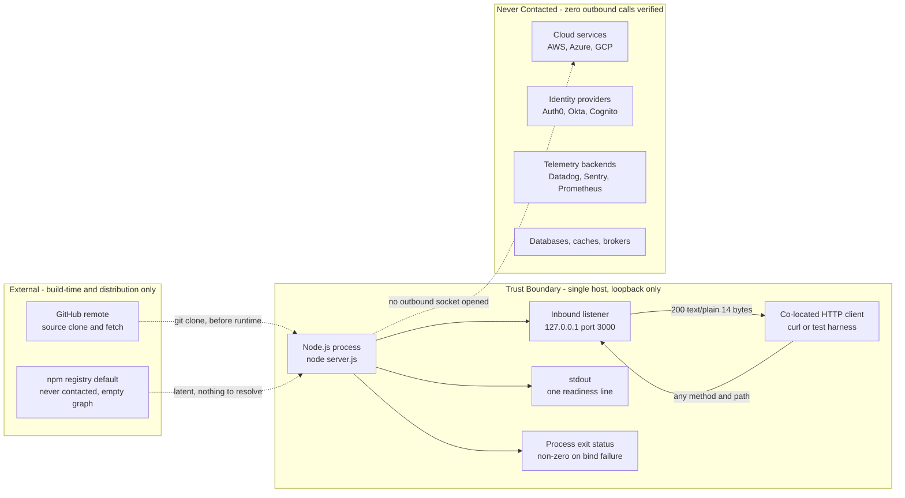
```mermaid
flowchart LR
    subgraph SameHost["Trust Boundary - single host, loopback only"]
        Proc["Node.js process<br/>node server.js"]
        Listener["Inbound listener<br/>127.0.0.1 port 3000"]
        Stdout["stdout<br/>one readiness line"]
        ExitCode["Process exit status<br/>non-zero on bind failure"]
        LocalClient["Co-located HTTP client<br/>curl or test harness"]
    end

    subgraph Tooling["External - build-time and distribution only"]
        GitHubRemote["GitHub remote<br/>source clone and fetch"]
        NpmReg["npm registry default<br/>never contacted, empty graph"]
    end

    subgraph NeverContacted["Never Contacted - zero outbound calls verified"]
        NoCloud["Cloud services<br/>AWS, Azure, GCP"]
        NoAuth["Identity providers<br/>Auth0, Okta, Cognito"]
        NoTelemetry["Telemetry backends<br/>Datadog, Sentry, Prometheus"]
        NoData["Databases, caches, brokers"]
    end

    Proc --> Listener
    Proc --> Stdout
    Proc --> ExitCode
    LocalClient -->|"any method and path"| Listener
    Listener -->|"200 text/plain 14 bytes"| LocalClient
    GitHubRemote -.->|"git clone, before runtime"| Proc
    NpmReg -.->|"latent, nothing to resolve"| Proc
    Proc -.->|"no outbound socket opened"| NoCloud
```

The diagram makes the essential point visually: every arrow crossing the trust boundary is either inbound on loopback or a pre-runtime source transfer. There is no outbound runtime edge at all.


## 3.5 Databases &amp; Storage

`hao-backprop-test` has **no data tier**. There is no primary database, no secondary or replica store, no cache, no object or file storage, and no durable state of any kind produced at runtime. The system is stateless in the strictest sense available to a networked process: it holds only a listening socket and the transient response object for each in-flight request.

### 3.5.1 Storage Technology Inventory

| Storage Tier | Technology Selected | Verification |
|---|---|---|
| Primary database | **None** | No driver, ORM, connection string, or schema file; zero content matches for `mongo`, `postgres`, `pg`, `mysql`, `sqlite` |
| Secondary / replica / analytical store | **None** | No second data path exists to replicate from |
| Object-relational mapping / query layer | **None** | Zero content matches for `mongoose`, `sequelize`, `prisma`, `typeorm`, `knex` |
| Cache | **None** | Zero content matches for `redis`, `memcach`; no in-process cache — no `Map`, `Set`, or `WeakMap` appears in `server.js` |
| Search index | **None** | Zero content matches for `elasticsearch` |
| Object / blob storage | **None** | Zero content matches for `s3`, `dynamo`, `firebase`, `supabase`; no cloud storage SDK |
| Local filesystem persistence | **None** | `server.js` never requires `fs` or `path`; zero matches for `readFile`, `writeFile`, `createReadStream`, `createWriteStream`, `os.tmpdir` |
| Message queue / stream (as durable state) | **None** | No broker client or stream consumer |
| Migration / schema tooling | **None** | No migration directory, no `.sql` file, no schema definition |

The absence is total and is consistent with §1.3.1.2, which records that the system reads no files and writes no files at runtime.

### 3.5.2 Data Persistence Strategy

The persistence strategy is best described as **compile-time constant data with no runtime store**. What would elsewhere be a data-access layer is, here, a single string literal in source.

| Data Element | Where It Lives | Lifetime | Durability Mechanism |
|---|---|---|---|
| Response body `Hello, World!\n` | Source literal, `server.js` L9 | Permanent for the life of the commit | Git version control — the "database" is the repository itself |
| Bind host and port (`127.0.0.1`, `3000`) | Source literals, `server.js` L3–L4 | Permanent for the life of the commit | Git version control (F-005) |
| Package identity and license metadata | `package.json`, `package-lock.json` | Permanent for the life of the commit | Git version control (F-006, F-007) |
| Inbound request line, headers, and body | Node's `http` parser buffers only | Discarded unread | **None** — `req` is never dereferenced (F-003) |
| `ServerResponse` object per request | Process heap | Until `res.end()` completes | **None** — garbage collected |
| Listening socket | Kernel + libuv | Until process exit | **None** — released on termination |
| Startup readiness line | Process stdout | Until the terminal buffer is discarded | **None** — never written to a file (F-004) |

#### 3.5.2.1 Immutability of Runtime State

All four module-level bindings in `server.js` are declared `const` — `http` (L1), `hostname` (L3), `port` (L4), and `server` (L6). A grep for `let ` and `var ` across the file returns **zero matches**. There is therefore no mutable module-level variable, no counter, no accumulator, and no session map that could constitute application state between requests. Each request is served from constants alone, which is precisely what makes the response contract byte-identical across requests (F-002/F-003).

#### 3.5.2.2 Verified Zero-Write Behavior

The claim that the service persists nothing was **measured, not inferred**. The checkout was snapshotted (file paths and sizes), the service was started, a `GET /` and a `POST /w` carrying a body were issued, the process was stopped, and the checkout was snapshotted again. The two snapshots hashed identically, and the post-run file listing was still exactly the original four files — no log file, data file, temporary file, or cache directory was created anywhere.

### 3.5.3 Caching Solutions

**None at any layer.**

| Cache Layer | Status | Basis |
|---|---|---|
| Application / in-process cache | Not present | No `Map`, `Set`, `WeakMap`, or module-level mutable store exists |
| Distributed cache (Redis, Memcached) | Not present | No client library and no connection configuration |
| HTTP response caching directives | Not set by application code | `server.js` L8 sets only `Content-Type`; no `Cache-Control`, `ETag`, `Expires`, or `Last-Modified` header is emitted, and no `304` path exists |
| Connection reuse (adjacent to caching) | Runtime default only | `Connection: keep-alive` and `Keep-Alive: timeout=5` were observed on responses, but both are Node `http` defaults — no `keepAliveTimeout` or agent setting appears in the repository (§3.2.2.2) |
| Build or dependency cache | Not applicable | There is no build step and nothing to install (§3.3) |

Caching would be architecturally meaningless here: the response is a 14-byte literal produced by three statements with no I/O, computation, or lookup on the request path, so there is no work for a cache to avoid.

### 3.5.4 Architectural Consequences

| Dimension | Consequence of Having No Data Tier |
|---|---|
| Horizontal scalability | The handler is inherently stateless, so it imposes no affinity, session-replication, or shared-store requirement. The binding scale limit documented in §2.4.3 comes from the hard-coded loopback port, not from data |
| Failure recovery | There is nothing to recover. Process restart returns the system to an identical state because all state is compile-time constant |
| Backup and retention | No backup, snapshot, retention policy, or point-in-time recovery is required or configured — the Git history is the only recoverable artifact |
| Data security and privacy | No personal data, credentials, or user input is stored, buffered for reuse, or logged. The response body is a source literal containing no user data and no reflected input, so the artifact cannot leak data at rest |
| Encryption at rest | Not applicable — there is no data at rest beyond the source files themselves, which are stored in Git |
| Data-tier operational surface | Zero connection pools, zero credentials to rotate, zero schema migrations, and no driver version to keep compatible with the runtime |
| Verification approach | Because nothing persists, verifying the artifact is a single stateless HTTP request; there is no fixture data to seed or tear down |

The absence of a data tier is therefore not a deficiency relative to the artifact's purpose — it is the mechanism that guarantees the fixture behaves identically on the first request and the thousandth, on a fresh host and a reused one.


## 3.6 Development &amp; Deployment

The development and deployment story of `hao-backprop-test` is entirely manual. The repository contains **no build system, no containerization, no infrastructure definition, and no CI/CD pipeline**, and its single declared script is a deliberate failure. What follows records the toolchain that actually exists, the exact launch and verification paths that work, and the constraints any consuming automation must respect.

### 3.6.1 Development Tools

Every tool below is supplied by the environment. The repository pins **none** of them — there is no `engines` field, no `packageManager` field, and no `.nvmrc`, `.node-version`, or `.tool-versions` file. Versions are recorded as measured in the verification environment so the results in this specification are reproducible.

| Tool | Measured Version | Role | Pinned by Repository? |
|---|---|---|---|
| Node.js runtime | v22.23.1 ("Jod" LTS build) | Executes `server.js`; supplies the `http` builtin | No |
| npm CLI | 11.18.0 | Reads the manifest, runs the one declared script, interprets the lockfile | No |
| Git | 2.43.0 | Source control and distribution; `main` tracks `origin/main` | No (no `.gitattributes`, no hooks) |
| `node --check` | Part of Node.js | The only static-analysis capability available — passes on `server.js` | No (not wired into any script) |
| HTTP client (e.g. `curl`) | Environment-supplied | The only practical way to verify behavior, since no test runner exists | No |

Quality-tooling absences are equally definitive and were each checked individually: no ESLint, Prettier, TypeScript, `.editorconfig`, Husky, or active Git hook exists (the `.git/hooks` directory contains only `*.sample` templates), and there is no `.gitignore` or `.gitattributes` file.

### 3.6.2 Build System

There is no build system, because there is nothing to build. The committed `server.js` is executed verbatim — a property established in §3.1.2.1 and worth restating here as an operational fact: **there is no artifact-producing step between the repository and the running process.**

#### 3.6.2.1 Declared Script Surface

`npm run` reports the complete lifecycle-script surface of the package:

| Script | Definition | Measured Behavior |
|---|---|---|
| `test` | `echo "Error: no test specified" && exit 1` (`package.json` L7) | Prints the message and exits **1** — fails by construction (defect **D-02**) |

That single entry is the entire surface. `npm pkg get scripts` confirms there is no `build`, `start`, `lint`, `prepare`, `preinstall`, `postinstall`, or any other hook, which also means `npm install` executes no repository-authored code (§3.3.4).

#### 3.6.2.2 Install Step Behavior

The install step is a verified no-op. Running `npm ci` in the checkout completes successfully — reporting that it audited one package (the root project) and found zero vulnerabilities — **without creating a `node_modules` directory** and without modifying the working tree, which remained clean under `git status --porcelain`. Any automation that treats an empty install as an error condition would misreport this project.

#### 3.6.2.3 Launch Paths

| Invocation | Result | Explanation |
|---|---|---|
| `node server.js` | **Works** — binds and logs readiness | The canonical, supported path |
| `npm start` | **Works** — npm prints `> node server.js`, then the readiness line | No `start` script is declared; npm's **built-in default** resolves to `node server.js`. The behavior is supplied by the npm CLI, not by the repository |
| `node .` | **Fails** — `MODULE_NOT_FOUND`, exit 1 | Follows `main: index.js` (`package.json` L5), and no `index.js` exists (defect **D-01**) |
| `npm test` | **Fails** — exit 1 | The stub described above |

### 3.6.3 Containerization and Infrastructure

| Capability | Status | Verification |
|---|---|---|
| Container image definition | **Absent** | No `Dockerfile`, `dockerfile`, `Containerfile`, or `.dockerignore` |
| Local multi-service composition | **Absent** | No `docker-compose.yml`, `docker-compose.yaml`, or `compose.yaml` |
| Orchestration manifests | **Absent** | No Kubernetes manifest, Helm chart, or `skaffold.yaml` |
| Infrastructure as Code | **Absent** | No `*.tf`, `*.tfvars`, `*.hcl`, `*.bicep`, or CloudFormation template |
| PaaS / serverless descriptors | **Absent** | No `Procfile`, `app.yaml`, `serverless.yml`, `template.yaml`, `vercel.json`, `netlify.toml`, `fly.toml`, or `render.yaml` |
| Any YAML or TOML file at all | **Absent** | An extension sweep across the repository returned no `.yml`, `.yaml`, `.toml`, `.ini`, or `.cfg` file |
| Process supervision | **Absent** | No systemd unit, PM2 configuration, or supervisor definition |

Two properties of the source would need to change before containerization could be meaningful, and both are protected by the F-009 change freeze: the loopback bind at `server.js` L3 makes the listener unreachable from outside its network namespace, and the hard-coded port at L4 offers no override channel. This is recorded in §2.4.6 as a binding constraint, not as planned work.

### 3.6.4 CI/CD Requirements

No pipeline exists. There is no `.github/` directory (and therefore no GitHub Actions workflow), no `.gitlab-ci.yml`, `Jenkinsfile`, `.circleci/`, `azure-pipelines.yml`, `.travis.yml`, `bitbucket-pipelines.yml`, `Makefile`, `buildspec.yml`, or `cloudbuild.yaml`. There is also no `CODEOWNERS` file or branch-protection artifact, so the change freeze has no technical enforcement (§2.4.4).

Because verification cannot be delegated to the repository, the constraints below define what any external pipeline would have to accommodate. They are observed consequences of the artifact's state, not a proposed pipeline design.

| Constraint on Automation | Reason | Required Accommodation |
|---|---|---|
| `npm test` can never pass | Hard-coded `exit 1` (D-02) | A pipeline must not gate on `npm test`; treat the non-zero exit as expected |
| `node .` cannot be used to start the service | `main` names a missing file (D-01) | Use `node server.js` or `npm start` |
| The install step resolves nothing | Empty dependency graph (§3.3) | Accept a no-op `npm ci`; do not require a populated `node_modules` |
| No runtime version is declared | `engines` absent | The pipeline, not the repository, must choose and record the Node.js version |
| Readiness is a one-shot stdout line | Single `console.log` (F-004) | Wait for the readiness line at launch; there is no health endpoint to poll afterwards |
| The service is reachable only from its own host | Loopback bind (F-005) | Run the client in the same container/host as the process |
| Port `3000` must be free and contention is fatal | No error handler; unhandled `EADDRINUSE` | Ensure exclusive use of the port; a second concurrent instance terminates the process |
| Success must be asserted externally | No test runner or assertion library | Issue an HTTP request and assert `200`, `Content-Type: text/plain`, and the 14-byte body |
| Artifact integrity is the only change gate | Freeze is documentation-only (F-009) | Compare files against the SHA-256 digests recorded in §2.5 |

The practical verification sequence that substitutes for a pipeline is exactly the one used to produce this specification: `node --check server.js`, then start the process, wait for the readiness line, issue a request, assert the response, and terminate the process.

### 3.6.5 Deployment Model

| Aspect | Observed Model |
|---|---|
| Deployment unit | The Git checkout itself — four files, no packaging, no artifact, nothing published to a registry |
| Deployment mechanism | `git clone` (or `git fetch`) followed by a manual `node server.js` |
| Runtime topology | One foreground Node.js process, one event loop, one listener; no clustering, worker threads, or reverse proxy |
| Environments | None differentiated — there is no dev/stage/prod configuration, because there is no configuration channel at all (F-005) |
| Rollout / rollback | Git-level only; a rollback is a checkout of a prior commit, and there is only one commit (`ab2aed6`) to roll back to |
| Shutdown | Abrupt process termination — no `SIGTERM`/`SIGINT` handler and no `server.close()`, so in-flight requests are not drained |
| Network exposure at deploy time | Loopback only; callers must be co-located |
| Post-deploy footprint | Nothing written to disk — verified by snapshotting the checkout before and after serving requests (§3.5.2.2) |

### 3.6.6 Toolchain and Execution Flow

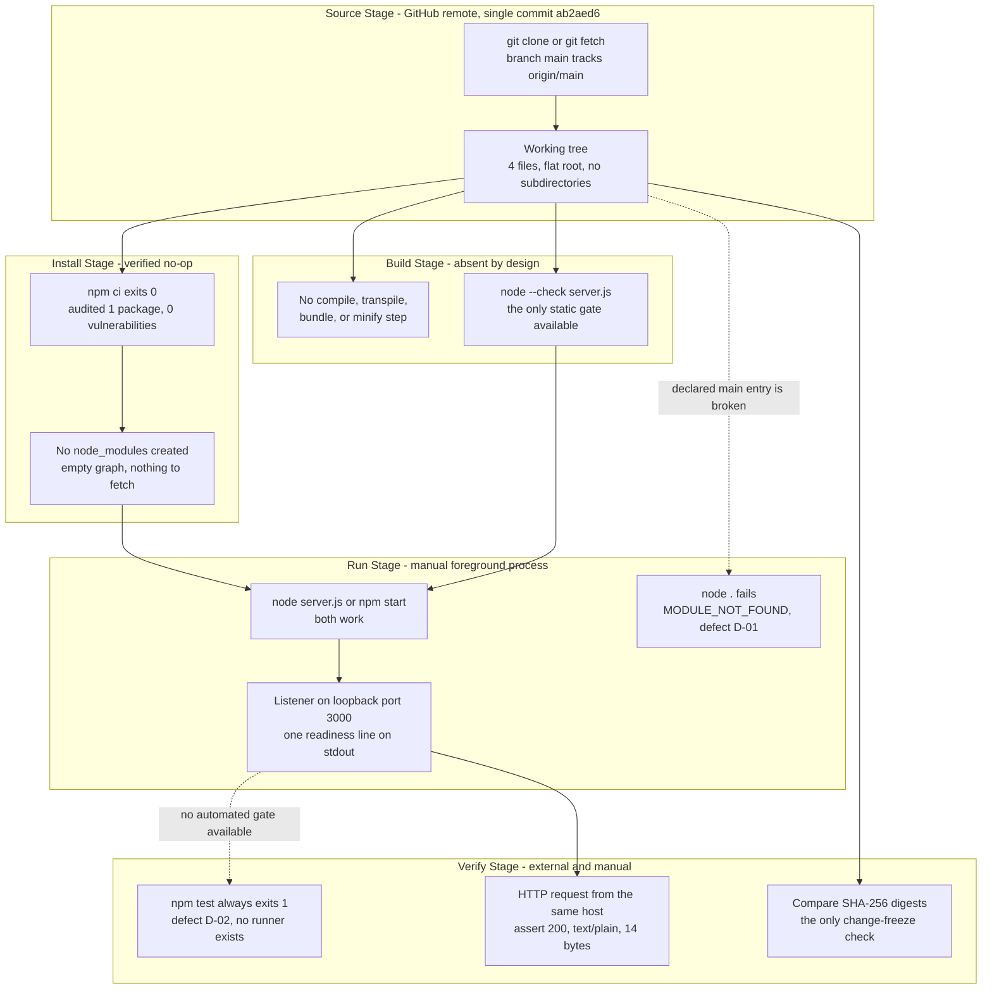
```mermaid
flowchart TB
    subgraph SourceStage["Source Stage - GitHub remote, single commit ab2aed6"]
        Clone["git clone or git fetch<br/>branch main tracks origin/main"]
        Tree["Working tree<br/>4 files, flat root, no subdirectories"]
    end

    subgraph InstallStage["Install Stage - verified no-op"]
        NpmCi["npm ci exits 0<br/>audited 1 package, 0 vulnerabilities"]
        NoMods["No node_modules created<br/>empty graph, nothing to fetch"]
    end

    subgraph BuildStage["Build Stage - absent by design"]
        NoCompile["No compile, transpile,<br/>bundle, or minify step"]
        SyntaxChk["node --check server.js<br/>the only static gate available"]
    end

    subgraph RunStage["Run Stage - manual foreground process"]
        StartOk["node server.js or npm start<br/>both work"]
        StartFail["node . fails<br/>MODULE_NOT_FOUND, defect D-01"]
        Live["Listener on loopback port 3000<br/>one readiness line on stdout"]
    end

    subgraph VerifyStage["Verify Stage - external and manual"]
        NpmTest["npm test always exits 1<br/>defect D-02, no runner exists"]
        CurlChk["HTTP request from the same host<br/>assert 200, text/plain, 14 bytes"]
        Digest["Compare SHA-256 digests<br/>the only change-freeze check"]
    end

    Clone --> Tree
    Tree --> NpmCi
    NpmCi --> NoMods
    Tree --> NoCompile
    Tree --> SyntaxChk
    NoMods --> StartOk
    SyntaxChk --> StartOk
    StartOk --> Live
    Tree -.->|"declared main entry is broken"| StartFail
    Live --> CurlChk
    Tree --> Digest
    Live -.->|"no automated gate available"| NpmTest
```

### 3.6.7 Security Considerations for the Development and Deployment Path

| Consideration | Observed Position |
|---|---|
| Install-time code execution | None possible — no dependencies and no lifecycle hooks, so `npm install`/`npm ci` run no third-party or repository-authored code |
| Committed secrets | None — a repository-wide sweep for `secret`, `token`, `api_key`, `password`, `credential`, `bearer`, and `client_id` returned zero matches. The access token present in the local `.git/config` checkout URL is environment-supplied and is not tracked by Git |
| Registry authentication | None configured — no `.npmrc`, so no credential or private-registry reference exists in the repository |
| Supply-chain gates in the pipeline | None, because no pipeline exists — no audit step, SBOM, provenance attestation, or signature verification is configured |
| Commit provenance | Weak — a single unsigned commit; no commit-signing configuration, `CODEOWNERS`, or branch protection artifact is present |
| Transport security in deployment | None — plaintext HTTP only; no TLS material and no HTTPS server, with OpenSSL linked into the runtime but never invoked |
| Blast radius of a compromised deployment | Minimal by construction — a loopback-only listener that reads no input, writes no files, holds no credentials, and makes no outbound calls |


## 3.7 References

### 3.7.1 Repository Files Examined

All four Git-tracked files were read in full; no file in the repository was left unexamined.

- `server.js` - Established the sole implementation language and module system (`require('http')` at L1, CommonJS), the ES2015 feature floor (`const`, arrow functions, template literal), the complete Node.js core API surface consumed (`http.createServer` L6, `Server#listen` L12, `ServerResponse.statusCode`/`setHeader`/`end` L7–L9, `console.log` L13), the configuration literals `127.0.0.1` and `3000` (L3–L4), the absence of any export, and the absence of `fs`, `path`, `process.env`, mutable state, and outbound-call primitives.
- `package.json` - Established package identity `hello_world@1.0.0`, the `description`, `main: index.js` (defect D-01), the single failing `test` script (L7, defect D-02), `author`, and the `license: MIT` declaration (defect D-03); and — by verified absence of keys — the empty dependency set, the unpinned runtime (`engines`), the unpinned package manager (`packageManager`), the CommonJS default (`type`), and the lack of any lifecycle hook.
- `package-lock.json` - Established `lockfileVersion: 3` (L4), `requires: true` (L5), and a `packages` map containing only the root `""` entry (L6–L12); grep confirmed zero `resolved` URLs and zero `integrity` hashes, proving the dependency graph is formally locked as empty.
- `README.md` - Established the project identity `hao-backprop-test` (L1) and the purpose plus change-freeze directive (L2) that underpins the justification for the zero-framework, zero-dependency posture.

### 3.7.2 Repository Folders Examined

- Repository root (`""`) - Contained exactly four files and **zero subdirectories**, confirming there is no second platform, tier, or build target; the extension census returned `2 × .json`, `1 × .md`, `1 × .js` and nothing else.
- `.git/` (metadata only, no tracked content) - Established provenance: single commit `ab2aed6`, branch `main` tracking `origin/main`, no tags, a GitHub remote, and a hooks directory containing only `*.sample` templates (no active hooks). The checkout URL's ephemeral access token was deliberately not reproduced.

### 3.7.3 Technical Specification Sections Cross-Referenced

- **1.1 Executive Summary** - Canonical naming conventions (`hao-backprop-test` / `hello_world` / the Git remote name) and the framing that the repository declares no targets or budgets.
- **1.2 System Overview** - Corroborated the component inventory, the start-on-evaluation lifecycle, the unhandled `EADDRINUSE` behavior, and the framing of Node.js 22 as a verification-environment observation.
- **1.3 Scope** - The "Key technical requirements" table (language, runtime, bind address, port, dependency count, launch invocation) and the exhaustive out-of-scope list, which corroborated the absence sweep item for item.
- **2.1 Feature Catalog** - Feature identifiers **F-001** through **F-009** used throughout this section to tie each technology choice to the capability it serves.
- **2.4 Implementation Considerations** - Defect identifiers **D-01**, **D-02**, **D-03**, the binding-constraint summary, and the security implications referenced in §3.4.3 and §3.6.3.
- **2.5 Traceability and Requirement Governance** - The SHA-256 file digests that serve as the only technical change-freeze check, referenced in §3.3.4 and §3.6.4.

### 3.7.4 External and Authoritative Sources

The `web_search` tool was unavailable during this investigation. External facts were therefore taken from authoritative material available locally, which is stronger evidence than a web page because it is the shipped documentation of the exact tool version in use.

- `/usr/lib/node_modules/npm/docs/content/configuring-npm/package-lock-json.md` (npm 11.18.0 documentation bundle) - Established `lockfileVersion` semantics (version `3` is used by npm v9 and above and is backwards compatible to npm v7), that the root project is canonically keyed as `""` in the `packages` map, and the meaning of the `requires` field.
- Node.js runtime self-report (`process.versions`, `process.release`) - Established the measured component versions (Node v22.23.1, V8 12.4.254.21-node.56, libuv 1.51.0, OpenSSL 3.5.7, zlib 1.3.1-e00f703, ABI 127) and that the observed build is on the "Jod" LTS line.
- Node.js module registry self-report (`require('module').builtinModules`) - Confirmed `http` is a runtime builtin, and therefore never part of any dependency graph.

### 3.7.5 Verification Commands Behind the Measured Figures

Every version, count, and behavioral claim in this section came from one of the following, executed against the repository checkout.

| Command | What It Established |
|---|---|
| `git ls-files`, `find`, extension census | Complete four-file inventory, zero subdirectories, three file formats |
| `node --version`, `npm --version`, `git --version`, `node -p process.versions` | Toolchain and embedded-component versions (§3.2.3, §3.6.1) |
| `node --check server.js` | Syntactic validity; the only static gate available |
| `npm pkg get …` (dependency, engines, type, packageManager, scripts keys) | Verified key *absence* rather than emptiness (§3.3.1, §3.6.2.1) |
| `npm ls --all`, absence of `node_modules/` | Empty resolved dependency tree (§3.3.1) |
| `npm audit --json` | Zero vulnerabilities across all severities; third-party dependency total of 0 (§3.3.4) |
| `npm ci`, `git status --porcelain` | Install step is a verified no-op leaving a clean tree (§3.6.2.2) |
| `npm run`, `npm test`, `npm start`, `node .` | The complete script surface and all four launch-path outcomes (§3.6.2.1, §3.6.2.3) |
| `node server.js` plus `curl -i` on `GET /` and `POST /deep/path?q=1` | The observed response contract and which headers originate in core `http` (§3.2.2.2) |
| Directory snapshot before/after serving requests | Verified zero filesystem writes (§3.5.2.2) |
| Recursive content greps for framework, database, cloud, auth, telemetry, build, and secret patterns | The verified-absence tables throughout §3.1.6, §3.2.4, §3.3, §3.4, §3.5.1, and §3.6.3 |
| `sha256sum` over all four files | Digest baseline consistent with the governance digests in §2.5 |


# 4. Process Flowchart

## 4.1 System Workflows

The complete process surface of this system is contained in one 14-line executable file, `server.js`, plus one declared npm script in `package.json`. There are no additional entry points: `git ls-files` returns exactly four paths (`README.md`, `package-lock.json`, `package.json`, `server.js`) and the repository has zero subdirectories, so no job runner, scheduler, worker, controller, or secondary service exists to be charted.

Consequently every workflow documented in this section is one of five processes that were each executed and observed during the investigation:

| Workflow ID | Workflow | Trigger and Owning Feature |
|---|---|---|
| W-1 | Service bootstrap and readiness | Operator runs `node server.js` or `npm start` — F-001, F-004, F-005 |
| W-2 | HTTP request–response transaction | Co-located client opens a TCP connection to `127.0.0.1:3000` — F-002, F-003 |
| W-3 | Service termination | External signal (`SIGTERM`/`SIGINT`) or unhandled bind error — F-001-RQ-005 |
| W-4 | Developer verification attempt | Operator runs `npm test` — F-008-RQ-001 |
| W-5 | Launch-path selection | Operator chooses between `node server.js`, `npm start`, and `node .` — F-008, D-01, D-04 |

Two properties of this repository shape every flowchart that follows and should be read as global qualifications rather than repeated at each step:

- **No application-owned decision points exist.** A word-boundary census of `server.js` returns zero occurrences of `if`, `else`, `switch`, `case`, `for`, `while`, `try`, `catch`, `throw`, the ternary operator, `&&`, `||`, `??`, and `?.`. The request handler and the module body each have a cyclomatic complexity of 1. Every decision diamond drawn below is therefore owned by the operating system, the Node.js runtime, the npm CLI, or the human operator — never by repository code.
- **No persistence, integration, or scheduling machinery exists.** Greps across all four tracked files return zero matches for filesystem APIs (`fs.`, `readFile`, `writeFile`, stream constructors), collections (`new Map`, `new Set`, `WeakMap`), mutable bindings (`let`, `var`), caching (`cache`, `Cache-Control`, `ETag`), transactions (`transaction`, `commit`, `rollback`), scheduling and concurrency (`setTimeout`, `setInterval`, `cron`, `schedul*`, `queue`, `worker_threads`, `cluster`, `child_process`, `spawn`, `fork`), and async orchestration (`Promise`, `async`, `await`). All four module-level bindings in `server.js` are `const`.

### 4.1.1 Core Business Processes

The repository is self-described as a fixture rather than a business application — `README.md` L2 states that it is a test project for backprop integration and adds the directive `Do not touch!`. "Core business process" is therefore documented here as the set of operational processes the artifact actually performs for its two real actors: the **operator** (a human or automated harness that launches and terminates the process) and the **co-located HTTP client** (any caller on the same host that exercises the endpoint).

#### 4.1.1.1 End-to-End User Journeys

The journey below is the union of W-1, W-2, W-3, and W-5, with swim lanes for each actor and system boundary. Timing annotations are Node.js runtime defaults measured on the constructed server object; the repository itself declares no timeout (grep for `timeout` across all four files returns zero matches).

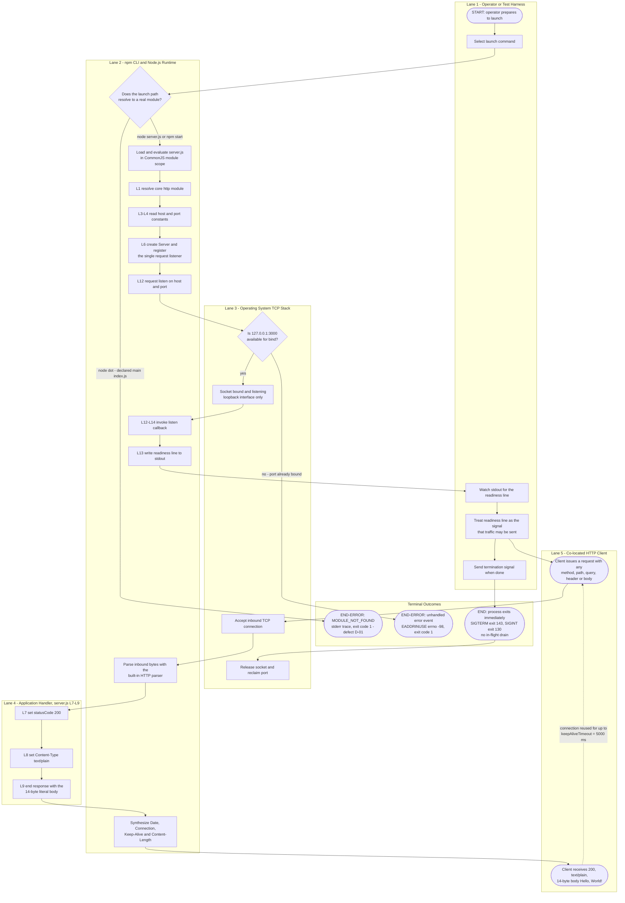
```mermaid
flowchart TB
    subgraph LaneOperator["Lane 1 - Operator or Test Harness"]
        OP1(["START: operator prepares to launch"])
        OP2["Select launch command"]
        OP3["Watch stdout for the readiness line"]
        OP4["Treat readiness line as the signal<br/>that traffic may be sent"]
        OP5["Send termination signal when done"]
    end

    subgraph LaneToolchain["Lane 2 - npm CLI and Node.js Runtime"]
        TC1{"Does the launch path<br/>resolve to a real module?"}
        TC2["Load and evaluate server.js<br/>in CommonJS module scope"]
        TC3["L1 resolve core http module"]
        TC4["L3-L4 read host and port constants"]
        TC5["L6 create Server and register<br/>the single request listener"]
        TC6["L12 request listen on host and port"]
        TC7["L12-L14 invoke listen callback"]
        TC8["L13 write readiness line to stdout"]
        TC9["Parse inbound bytes with the<br/>built-in HTTP parser"]
        TC10["Synthesize Date, Connection,<br/>Keep-Alive and Content-Length"]
    end

    subgraph LaneOS["Lane 3 - Operating System TCP Stack"]
        OS1{"Is 127.0.0.1:3000<br/>available for bind?"}
        OS2["Socket bound and listening<br/>loopback interface only"]
        OS3["Accept inbound TCP connection"]
        OS4["Release socket and reclaim port"]
    end

    subgraph LaneApp["Lane 4 - Application Handler, server.js L7-L9"]
        AP1["L7 set statusCode 200"]
        AP2["L8 set Content-Type text/plain"]
        AP3["L9 end response with the<br/>14-byte literal body"]
    end

    subgraph LaneClient["Lane 5 - Co-located HTTP Client"]
        CL1(["Client issues a request with any<br/>method, path, query, header or body"])
        CL2(["Client receives 200, text/plain,<br/>14-byte body Hello, World!"])
    end

    subgraph LaneOutcomes["Terminal Outcomes"]
        EX1(["END-ERROR: MODULE_NOT_FOUND<br/>stderr trace, exit code 1 - defect D-01"])
        EX2(["END-ERROR: unhandled error event<br/>EADDRINUSE errno -98, exit code 1"])
        EX3(["END: process exits immediately<br/>SIGTERM exit 143, SIGINT exit 130<br/>no in-flight drain"])
    end

    OP1 --> OP2
    OP2 --> TC1
    TC1 -->|"node dot - declared main index.js"| EX1
    TC1 -->|"node server.js or npm start"| TC2
    TC2 --> TC3
    TC3 --> TC4
    TC4 --> TC5
    TC5 --> TC6
    TC6 --> OS1
    OS1 -->|"no - port already bound"| EX2
    OS1 -->|"yes"| OS2
    OS2 --> TC7
    TC7 --> TC8
    TC8 --> OP3
    OP3 --> OP4
    OP4 --> CL1
    CL1 --> OS3
    OS3 --> TC9
    TC9 --> AP1
    AP1 --> AP2
    AP2 --> AP3
    AP3 --> TC10
    TC10 --> CL2
    CL2 -.->|"connection reused for up to<br/>keepAliveTimeout = 5000 ms"| CL1
    OP4 --> OP5
    OP5 --> EX3
    EX3 --> OS4
```

Journey characteristics confirmed by execution:

| Journey Property | Observed Behavior |
|---|---|
| User touchpoints | Exactly three: the launch command, the single stdout readiness line, and the HTTP response. There is no UI, CLI menu, prompt, configuration file, or API for changing behavior. |
| Steps performed per request by application code | Three (`server.js` L7, L8, L9). Everything else on the request path belongs to the runtime. |
| Journey branching | The only branch a user can influence is W-5, the choice of launch command; `node .` fails, while `node server.js` and `npm start` succeed. |
| Repeatability | 200 sequential and 500 concurrent requests all returned identical `200 / text/plain / 14-byte` responses, so the journey has one path and one outcome per actor. |

#### 4.1.1.2 System Interactions

The sequence below shows which participant performs each step of W-1 and W-2, including the interactions that application code delegates entirely to the runtime. It is the interaction-level counterpart to the structural component view in §1.2.2.2 and the feature-level control flow in §2.3.2.

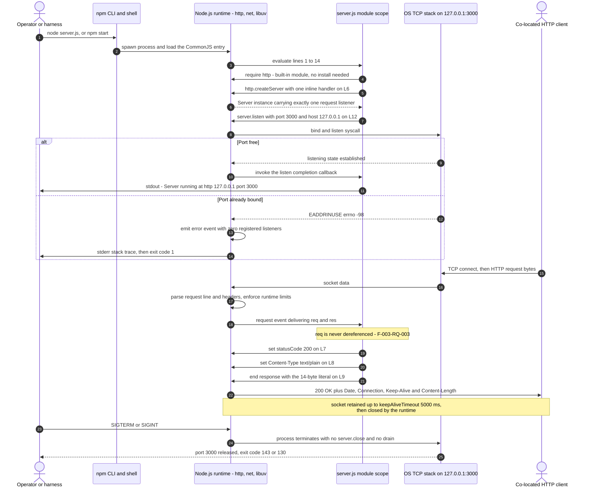
```mermaid
sequenceDiagram
    autonumber
    actor Operator as Operator or harness
    participant NPM as npm CLI and shell
    participant Node as Node.js runtime - http, net, libuv
    participant App as server.js module scope
    participant OS as OS TCP stack on 127.0.0.1:3000
    actor Client as Co-located HTTP client

    Operator->>NPM: node server.js, or npm start
    NPM->>Node: spawn process and load the CommonJS entry
    Node->>App: evaluate lines 1 to 14
    App->>Node: require http - built-in module, no install needed
    App->>Node: http.createServer with one inline handler on L6
    Node-->>App: Server instance carrying exactly one request listener
    App->>Node: server.listen with port 3000 and host 127.0.0.1 on L12
    Node->>OS: bind and listen syscall

    alt Port free
        OS-->>Node: listening state established
        Node->>App: invoke the listen completion callback
        App->>Operator: stdout - Server running at http 127.0.0.1 port 3000
    else Port already bound
        OS-->>Node: EADDRINUSE errno -98
        Node->>Node: emit error event with zero registered listeners
        Node->>Operator: stderr stack trace, then exit code 1
    end

    Client->>OS: TCP connect, then HTTP request bytes
    OS->>Node: socket data
    Node->>Node: parse request line and headers, enforce runtime limits
    Node->>App: request event delivering req and res
    Note over App: req is never dereferenced - F-003-RQ-003
    App->>Node: set statusCode 200 on L7
    App->>Node: set Content-Type text/plain on L8
    App->>Node: end response with the 14-byte literal on L9
    Node->>Client: 200 OK plus Date, Connection, Keep-Alive and Content-Length
    Note over Node,Client: socket retained up to keepAliveTimeout 5000 ms,<br/>then closed by the runtime

    Operator->>Node: SIGTERM or SIGINT
    Node->>OS: process terminates with no server.close and no drain
    OS-->>Operator: port 3000 released, exit code 143 or 130
```

The interaction inventory is closed and small — five interfaces in total, matching the integration-point set recorded in §2.3.2:

| Interaction | Participants | Evidence |
|---|---|---|
| Inbound HTTP over TCP | Client ↔ OS ↔ runtime ↔ handler | `server.js` L3, L4, L12; verified 200 responses on loopback |
| Readiness signal | Application → operator stdout | `server.js` L13; one line per start |
| Process exit status | Runtime → operator or supervisor | Measured: `1` for bind failure and for `npm test`, `143`/`130` for signals |
| npm manifest read | npm CLI → `package.json` | `> hello_world@1.0.0 test` and `> node server.js` banners observed |
| Node core `http` | Application → runtime library | `server.js` L1, the only `require` in the repository |

No outbound interaction exists. `server.js` contains zero occurrences of `fetch`, `http.request`, `http.get`, `https`, `net.`, `dns.`, `child_process`, or any HTTP client library, so the process cannot contact a database, cache, broker, identity provider, or telemetry collector.

#### 4.1.1.3 Decision Points

Every decision point in the system, with its owner and its outcomes. The "Owner" column is the critical column: no row is owned by application code.

| Decision Point | Owner | Outcomes |
|---|---|---|
| Which launch command is used | Operator | `node server.js` / `npm start` → service starts; `node .` → `MODULE_NOT_FOUND`, exit 1 |
| Does `npm start` have an explicit script | npm CLI | No `start` script is declared, so npm's built-in default resolves `server.js` — defect D-04 |
| Is `127.0.0.1:3000` bindable | OS TCP stack | Bound → listen callback fires; occupied → `EADDRINUSE` propagates as an unhandled `error` event |
| Is the peer on the loopback interface | OS TCP stack | Loopback → connection accepted; any other interface → connection refused, measured as curl exit 7 |
| Do the inbound bytes parse as HTTP | Node HTTP parser | Valid → `request` event dispatched; invalid → `400 Bad Request` with `Connection: close` |
| Is the header block within `http.maxHeaderSize` (16 384 bytes) | Node HTTP parser | Within → dispatched; exceeded → `431 Request Header Fields Too Large` |
| Does the request carry `Expect: 100-continue` | Node runtime | With no `checkContinue` listener registered, the runtime auto-emits `100 Continue` before the handler runs |
| Did the client complete the request | Node runtime | Complete → handler invoked; aborted → socket discarded silently, process unaffected |
| Is the response for a `HEAD` request | Node runtime | Body suppressed (0 bytes returned) while status and headers are unchanged |
| Is the client HTTP/1.1 or HTTP/1.0 | Node runtime | HTTP/1.1 → `Connection: keep-alive` plus `Content-Length`; HTTP/1.0 → `Connection: close` and no `Content-Length` |
| Should the keep-alive socket be closed | Node runtime | Closed after `keepAliveTimeout` = 5 000 ms of idleness |
| Has a termination signal arrived | OS and Node defaults | No signal → serve indefinitely; `SIGTERM` → exit 143; `SIGINT` → exit 130 |

The absence of application decision logic is itself a verified requirement: F-003-RQ-004 states that no request can cause application code to emit a non-`200` status, and the census in this section is the evidence for it.

#### 4.1.1.4 Error Handling Paths

There is no error-handling code in the repository. Greps across all four files return zero matches for `try`, `catch`, `throw`, `server.on`, `.on('error'`, `process.on`, `uncaughtException`, `unhandledRejection`, `clientError`, and `server.close`. Every error path is therefore a **default runtime path**, and each was reproduced during the investigation.

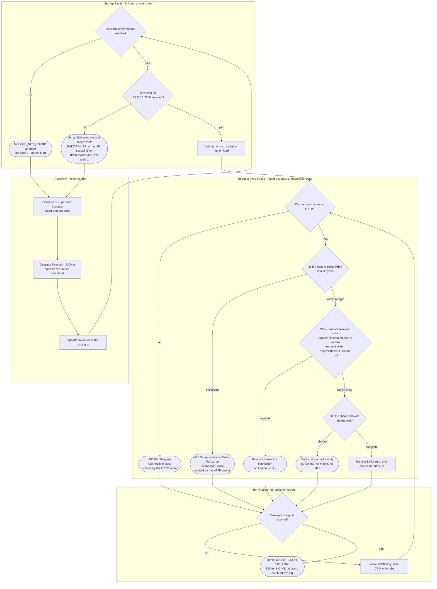
```mermaid
flowchart TB
    subgraph StartupFaults["Startup Faults - fail fast, process dies"]
        SF1{"Does the entry module resolve?"}
        SF2{"Does bind on 127.0.0.1:3000 succeed?"}
        SF3(["MODULE_NOT_FOUND on stderr<br/>exit code 1 - defect D-01"])
        SF4(["Unhandled error event at node:events<br/>EADDRINUSE, errno -98, syscall listen<br/>stderr stack trace, exit code 1"])
        SF5["Listener active, readiness line emitted"]
    end

    subgraph RequestFaults["Request-Time Faults - runtime answers, process survives"]
        RF1{"Do the bytes parse as HTTP?"}
        RF2{"Is the header block within<br/>16384 bytes?"}
        RF3(["400 Bad Request<br/>Connection: close<br/>emitted by the HTTP parser"])
        RF4(["431 Request Header Fields Too Large<br/>Connection: close<br/>emitted by the HTTP parser"])
        RF5{"Did the client complete<br/>the request?"}
        RF6(["Socket discarded silently<br/>no log line, no metric, no alert"])
        RF7["Handler L7-L9 runs and always returns 200"]
        RF8{"Were headers received within<br/>headersTimeout 60000 ms and the<br/>request within requestTimeout 300000 ms?"}
        RF9(["Runtime closes the connection<br/>on timeout expiry"])
    end

    subgraph TerminationFaults["Termination - abrupt by omission"]
        TF1{"Termination signal received?"}
        TF2(["Immediate exit - 143 for SIGTERM,<br/>130 for SIGINT, no drain, no shutdown log"])
        TF3["Serve indefinitely, zero CPU when idle"]
    end

    subgraph RecoveryLane["Recovery - external only"]
        RC1["Operator or supervisor inspects<br/>stderr and exit code"]
        RC2["Operator frees port 3000 or<br/>corrects the launch command"]
        RC3["Operator relaunches the process"]
    end

    SF1 -->|"no"| SF3
    SF1 -->|"yes"| SF2
    SF2 -->|"no"| SF4
    SF2 -->|"yes"| SF5
    SF5 --> RF1
    RF1 -->|"no"| RF3
    RF1 -->|"yes"| RF2
    RF2 -->|"exceeded"| RF4
    RF2 -->|"within budget"| RF8
    RF8 -->|"expired"| RF9
    RF8 -->|"within limits"| RF5
    RF5 -->|"aborted"| RF6
    RF5 -->|"complete"| RF7
    RF7 --> TF1
    RF3 --> TF1
    RF4 --> TF1
    RF6 --> TF1
    RF9 --> TF1
    TF1 -->|"no"| TF3
    TF3 --> RF1
    TF1 -->|"yes"| TF2
    SF3 --> RC1
    SF4 --> RC1
    RC1 --> RC2
    RC2 --> RC3
    RC3 --> SF1
```

| Error Path | Detection | System Response | Recovery |
|---|---|---|---|
| Declared entry point missing | Node module loader | `Error: Cannot find module '<repo>/index.js'`, `code: 'MODULE_NOT_FOUND'`, exit 1 | Operator uses `node server.js` or `npm start` instead |
| Port already bound | `listen` syscall | `error` event with no listener → uncaught exception → exit 1 | Operator frees port 3000 and relaunches; no automatic retry exists |
| Malformed HTTP request | Node HTTP parser | `400 Bad Request`, connection closed, server unaffected | Client corrects the request; nothing to recover server-side |
| Header block over 16 KiB | Node HTTP parser | `431 Request Header Fields Too Large`, connection closed | Client reduces header size |
| Client aborts mid-request | Node runtime | Socket discarded, no output, subsequent requests still return 200 | None required |
| Header or request timeout | Node runtime timers | Connection closed after 60 s / 300 s respectively | Client retries |
| Termination signal | OS default disposition | Immediate exit 143 or 130 with in-flight requests dropped | Operator relaunches |

The critical operational consequence is that **all recovery is external**. The process performs no retry, no backoff, no port fallback, no self-restart, and no notification beyond writing a stack trace to stderr; a supervisor, container orchestrator, or human must observe the non-zero exit code and act.

### 4.1.2 Integration Workflows

This system integrates with nothing at runtime. The evidence is exhaustive rather than sampled: `server.js` contains one `require` (line 1, the built-in `http` module), zero environment-variable reads, zero outbound network primitives, and zero filesystem primitives, while `package-lock.json` records only the root package, so no third-party client library is present either. The workflows below therefore document the boundaries that do exist and record the categories that verifiably do not.

#### 4.1.2.1 Data Flow Between Systems

Four data items cross a boundary in this system. Nothing is transformed, enriched, joined, or stored along the way.

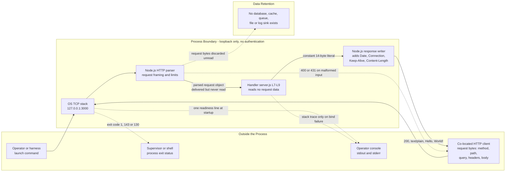
```mermaid
flowchart LR
    subgraph ExternalActors["Outside the Process"]
        EA1["Operator or harness<br/>launch command"]
        EA2["Co-located HTTP client<br/>request bytes: method, path,<br/>query, headers, body"]
        EA3["Operator console<br/>stdout and stderr"]
        EA4["Supervisor or shell<br/>process exit status"]
    end

    subgraph TrustBoundary["Process Boundary - loopback only, no authentication"]
        PB1["OS TCP stack<br/>127.0.0.1:3000"]
        PB2["Node.js HTTP parser<br/>request framing and limits"]
        PB3["Handler server.js L7-L9<br/>reads no request data"]
        PB4["Node.js response writer<br/>adds Date, Connection,<br/>Keep-Alive, Content-Length"]
    end

    subgraph DataSinks["Data Retention"]
        DS1["No database, cache, queue,<br/>file or log sink exists"]
    end

    EA1 --> PB1
    EA2 --> PB1
    PB1 --> PB2
    PB2 -->|"parsed request object<br/>delivered but never read"| PB3
    PB3 -->|"constant 14-byte literal"| PB4
    PB4 -->|"200, text/plain, Hello, World!"| EA2
    PB1 -.->|"one readiness line at startup"| EA3
    PB2 -.->|"400 or 431 on malformed input"| EA2
    PB3 -.->|"stack trace only on bind failure"| EA3
    PB1 -.->|"exit code 1, 143 or 130"| EA4
    PB2 -.->|"request bytes discarded unread"| DS1
```

| Data Item | Direction | Transformation | Retention |
|---|---|---|---|
| HTTP request bytes (any method, path, query, headers, body) | Inbound | None — a 1 MiB POST body was accepted at the transport layer and never read by application code | None; discarded when the socket closes |
| HTTP response | Outbound | Constant: status `200`, `Content-Type: text/plain`, 14-byte body; runtime appends `Date`, `Connection`, `Keep-Alive`, `Content-Length` | None |
| Readiness line | Outbound to stdout | Template interpolation of the two constants at `server.js` L3–L4 | Not written to disk; exists only in the stdout stream |
| Process exit status | Outbound to the parent process | None | Not recorded anywhere by the system |

A before/after snapshot of the working tree taken around a start-serve-terminate cycle produced identical digests, and `git status --porcelain` remained empty, confirming that no flow in this system writes any file. There is no data persistence point anywhere in the architecture.

#### 4.1.2.2 API Interactions

The service exposes one implicit endpoint. There is no route table, no API schema, and no versioning artifact — the repository contains no OpenAPI, GraphQL, or protobuf file.

| API Property | Observed Value |
|---|---|
| Base URL | `http://127.0.0.1:3000/` — loopback only; a request to the host's routable address is refused |
| Path matching | None. `/`, `/a/b/c?x=1&y=2`, and `/upload` all produced identical responses |
| Method matching | None. `GET`, `HEAD`, `POST`, `PUT`, `PATCH`, `DELETE`, `OPTIONS`, and `TRACE` all returned `200`; `HEAD` returned the same status and headers with a zero-length body, which is the runtime suppressing the body |
| Request media types | Ignored. No `Content-Type` negotiation, no body parsing, no size limit in application code |
| Response contract | `200`, `Content-Type: text/plain`, body `Hello, World!` plus a trailing newline (14 bytes) |
| Error responses | Only `400` and `431`, both generated by the runtime's parser rather than by application code |
| Authentication | None. No credential, token, header check, or TLS termination exists anywhere in the repository |
| Connection semantics | HTTP/1.1 keep-alive by default; three sequential requests reused a single TCP connection, and two pipelined requests written in one socket write were answered with two complete `200` responses |

The connection-level and pipelining interaction sequences are charted in §4.4.3.

#### 4.1.2.3 Event Processing Flows

The system is event-driven only in the sense that Node's `http.Server` is an `EventEmitter`. The application subscribes to exactly one event. Listener counts were measured on an identically constructed server:

| Event | Application Listeners | What Actually Happens |
|---|---|---|
| `request` | 1 — the inline arrow function at `server.js` L6 | Sets status, sets one header, ends the response |
| `listening` | 1 one-shot callback passed to `listen` at L12 | Writes the readiness line at L13 |
| `error` | 0 | Emission becomes an uncaught exception and terminates the process — the mechanism behind F-001-RQ-004 |
| `clientError` | 0 | Runtime default applies: `400 Bad Request` (or `431`) and connection close |
| `connection` | 1, registered internally by the runtime | Socket accounting and parser attachment |
| `checkContinue` | 0 | Runtime auto-answers `100 Continue`, verified on the wire |
| `upgrade`, `connect`, `close`, `dropRequest` | 0 | No WebSocket upgrade, tunnel, shutdown hook, or overload handling exists |

There is no message broker, event bus, pub/sub topic, stream processor, webhook dispatcher, or domain-event model: greps for `queue`, `EventEmitter`, `.emit(`, `.once(`, `Promise`, `async`, and `await` across all four files return zero matches. Event processing is a single synchronous callback per request, executed on one event loop in one process — no clustering (`cluster`: 0 matches) and no worker threads (`worker_threads`: 0 matches).

#### 4.1.2.4 Batch Processing Sequences

**No batch processing exists.** There is no scheduler, cron entry, timer, job queue, ETL step, or bulk-import path: `setTimeout`, `setInterval`, `setImmediate`, `cron`, `schedul*`, `queue`, `child_process`, `spawn`, `fork`, and `exec` all return zero matches across every tracked file, and the repository contains no CI workflow, `Makefile`, or container definition that could host a scheduled task.

The only multi-step sequence in the repository that resembles batch composition is the shell pipeline inside the declared `test` script, which is also the only conditional operator anywhere in the repository:

```json
"test": "echo \"Error: no test specified\" && exit 1"
```

Executing it (workflow W-4) prints the npm banner, echoes `Error: no test specified`, and exits with code `1` — a deterministic two-step shell sequence that can never succeed, recorded as defect D-02 in §2.2.10. Automation must therefore not treat `npm test` as a quality gate, and per §2.2.8 must also avoid `node .`.


## 4.2 Flowchart Requirements

This sub-section states, for each workflow charted in §4.1, the mandatory flowchart elements — start and end points, process steps, decision diamonds, system boundaries, user touchpoints, error states and recovery paths, and timing considerations — and then documents the validation rules that apply at each step. Where an element does not exist in this system, that is recorded explicitly with the check that established it, rather than being filled in with a plausible-looking placeholder.

### 4.2.1 Workflow Element Coverage

| Flowchart Element | W-1 Service Bootstrap | W-2 Request Transaction | W-3 Termination |
|---|---|---|---|
| Start point | Operator issues `node server.js` or `npm start` | Client opens a TCP connection to `127.0.0.1:3000` | `SIGTERM`/`SIGINT` arrives, or an unhandled `error` event occurs |
| End point | Readiness line on stdout, listener accepting | Response flushed by `res.end` at `server.js` L9 | Process exit — 143, 130, or 1 |
| Process steps | Six: L1 require, L3–L4 constants, L6 create server, L12 listen, L12–L14 callback, L13 log | Three application steps (L7, L8, L9) wrapped by runtime parse and response-write steps | One: OS default signal disposition; no application step exists |
| Decision diamonds | Launch path resolves; port bindable | Bytes parse as HTTP; header block within 16 KiB; timeouts not expired; request completed; `HEAD` or not; HTTP/1.0 or 1.1 | Signal received or not |
| System boundaries crossed | Shell/npm → Node runtime → OS socket layer | Client → OS TCP → runtime parser → handler → runtime writer → client | Runtime → OS |
| User touchpoints | Launch command; stdout readiness line | HTTP request and response | Signal delivery; observed exit code |
| Error states | `MODULE_NOT_FOUND` (exit 1); `EADDRINUSE` (exit 1) | `400 Bad Request`; `431 Request Header Fields Too Large`; silent socket discard on abort; connection close on timeout | None — termination cannot fail; in-flight requests are simply dropped |
| Recovery path | External only: correct the command or free the port, then relaunch | Client-side retry; the server needs no recovery and stays up | Operator relaunches the process |

| Flowchart Element | W-4 Verification Attempt (`npm test`) | W-5 Launch-Path Selection |
|---|---|---|
| Start point | Operator runs `npm test` | Operator chooses a command |
| End point | Exit code `1` after printing `Error: no test specified` | Either a running listener or an immediate failure |
| Process steps | Two shell steps composed with `&&`: `echo`, then `exit 1` | One resolution step performed by npm or Node |
| Decision diamonds | None — the outcome is unconditional | Which of `node server.js`, `npm start`, `node .` was used |
| System boundaries crossed | npm CLI → shell | npm CLI or Node module loader |
| User touchpoints | Console output and exit status | The command itself |
| Error states | The script *is* the error state; it can never pass (defect D-02) | `node .` → `MODULE_NOT_FOUND`, exit 1 (defect D-01) |
| Recovery path | None available in-repository; verification must be performed by issuing an HTTP request | Use a supported launch path |

Two elements requested by the flowchart template do not exist anywhere in this system and are recorded here once rather than repeated per workflow: there is **no approval or review step** in any flow (no gate, no queue, no human-in-the-loop hand-off), and there is **no parallel or fan-out branch** — every workflow is a single-threaded linear sequence executed on one event loop, since `cluster`, `worker_threads`, `child_process`, `Promise`, `async`, and `await` all return zero matches across the repository.

### 4.2.2 Timing and SLA Considerations

**The repository declares no timing constraint of any kind.** A grep for `timeout` across all four tracked files returns zero matches, and there is no `setTimeout`, `setInterval`, retry interval, deadline, latency budget, throughput target, availability objective, or benchmark in `server.js`, `package.json`, `package-lock.json`, or `README.md`. Every timing behavior observed in the flows above is therefore a **Node.js runtime default inherited implicitly** by `http.createServer` at `server.js` L6.

The following values were measured on an identically constructed server object on the verification runtime (Node.js v22.23.1, linux/x64) and are the only timing constraints that exist in the system:

| Timing Constraint | Measured Default | Owner | Effect on the Flow |
|---|---|---|---|
| `server.keepAliveTimeout` | 5 000 ms | Node runtime | Idle keep-alive socket closed; corroborated on the wire by the `Keep-Alive: timeout=5` response header |
| `server.headersTimeout` | 60 000 ms | Node runtime | Connection closed if the complete header block has not arrived |
| `server.requestTimeout` | 300 000 ms | Node runtime | Connection closed if the whole request has not completed |
| `server.connectionsCheckingInterval` | 30 000 ms | Node runtime | Sweep interval that enforces the two timeouts above |
| `server.timeout` | 0 | Node runtime | No general socket inactivity timeout is applied |
| `server.maxRequestsPerSocket` | 0 | Node runtime | Unlimited requests may be pipelined over one keep-alive connection |
| `server.maxHeadersCount` | `null` | Node runtime | No cap on the number of header fields |
| `http.maxHeaderSize` | 16 384 bytes | Node runtime | Header blocks above this budget are rejected with `431` |

Observed performance figures are recorded below **as environment measurements only**. They are not service levels, they are not committed to anywhere in the repository, and they must not be quoted as SLAs or KPIs:

| Measurement | Result | Method |
|---|---|---|
| Sequential request latency, n = 200, new connection each | min 0.16 ms, p50 0.21 ms, p95 0.51 ms, max 5.32 ms | Loopback client in the verification container |
| Concurrent burst, 500 requests at concurrency 100 | 500/500 returned `200`, 0 failures, 58 ms elapsed | Keep-alive agent, loopback |
| Startup to readiness | Single synchronous evaluation of 14 lines plus one `listen` syscall; no dependency resolution or install step is required because the dependency graph is empty | `node server.js` |
| Idle cost | Process runs indefinitely with no output and no scheduled work until a signal arrives | `timeout 3 npm start` never self-exited |

The architectural reason these figures are so small is visible in the code rather than in configuration: the handler performs three statements with no I/O, no computation, and no lookup, and the response body is a compile-time literal.

### 4.2.3 Validation Rules

Validation in this system happens exclusively **below** the application layer. The diagram below shows the actual gate chain a request passes through, with the owner of each gate; the single application-layer box performs no validation at all.

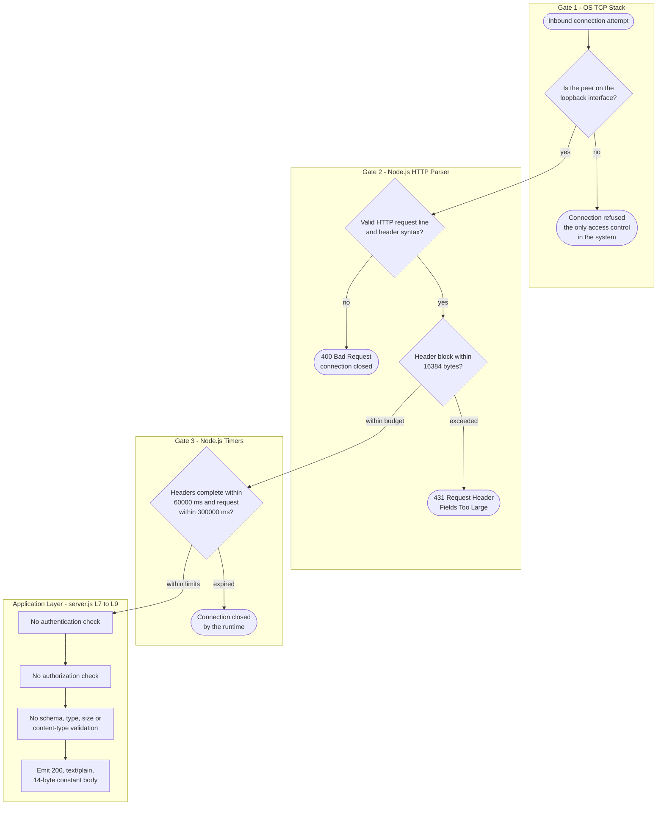
```mermaid
flowchart TB
    subgraph NetworkGate["Gate 1 - OS TCP Stack"]
        NG1(["Inbound connection attempt"])
        NG2{"Is the peer on the<br/>loopback interface?"}
        NG3(["Connection refused<br/>the only access control<br/>in the system"])
    end

    subgraph ProtocolGate["Gate 2 - Node.js HTTP Parser"]
        PG1{"Valid HTTP request line<br/>and header syntax?"}
        PG2(["400 Bad Request<br/>connection closed"])
        PG3{"Header block within<br/>16384 bytes?"}
        PG4(["431 Request Header<br/>Fields Too Large"])
    end

    subgraph TimingGate["Gate 3 - Node.js Timers"]
        TG1{"Headers complete within<br/>60000 ms and request<br/>within 300000 ms?"}
        TG2(["Connection closed<br/>by the runtime"])
    end

    subgraph AppLayer["Application Layer - server.js L7 to L9"]
        AL1["No authentication check"]
        AL2["No authorization check"]
        AL3["No schema, type, size or<br/>content-type validation"]
        AL4["Emit 200, text/plain,<br/>14-byte constant body"]
    end

    NG1 --> NG2
    NG2 -->|"no"| NG3
    NG2 -->|"yes"| PG1
    PG1 -->|"no"| PG2
    PG1 -->|"yes"| PG3
    PG3 -->|"exceeded"| PG4
    PG3 -->|"within budget"| TG1
    TG1 -->|"expired"| TG2
    TG1 -->|"within limits"| AL1
    AL1 --> AL2
    AL2 --> AL3
    AL3 --> AL4
```

#### 4.2.3.1 Business Rules at Each Step

| Step | Business Rule | Basis |
|---|---|---|
| Launch (W-1) | Exactly one instance may run per host, because the port is a fixed literal (`server.js` L4) with no override channel; a second instance fails with `EADDRINUSE` | F-005-RQ-003, F-001-RQ-004 |
| Launch (W-5) | The caller must use `node server.js` or `npm start`; the declared entry point `index.js` does not exist | F-008-RQ-002, F-008-RQ-003, defect D-01 |
| Bind (W-1) | The service must be reachable only from the same host — the `127.0.0.1` literal is what enforces this | F-001-RQ-003, F-005-RQ-001 |
| Readiness (W-1) | The stdout line is the readiness contract: its appearance means traffic may be sent, its absence means the bind failed | F-004-RQ-001 |
| Request handling (W-2) | The response is invariant. Any deviation in status, content type, or body bytes is a contract breach for downstream assertions and violates the change freeze in `README.md` L2 | F-002-RQ-001 … F-002-RQ-003, F-009-RQ-002 |
| Request handling (W-2) | The service cannot differentiate callers, tenants, routes, or methods — it has one behavior for one class of caller | F-003-RQ-001, F-003-RQ-002 |
| Verification (W-4) | `npm test` must not be treated as a quality gate, since it cannot pass as written | F-008-RQ-001, defect D-02 |
| Termination (W-3) | Termination is abrupt and in-flight work is forfeited; callers must not assume graceful draining | F-001-RQ-005 |

#### 4.2.3.2 Data Validation Requirements

No data validation is implemented by application code. The `req` parameter declared at `server.js` L6 is never dereferenced, so there is nothing for a validator to inspect — a request carrying a custom header and a 1 MiB body received the identical 14-byte response, with the body accepted at the transport layer and discarded unread.

| Validation Category | Implemented | Evidence |
|---|---|---|
| Request framing and protocol syntax | Yes, by the runtime | `400 Bad Request` returned for a malformed request line |
| Header size limiting | Yes, by the runtime | `431` returned for a 20 000-byte header block against the 16 384-byte budget |
| Method allow-listing | No | Eight methods all returned `200` |
| Path or route validation | No | `/`, `/a/b/c?x=1&y=2`, `/upload` all returned `200` |
| Query-string parsing or validation | No | Zero matches for `query`, `querystring`, `URLSearchParams` in `server.js` |
| Body parsing, schema validation, or size limits in application code | No | Zero matches for `body`, `JSON.parse`, `req.on` in `server.js` |
| Content-type negotiation | No | The single `setHeader` call at L8 is unconditional |
| Output validation | No | The body is a compile-time literal and cannot vary at runtime |
| Configuration validation | No | Host and port are unvalidated literals; an invalid value would surface only as a bind error |

#### 4.2.3.3 Authorization Checkpoints

There are **no authentication or authorization checkpoints** in any workflow. A credential sweep across all four tracked files for `secret`, `token`, `api_key`, `apikey`, `password`, `credential`, `bearer`, and `client_id` returns zero matches, and `server.js` contains no session, cookie, JWT, header check, TLS termination, CORS policy, or rate limit.

| Checkpoint | Status | What Actually Provides the Control |
|---|---|---|
| Client identity | Absent | None — every caller is anonymous and indistinguishable |
| Client authorization | Absent | None — there is only one operation and it is unconditional |
| Network-level authorization | Present, implicitly | The loopback bind at `server.js` L3. A request to the host's routable address on port 3000 is refused, so co-location is the de facto authorization requirement |
| Transport confidentiality | Absent | Plain HTTP; `https` appears nowhere in the repository |
| Operator authorization for launch and termination | Delegated | OS process permissions and signal delivery rights; the repository defines no `CODEOWNERS`, branch protection, or commit-signing configuration |
| Install-time code execution | Not possible | `npm pkg get scripts` returns only the `test` entry, so no lifecycle hook runs arbitrary code during `npm install` |

#### 4.2.3.4 Regulatory Compliance Checks

**No regulatory or compliance check exists in any workflow, and none is declared anywhere in the repository.** No policy, standard, framework, control ID, or regulation is referenced in any of the four tracked files; there is no `SECURITY.md`, `CONTRIBUTING.md`, `LICENSE` file, `CODEOWNERS`, audit-logging facility, SBOM, or dependency-scan artifact.

Three properties of the observed flows are nonetheless material to any compliance assessment of this artifact, and each is evidence-backed:

- **No personal or request data is retained.** Request bytes are never read by application code and the process performs no filesystem or database I/O; a before/after snapshot around a serve cycle showed byte-identical working-tree state, so no retention, deletion, or data-subject obligation can arise from operating the service.
- **No audit trail is produced.** The single `console.log` at `server.js` L13 fires once at startup; there is no per-request log, no error log, no shutdown log, and no log persistence, so operational activity is unrecorded by design-by-omission.
- **License terms are declared as metadata only.** `MIT` appears at `package.json` L10 and `package-lock.json` L10, but no `LICENSE` file is shipped (defect D-03), and the third-party license surface is empty because the locked dependency graph contains only the root package.


## 4.3 Technical Implementation

This sub-section documents how the workflows in §4.1 are realised technically: what state exists and how it transitions, where data is persisted, what is cached, where transaction boundaries fall, and how errors are detected, communicated, and recovered from. Every mechanism described here was either read directly in `server.js` or exercised against a running instance.

### 4.3.1 State Management

The system holds a deliberately minimal amount of state. All four module-level bindings in `server.js` are `const` — `http` (L1), `hostname` (L3), `port` (L4), and `server` (L6) — and a grep across all tracked files returns zero occurrences of `let`, `var`, `new Map`, `new Set`, `WeakMap`, `globalThis`, and `global.`. There is therefore **no mutable application state at all**; the only state in the system is owned by the process, the runtime, and the OS socket layer.

| State Holder | State Content | Lifetime |
|---|---|---|
| OS process | Running or exited, plus the exit status | From launch until signal or uncaught exception |
| Listening socket (OS) | Bound / listening on `127.0.0.1:3000` | From successful `listen` until process exit; the port is reclaimed by the OS, verified with `ss -ltn` after termination |
| Node `http.Server` object | `listening` flag, connection set, one `request` listener | Same as the process |
| Per-connection parser state (runtime) | Partially received request line, headers, body | One connection; reset between pipelined requests |
| Per-request `ServerResponse` (runtime) | `statusCode`, header map, finished flag | One request; discarded once `res.end` completes at L9 |
| Application variables | Four immutable constants | Whole process; never reassigned |

#### 4.3.1.1 State Transitions

The process lifecycle has five states and two terminal failure states. Both failure transitions were reproduced during the investigation.

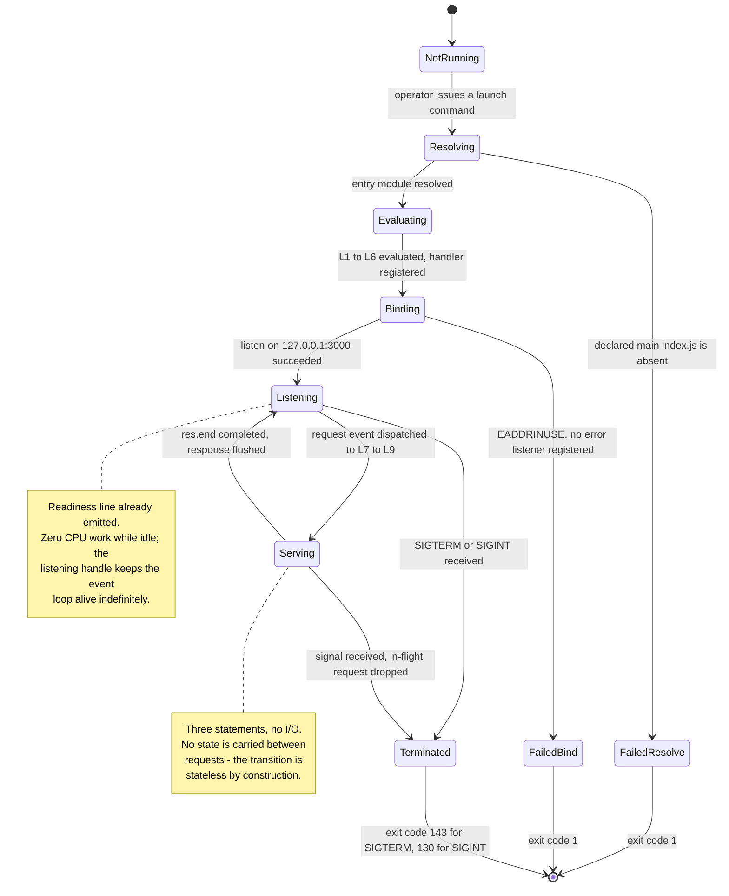
```mermaid
stateDiagram-v2
    [*] --> NotRunning
    NotRunning --> Resolving : operator issues a launch command
    Resolving --> Evaluating : entry module resolved
    Resolving --> FailedResolve : declared main index.js is absent
    Evaluating --> Binding : L1 to L6 evaluated, handler registered
    Binding --> Listening : listen on 127.0.0.1:3000 succeeded
    Binding --> FailedBind : EADDRINUSE, no error listener registered
    Listening --> Serving : request event dispatched to L7 to L9
    Serving --> Listening : res.end completed, response flushed
    Listening --> Terminated : SIGTERM or SIGINT received
    Serving --> Terminated : signal received, in-flight request dropped
    FailedResolve --> [*] : exit code 1
    FailedBind --> [*] : exit code 1
    Terminated --> [*] : exit code 143 for SIGTERM, 130 for SIGINT
    note right of Listening
        Readiness line already emitted.
        Zero CPU work while idle; the
        listening handle keeps the event
        loop alive indefinitely.
    end note
    note right of Serving
        Three statements, no I/O.
        No state is carried between
        requests - the transition is
        stateless by construction.
    end note
```

Connection and response state is owned entirely by the runtime. The transitions below were observed on the wire, including keep-alive reuse and pipelining.

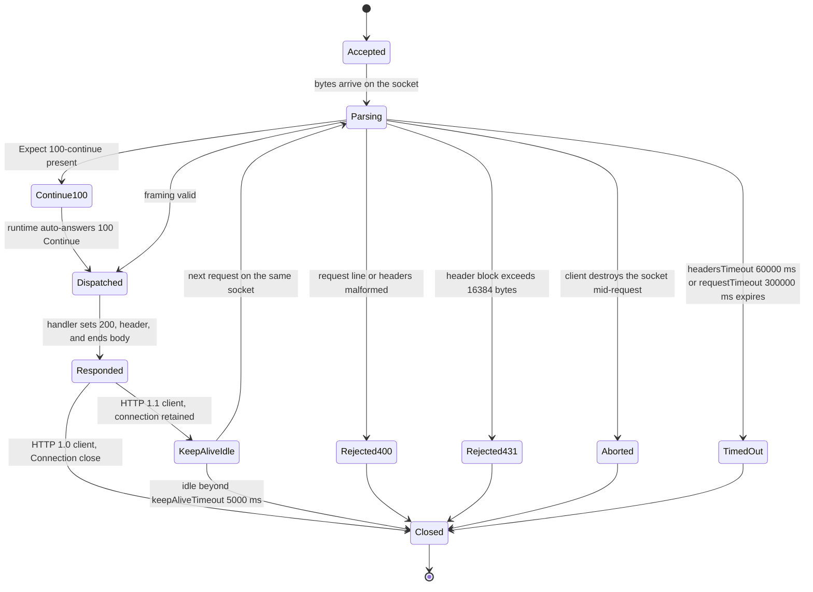
```mermaid
stateDiagram-v2
    [*] --> Accepted
    Accepted --> Parsing : bytes arrive on the socket
    Parsing --> Rejected400 : request line or headers malformed
    Parsing --> Rejected431 : header block exceeds 16384 bytes
    Parsing --> Continue100 : Expect 100-continue present
    Continue100 --> Dispatched : runtime auto-answers 100 Continue
    Parsing --> Dispatched : framing valid
    Dispatched --> Responded : handler sets 200, header, and ends body
    Responded --> KeepAliveIdle : HTTP 1.1 client, connection retained
    Responded --> Closed : HTTP 1.0 client, Connection close
    KeepAliveIdle --> Parsing : next request on the same socket
    KeepAliveIdle --> Closed : idle beyond keepAliveTimeout 5000 ms
    Parsing --> Aborted : client destroys the socket mid-request
    Parsing --> TimedOut : headersTimeout 60000 ms or requestTimeout 300000 ms expires
    Rejected400 --> Closed
    Rejected431 --> Closed
    Aborted --> Closed
    TimedOut --> Closed
    Closed --> [*]
```

Two properties of these transitions matter architecturally. First, the `Serving` transition is **idempotent and memoryless**: no request influences any later request, which is why 200 sequential and 500 concurrent requests all produced identical responses. Second, there is **no transition into a degraded or partially available state** — the process is either fully serving or gone, because no error handler exists that could keep it alive in a reduced mode.

#### 4.3.1.2 Data Persistence Points

**There are no data persistence points in this system.** The evidence is direct and reproducible:

- `server.js` contains zero occurrences of `require('fs')`, `fs.`, `readFile`, `writeFile`, `appendFile`, `createReadStream`, and `createWriteStream`, and no database driver, ORM, or storage SDK appears in either manifest — `package-lock.json` records only the root package.
- A snapshot of every tracked file (path plus byte size, digested) taken before starting the service and again after serving a `GET` and a `POST` and terminating the process produced **identical digests**, and `git status --porcelain` remained empty. No log file, data file, temp file, or cache directory is created by any flow.
- Request data is never captured: the `req` object is delivered to the handler and never dereferenced, so nothing is written even to memory beyond the runtime's own transient parser buffers.

The only durable artifact associated with the system is its own source, tracked in Git at commit `ab2aed66`. The readiness line exists solely in the process's stdout stream and is not persisted by the application.

#### 4.3.1.3 Caching Requirements

**No application-level caching exists and no cache policy is expressed.** The response is a compile-time literal, so there is nothing to cache and no cache-invalidation problem to solve.

| Caching Concern | Status | Evidence |
|---|---|---|
| In-process cache or memo table | None | Zero matches for `new Map`, `new Set`, `WeakMap`, `cache` across all tracked files |
| External cache (Redis, Memcached, CDN) | None | No client library in the dependency graph; no outbound network primitive in `server.js` |
| HTTP cache directives | None set | Measured response headers are exactly `Content-Type`, `Date`, `Connection`, `Keep-Alive`, `Content-Length` — no `Cache-Control`, `ETag`, `Last-Modified`, or `Expires` |
| Conditional-request handling | None | Request headers are never read, so `If-None-Match` and `If-Modified-Since` cannot be honoured and `304` can never be returned |
| Runtime module cache | Present, runtime-owned | `require('http')` at L1 resolves a built-in module from Node's internal registry; this is a property of the runtime, not a repository design decision |
| Package install cache | Not exercised | No `node_modules` directory exists and `npm ls --all` reports `(empty)`, so no install-time cache is populated or consulted |

Because the connection layer reuses sockets (three sequential requests were served over a single TCP connection), the only real "reuse" optimisation in the system is transport-level keep-alive, and it is supplied by the runtime default rather than configured in code.

#### 4.3.1.4 Transaction Boundaries

There is no transactional infrastructure: zero matches for `transaction`, `commit`, and `rollback` across all four files, and no database or queue participant exists that could enrol in a transaction. What the system does have is a single, well-defined **atomic unit of work**:

| Boundary | Scope | Atomicity Guarantee |
|---|---|---|
| One request → `res.end` at L9 | The three statements at `server.js` L7–L9, executed synchronously on the event loop with no `await` point | The handler cannot be interleaved with another request's handler, so a response is never partially composed from two requests |
| Response write | Status line, headers, and 14-byte body | The 14-byte payload is written with the runtime-supplied `Content-Length`; there is no chunked streaming and no multi-part write in application code |
| Bootstrap | L1 through L14 evaluated once | If `listen` fails the process dies, so the system is never left half-initialised — there is no partial-startup state to compensate |
| Compensating actions | None | No rollback, no undo, no outbox, no idempotency key — none are needed because no state changes outside the response |

The practical consequence is that failure atomicity is trivial: a crash cannot leave inconsistent data because no data is written, and a dropped in-flight request during termination costs the client only a retry.

### 4.3.2 Error Handling

The repository implements no error handling. This is a verified absence, not an inference: `try`, `catch`, `throw`, `server.on`, `.on('error'`, `process.on`, `uncaughtException`, `unhandledRejection`, `clientError`, `server.close`, and `process.exit` all return zero matches across all four tracked files. What follows documents the default mechanisms that consequently govern every failure, and the external procedures that constitute the actual recovery path.

#### 4.3.2.1 Retry Mechanisms

**No retry mechanism exists anywhere in the system.** Zero matches were found for `retry`, `backoff`, `setTimeout`, `setInterval`, and `setImmediate` across every tracked file, so there is no retry loop, no exponential backoff, no jitter, no circuit breaker, no bulkhead, and no dead-letter path.

| Failure | Retry Behavior Implemented | Who Must Retry |
|---|---|---|
| Bind failure (`EADDRINUSE`) | None. The `error` event is emitted with no listener, becomes an uncaught exception, and the process exits with code 1 immediately | Operator or supervisor, after freeing port 3000 |
| Malformed request (`400`) | None; the connection is closed by the runtime | Client |
| Oversized headers (`431`) | None; the connection is closed by the runtime | Client |
| Client abort | None needed; the socket is discarded and the server continues serving | Client |
| Header/request timeout | None; the runtime closes the connection when the 60 s or 300 s budget expires | Client |
| Dropped in-flight request at shutdown | None; there is no drain window | Client |

#### 4.3.2.2 Fallback Processes

Only two fallbacks exist, and neither is implemented by repository code — both are defaults of surrounding tooling:

| Fallback | Trigger | Behavior | Owner |
|---|---|---|---|
| npm implicit `start` script | `npm start` invoked with no `start` script declared in `package.json` L6–L8 | npm's built-in default resolves and runs `node server.js`; the banner `> node server.js` and the readiness line were both observed | npm CLI (defect D-04 — the launch path depends on tool behavior rather than an explicit script) |
| HTTP protocol-version fallback | Client speaks HTTP/1.0 or omits `Host` | The runtime answers `HTTP/1.1 200 OK` with `Connection: close` and omits `Content-Length`, delimiting the body by connection close | Node.js `http` module |

There is **no application fallback**: no degraded response mode, no static error page, no secondary port, no read-only mode, and no alternate upstream. The response path has one outcome, and the startup path has none — it either binds or dies.

#### 4.3.2.3 Error Notification Flows

Notification is limited to two channels: the process's standard error stream and its exit code. There is no logger abstraction, no log file, no alerting integration, no metrics exporter, and no tracing — greps for `winston`, `pino`, `bunyan`, `morgan`, `sentry`, `datadog`, `newrelic`, `prometheus`, `opentelemetry`, and `otel` all return zero matches.

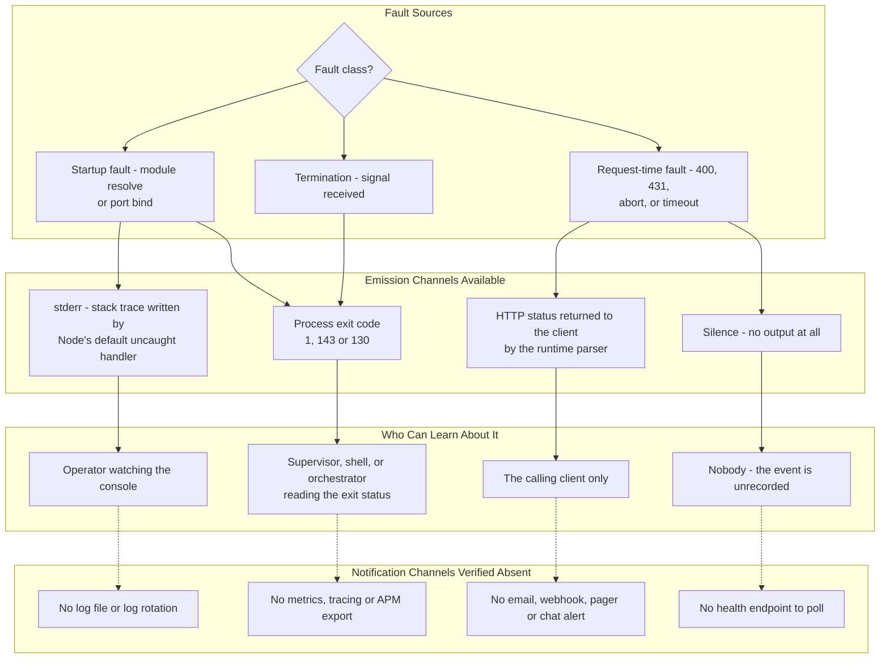
```mermaid
flowchart TB
    subgraph FaultSources["Fault Sources"]
        FS1{"Fault class?"}
        FS2["Startup fault - module resolve<br/>or port bind"]
        FS3["Request-time fault - 400, 431,<br/>abort, or timeout"]
        FS4["Termination - signal received"]
    end

    subgraph EmissionChannels["Emission Channels Available"]
        EC1["stderr - stack trace written by<br/>Node's default uncaught handler"]
        EC2["Process exit code<br/>1, 143 or 130"]
        EC3["HTTP status returned to the client<br/>by the runtime parser"]
        EC4["Silence - no output at all"]
    end

    subgraph Observers["Who Can Learn About It"]
        OB1["Operator watching the console"]
        OB2["Supervisor, shell, or orchestrator<br/>reading the exit status"]
        OB3["The calling client only"]
        OB4["Nobody - the event is unrecorded"]
    end

    subgraph AbsentChannels["Notification Channels Verified Absent"]
        AC1["No log file or log rotation"]
        AC2["No metrics, tracing or APM export"]
        AC3["No email, webhook, pager or chat alert"]
        AC4["No health endpoint to poll"]
    end

    FS1 --> FS2
    FS1 --> FS3
    FS1 --> FS4
    FS2 --> EC1
    FS2 --> EC2
    FS3 --> EC3
    FS3 --> EC4
    FS4 --> EC2
    EC1 --> OB1
    EC2 --> OB2
    EC3 --> OB3
    EC4 --> OB4
    OB1 -.-> AC1
    OB2 -.-> AC2
    OB3 -.-> AC3
    OB4 -.-> AC4
```

The consequences are worth stating plainly. A bind failure is loud — a full stack trace naming `EADDRINUSE`, `errno -98`, `syscall listen`, and the address and port, followed by exit code 1. Every request-time fault is quiet: the client sees a `400` or `431` or a closed socket, and the operator sees nothing at all, because the only output statement in the repository is the startup line at `server.js` L13 (F-004-RQ-003 records that there is no per-request and no shutdown logging).

#### 4.3.2.4 Recovery Procedures

All recovery is external and operator-driven. The procedures below use only commands that were executed during the investigation, with the observed results:

| Scenario | Detection Signal | Recovery Procedure |
|---|---|---|
| Service will not start — `MODULE_NOT_FOUND` | stderr names `index.js` and `code: 'MODULE_NOT_FOUND'`; exit 1 | Launch with `node server.js` or `npm start`; do not use `node .` (defect D-01) |
| Service will not start — `EADDRINUSE` | stderr names `listen EADDRINUSE ... 127.0.0.1:3000`; exit 1 | Identify the process holding port 3000 (for example with `ss -ltn`), stop it, then relaunch; there is no automatic retry and no alternative port because L4 is a literal |
| Service unreachable from another host | Client connection refused | Expected behavior, not a fault: the loopback bind at L3 is intentional. The caller must be co-located; changing this would require a source edit, which `README.md` L2 forbids |
| Client receives `400` or `431` | Status returned with `Connection: close` | Correct the request framing or reduce header size; the server needs no action and remains up |
| Process appears hung | No output after the readiness line | Expected behavior: the process is idle with zero CPU work and logs nothing per request. Confirm health by issuing a request and expecting `200` with a 14-byte body |
| Planned restart | Operator action | Send `SIGTERM` (exit 143) or `SIGINT` (exit 130) and relaunch. In-flight requests are dropped because there is no `server.close()`; schedule restarts during quiet periods if drop-free behavior matters |
| Verifying a recovered instance | — | Issue an HTTP request and assert `200`, `Content-Type: text/plain`, and the 14-byte body. `npm test` cannot be used: it exits 1 unconditionally (defect D-02) |
| Suspected drift after any incident | — | Compare the SHA-256 digests of the four tracked files against the baseline in §2.5.4 and confirm `git status --porcelain` is empty; the artifact's value depends on byte-level invariance (F-009-RQ-003) |

Because the process exits with a non-zero status on any startup fault and never exits on its own otherwise, an external supervisor with a restart policy is the natural place to implement resilience for this artifact — the repository provides no such mechanism itself, and no container, service unit, or orchestration descriptor exists in it.


## 4.4 Required Diagrams

This sub-section consolidates the diagram set for the process flowchart and supplies the views that were not required earlier in the section: line-level process flows for each core feature, integration sequence diagrams at the connection and tooling level, and the operator/developer workflow.

### 4.4.1 Diagram Index

| Required Diagram | Location | Notation |
|---|---|---|
| High-level system workflow | §4.1.1.1 | `flowchart` with six swim lanes and three terminal outcomes |
| System interaction overview | §4.1.1.2 | `sequenceDiagram` with `alt` bind branching |
| Error handling flowchart | §4.1.1.4 | `flowchart` with startup, request-time, termination and recovery subgraphs |
| Data flow between systems | §4.1.2.1 | `flowchart` with a process trust boundary |
| Validation gate chain | §4.2.3 | `flowchart` showing three runtime gates and the no-op application layer |
| State transition diagram — process lifecycle | §4.3.1.1 | `stateDiagram-v2` |
| State transition diagram — connection and response lifecycle | §4.3.1.1 | `stateDiagram-v2` |
| Error notification flow | §4.3.2.3 | `flowchart` mapping fault sources to channels and observers |
| Detailed process flows for each core feature | §4.4.2 | `flowchart` annotated with `server.js` line numbers |
| Integration sequence diagram — connection level | §4.4.3 | `sequenceDiagram` with `loop` |
| Integration sequence diagram — npm tooling | §4.4.3 | `sequenceDiagram` |
| Operator and developer workflow | §4.4.4 | `flowchart` with a change-freeze gate |

Related diagrams published elsewhere in this specification, which this section complements rather than repeats: the component diagram in §1.2.2.2, the operator-and-client sequence diagram in §1.3.1.1, the feature dependency map and feature-level control flow in §2.3.1 and §2.3.2, the framework layering diagram in §3.2.5, the integration and trust boundary diagram in §3.4.7, and the toolchain execution flow in §3.6.6.

### 4.4.2 Detailed Process Flows per Core Feature

The five features realised in `server.js` share one linear flow; the diagram below decomposes it to the statement level and labels each segment with the feature and requirement that owns it. Every box corresponds to an actual line of code, so the diagram is also a complete map of the executable surface.

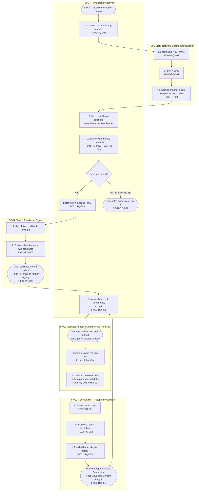
```mermaid
flowchart TB
    subgraph ConfigFlow["F-005 Static Network Binding Configuration"]
        CF1["L3 hostname = 127.0.0.1<br/>F-005-RQ-001"]
        CF2["L4 port = 3000<br/>F-005-RQ-002"]
        CF3["No override channel exists -<br/>zero process.env reads<br/>F-005-RQ-003"]
    end

    subgraph ListenerFlow["F-001 HTTP Listener Lifecycle"]
        LF1(["START: module evaluation begins"])
        LF2["L1 require the built-in http module<br/>F-001-RQ-001"]
        LF3["L6 http.createServer registers<br/>exactly one request listener"]
        LF4["L12 listen with the two constants<br/>F-001-RQ-002, F-005-RQ-004"]
        LF5{"Bind succeeded?"}
        LF6["Listening on loopback only<br/>F-001-RQ-003"]
        LF7(["Unhandled error event, exit 1<br/>F-001-RQ-004"])
        LF8["Serve until externally terminated,<br/>no drain<br/>F-001-RQ-005"]
    end

    subgraph ReadinessFlow["F-004 Startup Readiness Signal"]
        RF1["L12-L14 listen callback invoked"]
        RF2["L13 interpolate the same two constants<br/>F-004-RQ-002"]
        RF3(["One readiness line on stdout<br/>F-004-RQ-001; no further logging<br/>F-004-RQ-003"])
    end

    subgraph RequestFlow["F-003 Request-Agnostic Deterministic Handling"]
        QF1(["Request arrives with any method,<br/>path, query, header or body"])
        QF2["Runtime delivers req and res<br/>to the L6 handler"]
        QF3["req is never dereferenced -<br/>nothing parsed or validated<br/>F-003-RQ-001 to RQ-003"]
    end

    subgraph ResponseFlow["F-002 Constant HTTP Response Contract"]
        SF1["L7 statusCode = 200<br/>F-002-RQ-001"]
        SF2["L8 Content-Type = text/plain<br/>F-002-RQ-002"]
        SF3["L9 end with the 14-byte literal<br/>F-002-RQ-003"]
        SF4(["Runtime appends Date, Connection,<br/>Keep-Alive and Content-Length<br/>F-002-RQ-004"])
    end

    LF1 --> LF2
    LF2 --> CF1
    CF1 --> CF2
    CF2 --> CF3
    CF3 --> LF3
    LF3 --> LF4
    LF4 --> LF5
    LF5 -->|"no - EADDRINUSE"| LF7
    LF5 -->|"yes"| LF6
    LF6 --> RF1
    RF1 --> RF2
    RF2 --> RF3
    RF3 --> LF8
    LF8 --> QF1
    QF1 --> QF2
    QF2 --> QF3
    QF3 --> SF1
    SF1 --> SF2
    SF2 --> SF3
    SF3 --> SF4
    SF4 --> LF8
```

| Feature | Flow Segment | Statements | Requirements Exercised |
|---|---|---|---|
| F-005 Static Network Binding Configuration | Constant resolution during module evaluation | `server.js` L3–L4 | F-005-RQ-001 … RQ-004 |
| F-001 HTTP Listener Lifecycle | Module load, server construction, bind, serve loop | L1, L6, L12 | F-001-RQ-001 … RQ-005 |
| F-004 Startup Readiness Signal | Listen completion callback | L12–L14 | F-004-RQ-001 … RQ-003 |
| F-003 Request-Agnostic Deterministic Handling | Handler entry with `req` unused | L6 | F-003-RQ-001 … RQ-004 |
| F-002 Constant HTTP Response Contract | Status, header, body termination | L7–L9 | F-002-RQ-001 … RQ-004 |

Features F-006 (package identity), F-007 (zero-dependency locked supply chain), F-008 (npm lifecycle scripts), and F-009 (documentation and change freeze) have no runtime process flow — they are realised by static files consumed by the npm CLI and by human readers. Their flows appear in §4.4.3 (tooling) and §4.4.4 (governance).

### 4.4.3 Integration Sequence Diagrams

**Connection-level integration.** The sequence below traces one TCP connection through keep-alive reuse, HTTP pipelining, and an `Expect: 100-continue` exchange. Every step shown was observed on the wire against a running instance.

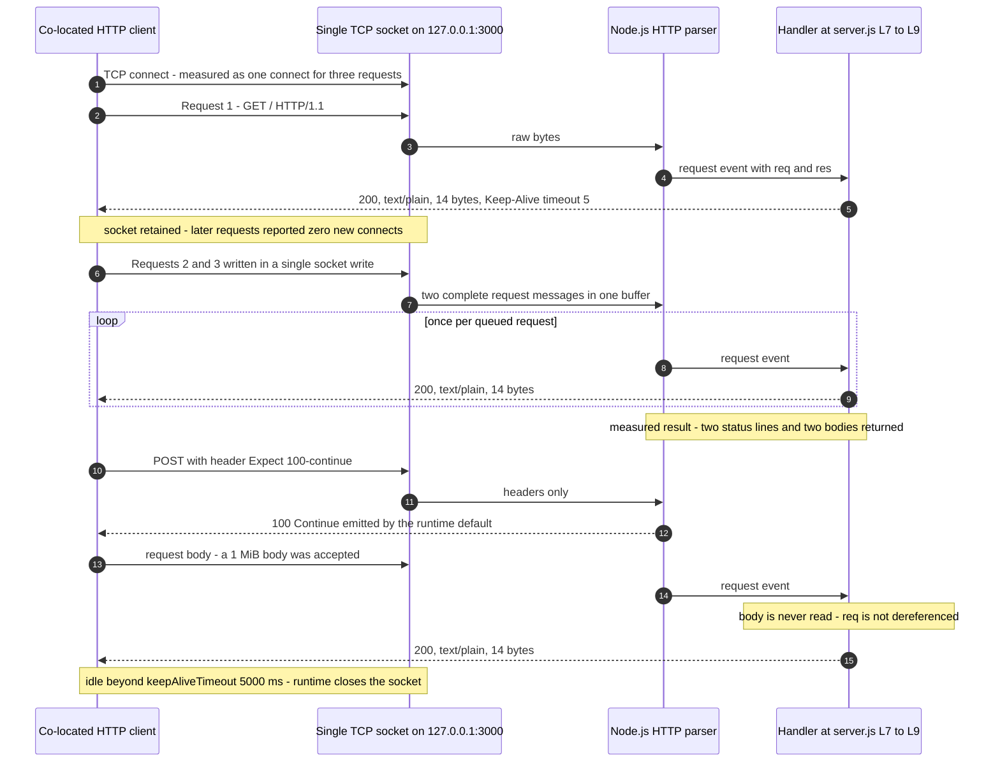
```mermaid
sequenceDiagram
    autonumber
    participant Client as Co-located HTTP client
    participant Sock as Single TCP socket on 127.0.0.1:3000
    participant Parser as Node.js HTTP parser
    participant Handler as Handler at server.js L7 to L9

    Client->>Sock: TCP connect - measured as one connect for three requests
    Client->>Sock: Request 1 - GET / HTTP/1.1
    Sock->>Parser: raw bytes
    Parser->>Handler: request event with req and res
    Handler-->>Client: 200, text/plain, 14 bytes, Keep-Alive timeout 5
    Note over Client,Sock: socket retained - later requests reported zero new connects

    Client->>Sock: Requests 2 and 3 written in a single socket write
    Sock->>Parser: two complete request messages in one buffer
    loop once per queued request
        Parser->>Handler: request event
        Handler-->>Client: 200, text/plain, 14 bytes
    end
    Note over Parser,Handler: measured result - two status lines and two bodies returned

    Client->>Sock: POST with header Expect 100-continue
    Sock->>Parser: headers only
    Parser-->>Client: 100 Continue emitted by the runtime default
    Client->>Sock: request body - a 1 MiB body was accepted
    Parser->>Handler: request event
    Note over Handler: body is never read - req is not dereferenced
    Handler-->>Client: 200, text/plain, 14 bytes
    Note over Client,Sock: idle beyond keepAliveTimeout 5000 ms - runtime closes the socket
```

**Tooling integration.** The npm CLI is the only other system this repository integrates with. The sequence below covers all three launch and verification paths, including the two that fail.

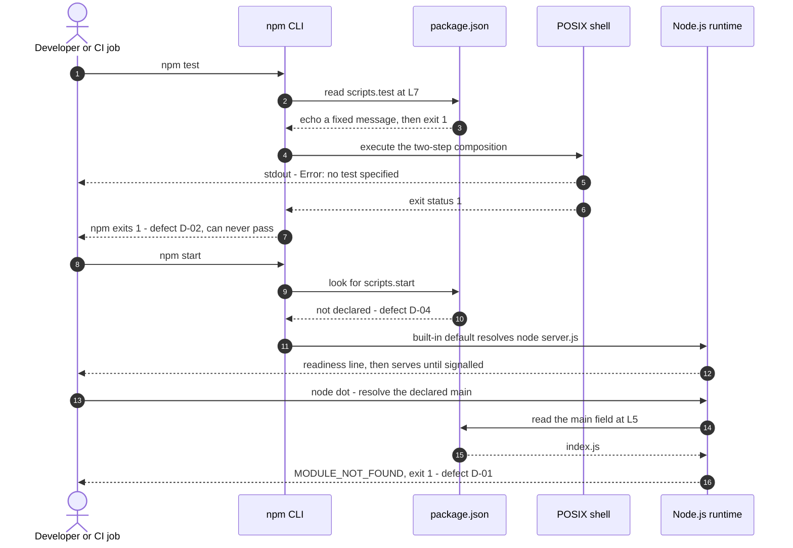
```mermaid
sequenceDiagram
    autonumber
    actor Dev as Developer or CI job
    participant NPM as npm CLI
    participant PKG as package.json
    participant Shell as POSIX shell
    participant Node as Node.js runtime

    Dev->>NPM: npm test
    NPM->>PKG: read scripts.test at L7
    PKG-->>NPM: echo a fixed message, then exit 1
    NPM->>Shell: execute the two-step composition
    Shell-->>Dev: stdout - Error: no test specified
    Shell-->>NPM: exit status 1
    NPM-->>Dev: npm exits 1 - defect D-02, can never pass

    Dev->>NPM: npm start
    NPM->>PKG: look for scripts.start
    PKG-->>NPM: not declared - defect D-04
    NPM->>Node: built-in default resolves node server.js
    Node-->>Dev: readiness line, then serves until signalled

    Dev->>Node: node dot - resolve the declared main
    Node->>PKG: read the main field at L5
    PKG-->>Node: index.js
    Node-->>Dev: MODULE_NOT_FOUND, exit 1 - defect D-01
```

No third diagram is possible for external integrations: there are none. `server.js` contains no outbound network primitive, no filesystem access, and no environment-variable read, and the locked dependency graph contains only the root package, so no database, broker, identity provider, cloud service, or telemetry collector participates in any sequence.

### 4.4.4 Operator and Developer Workflow

This diagram covers workflows W-4 and W-5 together with the governance constraint that dominates every task involving this repository.

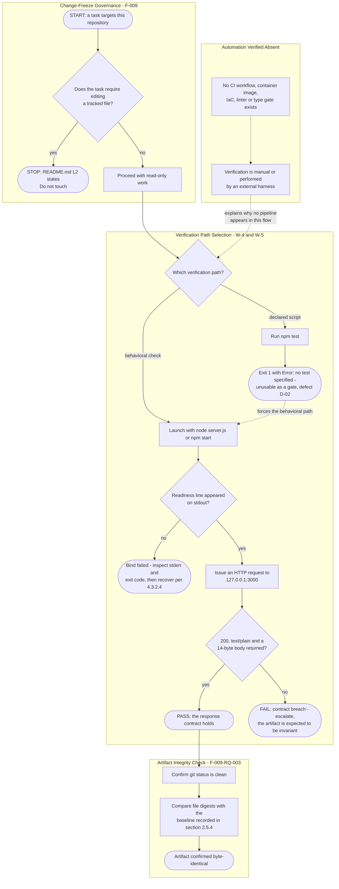
```mermaid
flowchart TB
    subgraph FreezeGate["Change-Freeze Governance - F-009"]
        FG1(["START: a task targets this repository"])
        FG2{"Does the task require editing<br/>a tracked file?"}
        FG3(["STOP: README.md L2 states<br/>Do not touch"])
        FG4["Proceed with read-only work"]
    end

    subgraph VerifyLoop["Verification Path Selection - W-4 and W-5"]
        VL1{"Which verification path?"}
        VL2["Run npm test"]
        VL3(["Exit 1 with Error: no test specified -<br/>unusable as a gate, defect D-02"])
        VL4["Launch with node server.js or npm start"]
        VL5{"Readiness line appeared<br/>on stdout?"}
        VL6(["Bind failed - inspect stderr and<br/>exit code, then recover per 4.3.2.4"])
        VL7["Issue an HTTP request to<br/>127.0.0.1:3000"]
        VL8{"200, text/plain and a<br/>14-byte body returned?"}
        VL9(["PASS: the response contract holds"])
        VL10(["FAIL: contract breach - escalate,<br/>the artifact is expected to be invariant"])
    end

    subgraph IntegrityCheck["Artifact Integrity Check - F-009-RQ-003"]
        IC1["Confirm git status is clean"]
        IC2["Compare file digests with the<br/>baseline recorded in section 2.5.4"]
        IC3(["Artifact confirmed byte-identical"])
    end

    subgraph AbsentAutomation["Automation Verified Absent"]
        AA1["No CI workflow, container image,<br/>IaC, linter or type gate exists"]
        AA2["Verification is manual or performed<br/>by an external harness"]
    end

    FG1 --> FG2
    FG2 -->|"yes"| FG3
    FG2 -->|"no"| FG4
    FG4 --> VL1
    VL1 -->|"declared script"| VL2
    VL2 --> VL3
    VL1 -->|"behavioral check"| VL4
    VL4 --> VL5
    VL5 -->|"no"| VL6
    VL5 -->|"yes"| VL7
    VL7 --> VL8
    VL8 -->|"no"| VL10
    VL8 -->|"yes"| VL9
    VL9 --> IC1
    IC1 --> IC2
    IC2 --> IC3
    VL3 -.->|"forces the behavioral path"| VL4
    AA1 -.-> AA2
    AA2 -.->|"explains why no pipeline<br/>appears in this flow"| VL1
```

The workflow encodes three verified facts. First, the declared verification path is a dead end — `npm test` exits `1` unconditionally, so behavioral verification by HTTP request is the only usable check. Second, the readiness line is the only startup gate available, because no health endpoint exists and no per-request logging is produced. Third, no automation stage can appear in this flow: the repository contains no CI workflow, container definition, infrastructure descriptor, linter, formatter, or type checker, so every step above is performed by a human operator or an external harness.


## 4.5 References

Every statement in §4.1 through §4.4 rests on one of three evidence types: a line of a tracked repository file, a command executed against the checked-out artifact, or a cross-reference to an already-written section of this specification. All four sources below constitute the complete tracked file set — `git ls-files` returns exactly these paths and nothing else.

### 4.5.1 Repository Files Examined

- `server.js` — the sole executable file (14 lines). Established every process step in the flowcharts: L1 the only `require` and the built-in `http` dependency; L3–L4 the bind-address and port constants; L6 server construction with the single inline request listener and the never-dereferenced `req` parameter; L7–L9 the three per-request statements; L12–L14 the `listen` call and the readiness-line callback. Its emptiness of branch, timer, state, persistence, error-listener, and signal-handler constructs established every documented absence.
- `package.json` — established the developer-facing workflows and their defects: `scripts.test` at L7 (the two-step shell composition behind W-4 and defect D-02), the `main: index.js` declaration at L5 (defect D-01), the absence of a `start` script (defect D-04), the absence of any dependency, `engines`, or lifecycle-hook key, and the package identity used in the npm tooling sequence.
- `package-lock.json` — established that the resolved dependency graph contains only the root package (`lockfileVersion` 3 with a single `""` entry), which is why no third-party client library can participate in any integration flow.
- `README.md` — established the artifact's stated purpose and the change-freeze directive on L2 that governs the operator/developer workflow in §4.4.4 and the business rules in §4.2.3.1.

### 4.5.2 Repository Folders Examined

- Repository root — contains exactly the four files above plus `.git`. `find . -mindepth 1 -type d` excluding `.git` returns zero results, confirming a flat repository with no subdirectories, and therefore no additional entry point, job, worker, migration folder, schema directory, or workflow definition that could contribute a process flow.
- No `.blitzyignore` file exists anywhere on the filesystem or in the checkout, so no path was excluded from this investigation.

### 4.5.3 Verification Activities Behind the Measured Figures

| Activity | What It Established |
|---|---|
| `node server.js`, then `curl` with `GET`, `HEAD`, `POST`, `PUT`, `PATCH`, `DELETE`, `OPTIONS`, `TRACE` against `/` and `/a/b/c?x=1&y=2` with a custom header and body | Response invariance and the exact response header composition used in §4.1.1.1, §4.1.2.2 and §4.4.2 |
| 1 MiB `POST` body | The transport accepts and the application discards request bodies unread (§4.1.2.1) |
| Inspection of a constructed `http.Server` object for `timeout`, `keepAliveTimeout`, `headersTimeout`, `requestTimeout`, `connectionsCheckingInterval`, `maxRequestsPerSocket`, `maxHeadersCount`, and `http.maxHeaderSize`; plus listener counts for `request`, `error`, `clientError`, `connection`, `checkContinue`, and `upgrade` | Every timing value in §4.2.2 and the event-listener table in §4.1.2.3 |
| Three sequential requests in one client invocation; two requests written in a single socket write; a request carrying `Expect: 100-continue`; an HTTP/1.0 request with no `Host` header | Keep-alive reuse, pipelining, the runtime's `100 Continue` response, and the HTTP/1.0 framing fallback in §4.3.2.2 and §4.4.3 |
| Raw socket sending `THIS IS NOT HTTP`, and a 20 000-byte header block | The runtime-generated `400 Bad Request` and `431 Request Header Fields Too Large` paths in §4.1.1.4 and §4.2.3 |
| Socket destroyed mid-request, followed by a subsequent request | Silent client-abort tolerance with the process unaffected (§4.1.1.4) |
| Launching a second instance while port 3000 was bound | The unhandled `error` event, the full `EADDRINUSE` error object (`errno -98`, `syscall listen`), and exit code 1 (§4.1.1.4, §4.3.2.1) |
| `kill -TERM` and `kill -INT` against a running instance, then `ss -ltn` | Exit codes 143 and 130, the absence of any drain, and OS reclamation of the port (§4.3.1.1) |
| `npm test`, `npm start`, `node .` | The three tooling paths and their exit codes in §4.4.3, and defects D-01, D-02, D-04 |
| 200 sequential loopback requests and a 500-request burst at concurrency 100 | The environment measurements reported in §4.2.2 — explicitly not SLAs |
| `curl` against the container's routable address on port 3000 | Loopback-only reachability, the outer boundary of every request flow (§4.2.3.3) |
| Working-tree snapshot before and after a start-serve-terminate cycle, plus `git status --porcelain` | Zero filesystem side effects and the absence of any persistence point (§4.3.1.2) |
| Word-boundary greps across all four tracked files for branch, timer, retry, scheduling, concurrency, state, cache, transaction, persistence, error-listener, signal, credential, and observability constructs | Every documented absence in §4.1, §4.2.3, §4.3.1 and §4.3.2 |

### 4.5.4 Technical Specification Sections Cross-Referenced

- §1.2.2.2 — component diagram, the structural counterpart to the workflow views in §4.1.
- §1.3.1.1 — operator and client sequence diagram for the primary workflow.
- §2.2 Functional Requirements Table — source of every `F-XXX-RQ-YYY` identifier cited in the flowcharts and validation rules, and of defects D-01 through D-04.
- §2.3.2 Integration Points — the five-interface inventory reproduced and expanded in §4.1.1.2.
- §2.3.4 Common Services — the verified absence of shared logging, configuration, error handling, middleware, health checks, lifecycle management, metrics, and persistence.
- §2.5.4 — the SHA-256 baseline used by the artifact-integrity step in §4.4.4 and the drift check in §4.3.2.4.
- §3.2.5, §3.4.7, §3.6.6 — framework layering, integration and trust boundary, and toolchain execution flow diagrams that this section complements.

### 4.5.5 External Sources

No external or web source was used in this section. Every timing default, status code, exit code, and protocol behavior documented here was measured directly against the checked-out artifact on the verification runtime rather than quoted from documentation, so no third-party reference is required to substantiate any claim in §4.


# 5. System Architecture

## 5.1 High-Level Architecture

The architecture described in this section is the complete architecture of the system. `git ls-files` returns exactly four paths — `README.md`, `package.json`, `package-lock.json`, and `server.js` — and the repository has no subdirectories, so there is no hidden tier, no second service, and no infrastructure layer to reconcile with what follows. Every architectural statement below is anchored to one of those four files or to behavior observed by executing them.

### 5.1.1 System Overview

#### 5.1.1.1 Architecture Style and Rationale

`hao-backprop-test` implements a **single-process, single-module, stateless synchronous HTTP responder**. In classification terms it is a monolith with exactly one deployable unit, one module, one network interface, and one execution path — the degenerate case of a monolith, in which the usual internal structure (layers, routers, services, repositories) has been deliberately collapsed into 14 lines of `server.js`.

| Architectural Dimension | Observed Style | Evidence |
|---|---|---|
| Deployment topology | Single foreground OS process, one event loop, one listener | `server.js` L12 is the only `listen` call; no `cluster`, `worker_threads`, or process-manager configuration exists anywhere in the repository |
| Internal structure | Flat module scope; no layers, packages, or namespaces | Four `const` bindings at module level (L1, L3, L4, L6); no `module.exports`, classes, or named functions |
| Interaction style | Synchronous request/response; one inline handler answers all traffic | `http.createServer((req, res) => {...})` at L6–L10 |
| State model | Stateless — every response is produced from source literals | All module bindings are `const`; no `Map`/`Set`/mutable store; no data tier (§3.5) |
| Concurrency model | Runtime-owned reactor (Node event loop); application code is non-blocking by having no I/O | Handler performs three assignments/calls with no `Promise`, `async`, or `await` anywhere |
| Dependency posture | Platform primitives only — zero third-party packages | `require('http')` (L1) is the only import; `package-lock.json` locks only the root package |
| Configuration model | Compile-time literals; no external configuration channel | `hostname`/`port` literals at L3–L4; zero `process.env` reads in the repository |
| Fault posture | Fail-fast by omission — unhandled faults terminate the process | No `'error'` listener, no `try`/`catch`, no signal handler; a bind collision exits with code 1 |

The rationale is stated in the repository itself. `README.md` L2 declares the project a *test project for backprop integration* and adds the directive `Do not touch!`. The artifact's value is therefore its **invariance**, not its capability, and the architecture is optimised for exactly that: every element that could introduce variability between runs — a dependency to resolve, a configuration file to read, a datastore to reach, a routing decision to evaluate, a build step to reproduce — has been removed rather than configured. What remains is an endpoint whose response is byte-identical on the first request and the thousandth, on a fresh host and a reused one.

#### 5.1.1.2 Key Architectural Principles and Patterns

Six principles are visible in the code, each traceable to a specific construct:

- **Platform primitives only.** HTTP is served by Node's core `http` module rather than a framework, so there is no middleware chain, no route table, and no dependency tree to version. The committed source is exactly the source that executes — there is no transpiler, bundler, or type system between the repository and the running process.
- **Configuration as source.** The network contract is two `const` bindings (L3–L4) consumed by both the `listen` call (L12) and the readiness log (L13). This makes the endpoint statically readable from source and gives the bind target and the advertised URL a single source of truth, at the cost of any per-environment override.
- **Total statelessness.** Nothing is accumulated between requests: no counter, no session map, no cache, no file, no database. Restarting the process returns the system to an identical state because all state is compile-time constant.
- **Constant, request-agnostic contract.** The handler declares `(req, res)` but never dereferences `req`, so method, path, query, headers, and body cannot influence the response. Determinism is achieved by omission rather than by validation logic.
- **Start-on-load lifecycle.** `server.listen` executes at module-evaluation time (L12), so loading the module *is* starting the service; readiness is signalled from the completion callback. There is no factory, no `start()` export, and consequently no way to construct the listener without also binding it.
- **Fail-fast containment.** No error listener, retry, port fallback, or supervisor exists; and the listener is bound to `127.0.0.1`, which confines every consumer to the same host. Faults surface immediately as a non-zero process exit, and blast radius is bounded by the loopback interface.

The recognisable design patterns present are all either runtime-supplied or reductive: the **reactor / event-loop** pattern (owned by Node's `libuv` and `http` layers), the **observer** pattern (the application registers exactly two listeners — one `request` listener and one one-shot `listening` callback; measured listener counts on an identically constructed server are `request`=1, `listening`=1, `error`=0, `clientError`=0), a **constant-function handler** (the response is independent of its input), and the **composition root** pattern in its simplest form (the module body is the only wiring site). Patterns that are conspicuously *absent* — layering, dependency injection, middleware pipelines, CQRS, event sourcing, circuit breaking, service discovery — are absent because there is no second component for them to mediate between.

#### 5.1.1.3 System Boundaries and Major Interfaces

The system has four live interfaces and two build-time interfaces. It initiates nothing: `server.js` contains no outbound network, filesystem, or child-process primitive, so no boundary is ever crossed in the outbound direction except to write the readiness line and to return an exit status.

| Boundary | Interface Crossing It | Directionality |
|---|---|---|
| Loopback network boundary (`127.0.0.1:3000`) | HTTP/1.1 over TCP; any method and path accepted | Inbound only |
| Process/console boundary | One stdout readiness line; stderr stack trace on unhandled fault | Outbound only |
| Process/supervisor boundary | POSIX exit status (`1` on bind failure, `143` on SIGTERM, `130` on SIGINT) | Outbound only |
| Runtime boundary | Node core `http` module, required at `server.js` L1 | Application → runtime |
| Toolchain boundary (build-time) | npm CLI reading `package.json` and `package-lock.json` | Tool → repository |
| Source-control boundary (build-time) | Git checkout of branch `main`; the checkout *is* the deployment unit | Remote → host |

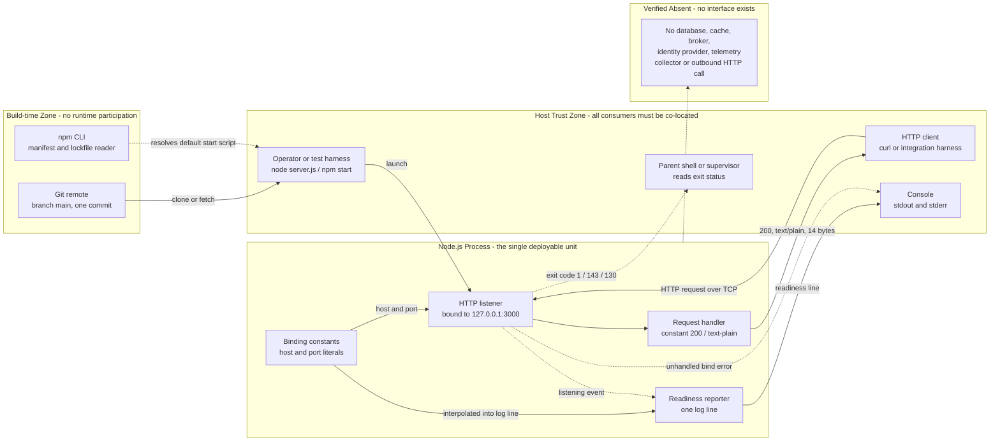
```mermaid
flowchart LR
    subgraph HostZone["Host Trust Zone - all consumers must be co-located"]
        OperatorNode["Operator or test harness<br/>node server.js / npm start"]
        ClientNode["HTTP client<br/>curl or integration harness"]
        ConsoleNode["Console<br/>stdout and stderr"]
        SupervisorNode["Parent shell or supervisor<br/>reads exit status"]
    end

    subgraph ProcessZone["Node.js Process - the single deployable unit"]
        ListenerNode["HTTP listener<br/>bound to 127.0.0.1:3000"]
        HandlerNode["Request handler<br/>constant 200 / text-plain"]
        ConfigNode["Binding constants<br/>host and port literals"]
        ReadyNode["Readiness reporter<br/>one log line"]
    end

    subgraph ToolZone["Build-time Zone - no runtime participation"]
        GitNode["Git remote<br/>branch main, one commit"]
        NpmNode["npm CLI<br/>manifest and lockfile reader"]
    end

    subgraph AbsentZone["Verified Absent - no interface exists"]
        NoneNode["No database, cache, broker,<br/>identity provider, telemetry<br/>collector or outbound HTTP call"]
    end

    OperatorNode -->|"launch"| ListenerNode
    ClientNode -->|"HTTP request over TCP"| ListenerNode
    ListenerNode --> HandlerNode
    HandlerNode -->|"200, text/plain, 14 bytes"| ClientNode
    ConfigNode -->|"host and port"| ListenerNode
    ConfigNode -->|"interpolated into log line"| ReadyNode
    ListenerNode -.->|"listening event"| ReadyNode
    ReadyNode -->|"readiness line"| ConsoleNode
    ListenerNode -.->|"unhandled bind error"| ConsoleNode
    ListenerNode -.->|"exit code 1 / 143 / 130"| SupervisorNode
    GitNode -->|"clone or fetch"| OperatorNode
    NpmNode -.->|"resolves default start script"| OperatorNode
    ProcessZone -.->|"no outbound integration"| NoneNode
```

The loopback bind is the architecturally decisive boundary. A request to the verification container's routable address on port 3000 could not connect, so the service is reachable only by processes sharing the host's network namespace. This single constant makes the system a *co-located fixture* rather than a network service, and it is simultaneously the system's only access control (§5.4.4).

### 5.1.2 Core Components

Nine components constitute the system. Four are runtime components inside `server.js`, one is the runtime library the application delegates to, and four are repository artifacts that define identity, supply chain, and governance. Component names introduced here are used consistently for the remainder of Section 5.

| Component | Primary Responsibility | Key Dependencies |
|---|---|---|
| Module Bootstrap Scope (`server.js` L1–L14) | Composition root: resolves the runtime import, declares configuration, constructs the listener, and starts it during module evaluation | Node.js CommonJS loader; Node core `http` |
| Static Binding Configuration (L3–L4) | Declares the entire network contract as two immutable literals — `127.0.0.1` and `3000` | None; no environment, CLI, or file input |
| HTTP Listener (`http.Server`, L6 + L12) | Owns the TCP socket, accepts connections, parses HTTP framing, and dispatches one `request` event per request | Static Binding Configuration; Node core `http`/`net`; a free port on loopback |
| Request Handler (L6–L10) | Produces the constant response: status `200`, `Content-Type: text/plain`, 14-byte body | HTTP Listener (sole invoker); `ServerResponse` API |
| Readiness Reporter (L12–L14) | Emits exactly one stdout line confirming a successful bind and the exact URL to call | Static Binding Configuration; writable stdout |
| Node.js Core `http` Module (required at L1) | Supplies the server abstraction, HTTP parser, response serialiser, keep-alive management, and all protocol-level error responses | Node.js runtime (no repository-declared version) |
| Package Manifest (`package.json`) | Declares package identity, license, and the single lifecycle script; provides npm's launch surface | npm CLI; a JSON parser |
| Dependency Lock (`package-lock.json`) | Formally records an empty dependency graph (lockfile v3, root entry only) | Package Manifest, with which it must stay consistent |
| Governance Note (`README.md`) | States the artifact's purpose and imposes the change freeze that preserves the response contract | None; static Markdown |

| Component | Integration Points | Critical Considerations |
|---|---|---|
| Module Bootstrap Scope | Invoked by `node server.js` or `npm start`; exports nothing | Nothing can be imported or unit-tested in isolation; `node .` fails because the declared `main` (`index.js`) does not exist (defect D-01) |
| Static Binding Configuration | Consumed by the HTTP Listener and the Readiness Reporter | Changing host or port requires editing source, which `README.md` L2 forbids; this is the binding constraint behind every scaling limit |
| HTTP Listener | Inbound HTTP/1.1 over TCP on `127.0.0.1:3000` | One instance per host: a second bind attempt raises an unhandled `EADDRINUSE` (`errno -98`) and exits `1`; loopback-only, so remote callers are refused |
| Request Handler | Receives `req`/`res` from the listener; writes to the client | `req` is never dereferenced, so no request can make application code emit a non-`200` status; the body is a source literal and cannot leak data |
| Readiness Reporter | Writes to process stdout | One-shot: a consumer that misses the line has no health endpoint to poll afterwards; the line carries no PID, timestamp, or instance ID |
| Node.js Core `http` Module | Application ↔ runtime library boundary | Contributes `Date`, `Connection`, `Keep-Alive`, and `Content-Length` and owns all `400`/`431` responses; no `engines` range pins a supported version |
| Package Manifest | Read by the npm CLI, not at runtime | `npm test` fails by construction (defect D-02); no explicit `start` script exists — `npm start` works only via npm's built-in default (defect D-04) |
| Dependency Lock | Paired with the manifest for `npm ci`/`npm ls` | `npm ci` is a verified no-op that creates no `node_modules`; automation must not treat an empty install as an error |
| Governance Note | Read by humans only | The freeze has no technical enforcement — no `CODEOWNERS`, branch-protection artifact, lint gate, or passing test exists |

### 5.1.3 Data Flow Description

**Primary inbound flow.** A co-located client opens a TCP connection to `127.0.0.1:3000`. The OS accepts it on the loopback interface and hands the bytes to the HTTP Listener, where Node's parser performs framing and enforces its own limits, then emits one `request` event carrying `req` and `res`. The Request Handler executes three statements — set status, set one header, end the response with a string literal — and returns. Node's response writer then serialises the status line and headers, adding `Date`, `Connection: keep-alive`, `Keep-Alive: timeout=5`, and a computed `Content-Length: 14`, and writes the 14-byte body to the socket. The flow is fully synchronous: there is no queue, no worker hand-off, no `Promise`, and no I/O on the request path.

**Request data is received but never consumed.** Because `req` is never dereferenced, the inbound method, path, query string, headers, and body have no downstream consumer. This was confirmed across eight HTTP methods against a path with a query string, a custom header, and a request body — all returned `200`, `text/plain`, and the same 14 bytes, with `HEAD` returning identical status and headers and a zero-length body (the runtime suppressing it). A 1 MiB `POST` body was fully accepted at the transport layer and discarded unread. Architecturally, the request payload terminates at the runtime's parser buffers; it never enters application memory.

**Outbound flows.** Three data items leave the process, none of them derived from request content:

- The **readiness line** — `Server running at http://127.0.0.1:3000/` — written once to stdout from the `listen` completion callback.
- The **response** — a constant status/header/body triple, identical for every caller.
- The **process exit status** — `1` for an unhandled bind failure or `npm test`, `143` for SIGTERM, `130` for SIGINT — the only channel through which a supervisor learns anything about the process.

**Integration patterns and protocols.** The system uses exactly three protocols, and only one of them at runtime for data: HTTP/1.1 over TCP for the request/response exchange (with the runtime adapting to HTTP/1.0 callers by switching to `Connection: close` and omitting `Content-Length`); line-oriented plain text on stdout/stderr for diagnostics; and POSIX exit codes for status. Two further, build-time-only integrations are file-based: the npm CLI reads JSON from `package.json` and `package-lock.json`, and Git delivers the checkout that constitutes the deployment unit. There is no messaging, streaming, RPC, webhook, or polling pattern anywhere in the repository.

**Data transformation points.** There is exactly one transformation authored by the application: the template literal at L13 interpolates the two configuration constants into the readiness string. Everything else on the data path is protocol serialisation performed by the runtime — HTTP request parsing inbound, and status-line/header/body framing outbound. No parsing, validation, mapping, enrichment, aggregation, serialisation, or encoding of business data occurs, because no business data enters the system.

**Data stores and caches.** There are none at any layer. No database, ORM, connection string, schema, message broker, object store, or filesystem write exists; `server.js` never requires `fs` or `path`. There is no in-process cache (no `Map`, `Set`, or `WeakMap`) and no distributed cache client, and the handler sets no `Cache-Control`, `ETag`, `Expires`, or `Last-Modified` header, so no HTTP-level caching is negotiated either. The only durable representation of the system's data — the response body, the bind host, and the port — is the source text itself, versioned in Git; in that precise sense the repository is the database. This was measured rather than inferred: snapshotting the checkout before starting the service and after serving requests and terminating produced identical digests, and `git status --porcelain` remained empty, confirming that no flow writes any file.

**The only cross-request state** in the system is transport-level and runtime-owned: an HTTP/1.1 keep-alive socket is retained for reuse for up to `keepAliveTimeout` (5 000 ms, a Node default the repository does not set), and three sequential requests were observed to reuse a single TCP connection. No application state is associated with that connection, so the reuse is an optimisation with no architectural coupling.

### 5.1.4 External Integration Points

The system integrates with **no external system**. `server.js` contains no `fetch`, `http.request`, `https`, `net.`, `dns.`, or `child_process` call, no database or cache client, no identity-provider SDK, and no telemetry exporter; and `package-lock.json` proves no third-party client library is even installed. What follows therefore documents the boundary participants that genuinely exist — every one of them either co-located on the same host or active only at build time.

| Participant | Integration Type | Data Exchange Pattern |
|---|---|---|
| Co-located HTTP client (harness, `curl`, or script) | Inbound network interface | Synchronous request/response; client-initiated, one response per request; keep-alive reuse permitted |
| Operator or test harness (launcher) | Process control | Fire-and-forget launch (`node server.js` / `npm start`); wait-for-readiness-line handshake |
| Operator console (stdout/stderr) | Outbound diagnostic stream | One-shot readiness line at startup; stack trace only on unhandled fault; no per-request output |
| Parent shell or supervisor | Outbound status signal | Exit-status-on-termination; no heartbeat, no health probe |
| npm CLI and Node.js runtime | Local toolchain | File read of manifest and lockfile; process spawn; verified no-op install |
| Git remote (`origin/main`, GitHub) | Source distribution | Pull-based clone/fetch of the checkout that *is* the deployment unit |

| Participant | Protocol / Format | SLA Requirements |
|---|---|---|
| Co-located HTTP client | HTTP/1.1 over TCP on `127.0.0.1:3000`; `text/plain` body | **None defined in the repository** — no latency, throughput, or availability target exists in any file |
| Operator or test harness | OS process invocation (`argv`) | **None defined** — no startup-time budget is declared |
| Operator console | Line-oriented UTF-8 text on stdout/stderr | **None defined** — no log retention, shipping, or delivery guarantee |
| Parent shell or supervisor | POSIX exit codes (`1`, `143`, `130`) | **None defined** — no restart policy or supervision contract exists |
| npm CLI and Node.js runtime | JSON manifest and lockfile v3 | **None defined** — no `engines` range or `packageManager` field pins a supported version |
| Git remote | Git over HTTPS; single commit on `main` | **None defined** — no release cadence, tag, or changelog exists |

Because the repository declares no service-level objective of any kind, the SLA column above records absence rather than a value. Externally measured figures do exist for the verification environment and are reported in §5.4.5, but they are environment measurements, not commitments.

The following integration categories were each checked individually and are **verifiably absent**, which is what allows the component and data-flow models above to be treated as complete:

| Absent Integration Category | Basis for the Finding |
|---|---|
| Relational or document database, ORM, migration tooling | No driver, connection string, or schema artifact; no `fs` usage |
| Cache or in-memory data grid (Redis, Memcached) | No client library; no in-process collection of any kind |
| Message broker, event bus, queue, or stream | No broker client; no `EventEmitter` usage beyond the runtime's own `http.Server` |
| Outbound HTTP/REST/GraphQL/RPC calls to any service | No HTTP client primitive of any kind in `server.js` |
| Identity provider, secrets manager, or configuration service | No SDK, no `process.env` read, no `.npmrc`, no `.env` file |
| Telemetry, metrics, tracing, or log-shipping backend | No exporter, agent, or instrumentation library; a single `console.log` is the entire output surface |
| Container registry, orchestrator, IaC, or CI/CD service | No `Dockerfile`, compose file, Kubernetes manifest, IaC template, or pipeline definition exists |
| Package registry publication or consumption | Nothing is published; the dependency graph is empty and no registry credential is configured |


## 5.2 Component Details

### 5.2.1 Component Model and Its Physical Reality

The nine components named in §5.1.2 are **logical** components. Physically there are no module boundaries at all: `server.js` declares no functions, no classes, and no exports, so the four runtime components share one module scope and are separated only by line range. This distinction matters architecturally and is stated once here rather than repeated in every subsection below:

- Components cannot be deployed, versioned, replaced, or tested independently — the deployable unit is the whole file.
- Components cannot be reused: with no `module.exports`, no part of the behavior can be imported by another program.
- The "interfaces" between application components are direct lexical references to `const` bindings in the same scope, not calls across an abstraction.
- Every genuine API boundary in the system is therefore a boundary between the application and the **runtime** (Node's `http` module), or between the application and an **operating-system facility** (a TCP socket, stdout, an exit status).

Each component below is documented against the same five dimensions: purpose and responsibilities, technologies and frameworks, key interfaces and APIs, data persistence requirements, and scaling considerations.

### 5.2.2 Module Bootstrap Scope (Composition Root)

| Dimension | Detail |
|---|---|
| Purpose and responsibilities | The composition root and the only executable entry point. Resolves the runtime import (L1), declares configuration (L3–L4), constructs the listener and registers the request handler (L6–L10), then binds and registers the readiness callback (L12–L14). Because `listen` is invoked at top level, wiring and starting are the same action — the module cannot be loaded without the service being started |
| Technologies and frameworks | Plain CommonJS on Node.js; no framework, transpiler, bundler, or type system. The committed 14 lines are executed verbatim, and `node --check server.js` passes |
| Key interfaces and APIs | **Inbound:** OS process invocation via `node server.js`, or `npm start`, which npm resolves to `node server.js` through its built-in default because no `start` script is declared (defect D-04). **Outbound:** `require('http')`. **Exposed:** nothing — zero exports. `node .` fails with `MODULE_NOT_FOUND` because the manifest's `main: index.js` does not exist (defect D-01) |
| Data persistence requirements | None. Four `const` bindings live on the heap for the process lifetime; nothing is read from or written to disk |
| Scaling considerations | The bootstrap is the unit of scaling and it scales only by process replication — which the fixed loopback port forecloses on a single host. No `cluster` call, worker thread, or process-manager configuration exists, so additional CPU cores cannot be used |

### 5.2.3 Static Binding Configuration

| Dimension | Detail |
|---|---|
| Purpose and responsibilities | Declares the complete network contract as two immutable module-level literals — `hostname = '127.0.0.1'` (L3) and `port = 3000` (L4) — and acts as the single source of truth shared by the listener and the readiness reporter |
| Technologies and frameworks | JavaScript `const` bindings. No configuration library, schema, or validation is involved |
| Key interfaces and APIs | Lexical references only: consumed by `server.listen(port, hostname, …)` at L12 and by the template literal at L13. There is **no input interface** — the repository contains zero `process.env` reads, no CLI-argument parsing, no `.env` or config file, and no `engines`/`.nvmrc` runtime pin |
| Data persistence requirements | None. The values are source text; their durability mechanism is Git version control |
| Scaling considerations | This component is the origin of the system's two hardest scaling limits: one instance per host (fixed port) and callers restricted to the same host (loopback address). Neither can be relaxed without editing source, which `README.md` L2 forbids |

### 5.2.4 HTTP Listener

| Dimension | Detail |
|---|---|
| Purpose and responsibilities | Owns the listening TCP socket on `127.0.0.1:3000`, accepts connections, delegates HTTP framing to the runtime parser, and dispatches exactly one `request` event per parsed request to the handler. Also the component whose bind outcome determines whether the process lives or dies |
| Technologies and frameworks | `http.Server`, obtained from `http.createServer(...)` at L6 and activated by `server.listen(port, hostname, cb)` at L12. All connection-level behavior is Node default: measured on an identically constructed server, `keepAliveTimeout` = 5 000 ms, `headersTimeout` = 60 000 ms, `requestTimeout` = 300 000 ms, socket `timeout` = 0 (disabled), `maxRequestsPerSocket` = 0 (unlimited), and `http.maxHeaderSize` = 16 384 bytes. The repository sets none of these |
| Key interfaces and APIs | **Inbound:** HTTP/1.1 over TCP; every method and path is accepted, and one implicit endpoint exists with no route table, schema, or version. **Event surface actually used:** `request` (1 application listener) and the one-shot `listening` callback. **Event surface deliberately unused:** `error`, `clientError`, `checkContinue`, `upgrade`, `connect`, `close`, `dropRequest` — all zero application listeners |
| Data persistence requirements | None. The listening handle lives in the kernel and libuv until process exit and is reclaimed by the OS; no connection registry, session table, or request log is maintained |
| Scaling considerations | Hard ceiling of one instance per host: a second bind attempt emits an `error` event with no listener, producing an unhandled `EADDRINUSE` (`errno -98`, `syscall 'listen'`) and exit code `1`. Throughput is bounded by one event loop; in the verification environment a burst of 500 requests at concurrency 100 completed with 500 `200` responses and no failures, but that is an environment measurement, not a declared capacity |

### 5.2.5 Request Handler

| Dimension | Detail |
|---|---|
| Purpose and responsibilities | Produces the system's entire response contract in three statements: `res.statusCode = 200` (L7), `res.setHeader('Content-Type', 'text/plain')` (L8), `res.end('Hello, World!\n')` (L9). Its second responsibility is a negative one that the fixture depends on — it must not read `req` |
| Technologies and frameworks | An inline arrow function passed to `http.createServer`; the `ServerResponse` API is the only framework surface touched. No router, middleware chain, body parser, template engine, or serialiser is present |
| Key interfaces and APIs | **Inbound:** the runtime's `request` event, delivering `req` and `res`. **Outbound:** three `ServerResponse` calls. The declared `req` parameter is never dereferenced, so method, path, query, headers, and body are structurally unavailable to any logic — verified across eight HTTP methods with a query string, a custom header, and bodies up to 1 MiB, all returning byte-identical responses |
| Data persistence requirements | None, and none is possible: the response body is a source literal, no request data is retained, and the `ServerResponse` object is garbage-collected once `end()` completes |
| Scaling considerations | Inherently stateless and therefore free of affinity, session-replication, or shared-store requirements; per-request work is constant (three statements, no I/O, no computation) and independent of request size. Its cyclomatic complexity is 1, so there is no branch whose cost could vary under load. The scaling limit lies entirely in the listener and configuration components, not here |

### 5.2.6 Readiness Reporter

| Dimension | Detail |
|---|---|
| Purpose and responsibilities | Emits the single readiness signal the system possesses: one stdout line, `Server running at http://127.0.0.1:3000/`, written from the `listen` completion callback (L12–L14) after a successful bind |
| Technologies and frameworks | `console.log` with a template literal interpolating the configuration constants. No logging library, log level, formatter, or transport is used |
| Key interfaces and APIs | **Inbound:** the runtime's one-shot `listening` callback. **Outbound:** process stdout, line-oriented UTF-8. Consumers must scrape stdout at launch time; there is no health, readiness, or metrics endpoint to poll afterwards |
| Data persistence requirements | None — the line is never written to a file, and it is the only output the process produces for its entire lifetime apart from a stack trace on unhandled fault |
| Scaling considerations | The line contains only host and port, with no PID, timestamp, or instance identifier, so readiness signals from multiple instances would be indistinguishable in an aggregated stream. Because logging happens once at startup and never on the request path, it contributes nothing to per-request cost |

### 5.2.7 Node.js Core `http` Module (Runtime Platform Component)

This is not repository code, but it is architecturally the largest component in the system: the majority of observable behavior is supplied by it, and documenting the architecture without it would misattribute responsibility.

| Dimension | Detail |
|---|---|
| Purpose and responsibilities | Supplies the server abstraction and, at runtime, performs connection accounting, HTTP request parsing and limit enforcement, HTTP/1.0-versus-1.1 adaptation, keep-alive and pipelining management, `100 Continue` auto-response, response framing, and every protocol-level error response |
| Technologies and frameworks | Node.js standard library (`http`, and beneath it `net`/`libuv`); required at `server.js` L1, the only import in the repository. No version is pinned by the repository — verification used Node v22.23.1 |
| Key interfaces and APIs | `http.createServer`, `http.Server#listen`, the `request`/`listening` events, and `ServerResponse#statusCode`/`setHeader`/`end`. It also authors the `Date`, `Connection`, `Keep-Alive`, and `Content-Length` response headers, and owns the only non-`200` statuses the system can emit — `400 Bad Request` for malformed framing and `431 Request Header Fields Too Large` beyond the 16 KiB header budget |
| Data persistence requirements | None used by this system. Parser buffers hold inbound bytes transiently and discard them unread |
| Scaling considerations | Provides the event-loop concurrency the application relies on, and its defaults are the system's only flow-control mechanism. Because the repository configures none of them, capacity tuning is impossible without a source change |

### 5.2.8 Repository Metadata and Governance Components

These three components participate at build time and in governance, never at runtime.

| Component | Purpose, Technology, and Interfaces | Persistence and Scaling |
|---|---|---|
| Package Manifest (`package.json`) | Declares `hello_world@1.0.0`, description, author, and MIT license, and exposes the lifecycle-script surface — a single `test` entry, `echo "Error: no test specified" && exit 1`. Interface: read by the npm CLI (JSON), never at runtime. Two declarations do not match reality: `main` names a missing `index.js` (D-01) and MIT is asserted with no `LICENSE` file shipped (D-03) | Static, version-controlled text; scale-invariant. `npm test` exits `1` by construction (D-02), so no pipeline may gate on it |
| Dependency Lock (`package-lock.json`) | Formally records an empty dependency graph: lockfile version 3, `requires: true`, and a `packages` map containing only the root `""` entry. Interface: consumed by `npm ci`/`npm ls` alongside the manifest | Static text. Favourable to scaling: install time and supply-chain surface do not grow with deployment count, and `npm ci` is a verified no-op that creates no `node_modules` |
| Governance Note (`README.md`) | Two lines stating the project name `hao-backprop-test` and the directive `test project for backprop integration. Do not touch!`. This is simultaneously the only purpose statement and the only change control in the repository | Static Markdown. Unenforced: no `CODEOWNERS`, branch-protection artifact, lint gate, or passing test can block a modification, so the freeze is preserved in practice only by comparing files against a recorded digest baseline |

### 5.2.9 Component Interaction Diagram

The diagram below is a port-and-connector view: solid edges are data or control flow on the live path, dashed edges are registration or fault-time flow. It shows why the application occupies so little of the request path — the runtime sits on both sides of the handler.

```mermaid
flowchart TB
    subgraph InboundPorts["Inbound Ports"]
        ProcPort["Process invocation<br/>node server.js or npm start"]
        TcpPort["TCP listen endpoint<br/>127.0.0.1:3000, loopback only"]
    end

    subgraph AppComponents["Application Components - server.js module scope, no internal boundaries"]
        Bootstrap["Module Bootstrap Scope<br/>L1-L14 composition root"]
        Config["Static Binding Configuration<br/>L3-L4 host and port literals"]
        Listener["HTTP Listener<br/>L6 construct, L12 bind"]
        Handler["Request Handler<br/>L7-L9 constant response"]
        Ready["Readiness Reporter<br/>L13 one log line"]
    end

    subgraph RuntimePlatform["Runtime Platform - Node.js core http"]
        HttpMod["http module<br/>createServer, Server, ServerResponse"]
        Framing["Parser and response writer<br/>limits, keep-alive, Date,<br/>Connection, Content-Length"]
    end

    subgraph OutboundPorts["Outbound Ports"]
        RespPort["HTTP response<br/>200, text/plain, 14 bytes"]
        StdoutPort["stdout and stderr"]
        ExitPort["Process exit status<br/>1, 143 or 130"]
    end

    ProcPort --> Bootstrap
    Bootstrap --> Config
    Bootstrap --> Listener
    Bootstrap -.->|"registers request listener"| Handler
    Bootstrap -.->|"registers one-shot listen callback"| Ready
    Config -->|"port and hostname arguments"| Listener
    Config -->|"interpolated into readiness line"| Ready
    Listener --> HttpMod
    HttpMod --> Framing
    TcpPort --> Framing
    Framing -->|"request event with req and res"| Handler
    Handler -->|"status, one header, literal body"| Framing
    Framing --> RespPort
    Ready --> StdoutPort
    Listener -.->|"unhandled error event, stack trace"| StdoutPort
    Listener -.->|"terminal status to supervisor"| ExitPort
```

### 5.2.10 Component Lifecycle State Transitions

The state machine below is the architectural lifecycle of the deployable unit, annotated with the component that drives each transition. Two states are terminal, and there is no state from which the system recovers on its own — every arrow leaving a failure state requires an external actor. (A statement-level view of the same lifecycle, and a separate connection-level state machine, appear in §4.3.1.1.)

```mermaid
stateDiagram-v2
    [*] --> Unloaded
    Unloaded --> Evaluating : operator launches the bootstrap scope
    Evaluating --> Configured : L1 require http, L3 and L4 constants bound
    Configured --> Constructed : L6 createServer registers the request handler
    Constructed --> Binding : L12 listen invoked with port and hostname
    Binding --> Listening : bind succeeds, listening callback fires
    Binding --> Crashed : EADDRINUSE, error event has no listener
    Listening --> Serving : runtime dispatches a request event
    Serving --> Listening : handler ends the response, socket may be reused
    Listening --> Terminated : SIGTERM or SIGINT, no handler registered
    Serving --> Terminated : signal during an in-flight request, no drain
    Crashed --> [*] : exit code 1, stack trace on stderr
    Terminated --> [*] : exit code 143 or 130, OS reclaims the port
    note right of Listening : Readiness line already emitted; idle process performs no work and produces no further output
    note right of Crashed : Recovery is external only - free the port and relaunch
```

### 5.2.11 Sequence Diagrams for Key Flows

#### 5.2.11.1 Composition and Startup

This flow shows the component construction order and makes the start-on-load property explicit: there is no point at which the listener exists but is not bound.

```mermaid
sequenceDiagram
    autonumber
    actor Operator as Operator or harness
    participant Boot as Module Bootstrap Scope
    participant Cfg as Static Binding Configuration
    participant Http as Node core http module
    participant Lsn as HTTP Listener
    participant Rdy as Readiness Reporter

    Operator->>Boot: load module - node server.js or npm start
    Boot->>Http: require http, L1
    Http-->>Boot: module reference, no install required
    Boot->>Cfg: bind hostname and port literals, L3 and L4
    Boot->>Http: createServer with the inline handler, L6
    Http-->>Lsn: Server instance with exactly one request listener
    Boot->>Lsn: listen with port and hostname, L12
    Lsn->>Cfg: read the same two constants used by the log line
    Lsn->>Lsn: acquire the loopback socket
    Lsn-->>Rdy: listening callback fires once
    Rdy->>Operator: stdout - Server running at the configured URL
    Note over Boot,Rdy: No export, no factory, no start function - loading the module is starting the service
```

#### 5.2.11.2 Request Handling

The critical detail is where the request data stops: it reaches the runtime parser and no further.

```mermaid
sequenceDiagram
    autonumber
    actor Client as Co-located HTTP client
    participant Lsn as HTTP Listener
    participant Frm as Runtime parser and writer
    participant Hnd as Request Handler

    Client->>Lsn: TCP connect to loopback port 3000
    Client->>Frm: request bytes - any method, path, query, headers, body
    Frm->>Frm: frame the request and enforce runtime limits
    Frm->>Hnd: request event with req and res
    Note over Hnd: req is never dereferenced, so the request cannot influence the outcome
    Hnd->>Frm: set status 200, L7
    Hnd->>Frm: set Content-Type text/plain, L8
    Hnd->>Frm: end with the 14-byte literal, L9
    Frm->>Frm: add Date, Connection, Keep-Alive and Content-Length
    Frm-->>Client: 200 OK with the constant body
    Note over Frm,Client: Socket retained for reuse up to the 5000 ms runtime keep-alive default
```

#### 5.2.11.3 Bind Failure

Included because it is the only failure the system can suffer at the component level, and because it demonstrates that fault handling is delegated entirely outside the architecture.

```mermaid
sequenceDiagram
    autonumber
    actor Operator as Operator or harness
    participant Boot as Module Bootstrap Scope
    participant Lsn as HTTP Listener
    participant OS as OS TCP stack
    participant Sup as Parent shell or supervisor

    Operator->>Boot: launch a second instance
    Boot->>Lsn: listen with port and hostname, L12
    Lsn->>OS: bind on the loopback port
    OS-->>Lsn: address already in use, errno minus 98
    Lsn->>Lsn: emit error event - zero application listeners registered
    Lsn->>Operator: stderr stack trace from the events module
    Lsn->>Sup: terminate with exit code 1
    Note over Boot,Sup: No retry, no port fallback, no alternate bind, no notification beyond stderr
    Sup->>Operator: non-zero status is the only machine-readable signal
    Operator->>Boot: free the port and relaunch - recovery is entirely manual
```


## 5.3 Technical Decisions

### 5.3.1 Decision-Making Context and Method

The repository contains **no architecture decision records, design documents, RFCs, or comment explaining a choice** — the four files carry no prose beyond the two lines of `README.md`. Every decision documented in this subsection is therefore *reconstructed from evidence*: each is a choice that the observed artifact demonstrably embodies, paired with the alternative that was demonstrably not taken and the consequence that is verifiable in behavior. Rationale is attributed to the artifact's stated purpose (`README.md` L2: a test project for backprop integration, plus the directive `Do not touch!`), never to intent that no file expresses.

Three forces explain nearly every decision below and are stated once rather than repeated:

- **Invariance over capability.** Downstream integrations assert against a fixed response, so any element that could vary between runs is a liability rather than a feature.
- **Zero setup cost.** The artifact must be runnable immediately after `git clone`, with no install, build, credential, or configuration step.
- **Containment.** As a fixture rather than a service, the artifact should be reachable only by the harness exercising it.

### 5.3.2 Architecture Style Decisions and Tradeoffs

| Decision | Alternative Not Taken | Tradeoff Accepted |
|---|---|---|
| Single-process, single-module monolith with all logic inline | Layered structure with a routing module, handler module, and config module | Gains: the whole system is auditable in 14 lines; there is no wiring, indirection, or build step. Costs: nothing can be unit-tested or reused because `server.js` exports nothing, and every edit is a whole-file edit |
| Node core `http` instead of a web framework | Express, Fastify, or Koa | Gains: no dependency tree, no middleware ordering semantics, no framework upgrade path. Costs: no router, no request validation, no error middleware — and the application cannot emit any status other than `200` |
| Zero third-party dependencies, with a lockfile that formally records the empty graph | A minimal but non-empty dependency set | Gains: `npm ci` is a verified no-op, supply-chain attack surface is nil, and behavior cannot drift with a transitive upgrade. Costs: every capability must be hand-written or forgone |
| Start-on-load lifecycle (`listen` at module top level) | An exported factory plus an explicit `start()` | Gains: one command starts the service and readiness is signalled from the same call. Costs: the listener cannot be constructed without binding, which is the direct reason no in-process test is possible |
| Constant, request-agnostic response | Even minimal routing, such as `200` on `/` and `404` elsewhere | Gains: byte-exact assertions that can never become flaky on content; handler cyclomatic complexity of 1. Costs: the service cannot distinguish callers, report client errors, or expose a health endpoint distinct from the main route |
| Fail-fast with no error handling or supervision | An `'error'` listener with a port fallback, or a process manager | Gains: faults are loud and immediate — a bind collision produces a stack trace and exit `1` rather than a silently degraded service. Costs: no availability guarantee whatsoever; all recovery is manual |
| Deployment unit is the Git checkout | A container image or published npm package | Gains: nothing to build, publish, or version beyond the commit. Costs: no environment isolation, no runtime version pinning (`engines` is absent), and no artifact provenance |

### 5.3.3 Communication Pattern Choices

The system uses exactly one runtime communication pattern for data and two out-of-band patterns for status. All three are synchronous and point-to-point; nothing in the repository is asynchronous, brokered, or streamed.

| Pattern Chosen | Where It Is Used | Rationale Evidenced in the Artifact |
|---|---|---|
| Synchronous HTTP/1.1 request/response over TCP | The single implicit endpoint on `127.0.0.1:3000` | A real protocol exchange is what the fixture must provide; the handler completes within one synchronous callback, with no `Promise`, `async`, or `await` anywhere in the repository |
| One-shot readiness signal on stdout | Startup handshake between the process and its launcher | A launcher needs a deterministic point after which requests will succeed; the line is emitted from the `listen` callback, so it cannot appear before the socket is bound |
| Exit status on termination | Process → parent shell or supervisor | With no health endpoint and no metrics, the exit code (`1`, `143`, `130`) is the only machine-readable outcome channel the architecture offers |

Patterns explicitly not adopted, each verified absent: asynchronous messaging or pub/sub (no broker client, no event bus), request batching or bulk endpoints (no route surface at all), long-polling, SSE, or WebSockets (no `upgrade` listener), RPC or GraphQL (no schema artifact), outbound service-to-service calls (no HTTP client primitive in `server.js`), and callback/webhook delivery (nothing initiates a connection). Connection-level efficiency is not a design choice here but a runtime default: HTTP/1.1 keep-alive with a 5 000 ms idle window, and pipelined requests dispatched serially to the same handler, both supplied by Node rather than configured by the repository.

The decisive consequence of the pattern selection is **coupling by address**. Because the endpoint is a hard-coded loopback literal with no discovery mechanism and no way to advertise an alternative, every integrating component must target `127.0.0.1:3000` and must run on the same host.

### 5.3.4 Data Storage Solution Rationale

The decision was to have **no data tier at all**. This is not an omission relative to the artifact's purpose — it is the mechanism that makes the fixture deterministic.

| Storage Question | Decision and Rationale |
|---|---|
| Where does the response payload live? | As a string literal at `server.js` L9. It is the only "record" the system serves, so a database would add a failure mode and a variability source without adding capability |
| Where does configuration live? | As two `const` literals at L3–L4. A config store or environment channel would make the endpoint environment-dependent, defeating the invariance the fixture provides |
| What is the durable store? | Git. The repository *is* the database: the response body, host, and port are version-controlled source text, and rollback is a checkout |
| What state persists between requests? | None. All four module bindings are `const`; there is no `Map`, `Set`, `WeakMap`, counter, or session map, so successive requests cannot influence one another |
| What is written to disk at runtime? | Nothing — verified by snapshotting the checkout before and after serving requests and terminating; the digests matched and `git status --porcelain` stayed empty. `server.js` never requires `fs` or `path` |
| What would a data tier cost? | Connection pooling, credentials to rotate, schema migrations, driver-runtime compatibility, backup and retention policy — none of which exist today, and all of which would introduce run-to-run variance |

Because there is no stored state, two architectural properties follow for free: the handler imposes no session affinity or replication requirement, and process restart returns the system to an identical state. The system's scaling limit is therefore imposed by the network binding, not by data.

### 5.3.5 Caching Strategy Justification

**The decision was to implement no cache at any layer, and the justification is that there is no work for a cache to avoid.** Serving a response requires three statements with no I/O, no computation, and no lookup, and the payload is a fixed 14 bytes; a cache could only add memory, invalidation logic, and a second source of truth.

| Cache Layer | Decision | Justification and Evidence |
|---|---|---|
| In-process cache | Not implemented | No `Map`, `Set`, `WeakMap`, or mutable module-level store exists; the response is already a compile-time constant, which is the cheapest possible form of memoisation |
| Distributed cache (Redis, Memcached) | Not implemented | No client library and no connection configuration; introducing one would add a network dependency to a path that currently performs zero I/O |
| HTTP response-caching directives | Not set | `server.js` L8 sets only `Content-Type`; no `Cache-Control`, `ETag`, `Expires`, or `Last-Modified` header is emitted and no `304` path exists. Consequence: intermediaries are given no freshness contract, and every request reaches the process — which is the desired behavior for a fixture, since a cached response would mask a dead server |
| Connection reuse (adjacent concern) | Runtime default accepted | `Connection: keep-alive` and `Keep-Alive: timeout=5` were observed on responses, but neither is configured by the repository — the decision was to accept Node's defaults rather than tune them |
| Build or dependency cache | Not applicable | There is no build step and nothing to install |

### 5.3.6 Security Mechanism Selection

The architecture selects exactly **one** security mechanism — network containment — and relies on the absence of functionality for everything else. That is a coherent posture for a co-located fixture, and it is documented here without being presented as sufficient for a service.

| Mechanism | Decision | Consequence |
|---|---|---|
| Network exposure | Bind to `127.0.0.1` (`server.js` L3) | The system's primary and only access control. A request to the verification container's routable address was refused, so remote callers cannot reach the service at all. This one literal is what the change freeze most importantly protects |
| Transport security | No TLS/HTTPS | Traffic is plaintext HTTP. No certificate material or `https` usage exists anywhere in the repository; acceptable only because traffic never leaves the loopback interface |
| Authentication and authorization | None implemented | Every request is served identically and anonymously; there is no credential, token, header check, or allow-list. Access control is positional (co-location), not identity-based |
| Input validation | None in application code | `req` is never dereferenced, so nothing is parsed, deserialised, or forwarded. This eliminates injection, deserialisation, and SSRF classes outright, while equally removing any method allow-list, size limit, or abuse control. All framing validation is delegated to Node's parser, which supplies the only `400`/`431` responses |
| Security response headers | None set | Only `Content-Type` is set by application code — no HSTS, CSP, or `X-Content-Type-Options`. Low impact given a constant, non-HTML, 14-byte body that reflects no input |
| Secrets management | Not required | A repository-wide sweep for secret-like tokens returned nothing; there are no credentials to store, and the empty dependency graph plus absent lifecycle hooks mean `npm install`/`npm ci` execute no third-party or repository-authored code |
| Data protection | Not applicable | Nothing is stored, logged, or buffered for reuse; the response body is a source literal containing no user data, so the artifact has no data at rest to encrypt and cannot leak request content |
| Governance controls | Documentation-only freeze | `README.md` L2 is the only change control; there is no `CODEOWNERS`, `SECURITY` policy, commit signing, branch protection, or CI check — the residual risk is an unenforced freeze rather than a runtime vulnerability |

The residual risk profile is dominated by one scenario: changing `server.js` L3 from `127.0.0.1` to a routable address would convert the artifact into an unauthenticated, unencrypted, unmonitored public endpoint with no input controls. Everything else in the architecture is safe precisely because it does nothing.

### 5.3.7 Capability Inclusion Decision Tree

The tree below reconstructs the inclusion logic that the observed outcomes are consistent with. It is a model of the evidence, not a documented process — no design record exists in the repository. Its value is that it explains, with one rule set, why the included capability list is so short and why so much observable behavior belongs to the runtime rather than the application.

```mermaid
flowchart TB
    Start(["Candidate capability<br/>evaluated for this artifact"])
    Q1{"Required to expose a real<br/>HTTP request and response<br/>cycle to a harness?"}
    Q2{"Already supplied by the<br/>Node.js runtime?"}
    Q3{"Introduces run-to-run<br/>variability - install, config,<br/>external I/O or branching?"}
    Q4{"Reachable only from the<br/>same host once included?"}
    IncApp["INCLUDE in application code<br/>createServer, listen, status 200,<br/>Content-Type, literal body,<br/>readiness log, two constants"]
    Delegate["DELEGATE to the runtime<br/>request parsing, framing limits,<br/>keep-alive, pipelining,<br/>100-continue, 400 and 431"]
    Exclude["EXCLUDE<br/>framework, router, dependencies,<br/>env config, datastore, cache,<br/>auth, TLS, metrics, tracing,<br/>tests, CI, containers"]
    Contain["ACCEPT with containment<br/>plaintext HTTP on loopback,<br/>anonymous access,<br/>no input validation"]

    Start --> Q1
    Q1 -->|"no"| Exclude
    Q1 -->|"yes"| Q2
    Q2 -->|"yes - use the platform"| Delegate
    Q2 -->|"no"| Q3
    Q3 -->|"yes - would break invariance"| Exclude
    Q3 -->|"no"| Q4
    Q4 -->|"no - would widen exposure"| Exclude
    Q4 -->|"yes"| IncApp
    Delegate -.->|"protocol risks remain unmitigated"| Contain
    IncApp -.->|"no authentication layer added"| Contain
```

### 5.3.8 Architecture Decision Records

The ten records below restate the decisions above in ADR form for traceability. Every record is **reconstructed from repository evidence**; status is recorded as *Accepted (as built)* where the code embodies the decision, and the consequences listed are verified behaviors, not projections.

#### 5.3.8.1 ADR-001 — Serve HTTP with the Node.js Core Module

| Field | Content |
|---|---|
| Status | Accepted (as built) |
| Context | A fixture must expose a genuine HTTP endpoint for an external integration exercise, with no install step and no framework upgrade obligations |
| Decision | Use `require('http')` and `http.createServer` directly; add no web framework |
| Consequences | Positive — zero dependency tree, no middleware semantics, and the runtime supplies parsing, framing, and keep-alive for free. Negative — no router, no error middleware, and no application path to any status other than `200` |
| Evidence | `server.js` L1, L6; `package-lock.json` records no packages |

#### 5.3.8.2 ADR-002 — Maintain a Zero-Dependency, Locked Supply Chain

| Field | Content |
|---|---|
| Status | Accepted (as built) |
| Context | Behavioral drift from a transitive package upgrade would invalidate downstream assertions against the fixture |
| Decision | Declare no `dependencies` or `devDependencies`, and commit a lockfile-v3 file whose `packages` map contains only the root entry — an empty graph recorded formally rather than left absent |
| Consequences | Positive — `npm ci` is a verified no-op that creates no `node_modules`, nothing can be resolved differently between runs, and third-party attack surface is nil. Negative — every capability must be hand-written; automation that expects a populated `node_modules` will misreport the project |
| Evidence | `package.json` (no dependency keys); `package-lock.json` L4–L12 |

#### 5.3.8.3 ADR-003 — Keep the Entire Implementation in One Unexported CommonJS Module

| Field | Content |
|---|---|
| Status | Accepted (as built) |
| Context | The behavior to implement is three statements plus a bind; module boundaries would add indirection without adding capability |
| Decision | Place configuration, handler, and lifecycle in a single 14-line CommonJS file and export nothing |
| Consequences | Positive — the whole system is auditable at a glance, with no wiring or build step. Negative — no part of the behavior can be imported, so in-process unit testing is structurally impossible and every change is a whole-file change |
| Evidence | `server.js` L1–L14; no `module.exports`, classes, or named functions |

#### 5.3.8.4 ADR-004 — Bind Exclusively to the Loopback Interface

| Field | Content |
|---|---|
| Status | Accepted (as built) |
| Context | The artifact has no authentication, no TLS, and no monitoring, so any routable exposure would be an unauthenticated public endpoint |
| Decision | Pass `hostname = '127.0.0.1'` to `server.listen`, restricting the listener to loopback |
| Consequences | Positive — containment is achieved with one literal and verified by a refused connection to the host's routable address; blast radius is bounded to the host. Negative — consumers must be co-located, so the fixture can never be exercised across containers, hosts, or network segments as written |
| Evidence | `server.js` L3, L12; connection to the container's routable IP refused |

#### 5.3.8.5 ADR-005 — Express Configuration as Source Literals with No Override Channel

| Field | Content |
|---|---|
| Status | Accepted (as built) |
| Context | An externally configurable endpoint would make the fixture's address environment-dependent and unpredictable for a harness |
| Decision | Declare `hostname` and `port` as module-level `const` literals consumed by both the bind and the readiness line; read no environment variable, argument, or configuration file |
| Consequences | Positive — the network contract is statically readable from source with a single source of truth, and configuration resolution involves no I/O. Negative — host and port cannot change without editing source (which the freeze forbids), so per-environment deployment and containerisation are foreclosed |
| Evidence | `server.js` L3–L4 consumed at L12–L13; zero `process.env` reads repository-wide; no `.env`, config file, `engines`, or `.nvmrc` |

#### 5.3.8.6 ADR-006 — Return a Constant, Request-Agnostic Response

| Field | Content |
|---|---|
| Status | Accepted (as built) |
| Context | A control fixture is only useful if a failed assertion always indicates an environmental or integration fault rather than input-dependent logic |
| Decision | Set status `200`, one header, and a literal body; never dereference `req` |
| Consequences | Positive — byte-exact assertions, complexity of 1, and no injection surface; verified identical across eight methods, arbitrary paths, custom headers, and bodies up to 1 MiB. Negative — no client-error reporting, no content negotiation, and no way to distinguish callers |
| Evidence | `server.js` L6–L9 |

#### 5.3.8.7 ADR-007 — Omit Error Handling and Adopt a Fail-Fast Posture

| Field | Content |
|---|---|
| Status | Accepted (as built) |
| Context | For a fixture, a silently degraded server is worse than an absent one, because downstream results would be misleading |
| Decision | Register no `'error'` or `'clientError'` listener, no `try`/`catch`, no `uncaughtException` handler, and no signal handler; allow the runtime's defaults to terminate the process |
| Consequences | Positive — faults are immediate and loud, and the non-zero exit is unambiguous. Negative — a port collision crashes with a raw stack trace (`EADDRINUSE`, `errno -98`, exit `1`), termination drops in-flight requests with no drain (`SIGTERM` → `143`, `SIGINT` → `130`), and all recovery is external and manual |
| Evidence | Measured listener counts `error`=0 and `clientError`=0; reproduced `EADDRINUSE` crash; measured signal exit codes |

#### 5.3.8.8 ADR-008 — Operate with No Data Tier and No Caching

| Field | Content |
|---|---|
| Status | Accepted (as built) |
| Context | The only data the system serves is a 14-byte constant; any store or cache would add failure modes, invalidation logic, and variability |
| Decision | Persist nothing at runtime, hold no in-memory collection, and set no HTTP caching directive; treat Git as the durable store for the response body and the bind target |
| Consequences | Positive — no backup, retention, migration, credential rotation, or affinity requirement; restart is a full state reset. Negative — no request history, audit trail, or diagnostic record survives the process, and intermediaries receive no freshness contract |
| Evidence | All bindings `const`; no `fs`/`path` usage; verified zero-write behavior; only `Content-Type` set by application code |

#### 5.3.8.9 ADR-009 — Provide No Automated Test Suite

| Field | Content |
|---|---|
| Status | Accepted with known defect (D-02) |
| Context | With nothing exported and a three-statement behavior, an in-process test would require restructuring the module |
| Decision | Retain the generated placeholder script `echo "Error: no test specified" && exit 1` as the only `scripts` entry and verify externally by issuing an HTTP request |
| Consequences | Positive — the absence of verification is explicit and machine-detectable rather than silent. Negative — `npm test` can never pass, so no pipeline may gate on it, and there is no regression safety net protecting the response contract |
| Evidence | `package.json` L6–L8; `npm test` exits `1` |

#### 5.3.8.10 ADR-010 — Govern Change with a Documentation-Only Freeze

| Field | Content |
|---|---|
| Status | Accepted, unenforced |
| Context | The artifact's value depends on behavioral invariance, and downstream integrations assert against fixed bytes |
| Decision | State the freeze in `README.md` (`Do not touch!`) and rely on it socially rather than technically |
| Consequences | Positive — intent is unambiguous in one sentence, and the constraint is understood by anyone who opens the repository. Negative — no `CODEOWNERS`, branch protection, lint gate, or passing test can prevent a change; the only practical enforcement is comparing the four files against a recorded digest baseline |
| Evidence | `README.md` L1–L2; single unsigned commit `ab2aed6`, no tags, no CI configuration |


## 5.4 Cross-Cutting Concerns

### 5.4.1 Concern Ownership Model

The architecture contains **no cross-cutting infrastructure of its own**: there is no shared logger, configuration loader, error handler, middleware layer, metrics registry, health endpoint, or lifecycle manager. Every cross-cutting concern is therefore owned by something outside the application code. That single observation is the organising principle for this subsection, and the matrix below is its summary.

| Concern | Owner | Mechanism That Actually Exists |
|---|---|---|
| Observability | External harness | One stdout readiness line; no metrics, probes, or health route |
| Logging | Application, once only | A single `console.log` at startup; no per-request or shutdown logging |
| Tracing | Nothing | No trace context, correlation ID, or span is created or propagated |
| Fault detection | Node.js runtime and the OS | HTTP parser limits, bind syscall result, signal dispositions |
| Fault response | Node.js runtime defaults | Rethrow of unhandled `error` events; `400`/`431` protocol replies |
| Recovery | External operator or supervisor | Manual relaunch; no retry, backoff, port fallback, or self-restart |
| Access control | OS network stack | Loopback-only bind confines callers to the same host |
| Authorization | Nothing | No credential, token, or allow-list is evaluated |
| Configuration | Source code | Two `const` literals with no override channel |
| Availability | External process supervision, if any | No supervisor, restart policy, or graceful shutdown exists in the repository |

### 5.4.2 Monitoring and Observability Approach

The complete observability surface of the system is **one line of stdout**, emitted once from the `listen` completion callback: `Server running at http://127.0.0.1:3000/`. Nothing else is written for the lifetime of the process unless it crashes.

| Observability Capability | Status in the Repository |
|---|---|
| Readiness signal | Present — one stdout line, emitted only after a successful bind, so it is a trustworthy gate |
| Liveness/health endpoint | Absent — no `/health`, `/healthz`, or `/ready` route; the only way to test liveness is to issue a normal request and check for `200` |
| Metrics (counters, histograms, gauges) | Absent — no instrumentation library, no `/metrics` exposition, no counters of any kind |
| Distributed tracing | Absent — no tracer, span, or propagation header |
| Request/access logging | Absent — the handler writes nothing, so served traffic leaves no record |
| Error/crash reporting | Limited to a raw stderr stack trace on an unhandled fault |
| Dashboards, alert rules, SLOs | Absent — no configuration of any kind exists to define them |

Architecturally this means the system is **externally observable only**. The signals a consumer can actually use are the readiness line at launch, the HTTP status and 14-byte body of a probe request, and the process exit status; anything beyond that — latency percentiles, throughput, availability, error budgets — must be measured by tooling that this repository neither includes nor references. Two properties constrain how a harness can monitor it: the readiness line is one-shot, so a consumer that misses it at launch cannot query readiness afterwards; and the line carries no PID, timestamp, or instance identifier, so readiness signals from multiple processes would be indistinguishable in an aggregated stream.

### 5.4.3 Logging and Tracing Strategy

The strategy is a deliberate single-statement one, and its properties follow directly from that choice:

- **Transport:** `console.log` to process stdout; unhandled faults reach stderr through Node's default uncaught-exception reporting. No file, syslog, journal, or log-shipping destination is configured.
- **Format:** an unstructured, human-readable line produced by a template literal. There is no JSON envelope, timestamp, severity level, logger name, or field schema.
- **Volume:** exactly one line per process start. Logging never occurs on the request path, so it contributes nothing to per-request cost and cannot become a bottleneck under load.
- **Correlation and tracing:** none. No request ID is generated, no inbound trace header is read or propagated, and no span is created — consistent with the fact that `req` is never dereferenced.
- **Retention:** none. The line exists only in whatever stream the launcher attached; the process writes nothing to disk, verified by before/after snapshots of the checkout.
- **Sensitive-data exposure:** none by construction. The only logged values are the loopback host and the port; no credential, header, body, or user input can appear in output because none is ever read.

The architectural consequence is that **runtime state can only be inferred from the startup line and from HTTP responses**. There is no shutdown log, no error log for absorbed faults such as a client abort, and no audit trail of served requests.

### 5.4.4 Error Handling Patterns

The dominant pattern is *delegation by omission*. The application registers zero fault handlers — no `try`/`catch`, no `'error'` or `'clientError'` listener, no `uncaughtException` or `unhandledRejection` hook, no `SIGTERM`/`SIGINT` handler, and no `server.close()` — so every error path in the system is a **default runtime path**. The consequence is a clean but stark two-tier behavior: protocol-level problems are answered by the runtime and the process survives; process-level problems terminate it immediately.

| Fault | Detected By | Response and Recovery Owner |
|---|---|---|
| Declared entry point missing (`node .`) | Node module loader | `MODULE_NOT_FOUND`, exit `1`; operator must use `node server.js` or `npm start` (defect D-01) |
| Port already bound | `listen` syscall | Unhandled `'error'` event → uncaught exception → stack trace and exit `1`; operator must free the port and relaunch |
| Malformed HTTP framing | Node HTTP parser | Runtime replies `400 Bad Request` and closes the connection; process unaffected; client must correct the request |
| Header block above 16 KiB | Node HTTP parser | Runtime replies `431 Request Header Fields Too Large` and closes the connection; client must reduce headers |
| Client aborts mid-request | Node runtime | Socket discarded silently — no log line, metric, or alert; nothing to recover |
| Header or request timeout | Node runtime timers | Connection closed after the runtime's 60 s / 300 s default windows; client retries |
| Termination signal | OS default disposition | Immediate exit (`143` for SIGTERM, `130` for SIGINT) with in-flight requests dropped; operator relaunches |

Three architectural consequences deserve emphasis. First, **the application can never emit a failure status** — `400` and `431` are the only non-`200` responses the system produces, and both originate in the runtime's parser, so a `200` proves the listener is alive but tells a consumer nothing about application-level correctness beyond the constant body. Second, **there is no resilience mechanism at all**: no retry, backoff, circuit breaker, bulkhead, timeout of the application's own, port fallback, or self-restart. Third, **all recovery is external** — the process's only outward signal of a terminal fault is a stack trace on stderr plus a non-zero exit code, which a human, shell, or supervisor must observe and act upon.

```mermaid
flowchart TB
    Origin(["Fault or anomalous input arrives"])

    subgraph AppLayer["Application Layer - server.js registers zero handlers"]
        AppNode["No try or catch, no error listener,<br/>no clientError listener,<br/>no signal handler, no server.close"]
    end

    subgraph RuntimeLayer["Runtime Layer - detects and responds"]
        BindFault{"Did bind on the<br/>loopback port succeed?"}
        ParseFault{"Framing valid and headers<br/>within the 16 KiB budget?"}
        Complete{"Request completed inside the<br/>runtime timeout windows?"}
        Rethrow["Unhandled error event rethrown<br/>as an uncaught exception"]
        ProtoReply["Runtime answers 400 or 431<br/>and closes the connection"]
        Absorb["Socket discarded silently -<br/>no log, no metric, no alert"]
        Serve["request event dispatched -<br/>handler always answers 200"]
    end

    subgraph OutcomeLayer["OS and Process Layer - terminal outcomes"]
        Exit1(["stderr stack trace,<br/>exit code 1"])
        SignalExit(["Immediate exit 143 or 130,<br/>in-flight requests dropped"])
        Alive["Process keeps serving,<br/>zero CPU when idle"]
    end

    subgraph RecoveryLane["Recovery - external actors only"]
        Observe["Operator or supervisor reads<br/>stderr and the exit status"]
        Correct["Free port 3000 or correct<br/>the launch command"]
        Relaunch["Relaunch manually - no retry,<br/>backoff, fallback or self-restart"]
    end

    Origin --> AppNode
    AppNode -->|"delegates every fault by omission"| BindFault
    BindFault -->|"no"| Rethrow
    BindFault -->|"yes"| ParseFault
    ParseFault -->|"no"| ProtoReply
    ParseFault -->|"yes"| Complete
    Complete -->|"no"| Absorb
    Complete -->|"yes"| Serve
    Rethrow --> Exit1
    ProtoReply --> Alive
    Absorb --> Alive
    Serve --> Alive
    Alive -->|"termination signal, no drain"| SignalExit
    Exit1 --> Observe
    SignalExit --> Observe
    Observe --> Correct
    Correct --> Relaunch
```

### 5.4.5 Authentication and Authorization Framework

**No authentication or authorization framework exists.** This is a factual statement about the repository, not a gap to be qualified: there is no credential store, token validation, session mechanism, API key check, header inspection, CORS policy, rate limit, or allow-list anywhere in the four files, and the handler cannot evaluate identity because it never reads the request.

| Control | Status | Effect |
|---|---|---|
| Network reachability | Enforced by the OS via the loopback bind | The system's only access control: any process on the host may call the endpoint; nothing off the host can reach it at all |
| Caller identity | Not established | All requests are anonymous and mutually indistinguishable; the service cannot tell one caller from another |
| Authorization decision | Not made | There is no protected resource and no policy to evaluate — every request receives the same response |
| Transport confidentiality | Not provided | Plaintext HTTP; no TLS material or `https` usage exists in the repository |
| Abuse controls | Not present in application code | No method allow-list, request-size limit, or rate limit; framing limits are the runtime's defaults |

The access-control model is therefore **positional rather than identity-based**: authorization is implied by the ability to execute on the same host. For a co-located fixture this is coherent, and it is why the `127.0.0.1` literal is the single most security-critical line in the repository.

### 5.4.6 Performance Characteristics and Service Levels

**The repository declares no performance requirement, SLA, SLO, or KPI of any kind.** There is no benchmark harness, load-test script, latency or throughput target, memory budget, availability objective, or metrics instrumentation in any of the four files, and no timeout value is set by application code. Any figure attributed to this artifact must therefore be labelled as either a runtime default or an external measurement.

The only flow-control and timing constraints that exist are Node.js defaults, measured on an identically constructed server and configured by nothing in the repository:

| Runtime Default | Measured Value | Architectural Effect |
|---|---|---|
| `keepAliveTimeout` | 5 000 ms | Idle keep-alive sockets closed by the runtime; corroborated on the wire by `Keep-Alive: timeout=5` |
| `headersTimeout` | 60 000 ms | Upper bound on receiving a complete header block |
| `requestTimeout` | 300 000 ms | Upper bound on a whole request |
| Socket `timeout` | 0 (disabled) | No idle socket timeout beyond the keep-alive window |
| `maxRequestsPerSocket` | 0 (unlimited) | Any number of requests may reuse one connection |
| `http.maxHeaderSize` | 16 384 bytes | Exceeding it yields a runtime-generated `431` |

Performance-relevant properties of the design itself, all verifiable from the code: serving a response requires three statements with no I/O, computation, or lookup; the payload is a constant 14 bytes, so response size does not vary with load; per-request work is independent of request size because nothing is parsed; and logging occurs only at startup. Against those strengths stand two hard ceilings — one event loop in one process (no `cluster` or worker threads, so additional cores cannot be used) and one instance per host (the fixed loopback port).

Figures measured in the verification container are recorded in §4.2.2 and §4.1.1.1 — for example, 200 sequential requests and a 500-request burst at concurrency 100 all returned identical `200`/`text/plain`/14-byte responses with no failures. Those are **environment measurements of a specific host, not commitments**, and no part of the repository asserts that they will be reproduced elsewhere.

### 5.4.7 Disaster Recovery and Availability Posture

There is no disaster-recovery procedure in the repository — no supervisor definition, restart policy, health probe, backup job, replica, failover target, or runbook file. What follows describes the recovery *mechanics* that the architecture implies, which are unusually simple because the system holds no state.

| Recovery Dimension | Position Established by the Repository |
|---|---|
| Recovery action | Relaunch the process with `node server.js` or `npm start`; because all state is compile-time constant, a restart returns the system to a byte-identical state |
| Data loss exposure | Nil — nothing is persisted, so there is no dataset that a failure could corrupt or lose, and no backup, snapshot, or point-in-time recovery is required or configured |
| Recovery time objective | **Not declared.** Mechanically, recovery is bounded only by how quickly an external actor notices the non-zero exit and re-issues the launch command; no automation shortens that interval |
| Automated restart | None. No systemd unit, PM2 configuration, container restart policy, or orchestrator manifest exists, so an unhandled fault leaves the endpoint down until a human or external supervisor intervenes |
| Graceful shutdown | None. Without a signal handler or `server.close()`, in-flight requests are dropped and no drain window exists; termination is abrupt by omission |
| Redundancy and failover | None possible as written. The fixed loopback port permits one instance per host and forbids off-host callers, so no second instance can share traffic and no load balancer can front the service |
| Artifact recovery | Git is the sole recovery mechanism: the deployment unit is the checkout, and rollback is a checkout of a prior commit — of which there is exactly one (`ab2aed6`), so there is no earlier state to roll back to |
| Integrity verification after recovery | Comparing the four files against their recorded SHA-256 digests (§2.5.4) and issuing one HTTP request asserting `200`, `Content-Type: text/plain`, and the 14-byte body — the same procedure that substitutes for a test suite |

The honest summary of the availability posture is that **the system has no availability mechanism and does not need one to fulfil its purpose**. It is a fixture launched for the duration of an integration exercise and terminated afterwards; the cost of an outage is a relaunch, and the cost of data loss is zero because there is no data.


## 5.5 References

### 5.5.1 Repository Files Examined

Every file in the repository was read in full; there are no others.

- `server.js` - The complete runtime architecture. Established the composition root and start-on-load lifecycle (L1–L14), the sole runtime import `require('http')` (L1), the static binding configuration `127.0.0.1`/`3000` (L3–L4), the listener construction and its single inline request handler (L6–L10), the constant response contract of status `200` / `Content-Type: text/plain` / 14-byte body (L7–L9), the bind call and one-shot readiness log (L12–L14), and — by their total absence — the lack of routing, request inspection, error handling, signal handling, exports, persistence, caching, authentication, and environment-based configuration.
- `package.json` - Established package identity (`hello_world@1.0.0`, MIT), the empty dependency declaration underpinning the zero-dependency architecture, the single failing `test` script, the absence of a `start` script and of an `engines` runtime pin, and the broken `main: index.js` pointer.
- `package-lock.json` - Established the formally recorded empty dependency graph (lockfile version 3, `packages` map containing only the root `""` entry), which is the evidence for the zero-dependency supply-chain decision.
- `README.md` - Established the artifact's purpose as a backprop integration fixture and the `Do not touch!` change-freeze directive that is the governing architectural constraint.

### 5.5.2 Repository Folders Examined

- `` (repository root) - Contained exactly four files and no subdirectories, confirming that the documented architecture is complete rather than partial. Verified absent from the root: `node_modules`, `index.js`, `LICENSE`, `Dockerfile`, `docker-compose.yml`, `.github/`, `.gitlab-ci.yml`, `Procfile`, `.env`, `.nvmrc`, `.eslintrc`, `tsconfig.json`, `jest.config.js`, and `Makefile` — the basis for every "no build system / no CI / no containerisation / no configuration channel" statement in this section.
- No `.blitzyignore` file exists anywhere on the filesystem, so no path exclusions applied to this investigation.

### 5.5.3 Verification Activities Producing Architectural Evidence

| Activity | Architectural Fact Established |
|---|---|
| `node --check server.js` | The single source file is syntactically valid and executes verbatim, confirming no build step exists between repository and process |
| Started the service and captured stdout | The readiness line `Server running at http://127.0.0.1:3000/` is the entire observability surface |
| `GET /`, `POST /any/deep/path?q=1` with a body, `DELETE /admin`, `HEAD /` | Byte-identical `200` / `text/plain` / `Content-Length: 14` responses, confirming the request-agnostic constant contract and that `Date`/`Connection`/`Keep-Alive`/`Content-Length` are runtime-authored |
| Request to the container's routable address (`10.76.7.34:3000`) | Connection refused, confirming that the loopback bind is the system's containment boundary and only access control |
| Launched a second instance while port 3000 was bound | Unhandled `'error'` event → `EADDRINUSE` (`errno -98`, `syscall 'listen'`) → exit `1`, confirming the fail-fast posture and the one-instance-per-host ceiling |
| Inspected `http.Server` defaults on an identically constructed server | `keepAliveTimeout` 5 000 ms, `headersTimeout` 60 000 ms, `requestTimeout` 300 000 ms, socket `timeout` 0, `maxRequestsPerSocket` 0, `http.maxHeaderSize` 16 384 bytes — the only timing constraints in the system, all runtime-owned |
| Measured event-listener counts on the same server | `request`=1, `listening`=1, `error`=0, `clientError`=0 — the evidence for "delegation by omission" in error handling |
| Sent `SIGTERM` and `SIGINT` to the running process | Exit codes `143` and `130` with no drain, confirming abrupt termination and the absence of graceful shutdown |
| `npm start`, `npm test` | `npm start` works only through npm's built-in default (`> node server.js`) and serves `200`; `npm test` exits `1` by construction, so no pipeline may gate on it |
| Static token census of `server.js` | Zero matches for `req.url`/`req.method`/`req.headers`, `process.env`, `try`/`catch`, `.on(`, `https`/`tls`, `Authorization`, `cookie`, and cache directives — the basis for the absence claims throughout §5.3 and §5.4 |
| `git status --porcelain` and SHA-256 digests before and after all verification work | Zero modifications and unchanged digests, confirming the zero-write property and that the investigation left the frozen artifact intact |

Verification environment (not declared by the repository): Node.js v22.23.1, npm 11.18.0, Linux x64. Because no `engines` range or `.nvmrc` exists, all runtime-default values above are attributes of this environment rather than repository commitments.

### 5.5.4 Cross-Referenced Technical Specification Sections

- `1.2 System Overview` - Project context, integration-surface inventory, component inventory, and the "no KPIs defined" position, used to keep §5.1 and §5.4.6 consistent.
- `2.1 Feature Catalog` - Feature identifiers F-001 through F-009 and their source anchors, reused as the canonical component vocabulary.
- `2.4 Implementation Considerations` - Technical constraints, the "no performance requirement declared" position, scalability limits, and the five binding constraints referenced in §5.2 and §5.3.
- `3.5 Databases & Storage` - Confirmation of the absent data tier, absent caching at every layer, and the verified zero-write behavior underpinning §5.3.4 and §5.3.5.
- `3.6 Development & Deployment` - Deployment model, launch-path matrix, and the absence of build/CI/containerisation, underpinning §5.3.2 and §5.4.7.
- `4.1 System Workflows` - Workflow identifiers W-1 through W-5, the decision-point ownership census, and the previously published diagrams, which §5.2 and §5.4.4 complement rather than duplicate.
- Defect identifiers `D-01` through `D-04` and requirement identifiers of the form `F-XXX-RQ-YYY` are used in this section with the meanings established in §2.2 and §2.5.

### 5.5.5 External Sources

No external or web sources were used. Every architectural statement in this section rests on the four repository files listed above or on the in-environment verification activities recorded in §5.5.3.


# 6. SYSTEM COMPONENTS DESIGN

## 6.1 Core Services Architecture

### 6.1.1 Applicability Assessment

This sub-section records the applicability determination for Core Services Architecture and the evidence chain that produced it. The determination governs how the remaining sub-sections (6.1.2 Service Components, 6.1.3 Scalability Design, 6.1.4 Resilience Patterns) are written.

#### 6.1.1.1 Determination

**Core Services Architecture is not applicable for this system.**

The repository does not implement microservices, a distributed architecture, or a set of distinct service components. It implements a single service — in fact a single process running a single module — and therefore has no service topology to design, no inter-service contracts to govern, and no distributed-systems failure surface to mitigate.

The determination rests on the complete contents of the repository, which are exhaustively enumerable:

| Tracked Artifact | Size | Role in the Service Topology |
| --- | --- | --- |
| `server.js` | 14 lines | The only executable module; the entire service |
| `package.json` | 10 lines (`wc -l`) | Manifest; declares no dependencies and no `start` script |
| `package-lock.json` | 13 lines | Lockfile v3 whose `packages` map holds only the root entry |
| `README.md` | 2 lines | Project identity plus a change-freeze directive |

`git ls-files` returns exactly these four paths, and a recursive `find` over the checkout returns no subdirectories at all — the repository is a flat root of 39 lines by `wc -l`. There is no `src/`, `lib/`, `services/`, or `packages/` tree in which a second service could reside.

`server.js` establishes the whole of the runtime topology in fourteen lines: it requires only Node's built-in `http` module (L1), fixes the bind target to the loopback address and a single port as source literals (L3–L4), registers one anonymous request callback that returns a constant response (L6–L10), and starts the listener during module evaluation (L12–L14).

```javascript
const hostname = '127.0.0.1';   // server.js L3 — loopback only
const port = 3000;              // server.js L4 — one fixed port
```

This is consistent with §5.1 High-Level Architecture, which classifies the system as a single-process, single-module, stateless synchronous HTTP responder and describes it as the degenerate case of a monolith — one deployable unit, one module, one network interface, one execution path. §5.1 further states that circuit breaking and service discovery are absent precisely because there is no second component for them to mediate between, and §5.2 Component Details records that the components it names are logical only, separated by line range, with the whole file as the deployable unit.

Two properties of `server.js` make a distributed topology not merely absent but structurally unreachable without editing the source:

1. **Loopback-only reachability.** With the process running, a request to the container's routable address `10.76.7.34:3000` failed with a connection error (curl exit code 7), while `127.0.0.1:3000` answered `200`. No off-host caller — and therefore no load balancer, service mesh sidecar, or cross-host registry — can reach the listener as written. §5.3 Technical Decisions records this as ADR-004 and names the consequence "coupling by address".
2. **No configuration input channel.** Launching the process with `PORT=3999 HOST=0.0.0.0 NODE_ENV=production` still bound `127.0.0.1:3000`, and nothing listened on port 3999. The bind target can only be changed by editing `server.js` L3–L4, which `README.md` L2 ("Do not touch!") forbids. §5.3 records this as ADR-005 and §2.4.6 lists it among the binding constraints.

#### 6.1.1.2 Evaluation Against Distributed-Architecture Criteria

Eight criteria were evaluated. Each was tested by a deterministic check over the four tracked files, the checkout directory tree, or the running process. **Every criterion is not met.**

| Criterion for a Multi-Service Architecture | Verifying Check and Result | Determination |
| --- | --- | --- |
| Two or more independently deployable units | `git ls-files` returns 4 files with 1 executable module; §5.2 records "the deployable unit is the whole file" | Not met |
| An inter-service communication channel | One inbound socket only; the handler opens no outbound socket; case-insensitive grep for `grpc`, `amqp`, `kafka`, `rabbit`, `sqs`, `redis`, `websocket`, `socket.io` returned 0 hits | Not met |
| A service registry or discovery client | Grep for `discovery`, `registry`, `consul`, `etcd`, `eureka` returned 0 hits; the single readiness log line carries no PID, timestamp, or instance identifier (§5.2) | Not met |
| A load balancer or reverse proxy in front of instances | No `nginx.conf`, `haproxy.cfg`, `Procfile`, or ingress artifact exists; the loopback bind provably refuses off-host connections | Not met |
| A resilience library (circuit breaker, retry, bulkhead) | `package-lock.json` locks zero third-party packages and `npm ls --all` prints `(empty)`; grep for `circuit`, `retry`, `backoff`, `fallback` returned 0 hits | Not met |
| Container, orchestration, or autoscaling manifests | A 34-path existence probe found every one absent, including `Dockerfile`, `docker-compose.yml`, `k8s/`, `helm/`, `terraform/`, `.github/`, `serverless.yml`, `pm2.json`, `ecosystem.config.js` | Not met |
| A shared data tier, cache, or replication target | No database driver, ORM, cache client, or broker client is present; the handler holds no state (§5.3 ADR-008) | Not met |
| Independently scalable units | One event loop in one process — grep for `cluster`, `worker_threads`, `child_process`, `fork` returned 0 hits; the fixed port permits one instance per host | Not met |

The absence findings above rest on exhaustive deterministic enumeration (`git ls-files`, recursive `find`, per-path existence probes, and full-text grep across all tracked files), which is definitive for a four-file, 39-line repository.

#### 6.1.1.3 Deployment Topology

The diagram below contrasts the observed topology with the reference model that a Core Services Architecture section would normally describe, and shows the decision that produced the determination in 6.1.1.1. Every element in the reference model is drawn on dotted edges because none of it exists in the repository.

```mermaid
flowchart TB
    subgraph SGOBSERVED["Observed Topology — verified in repository"]
        UNIT["Deployable Unit 1 of 1<br/>node server.js<br/>39 tracked lines, 4 files"]
        LOOP["Single bound socket<br/>127.0.0.1:3000"]
        LOOPCLIENT["Caller — must be on the same host"]
        UNIT --> LOOP
        LOOPCLIENT --> LOOP
    end
    subgraph SGREFERENCE["Distributed Reference Model — none of these exist here"]
        GATEWAY["API gateway or ingress"]
        SVCA["Service A"]
        SVCB["Service B"]
        REG["Service registry"]
        BUS["Event bus or broker"]
        STORE["Datastore or cache"]
        GATEWAY -.-> SVCA
        GATEWAY -.-> SVCB
        SVCA -.-> REG
        SVCB -.-> BUS
        SVCA -.-> STORE
    end
    VERDICT{{"Does the system contain<br/>more than one service?"}}
    UNIT --> VERDICT
    VERDICT -->|"No — single process, single module"| RESULT["Core Services Architecture<br/>is not applicable"]
    VERDICT -.->|"Yes — path not taken"| GATEWAY
```

**Diagram 6.1.1-A — Deployment topology and applicability verdict.** The observed topology consists of one deployable unit bound to one socket, reachable only by callers on the same host. The distributed reference model is shown for contrast only; §5.1.4 independently enumerates the same absent integration categories (database, cache, message broker, outbound HTTP, identity provider, telemetry, container registry, orchestrator, IaC, CI/CD).

#### 6.1.1.4 Scope of the Remainder of This Section

"Not applicable" is a determination about the architecture, not a licence to omit the mandated topics. Because the system does expose exactly one service over the network, each topic required for this section is still addressed below — as an accurate account of the single-service reality plus the specific, evidenced absence of the distributed mechanism. The mapping is as follows.

| Mandated Topic | Where Addressed | Nature of the Finding |
| --- | --- | --- |
| Service boundaries and responsibilities | 6.1.2.1 | Intra-process logical boundaries only; one process boundary |
| Inter-service communication patterns | 6.1.2.2 | One inbound HTTP contract; zero outbound channels |
| Service discovery mechanisms | 6.1.2.3 | None; the address is a compile-time literal |
| Load balancing strategy | 6.1.2.4 | None, and structurally foreclosed by the loopback bind |
| Circuit breaker patterns | 6.1.2.5 | None; no downstream dependency exists to protect |
| Retry and fallback mechanisms | 6.1.2.6 | None at any layer; fail-fast is the whole policy (§5.3 ADR-007) |
| Horizontal/vertical scaling approach | 6.1.3.1 | Vertical only, capped at one event loop; horizontal foreclosed |
| Auto-scaling triggers and rules | 6.1.3.2 | None; no autoscaler, metric source, or manifest exists |
| Resource allocation strategy | 6.1.3.3 | Runtime defaults inherited; nothing declared or limited |
| Performance optimization techniques | 6.1.3.4 | Only what the constant-response design gives implicitly |
| Capacity planning guidelines | 6.1.3.5 | Guidance derived from measured behaviour and hard ceilings |
| Fault tolerance mechanisms | 6.1.4.1 | Fail-fast process exit; no in-process tolerance |
| Disaster recovery procedures | 6.1.4.2 | Re-checkout and relaunch; nothing to restore |
| Data redundancy approach | 6.1.4.3 | Not applicable; no data is persisted |
| Failover configurations | 6.1.4.4 | None possible as written (§5.4.7) |
| Service degradation policies | 6.1.4.5 | None; the response contract is binary — served or not running |

Throughout the remainder of this section, figures obtained by exercising the process on a verification host are labelled as measurements of that environment. The repository declares no performance requirement, SLA, SLO, or KPI of any kind, as independently recorded in §5.4.6; no measurement in this section should be read as a commitment.


### 6.1.2 Service Components

Given the determination in 6.1.1, this sub-section documents the one service that exists, the boundaries inside and around it, and the specific absence of each inter-service mechanism the section would otherwise cover.

#### 6.1.2.1 Service Boundaries and Responsibilities

There is exactly one service and exactly one service boundary: the operating-system process created by `node server.js`. Everything the system does happens inside that process; everything it interacts with lies outside it. The components identified in §5.2 Component Details are *logical* divisions of a single 14-line module — they are separated by line range, not by process, package, or network address, and none can be deployed, versioned, scaled, or tested independently.

| Logical Component | `server.js` Lines | Responsibility | Observable Effect |
| --- | --- | --- | --- |
| Module Bootstrap Scope | L1–L14 | Load `http`, define bindings, construct and start the listener during module evaluation | Process transitions to a listening state |
| Static Binding Configuration | L3–L4 | Hold the bind address and port as immutable source literals | Determines reachability for the process lifetime |
| HTTP Listener | L6, L12 | Own the server object, accept connections, emit `request` | One bound TCP socket on `127.0.0.1:3000` |
| Request Handler | L6–L10 | Produce the constant response for every request | `200`, `text/plain`, 14-byte body |
| Readiness Reporter | L13 | Emit one human-readable readiness line | Single line on stdout at startup |

The boundaries around the service, all of which were exercised directly, are:

| Boundary | Direction | What Crosses It |
| --- | --- | --- |
| Loopback network socket | Inbound only | HTTP requests from same-host callers; HTTP responses back |
| Process stdout | Outbound | Exactly one readiness line per process lifetime |
| Process stderr | Outbound | Node's own uncaught-error output, e.g. the `EADDRINUSE` stack trace |
| Process exit status | Outbound | `1` on bind failure or uncaught exception, `143` on SIGTERM, `130` on SIGINT |
| Node runtime API | Internal | The `http` module only; no other core module and no third-party package |

Two responsibilities that a service in a distributed system would normally carry are verifiably **not** carried here. The service performs no request inspection at all — the `req` parameter is never dereferenced in L6–L10, and `GET /anything/deep?x=1`, `POST /`, and `DELETE /` were each answered with the identical `200` response, so there is no routing table, no method discrimination, and no content negotiation to allocate across components. It also initiates nothing: no outbound socket, no filesystem write, and no child process are created anywhere in the module, which §5.1 states as the system initiating nothing.

#### 6.1.2.2 Inter-Service Communication Patterns

There is no inter-service communication, because there is no second service. The only communication pattern present is a **single synchronous request/response contract on one inbound HTTP endpoint**, and the only intra-process "call" is the Node runtime invoking the request callback registered at L6.

The inbound contract, measured against the running process, is uniform and unconditional:

| Element of the Contract | Observed Value | Source |
| --- | --- | --- |
| Transport and protocol | HTTP/1.1 over TCP, loopback only | `server.js` L1, L3, L12 |
| Status code | `200` for every method and path | `server.js` L7 |
| Content type and body | `text/plain`; `Hello, World!\n` (14 bytes) | `server.js` L8–L9 |
| Connection framing | `Content-Length: 14`, `Connection: keep-alive`, `Keep-Alive: timeout=5` | Supplied by the Node `http` layer, not by application code |

Because the response is constant and request-agnostic, the contract carries no correlation identifier, no trace context, no version negotiation, and no error variant — there is nothing for a caller to interpret conditionally. §5.3 Technical Decisions records the communication patterns that were considered and are verifiably not adopted: asynchronous messaging and publish/subscribe, request batching, long-polling, server-sent events, WebSocket upgrades (no `upgrade` listener is registered), RPC or GraphQL, outbound service-to-service calls, and webhooks.

The absence of every outbound channel was confirmed both by reading the module in full and by a case-insensitive full-text grep across all tracked files, which returned zero hits for `grpc`, `amqp`, `kafka`, `rabbit`, `sqs`, `redis`, `websocket`, and `socket.io`, and zero third-party packages are installed (`npm ls --all` prints `(empty)`).

#### 6.1.2.3 Service Discovery Mechanisms

No service discovery mechanism exists, and none is needed, because the service's address is a compile-time literal rather than a discovered value.

| Discovery Capability | Status | Verifying Evidence |
| --- | --- | --- |
| Registration with a registry on startup | Absent | Grep for `discovery`, `registry`, `consul`, `etcd`, `eureka` returned 0 hits |
| Heartbeat or TTL renewal | Absent | The only post-startup activity is answering requests |
| Health, readiness, or liveness endpoint | Absent | Every path returns the same `200`; no dedicated probe route exists |
| DNS-, environment-, or file-based address resolution | Absent | `PORT`/`HOST`/`NODE_ENV` were provably ignored; the address is `server.js` L3–L4 |
| Instance identity in emitted signals | Absent | The readiness line contains no PID, timestamp, or instance ID (§5.2) |

The practical consequence is that discovery is performed by a human reading the source or the startup line. §5.3 names this "coupling by address": every integrating component must target `127.0.0.1:3000` and must run on the same host. It is worth noting that the health-endpoint absence is not entirely without substitute — because every path returns `200`, any request functions as a crude liveness check, though it distinguishes only "process listening" from "process not listening".

#### 6.1.2.4 Load Balancing Strategy

No load balancing strategy exists, at any layer, and none can be introduced without editing the frozen source.

The only place where concurrent work is distributed at all is the kernel's accept queue for the single listening socket, and even that feeds a single consumer: one event loop in one process. `server.listen(port, hostname, callback)` at L12 passes no `backlog` argument, so the accept-queue depth is whatever the runtime and operating system default to — the application configures nothing. Under a 2,000-request burst at concurrency 200 on the verification host, all 2,000 requests received `200` with 14-byte bodies and zero errors, so the default queueing behaviour was sufficient for that load in that environment.

Three distinct facts each independently foreclose load balancing as written:

| Foreclosing Fact | Evidence | Consequence |
| --- | --- | --- |
| Loopback-only bind | Request to `10.76.7.34:3000` refused (curl exit 7) | No proxy or balancer on another host or container can reach the listener |
| Single fixed port | `server.js` L4; second instance exits `1` with `EADDRINUSE` | No second local instance can exist to balance across |
| No proxy or ingress artifact | `nginx.conf`, `haproxy.cfg`, `Procfile`, `k8s/`, `helm/` all absent | No balancer configuration exists to deploy |

§5.4.7 reaches the identical conclusion from the disaster-recovery angle: the fixed loopback port permits one instance per host and forbids off-host callers, so no second instance can share traffic and no load balancer can front the service.

#### 6.1.2.5 Circuit Breaker Patterns

No circuit breaker is implemented, and there is no dependency for one to protect. A circuit breaker exists to stop a caller from repeatedly invoking a failing downstream dependency; this service has no downstream dependency of any kind — no database, cache, broker, or outbound HTTP call, as recorded in §5.3 ADR-008 and independently enumerated in §5.1.4.

The related fault-isolation surface is also unused. §5.2 records that the `http.Server` events `error`, `clientError`, `checkContinue`, `upgrade`, `connect`, `close`, and `dropRequest` all have **zero** application listeners; only `request` (one listener) and the one-shot `listening` callback are used. There is consequently no place in the code where a failure could be counted, no threshold, no open/half-open state, and no bulkhead isolating one class of work from another. §5.3 ADR-007 states the posture directly: no retry, backoff, circuit breaker, bulkhead, application-owned timeout, port fallback, or self-restart exists.

The request path itself is the reason this posture carries little risk in the fixture's intended use: the handler performs no I/O, contains no branching (cyclomatic complexity 1 per §5.2), and cannot fail partially — 200 sequential requests over a single keep-alive connection and two concurrent bursts all returned identical responses with no errors on the verification host.

#### 6.1.2.6 Retry and Fallback Mechanisms

No retry or fallback mechanism exists at any layer. Three layers were checked independently:

| Layer | Retry or Fallback Present? | Observed Behaviour Instead |
| --- | --- | --- |
| Bind / startup | No | `EADDRINUSE` is emitted as an unhandled `error` event and the process exits `1`; no alternate port is attempted |
| Request handling | No | One unconditional response path; nothing to fall back from |
| Outbound calls | Not applicable | No outbound call exists, so no retry budget or fallback value is required |
| Client-side | Out of scope of the repository | Any retry is the caller's own; the service offers no `Retry-After` or backoff hint |

The inherited Node timers (`keepAliveTimeout` 5000 ms, `headersTimeout` 60000 ms, `requestTimeout` 300000 ms, socket `timeout` 0, `maxRequestsPerSocket` 0, `maxConnections` unlimited) are runtime defaults that `server.js` never sets; they should not be read as an application retry or shedding policy. §5.4 assigns recovery ownership entirely outside the repository: an external operator or supervisor performs a manual relaunch, with no retry, backoff, port fallback, or self-restart in the code.

#### 6.1.2.7 Service Interaction Diagram

The diagram below shows the complete interaction surface: one co-located caller, one loopback socket, the intra-process call chain, the single stdout emission, and — on dotted edges — the four classes of inter-service channel that were verified absent.

```mermaid
flowchart LR
    subgraph SGCALLER["Caller Scope — same host only"]
        CLIENT["Co-located HTTP client<br/>curl or verification harness"]
    end
    subgraph SGNET["OS Network Boundary"]
        LOOPBACK["Loopback listening socket<br/>127.0.0.1:3000<br/>server.js L3-L4, L12"]
    end
    subgraph SGPROC["Single OS Process — one deployable unit, one event loop"]
        BOOTSTRAP["Module Bootstrap Scope<br/>server.js L1-L14"]
        LISTENER["HTTP Listener<br/>http.createServer<br/>server.js L6"]
        HANDLER["Request Handler<br/>anonymous callback<br/>server.js L6-L10"]
        READY["Readiness Reporter<br/>console.log<br/>server.js L13"]
    end
    subgraph SGOUT["Process Output Boundary"]
        STDOUT["stdout — one readiness line"]
    end
    subgraph SGABSENT["Verified Absent Inter-Service Channels — zero occurrences in 39 tracked lines"]
        REGISTRY["Service registry or discovery client"]
        BROKER["Message broker, queue or event bus"]
        PEER["Sibling service, RPC or GraphQL peer"]
        EGRESS["Outbound HTTP, database or cache client"]
    end
    CLIENT -->|"TCP connect plus HTTP request"| LOOPBACK
    LOOPBACK -->|"accepted socket, request event"| LISTENER
    BOOTSTRAP -->|"registers one request listener"| LISTENER
    LISTENER -->|"in-process synchronous call"| HANDLER
    HANDLER -->|"200 text/plain 14 bytes"| LOOPBACK
    LOOPBACK -->|"HTTP response"| CLIENT
    BOOTSTRAP -->|"listen callback, once"| READY
    READY --> STDOUT
    LISTENER -.->|"no registration or heartbeat"| REGISTRY
    HANDLER -.->|"no publish or consume"| BROKER
    HANDLER -.->|"no request forwarding"| PEER
    HANDLER -.->|"no egress socket opened"| EGRESS
```

**Diagram 6.1.2-A — Service interaction surface and verified absent inter-service channels.** Solid edges are paths exercised during verification; dotted edges terminate on mechanisms that do not exist in the repository. The complete interaction inventory is therefore two solid network hops in each direction plus one stdout write per process lifetime; §5.2 contains the corresponding startup, request-handling, and bind-failure sequence diagrams at finer granularity.


### 6.1.3 Scalability Design

The system contains no scalability design in the sense of a deliberate mechanism for growing or shrinking capacity. What it does have is a definite and measurable capacity envelope with two hard ceilings that follow directly from four lines of source. This sub-section documents both, and separates what was measured from what is declared — the repository declares nothing (§5.4.6).

#### 6.1.3.1 Horizontal and Vertical Scaling Approach

**Vertical dimension.** The service runs as one operating-system process containing one JavaScript event loop. Seven OS threads were counted in `/proc/<pid>/task` for the running process, which is the event-loop thread plus the default four-thread libuv pool plus V8 helper threads; only one of those threads executes application JavaScript. A grep across all tracked files returned zero hits for `cluster`, `worker_threads`, `child_process`, and `fork`, so no additional cores can be recruited by the application. On the 16-CPU verification host this means at most a small fraction of host CPU capacity is reachable by the service, no matter how much traffic arrives.

**Horizontal dimension.** Horizontal scaling is foreclosed as written, for reasons already established in 6.1.2.4:

| Scaling Move | Result Observed | Root Cause |
| --- | --- | --- |
| Start a second instance on the same host | Unhandled `error` event, `EADDRINUSE`, exit code `1` | Fixed port literal, `server.js` L4 |
| Start an instance on another port via environment | Still bound `127.0.0.1:3000`; nothing on `:3999` | No configuration input channel (§5.3 ADR-005) |
| Place instances behind a balancer | Off-host connection to `10.76.7.34:3000` refused | Loopback bind, `server.js` L3 |
| Replicate via orchestrator | No manifest of any kind exists to replicate | 34-path artifact probe all absent |

The only path to more than one instance is to edit `server.js` L3–L4 (or to introduce a configuration channel), which `README.md` L2 forbids and which §2.4.6 and §5.3 ADR-010 record as a governance freeze. §2.4.3 states the same limit per feature: F-001 is bounded to one instance per host with event-loop-bound throughput, while F-002 and F-003 have no inherent scaling limit because the handler is stateless.

**What does scale favourably.** The handler is stateless — it reads no request data and retains nothing between requests — so it requires no session affinity, no session replication, and no shared store, as §5.2 and §2.4.3 both record. The dependency graph is empty, so install time and supply-chain surface do not grow with deployment count (§2.4.3, F-007). If the bind constraints were lifted, nothing in the application logic would obstruct running many instances.

#### 6.1.3.2 Auto-Scaling Triggers and Rules

There are no auto-scaling triggers or rules, and no substrate on which they could be defined. Every prerequisite for autoscaling is absent:

| Autoscaling Prerequisite | Status | Verifying Evidence |
| --- | --- | --- |
| An orchestrator or scaling controller | Absent | No `k8s/`, `helm/`, `docker-compose.yml`, `serverless.yml`, `pm2.json`, or `ecosystem.config.js` |
| A metric source to trigger on | Absent | No metrics endpoint, counters, or telemetry export; one startup log line is the only emission |
| A scaling policy or threshold declaration | Absent | No IaC, no HPA manifest, no `Procfile`; grep for `scal*` returned 0 hits |
| A replica-capable deployment target | Absent | Fixed loopback port permits one instance per host |
| A process supervisor to add or remove instances | Absent | §5.4 assigns availability to external supervision, of which none is defined in the repository |

Consequently there is no scale-up trigger, no scale-down or cooldown rule, no minimum or maximum replica count, and no queue-depth or CPU threshold anywhere in the repository. Capacity is fixed at one process from launch to termination.

#### 6.1.3.3 Resource Allocation Strategy

The application allocates and limits nothing. Every resource envelope in force is a runtime or operating-system default that `server.js` never touches — the module contains no `--max-old-space-size` hint, no `maxConnections` assignment, no timeout assignment, and no thread-pool sizing.

| Resource | Governing Value | Origin |
| --- | --- | --- |
| JavaScript heap ceiling | ≈ 4144 MB on the verification host | V8 default for the host, not declared by the repository |
| libuv thread pool | 4 threads (`UV_THREADPOOL_SIZE` unset) | Runtime default; never engaged, as the handler performs no file or DNS I/O |
| Concurrent connections | Unlimited (`maxConnections` undefined) | Node default; the OS file-descriptor limit is the only real cap |
| Requests per connection | Unlimited (`maxRequestsPerSocket` 0) | Node default |
| Idle-connection and header/request timers | `keepAliveTimeout` 5000 ms, `headersTimeout` 60000 ms, `requestTimeout` 300000 ms, socket `timeout` 0 | Node defaults, independently tabulated in §5.4.6 |
| Accept-queue depth | Runtime/OS default | `server.listen(port, hostname, callback)` at L12 passes no `backlog` argument |

Measured footprint on the verification host, offered as an environment observation rather than a requirement:

| Footprint Measurement | Observed Value |
| --- | --- |
| Resident set size, idle after startup | 48,180 KB (≈ 47 MB) |
| Resident set size after 500 then 2,000 requests | 61,364 KB then 62,084 KB (≈ 60–61 MB) |
| Virtual size | ≈ 750 MB (address space reservation, not committed memory) |
| CPU consumed while idle over a 2-second sample | 0 jiffies of user plus system time |

The practical reading is that the process is inexpensive and quiescent when unused, that its memory growth under load is the runtime's own buffering rather than accumulating application state, and that the absence of any connection cap is the one place where an unbounded external caller could consume host resources without the application intervening.

#### 6.1.3.4 Performance Optimization Techniques

No optimization technique is applied deliberately, but the design is incidentally close to the floor of achievable work per request. The following properties are genuine performance characteristics of the observed code, not aspirations:

| Property | Why It Reduces Per-Request Cost | Evidence |
| --- | --- | --- |
| Constant, precomputed-length response | No serialisation, templating, or content negotiation | `server.js` L7–L9 |
| No request parsing beyond Node's own framing | `req` is never dereferenced | `server.js` L6–L10 |
| No I/O in the request path | No database, cache, filesystem, or network egress | §5.1.4, §5.3 ADR-008 |
| Zero-dependency module graph | No third-party frames on the call stack; nothing to load at require time | `package-lock.json`; `npm ls --all` prints `(empty)` |
| Straight-line handler, complexity 1 | No branching or exception handling per request | §5.2 |
| Connection reuse enabled by default | Keep-alive amortises TCP setup across requests | Measured `Connection: keep-alive`, `Keep-Alive: timeout=5` |

Techniques that are conventionally applied and are verifiably **absent**: response caching or ETag/conditional handling, compression (`gzip`/`br`), keep-alive or timeout tuning, socket or buffer tuning, clustering across cores, static-asset offload, connection pooling (nothing to pool), and any form of profiling or benchmark harness in the repository (`npm test` is a failing stub, §2.4 D-02).

Latency and throughput measured on the verification host, with the load generator co-resident and competing for the same CPUs:

| Measurement | Result |
| --- | --- |
| 200 sequential requests over one keep-alive socket | mean 0.174 ms, p50 0.095 ms, p95 0.426 ms, max 7.525 ms |
| 500 requests at concurrency 100 | 500 × `200`, all bodies 14 bytes, 0 errors, 67 ms wall, ≈ 7,509 req/s |
| 2,000 requests at concurrency 200 | 2,000 × `200`, 0 errors, 135 ms wall, ≈ 14,789 req/s |

These figures characterise one environment on one day; they are not commitments, and §5.4.6 records that the repository declares no performance requirement, SLA, SLO, or KPI. No instantaneous peak-CPU figure is claimed, because the sampling method available in the verification container reports cumulative averages; the single-core ceiling in 6.1.3.1 is established structurally from the absence of clustering rather than from CPU sampling.

#### 6.1.3.5 Capacity Planning Guidelines

Capacity planning for this artifact is unusually simple, because the unit of capacity is fixed and the workload is uniform. The following guidelines are derived strictly from observed behaviour.

1. **Plan for exactly one instance per host.** The fixed port makes a second local instance impossible; the attempt terminates with `EADDRINUSE` and exit code `1`.
2. **Treat throughput as bounded by a single event loop.** Additional host cores cannot be used by the application. Provisioning more cores raises capacity for *other* processes on the host, not for this one.
3. **Size memory from the observed footprint, not from the heap ceiling.** Roughly 47 MB idle and 60–61 MB after 2,500 requests were observed; the ≈ 4144 MB V8 ceiling is a default limit that this workload never approaches because it retains nothing.
4. **Re-measure in the target environment rather than reusing the figures in 6.1.3.4.** They were taken with the client co-resident on a 16-CPU host over loopback, which is the most favourable possible transport and also the most contended CPU arrangement.
5. **Account for the absent connection cap.** With `maxConnections` unlimited and no accept backlog configured, the operating-system file-descriptor limit is the effective ceiling on simultaneous connections; if a caller must be constrained, it has to be constrained outside the process.
6. **Do not plan for growth by configuration.** Every capacity lever (bind address, port, worker count, limits) is a source literal or an unset default, and `README.md` L2 freezes the source. Any capacity change is a code change governed by §2.4.6 and §5.3 ADR-010.
7. **Capacity for the intended use case is already satisfied.** The artifact's documented purpose is integration smoke-testing (`README.md`), whose load is a small number of requests from a co-located harness — several orders of magnitude below the measured envelope.

#### 6.1.3.6 Scalability Architecture Diagram

```mermaid
flowchart TB
    subgraph SGHOST["Verification Host Capacity — 16 CPUs, ~124.8 GB RAM"]
        CORE1["Core 1<br/>runs the single event loop"]
        CORESN["Cores 2-16<br/>unusable by this process"]
        HEAP["V8 heap ceiling ~4144 MB<br/>observed RSS 47-61 MB"]
    end
    subgraph SGINSTANCE["Deployed Instance — vertical dimension"]
        PROCESS["One node process<br/>7 OS threads"]
        EVENTLOOP["One JavaScript event loop<br/>throughput ceiling"]
        POOL["libuv threadpool, 4 threads<br/>never engaged, no file or DNS I/O"]
        PROCESS --> EVENTLOOP
        PROCESS --> POOL
    end
    subgraph SGHORIZ["Horizontal Dimension — foreclosed as written"]
        SECOND["Second instance on 127.0.0.1:3000"]
        BINDFAIL["EADDRINUSE, unhandled error event<br/>process exits with code 1"]
        LBFRONT["Load balancer or reverse proxy in front"]
        LBBLOCK["Impossible: loopback bind rejects<br/>every off-host connection"]
        AUTOSCALE["Autoscaler or orchestrator replica set"]
        ASBLOCK["No Dockerfile, compose, Helm, HPA<br/>or IaC manifest exists"]
        SECOND --> BINDFAIL
        LBFRONT --> LBBLOCK
        AUTOSCALE --> ASBLOCK
    end
    CORE1 --> PROCESS
    HEAP --- PROCESS
    EVENTLOOP -->|"measured: 500 at concurrency 100 and<br/>2000 at concurrency 200, all 200 OK"| SERVED["Requests served<br/>uniform 14-byte response"]
    EVENTLOOP -.->|"scale-out attempt"| SECOND
    CORESN -.->|"no cluster, worker_threads or child_process"| PROCESS
```

**Diagram 6.1.3-A — Scalability architecture: the single-event-loop vertical ceiling and the three foreclosed horizontal paths.** The upper band is host capacity, of which only one core is reachable; the middle band is the single deployed instance; the lower band shows each scale-out attempt terminating in the specific blocker that was verified. Measured throughput annotations are verification-host observations, consistent with the environment measurements recorded in §4.1.1.1, §4.2.2, and §5.4.6.


### 6.1.4 Resilience Patterns

No resilience pattern is implemented in the repository. The system's entire fault posture is fail-fast containment: any condition the Node runtime treats as fatal terminates the process, and recovery is an external act. This sub-section documents that posture precisely — the faults that were actually observed, the exit statuses they produce, and the specific mechanisms that are absent — because a fixture whose failure mode is well understood is more useful than one with imagined safeguards.

#### 6.1.4.1 Fault Tolerance Mechanisms

There is no in-process fault tolerance. `server.js` registers no `error` listener on the server, no `clientError` listener, no `process.on('uncaughtException')` or `unhandledRejection` handler, and no `try`/`catch` anywhere in its fourteen lines; a case-insensitive grep for `uncaughtException`, `unhandledRejection`, and `process.exit` across all tracked files returned zero hits. §5.2 records the same finding as an unused event surface: `error`, `clientError`, `checkContinue`, `upgrade`, `connect`, `close`, and `dropRequest` each have zero application listeners.

The faults that were exercised or are structurally reachable, with their observed outcomes:

| Fault | Observed Outcome | Detected By |
| --- | --- | --- |
| Port already bound at startup | Unhandled `error` event, `EADDRINUSE` stack trace on stderr, exit code `1` | Node runtime; no application handler |
| Uncaught exception in the process | Node's default handler prints the stack to stderr and exits non-zero — the bind failure above is the reachable instance of this path | Node runtime |
| SIGTERM received | Immediate exit, status `143`; no drain | OS signal default; no handler registered |
| SIGINT received | Immediate exit, status `130`; no drain | OS signal default; no handler registered |
| Malformed or hostile request | Handled entirely by Node's HTTP parser and its defaults; no application involvement | Node runtime |
| Downstream dependency failure | Not reachable — there is no downstream dependency | Not applicable |

Two aspects of the design do provide real, if incidental, robustness. First, the request path is minimal: the handler performs no I/O, reads nothing from `req`, branches nowhere, and has cyclomatic complexity 1 (§5.2), so there is almost no surface on which a per-request fault could originate — 200 sequential requests and bursts at concurrency 100 and 200 all completed without a single error on the verification host. Second, the process holds no state, so a crash destroys nothing that must be reconstructed; a replacement process is byte-for-byte equivalent to the one it replaces.

What is genuinely missing is any *containment* between the fault and the service: because there is one process and one execution path, every fatal fault is a total outage of the service rather than a degraded mode. §5.3 ADR-007 records this as a deliberate decision, and §5.4 assigns fault response to Node runtime defaults and recovery to an external operator or supervisor.

#### 6.1.4.2 Disaster Recovery Procedures

The repository contains no disaster-recovery artifact — no runbook, no backup job, no restore script, no supervisor definition, and no restart policy. §5.4.7 records the identical posture. What exists instead is a recovery procedure that is trivial because the artifact is trivial:

| Recovery Element | Actual State | Basis |
| --- | --- | --- |
| Artifact recovery source | Git checkout of branch `main`, single commit `ab2aed6` | Repository history; there is no earlier commit to roll back to |
| Dependency restoration | None required — the dependency graph is empty | `package-lock.json` locks zero packages; `npm ls --all` prints `(empty)` |
| Restart procedure | Re-run `node server.js` (or `npm start`, which resolves to it via npm's built-in default) | Verified launch paths; `node .` fails with `MODULE_NOT_FOUND` (defect D-01) |
| State restoration | Not applicable — nothing is persisted | No datastore, file write, or cache exists |
| Verification after recovery | One HTTP request must return `200`, `text/plain`, 14 bytes, and stdout must show the readiness line | Measured response contract; §2.5.4 also defines SHA-256 digest comparison for artifact integrity |
| Declared RTO / RPO | None declared; RPO is vacuous because no data exists | §5.4.7 records RTO as not declared |

Three cautions belong in any recovery procedure for this artifact. Recovery is **manual by construction** — no automated restart exists, so an operator or an externally supplied supervisor must notice the exit status and relaunch. Recovery **cannot be verified by a health endpoint**, because none exists; the only signals are the startup line on stdout and the response to a request. And recovery **must not be attempted while a stale instance holds the port**, or the relaunch will itself fail with `EADDRINUSE` and exit `1`.

#### 6.1.4.3 Data Redundancy Approach

Data redundancy is not applicable: the system stores no data. There is no database, ORM, cache, queue, session store, or file write anywhere in the module, and the response body is a literal in `server.js` L9. §5.3 ADR-008 records the decision to have no data tier and no caching, and §5.4.7 records data-loss exposure as nil.

The only artifact that requires redundancy is therefore the source itself, and the only redundancy mechanism present is version control: the four tracked files exist in the local checkout and in the `origin/main` remote, at a single commit. Because the entire service is 39 tracked lines with an empty dependency graph, reconstruction from that copy is immediate and cannot be partially successful.

| Asset | Redundancy Mechanism | Consequence of Loss |
| --- | --- | --- |
| Runtime data | None needed — no data exists | None |
| In-memory state | None needed — handler retains nothing between requests | None |
| Source artifact | Git working copy plus the `origin/main` remote at commit `ab2aed6` | Recoverable by re-checkout; no prior revision exists to fall back to |
| Configuration | Inseparable from source (bind literals at L3–L4) | Recovered with the source; nothing separate to back up |

#### 6.1.4.4 Failover Configuration

There is no failover configuration, and none is possible as written. §5.4.7 states the conclusion directly: the fixed loopback port permits one instance per host and forbids off-host callers, so no second instance can share traffic and no load balancer can front the service. The specific blockers, each independently verified, are the ones already tabulated in 6.1.2.4 and 6.1.3.1 — a second local instance dies with `EADDRINUSE` and exit `1`, an off-host connection is refused at the socket layer, and no orchestration or proxy manifest exists to describe a standby.

| Failover Concept | Status | Reason |
| --- | --- | --- |
| Active/active pair | Impossible | Two instances cannot bind the same fixed port |
| Active/passive standby with VIP or DNS switch | Impossible | Loopback bind is unreachable from any other host |
| In-process supervision (worker respawn) | Absent | No `cluster`, `child_process`, or supervisor code exists |
| External supervisor restart policy | Not defined in the repository | §5.4 assigns availability to external supervision, of which none is specified |
| Health-based failover trigger | Absent | No health, readiness, or liveness endpoint exists |

The substitute that exists in practice is a manual relaunch by whoever operates the fixture, with an outage lasting from the moment of exit until that relaunch. Restart cost is negligible — no dependency installation is required and the process was answering requests within the one-second wait used by every verification script — but the detection and initiation of the restart are entirely human or external.

#### 6.1.4.5 Service Degradation Policies

There is no service degradation policy, because the service has no degraded mode to enter. Availability is strictly binary:

| Condition | Caller Experience | Mechanism |
| --- | --- | --- |
| Process listening | `200`, `text/plain`, 14-byte body — for every method and path | `server.js` L6–L10 |
| Process not running | TCP connection refused; no HTTP response at all | Verified against a port with no listener |
| Process under heavy load | Same successful response; queueing is the kernel's and the event loop's | Measured 2,000 requests at concurrency 200 with zero errors |

Every conventional degradation control is absent and was checked for: there is no load shedding, no rate limiting, no request queue cap, no `503` or maintenance response, no feature flag or kill switch, no cached or stale-value fallback, and no partial-response path. This follows from the response contract itself — with one unconditional response and no `error` handling, the code contains no branch on which a degraded answer could be produced (§5.3 ADR-006, ADR-007). §5.4 records the same distribution of responsibility: fault detection belongs to the Node runtime and the OS, and recovery to an external operator.

#### 6.1.4.6 Resilience Pattern Implementation Diagram

```mermaid
flowchart TB
    START(["Operator runs node server.js or npm start"]) --> BINDQ{{"Is 127.0.0.1:3000 free?"}}
    BINDQ -->|"No"| EADDR["Unhandled error event<br/>EADDRINUSE, exit code 1"]
    BINDQ -->|"Yes"| LISTENING["Listening, readiness line on stdout"]
    LISTENING --> REQQ{{"Next event on the loop"}}
    REQQ -->|"HTTP request"| SERVE["Handler returns 200 text/plain 14 bytes<br/>no branching, no I/O, complexity 1"]
    SERVE --> REQQ
    REQQ -->|"SIGTERM"| T143["Immediate exit 143<br/>no drain, in-flight requests dropped"]
    REQQ -->|"SIGINT"| T130["Immediate exit 130<br/>no drain"]
    REQQ -->|"Uncaught exception"| CRASH["Node default handler<br/>stack trace to stderr, exit 1"]
    SERVE -.-> NOSTATE["No persisted state<br/>data-loss exposure nil"]
    subgraph SGRECOVERY["Recovery Path — entirely external to the repository"]
        OPERATOR["Human operator or external supervisor"]
        RELAUNCH["Manual relaunch, fresh process"]
        OPERATOR --> RELAUNCH
    end
    EADDR --> OPERATOR
    T143 --> OPERATOR
    T130 --> OPERATOR
    CRASH --> OPERATOR
    RELAUNCH --> START
    subgraph SGABSENTRES["Verified Absent Resilience Machinery — zero occurrences in the repository"]
        NORETRY["Retry, backoff or port fallback"]
        NOCB["Circuit breaker, bulkhead or timeout of its own"]
        NOPROBE["Health, readiness or liveness endpoint"]
        NOREDUN["Replica, failover target or backup job"]
        NODEGRADE["Degraded-mode or fallback response path"]
    end
    EADDR -.->|"no such logic exists"| NORETRY
    CRASH -.->|"no such logic exists"| NOCB
    LISTENING -.->|"no such surface exists"| NOPROBE
    T143 -.->|"no such target exists"| NOREDUN
    SERVE -.->|"single response contract only"| NODEGRADE
```

**Diagram 6.1.4-A — Resilience pattern implementation: observed failure modes, exit statuses, and the external recovery loop.** Solid edges are transitions observed directly during verification, including the exit statuses `1`, `143`, and `130`; the recovery band is drawn outside the process because no code in the repository performs it; the lower band enumerates the resilience machinery that was searched for and not found. The lifecycle and bind-failure paths shown here are consistent with the state and sequence diagrams in §5.2 and the error-handling flows in §4.3.


### 6.1.5 References

Every claim in 6.1.1 through 6.1.4 rests on the items below. Absence claims rest on deterministic enumeration of the whole repository — `git ls-files`, a recursive directory walk, per-path existence probes, and full-text search across all tracked files — which is exhaustive for a four-file, 39-line repository.

#### 6.1.5.1 Repository Files Examined

- `server.js` — the entire service. Established the single-process topology, the loopback host literal (L3) and fixed port literal (L4), the one anonymous request handler and its constant `200`/`text/plain`/14-byte response (L6–L10), listener start during module evaluation (L12–L14), the absence of exports, and the absence of any `error` listener, signal handler, `try`/`catch`, `cluster`/`worker_threads`/`child_process` usage, outbound call, or `backlog` argument.
- `package.json` — established the empty dependency surface (no `dependencies`, `devDependencies`, or `engines`), the absence of a `start` script (defect D-04), the failing `test` stub (defect D-02), and the dangling `main: index.js` pointer (defect D-01) that makes `node .` fail.
- `package-lock.json` — lockfile v3 whose `packages` map contains only the root entry; established that zero third-party packages exist, and therefore that no resilience, discovery, proxy, or clustering library is present.
- `README.md` — established the artifact's purpose as an integration test fixture and the change-freeze directive ("Do not touch!") that forecloses editing the bind literals to enable multiple instances.

#### 6.1.5.2 Repository Folders Examined

- `` (repository root) — the only folder in the repository. Contains exactly the four files above and no subdirectories; established that there is no `src/`, `services/`, `k8s/`, `helm/`, `terraform/`, `deploy/`, `scripts/`, `test/`, `.github/`, or `node_modules/` tree, and therefore no second service, orchestration manifest, autoscaling policy, proxy configuration, or CI definition anywhere in the repository.

#### 6.1.5.3 Technical Specification Sections Cross-Referenced

- §5.1 High-Level Architecture — corroborated the single-process, single-module classification ("the degenerate case of a monolith"), the statement that circuit breaking and service discovery are absent because there is no second component to mediate between, the boundary inventory, and the §5.1.4 enumeration of absent integration categories.
- §5.2 Component Details — supplied the logical component names and line ranges used in 6.1.2.1, the finding that the deployable unit is the whole file, the unused `http.Server` event surface (`error`, `clientError`, `checkContinue`, `upgrade`, `connect`, `close`, `dropRequest` with zero listeners), the complexity-1 handler, the instance-indistinguishable readiness line, and the per-component scaling ceilings.
- §5.3 Technical Decisions — supplied ADR-004 (loopback bind, "coupling by address"), ADR-005 (configuration as source literals), ADR-006 (constant response), ADR-007 (fail-fast, no retry/backoff/circuit breaker/bulkhead/port fallback/self-restart), ADR-008 (no data tier, no caching), and ADR-010 (documentation-only freeze), plus the list of communication patterns explicitly not adopted.
- §5.4 Cross-Cutting Concerns — supplied the concern-ownership assignments for fault response, recovery, and availability; §5.4.6 confirmed that no performance requirement, SLA, SLO, or KPI is declared and tabulated the inherited Node timer defaults; §5.4.7 supplied the disaster-recovery posture and the finding that no second instance can share traffic and no load balancer can front the service.
- §2.4 Implementation Considerations — supplied the per-feature scalability findings (F-001 one instance per host and event-loop-bound throughput; F-002/F-003 no inherent limit due to statelessness; F-004 indistinguishable readiness signals; F-005 invariant bind target; F-007 favourable empty dependency graph; F-009 freeze) and the §2.4.6 binding-constraint summary.
- §2.5 Traceability and Requirement Governance — §2.5.4 supplied the SHA-256 digest comparison used as the artifact-integrity check referenced in 6.1.4.2.
- §4.1 System Workflows and §4.2 Flowchart Requirements — §4.1.1.1 and §4.2.2 recorded the earlier sequential-request and 500-request burst measurements with which the figures in 6.1.3.4 are consistent.
- §4.3 Technical Implementation — §4.3.2 documented the error-handling and recovery flows with which Diagram 6.1.4-A is consistent.

#### 6.1.5.4 Verification Activities Behind the Measured Figures

All measurements were taken on a verification host running Node v22.23.1 and npm 11.18.0 with 16 CPUs and approximately 124.8 GB RAM, with the load generator co-resident and communicating over loopback. They characterise that environment only and are not commitments.

- Response-contract verification — `curl` against `GET /`, `GET /anything/deep?x=1`, `POST /`, and `DELETE /`, each returning `200`, `text/plain`, `Content-Length: 14`, `Connection: keep-alive`, `Keep-Alive: timeout=5`.
- Reachability verification — a request to the host's routable address `10.76.7.34:3000` failed with curl exit code 7 while `127.0.0.1:3000` succeeded, establishing loopback-only reachability.
- Configuration-channel verification — launching with `PORT=3999 HOST=0.0.0.0 NODE_ENV=production` still bound `127.0.0.1:3000` with no listener on `:3999`, establishing that no environment override exists.
- Concurrency and latency measurement — a dependency-free Node client issued 200 sequential requests over one keep-alive socket (mean 0.174 ms, p50 0.095 ms, p95 0.426 ms, max 7.525 ms), 500 requests at concurrency 100 (67 ms wall, ≈ 7,509 req/s), and 2,000 requests at concurrency 200 (135 ms wall, ≈ 14,789 req/s), all responses `200` with 14-byte bodies and zero errors.
- Footprint measurement — `ps` and `/proc/<pid>/stat` sampling gave 48,180 KB RSS idle, 61,364 KB and 62,084 KB after the two bursts, 7 OS threads, and 0 jiffies of CPU consumed over a 2-second idle sample. No instantaneous peak-CPU figure is claimed, because the available sampling reports cumulative averages.
- Runtime-default introspection — `keepAliveTimeout` 5000 ms, `headersTimeout` 60000 ms, `requestTimeout` 300000 ms, socket `timeout` 0, `maxRequestsPerSocket` 0, `maxConnections` undefined, V8 `heap_size_limit` ≈ 4144 MB, `UV_THREADPOOL_SIZE` unset.
- Failure-mode and termination verification — a duplicate launch produced an unhandled `error` event with an `EADDRINUSE` stack trace and exit code `1`; `SIGTERM` produced exit code `143` and `SIGINT` produced exit code `130`, in both cases without any drain.
- Toolchain verification — `npm start` executed `node server.js` through npm's built-in default and ran indefinitely; `npm test` exited `1` with "Error: no test specified"; `node .` failed with `MODULE_NOT_FOUND` on the declared `main`; `npm ls --all` printed `(empty)`.
- Absence verification — `git ls-files` returned four paths; a recursive directory walk returned no subdirectories; a 34-path existence probe found every infrastructure and orchestration artifact absent; a case-insensitive full-text search for 53 terms covering clustering, discovery, load balancing, circuit breaking, retry, health probes, replication, failover, backup, graceful shutdown, signal handling, and environment configuration returned zero hits.

#### 6.1.5.5 Notes on Sources Not Used

- Semantic file and folder search returned empty results for every query issued, including a control query that accurately described `server.js`. Empty semantic-search results were therefore treated as inconclusive and were not used as evidence of absence anywhere in this section.
- No external or web source is cited. The `web_search` facility was unavailable during authoring, so no external documentation was consulted, and consequently no numeric default is asserted for the listen backlog — this section states only the verifiable fact that `server.listen` at `server.js` L12 passes no `backlog` argument, leaving accept-queue depth to the runtime and operating system.


## 6.2 Database Design

### 6.2.1 Schema Design

**Database Design is not applicable to this system.**

`hao-backprop-test` contains no database, no persistent storage tier, and no code path that reads from or writes to durable media. The repository is four tracked files totalling 39 lines — `server.js`, `package.json`, `package-lock.json`, and `README.md` — with zero subdirectories, and the single executable module loads exactly one dependency: Node's built-in `http`. Section 3.5 already records the corresponding technology-stack determination ("`hao-backprop-test` has **no data tier**"); this sub-section supplies the schema-level evidence behind that determination, documents the only structured artifacts that do exist, and records each schema-design topic as an evidenced absence rather than an omission.

The remainder of §6.2 is therefore written as a *negative design record*: for every topic the section prompt requires — entity relationships, data models, indexing, partitioning, replication, backup, migration, retention, privacy, auditing, access control, query optimisation, pooling, read/write splitting, batching — it states what the repository actually contains, the check that established it, and the architectural consequence. Nothing is extrapolated from convention.

#### 6.2.1.1 Applicability Determination

Eight criteria were evaluated. A system needs a Database Design section if **any** of them holds. All eight were tested directly against the checkout and **none** is met.

| # | Criterion | Result and Establishing Check |
|---|---|---|
| 1 | A database engine or datastore is declared, configured, or provisioned | **Not met.** 48 candidate paths probed individually (`migrations`, `db`, `database`, `data`, `schema`, `seeds`, `fixtures`, `prisma`, `alembic`, `models`, `entities`, `ormconfig.json`, `knexfile.js`, `flyway.conf`, `liquibase.properties`, `docker-compose.yml`, `Dockerfile`, `node_modules`, …) → present = 0, absent = 48 |
| 2 | A driver, ORM, or query builder is on the dependency graph | **Not met.** `npm pkg get dependencies devDependencies peerDependencies optionalDependencies bundleDependencies overrides` returns `{}`; `npm ls --all` reports `(empty)`; `package-lock.json` `packages` map contains only the key `""` with zero `resolved`/`integrity` entries |
| 3 | A schema, DDL, or model definition exists | **Not met.** 30 file extensions probed recursively (`.sql`, `.ddl`, `.dbml`, `.prisma`, `.db`, `.sqlite`, `.bson`, `.graphql`, `.proto`, `.csv`, `.parquet`, `.yaml`, …) → zero files of any type. The repository has no subdirectories, so a `models/` or `schema/` tree cannot exist |
| 4 | A migration or seed mechanism exists | **Not met.** The words `migration`, `migrate`, `seed`, and `fixture` have zero occurrences across all four tracked files |
| 5 | Application code reads or writes durable media | **Not met.** An instrumented `require` census shows `server.js` loads only `http`; zero occurrences of `fs`, `path`, `node:sqlite`, `readFile`, `writeFile`, `createReadStream`, `createWriteStream`; the live process holds **0 regular-file descriptors** out of 22 open handles |
| 6 | Application state survives across requests | **Not met.** All four module-level bindings are `const` (`http`, `hostname`, `port`, `server`); zero `let`/`var`/`Map`/`Set`/`WeakMap`; five sequential `GET`s plus a 64 KiB `POST` plus a `PUT` all returned the identical body digest `bea8252f…` |
| 7 | Structured data is queried at runtime | **Not met.** The only structured documents are the two JSON manifests, and they are consumed by the npm CLI — `server.js` reads no file at all |
| 8 | A cache tier acts as an alternate persistence layer | **Not met.** No cache client is installable (criterion 2), and a header probe on live responses returned `Cache-Control` 0, `ETag` 0, `Last-Modified` 0, `Expires` 0, `Vary` 0, `Age` 0, `Set-Cookie` 0 |

A 108-term content grep across all four tracked files — covering `postgres`, `mysql`, `sqlite`, `mongo`, `dynamodb`, `cassandra`, `redis`, `memcached`, `elasticsearch`, `kafka`, `prisma`, `sequelize`, `typeorm`, `knex`, `drizzle`, `table`, `column`, `primary_key`, `foreign_key`, `unique`, `constraint`, `transaction`, `commit`, `rollback`, `select`, `insert`, `update`, `delete`, `join`, `cursor`, `pool`, `connectionstring`, `database_url`, `shard`, `partition`, `replica`, `replication`, `failover`, `backup`, `restore`, `snapshot`, `archive`, `retention`, `ttl`, `cache`, `etag`, `bucket`, `blob`, `gridfs`, `indexeddb`, `leveldb`, and 58 more — produced **exactly one hit in the entire repository**:

```json
"main": "index.js",
```

That hit is the substring `index` inside the manifest's entry-point field at `package.json` L5, and it names a file that does not exist (defect D-01). It is not a database index. No other database, cache, storage, or replication term appears anywhere in `hao-backprop-test`.

One measurement is worth stating explicitly because it converts the absence from a platform limitation into a design choice: on the verification runtime (Node v22.23.1) `require('node:sqlite')` **is loadable**, exposing `DatabaseSync`, `StatementSync`, `constants`, and `backup`. An embeddable relational engine is therefore available to this project at zero dependency cost, and the repository still declines to use it — consistent with ADR-008 in §5.3, which records the no-data-tier decision.

#### 6.2.1.2 Entity Relationships

There are no application entities, because there is no data model to hold them: no table, collection, document type, key namespace, or aggregate root is defined anywhere. What the system does possess is a small, strictly hierarchical set of **configuration and source artifacts** that are content-addressed and version-controlled by Git. Those artifacts are the only things in the system with identity, keys, and referential relationships, so they are what an entity-relationship model can legitimately describe.

**Diagram 6.2.1-A — Entity-relationship model of the only persisted artifacts (Git object store and the two JSON documents). No application data entity exists.**

```mermaid
erDiagram
    GIT_COMMIT {
        string object_sha1 PK "ab2aed661c5640c9d00987041e329bd4ea2260a7"
        string message "Add files via upload"
        string committed_at "2026-07-30T11:25:33+05:30"
    }
    GIT_TREE {
        string object_sha1 PK "single root tree, no sub-trees"
        int entry_count "4"
    }
    GIT_BLOB {
        string object_sha1 PK "content address of the file bytes"
        int byte_size "73, 247, 251 or 342"
    }
    GIT_INDEX_ENTRY {
        string path UK "unique per working-tree path"
        string blob_sha1 FK "points at one GIT_BLOB"
        string file_mode "100644"
    }
    PACKAGE_MANIFEST {
        string name PK "hello_world"
        string version "1.0.0"
        string main "index.js - target absent, defect D-01"
        string license "MIT"
    }
    SCRIPTS_OBJECT {
        string script_name PK "test"
        string command "echo Error no test specified and exit 1"
    }
    LOCKFILE {
        string name PK "hello_world"
        int lockfileVersion "3"
        boolean requires "true"
    }
    LOCK_PACKAGE_ENTRY {
        string package_key PK "empty string denotes the root package"
        string version "1.0.0"
        string license "MIT"
    }
    SOURCE_MODULE {
        string module_path PK "server.js"
        string hostname "127.0.0.1"
        int port "3000"
        string response_body "Hello, World! plus newline, 14 bytes"
    }
    README_DOC {
        string doc_path PK "README.md"
        string project_name "hao-backprop-test"
        string directive "Do not touch!"
    }
    GIT_COMMIT ||--|| GIT_TREE : "references one root tree"
    GIT_TREE ||--|{ GIT_BLOB : "names four blobs"
    GIT_INDEX_ENTRY }|--|| GIT_BLOB : "stages one blob"
    GIT_BLOB ||--o| PACKAGE_MANIFEST : "materialises as"
    GIT_BLOB ||--o| LOCKFILE : "materialises as"
    GIT_BLOB ||--o| SOURCE_MODULE : "materialises as"
    GIT_BLOB ||--o| README_DOC : "materialises as"
    PACKAGE_MANIFEST ||--|| SCRIPTS_OBJECT : "embeds one script entry"
    LOCKFILE ||--|| LOCK_PACKAGE_ENTRY : "embeds only the root entry"
    PACKAGE_MANIFEST ||--|| LOCKFILE : "identity mirrored by name and version"
```

The relationships above are all **1:1 or 1:few and fixed at commit time**; there is no runtime cardinality, no growth dimension, and no join. The measured cardinalities are: 1 commit, 1 tree, 4 blobs, 4 index entries, 1 manifest, 1 lockfile, 1 source module, 1 readme.

| Relationship | Cardinality | How It Was Verified |
|---|---|---|
| Commit → root tree | 1 : 1 | `git cat-file --batch-all-objects --batch-check` reports exactly 1 commit and 1 tree object |
| Root tree → blobs | 1 : 4 | Same census reports 4 blob objects; `git ls-files` lists 4 paths |
| Index entry → blob | 4 : 4 (each entry references one blob) | `git ls-files -s` shows mode `100644` and one blob SHA-1 per path |
| Manifest ↔ lockfile identity | 1 : 1 | Both declare `name: hello_world`, `version: 1.0.0`, `license: MIT` |
| Manifest → scripts entry | 1 : 1 | `npm pkg get scripts` returns exactly `{ "test": … }` |
| Lockfile → package entry | 1 : 1 | `packages` map keys parsed programmatically = `[""]` |
| Any entity → application data | 1 : 0 | No data entity exists to relate to (criteria 1–4, §6.2.1.1) |

#### 6.2.1.3 Data Models and Structures

Three structural layers exist, and none of them is a database model. The table below inventories every structure that holds a value anywhere in the system.

| Layer | Structure | Contents and Shape |
|---|---|---|
| Source literals (`server.js`) | 4 immutable `const` bindings | `http` (module reference, L1), `hostname` `'127.0.0.1'` (L3), `port` `3000` (L4), `server` (`http.Server` instance, L6) |
| Source literals (`server.js`) | 1 response payload | The 14-byte string `Hello, World!\n` at L9 — the only application datum in the system |
| Configuration documents | `package.json` (10 lines) | 6 scalar fields (`name`, `version`, `description`, `main`, `author`, `license`) plus one nested object `scripts` with a single key `test` |
| Configuration documents | `package-lock.json` (13 lines) | 4 scalars (`name`, `version`, `lockfileVersion: 3`, `requires: true`) plus a `packages` map whose only key is `""` (the root package) with 3 scalars |
| Documentation | `README.md` (2 lines) | Project title `hao-backprop-test` and the directive "test project for backprop integration. Do not touch!" |
| Runtime, per request | `IncomingMessage` (`req`) | Created by the runtime and **never dereferenced** — `grep -c "req\."` on `server.js` returns 0, so no field is read, parsed, validated, or stored |
| Runtime, per request | `ServerResponse` (`res`) | Three mutations only: `statusCode = 200`, one header, `end(body)`; discarded to the garbage collector once flushed |
| Runtime, process-wide | `http.Server` object | Holds the `listening` flag, the connection set, and exactly one `request` listener |

Two properties of this model matter architecturally. First, the response is a *compile-time constant*: no lookup, computation, deserialisation, or projection stands between a request arriving and the 14 bytes being written, which is why §4.3.1.4 can describe the atomic unit of work as three synchronous statements. Second, the request model is *write-only from the client's perspective*: a 64 KiB `POST` body was accepted by the transport (`size_upload = 65536`) and answered with the same 14-byte response (`size_download = 14`), proving that inbound data is consumed by the parser and discarded unread rather than modelled, stored, or echoed.

#### 6.2.1.4 Indexing Strategy

**No database index exists, and no indexing strategy is defined or required.** There is no table, collection, or key space to index, and no query is ever issued. For completeness, the two index-like structures that genuinely exist are documented below; both index *source artifacts*, not application data, and both are maintained by tooling rather than by repository code.

| Index-Like Structure | Owner | Keys, Size and Purpose |
|---|---|---|
| Git object database | Git (`.git/objects`) | Content-addressable: SHA-1 digest → object bytes. Census: 6 objects (4 blobs + 1 tree + 1 commit) in 1 pack, `size-pack` 2 KiB, `.git` 188 KB total |
| Git staging index | Git (`.git/index`) | 369 bytes; 4 entries keyed by working-tree path, each holding mode `100644` and a blob SHA-1 (`README.md` `e0ab551f…`, `package-lock.json` `3c712216…`, `package.json` `5a6d9ed8…`, `server.js` `320a75a7…`) |
| npm dependency index | npm CLI (`package-lock.json`) | A one-entry `packages` map keyed by `""`; carries no `resolved` URL and no `integrity` hash because there is nothing to resolve |
| HTTP routing table | — | **None.** `server.js` L6 registers one handler that never inspects `req`; no path index, prefix tree, or route map exists |

Because the response path performs zero lookups, adding an index anywhere in this system could not reduce any latency: the measured request cost is dominated by transport and event-loop dispatch, not by data access (§4.2.2 and §6.1.3 record the environment measurements).

#### 6.2.1.5 Partitioning Approach

**No partitioning, sharding, or data-distribution scheme exists.** The terms `shard` and `partition` return zero occurrences across all four tracked files. There is no partition key, no hash or range strategy, no tenant separation, and no time-based bucketing, for three verifiable reasons:

| Prerequisite for Partitioning | Status in This System |
|---|---|
| A dataset large enough to divide | Absent — the total application datum is 14 bytes; the whole repository is 913 bytes |
| A store that supports distribution | Absent — no engine of any kind is declared or installed (criteria 1–2) |
| More than one process or host able to own a partition | Absent — §6.1 establishes one instance per host, and the loopback bind at `server.js` L3 refuses off-host connections, so no second node could hold a partition |

The only "partitioning" observable in the system is the operating-system process boundary itself: one process owns one listening socket on `127.0.0.1:3000`, and a second instance cannot exist on the same host because the fixed port literal produces `EADDRINUSE` and an immediate exit with code 1.

#### 6.2.1.6 Replication Configuration

**No data replication is configured, and none is possible as written.** No primary/standby topology, log-shipping stream, WAL, oplog, quorum, consensus group, or replication-lag metric exists — there is no data and no engine to replicate. The only replication that genuinely occurs in this system is **source-artifact replication through Git remotes**, and it is manual and operator-initiated.

| Replication Dimension | Observed Configuration |
|---|---|
| What is replicated | The four source blobs, as an immutable commit — never application data |
| Topology | Local Git object store ↔ one GitHub remote named `origin` (the remote URL embeds an ephemeral checkout token, which is deliberately not reproduced in this document) |
| Current state | `refs/heads/main`, `refs/remotes/origin/HEAD` and `refs/remotes/origin/main` all resolve to `ab2aed66`; `origin/main == HEAD` verified `yes`; 0 tags exist |
| Mechanism and trigger | `git fetch` / `git push`, invoked manually by an operator; no hook, mirror, or scheduled sync is configured (`.git/hooks` contains only `*.sample` templates) |
| Consistency model | Strong by construction — commits are immutable and content-addressed; divergence is detected by comparing SHA-256 digests against the §2.5.4 baseline |
| Failover | None. §5.4.7 records that no supervisor, restart policy, health probe, or failover target exists; §6.1 records that the fixed loopback port forecloses a second serving instance |

**Diagram 6.2.1-B — Replication architecture: the source-artifact replication that exists, the ephemeral runtime copies that are not replicas, and the database replication topology verified absent.**

```mermaid
flowchart TB
    subgraph SGOBSERVED["Replication That Actually Exists - Source Artifacts Only"]
        OB1[("Git object database<br/>local checkout<br/>6 objects in 1 pack")]
        OB2[("origin remote on GitHub<br/>refs/remotes/origin/main")]
        OB3["Replication unit:<br/>immutable commit ab2aed66"]
        OB4["Transport: git fetch and git push<br/>operator initiated, manual"]
        OB5["Consistency check:<br/>SHA-256 digest comparison<br/>against the 2.5.4 baseline"]
    end

    subgraph SGRUNTIME["Runtime Copies - Ephemeral, Not Replicas"]
        RT1["Process heap:<br/>4 immutable const bindings"]
        RT2["Response payload:<br/>14 bytes per request"]
        RT3["Lifetime ends at process exit;<br/>nothing to resynchronise"]
    end

    subgraph SGABSENT["Database Replication Topology - Verified Absent"]
        AB1{"Is a primary<br/>write node defined?"}
        AB2["No primary, no standby,<br/>no read replica"]
        AB3["No synchronous or asynchronous<br/>log shipping, WAL or oplog"]
        AB4["No quorum, consensus,<br/>sharding or partition map"]
        AB5["No failover target, no promotion<br/>procedure, no replication lag metric"]
    end

    OB3 --> OB1
    OB1 <-->|"clone, fetch, push"| OB2
    OB4 --> OB1
    OB1 --> OB5
    OB1 -->|"checkout materialises source"| RT1
    RT1 --> RT2
    RT2 --> RT3
    AB1 -->|"no - zero drivers, zero data files"| AB2
    AB2 --> AB3
    AB3 --> AB4
    AB4 --> AB5
    RT3 -.->|"no state to replicate"| AB1
```

#### 6.2.1.7 Backup Architecture

**No database backup architecture exists, because there is no database to back up.** No dump, snapshot, export, or point-in-time-recovery mechanism is configured; the terms `backup`, `restore`, `snapshot`, and `archive` have zero occurrences in the repository. What exists instead is *artifact* protection with a measured recovery property: because the system persists nothing, restoring the source restores the system completely.

| Backup Concern | Observed Position |
|---|---|
| Application data backup | Not required — data-loss exposure is nil; a snapshot before and after serving traffic produced identical checkout digests and an unchanged Git object store |
| Source artifact backup | The Git history plus the `origin` remote constitute the only copies; a single commit (`ab2aed66`) exists, so there is no earlier revision to restore |
| Recovery procedure | `git checkout` of the desired commit, then relaunch with `node server.js` or `npm start`; §4.3.2.4 documents the operator-driven recovery runbook |
| Integrity verification after restore | Compare the four SHA-256 digests against the §2.5.4 baseline (re-verified unchanged this session) and confirm `git status --porcelain` is empty, then assert one `200` response with a 14-byte body |
| Recovery objectives | None declared. The repository states no RPO, RTO, retention window, or backup schedule anywhere; §5.4.6 records that no SLA, SLO, or KPI is defined |

#### 6.2.1.8 Constraint Inventory

The prompt requires that all indexes and constraints be documented. No database constraints exist (no `NOT NULL`, `UNIQUE`, `CHECK`, `PRIMARY KEY`, or `FOREIGN KEY` declaration appears anywhere — the words `constraint`, `unique`, `primary_key`, and `foreign_key` have zero occurrences). The constraints that actually bind data in this system are enforced by the language, the runtime, the tooling, and the operating system:

| Constraint | Enforced By | Effect |
|---|---|---|
| All four module bindings immutable | JavaScript `const` (`server.js` L1, L3, L4, L6) | No reassignment is possible, so no state can accumulate between requests |
| Response body fixed at 14 bytes | Source literal at `server.js` L9 | `Content-Length: 14` on every response; measured identical across GET, POST, PUT, DELETE, HEAD |
| Response status fixed at 200 | `server.js` L7 | The only non-200 codes observable (`400`, `431`) originate in the runtime's HTTP parser, never in application code |
| One instance per host | Fixed port literal `3000` (`server.js` L4) | A second bind attempt raises unhandled `EADDRINUSE` (`errno -98`) and exits with code 1 |
| Callers must be co-located | Loopback address literal `127.0.0.1` (`server.js` L3) | Off-host connections are refused; this is the system's only access control |
| Working-tree path uniqueness | Git index (`.git/index`, 369 bytes, 4 entries) | One blob per path, mode `100644`; duplicate paths cannot be staged |
| Package identity consistency | npm lockfile v3 | `name`/`version` in `package-lock.json` must match `package.json`; both read `hello_world` / `1.0.0` |
| Empty dependency closure | `package-lock.json` `packages` = `{ "": … }` | No third-party package can be introduced without changing the lockfile, which `README.md` L2 forbids ("Do not touch!") |
| Artifact byte-invariance | Governance directive in `README.md` L2 (F-009) | The four SHA-256 digests are the de-facto integrity constraint on the whole system |


### 6.2.2 Data Management

With no data tier present, data management in `hao-backprop-test` reduces to *artifact* management. This sub-section documents the mechanisms that actually govern how the system's bytes come into existence, how they are versioned, how they are retrieved at request time, and what caching policy (none) is expressed — each with the check that established it.

#### 6.2.2.1 Migration Procedures

**No schema migration procedure exists, and none is needed.** There is no schema to evolve: no DDL file, no migration directory, no migration tool, and no version table. The probes are recorded in §6.2.1.1 (48-path probe present = 0; the words `migration`, `migrate`, `seed`, `fixture` have zero occurrences in the four tracked files).

The only change procedure the repository supports is a *source* change, and its steps were exercised end-to-end during verification:

| Stage | Mechanism | Observed Behaviour |
|---|---|---|
| Author change | Edit one of the four tracked files | `README.md` L2 declares a change freeze ("Do not touch!"), so this stage is governed by F-009 rather than by tooling |
| Record change | `git commit` | The repository holds exactly one commit, `ab2aed66`; there is no branch strategy, no tag, and no changelog to update |
| Install / prepare | None required | `npm ls --all` reports `(empty)` and no `node_modules` exists; `npm pkg get scripts` returns only `test`, so no `preinstall`, `postinstall`, `prepare`, or `prepack` hook runs |
| Apply change | Restart the process | `node server.js` or `npm start`; `node .` fails with `MODULE_NOT_FOUND` because `main` names a missing `index.js` (defect D-01) |
| Verify | One HTTP assertion | Expect `200`, `Content-Type: text/plain`, and a 14-byte body. `npm test` cannot serve as a gate — it exits 1 unconditionally (defect D-02) |
| Roll back | `git checkout` of the prior commit | Not currently possible in practice: only one commit exists, so there is no earlier revision to return to |

Two properties make this "migration" model trivially safe. There is no *data* state to transform, so a failed change cannot leave half-migrated rows; and there is no *forward-only* artifact — a restart discards everything the previous process held, because all state is compile-time constant (§4.3.1.2).

#### 6.2.2.2 Versioning Strategy

Versioning applies to the artifact, not to any dataset or schema. Four independent version signals exist, and they were each read directly:

| Versioned Thing | Identifier | Source |
|---|---|---|
| Package release | `1.0.0` | `package.json` L3, mirrored in `package-lock.json` L3 |
| Lockfile format | `lockfileVersion: 3` | `package-lock.json` L4 — the only toolchain-version signal the repository emits |
| Source revision | Commit `ab2aed661c5640c9d00987041e329bd4ea2260a7` | Single commit on branch `main`; `git tag` count = 0 |
| Byte-level identity | Four SHA-256 digests (`README.md` `01d06517…`, `package.json` `799709b9…`, `package-lock.json` `46f7913c…`, `server.js` `332fc2d0…`) | Re-verified unchanged against the §2.5.4 baseline during this investigation |

| Versioning Concern | Position |
|---|---|
| Schema/data version | Not applicable — no schema, no data, no version table, no `schema_migrations` equivalent |
| Payload/response versioning | None. The response carries no version header, no media-type parameter, and no envelope; it is 14 raw bytes of `text/plain` |
| API contract versioning | None. No OpenAPI, GraphQL SDL, or protobuf artifact exists (§6.2.1.1 extension probe), and no `/v1` path prefix is possible because the handler ignores the request path |
| Dependency version pinning | Trivially complete — the locked closure is empty, so no transitive version can drift |
| Runtime version pinning | Absent. `package.json` declares no `engines` field and no `.nvmrc` or `.node-version` file exists, so the runtime version is whatever the host provides (Node v22.23.1 in the verification environment) |
| Compatibility guarantee | The only guarantee is byte-invariance of the four files under the `README.md` freeze (F-009) |

#### 6.2.2.3 Archival Policies

**No archival policy exists, and nothing accumulates that would require one.** Archival presupposes a growing dataset; this system produces no rows, no documents, no files, and no log records.

| Candidate Accumulating Store | Growth Observed | Archival Position |
|---|---|---|
| Application data | None — no write path exists | Nothing to archive; data-loss exposure is nil |
| Log files | None — the only output statement is the single startup line at `server.js` L13, written to stdout | No log file is created, so there is no rotation, compression, or retention rule to define |
| Temporary or spool files | None — `/tmp` and `$HOME` listings were digest-identical before and after serving traffic | No temp reaper or cleanup job is required |
| Git history | One commit; object store holds 6 objects in a single 2 KiB pack | No pruning or repacking policy is configured; `git count-objects -v` reports `garbage: 0`, `prune-packable: 0` |
| Process memory | Bounded — resident set measured at ≈47 MB idle and ≈60 MB after a 500-request burst, then stable | Reclaimed entirely at process exit; no eviction policy is needed because nothing is retained between requests |

#### 6.2.2.4 Data Storage and Retrieval Mechanisms

The storage side of the system is empty and the retrieval side is a constant. Every candidate storage medium was probed:

| Storage Medium | Status | Establishing Evidence |
|---|---|---|
| Relational or document database | Absent | No engine, driver, or connection string (criteria 1–2, §6.2.1.1) |
| Embedded database file | Absent | Zero `.db`/`.sqlite`/`.sqlite3` files; `node:sqlite` is loadable on the runtime but never required |
| Local filesystem | Not used | `server.js` requires only `http`; the live process holds **0 regular-file descriptors** among 22 open handles (1 socket, 8 pipes, 4 × `/dev/null` stdio, 3 × `io_uring`, 3 × `eventpoll`, 3 × `eventfd`) |
| Object or blob storage | Absent | No cloud SDK; the process opens no outbound socket |
| In-memory store | Absent | Zero `Map`/`Set`/`WeakMap`/`let`/`var`; four `const` bindings only |
| Process memory (transient) | Used | Holds the runtime, four constants, and per-request `IncomingMessage`/`ServerResponse` objects that are garbage-collected after `res.end()` |
| Git object store | Used, for source only | 4 blobs + 1 tree + 1 commit; the durable home of every byte the system serves |

The retrieval path contains no I/O whatsoever. Three statements compose the response from a source literal:

```javascript
res.statusCode = 200;
res.setHeader('Content-Type', 'text/plain');
res.end('Hello, World!\n');
```

Inbound data is accepted and dropped rather than stored: a 64 KiB `POST` to `/store` returned `200` with `size_upload = 65536` and `size_download = 14`, and a subsequent `GET` produced the identical body digest — the request object is never dereferenced (`grep -c "req\." server.js` = 0). The complete flow, including every sink verified absent, is shown below.

**Diagram 6.2.2-A — Data flow: where data enters, where it is discarded, the compile-time source of every byte returned, and the persistent sinks verified absent.**

```mermaid
flowchart LR
    subgraph SGCLIENT["Co-located HTTP Client"]
        CL1["Request line, headers<br/>and optional body<br/>up to 64 KiB verified"]
        CL2["Response bytes<br/>14-byte payload"]
    end

    subgraph SGKERNEL["Kernel and libuv Transport"]
        KN1["TCP accept on 127.0.0.1:3000<br/>one socket descriptor"]
        KN2["HTTP parser buffers<br/>runtime owned, per connection"]
    end

    subgraph SGAPP["Application Data Path - server.js"]
        AP1{"Is any inbound<br/>datum read?"}
        AP2["req is never dereferenced<br/>body discarded unread"]
        AP3["Response composed from<br/>source literals at L7 to L9"]
        AP4["res.end flushes<br/>and object is garbage collected"]
    end

    subgraph SGSOURCE["Compile-Time Data - Git tracked"]
        SR1["hostname and port literals<br/>server.js L3 to L4"]
        SR2["Hello World literal<br/>server.js L9"]
        SR3["Manifest and lockfile<br/>JSON documents"]
    end

    subgraph SGSINKS["Persistent Sinks - all verified absent"]
        SK1["No table, collection<br/>or key-value write"]
        SK2["No file, log or<br/>temp artifact"]
        SK3["No cache entry<br/>or queue message"]
        SK4["No audit or<br/>request record"]
    end

    subgraph SGOBSERVABLE["Non-Durable Outputs"]
        OB1["stdout readiness line<br/>emitted once at startup"]
        OB2["Process exit status<br/>1, 143 or 130"]
    end

    CL1 --> KN1
    KN1 --> KN2
    KN2 --> AP1
    AP1 -->|"no"| AP2
    AP2 --> AP3
    SR2 --> AP3
    SR1 --> KN1
    AP3 --> AP4
    AP4 --> CL2
    SR3 -.->|"read by npm CLI only,<br/>never at runtime"| OB2
    SR1 --> OB1
    AP2 -.->|"no write path exists"| SK1
    AP4 -.->|"no write path exists"| SK2
    AP3 -.->|"no write path exists"| SK3
    KN2 -.->|"no write path exists"| SK4
```

#### 6.2.2.5 Caching Policies

**No caching policy is expressed at any layer.** This was measured on live responses rather than inferred:

| Cache Layer | Policy Expressed | Evidence |
|---|---|---|
| Server-side data cache | None | No cache client can exist (empty dependency closure) and no in-process memo structure exists (zero `Map`/`Set`/`WeakMap`) |
| HTTP response directives | None | Header probe counts on `GET /`: `Cache-Control` 0, `ETag` 0, `Last-Modified` 0, `Expires` 0, `Vary` 0, `Pragma` 0, `Age` 0, `Set-Cookie` 0. The complete response header set is `Content-Type`, `Date`, `Connection`, `Keep-Alive`, `Content-Length` — only `Content-Type` is set by application code (`server.js` L8) |
| Conditional requests | Not honoured | Request headers are never read, so `If-None-Match` and `If-Modified-Since` cannot be evaluated and a `304` can never be returned |
| Connection reuse | Runtime default, not a cache | `Connection: keep-alive` and `Keep-Alive: timeout=5` appear on responses; the 5000 ms `keepAliveTimeout` is a Node default and is not configured anywhere in the repository |
| Module cache | Runtime-owned | `require('http')` at L1 resolves through Node's internal builtin registry; an instrumented census shows exactly two module loads for the whole process (`./server.js` and `http`) |
| V8 compile cache | Not enabled | `NODE_COMPILE_CACHE` is unset, so no on-disk compile-cache directory is created |
| Package install cache | Not exercised | Nothing is ever installed, so npm's machine-level cache is never populated on this project's behalf |

Because the system emits neither a freshness lifetime nor a validator, the repository delegates every reuse decision to the client; there is no server-side cache to warm, size, invalidate, or evict. This is architecturally coherent rather than an oversight: the response is a 14-byte source literal produced by three statements with no I/O, so a cache could not avoid any work — the point §3.5.3 makes from the technology-stack perspective.


### 6.2.3 Compliance Considerations

The repository declares no regulatory obligation: no privacy policy, data-processing agreement, compliance standard, classification scheme, or retention schedule appears in any of the four tracked files, and the terms `retention`, `ttl`, `archive`, `audit`, `consent`, `gdpr`, `hipaa`, and `pci` have zero occurrences. What follows documents the *de-facto* compliance posture that the artifact's construction produces — a posture that is unusually strong on data protection precisely because no data is ever collected, stored, or logged.

#### 6.2.3.1 Data Retention Rules

**No retention rule is declared, and no data is retained.** Retention has no subject matter here: there is no record, log line, or file that outlives a request.

| Data Category | Retention Period Observed | Basis |
|---|---|---|
| Request line, headers, body | Zero — discarded unread | `req` is never dereferenced (`grep -c "req\." server.js` = 0); a 64 KiB `POST` body was accepted and answered with the same 14-byte response |
| Per-request response object | Until `res.end()` completes, then garbage-collected | `server.js` L7–L9 mutate the response and terminate it; nothing survives the call |
| Client identity, IP address, credentials | Never captured | The socket's remote address is available on `req` but is never read; no `Set-Cookie` header is emitted (probe count 0) |
| Startup readiness line | Until the console buffer is discarded | The single `console.log` at `server.js` L13 writes to stdout; no file descriptor for a log file exists (0 regular-file descriptors among 22) |
| Source artifacts | Indefinitely, by design | Git commit `ab2aed66`; retention is governed by the change-freeze directive in `README.md` L2 (F-009), not by a data policy |

Because the system creates nothing, there is no deletion pipeline to build, no right-to-erasure workflow to implement, and no expiry job to schedule. A restart returns the system to a byte-identical state.

#### 6.2.3.2 Backup and Fault Tolerance Policies

No backup schedule, snapshot job, or fault-tolerance mechanism is configured. §6.2.1.7 documents the backup position; the fault-tolerance dimension is summarised here because compliance frameworks typically assess the two together.

| Policy Area | Declared Policy | Verified Behaviour |
|---|---|---|
| Backup schedule and retention | None declared | No dump/export mechanism exists; the Git history plus the `origin` remote are the only copies of anything |
| Recovery objectives (RPO / RTO) | None declared | §5.4.6 records that the repository defines no SLA, SLO, or KPI; data-loss exposure is nil because nothing is written |
| Fault tolerance during operation | None implemented | No `error` listener, no `try`/`catch`, no retry or backoff; a duplicate bind raises unhandled `EADDRINUSE` (`errno -98`) and the process exits with code 1 |
| Graceful shutdown / drain | None implemented | No signal handler and no `server.close()`; `SIGTERM` exits 143 and `SIGINT` exits 130 immediately, dropping in-flight requests |
| Redundancy | None possible as written | The fixed port literal permits one instance per host and the loopback address forbids off-host callers (§6.1) |
| Integrity control after any incident | Digest comparison | Compare the four SHA-256 values against the §2.5.4 baseline and confirm `git status --porcelain` is empty — both re-verified unchanged during this investigation |

The compliance consequence is favourable in one respect and limiting in another: there is no backup to secure, encrypt, test-restore, or attest to, but equally there is no continuity mechanism, so availability depends entirely on an external operator or supervisor relaunching the process.

#### 6.2.3.3 Privacy Controls

The system processes no personal data. This is a structural property, not a configuration setting, and it was verified from three independent directions.

| Privacy Control | Status | Evidence |
|---|---|---|
| Personal data collection | None occurs | The request object is never dereferenced, so no header, cookie, query parameter, body field, or client IP is ever read into application code |
| Data at rest | None exists | 0 regular-file descriptors held by the live process; snapshot-before/after of the checkout, `/tmp`, and `$HOME` all digest-identical after serving traffic |
| Data in transit | Plaintext HTTP on loopback | No TLS is configured; confidentiality rests on the fact that traffic never leaves the host (`server.js` L3 binds `127.0.0.1`) |
| Reflected input | None | The response is a fixed 14-byte source literal, so no user-supplied value can be echoed back to any client |
| Secrets and credentials in the repository | None | A sweep for `secret`, `token`, `api_key`, `password`, `credential`, `bearer`, and `client_id` across all tracked files returns zero matches; the only credential in the environment is the ephemeral token inside the Git remote URL in `.git/config`, which is not a tracked file and is deliberately not reproduced here |
| Encryption at rest | Not applicable | There is no data at rest beyond the source files themselves |
| Data subject rights tooling | Not applicable | No subject data exists to access, export, rectify, or erase |

#### 6.2.3.4 Audit Mechanisms

**No audit trail exists for data access, because no data access occurs — and no request-level audit record is produced either.** The system's entire observable output is one startup line plus an exit status.

| Audit Capability | Status | Evidence |
|---|---|---|
| Data access / modification log | Not applicable | No datastore, no query, no write |
| Request log | None | The only output statement in the repository is `console.log` at `server.js` L13, executed once at startup; no per-request or shutdown logging exists (F-004-RQ-003) |
| Authentication / authorisation events | None | No authentication mechanism exists to generate events |
| Administrative change log | Git history | Commit `ab2aed66` by a single author is the only change record; there are no tags, no changelog file, and no signed commits |
| Configuration change audit | Source diff only | Configuration lives as literals at `server.js` L3–L4, so any change is visible as a source diff and as a change to the file's SHA-256 digest |
| Tamper evidence | Digest and Git content addressing | Blob SHA-1s in `.git/index` (`README.md` `e0ab551f…`, `package-lock.json` `3c712216…`, `package.json` `5a6d9ed8…`, `server.js` `320a75a7…`) plus the §2.5.4 SHA-256 baseline provide byte-level tamper detection for the artifact |
| Log retention / integrity controls | Not applicable | There is no log file to retain, rotate, ship, or protect |

The practical consequence, already noted in §4.3.2.3, is that request-time faults are *silent*: a client may receive a runtime-generated `400` or `431` and the operator will see nothing, because no audit or diagnostic channel records it.

#### 6.2.3.5 Access Controls

There is no database to grant privileges on, so the access-control surface consists of network reachability, process ownership, and filesystem permissions. All three were measured.

| Control Layer | Mechanism in Force | Observed Configuration |
|---|---|---|
| Network reachability | Loopback bind (`server.js` L3) | Only same-host clients can connect; a request to the container's routable address is refused. This is the system's only access control and it is coarse — any local process or user may call the endpoint |
| Endpoint authorisation | None | No authentication, no API key, no session, no CORS policy, no rate limit; every request receives the same `200` regardless of origin or method |
| Datastore privileges | Not applicable | No database user, role, grant, or connection credential exists |
| Source artifact permissions | Filesystem mode | All four tracked files are mode `644` (`rw-r--r--`), owner `root:root`, in the verification checkout; none carries the execute bit and none is a key or data file |
| Repository write access | Git remote authorisation | Push access is governed by the GitHub remote's credentials, outside the repository's control; the change-freeze directive in `README.md` L2 is the only in-repository governance statement |
| Privilege separation at runtime | None declared | The repository specifies no user, group, capability set, or container security context; the process runs with whatever identity the operator uses |
| Secret management | Not applicable | No secret is read at runtime — `process.env` is never accessed anywhere in `server.js` |

Two conclusions follow for a compliance reviewer. The *data* risk is nil: there is no store to breach, no record to exfiltrate, and no log to leak. The *access* risk is confined to availability and integrity of the endpoint on the host it runs on, mitigated only by the loopback bind — which is why §5.3 records the loopback decision (ADR-004) as the artifact's single most consequential security control.


### 6.2.4 Performance Optimization

Database performance optimisation has no subject matter in this system: there is no query to plan, no index to tune, no pool to size, and no replica to route reads to. This sub-section records each optimisation topic against what the repository actually contains, and reports the transport-level behaviours that *do* affect measured throughput — all of which are runtime defaults or client-side choices rather than repository configuration.

All figures below are measurements taken in the verification container with client and server co-resident on loopback. They are **not** service-level commitments: §5.4.6 records that the repository declares no SLA, SLO, KPI, latency budget, or throughput target anywhere.

#### 6.2.4.1 Query Optimization Patterns

**No query is ever issued, so no query-optimisation pattern applies.** There is no SQL, no query builder, no aggregation pipeline, and no key lookup; the words `select`, `insert`, `update`, `delete`, `join`, `cursor`, and `query` have zero occurrences across the four tracked files.

| Optimisation Pattern | Applicability | Reason |
|---|---|---|
| Index-supported predicates | Not applicable | No table or collection exists to index (§6.2.1.4) |
| Query plan analysis / `EXPLAIN` | Not applicable | No engine exists to produce a plan |
| N+1 elimination, eager loading | Not applicable | No ORM, no relationship traversal |
| Projection and pagination | Not applicable | The response is a fixed 14-byte literal; there is no result set to narrow or page |
| Prepared statements / statement caching | Not applicable | No statement is ever prepared; `node:sqlite`'s `StatementSync` is available on the runtime but never imported |
| Denormalisation for read performance | Already maximal, trivially | The "read path" is a source literal — three statements with no I/O, no computation, and no lookup |

The request-path cost is therefore transport and event-loop dispatch only. Measured on 200 sequential requests over a single keep-alive socket (recorded in §4.2.2): mean 0.174 ms, p50 0.095 ms, p95 0.426 ms, max 7.525 ms.

#### 6.2.4.2 Caching Strategy

**No caching strategy exists at any layer**, and none could reduce work on this path. §6.2.2.5 documents the seven layers examined and the measured header counts (`Cache-Control` 0, `ETag` 0, `Last-Modified` 0, `Expires` 0, `Vary` 0). The performance-relevant conclusions are:

| Cache Candidate | Potential Benefit Here | Assessment |
|---|---|---|
| Result cache in front of a datastore | None | There is no datastore call to memoise |
| In-process memo of the response body | None | The body is already a compile-time literal; a memo would add a lookup rather than remove one |
| Reverse proxy or CDN | None achievable as written | The loopback bind refuses off-host connections, so no shared cache can sit in front of the service |
| Client-side reuse | Client's choice only | No freshness lifetime and no validator are emitted, so the repository expresses no policy for a client to follow |
| Compile / module cache | Startup only | `require('http')` resolves a builtin; only two module loads occur for the entire process. `NODE_COMPILE_CACHE` is unset, so no on-disk code cache is produced |

#### 6.2.4.3 Connection Pooling

**There is no database connection pool, because there is no database connection.** No pool library, no `poolSize`, `maxConnections`, `idleTimeout`, or connection-string setting appears anywhere — the terms `pool`, `poolsize`, `maxconnections`, `connectionstring`, `database_url`, and `dsn` return zero occurrences.

The only pooling-adjacent mechanism in the picture is HTTP socket reuse, and its ownership is worth stating precisely:

| Connection Concern | Owner | Observed Configuration |
|---|---|---|
| Server-side listening socket | Application (`server.js` L12) | Exactly one socket descriptor; the live process holds 1 socket among 22 open handles |
| Server-side connection limits | Node defaults, unset by the repository | `maxConnections` unset (unlimited), `maxRequestsPerSocket` 0 (unlimited), `server.timeout` 0 (no idle socket timeout) |
| Keep-alive reuse | Node default + client agent | `Keep-Alive: timeout=5` observed on responses (`keepAliveTimeout` 5000 ms is a runtime default). Three sequential requests in one client invocation reported `num_connects` = 1, 0, 0 — one TCP connection served all three |
| Client-side pool | The **client**, not the service | A test client using `new http.Agent({keepAlive: true, maxSockets: 50})` created 50 sockets and completed 300 requests, all `200` with 14-byte bodies, in 63 ms |
| Backlog / accept queue depth | OS and runtime defaults | `server.listen(port, hostname, callback)` at L12 passes no `backlog` argument, so the repository configures nothing; no specific numeric default is asserted here |

#### 6.2.4.4 Read/Write Splitting

**Not applicable.** Read/write splitting requires at least two data endpoints with distinct roles; this system has zero data endpoints and, structurally, cannot acquire a second serving node.

| Prerequisite | Status |
|---|---|
| A write path to separate reads from | Absent — no write occurs anywhere (zero-write proof in §6.2.2.4) |
| A replica to route reads to | Absent — no data replication exists; the only replication is source-artifact replication via Git remotes (§6.2.1.6) |
| A router, proxy, or driver capable of splitting | Absent — no driver and no proxy configuration exists |
| A second reachable instance | Foreclosed — the fixed port yields `EADDRINUSE` for a second instance on the same host, and the loopback bind prevents any off-host instance from being reached |

Every request is served by the same single-threaded event loop in the same process, and every request is a pure read of a constant.

#### 6.2.4.5 Batch Processing Approach

**No batch or bulk-processing mechanism exists.** There is no scheduler, job runner, queue consumer, or bulk-write path: `setTimeout`, `setInterval`, `setImmediate`, `cron`, `schedule`, `queue`, `worker_threads`, `child_process`, and `cluster` all return zero occurrences across the four tracked files. Every unit of work is a single request handled synchronously to completion.

| Batching Dimension | Observed Behaviour |
|---|---|
| Application-level batching | None. One request in, one response out; there is no accumulation window, no flush interval, and no bulk endpoint |
| Bulk insert / multi-row write | Not applicable — no write path exists |
| Transport-level batching | Runtime-owned. Two requests written in a single socket write (HTTP pipelining) produced two complete `200` responses with two 14-byte bodies, dispatched serially to the same handler |
| Concurrency handling | Runtime-owned. 300 requests at concurrency 50 completed with 300 × `200` and exactly 14-byte bodies in 63 ms; a 500-request burst at concurrency 100 and a 2,000-request burst at concurrency 200 likewise completed without failures (§6.1.3) |
| Backpressure control | None declared by the application; limits are entirely the Node defaults (`headersTimeout` 60000 ms, `requestTimeout` 300000 ms, `maxHeaderSize` 16384 bytes) |
| Scheduled maintenance jobs | None — no vacuum, reindex, compaction, statistics refresh, or archival job exists or is needed |

The optimisation conclusion for this artifact is that its performance characteristics are determined almost entirely outside its own 14 lines: by the runtime's HTTP implementation, by the OS socket layer, and by the calling client's connection strategy. The only application-level decisions with performance consequences are the ones already documented as constraints — a single loopback listener on a fixed port, one event loop, and a response that requires no data access at all.


### 6.2.5 References

#### 6.2.5.1 Repository Files Examined

Every tracked file in the repository was read in full; there are only four.

- `server.js` — established that the only module loaded is Node's built-in `http` (L1), that configuration is source literals (`127.0.0.1` L3, `3000` L4), that the response is a 14-byte constant (L7–L9), that `req` is never dereferenced, and that no filesystem, database, cache, or state primitive appears anywhere in its 14 lines
- `package.json` — established package identity `hello_world@1.0.0`, the absence of every dependency key, the single `test` script, and the sole repository-wide occurrence of the substring `index` (the `main: index.js` pointer to a missing file, defect D-01)
- `package-lock.json` — established `lockfileVersion: 3`, `requires: true`, and a `packages` map whose only key is `""`, with zero `resolved` URLs and zero `integrity` hashes, proving an empty dependency closure and therefore the impossibility of a driver, ORM, or cache client
- `README.md` — established the project identity `hao-backprop-test`, its purpose as a backprop integration test, and the change-freeze directive that governs all artifact-level data management (F-009)

#### 6.2.5.2 Repository Folders Examined

- `` (repository root) — enumerated with `get_source_folder_contents` and `find`: exactly four files and **zero subdirectories**, so no `migrations/`, `db/`, `data/`, `schema/`, `seeds/`, `fixtures/`, `models/`, or `prisma/` directory can exist
- `.git/` — inspected as infrastructure rather than as documented content: the object database (6 objects = 4 blobs + 1 tree + 1 commit, 1 pack, `size-pack` 2 KiB, 188 KB total), the staging index (`.git/index`, 369 bytes, 4 entries at mode `100644`), and the ref set (`refs/heads/main`, `refs/remotes/origin/HEAD`, `refs/remotes/origin/main`, all at `ab2aed66`; 0 tags). The remote URL embeds an ephemeral checkout token which is deliberately not reproduced anywhere in this specification
- No `.blitzyignore` file exists anywhere on the filesystem or inside the checkout, so no path exclusions applied to this investigation

#### 6.2.5.3 Verification Activities Behind the Measured Figures

| Activity | Result Established |
|---|---|
| 48-path persistence probe (`migrations`, `db`, `data`, `schema`, `seeds`, `prisma`, `models`, `ormconfig.json`, `knexfile.js`, `flyway.conf`, `liquibase.properties`, `docker-compose.yml`, `node_modules`, …) | present = 0, absent = 48 |
| 30-extension data/DDL probe (`.sql`, `.ddl`, `.dbml`, `.prisma`, `.db`, `.sqlite`, `.bson`, `.graphql`, `.proto`, `.csv`, `.parquet`, …) | Zero files of any such type |
| 108-term content grep over all four tracked files | Exactly one hit repository-wide: the substring `index` in `package.json` L5 |
| `npm pkg get` for all six dependency keys; `npm ls --all`; programmatic parse of the lockfile | `{}`; `(empty)`; `packages` keys `[""]` with 0 `resolved`/`integrity` |
| Instrumented `require` census while evaluating `server.js` | Modules loaded = `["./server.js", "http"]` |
| `require('node:sqlite')` availability check on the verification runtime | Loadable (exports `DatabaseSync`, `StatementSync`, `constants`, `backup`) yet never imported by the application |
| Open file-descriptor census of the running process (`/proc/<pid>/fd`, stdio redirected to `/dev/null`) | 22 handles: 1 socket, 8 pipes, 4 × `/dev/null`, 3 × `io_uring`, 3 × `eventpoll`, 3 × `eventfd`; **0 regular-file descriptors**; 7 threads; VmRSS ≈ 48 MB |
| Snapshot before/after serving `GET`, a 64 KiB `POST /store`, and a `PUT /rows`, then `SIGTERM` | Checkout listing digest identical; Git object store unchanged; `/tmp` and `$HOME` listings unchanged; `git status --porcelain` = 0 lines |
| Response header probe on live responses | `Cache-Control` 0, `ETag` 0, `Last-Modified` 0, `Expires` 0, `Vary` 0, `Pragma` 0, `Age` 0, `Set-Cookie` 0; header set = `Content-Type`, `Date`, `Connection`, `Keep-Alive`, `Content-Length` |
| Response-invariance checks (5 sequential `GET`s, then `POST` 64 KiB, then `GET`) | One distinct body digest throughout; `size_upload` 65536 with `size_download` 14 |
| Keep-alive and pipelining checks | Three requests over one TCP connection (`num_connects` 1, 0, 0); two pipelined requests answered with two `200`s and two 14-byte bodies |
| Client-pool batch check (`http.Agent`, `keepAlive: true`, `maxSockets: 50`) | 300 requests, 300 × `200` with exactly 14-byte bodies, 63 ms, 50 sockets created — the pool is the client's, not the service's |
| Git store census (`git count-objects -v`, `git cat-file --batch-check`, `git ls-files -s`, `git for-each-ref`) | 6 objects; blob SHA-1s per path at mode `100644`; all refs at `ab2aed66`; 0 tags |
| File mode and ownership check | All four files mode `644`, owner `root:root`, none executable |
| Integrity re-verification (start and end of the investigation) | All four SHA-256 digests identical to the §2.5.4 baseline; no stray `node server.js` process; port 3000 free |

#### 6.2.5.4 Technical Specification Sections Cross-Referenced

- **§2.5.4** — supplied the SHA-256 baseline used for every integrity and drift check in this section
- **§3.5 Databases & Storage** — the technology-stack-level "no data tier" determination that §6.2 substantiates at schema level without duplicating its inventory tables
- **§4.2.2** — the measured latency distribution and the convention that timing values are runtime defaults or environment measurements, never SLAs
- **§4.3.1.2 / §4.3.1.3 / §4.3.1.4** — no data persistence points, the runtime-owned cache inventory, and the single atomic unit of work (one request → `res.end`)
- **§4.3.2.3 / §4.3.2.4** — the silence of request-time faults (relevant to §6.2.3.4 auditing) and the operator-driven recovery runbook (relevant to §6.2.1.7 backup)
- **§5.3 (ADR-004, ADR-008)** — the loopback-bind decision as the artifact's principal access control and the explicit no-data-tier / no-caching decision
- **§5.4.6 / §5.4.7** — the absence of any declared SLA, SLO, or KPI, and the disaster-recovery posture with nil data-loss exposure
- **§6.1** — the single-process verdict, one-instance-per-host ceiling, and absence of any shared data tier or data redundancy, which together foreclose replication and read/write splitting
- **Feature and defect identifiers** reused for consistency: F-003 (request-agnostic handling), F-004-RQ-003 (no per-request logging), F-005 (static binding configuration), F-006/F-007 (package identity and empty dependency closure), F-009 (change freeze); D-01 (`main` → missing `index.js`), D-02 (`npm test` always exits 1)

#### 6.2.5.5 Notes on Sources Not Used

No external or web source was consulted for this section: every statement rests on direct repository inspection or on a measurement executed against a running instance in the verification environment. Semantic search over file summaries returned empty results for control queries in earlier phases of this project and was therefore never treated as evidence of absence — all absence claims in §6.2 rest on deterministic enumeration (`git ls-files`, recursive `find`, per-path existence probes, and full-text grep over all four tracked files), which is exhaustive for a repository of four files and 39 lines. No path outside the repository checkout is documented anywhere in this section.


## 6.3 Integration Architecture

### 6.3.1 Integration Architecture Applicability Assessment

This sub-section records the applicability determination for Integration Architecture and the evidence chain behind it. The determination governs how the remaining sub-sections (6.3.2 API Design, 6.3.3 Message Processing, 6.3.4 External Systems, 6.3.5 Integration Flows and Sequence Diagrams) are written.

#### 6.3.1.1 Determination

**Integration Architecture is not applicable for this system.**

`hao-backprop-test` does not integrate with any external system or service. The running process opens exactly one socket — an inbound HTTP listener on the loopback interface — and never initiates an outbound connection of any kind. It consumes no API, publishes to no broker, reads no datastore, authenticates against no identity provider, emits no telemetry, and receives no callback. There is therefore no integration topology to design, no external contract to govern, and no cross-system failure surface to mitigate.

The determination rests on the complete contents of the repository, which are exhaustively enumerable:

| Tracked Artifact | Size | Bearing on Integration |
| --- | --- | --- |
| `server.js` | 14 lines | The only code; creates one inbound listener and no outbound client |
| `package.json` | 10 lines | Declares no `dependencies`, `devDependencies`, `peerDependencies`, `optionalDependencies`, or `engines` — so no integration SDK is present |
| `package-lock.json` | 13 lines | Lockfile v3 whose `packages` map holds only the root `""` entry — zero third-party packages |
| `README.md` | 2 lines | Names the project's role as a test fixture and freezes it ("Do not touch!") |

`git ls-files` returns exactly these four paths, and a recursive directory walk over the checkout returns no subdirectories at all — there is no `api/`, `proto/`, `contracts/`, `config/`, `infra/`, or `deploy/` tree in which an integration artifact could reside. The working tree is clean at commit `ab2aed6`, so the evidence below matches the committed state exactly.

The whole of the system's interface is created in three statements:

```javascript
const http = require('http');                 // server.js L1 — the only require in the repository
const server = http.createServer((req, res) => { /* … */ });   // server.js L6
server.listen(port, hostname, () => { /* … */ });              // server.js L12 — the only bind
```

A repository-wide search for outbound primitives (`http.request`, `http.get`, `https.request`, `fetch(`, `axios`, `node-fetch`, `got(`, `superagent`, `undici`, `request(`) returns **zero** matches, and the single URL-shaped token anywhere in the repository — `http://${hostname}:${port}/` at `server.js` L13 — is a template literal inside the startup `console.log`, not an endpoint the code calls. §3.4 Third-Party Services reaches the identical conclusion independently, recording that the project "integrates with **no third-party service at runtime**".

One nuance deserves explicit statement because the repository's own wording invites the opposite reading. `README.md` L2 describes the project as a "test project for backprop integration". The word *integration* there denotes the artifact's role **as the subject of** an external integration test — it is a fixture that some other tool exercises — not an integration that this codebase implements. Nothing in the four tracked files references that external tool, and the process cannot contact it.

#### 6.3.1.2 Evaluation Against Integration Criteria

Ten criteria were evaluated. Each was tested by a deterministic check over the four tracked files, the checkout tree, or the running process. **Every criterion is not met.**

| Criterion for an Integrated System | Verifying Check and Result |
| --- | --- |
| The process opens at least one outbound connection | Not met — zero outbound-client primitives in any file; the handler opens no socket, spawns no subprocess, and reads no file |
| A third-party or SaaS client library is on the dependency graph | Not met — all six dependency keys absent from `package.json`; lockfile `packages` keys are `[""]`; `node_modules` does not exist |
| A message broker, queue, stream, or event bus is configured | Not met — case-insensitive search for `kafka`, `amqp`, `rabbit`, `sqs`, `sns`, `kinesis`, `redis`, `bull`, `nats`, `mqtt`, `pubsub`, `eventbridge`, `servicebus` returned 0 hits |
| An API contract artifact is published | Not met — 0 hits for `openapi`, `swagger`, `graphql`, `grpc`, `.proto`, `protobuf`, `json-schema`, `raml`, `wsdl`, `soap`, `asyncapi`, `thrift`, `jsonrpc`; no such file exists in the flat root |
| A gateway, ingress, or reverse-proxy configuration exists | Not met — 0 hits for `gateway`, `kong`, `apigee`, `nginx`, `traefik`, `envoy`, `haproxy`, `ingress`, `lambda`, `serverless`; §3.4.5 records that no YAML or TOML file of any kind exists in the repository |
| The exposed endpoint is reachable by an off-host consumer | Not met — a request to the host's routable address `10.76.7.34:3000` failed with curl exit code 7 (connection refused) while `127.0.0.1:3000` answered `200` |
| An authentication or authorization mechanism mediates access | Not met — no `WWW-Authenticate` header appears in any response; a request carrying `Authorization: Bearer abc.def.ghi` received the ordinary `200`; no `401` or `403` is reachable |
| Endpoint behaviour varies with request content, giving a contract to negotiate | Not met — GET, POST, PUT, DELETE, PATCH, OPTIONS and TRACE across `/`, `/v1/users`, `/health`, `/admin?x=1&y=2` and deep paths all returned `200`, `text/plain`, 14 bytes; `Accept: application/json` was ignored |
| Configuration can point the system at an external endpoint | Not met — zero `process.env` reads, no `.env` file, no CLI parsing; the bind target is two source literals at `server.js` L3–L4 (§5.3 ADR-005) |
| A webhook, callback, or scheduled outbound job exists | Not met — 0 hits for `webhook`, `callback-url`, `cron`, `schedul`, `setInterval`, `worker`, `etl`; the process registers no timer |

These absence findings rest on exhaustive deterministic enumeration — `git ls-files`, a recursive directory walk, and full-text search across every tracked file — which is definitive for a four-file, 39-line repository.

#### 6.3.1.3 The Complete Integration Surface

Although the system integrates with nothing, it is not hermetic: it has a small, precisely bounded set of interfaces through which a co-located caller can interact with it. The following table is the complete inventory. It is consistent with the boundary inventory published in §6.1.2.1 and with the trust boundary in §3.4.7.

| Interface | Direction | What Crosses It |
| --- | --- | --- |
| Loopback TCP socket `127.0.0.1:3000` | Inbound only | HTTP requests from same-host callers; the constant `200` response back |
| Process stdout | Outbound | Exactly one readiness line per process lifetime, `Server running at http://127.0.0.1:3000/` |
| Process stderr | Outbound | Node's own uncaught-error output, e.g. the `EADDRINUSE` stack trace |
| Process exit status | Outbound | `1` on bind failure or uncaught exception; `143` on SIGTERM and `130` on SIGINT per §6.1.4.1 |
| Git remote (`origin/main` on GitHub) | Inbound, pre-runtime only | A one-time source transfer of the four files; never contacted by the running process |

Two properties make external integration not merely absent but structurally unreachable without editing the frozen source. First, the `127.0.0.1` literal at `server.js` L3 confines reachability to the same host, so no remote consumer, gateway, or broker can reach the listener — §5.3 records this as ADR-004, "coupling by address". Second, there is no configuration input channel at all, so no endpoint, credential, or broker address can be injected at deploy time; changing any of it requires editing `server.js`, which `README.md` L2 forbids and §2.4.6 records among the binding constraints.

```mermaid
flowchart TB
    subgraph SGOBSERVED["Observed Integration Surface - exhaustively enumerated"]
        LISTENER["One inbound listener<br/>127.0.0.1:3000<br/>server.js L12"]
        CALLER["Co-located HTTP caller<br/>same host only"]
        STDOUT["stdout - one readiness line<br/>server.js L13"]
        EXITST["Process exit status<br/>1 on bind failure"]
        CALLER -->|"HTTP request"| LISTENER
        LISTENER -->|"200 text/plain 14 bytes"| CALLER
    end
    subgraph SGPRERUNTIME["External Relationships - pre-runtime only, never contacted by the process"]
        GITHUB["GitHub remote<br/>git clone of 4 files"]
        NPMREG["Public npm registry<br/>latent, empty dependency graph"]
    end
    subgraph SGABSENT["Integration Machinery Verified Absent - zero occurrences in 39 tracked lines"]
        GATEWAY["API gateway, ingress<br/>or reverse proxy"]
        BROKER["Message broker, queue<br/>stream or event bus"]
        THIRDPARTY["Third-party or SaaS API<br/>and any SDK client"]
        LEGACY["Legacy interface<br/>SOAP, FTP, EDI, mainframe"]
        CONTRACT["Contract artifact<br/>OpenAPI, GraphQL, proto, WSDL"]
        IDP["Identity provider<br/>and token issuer"]
    end
    VERDICT{{"Does the running process<br/>integrate with any external system?"}}
    LISTENER --> VERDICT
    VERDICT -->|"No outbound socket exists;<br/>inbound reachable only on loopback"| RESULT["Integration Architecture<br/>is not applicable"]
    VERDICT -.->|"Path not taken"| GATEWAY
    GITHUB -.->|"source transfer before runtime"| LISTENER
    NPMREG -.->|"nothing to resolve"| LISTENER
    LISTENER -.->|"no publish or consume"| BROKER
    LISTENER -.->|"no egress socket opened"| THIRDPARTY
    LISTENER -.->|"no adapter or bridge"| LEGACY
    LISTENER -.->|"no schema published"| CONTRACT
    LISTENER -.->|"no credential validated"| IDP
    STDOUT --- EXITST
```

**Diagram 6.3.1-A — Integration surface inventory and applicability verdict.** Solid edges were exercised directly during verification; dotted edges terminate on mechanisms that do not exist in the repository. The two external relationships in the middle band are tooling and distribution concerns only — §3.4.6 records that the npm registry is never actually contacted because the dependency graph is empty, and that GitHub supplies the source before runtime.

#### 6.3.1.4 Scope of the Remainder of This Section

"Not applicable" is a determination about the architecture, not a licence to omit the mandated topics. The system does expose one endpoint over the network, and it does have a small message surface, so every topic required for this section is addressed below — as an accurate account of the observed reality plus the specific, evidenced absence of the integration mechanism.

| Mandated Topic | Where Addressed | Nature of the Finding |
| --- | --- | --- |
| Protocol specifications | 6.3.2.1 | HTTP/1.1 over loopback TCP, fully characterised at the wire level |
| Authentication methods | 6.3.2.2 | None; access control is topological only |
| Authorization framework | 6.3.2.3 | None; no principal, role, scope, or policy exists |
| Rate limiting strategy | 6.3.2.4 | None; verified unthrottled under sequential and concurrent load |
| Versioning approach | 6.3.2.5 | No API version dimension; only the package version `1.0.0` |
| Documentation standards | 6.3.2.6 | No contract artifact; the source is the specification |
| Event processing patterns | 6.3.3.1 | One runtime `request` event, synchronously handled |
| Message queue architecture | 6.3.3.2 | None; the OS accept queue is the only queue in the picture |
| Stream processing design | 6.3.3.3 | None; request and response streams are never read or piped |
| Batch processing flows | 6.3.3.4 | None; no scheduler, timer, or bulk path exists |
| Error handling strategy | 6.3.3.5 | Runtime-owned; the only fault response is `400` or process exit |
| Third-party integration patterns | 6.3.4.1 | None; cross-referenced to the §3.4 absence inventory |
| Legacy system interfaces | 6.3.4.2 | None; no legacy protocol, adapter, or file drop |
| API gateway configuration | 6.3.4.3 | None, and structurally foreclosed by the loopback bind |
| External service contracts | 6.3.4.4 | None; the only contract is the implicit inbound response contract |
| Integration, API, and message flow diagrams | 6.3.2.7, 6.3.3.6, 6.3.5 | Seven diagrams covering surface, layering, messages, and four key flows |
| External dependency documentation | 6.3.4.5 | Complete inventory: one runtime dependency, Node's `http` module |

Throughout the remainder of this section, figures obtained by exercising the process are labelled as measurements of the verification environment. The repository declares no performance requirement, SLA, SLO, KPI, or quota of any kind, as independently recorded in §5.4.6; no measurement here should be read as a commitment.


### 6.3.2 API Design

The system exposes exactly one HTTP endpoint. It is not an API in the integration sense — it publishes no contract, discriminates on nothing, and is unreachable from off-host — but it is a real network interface with precisely observable behaviour, and this sub-section specifies it at the wire level. Every value below was measured against the running process on the verification host (Node v22.23.1) unless it is attributed to source.

#### 6.3.2.1 Protocol Specifications

**Endpoint specification.** There is one endpoint, and its request-matching rule is universal.

| Attribute | Specification | Source |
| --- | --- | --- |
| Scheme and transport | `http` over TCP; no TLS listener exists | `server.js` L1, L12 |
| Bind address and port | `127.0.0.1:3000`, source literals, no override channel | `server.js` L3–L4 |
| Protocol version | HTTP/1.1 responses; HTTP/1.0 requests accepted and downgraded | Measured on the wire |
| Request target matched | Any — no route table exists | `server.js` L6 (`req` never dereferenced) |
| Methods accepted | Any — GET, POST, PUT, DELETE, PATCH, HEAD, OPTIONS, TRACE all verified | Measured |
| Success response | `200`, `Content-Type: text/plain`, body `Hello, World!\n` (14 bytes) | `server.js` L7–L9 |
| Only other reachable status | `400 Bad Request`, emitted by the runtime's parser for a malformed request line | Measured |

**Wire-level response.** The complete response to `GET / HTTP/1.1` with `Connection: close`, captured byte-for-byte over a raw TCP socket, is `HTTP/1.1 200 OK` followed by four headers and the 14-byte body. Header provenance matters for integration purposes, because only one of the four is under application control:

| Response Header | Observed Value | Provenance |
| --- | --- | --- |
| `Content-Type` | `text/plain` | Application — `server.js` L8, the only `setHeader` call in the repository |
| `Date` | RFC 1123 timestamp | Injected by Node's `http` module |
| `Content-Length` | `14` | Injected by Node's `http` module from the `res.end` payload |
| `Connection` / `Keep-Alive` | `keep-alive` with `Keep-Alive: timeout=5`, or `close` when the client asks | Injected by Node's `http` module |

No `Cache-Control`, `ETag`, `Last-Modified`, `Expires`, `Vary`, `Age`, or `Set-Cookie` header is ever emitted — §6.2.2.5 records a measured count of zero for each — and no `Access-Control-*`, `WWW-Authenticate`, or `X-RateLimit-*` header appears in any response.

**Request handling.** The interface is invariant along every dimension a caller might vary:

| Request Dimension Varied | Observed Result |
| --- | --- |
| Method (8 verbs incl. OPTIONS and TRACE) | `200`, `text/plain`, 14 bytes for all; `HEAD` returns `200` with a 0-byte body, suppressed by the runtime |
| Target (`/`, `/v1/users`, `/health`, `/admin?x=1&y=2`, deep nested paths) | `200`, 14 bytes in every case; no `404`, no `405`, no `Allow` header |
| Headers (`Authorization`, `Origin`, `Accept: application/json`) | Ignored entirely; no content negotiation, no credential check, no CORS reflection |
| Body (1 MiB binary `POST /ingest`) | Upload accepted in full, `200` returned, request stream never read by application code |
| `Expect: 100-continue` | Handled automatically by the runtime, because no `checkContinue` listener is registered; final status `200` |
| `Transfer-Encoding: chunked` | Accepted; `200` returned |

**Transport-level settings.** `server.js` configures none of these; every value is a Node default in force because the application never sets it. They are the effective protocol limits an integrator would experience.

| Setting | Effective Value | Consequence for a Caller |
| --- | --- | --- |
| `keepAliveTimeout` | 5000 ms | Matches the advertised `Keep-Alive: timeout=5`; idle sockets close after 5 s |
| `headersTimeout` / `requestTimeout` | 60000 ms / 300000 ms | Slow header or body transmission is terminated by the runtime, not the application |
| socket `timeout` | 0 | No inactivity timeout on an established socket |
| `maxRequestsPerSocket` / `maxHeadersCount` | 0 and `null` — both unlimited | Unbounded request pipelining and header count per connection |
| `listen` backlog | Runtime/OS default; `server.js` L12 passes no `backlog` argument | Accept-queue depth is not declared by the repository |

**Protocol features exercised by the runtime rather than the application.** HTTP/1.1 persistent connections work: two complete requests written in a single socket write were answered with two `200` responses on the same connection, the first carrying `Connection: keep-alive` and `Keep-Alive: timeout=5`. An `HTTP/1.0` request is answered with an `HTTP/1.1 200 OK` status line, `Connection: close`, and **no** `Content-Length` — the runtime delimits the body by closing the connection instead. §4.3.2 records this HTTP/1.0 framing fallback as one of only two fallbacks in the whole system, and notes that both are tool-owned rather than application-owned.

**Protocol features verifiably not supported.** The following were each checked and are absent, which is material because an integrator cannot rely on them:

| Feature | Status | Verification |
| --- | --- | --- |
| TLS / HTTPS | Absent | `curl https://127.0.0.1:3000/` fails with OpenSSL `wrong version number`; §3.4.3 notes OpenSSL is linked into the runtime but never invoked |
| HTTP/2, HTTP/3, WebSocket upgrade | Absent | `http.createServer` speaks HTTP/1.x only; the `upgrade` and `connect` events have zero application listeners (§6.1.2.5) |
| Server-sent events, long polling | Absent | The response is terminated in the same tick; no stream is held open |
| Structured payloads (`application/json`, multipart) | Absent | Zero occurrences of `JSON.parse`, `JSON.stringify`, `application/json`, `multipart`, or `urlencoded` in any tracked file |
| Compression, conditional requests, partial content | Absent | No `Content-Encoding`, `ETag`, or `Accept-Ranges` handling exists |
| Correlation or trace headers | Absent | The response carries no request ID or trace context; §3.4.4 records the absence of tracing |

#### 6.3.2.2 Authentication Methods

**No authentication method is implemented.** The endpoint is anonymous and unconditionally open to any caller that can reach the loopback interface.

| Authentication Concern | Status | Verifying Evidence |
| --- | --- | --- |
| Credential validation of any kind | Absent | Zero occurrences of `jwt`, `oauth`, `oidc`, `passport`, `session`, `cookie`, `bearer`, `api_key`, `hmac`, `client_secret` across all four files (corroborated by §3.4.3) |
| `Authorization` header processing | Absent | A request with `Authorization: Bearer abc.def.ghi` received the ordinary `200`; the header is neither validated nor rejected |
| Challenge response | Absent | No `WWW-Authenticate` header appears in any response; `401` is unreachable |
| mTLS or client certificates | Absent | The listener is plaintext; no certificate or key material exists in the repository |
| Signature or webhook verification | Absent | Zero occurrences of `signature`, `hmac-sha`, or `crypto`; Node's `crypto` module is never required |
| Secret storage | Absent | No credential material, no `.env`, and zero `process.env` reads through which one could be supplied |

The only access control that exists is **topological**: the `127.0.0.1` bind at `server.js` L3 admits same-host callers and refuses everyone else at the socket layer, verified by the refused connection to `10.76.7.34:3000`. §2.4.4 records this as the artifact's primary security control, and §3.4.3 states the same conclusion — "the system's only access control is topological". Integrators must understand the consequence precisely: **every process on the host, regardless of user, can obtain the full response**, because the application performs no identity check whatsoever.

#### 6.3.2.3 Authorization Framework

**No authorization framework exists**, and the concept has no anchor in this system: with no authentication there is no principal, and with one unconditional response there is no protected resource to differentiate.

| Authorization Element | Status | Reason |
| --- | --- | --- |
| Principal or subject | None | No credential is parsed, so no identity is ever established |
| Roles, scopes, or claims | None | Zero occurrences of `rbac`, `abac`, `permission`, `role`, `policy`, `acl`, `scope`, `casbin`, `authorize` |
| Protected resources | None | Every request target resolves to the same 14-byte response; there is no second resource to protect |
| Policy decision or enforcement point | None | The handler contains no branch at all — cyclomatic complexity 1 per §5.2 |
| Denial response | None | `403` is unreachable; the only non-`200` status is the runtime's `400` for a malformed request line |
| Audit trail of access decisions | None | §6.2.3.4 records the absence of audit mechanisms; after 250+ requests stdout still contained only the single startup line |

#### 6.3.2.4 Rate Limiting Strategy

**No rate limiting strategy exists** at any layer, and its absence was measured rather than inferred.

| Load Applied | Result Observed |
| --- | --- |
| 200 sequential requests | 200 responses, all HTTP `200`; no other status code occurred |
| 50 requests issued in parallel | 50 responses, all HTTP `200` |
| 300 requests at concurrency 50 over a keep-alive agent pool (§6.2.4.5) | 300 responses, all `200` with exactly 14-byte bodies, 63 ms elapsed |

No `429`, `Retry-After`, or `X-RateLimit-*` header appeared in any response, and a repository-wide search for `rate limit`, `throttl`, `quota`, `bucket`, and `slowdown` returned zero matches. There is no request-per-second cap, no concurrency cap (`maxConnections` is undefined, so the OS file-descriptor limit is the effective ceiling), no queue depth limit, no burst allowance, no client identification on which a quota could be keyed, and no load-shedding or `503` path — §6.1.4.5 records the same finding from the degradation-policy angle.

Two structural mitigations exist in place of a limiter, and they are the only reason the absence carries little practical risk for this fixture. The loopback bind restricts the caller population to processes already running on the host, and the response path performs no I/O, no allocation beyond the 14-byte literal, and no computation, so the per-request cost is close to the floor for an HTTP server. Neither mitigation is a rate-limiting control, and neither would survive a change to the bind address.

#### 6.3.2.5 Versioning Approach

**There is no API versioning approach**, because there is no published API surface to version.

| Versioning Mechanism | Status | Evidence |
| --- | --- | --- |
| URI path versioning | Not implemented | `/v1/users` returns the same `200`/14-byte response as `/`; the path is never read |
| Header or media-type versioning | Not implemented | Zero occurrences of `api-version`, `accept-version`, `x-api-version`; `Accept` is ignored |
| Query-parameter versioning | Not implemented | Query strings are never parsed |
| Deprecation signalling | Not implemented | No `Sunset`, `Deprecation`, or `Warning` header is emitted |

The only version identifiers in existence are artifact-level, and both are unrelated to interface compatibility:

| Version Signal | Value | Meaning |
| --- | --- | --- |
| npm package version | `hello_world@1.0.0` in `package.json` L3 and `package-lock.json` L3 | Package identity only; the module exports nothing, so it cannot be consumed as a library |
| Git commit | Single commit `ab2aed6` on `main`, zero tags | The de facto revision identifier; there is no release tag or changelog |

Because the response contract is a 14-byte literal and the handler ignores its input, the interface has no compatibility surface that could drift — but equally, it offers integrators no mechanism to detect change. §2.5.4 defines the substitute used elsewhere in this specification: SHA-256 digest comparison of the four tracked files against a recorded baseline.

#### 6.3.2.6 Documentation Standards

**No API documentation standard is applied, and no machine-readable contract is published.** A search for `openapi`, `swagger`, `asyncapi`, `raml`, `wsdl`, `graphql`, and `.proto` across the repository returns zero matches, and the flat root contains no `docs/`, `api/`, or `spec/` directory in which such an artifact could live.

| Documentation Asset | Status | Content or Gap |
| --- | --- | --- |
| OpenAPI / Swagger description | Absent | No file, no generator dependency, no served `/docs` route |
| Human-readable interface documentation | Effectively absent | `README.md` is 2 lines: the project name and "test project for backprop integration. Do not touch!" — it does not state the port, method, status, or body |
| Inline documentation of the contract | Absent | `server.js` contains no comments; the response contract must be read from L7–L9 |
| Self-describing responses | Absent | The body is a fixed greeting with no schema, links, or version field |
| Discoverability endpoint | Absent | No `/`-level index, `/health`, or `.well-known` route — every path returns the same body |
| Manifest-declared entry point | Present but broken | `package.json` L5 declares `main: index.js`, but `index.js` does not exist and `node .` fails with `MODULE_NOT_FOUND` (defect D-01), so the manifest misdirects a reader to the wrong file |

In practice the specification of this interface is its 14 lines of source, plus this technical specification. That is adequate for the artifact's documented purpose as a smoke-test fixture, but it means an integrator has no contract to validate against, no generated client, and no example beyond the source itself.

#### 6.3.2.7 API Architecture Diagram

The diagram below shows which layer owns each part of the request path. The distinction is the central point of this sub-section: of the five tiers a conventional API architecture would have, the edge tier is empty, the transport and protocol tiers are owned entirely by the OS and the Node runtime, and the application tier contributes three statements.

```mermaid
flowchart TB
    subgraph SGCLIENT["Client Tier - same host, unauthenticated"]
        CURL["Any HTTP client<br/>curl, harness, browser on the host"]
    end
    subgraph SGEDGE["Edge Tier - verified empty"]
        NOEDGE["No gateway, no load balancer<br/>no WAF, no TLS terminator<br/>no rate limiter, no auth proxy"]
    end
    subgraph SGTRANSPORT["Transport Tier - kernel owned"]
        SOCK["TCP listening socket<br/>127.0.0.1:3000<br/>accept queue at OS default"]
    end
    subgraph SGRUNTIME["Protocol Tier - Node http module, no application code"]
        PARSER["llhttp request parser<br/>method, target, headers, framing"]
        FRAMER["Response framer<br/>injects Date, Connection<br/>Keep-Alive, Content-Length"]
        BADREQ["Protocol fault path<br/>400 Bad Request, empty body"]
    end
    subgraph SGAPP["Application Tier - server.js L6 to L10, complexity 1"]
        HANDLER["Single anonymous handler<br/>one listener on the request event"]
        STATUS["res.statusCode = 200"]
        CTYPE["res.setHeader Content-Type text-plain"]
        BODY["res.end with the 14-byte literal"]
        HANDLER --> STATUS --> CTYPE --> BODY
    end
    CURL -->|"HTTP/1.1 or HTTP/1.0 request"| SOCK
    NOEDGE -.->|"nothing deployed in front"| SOCK
    SOCK --> PARSER
    PARSER -->|"well formed"| HANDLER
    PARSER -->|"malformed request line"| BADREQ
    BODY --> FRAMER
    FRAMER -->|"200 text/plain 14 bytes"| CURL
    BADREQ -->|"400 and close"| CURL
```

**Diagram 6.3.2-A — API architecture: layer ownership of the single endpoint.** The empty edge tier is drawn deliberately: no gateway, balancer, WAF, TLS terminator, rate limiter, or authentication proxy exists anywhere in the repository, so nothing mediates between a caller and the socket. Every response header except `Content-Type` originates in the protocol tier, and the `400` path never reaches application code.


### 6.3.3 Message Processing

The system performs no asynchronous message processing. It has exactly one message pattern — a synchronous HTTP request answered within the same event-loop tick — and no broker, queue, stream, or scheduler participates. This sub-section documents that single pattern precisely and records the specific absence of each asynchronous mechanism, because the distinction between "handles one runtime event" and "processes messages" is the substance of the finding.

The evidence base for this sub-section includes an instrumented launch in which `http.createServer` was wrapped so the live server instance created by the unmodified `server.js` could be interrogated directly.

#### 6.3.3.1 Event Processing Patterns

**One event, one listener, synchronous dispatch.** The only event the application processes is Node's `request` event on the `http.Server` instance. The instrumented launch reported `eventNames()` of `["request", "connection", "listening"]` with the following listener counts:

| Server Event | Application Listeners | Consequence |
| --- | --- | --- |
| `request` | 1 — the anonymous callback at `server.js` L6 | The single processing path; returns in the same tick |
| `listening` | 1 — the one-shot callback at `server.js` L12 | Emits the readiness line, then never fires again |
| `connection` | 0 application listeners (Node's own internal listener accounts for the one present) | Connection lifecycle is entirely runtime-managed |
| `error`, `clientError`, `checkContinue`, `checkExpectation`, `upgrade`, `connect`, `close`, `dropRequest`, `timeout` | **0 each** | Every fault, protocol upgrade, and lifecycle event is left to runtime defaults |

The pattern is worth stating plainly: `server.js` contains **zero `.on(` calls** — a repository-wide search returns none. The request listener is registered implicitly by passing the callback positionally to `http.createServer`, so the application never subscribes to anything explicitly. This independently confirms the unused-event-surface finding in §6.1.2.5.

At the process level the same picture holds. Listener counts for `uncaughtException`, `unhandledRejection`, `SIGTERM`, `SIGINT`, `exit`, `beforeExit`, and `message` are all **0**. The absence of a `message` listener is significant for integration: even a parent process that spawned this one could not drive it over Node's IPC channel.

Every asynchronous pattern that would constitute event-driven processing is absent. A census across all four tracked files returns zero occurrences of `setTimeout`, `setInterval`, `setImmediate`, `process.nextTick`, `queueMicrotask`, `Promise`, `async`, `await`, `EventEmitter`, and `child_process`. Correspondingly, the handler is fully synchronous — it sets a status code, sets one header, and calls `res.end`, all in the same tick — so there is no continuation, callback chain, promise, or deferred work anywhere in the system.

| Event-Driven Pattern | Status | Verification |
| --- | --- | --- |
| Publish/subscribe or fan-out | Absent | No broker client; no second subscriber could exist |
| Event sourcing or an append-only log | Absent | Nothing is persisted (§6.2.1.1); no event store |
| Choreography, saga, or outbox | Absent | No transactional handoff; no second participant |
| Webhook or callback delivery | Absent | Zero occurrences of `webhook`, `callback-url`; no outbound socket |
| Custom domain events inside the process | Absent | Zero `EventEmitter` usage; the runtime `request` event is the only event |
| Idempotency keys or deduplication | Not applicable | No state and no side effect, so every request is trivially idempotent |

#### 6.3.3.2 Message Queue Architecture

**There is no message queue architecture.** No broker is configured, no client library is present, and no queue is declared. A case-insensitive search across all four tracked files returns zero matches for `kafka`, `amqp`, `rabbit`, `sqs`, `sns`, `kinesis`, `redis`, `bull`, `bee-queue`, `nats`, `mqtt`, `pubsub`, `celery`, `sidekiq`, `activemq`, `servicebus`, and `eventbridge` — a finding §3.4.2 records independently for the broker category.

Two queue-like mechanisms do exist in the request path, and both belong to layers below the application. Naming them precisely prevents them from being mistaken for a messaging tier:

| Queue-Like Mechanism | Owner | Behaviour Observed |
| --- | --- | --- |
| Kernel TCP accept queue for the listening socket | Operating system | Depth is the OS/runtime default; `server.listen` at `server.js` L12 passes no `backlog` argument |
| Runtime pipeline of parsed requests on one socket | Node `http` module | Two requests written in a single socket write were parsed and dispatched serially to the same handler, each answered `200` |

Neither provides any property expected of a message queue. There is no durability (nothing is written to disk — §6.2.1.1), no acknowledgement protocol beyond TCP, no redelivery, no dead-letter destination, no ordering guarantee across connections, no consumer group, and no visibility timeout. If the process exits, everything in flight is lost silently: §6.1.4.1 records that SIGTERM terminates the process immediately with exit status `143` and no drain.

#### 6.3.3.3 Stream Processing Design

**There is no stream processing design.** Node's `http` module presents both `req` and `res` as streams, but the application treats neither as one:

| Stream Aspect | Observed Behaviour | Evidence |
| --- | --- | --- |
| Request stream consumption | `req` is never dereferenced; no `'data'`, `'end'`, or `'readable'` handler and no `.pipe` call exists | Zero occurrences of `.pipe`, `readable`, `'data'`, and `.on(` in any tracked file |
| Body disposal | A 1 MiB `POST /ingest` was accepted in full and answered `200`; the unread body is discarded by the runtime | Measured — `size_upload` 1048576, `size_download` 14 |
| Response streaming | The body is written and terminated in a single `res.end` call at `server.js` L9 | Source |
| Chunked framing | A `Transfer-Encoding: chunked` request was accepted and answered `200`; responses use `Content-Length`, not chunking | Measured |
| Backpressure handling | None in application code; entirely runtime-managed | No write-callback or `drain` handling exists |

None of the analytical machinery that defines stream processing is present: no windowing, no aggregation, no stateful operators, no watermarks or event-time handling, no replay or offset management, and no partitioning. Nor is there a streaming transport — §6.3.2.1 records that WebSocket upgrade, server-sent events, and long polling are all unsupported, and the `upgrade` event has zero listeners.

#### 6.3.3.4 Batch Processing Flows

**There are no batch processing flows.** The instrumented launch is conclusive on this point: at the moment the server reached the `listening` state, `process.getActiveResourcesInfo()` reported exactly `["TCPServerWrap", "PipeWrap"]` — the listening socket and the stdio pipe — and **zero timer resources**. Nothing keeps the event loop alive except the socket, so no scheduled or background work can exist.

| Batch Mechanism | Status | Verification |
| --- | --- | --- |
| Cron, scheduler, or job runner | Absent | Zero occurrences of `cron`, `schedul`, `agenda`, `worker`, `etl`, `batch` |
| Timer-driven periodic work | Absent | Zero occurrences of `setInterval`, `setTimeout`, `setImmediate`; zero timer resources on the live event loop |
| Bulk request or multi-operation endpoint | Absent | Every request produces exactly one 14-byte response; there is no multi-item payload |
| Startup or migration job | Absent | §6.2.2.1 records that no migration mechanism exists; startup performs only bind and log |
| Batch-oriented CLI entry point | Absent | The only npm scripts are the failing `test` stub (defect D-02) and npm's implicit `start` default (defect D-04) |

The one place where multiple requests are handled as a group is client-driven and outside the application's control: §6.2.4.5 records 300 requests issued at concurrency 50 over a client-side keep-alive agent pool, all answered `200` with 14-byte bodies in 63 ms. The batching there is entirely the caller's; the server processed each request individually on its single event loop.

#### 6.3.3.5 Error Handling Strategy

The error handling strategy for the message path is **runtime-owned fail-fast with no application participation**. With zero listeners on `error`, `clientError`, and `dropRequest`, and zero process-level exception or signal handlers, every fault is resolved by Node's defaults. There are exactly two observable fault responses in the entire integration surface.

| Fault Class | Observed Response | Owner |
| --- | --- | --- |
| Malformed request line or unparseable framing | `HTTP/1.1 400 Bad Request`, `Connection: close`, empty body — the `request` event is never emitted, so application code never runs | Node's `llhttp` parser |
| Slow or stalled request | Connection terminated per `headersTimeout` 60000 ms / `requestTimeout` 300000 ms | Node defaults; the application sets no timeout |
| Bind failure at activation (`EADDRINUSE`) | Unhandled `error` event, stack trace to stderr, process exits with code `1` | Node's default unhandled-error behaviour |
| Uncaught exception in the handler | Would print a stack trace and exit non-zero; not reachable, as the handler has no failure mode (three statements, no I/O, complexity 1) | Node default |
| Caller sends unexpected method, path, headers, or body | No error at all — the ordinary `200` is returned | Application, by unconditional design |
| Downstream or broker failure | Not reachable — no downstream dependency and no broker exist | Not applicable |

Every conventional message-error control is therefore absent: there is no retry, no exponential backoff, no dead-letter queue, no poison-message quarantine, no compensating action, no circuit breaker, and no application-level timeout. §5.3 ADR-007 records this as a deliberate posture, and §4.3.2 documents the same conclusion — that the only two fallbacks in the system (npm's implicit `start` resolution and the HTTP/1.0 framing downgrade) are tool-owned, and that notification is limited to stderr plus the process exit status.

Error *notification* is correspondingly thin. There is no structured log, no error-tracking integration, and no per-request logging at all: after more than 250 requests, stdout still contained only the single startup line. An integrator therefore detects failure in one of two ways — a connection refusal, or a non-`200` status on a probe.

#### 6.3.3.6 Message Flow Diagram

```mermaid
flowchart LR
    subgraph SGINGRESS["Only Message Ingress - synchronous HTTP"]
        REQMSG["Inbound HTTP request message<br/>any method, any target"]
    end
    subgraph SGDISPATCH["Only Dispatch Mechanism - runtime event, in process"]
        EVREQ["request event emitted by http.Server<br/>1 application listener"]
        LOOP["Single event loop<br/>serial dispatch, no worker pool"]
        EVREQ --> LOOP
    end
    subgraph SGEGRESS["Message Egress - two channels only"]
        RESMSG["Outbound HTTP response message<br/>200 text/plain 14 bytes"]
        LOGMSG["One stdout readiness line<br/>emitted once per process"]
    end
    subgraph SGUNUSED["Runtime Events With Zero Application Listeners"]
        EVERR["error"]
        EVCLIENT["clientError"]
        EVUPGRADE["upgrade"]
        EVCONNECT["connect"]
        EVCONTINUE["checkContinue"]
        EVCLOSE["close"]
        EVDROP["dropRequest"]
    end
    subgraph SGABSENTMSG["Asynchronous Machinery Verified Absent"]
        QUEUE["Queue or topic<br/>Kafka, AMQP, SQS, NATS, MQTT"]
        STREAM["Stream processor<br/>windowing, aggregation, replay"]
        BATCH["Batch job, cron<br/>scheduler or ETL run"]
        DLQ["Dead-letter queue<br/>retry or backoff policy"]
        OUTBOX["Outbox, saga<br/>or idempotency store"]
    end
    REQMSG --> EVREQ
    LOOP -->|"synchronous return within the same tick"| RESMSG
    LOOP -.->|"no publish"| QUEUE
    LOOP -.->|"no windowing or state"| STREAM
    LOOP -.->|"no timer or schedule registered"| BATCH
    LOOP -.->|"no failed-message capture"| DLQ
    LOOP -.->|"no transactional handoff"| OUTBOX
    EVREQ -.-> EVERR
    EVREQ -.-> EVCLIENT
    EVREQ -.-> EVUPGRADE
    EVREQ -.-> EVCONNECT
    EVREQ -.-> EVCONTINUE
    EVREQ -.-> EVCLOSE
    EVREQ -.-> EVDROP
    LOGMSG --- RESMSG
```

**Diagram 6.3.3-A — Message flow: the single synchronous path and the verified-absent asynchronous machinery.** Solid edges are the complete set of message movements in the system. The upper-right band lists the runtime events that carry zero application listeners, and the lower-right band lists the asynchronous mechanisms searched for and not found. There is no path in this diagram on which a message is stored, deferred, retried, or forwarded.


### 6.3.4 External Systems

No external system participates in this system's runtime. This sub-section documents the specific absence of each class of external interface the section must cover, then closes with the complete inventory of the dependencies that do exist — all of which are runtime, tooling, or distribution concerns rather than integrations. §3.4 Third-Party Services establishes the same result from the technology-stack perspective; the material below adds the integration-pattern analysis rather than repeating that inventory.

#### 6.3.4.1 Third-Party Integration Patterns

**No third-party integration pattern is implemented.** The process never initiates an outbound connection, holds no client library, and reads no configuration through which an external endpoint could be supplied.

| Integration Pattern | Status | Verification |
| --- | --- | --- |
| Outbound API client (REST, GraphQL, gRPC, SOAP) | Absent | Zero occurrences of `http.request`, `http.get`, `https`, `fetch(`, `axios`, `got(`, `node-fetch`, `undici`, `superagent`; the only `require` in the repository is `http` at `server.js` L1 |
| Vendor SDK (cloud, payments, messaging, AI) | Absent | All six dependency keys absent from `package.json`; lockfile `packages` map is `[""]`; `node_modules` does not exist |
| Inbound webhook receiver | Absent | Every path returns the same `200`, so no path can act as a signed callback target; zero `signature`/`hmac` verification code |
| Outbound webhook or event notification | Absent | Zero occurrences of `webhook`, `callback-url`; no outbound socket is ever opened |
| File-based exchange (SFTP drop, shared volume, S3) | Absent | Zero `fs.` usage; §6.2 records that the live process holds no regular-file descriptors and performs no writes |
| Shared datastore or cache as an integration bus | Absent | No driver, ORM, or cache client exists (§3.5.1 records nine storage categories, all "None") |
| Embedded widget, iframe, or SDK served to clients | Absent | The only response body is a 14-byte plain-text literal |
| Identity federation or single sign-on | Absent | Zero occurrences of `auth0`, `okta`, `cognito`, `keycloak`, `oauth`, `oidc`, `saml` (corroborated by §3.4.3) |
| Telemetry export to a third-party backend | Absent | Zero occurrences of `datadog`, `sentry`, `newrelic`, `prometheus`, `opentelemetry` (corroborated by §3.4.4) |

The structural reason no pattern can be added by configuration is recorded in §5.3 ADR-005: there is no configuration input channel at all. Zero `process.env` reads, no `.env` file, no config module, and no CLI parsing exist, so an endpoint, credential, or broker address cannot be injected at deploy time — introducing any integration requires editing `server.js`, which `README.md` L2 forbids (feature F-009).

#### 6.3.4.2 Legacy System Interfaces

**No legacy system interface exists.** The repository contains no adapter, bridge, transformation layer, or protocol shim of any kind.

| Legacy Interface Class | Status | Verification |
| --- | --- | --- |
| SOAP / WSDL / XML-RPC service calls | Absent | Zero occurrences of `soap`, `wsdl`, `xml-rpc`; no XML parsing exists |
| FTP/SFTP file drops or fixed-width flat files | Absent | Zero `fs.` usage; no file is read or written at runtime |
| EDI or batch record exchange | Absent | Zero occurrences of `edi`, `batch`; no scheduled job exists (6.3.3.4) |
| Mainframe, CICS, or terminal-emulation access | Absent | No such client or dependency; the only module loaded is Node's `http` |
| Database links, stored-procedure calls, or triggers | Absent | No database of any kind (§6.2.1.1, eight criteria all unmet) |
| Screen scraping or HTML parsing of a legacy UI | Absent | No outbound request and no HTML parser |
| Custom binary or serial socket protocols | Absent | Zero occurrences of `net.`, `dgram`, `dns.`; only the `http` module's own TCP listener exists |

One legacy-facing accommodation does exist, and it is worth recording accurately because it is the sole instance of backwards compatibility in the whole surface: the endpoint answers **HTTP/1.0** requests. A raw `GET / HTTP/1.0` request received `HTTP/1.1 200 OK` with `Connection: close` and no `Content-Length`, the body being delimited by connection close. That accommodation is supplied entirely by Node's `http` module — §4.3.2 classifies it as a tool-owned fallback — and no application code participates in it.

#### 6.3.4.3 API Gateway Configuration

**No API gateway is configured, and none is deployed in front of the service.** The endpoint is reached directly, or not at all.

| Gateway Capability | Status | Verification |
| --- | --- | --- |
| Gateway or ingress product configuration | Absent | Zero occurrences of `gateway`, `kong`, `apigee`, `nginx`, `traefik`, `envoy`, `haproxy`, `ingress`, `alb`, `cloudfront` |
| Deployable gateway artifact | Absent | §3.4.5 records that **no YAML or TOML file of any kind** exists in the repository; no `nginx.conf`, `Procfile`, or Kubernetes manifest is present |
| Managed gateway or function front door | Absent | Zero occurrences of `api-gateway`, `serverless`, `lambda`; no deployment target exists |
| TLS termination at the edge | Absent | The listener is cleartext; `curl https://127.0.0.1:3000/` fails with an OpenSSL protocol error |
| Edge authentication, quota, or WAF policy | Absent | Documented as absent in 6.3.2.2 and 6.3.2.4; no policy artifact exists to attach |
| Request routing, rewriting, or aggregation | Absent | There is one endpoint and one response; no route to rewrite |

Beyond absence, a gateway is **structurally foreclosed** as the code stands. The `127.0.0.1` bind at `server.js` L3 refuses every off-host connection — verified by the refused request to `10.76.7.34:3000` — so a gateway running on another host or in another container could not reach the upstream even if it were configured. §6.1.2.4 records the same three foreclosing facts for load balancing: the loopback bind, the single fixed port with its `EADDRINUSE` failure, and the total absence of proxy configuration artifacts. A same-host proxy could technically front the listener, but no such component exists in this repository and none is referenced by it.

#### 6.3.4.4 External Service Contracts

**No external service contract exists in either direction.** The system neither consumes a contract nor publishes one: §6.3.2.6 records that no OpenAPI, AsyncAPI, GraphQL, protobuf, or WSDL artifact is present, and §6.3.4.1 records that no external service is called.

What exists in place of a contract is an *implicit, undocumented* response contract that a co-located caller can observe empirically. It is set out here because integrators of the fixture depend on it, and because stating it explicitly is more useful than asserting that no contract exists.

| Implicit Contract Term | Observed Guarantee | Enforced By |
| --- | --- | --- |
| Endpoint address | `127.0.0.1:3000`, same host only | Source literals `server.js` L3–L4 |
| Request acceptance | Any method, any target, any headers, any body | Handler ignores `req` entirely (feature F-003) |
| Status code | `200` for every well-formed request | `server.js` L7 |
| Media type and body | `text/plain`; exactly `Hello, World!\n`, 14 bytes | `server.js` L8–L9 |
| Failure mode | `400` for a malformed request line; connection refused when not running | Node's parser; OS socket layer |
| Stability of the above | Frozen by directive, not by mechanism — `README.md` L2 "Do not touch!" | Governance only (§5.3 ADR-010) |

Equally important is what the implicit contract does **not** include. There is no SLA, SLO, availability target, latency budget, or throughput commitment anywhere in the repository — §5.4.6 records this independently. There is no versioning or deprecation channel (6.3.2.5), no error-code taxonomy, no support or escalation path, no data-processing or privacy terms (§6.2.3.3 records the absence of privacy controls), and no ownership statement beyond the `author` field `hxu` in `package.json` L9. The MIT licence is declared in `package.json` L10 but no `LICENCE` file is shipped, recorded as defect D-03.

#### 6.3.4.5 External Dependency Inventory

This is the complete set of things outside the repository on which the artifact depends. Only the first two are required for it to run; the remainder are tooling and distribution concerns that the running process never touches.

| External Dependency | Nature | How It Is Used |
| --- | --- | --- |
| Node.js runtime | Required at runtime, **unpinned** | Executes `server.js`; supplies the event loop, TCP binding, HTTP parsing and framing |
| Node core `http` module | Required at runtime | The only module loaded — `require('http')` at `server.js` L1; the sole library dependency of the entire system |
| npm CLI | Optional tooling | Resolves `npm start` to `node server.js` via its built-in default (defect D-04) and runs the failing `test` stub (defect D-02) |
| Git and the GitHub remote | Distribution, pre-runtime | Delivers the four files; branch `main` tracks `origin/main` at a single commit `ab2aed6` with zero tags |
| Public npm registry | Latent tooling | §3.4.6 records it is never actually contacted, because the locked dependency graph is empty and nothing is published |
| Third-party runtime packages | **None** | `package.json` declares no dependency keys; `package-lock.json` locks zero packages; `node_modules` is absent |

Two properties of this inventory carry real integration risk and are stated for completeness. First, the runtime is **unpinned**: `package.json` declares no `engines` constraint and there is no `.nvmrc`, so the artifact will run on whatever Node version the host provides — every measurement in this section was taken on Node v22.23.1, and the transport defaults quoted in 6.3.2.1 are that version's defaults, not values the repository guarantees. Second, the empty dependency graph means the artifact has **no supply-chain surface at all** (feature F-007): it can be cloned once and run indefinitely on a host with no network access, which is the strongest integration-related property the design has.


### 6.3.5 Integration Flows and Sequence Diagrams

Four flows constitute the entire interaction repertoire of this system: the end-to-end lifecycle from source distribution to termination, the nominal request/response exchange, the fault paths, and the way an external harness actually uses the artifact. Each is diagrammed below. Every solid edge was exercised during verification; dotted or crossed edges denote mechanisms that are absent or interactions that provably fail.

#### 6.3.5.1 End-to-End Integration Flow

The integration flow spans four stages, only one of which involves a network exchange with the running process. Stage 1 happens before runtime and Stage 4 is abrupt by design.

```mermaid
flowchart LR
    subgraph SGSUPPLY["Stage 1 - Source Distribution, before runtime"]
        REMOTE["GitHub remote<br/>branch main at commit ab2aed6"]
        CLONE["git clone or fetch<br/>4 files, 39 lines"]
        NOINSTALL["No install step<br/>dependency graph is empty"]
        REMOTE --> CLONE --> NOINSTALL
    end
    subgraph SGLAUNCH["Stage 2 - Activation on the Host"]
        LAUNCH["node server.js or npm start"]
        BINDOK["Bind succeeds on 127.0.0.1:3000"]
        READY["Readiness line on stdout<br/>the only discovery signal"]
        BINDFAIL["Bind fails EADDRINUSE<br/>unhandled error, exit code 1"]
        LAUNCH --> BINDOK --> READY
        LAUNCH --> BINDFAIL
    end
    subgraph SGEXCHANGE["Stage 3 - The Only Runtime Exchange"]
        LOCALREQ["Co-located caller issues a request<br/>method and target ignored"]
        RESP["200 text/plain<br/>Hello World, 14 bytes"]
        OFFHOST["Off-host caller<br/>10.76.7.34:3000"]
        REFUSED["Connection refused<br/>curl exit code 7"]
        LOCALREQ --> RESP
        OFFHOST --> REFUSED
    end
    subgraph SGTEARDOWN["Stage 4 - Termination"]
        SIGNAL["SIGTERM 143 or SIGINT 130"]
        GONE["Socket closed immediately<br/>no drain, subsequent calls refused"]
        SIGNAL --> GONE
    end
    NOINSTALL --> LAUNCH
    READY --> LOCALREQ
    RESP --> SIGNAL
    BINDFAIL -->|"operator relaunch, manual"| LAUNCH
```

**Diagram 6.3.5-A — End-to-end integration flow across the four lifecycle stages.** The absence of an install step in Stage 1 is a direct consequence of the empty locked dependency graph (feature F-007). Stage 3 shows both outcomes measured: the loopback caller succeeds and the off-host caller is refused at the socket layer. The relaunch edge from `EADDRINUSE` back to activation is performed by a human or an external supervisor — §6.1.4.2 records that no automated restart exists in the repository.

#### 6.3.5.2 Nominal Request/Response Sequence

This sequence shows the division of labour across the four layers for a well-formed request, including the keep-alive reuse that the runtime enables. The critical detail for integrators is that no authentication, authorization, or quota step exists anywhere on the path.

```mermaid
sequenceDiagram
    autonumber
    participant C as Co-located HTTP client
    participant K as OS loopback stack
    participant P as Node http parser and framer
    participant H as server.js handler L6 to L10
    C->>K: TCP connect to 127.0.0.1:3000
    K->>P: accepted socket handed to the runtime
    C->>K: request line, headers, optional body
    K->>P: bytes delivered
    P->>P: parse method, target, headers, framing
    Note over P,H: no authentication, authorization or quota check exists on this path
    P->>H: emit request with req and res
    H->>H: set statusCode 200
    H->>H: set Content-Type text-plain
    H->>P: end with the 14-byte literal, req never read
    P->>P: inject Date, Connection, Keep-Alive, Content-Length
    P->>K: HTTP/1.1 200 OK and body
    K->>C: response delivered
    Note over C,K: connection retained for 5 s by keepAliveTimeout, further requests reuse it
    C->>K: second request on the same socket
    K->>P: bytes delivered
    P->>H: emit request again, identical outcome
```

**Diagram 6.3.5-B — Nominal request/response sequence with connection reuse.** Steps 8 to 10 are the only application-owned steps; everything else is kernel or runtime work. §6.2.4.3 measured the reuse shown at the end of the diagram: three sequential requests in one client invocation reported `num_connects` of 1, 0, 0 — one TCP connection served all three.

#### 6.3.5.3 Integration Fault Sequences

Four fault scenarios cover every way an integration attempt against this system can fail. In three of the four, application code never executes at all.

```mermaid
sequenceDiagram
    autonumber
    participant C as Caller
    participant K as OS network stack
    participant P as Node runtime
    participant H as server.js handler
    Note over C,H: Fault 1 - malformed request line, handled entirely by the runtime
    C->>K: bytes that are not a valid request line
    K->>P: bytes delivered
    P--xH: request event never emitted
    P->>C: 400 Bad Request, Connection close, empty body
    Note over C,H: Fault 2 - credentials or Origin supplied, neither validated nor rejected
    C->>K: request with Authorization and Origin headers
    K->>P: bytes delivered
    P->>H: emit request
    H->>P: same 200 response, headers never inspected
    P->>C: 200 text-plain 14 bytes, no WWW-Authenticate, no Access-Control headers
    Note over C,H: Fault 3 - caller is not on the loopback interface
    C->>K: TCP connect to the routable address
    K--xC: connection refused, no HTTP exchange occurs
    Note over C,H: Fault 4 - port already bound at activation
    P->>K: listen on 127.0.0.1:3000
    K--xP: EADDRINUSE
    P->>P: unhandled error event, stack trace to stderr, exit code 1
```

**Diagram 6.3.5-C — Integration fault sequences.** Fault 2 is the one that most often surprises an integrator: supplying credentials produces neither a rejection nor a change in behaviour, because the handler never reads request headers. Faults 1, 3 and 4 are resolved below the application entirely — by the HTTP parser, the socket layer, and Node's unhandled-error default respectively.

#### 6.3.5.4 Fixture Integration Lifecycle

This is how the artifact is actually integrated in practice, per its documented purpose as a test fixture (`README.md` L2). The sequence is notable for what it lacks: no install, no configuration, no registration, and no health endpoint.

```mermaid
sequenceDiagram
    autonumber
    participant O as Operator or external harness
    participant G as GitHub remote
    participant N as Node runtime on the host
    participant S as Listener 127.0.0.1:3000
    O->>G: clone or fetch branch main
    G-->>O: 4 files at commit ab2aed6
    Note over O,N: no npm install is required, the locked dependency graph is empty
    O->>N: node server.js
    N->>S: bind and listen
    S-->>N: listening
    N-->>O: stdout, Server running at http://127.0.0.1:3000/
    Note over O,S: this single line is the entire service-discovery and readiness contract
    O->>S: probe request, any method and target
    S-->>O: 200 text-plain, Hello World
    O->>O: assert status, content type and 14-byte body
    O->>N: SIGTERM
    N-->>O: exit status 143, no drain
    O->>S: post-termination probe
    S--xO: connection refused
```

**Diagram 6.3.5-D — Fixture integration lifecycle as exercised by an external harness.** The harness must be co-located with the process, must parse stdout (or poll the port) to know when the service is ready, and must assert against the response contract in 6.3.4.4 because no schema is published. §6.1.2.3 records the same conclusion from the discovery angle: because every path returns `200`, any request doubles as a crude liveness check, distinguishing only "listening" from "not running".

#### 6.3.5.5 Flow Inventory

The four flows above are exhaustive. The following table maps each to its trigger and its terminal outcome, and records whether application code participates.

| Flow | Trigger and Outcome | Application Code Involved? |
| --- | --- | --- |
| End-to-end lifecycle (6.3.5.1) | Clone, launch, serve, terminate | Only in the serve and readiness steps |
| Nominal request/response (6.3.5.2) | Any well-formed request; `200` with 14 bytes | Yes — three statements at `server.js` L7–L9 |
| Fault paths (6.3.5.3) | Malformed request, ignored credentials, off-host call, port conflict | Only in the ignored-credentials case, and only to return the ordinary `200` |
| Fixture lifecycle (6.3.5.4) | External harness clone-launch-probe-terminate cycle | Only in the probe response |

No other flow exists. There is no asynchronous flow (6.3.3), no scheduled flow (6.3.3.4), no outbound flow (6.3.4.1), and no administrative or management flow — the process exposes no control interface, and its only management channels are the OS signals and the exit status enumerated in 6.3.1.3.


### 6.3.6 References

Every claim in 6.3.1 through 6.3.5 rests on the items below. Absence claims rest on deterministic enumeration of the entire repository — `git ls-files`, a recursive directory walk, full-text search across all tracked files, live process instrumentation, and direct protocol exercise — which is exhaustive for a four-file, 39-line repository.

#### 6.3.6.1 Repository Files Examined

- `server.js` — the entire integration surface. Established the single `require('http')` at L1 (the only module load in the repository), the loopback host and fixed port literals at L3–L4, the one anonymous request handler and its `200`/`text/plain`/14-byte response at L6–L10, the single `setHeader` call at L8, the only `listen` call at L12 with no `backlog` argument, and the readiness log at L13 whose template literal is the repository's only URL-shaped token. Also established, by exhaustive reading and search, the absence of any outbound client, `.on(` call, timer, promise, stream handling, `process.env` read, `try`/`catch`, signal handler, and export.
- `package.json` — established the empty integration dependency surface: no `dependencies`, `devDependencies`, `peerDependencies`, `optionalDependencies`, or `engines` keys (the runtime is therefore unpinned); the failing `test` stub (defect D-02) and the absent `start` script (defect D-04) that together define the whole tooling surface; the broken `main: index.js` pointer (defect D-01) cited in 6.3.2.6; the `author` field and MIT `license` field cited in 6.3.4.4; and the package version `1.0.0` cited in 6.3.2.5.
- `package-lock.json` — lockfile v3 whose `packages` map contains only the root `""` entry. Established that zero third-party packages are locked, and therefore that no broker client, HTTP client, gateway SDK, identity library, telemetry agent, or rate-limiting middleware exists anywhere in the dependency graph.
- `README.md` — established the artifact's documented purpose as a fixture for an external integration test and the change-freeze directive ("Do not touch!") that forecloses adding any integration; supplied the nuance in 6.3.1.1 that the word "integration" describes the artifact's role as the *subject* of an external test rather than an integration it implements; and established that no interface documentation exists (6.3.2.6).

#### 6.3.6.2 Repository Folders Examined

- `` (repository root) — the only folder in the repository. Contains exactly the four files above and no subdirectories. Established that there is no `api/`, `contracts/`, `proto/`, `schemas/`, `docs/`, `config/`, `infra/`, `deploy/`, `k8s/`, `helm/`, `.github/`, or `node_modules/` tree, and therefore that no API contract artifact, gateway or ingress configuration, broker definition, integration test harness, or CI pipeline exists anywhere in the repository.
- No `.blitzyignore` file exists — a sweep of the whole filesystem and of the checkout returned zero matches, so no path was excluded from this investigation.

#### 6.3.6.3 Verification Activities

All measurements were taken against the unmodified repository on a verification host running Node v22.23.1 and npm 11.18.0, with the client co-resident and communicating over loopback. They characterise that environment only and are not commitments — §5.4.6 records that the repository declares no SLA, SLO, KPI, or quota.

| Verification Activity | What It Established |
| --- | --- |
| Raw-socket capture of `GET /` over `node:net` | The byte-exact response `HTTP/1.1 200 OK` with `Content-Type`, `Date`, `Connection`, `Content-Length: 14` and the 14-byte body; the header-provenance table in 6.3.2.1 |
| Raw-socket `GET / HTTP/1.0` | The HTTP/1.0 accommodation in 6.3.4.2: `HTTP/1.1 200 OK`, `Connection: close`, no `Content-Length` |
| Raw-socket malformed request line | `HTTP/1.1 400 Bad Request`, `Connection: close`, empty body — the only non-`200` status reachable, produced by the parser with the `request` event never emitted |
| Raw-socket pipelining of two requests in one write | Both answered `200` on one connection, the first carrying `Keep-Alive: timeout=5`; the runtime-owned queue in 6.3.3.2 |
| Raw-socket request with `Authorization`, `Origin`, `Accept: application/json` | Ordinary `200` with no `WWW-Authenticate` and no `Access-Control-*` headers; Fault 2 in 6.3.5.3 |
| Method sweep across GET, POST, PUT, DELETE, PATCH, HEAD, OPTIONS, TRACE | Uniform `200`/`text/plain`/14 bytes, `HEAD` with a 0-byte body; no `405` or `Allow` |
| Target sweep across `/`, `/v1/users`, `/health`, `/admin?x=1&y=2`, deep paths | Uniform `200`/14 bytes; established the absence of routing, of a health endpoint, and of path versioning (6.3.2.5) |
| 1 MiB `POST /ingest`, `Expect: 100-continue`, and chunked-encoding requests | Bodies accepted and discarded unread; `100-continue` auto-handled by the runtime; the stream findings in 6.3.3.3 |
| 200 sequential and 50 concurrent requests | All `200`; no `429`, `Retry-After`, or `X-RateLimit-*` header — the rate-limiting absence in 6.3.2.4 |
| `curl https://127.0.0.1:3000/` | OpenSSL `wrong version number` — the listener is cleartext, with no TLS terminator in or in front of the process |
| Request to the host's routable address `10.76.7.34:3000` | Connection refused (curl exit 7) — loopback-only reachability, which forecloses gateways, balancers, and off-host consumers |
| Duplicate launch while port 3000 was held | Unhandled `error` event, `EADDRINUSE` stack trace, exit code `1`; Fault 4 in 6.3.5.3 |
| Instrumented launch wrapping `http.createServer` | Live listener counts (`request` 1, `listening` 1, and 0 for `error`, `clientError`, `checkContinue`, `checkExpectation`, `upgrade`, `connect`, `close`, `dropRequest`, `timeout`) and process-level counts of 0 for `uncaughtException`, `unhandledRejection`, `SIGTERM`, `SIGINT`, `exit`, `beforeExit`, `message` |
| `process.getActiveResourcesInfo()` at the `listening` event | Exactly `["TCPServerWrap", "PipeWrap"]` with zero timer resources — the batch-processing absence proof in 6.3.3.4 |
| Node server-object introspection | The effective transport defaults in 6.3.2.1: `timeout` 0, `keepAliveTimeout` 5000 ms, `headersTimeout` 60000 ms, `requestTimeout` 300000 ms, `maxHeadersCount` `null`, `maxRequestsPerSocket` 0 |
| Full-text search sweeps across all four tracked files | Zero matches for every one of twenty technology families: outbound HTTP clients, WebSocket/SSE, brokers and queues, `EventEmitter` usage, authentication, authorization, rate limiting, resilience, API contracts, versioning markers, gateways and proxies, webhooks, batch and cron, TLS, CORS, environment configuration, persistence drivers, cloud and SaaS SDKs, service discovery, and payload serialisation |
| Manifest parsing and dependency census | All six dependency keys absent; lockfile `packages` keys `[""]`; `node_modules` absent — the inventory in 6.3.4.5 |
| Post-investigation integrity check | No stray process, port 3000 free, `git status --porcelain` empty, and all four SHA-256 digests identical to the §2.5.4 baseline — the repository was not modified by any verification step |

All seven Mermaid diagrams in this section were rendered locally with mermaid-cli 11.16.0 before submission to confirm they are syntactically valid.

#### 6.3.6.4 Technical Specification Sections Cross-Referenced

- §3.4 Third-Party Services — independently establishes that the project "integrates with no third-party service at runtime"; supplied the outbound-primitive, credential, identity-provider, broker, telemetry, and cloud absence inventories cited throughout 6.3.4, the finding that no YAML or TOML file of any kind exists (§3.4.5), the note that OpenSSL is linked into the runtime but never invoked (§3.4.3), and the two genuine external relationships in §3.4.6 — the latent npm registry and GitHub as source distribution.
- §3.5 Databases & Storage — §3.5.1's nine storage categories, all "None", supporting the absence of file- and datastore-mediated integration in 6.3.4.1.
- §4.3 Technical Implementation — §4.3.2 supplied the finding that the system's only two fallbacks (npm's implicit `start` resolution and the HTTP/1.0 framing downgrade) are tool-owned, cited in 6.3.2.1 and 6.3.4.2, and the notification posture of stderr plus exit status cited in 6.3.3.5.
- §5.3 Technical Decisions — ADR-004 (loopback bind, "coupling by address"), ADR-005 (configuration as source literals, hence no injectable endpoint), ADR-006 (constant response), ADR-007 (fail-fast, no retry/backoff/circuit breaker), and ADR-010 (documentation-only freeze).
- §5.4 Cross-Cutting Concerns — §5.4.6 confirmed that no performance requirement, SLA, SLO, or KPI is declared, which governs how every measurement in this section is labelled.
- §6.1 Core Services Architecture — §6.1.2.1 supplied the process-boundary inventory reused in 6.3.1.3; §6.1.2.3 the discovery and crude-liveness findings; §6.1.2.4 the three facts foreclosing any fronting proxy; §6.1.2.5 the zero-listener event surface independently confirmed here by instrumentation; §6.1.4.1 the exit statuses `1`, `143`, `130`; §6.1.4.2 the manual-recovery posture; §6.1.4.5 the absence of load shedding and `503` responses.
- §6.2 Database Design — §6.2.1.1's eight unmet database criteria; §6.2.2.5's measured zero counts for `Cache-Control`, `ETag`, `Last-Modified`, `Expires`, `Vary`, `Age`, and `Set-Cookie`; §6.2.3.3 and §6.2.3.4 for the absence of privacy controls and audit mechanisms; §6.2.4.3 for the client-driven keep-alive reuse (`num_connects` 1, 0, 0) cited in 6.3.5.2; §6.2.4.5 for the 300-request/concurrency-50 measurement cited in 6.3.2.4 and 6.3.3.4.
- §2.4 Implementation Considerations and §2.5 Traceability — §2.4.4 for the topological access control identified as the only security control; §2.4.6 for the binding constraints; §2.5.4 for the SHA-256 baseline used in the integrity check. Feature identifiers F-003 (request-agnostic handling), F-007 (zero-dependency supply chain) and F-009 (change freeze), and defect identifiers D-01 through D-04, are reused with the meanings assigned in §2.1 and §2.2.

#### 6.3.6.5 Notes on Sources Not Used

- No external or web source is cited. Every fact in this section derives from the repository, from live exercise of the process, or from a cross-referenced section of this specification. In particular, no external documentation was used to assert Node's transport defaults — those values were read directly off a server object in the verification environment and are labelled as that version's defaults rather than as repository guarantees.
- The Git remote URL in the local `.git/config` carries an ephemeral environment-supplied access token. It is not present in any tracked file and is deliberately not reproduced anywhere in this section.
- Semantic file and folder search was not relied upon for any absence claim; all absence findings in this section come from deterministic enumeration and full-text search, which are definitive at this repository's scale.


## 6.4 Security Architecture

### 6.4.1 Security Architecture Applicability Assessment

This sub-section records the applicability determination for Security Architecture and the evidence behind it. The determination governs how the remaining sub-sections (6.4.2 Authentication Framework, 6.4.3 Authorization System, 6.4.4 Data Protection, 6.4.5 Security Zones and Trust Boundaries, 6.4.6 Security Control Matrix and Standard Practices, 6.4.7 Threat Model and Compliance Requirements) are written.

#### 6.4.1.1 Determination

**Detailed Security Architecture is not applicable for this system.**

`hao-backprop-test` implements no security mechanism of any kind. There is no authentication, no authorization, no session or token handling, no cryptography, no secret material, no input validation, no security header, and no audit trail. The system holds no data to protect, accepts no credential, distinguishes no caller, and offers no privileged operation that could be abused. It is a 14-line loopback-bound HTTP listener whose sole behaviour is to answer every request with the same 14-byte plain-text greeting, and whose stated purpose — recorded at `README.md` L2 — is to serve as a frozen integration-test fixture.

The single most direct piece of evidence is a repository-wide, case-insensitive search for eighteen security terms (`auth`, `token`, `jwt`, `session`, `cookie`, `password`, `secret`, `crypto`, `tls`, `https`, `cors`, `helmet`, `permission`, `role`, `encrypt`, `hash`, `sanitiz`, `validat`) across every tracked file. It returns **exactly one match**, and that match is incidental:

```json
"author": "hxu"
```

The substring `auth` inside the manifest's `author` field at `package.json` L9 is the only occurrence of any security term anywhere in the repository. Nothing else matches.

The determination rests on the complete contents of the repository, which are exhaustively enumerable:

| Tracked Artifact | Size | Bearing on Security |
| --- | --- | --- |
| `server.js` | 14 lines | The only code; the whole security surface. Loads only Node's `http` module; never dereferences `req` |
| `package.json` | 11 lines | Declares no dependency of any kind, so no security library (helmet, passport, jsonwebtoken, bcrypt, express-session, cors) is present; no `engines` pin |
| `package-lock.json` | 13 lines | Lockfile v3 whose `packages` map holds only the root `""` entry — a supply-chain surface of exactly zero third-party packages |
| `README.md` | 2 lines | States the fixture purpose and the change freeze ("Do not touch!"); contains no security policy or disclosure process |

A recursive walk of the checkout returns **no subdirectories at all**, and per-path existence probes confirm the absence of every artifact in which a security control could conventionally be declared: no `.env` or `.env.example`, no `.npmrc`, no `.gitignore`, no `.github/` directory (therefore no CI, no Dependabot, no CodeQL), no `Dockerfile` or compose file, no `nginx.conf` or other reverse-proxy configuration, no `.snyk`, no ESLint configuration, no `SECURITY.md`, no `LICENSE` file, and no `CODEOWNERS`. There is consequently no configuration layer, no infrastructure layer, and no pipeline layer in which authentication, TLS termination, scanning, or review gating could exist. `git ls-files` returns exactly the four paths above at the single commit `ab2aed6` on the only branch, `main`, so no security code has been removed from history or hidden on another branch.

#### 6.4.1.2 Evaluation Against Security-Architecture Criteria

Twelve criteria were evaluated. A system warrants a detailed Security Architecture section if **any** of them holds. Each was tested by a deterministic check over the four tracked files, the checkout tree, or a running instance. **Every criterion is not met.**

| Criterion for a Security-Sensitive System | Verifying Check and Result |
| --- | --- |
| The system authenticates a principal | Not met — zero occurrences of `jwt`, `oauth`, `oidc`, `passport`, `session`, `cookie`, `bearer`, `api_key`, `hmac`, `client_secret`; a request bearing `Authorization: Bearer totally-invalid` received the ordinary `200` |
| The system makes an authorization decision | Not met — zero occurrences of `rbac`, `abac`, `permission`, `role`, `policy`, `acl`, `scope`, `authorize`; the handler contains no branch (cyclomatic complexity 1 per §5.2), so `403` is unreachable |
| Sensitive or personal data is processed | Not met — `req` is never dereferenced (`grep -c 'req\.' server.js` = 0), so no header, cookie, query parameter, body field, or client IP ever enters application code; §1.3.1.2 records that the system holds no domain data |
| Data is persisted and therefore needs protection at rest | Not met — zero occurrences of `fs`; the live process holds **0 regular-file descriptors** among 22 open handles (§6.2.2.4); before/after snapshots of the checkout, `/tmp`, and `$HOME` were digest-identical after serving traffic |
| Cryptography is used | Not met — zero occurrences of `crypto`, `tls`, `https` in `server.js`, although OpenSSL **3.5.7** is linked into the runtime and all three modules are loadable at zero dependency cost |
| Secret material exists or is loaded | Not met — no `.env` file, zero `process.env` reads, and a sweep for `secret`, `token`, `api_key`, `password`, `credential`, `bearer`, `client_id` across all tracked files returns zero matches (§6.2.3.3) |
| The service is reachable from an untrusted network | Not met — the `127.0.0.1` literal at `server.js` L3 confines it to the host; `/proc/net/tcp` shows a single LISTEN entry `0100007F:0BB8`, and a request to the host's routable address `10.76.7.34:3000` was refused (curl exit 7) |
| Untrusted input reaches an interpreter, sink, or output | Not met — the response is a source literal at `server.js` L9; a CRLF-encoded header-injection attempt in the query string produced the ordinary `200` with no injected header, and no `fs`, `child_process`, template engine, or datastore sink exists |
| Third-party code expands the attack surface | Not met — all dependency keys are absent from `package.json`, the lockfile locks zero packages, and `node_modules` does not exist (feature F-007) |
| A privileged operation or administrative interface exists | Not met — every request target returns the same 14-byte body; there is no management endpoint, no control channel, and no state-changing operation |
| A regulatory or contractual obligation applies | Not met — the terms `gdpr`, `hipaa`, `pci`, `consent`, `audit`, and `retention` have zero occurrences; no privacy policy, DPA, or compliance standard is referenced anywhere (§6.2.3) |
| Multi-tenancy or caller differentiation exists | Not met — no tenant, account, or persona is defined, and the handler cannot distinguish one caller from another because it never inspects the request (§1.3.1.2) |

These absence findings rest on exhaustive deterministic enumeration — `git ls-files`, a recursive directory walk, per-path existence probes, and full-text search across every tracked file — which is definitive for a four-file, 39-line repository. Semantic search corroborates rather than establishes them: queries for files implementing "authentication, authorization, session handling, or cryptographic key management" and for "TLS certificates, environment secrets, or security middleware such as helmet and CORS" both returned empty result sets.

#### 6.4.1.3 Standard Security Practices Followed Instead

In place of a bespoke security architecture, the artifact relies on a small set of standard practices. Two of them are genuine, verifiable controls that the repository itself establishes; the remainder are properties of the runtime or of the surrounding tooling. The complete treatment, with the evidence for each, is in 6.4.6; the table below is the summary.

| Standard Practice | How It Is Realised in This Repository |
| --- | --- |
| Network isolation as the admission boundary | The loopback bind at `server.js` L3 — the system's only access control, recorded as ADR-004 in §5.3 and as the artifact's primary security control in §2.4.4 |
| Minimal attack surface | One inbound socket, no outbound socket, one route, one response, no filesystem or process access; three statements execute per request |
| Zero-dependency supply chain | No third-party package is declared, locked, or installed, so no transitive CVE, install script, or typosquat exposure exists (F-007) |
| No secret material in source control | No credential, key, or `.env` file exists, and `process.env` is never read; secrets cannot leak because none are present |
| No data collection or retention | Nothing about a caller is read, logged, or stored, so there is no dataset to breach, exfiltrate, or subject to a retention policy |
| Least-privilege port selection | Port `3000` at `server.js` L4 is unprivileged, so no elevated capability is needed to bind |
| Strict, up-to-date protocol handling by the platform | Node's `llhttp` parser runs in strict mode (`insecureHTTPParser` unset), bounding headers at 16 384 bytes and enforcing three timeout windows |
| Immutable, content-addressed artifact integrity | Git content addressing plus the four SHA-256 digests of §2.5.4 provide byte-level tamper detection for the whole system |

Two of these deserve emphasis because they are the reason the absence of a security architecture is coherent rather than negligent. First, the loopback bind means the population of possible callers is exactly "processes already executing on this host" — an attacker who can reach the endpoint has already achieved local code execution, at which point the endpoint grants no additional capability. Second, because the system reads nothing and stores nothing, the classic consequences of a security failure — data disclosure, data tampering, privilege escalation, lateral movement — have no subject matter here.

#### 6.4.1.4 Scope of the Remainder of This Section

"Not applicable" is a determination about the architecture, not a licence to omit the mandated topics. The system does expose a network listener, so every topic this section is required to cover is addressed below — as an accurate account of the observed reality plus the specific, evidenced absence of the mechanism, together with what would be required if the artifact's exposure ever changed.

| Mandated Topic | Where Addressed | Nature of the Finding |
| --- | --- | --- |
| Identity management | 6.4.2.1 | No identity exists; all callers are anonymous and indistinguishable |
| Multi-factor authentication | 6.4.2.2 | Not applicable — there is no first factor to supplement |
| Session management | 6.4.2.3 | No session; TCP keep-alive is the only cross-request continuity, and it is runtime-owned |
| Token handling | 6.4.2.4 | No token is issued, parsed, validated, or stored; a supplied bearer token is ignored |
| Password policies | 6.4.2.5 | Not applicable — no credential store, no password field, no hashing |
| Role-based access control | 6.4.3.1 | No role, subject, or claim exists anywhere in the repository |
| Permission management | 6.4.3.2 | No permission model; OS file modes and Git remote access are the only grants |
| Resource authorization | 6.4.3.3 | One unconditional resource; every target resolves to the same response |
| Policy enforcement points | 6.4.3.4 | Exactly one enforcement point exists, in the OS network stack, and it is topological |
| Audit logging | 6.4.3.5 | No request, access, or decision log; one startup line is the entire output |
| Encryption standards | 6.4.4.1 | None applied; OpenSSL is linked into the runtime but never invoked |
| Key management | 6.4.4.2 | Not applicable — no key, certificate, or keystore exists |
| Data masking rules | 6.4.4.3 | Not applicable — nothing is read, logged, or emitted that could require masking |
| Secure communication | 6.4.4.4 | Plaintext HTTP; confidentiality derives from traffic never leaving the host |
| Compliance controls | 6.4.4.5, 6.4.7.3 | No regulatory obligation is declared; the de-facto posture is documented instead |
| Security zones and trust boundaries | 6.4.5 | Four zones, one enforced boundary, drawn from measured reachability |
| Security control matrix | 6.4.6.3 | Control families mapped to status, owner, and establishing evidence |
| Threat model | 6.4.7.1, 6.4.7.2 | Threat surface inventory and mitigation matrix, restricted to observed facts |

Throughout the remainder of this section, figures obtained by exercising the running process are labelled as measurements of the verification environment. The repository declares no security requirement, SLA, SLO, KPI, or compliance target of any kind — §5.4.6 records this independently — so no statement here should be read as a commitment.


### 6.4.2 Authentication Framework

**No authentication framework exists.** The endpoint is anonymous and unconditionally open to any caller that can reach the loopback interface. §5.4.5 reaches the identical conclusion from the cross-cutting-concerns perspective, and §6.3.2.2 from the integration perspective; this sub-section supplies the framework-level detail for each mandated authentication topic.

The foundational fact behind all five topics below is a single measured property of `server.js`: the request object is never dereferenced. `grep -c 'req\.' server.js` returns **0**, so no header, cookie, query parameter, or body byte is ever read into application code. Authentication is therefore not merely absent — it is unreachable without editing the source, which `README.md` L2 forbids.

#### 6.4.2.1 Identity Management

There is no identity in this system. No principal is created, resolved, stored, or referenced at any point.

| Identity Concern | Status | Establishing Evidence |
| --- | --- | --- |
| User, account, or service-principal record | None exists | No datastore, file, or in-memory structure holds one; §6.2.1.1 criteria 1–6 all unmet |
| Identity provider or directory integration | None | Zero occurrences of `auth0`, `okta`, `cognito`, `keycloak`, `ldap`, `saml`, `oidc` anywhere in the repository (§6.3.4.1) |
| Registration, provisioning, or lifecycle flow | None | The only HTTP behaviour is one unconditional response; there is no second endpoint to register against |
| Caller identification at request time | None | `req` is never dereferenced, so even the socket's remote address — which the runtime makes available — is never read (§6.2.3.1) |
| Machine identity (client certificate, mTLS) | None | The listener is plaintext; no certificate or key material exists in the repository |
| Anonymous access | The only mode | Every request is anonymous, and all callers are mutually indistinguishable |

The practical consequence is stated precisely in §6.3.2.2: **every process on the host, regardless of the user it runs as, can obtain the full response**, because the application performs no identity check whatsoever. The identity model is what §5.4.5 calls *positional rather than identity-based* — the ability to execute on the same host is the entirety of the caller's qualification.

#### 6.4.2.2 Multi-Factor Authentication

Multi-factor authentication is **not applicable**: there is no first factor to supplement. No knowledge factor (password, PIN), possession factor (TOTP seed, hardware key, push approval), or inherence factor (biometric) is collected, verified, enrolled, or stored, and no enrolment or step-up flow exists because there is no authenticated flow to elevate.

| MFA Element | Status | Reason |
| --- | --- | --- |
| Primary factor | Absent | No credential of any kind is accepted or evaluated |
| Second-factor mechanism | Absent | Zero occurrences of `totp`, `otp`, `webauthn`, `fido`, `sms`, `push` in the repository |
| Enrolment and recovery flows | Absent | No user record exists to enrol; no recovery code, backup factor, or reset path |
| Step-up or risk-based challenge | Absent | There is no protected operation whose sensitivity could trigger a challenge |
| Device trust or binding | Absent | No device identifier is read, stored, or correlated |

#### 6.4.2.3 Session Management

**No session mechanism exists.** No session identifier is generated, no session store is present, and no `Set-Cookie` header is ever emitted — a live header probe measured a `Set-Cookie` count of **0** on responses (§6.2.2.5).

| Session Concern | Status | Establishing Evidence |
| --- | --- | --- |
| Session creation and identifier issuance | None | The complete response header set is `Content-Type`, `Date`, `Connection`, `Keep-Alive`, `Content-Length`; only `Content-Type` is set by application code (`server.js` L8) |
| Session store | None | No datastore, cache, or in-process map exists; zero occurrences of `Map`, `Set`, `WeakMap`, `let`, `var` — all four module bindings are `const` (§6.2.1.3) |
| Cookie attributes (`Secure`, `HttpOnly`, `SameSite`) | Not applicable | No cookie is ever set, and inbound `Cookie` headers are never read |
| Idle and absolute session timeout | Not applicable | No session state exists to expire |
| Session fixation, rotation, invalidation, logout | Not applicable | No identifier exists to fixate, rotate, or invalidate |
| Cross-request state of any kind | None | Five sequential requests plus a large `POST` returned an identical body digest, proving no state accumulates between requests (§6.2.1.1 criterion 6) |

The only cross-request continuity in the system is **transport-level connection reuse**, which is a runtime default rather than a session: responses carry `Connection: keep-alive` and `Keep-Alive: timeout=5`, reflecting Node's `keepAliveTimeout` of 5 000 ms, which `server.js` does not configure. Reuse binds nothing to a caller — §6.2.4.3 measured three requests served over a single TCP connection (`num_connects` = 1, 0, 0), and each was handled identically and independently.

#### 6.4.2.4 Token Handling

**No token is issued, parsed, validated, refreshed, revoked, or stored.** This was verified behaviourally, not merely by inspection: a request of the form `DELETE /users/1` carrying `Authorization: Bearer totally-invalid` received the ordinary `200` response with the standard 14-byte body. The token was neither honoured nor rejected — it was never looked at.

| Token Concern | Status | Establishing Evidence |
| --- | --- | --- |
| Token issuance (JWT, opaque, API key) | None | Zero occurrences of `jwt`, `token`, `api_key`, `bearer`, `client_secret` in any tracked file |
| Token validation (signature, `exp`, `aud`, `iss`) | None | No verification code and no `crypto` usage exists; the `Authorization` header is never read |
| Rejection semantics | None | No `WWW-Authenticate` header is ever emitted and `401` is unreachable; the only reachable statuses are `200`, plus the runtime's `400` and `431` |
| Token storage or caching | None | Nothing is persisted or cached anywhere (§6.2.2.4) |
| Refresh, rotation, revocation, introspection | None | No token lifecycle exists; there is no issuer, no keyset, and no introspection endpoint |
| Signature verification material | None | No key, JWKS URI, or shared secret exists; `process.env` is never read, so none could be injected |

#### 6.4.2.5 Password Policies

Password policies are **not applicable**. No password, passphrase, or PIN is ever accepted, transmitted, hashed, compared, or stored anywhere in the system. The term `password` has zero occurrences across all four tracked files (§6.2.3.3), and there is no credential store in which a policy could be enforced.

| Password Policy Dimension | Status |
| --- | --- |
| Complexity, length, and composition rules | Not applicable — no password field exists |
| Hashing algorithm and work factor | Not applicable — no `bcrypt`, `argon2`, `scrypt`, or `crypto` usage; nothing is hashed |
| Rotation, expiry, and history rules | Not applicable — no credential lifecycle exists |
| Lockout, throttling, and brute-force protection | Not applicable to credentials; note that no rate limiting exists at all (§6.3.2.4) |
| Reset and recovery workflow | Not applicable — no account exists to recover |
| Breached-credential screening | Not applicable — no credential is ever submitted |

#### 6.4.2.6 Authentication Flow Diagram

The diagram traces the complete admission path of a request. Two gates exist, and neither is an authentication gate: the first is a kernel-level reachability check created by the loopback bind, and the second is a protocol well-formedness check performed by Node's HTTP parser. Every step a conventional authentication framework would contribute is verified absent.

```mermaid
flowchart TB
    CALLER["Any process on the host<br/>no credential presented or required"]
    subgraph SGNETADMIT["Gate 1 - Network Admission, enforced by the OS kernel"]
        SOCKGATE{{"Is the caller reaching<br/>the loopback interface?"}}
        REFUSE["Connection refused at the socket layer<br/>measured curl exit 7 from 10.76.7.34:3000"]
        ACCEPT["TCP accept on 127.0.0.1:3000<br/>single LISTEN entry 0100007F:0BB8"]
    end
    subgraph SGPROTOADMIT["Gate 2 - Protocol Admission, enforced by the Node http parser"]
        PARSE{{"Request line and header block<br/>well formed and within limits?"}}
        REJ400["400 Bad Request and close<br/>request event never emitted"]
        REJ431["431 Request Header Fields Too Large<br/>16384 byte cap, measured live"]
        DISPATCH["request event dispatched<br/>1 application listener"]
    end
    subgraph SGABSENTAUTH["Authentication Steps Verified Absent - zero occurrences in 39 tracked lines"]
        NOIDENT["No identity store, user record<br/>directory or identity provider"]
        NOCRED["No credential parsing<br/>Authorization header never read"]
        NOMFA["No second factor<br/>TOTP, WebAuthn, push or OTP"]
        NOSESS["No session creation<br/>no Set-Cookie, no session store"]
        NOTOKEN["No token issuance or validation<br/>no JWT, no signature check, no JWKS"]
        NOCHALLENGE["No challenge response<br/>WWW-Authenticate never sent, 401 unreachable"]
    end
    HANDLER["server.js L7 to L9<br/>statusCode 200, Content-Type text plain<br/>14-byte source literal"]
    RESP["200 Hello World<br/>byte-identical for anonymous and<br/>credential-bearing callers"]
    CALLER --> SOCKGATE
    SOCKGATE -->|"no - off-host caller"| REFUSE
    SOCKGATE -->|"yes - co-located caller"| ACCEPT
    ACCEPT --> PARSE
    PARSE -->|"malformed framing"| REJ400
    PARSE -->|"header block over 16 KiB"| REJ431
    PARSE -->|"well formed"| DISPATCH
    DISPATCH --> HANDLER
    HANDLER --> RESP
    DISPATCH -.->|"never invoked"| NOIDENT
    DISPATCH -.->|"never invoked"| NOCRED
    DISPATCH -.->|"never invoked"| NOMFA
    DISPATCH -.->|"never invoked"| NOSESS
    DISPATCH -.->|"never invoked"| NOTOKEN
    DISPATCH -.->|"never invoked"| NOCHALLENGE
```

**Diagram 6.4.2-A — Authentication flow: the two non-authentication gates that exist and the authentication machinery verified absent.** Solid edges were exercised directly during verification. The dotted edges terminate on mechanisms that do not exist in the repository, which is why the response is byte-identical whether or not a caller presents credentials. The consequence for an integrator is the one flagged in §6.3.5.3 as the most surprising: supplying credentials produces neither a rejection nor any change in behaviour.


### 6.4.3 Authorization System

**No authorization system exists**, and the concept has no anchor in this system: with no authentication there is no subject, and with one unconditional response there is no protected resource to differentiate. §6.3.2.3 records the same finding from the integration perspective, and §5.4.1 assigns the authorization concern an owner of "Nothing". This sub-section documents each mandated authorization topic against what the repository actually contains.

The structural reason is visible in the code itself. The request handler at `server.js` L6–L10 contains **no conditional statement of any kind** — §5.2 records a cyclomatic complexity of 1 — so there is no branch in which an allow or deny decision could be taken. A denial is not merely unimplemented; it is unrepresentable in the current control flow.

#### 6.4.3.1 Role-Based Access Control

No role-based access control exists, and no alternative access-control model (attribute-based, relationship-based, or capability-based) exists either.

| RBAC Element | Status | Establishing Evidence |
| --- | --- | --- |
| Role definitions | None | Zero occurrences of `rbac`, `abac`, `role`, `group`, `tenant` in any tracked file |
| Subject-to-role assignment | None | No identity exists to assign a role to (6.4.2.1) |
| Role hierarchy or inheritance | None | No role model exists in which a hierarchy could be expressed |
| Scopes, claims, or entitlements | None | Zero occurrences of `scope`, `claim`, `entitlement`; no token is parsed (6.4.2.4) |
| Policy engine or library | None | The dependency closure is empty — no `casbin`, `oso`, `opa`, or equivalent can be present (§6.2.1.1 criterion 2) |
| Default posture | Unconditional allow | Measured: `GET /`, `POST /admin` with a JSON body and no credentials, `DELETE /users/1` with a bogus bearer token, and `TRACE /` all returned `200` with the identical 14-byte body |

#### 6.4.3.2 Permission Management

There is no application permission model. The only grants that exist anywhere in the system are operating-system and version-control grants, both of which sit outside the application and neither of which is configured by the repository.

| Grant Surface | Mechanism in Force | Observed Configuration |
| --- | --- | --- |
| Application permissions | None | No permission, capability, or ACL construct exists in the code |
| Endpoint access | Ungated | Any local process, running as any local user, may call the endpoint and receive the full response (§6.2.3.5) |
| Source artifact permissions | Filesystem mode | All four tracked files are mode `644` (`rw-r--r--`) with no execute bit; ownership in the verification checkout was `root:root` |
| Repository write access | Git remote authorisation | Governed by the GitHub remote's credentials, outside the repository's control; the `README.md` L2 freeze is the only in-repository governance statement |
| Runtime process privilege | Not declared | No `setuid`/`setgid` call, no `USER` directive, and no capability, seccomp, or AppArmor profile exists anywhere — the process runs with whatever identity the operator uses |
| Datastore privileges | Not applicable | No database user, role, grant, or connection credential exists (§6.2.3.5) |

The runtime-privilege row deserves emphasis because it is the one genuine gap that the repository could close without changing behaviour: because no privilege directive exists, the process inherits the launching operator's identity in full. In the verification container that identity was `uid 0` (root) with `umask 022` — a property of that environment, not a repository guarantee. The mitigating facts are that the process performs no filesystem write, opens no outbound socket, spawns no subprocess, and binds an unprivileged port (`3000`), so elevated privilege confers no additional capability on the served path.

#### 6.4.3.3 Resource Authorization

There is exactly one resource, it is public, and it is unconditional.

| Resource Authorization Concern | Observed Behaviour |
| --- | --- |
| Resource inventory | One logical resource — the constant 14-byte greeting composed at `server.js` L7–L9 |
| Target-based differentiation | None. `/`, `/v1/users`, `/health`, `/admin?x=1&y=2`, and deep nested paths all return the same `200` and the same 14 bytes; the request target is never read |
| Method-based differentiation | None. GET, POST, PUT, DELETE, PATCH, HEAD, OPTIONS, and TRACE are all answered identically; no `405` and no `Allow` header is ever produced |
| Ownership or record-level checks | Not applicable — there is no record, no owner field, and no per-object access rule |
| Field-level or partial-response authorization | Not applicable — the response is an indivisible source literal with no projectable fields |
| Denial semantics | None. `403` is unreachable, and the only non-`200` statuses (`400`, `431`) are produced by the runtime's parser, never by application code |

#### 6.4.3.4 Policy Enforcement Points

Exactly **one** enforcement point exists in the entire request path, and it is topological rather than identity-based: the loopback bind. There is no policy decision point (PDP), no policy information point (PIP), and no policy administration point (PAP), because there is no policy.

| Candidate Enforcement Point | Present? | What It Actually Enforces |
| --- | --- | --- |
| Network admission (OS kernel, loopback bind at `server.js` L3) | **Yes — the only one** | Callers must be co-located. Verified: `127.0.0.1:3000` answers `200`; the host's routable address `10.76.7.34:3000` refuses the connection (curl exit 7) |
| Perimeter gateway, WAF, or auth proxy | No | No such component exists in the repository, and §6.3.4.3 records that the loopback bind structurally forecloses an off-host one |
| Transport authentication (mTLS) | No | The listener is plaintext; no certificate is presented or requested |
| Middleware or interceptor chain | No | No framework and no middleware exist; the handler is registered positionally with `http.createServer` and there is no chain to insert into |
| In-handler authorization check | No | The handler has no conditional statement; `req` is never dereferenced |
| Downstream or datastore-level enforcement | Not applicable | No downstream call and no datastore exist |

Because the sole enforcement point lives in the kernel rather than the application, the `127.0.0.1` literal at `server.js` L3 is — in the words of §5.4.5 — **the single most security-critical line in the repository**, and §5.3 records the choice as ADR-004. Changing that literal to a routable address or `0.0.0.0` would remove the only enforcement point in the system, converting an unauthenticated endpoint from a same-host fixture into a network-exposed service with no compensating control.

#### 6.4.3.5 Audit Logging

**No audit log exists.** No access, authorization, authentication, administrative, or data-modification event is recorded, because none of those events occur and because no logging mechanism exists beyond a single startup line.

| Audit Capability | Status | Establishing Evidence |
| --- | --- | --- |
| Request or access log | None | The only output statement in the repository is `console.log` at `server.js` L13, executed once at startup; after more than 250 requests stdout still contained only that line (§6.2.3.4) |
| Authorization decision log | None | No decision is taken, so there is nothing to record |
| Authentication event log | None | No authentication mechanism exists to generate events |
| Administrative and configuration change log | Git history only | Commit `ab2aed6` by a single author is the entire change record; there are no tags, no changelog, and no signed commits |
| Tamper evidence | Present, artifact-level | Git content addressing plus the four SHA-256 digests of §2.5.4 provide byte-level detection of any change to the system |
| Log integrity, retention, and shipping controls | Not applicable | No log file is created — the live process holds 0 regular-file descriptors — so there is nothing to rotate, ship, sign, or retain |

The operational consequence, recorded independently in §4.3.2.3 and §6.2.3.4, is that request-time faults are **silent**: a caller may receive a runtime-generated `400` or `431`, or may abort mid-request, and the operator observes nothing at all. Detection of any anomaly is therefore external by necessity — a probe's status code, a connection refusal, or the process's exit status are the only signals available.

#### 6.4.3.6 Authorization Flow Diagram

The sequence below contrasts two requests — a plain `GET` and a privileged-looking `DELETE` carrying a bearer token — to show that the authorization path is identical in both cases because no decision is ever taken.

```mermaid
sequenceDiagram
    autonumber
    participant C as Caller - unauthenticated, any local user
    participant K as OS loopback stack - the only enforcement point
    participant R as Node http runtime
    participant H as server.js handler L6 to L10
    C->>K: TCP connect plus GET / with no credential
    K->>K: enforce co-location - the only policy in the system
    K->>R: accepted socket, caller identity not propagated
    Note over R,H: no PDP, no PIP, no middleware, no in-handler check exists
    R->>H: request event with req and res
    H->>H: no subject resolved, no role read, no permission evaluated
    H->>H: no resource identified - req is never dereferenced
    H->>R: statusCode 200, Content-Type text plain, 14-byte literal
    R->>C: 200 Hello World
    Note over C,H: 403 is unreachable - the handler contains no branch, complexity 1
    C->>K: DELETE /users/1 with Authorization Bearer totally-invalid
    K->>R: accepted - identical treatment
    R->>H: request event
    H->>R: identical 200 response, token and method never inspected
    R->>C: 200 Hello World
    Note over C,H: no decision is logged - stdout still holds only the startup line
```

**Diagram 6.4.3-B — Authorization flow: identical treatment of an anonymous read and a privileged-looking write.** The only policy evaluated anywhere in this sequence is the kernel's co-location check at step 2. Steps 6 and 7 record the absent decision stages explicitly; steps 12 to 14 demonstrate that a method and credential combination implying a destructive, privileged operation is answered exactly like a plain read.


### 6.4.4 Data Protection

Data protection in this system is achieved by **not having any data**. There is no dataset at rest, no personal data in flight, no secret material, and no derived or cached copy of anything. §6.2.3.3 establishes the privacy dimension of this finding from the data-design perspective; this sub-section addresses each mandated data-protection topic and states precisely what protects what.

Three measured facts underpin everything below:

| Measured Fact | Verification |
| --- | --- |
| Nothing is written to durable media | The live process holds **0 regular-file descriptors** among 22 open handles; snapshots of the checkout, `/tmp`, and `$HOME` were digest-identical before and after serving traffic (§6.2.2.4) |
| Nothing about the caller is ever read | `grep -c 'req\.' server.js` returns **0** — no header, cookie, query parameter, body byte, or client IP enters application code |
| Nothing from a request is ever emitted | The response body is the source literal at `server.js` L9; a CRLF-encoded injection attempt in the query string returned the ordinary `200` with no injected header |

#### 6.4.4.1 Encryption Standards

**No encryption standard is applied anywhere in the system.** No algorithm, cipher suite, mode, key length, or hashing function is selected, because no cryptographic operation is ever performed.

| Encryption Dimension | Status | Establishing Evidence |
| --- | --- | --- |
| Encryption in transit | None | `server.js` L1 loads Node's `http` module, not `https`; `curl https://127.0.0.1:3000/` fails with an SSL connect error (curl exit 35), so no TLS handshake is possible |
| Encryption at rest | Not applicable | Nothing is written to disk; the only bytes at rest are the four source files, stored unencrypted as ordinary mode-`644` files and as Git blobs |
| Application-level or field-level encryption | None | Zero occurrences of `crypto`, `encrypt`, `cipher`, `aes`, `rsa` in any tracked file |
| Hashing and digest use | None in application code | Zero occurrences of `hash`; the SHA-256 digests used for integrity checking (§2.5.4) and the SHA-1 digests in Git's object store are produced by external tooling, not by the application |
| Cipher suite or protocol version policy | None | There is no TLS listener and no configuration file in which a policy could be declared (§3.4.5 records that no YAML or TOML file of any kind exists) |
| Cryptographic capability available but unused | Confirmed | The runtime links **OpenSSL 3.5.7**, and the `crypto`, `tls`, and `https` modules are all loadable at zero dependency cost — yet `server.js` contains zero references to any of them |

That final row is the architecturally significant one. The absence of encryption is a **design choice, not a platform limitation**: a full cryptographic stack is present in the runtime and could be used without adding a single dependency. §3.4.3 records the same observation — OpenSSL is linked into the runtime but never invoked.

#### 6.4.4.2 Key Management

Key management is **not applicable**. No key, certificate, keystore, or key-derivation routine exists anywhere in the system, and there is no channel through which one could be supplied at runtime.

| Key Management Concern | Status | Reason |
| --- | --- | --- |
| Private keys, certificates, or CSRs | None exist | No `.pem`, `.key`, `.crt`, or `.p12` file is present; the repository contains only four text files |
| Symmetric keys or shared secrets | None exist | A sweep for `secret`, `token`, `api_key`, `password`, `credential`, `client_id` across all tracked files returns zero matches (§6.2.3.3) |
| Key store, vault, or KMS integration | None | No cloud SDK or secrets-manager client is on the dependency graph, and the process opens no outbound socket |
| Runtime key injection channel | None exists | `process.env` is never read, no `.env` file exists, and no CLI argument is parsed — §5.3 ADR-005 records configuration as source literals only |
| Key rotation, escrow, and revocation | Not applicable | There is no key to rotate, escrow, or revoke |
| Signing keys (commits, artifacts, tokens) | None | Git history contains no signed commit; no artifact signature or token issuance exists |

One credential does exist in the *environment* rather than the repository, and its handling is worth recording as a control: the Git remote URL in the local `.git/config` embeds an ephemeral checkout token. It is not part of any tracked file, it is never read by the running process, and — consistent with §6.2.5.2 and §6.3.6.5 — its value is deliberately not reproduced anywhere in this specification.

#### 6.4.4.3 Data Masking Rules

Data masking is **not applicable**, and for an unusually strong reason: there is no data path in which a sensitive value could appear.

| Masking Concern | Status | Establishing Evidence |
| --- | --- | --- |
| Masking in responses | Not applicable | The response is a fixed 14-byte literal; no user-supplied or internal value is ever serialised into it |
| Masking in logs | Not applicable | The only log statement writes the loopback host and port at startup; §5.4.3 records that no credential, header, body, or user input can appear in output because none is ever read |
| Redaction in error output | Not applicable | The application produces no error output; the runtime's `400`/`431` responses carry empty bodies, and an unhandled bind failure prints only Node's own stack trace |
| Tokenisation or pseudonymisation | Not applicable | No identifier is captured, so there is nothing to tokenise |
| Test-data anonymisation | Not applicable | No test fixture or dataset exists — `npm test` is a hard-coded failure (defect D-02) |
| Information disclosure in headers | Minimal by default | No `Server` header is emitted, and the header set is limited to `Content-Type`, `Date`, `Connection`, `Keep-Alive`, `Content-Length`, so no version or stack detail is disclosed |

#### 6.4.4.4 Secure Communication

Communication is **plaintext HTTP/1.1 over the loopback interface**. Confidentiality and integrity are not provided cryptographically; they derive entirely from the fact that traffic never leaves the host.

| Communication Property | Observed Configuration | Consequence |
| --- | --- | --- |
| Transport | Cleartext HTTP/1.1 on TCP `127.0.0.1:3000` (`server.js` L1, L3–L4, L12) | Bytes traverse only the kernel's loopback path; no NIC, switch, or router is involved |
| TLS availability | None. `curl https://127.0.0.1:3000/` fails (curl exit 35) | No certificate validation, no forward secrecy, no HSTS |
| Off-host reachability | None. A request to `10.76.7.34:3000` was refused (curl exit 7); `/proc/net/tcp` shows the single LISTEN socket bound to `0100007F` | On-the-wire interception outside the host is not possible because no traffic exists outside the host |
| Outbound communication | None. The process opens no outbound socket and holds exactly one socket descriptor | No egress channel to secure, and no server certificate to validate |
| Security response headers | None emitted | No `Strict-Transport-Security`, `X-Content-Type-Options`, `X-Frame-Options`, `Content-Security-Policy`, or `Referrer-Policy`; measured live |
| Cross-origin policy | None expressed | No `Access-Control-*` header is ever emitted; the `Origin` header is never read, so no CORS decision is made |

The residual exposure is precise and bounded: any process on the host can read or interpose on loopback traffic if it has the necessary local privileges, and nothing in the 14-byte constant response is confidential in the first place. The genuine risk is not disclosure but **misplacement** — if the bind address were ever changed, plaintext transport and the total absence of authentication would take effect simultaneously, which is why §1.3.2.2 records that a non-loopback binding decision "introduces security considerations that do not exist today".

#### 6.4.4.5 Compliance Controls

**No compliance control is declared or implemented**, and no regulatory obligation is referenced anywhere. The terms `gdpr`, `hipaa`, `pci`, `consent`, `audit`, and `retention` have zero occurrences across the four tracked files, and there is no privacy policy, data-processing agreement, classification scheme, or retention schedule in the repository (§6.2.3). The de-facto control posture that the artifact's construction produces is documented below; the framework-by-framework applicability assessment is in 6.4.7.3.

| Compliance Control Area | De-Facto Position | Basis |
| --- | --- | --- |
| Data minimisation | Absolute — nothing is collected | `req` is never dereferenced; no field, header, or IP is captured |
| Purpose limitation and consent | Not applicable | No personal data is processed, so there is no purpose to limit or consent to obtain |
| Storage limitation and retention | Zero retention by construction | Request data is discarded unread; the per-request response object is garbage-collected after `res.end()` (§6.2.3.1) |
| Data subject rights (access, erasure, portability) | Not applicable | No subject data exists to access, export, rectify, or erase |
| Records of processing and audit trail | Absent | No request or access log exists (6.4.3.5) |
| Encryption and pseudonymisation obligations | Not applicable | No personal data exists to encrypt or pseudonymise; no data at rest exists |
| Breach detection and notification readiness | Absent | No monitoring, alerting, or logging exists to detect an incident (§5.4.2) |
| Third-party and sub-processor management | Not applicable | Zero third-party packages and zero external services (F-007, §6.3.4.1) |
| Licensing and intellectual-property compliance | Partial | MIT is declared at `package.json` L10, but no `LICENSE` file ships with the artifact (defect D-03); the empty dependency closure means no third-party licence obligation exists |
| Change control and integrity attestation | Documentation-only | The `README.md` L2 freeze (F-009) is the only governance statement; the four SHA-256 digests of §2.5.4 provide the technical integrity check |

The honest summary for a compliance reviewer is the one §6.2.3.5 reaches: the **data risk is nil** — there is no store to breach, no record to exfiltrate, and no log to leak — while the **access risk is confined to the availability and integrity of one endpoint on the host it runs on**, mitigated solely by the loopback bind.


### 6.4.5 Security Zones and Trust Boundaries

The system has four security zones and exactly **one enforced trust boundary**. That boundary is the loopback bind, and it is enforced by the operating system rather than by any application code. Everything inside the boundary is implicitly trusted; everything outside it is unreachable.

#### 6.4.5.1 Zone Inventory

| Zone | Trust Assumption | Enforcement Observed |
| --- | --- | --- |
| Zone 0 — Off-host network | Untrusted, and irrelevant because unreachable | Kernel refuses connections to the host's routable address: `10.76.7.34:3000` returned curl exit 7 while `127.0.0.1:3000` answered `200` |
| Zone 1 — Host operating system | **Fully trusted.** Any local process, running as any local user, is treated as authorised | The loopback bind admits all co-located callers; no further check exists (§6.2.3.5 notes this control is coarse) |
| Zone 2 — Node.js process | Single undifferentiated trust domain: runtime and application share it | No privilege separation, no sandbox, no worker isolation; the process runs with the launching operator's identity, and no `setuid`, capability, seccomp, or AppArmor directive exists anywhere in the repository |
| Zone 3 — Data zone | Empty by construction | No datastore, file write, cache, session store, or secret store exists; 0 regular-file descriptors held by the live process (§6.2.2.4) |

Two boundaries that a conventional architecture would rely on are absent rather than merely weak, and their absence is structural:

| Absent Boundary | Why It Does Not Exist |
| --- | --- |
| Perimeter boundary (firewall, WAF, TLS terminator, gateway, reverse proxy) | No such artifact exists in the repository, and §6.3.4.3 records that the loopback bind forecloses an off-host one — a proxy on another host or in another container could not reach the upstream |
| Application-internal boundary (authentication, authorization, input validation, output encoding) | No credential is read, no decision is taken, and no request-derived value reaches any sink — the handler is three statements with no branch |

#### 6.4.5.2 Security Zone Diagram

```mermaid
flowchart LR
    subgraph SGZONE0["Zone 0 - Off-host network, untrusted and verified unreachable"]
        REMOTE["Remote client on any other host<br/>probed via 10.76.7.34:3000"]
        NOEDGE["No firewall rule, WAF, TLS terminator<br/>gateway or reverse proxy exists in the repo"]
    end
    BOUNDARY{{"TRUST BOUNDARY - the only one<br/>loopback bind at server.js L3<br/>enforced by the OS kernel"}}
    subgraph SGZONE1["Zone 1 - Host OS, fully trusted zone"]
        LOCALPROC["Any local process, any local user<br/>including unprivileged ones"]
        KERNEL["Kernel loopback interface<br/>single LISTEN socket 0100007F:0BB8"]
    end
    subgraph SGZONE2["Zone 2 - Node process, one undifferentiated trust domain"]
        RUNTIME["Node runtime - parser, framer, timeouts<br/>OpenSSL 3.5.7 linked but never invoked"]
        APPCODE["Application code - 3 statements, no branch<br/>no identity, no state, req never read"]
        RUNTIME --> APPCODE
    end
    subgraph SGZONE3["Zone 3 - Data zone, empty by construction"]
        NODATA["No datastore, no file write, no cache<br/>no session store, no secret store"]
    end
    REFUSED["Connection refused at the socket layer<br/>measured curl exit 7"]
    REMOTE -->|"TCP SYN to the routable address"| BOUNDARY
    BOUNDARY -->|"off-host - denied"| REFUSED
    NOEDGE -.->|"nothing deployed at the perimeter"| BOUNDARY
    LOCALPROC -->|"HTTP request, no credential, any method"| BOUNDARY
    BOUNDARY -->|"co-located - admitted, no further check"| KERNEL
    KERNEL --> RUNTIME
    APPCODE -->|"200 text plain, 14 bytes"| LOCALPROC
    APPCODE -.->|"no write path exists"| NODATA
```

**Diagram 6.4.5-C — Security zones and the single enforced trust boundary.** The boundary node is drawn outside the zones because it is enforced by the kernel, not by any component in the repository. Solid edges were exercised during verification; dotted edges terminate on mechanisms that do not exist. Note that the boundary appears exactly once on the request path: once a caller is admitted, no further gate — authentication, authorization, validation, or rate limit — stands between it and the response.

#### 6.4.5.3 Boundary Enforcement and Residual Exposure

| Property of the Boundary | Assessment |
| --- | --- |
| Enforcement strength | Strong and unconditional for its stated scope. It is enforced in the kernel at the socket layer, so it cannot be bypassed by any HTTP-level trick — a malformed, oversized, or credential-bearing request from off-host never reaches the parser because no connection is established |
| Granularity | Coarse. The boundary admits or refuses by network position only; it cannot distinguish users, processes, or intents within the host |
| Fragility | High with respect to configuration. The boundary is one string literal (`'127.0.0.1'` at `server.js` L3) with no override channel; changing it removes the only control in the system at a stroke |
| Compensating controls if the boundary were removed | **None exist.** There is no authentication, authorization, TLS, rate limiting, request-size limit beyond the runtime's 16 KiB header cap, security header, or log to fall back on |
| Residual exposure inside the boundary | Any local process may invoke the endpoint freely and repeatedly. Because no rate limiting exists (§6.3.2.4 measured 300 requests at concurrency 50 all answered `200`), a local caller can consume the single event loop; the practical ceiling is the OS file-descriptor limit, since `maxConnections` is unset |
| Worst-case impact of abuse | Confined to availability of the endpoint on that host. There is no data to disclose or tamper with, no privileged operation to invoke, no outbound channel for lateral movement, and no persisted state to corrupt — a restart returns the system to a byte-identical state (§5.4.7) |

The zone model is coherent for the artifact's documented purpose. A caller that can reach Zone 1 has already achieved local code execution on the host; at that point the endpoint grants it nothing it does not already possess. That is precisely why §1.3.2.4 lists production and internet-facing hosting as an **unsupported use case** — the zone model provides no boundary that would survive exposure to an untrusted network.


### 6.4.6 Security Control Matrix and Standard Practices

This sub-section consolidates what actually protects the system. It separates three categories that are routinely conflated: controls the **repository establishes**, controls the **platform provides** without being asked, and controls that are **absent**. Only the first category is an architectural choice of this project.

#### 6.4.6.1 Practices Inherent in the Artifact

Six controls are established by the repository itself. Each is a property of the four tracked files rather than of the environment.

| Practice | Realising Evidence | Security Effect |
| --- | --- | --- |
| Network isolation as the admission boundary | `'127.0.0.1'` literal at `server.js` L3; single LISTEN entry `0100007F:0BB8`; off-host request refused (curl exit 7) | Reduces the caller population to processes already executing on the host — the system's only access control (ADR-004, §2.4.4) |
| Zero-dependency supply chain | `package.json` declares no dependency key; `package-lock.json` `packages` map contains only the root `""`; `node_modules` absent | No transitive CVE exposure, no install-script execution, no typosquat or dependency-confusion vector, nothing to audit or patch (F-007) |
| No data collection or persistence | `grep -c 'req\.' server.js` = 0; 0 regular-file descriptors on the live process | Nothing to disclose, exfiltrate, tamper with, retain, or subject to a breach-notification obligation |
| Non-reflective constant response | Response body is the source literal at `server.js` L9; CRLF injection attempt produced no injected header | Reflected XSS, header injection, response splitting, and template injection have no sink and are structurally unreachable |
| No secret material in source control | No `.env` file; zero `process.env` reads; sweep for `secret`, `token`, `api_key`, `password`, `credential`, `client_id` returns zero matches | Credential leakage through the repository is impossible because no credential is present |
| Unprivileged port and no process-level side effects | Port `3000` at `server.js` L4; zero occurrences of `fs`, `child_process`, `cluster` | Binding requires no elevated capability; the served path performs no filesystem, subprocess, or network egress operation |

#### 6.4.6.2 Platform-Inherited Controls

The following protections are in force but are **Node.js defaults that the repository does not configure**. They are recorded here because they are the only limits on a malformed or abusive request, and because they would change if the runtime version changed — `package.json` declares no `engines` constraint and no `.nvmrc` exists, so the runtime is unpinned (§6.3.4.5).

| Inherited Control | Measured Value | Protective Effect |
| --- | --- | --- |
| Strict HTTP parsing (`llhttp`) | `insecureHTTPParser` unset, i.e. strict mode | Malformed framing is rejected with `400` before the `request` event is emitted; request-smuggling leniencies are disabled |
| Maximum header size | `http.maxHeaderSize` = 16 384 bytes | A 20 KiB header block was answered `431 Request Header Fields Too Large` in a live probe, bounding per-connection header memory |
| Header receipt window | `headersTimeout` = 60 000 ms | Bounds slow-header (Slowloris-style) connection holding |
| Whole-request window | `requestTimeout` = 300 000 ms | Bounds slow-body connection holding |
| Idle keep-alive window | `keepAliveTimeout` = 5 000 ms, advertised as `Keep-Alive: timeout=5` | Reclaims idle sockets without application involvement |
| Minimal server fingerprint | No `Server` header emitted | Neither the runtime nor its version is disclosed in responses |
| Connection and pipelining limits | `maxConnections` unset, `maxRequestsPerSocket` = 0, `maxHeadersCount` = `null` — all unlimited | **Not protective.** The effective ceiling is the OS file-descriptor limit; no concurrency, request-rate, or body-size cap exists |

#### 6.4.6.3 Security Control Matrix

The matrix maps each conventional control family to its status in this system, the party that owns it, and the check that established the finding.

| Control Family | Status | Owner | Establishing Evidence |
| --- | --- | --- | --- |
| Identity and authentication | Absent | — | Bearer-token request answered `200`; no `WWW-Authenticate`; `401` unreachable |
| Multi-factor authentication | Not applicable | — | No first factor exists to supplement |
| Session management | Absent | — | `Set-Cookie` count 0 on live responses; no session store; all bindings `const` |
| Token handling | Absent | — | Zero occurrences of `jwt`, `token`, `bearer`, `api_key` in tracked files |
| Authorization and RBAC | Absent | — | Handler has no conditional statement (complexity 1); `403` unreachable |
| Policy enforcement | Present, topological only | OS kernel | Loopback bind admits co-located callers; off-host refused (curl exit 7) |
| Input validation and sanitisation | Absent, and unnecessary | — | `req` never dereferenced; no interpreter, filesystem, or datastore sink exists |
| Output encoding | Not applicable | — | Response is a constant literal; no request-derived value is ever emitted |
| Encryption in transit | Absent | — | `https` request fails (curl exit 35); `http` module only at `server.js` L1 |
| Encryption at rest | Not applicable | — | No data at rest; 0 regular-file descriptors held by the process |
| Key and secret management | Not applicable | — | No key or credential exists; `process.env` never read |
| Rate limiting and abuse control | Absent | — | 300 requests at concurrency 50 all answered `200`; no `429` or `Retry-After` |
| Security response headers | Absent | — | Header set limited to `Content-Type`, `Date`, `Connection`, `Keep-Alive`, `Content-Length` |
| CORS policy | Absent | — | No `Access-Control-*` header emitted; `Origin` never read |
| Protocol hardening and request limits | Present, default only | Node runtime | Strict parser; 16 KiB header cap producing a measured `431`; three timeout windows |
| Audit logging and monitoring | Absent | — | One startup `console.log`; stdout unchanged after 250+ requests |
| Vulnerability and dependency management | Not applicable | — | Empty locked dependency closure; nothing to scan or patch (F-007) |
| Static analysis and code scanning | Absent | — | No ESLint config, no `.github/` workflows, no `.snyk` file |
| Artifact integrity and tamper detection | Present | Git plus digests | Content-addressed blobs in `.git/index`; four SHA-256 digests per §2.5.4 |
| Change control and code review | Documentation-only | Governance | `README.md` L2 freeze (F-009); no `CODEOWNERS`, no branch protection artifact in the repository |
| Privilege separation and sandboxing | Absent | — | No `setuid`/`setgid`, `USER` directive, capability set, seccomp, or AppArmor profile anywhere |
| Vulnerability disclosure process | Absent | — | No `SECURITY.md` file exists |
| Availability and resilience controls | Absent | — | No error listener, retry, supervisor, or graceful shutdown (§5.4.4, §5.4.7) |
| Backup and recovery of protected data | Not applicable | — | Nothing is persisted; data-loss exposure is nil (§6.2.1.7) |

#### 6.4.6.4 Control Gaps and Conditional Requirements

Two gaps are worth recording because they could be closed today without altering observable behaviour, and are therefore genuine omissions rather than consequences of the design:

| Present Gap | Nature |
| --- | --- |
| No `SECURITY.md`, `LICENSE` file, or `CODEOWNERS` | The repository ships no vulnerability-disclosure process, no licence text (MIT exists only as the `package.json` L10 field — defect D-03), and no mandated-review gate |
| No declared runtime version policy | Without an `engines` range or `.nvmrc`, every platform-inherited control in 6.4.6.2 depends on whichever Node.js version the host provides |

Every other gap is a direct consequence of the loopback-bound, data-free design and is coherent **only while that design holds**. The table below records the controls that would become mandatory if the artifact's exposure changed. These are conditional requirements derived from the observed absences — not planned work: the repository contains no roadmap, and `README.md` L2 forbids modification.

| If This Changed | Controls That Would Become Mandatory |
| --- | --- |
| Bind address moved off `127.0.0.1` | Authentication, authorization, TLS with managed certificates, rate limiting, security response headers, request logging, and a perimeter control — the loopback bind is the only existing control and would be removed (§1.3.2.2) |
| Any request field were read | Input validation, size limits, content-type enforcement, and output encoding at every new sink |
| Any data were stored or logged | Data classification, encryption at rest, key management, retention and deletion rules, access logging, and masking of sensitive fields in logs |
| Any dependency were added | Lockfile integrity review, vulnerability scanning, licence review, and install-script scrutiny — none of which exist today because the closure is empty |
| Any secret were required | A runtime injection channel (absent today: no `process.env` read, no `.env`), plus storage, rotation, and audit of that secret |
| A second instance or host were introduced | Mutual authentication between instances, transport encryption between them, and a shared policy decision point — all foreclosed today by the fixed loopback port (§6.3.4.3) |


### 6.4.7 Threat Model and Compliance Requirements

The repository declares no threat model and no compliance obligation. This sub-section derives both from observed facts only: the attack surface is enumerated from the process's actual interfaces, and each threat is assessed against measured behaviour rather than against convention.

#### 6.4.7.1 Threat Surface Inventory

The complete attack surface of the running system is four interfaces. This inventory is consistent with the process-boundary inventory of §6.1.2.1 and the integration surface of §6.3.1.3.

| Interface | Direction and Exposure | Attacker-Controlled Content |
| --- | --- | --- |
| Loopback TCP socket `127.0.0.1:3000` | Inbound, same-host callers only; verified as the single LISTEN socket | The entire HTTP request — method, target, headers, body. All of it is discarded unread |
| Process stdout | Outbound, to whatever stream the launcher attached | None. One readiness line containing only the loopback host and port |
| Process stderr | Outbound | None directly; a bind failure prints Node's own stack trace |
| Source artifacts in Git | Pre-runtime, via the GitHub remote | Full control **if** an attacker obtains repository write access — the highest-impact vector, since the four files are executed verbatim with no build, signature, or review gate |

Interfaces that a conventional threat model would enumerate and that **do not exist** here: no outbound socket (no SSRF target, no egress for exfiltration), no filesystem write (no path traversal, no arbitrary file write), no subprocess execution (no command injection), no datastore (no injection, no mass assignment), no deserialisation (`JSON.parse` never called), no template rendering, no file upload handling, no administrative endpoint, and no configuration input channel (`process.env` never read).

#### 6.4.7.2 Threat and Mitigation Matrix

| Threat | Exposure as Measured | Mitigation in Force |
| --- | --- | --- |
| Unauthorised access by an off-host attacker | **None.** Connection to `10.76.7.34:3000` refused (curl exit 7) | Loopback bind at `server.js` L3, enforced by the kernel |
| Unauthorised access by a local process | **Full and unmitigated.** Any local user receives the complete response; a bearer-token or `POST /admin` request is treated identically | None. The endpoint is anonymous by design; impact is nil because the response is a public constant |
| Credential theft or replay | Not applicable | No credential is issued, accepted, stored, or transmitted |
| Session hijacking or fixation | Not applicable | No session or cookie exists (`Set-Cookie` count 0) |
| Privilege escalation via the endpoint | **None available.** Every request yields the same 14 bytes; no privileged operation exists | Handler has no branch and no side effect |
| Injection (SQL, command, template, header, XSS) | **Structurally unreachable.** A CRLF-encoded header-injection attempt returned the ordinary `200` with no injected header | No sink exists — `req` never dereferenced, no `fs`, no `child_process`, no datastore, constant response body |
| Data disclosure or exfiltration | **No subject matter.** Nothing is stored, logged, or read | No data at rest (0 regular-file descriptors); no outbound socket |
| Traffic interception or tampering in transit | Limited to the host. Plaintext HTTP, but traffic never leaves the loopback interface | Network isolation only; no TLS (`https` request fails, curl exit 35) |
| Denial of service from a local caller | **Present.** No rate limit, concurrency cap, or body-size limit; 300 requests at concurrency 50 all answered `200` | Partial: Node's 16 KiB header cap (measured `431`), the three timeout windows, and a near-zero per-request cost — three statements with no I/O |
| Resource exhaustion via slow requests | Bounded by runtime defaults only | `headersTimeout` 60 s, `requestTimeout` 300 s, `keepAliveTimeout` 5 s — none set by the application |
| Supply-chain compromise via dependencies | **None.** Zero third-party packages declared, locked, or installed | Empty dependency closure (F-007); the artifact can be cloned once and run on a host with no network access |
| Supply-chain compromise via source tampering | **Present, and the highest-impact vector.** Four files are executed verbatim; no build, signature, review gate, or CI check exists | Detection only: Git content addressing plus the four SHA-256 digests of §2.5.4; prevention depends entirely on GitHub remote access control |
| Availability loss from a port conflict or crash | Present. A duplicate bind raises unhandled `EADDRINUSE` and exits with code 1 | None automated — recovery is a manual relaunch (§5.4.7) |
| Undetected attack or abuse | **Certain.** No request log, metric, or alert exists; stdout was unchanged after 250+ requests | None. Detection is possible only by external probing |

The two rows that dominate this matrix are the last-but-one and the local-DoS row. Because there is no data and no privileged operation, the realistic worst case for an attacker who reaches the endpoint is **availability degradation of a test fixture on a single host**; whereas an attacker who obtains write access to the repository controls the code that will be executed, with no gate in the path. That asymmetry — a trivial runtime surface and an unguarded source-integrity surface — is the defining characteristic of this artifact's threat profile.

#### 6.4.7.3 Compliance Requirements

**No compliance requirement is declared anywhere in the repository.** There is no privacy policy, data-processing agreement, certification claim, control framework reference, or retention schedule, and the terms `gdpr`, `hipaa`, `pci`, `consent`, and `audit` have zero occurrences in the four tracked files. The assessment below records applicability, not conformance, and is derived strictly from what the system does.

| Framework or Obligation | Applicability to This Artifact | Basis |
| --- | --- | --- |
| Personal-data regulation (e.g. GDPR-style regimes) | Not applicable — no personal data is processed | `req` never dereferenced, so no identifier, IP address, cookie, or body field is ever read (§6.2.3.3) |
| Payment-card requirements | Not applicable — no cardholder data, no payment path | No form handling, no datastore, no outbound call to a processor |
| Health-information requirements | Not applicable — no health data, no records | No data of any kind is accepted or stored |
| Cryptographic-module requirements | Not applicable — no cryptographic operation is performed | Zero `crypto`/`tls`/`https` usage, although OpenSSL 3.5.7 is linked into the runtime |
| Audit-trail and logging obligations | Would not be satisfiable — no audit capability exists | One startup line is the entire output; no per-request record (6.4.3.5) |
| Access-control obligations (least privilege, segregation of duties) | Would not be satisfiable as written | No authentication or authorization exists; the loopback bind is the only, coarse control (§6.2.3.5) |
| Vulnerability-management obligations | Trivially satisfied on the dependency dimension, unsatisfied on process | Empty dependency closure means nothing to scan; but no scanning, patching, or disclosure process exists (no `SECURITY.md`) |
| Open-source licence compliance | Partially satisfied | MIT declared at `package.json` L10; no `LICENSE` file ships (defect D-03); no third-party licence obligations exist because the closure is empty |
| Change-control obligations | Documentation-only | `README.md` L2 freeze (F-009) is the sole governance statement; no `CODEOWNERS` or pipeline gate exists |
| Data-residency and cross-border transfer rules | Not applicable | No data leaves the process, and §1.3.1.2 records that no geographic or deployment target is defined |

A reviewer should read this table in the light of the artifact's documented purpose. The regimes above are inapplicable because the system is a co-located, data-free test fixture — not because it satisfies their controls. Any change that introduces data collection, off-host exposure, or a real user population would make several of them applicable simultaneously, against a control baseline of essentially zero.

#### 6.4.7.4 Secure Development and Supply-Chain Practices

| Practice Area | Observed State |
| --- | --- |
| Dependency hygiene | Strongest property of the artifact: `package.json` declares no dependency key, the lockfile locks zero packages, and `node_modules` does not exist — so there is no transitive package to audit, patch, or trust (F-007) |
| Lockfile discipline | A lockfile is committed (`package-lock.json`, v3) and is internally consistent with the manifest (`hello_world` / `1.0.0` / MIT), so the empty closure is reproducible |
| Secret hygiene | No secret is committed and none is loadable at runtime; the only credential in the environment is the ephemeral token in the untracked `.git/config` remote URL, which the running process never reads and which is deliberately not reproduced in this specification |
| Automated security testing | None. No CI workflow, SAST/DAST configuration, dependency-scanning manifest, or secret-scanning configuration exists; `npm test` exits `1` unconditionally (defect D-02), so no gate can pass |
| Code review and branch protection | Not evidenced in the repository. No `CODEOWNERS` file exists, and the history is a single commit ("Add files via upload") on a single branch |
| Build and release integrity | No build step exists — the committed source is executed verbatim. Integrity therefore rests entirely on Git content addressing and the SHA-256 baseline of §2.5.4, with no signature or provenance attestation |
| Runtime version governance | Absent. No `engines` range and no `.nvmrc`, so the platform-inherited controls of 6.4.6.2 are whatever the host's Node.js version provides |
| Vulnerability disclosure | Absent. No `SECURITY.md`, contact address, or disclosure policy is present |

The net position is a **very small secure-development surface with correspondingly few controls**: there is almost nothing to get wrong at build time, because there is no build, no dependency, and no secret — but equally there is no automated gate, review requirement, or scan that would catch a change if one were made. Given the change freeze recorded at `README.md` L2 and reflected in ADR-010 (§5.3), integrity verification by digest comparison is the practical substitute, and it is the same procedure §6.2.3.2 prescribes after any incident.


### 6.4.8 References

Every claim in 6.4.1 through 6.4.7 rests on the items below. Absence claims rest on deterministic enumeration of the entire repository — `git ls-files`, a recursive directory walk, per-path existence probes, full-text search across all tracked files, runtime introspection, and direct protocol exercise — which is exhaustive for a four-file, 39-line repository.

#### 6.4.8.1 Repository Files Examined

- `server.js` — the entire security surface of the system. Established the plaintext `require('http')` at L1 (no `https`, `tls`, or `crypto`), the loopback bind literal `'127.0.0.1'` at L3 that is the only access control in the system, the unprivileged port `3000` at L4, the request handler at L6–L10 that never dereferences `req` and contains no conditional statement, the single `setHeader` call at L8, the constant 14-byte response literal at L9, and the sole `console.log` at L13. Also established by exhaustive reading and counting: `req.` dereferences = 0, `setHeader` calls = 1, `console` calls = 1, and zero occurrences of `https`, `tls`, `crypto`, `fs`, `child_process`, `cluster`, and `process.env`.
- `package.json` — established that no dependency, devDependency, peerDependency, or optionalDependency key exists (so no security library such as helmet, passport, jsonwebtoken, bcrypt, express-session, or cors can be present), that no `engines` field pins the runtime (so every platform-inherited control is version-dependent), the MIT `license` field at L10 with no accompanying `LICENSE` file (defect D-03), the failing `test` stub (defect D-02) that forecloses any automated gate, and the sole repository-wide occurrence of any security term — the substring `auth` inside the `author` field at L9.
- `package-lock.json` — lockfile v3 whose `packages` map contains only the root `""` entry, with zero `resolved` URLs and zero `integrity` hashes. Established the empty supply-chain surface: no third-party package, and therefore no transitive CVE, install-script, typosquat, or dependency-confusion exposure (F-007).
- `README.md` — established the artifact's documented purpose as a frozen integration-test fixture and the "Do not touch!" change-freeze directive at L2 (F-009) that is the only governance statement in the repository, and established that no vulnerability-disclosure process or security documentation exists.

#### 6.4.8.2 Repository Folders Examined

- `` (repository root) — the only folder in the repository. Enumerated with `get_source_folder_contents` and a recursive `find`: exactly four files and **zero subdirectories**. Established that no `.github/` (hence no CI, Dependabot, or CodeQL), `config/`, `infra/`, `deploy/`, `certs/`, or `secrets/` tree exists, and that per-path probes for `.env`, `.env.example`, `.npmrc`, `.gitignore`, `.gitlab-ci.yml`, `Dockerfile`, `docker-compose.yml`, `nginx.conf`, `.snyk`, `.nvmrc`, ESLint configuration, `SECURITY.md`, `LICENSE`, and `CODEOWNERS` all returned absent — so there is no configuration, infrastructure, or pipeline layer in which a security control could be declared.
- `.git/` — inspected as infrastructure rather than as documented content, solely to establish change-control facts: a single commit `ab2aed6` ("Add files via upload") on the single branch `main` tracking `origin/main`, with tracked paths identical to those on disk, confirming that no security code was removed from history or held on another branch. The remote URL embeds an ephemeral environment-supplied access token; it appears in no tracked file, is never read by the running process, and is deliberately not reproduced anywhere in this section.
- No `.blitzyignore` file exists anywhere in the checkout or on the filesystem, so no path was excluded from this investigation.

#### 6.4.8.3 Verification Activities

All measurements were taken against the unmodified repository on a verification host running Node v22.23.1 (npm 11.18.0), with the client co-resident and communicating over loopback. They characterise that environment only and are not commitments — §5.4.6 records that the repository declares no SLA, SLO, KPI, or security target.

| Verification Activity | What It Established |
| --- | --- |
| 18-term case-insensitive grep across all tracked files (`auth`, `token`, `jwt`, `session`, `cookie`, `password`, `secret`, `crypto`, `tls`, `https`, `cors`, `helmet`, `permission`, `role`, `encrypt`, `hash`, `sanitiz`, `validat`) | Exactly one match repository-wide: the substring `auth` in `package.json` L9 — the conclusive absence proof in 6.4.1.1 |
| Per-path existence probes for 16 security and configuration artifacts | All absent, including `.env`, `.gitignore`, `.github/`, `Dockerfile`, `nginx.conf`, `SECURITY.md`, `LICENSE`, `CODEOWNERS` |
| Unauthenticated `POST /admin` with a JSON body, and `DELETE /users/1` with `Authorization: Bearer totally-invalid` | Both answered `200` with the 14-byte body — no `401`, no `403`, no `WWW-Authenticate`; the token was never inspected (6.4.2.4, 6.4.3.6) |
| `TRACE /` and a method sweep | Uniform `200`; the response is the static literal rather than a reflection of the request, so no cross-site-tracing reflection occurs |
| Live response-header capture on `GET /` | Header set is exactly `Content-Type`, `Date`, `Connection`, `Keep-Alive`, `Content-Length`; no `Server`, `Strict-Transport-Security`, `X-Content-Type-Options`, `X-Frame-Options`, `Content-Security-Policy`, `Referrer-Policy`, `Set-Cookie`, `WWW-Authenticate`, or `Access-Control-*` header |
| `curl https://127.0.0.1:3000/` | Failed with an SSL connect error (curl exit 35) — the listener is plaintext and no TLS handshake is possible (6.4.4.1) |
| Request to the host's routable address `10.76.7.34:3000` | Connection refused (curl exit 7) — the loopback bind is an effective, kernel-enforced isolation boundary (6.4.5) |
| `/proc/net/tcp` inspection while running, plus a file-descriptor census | Exactly one LISTEN entry, `local_address 0100007F:0BB8` (127.0.0.1:3000), and exactly one socket descriptor — no second listener and no outbound connection |
| 20 KiB header probe over a raw socket | `HTTP/1.1 431 Request Header Fields Too Large`, confirming the 16 384-byte `http.maxHeaderSize` cap in force (6.4.6.2) |
| `http.Server` introspection on the runtime | `keepAliveTimeout` 5 000 ms, `headersTimeout` 60 000 ms, `requestTimeout` 300 000 ms, `maxHeadersCount` `null`, `maxRequestsPerSocket` 0, `insecureHTTPParser` unset — all platform defaults that `server.js` does not configure |
| CRLF-encoded header-injection probe (`/x?y=%0d%0aX-Injected:%20yes`) | Ordinary `200` with no injected header — request-derived values reach no output or sink, so injection and response splitting are structurally unreachable (6.4.7.2) |
| Runtime cryptographic-capability check | `process.versions.openssl` = **3.5.7**; `crypto`, `tls`, and `https` all loadable at zero dependency cost, yet referenced nowhere in `server.js` — establishing that the absence of encryption is a design choice |
| Privilege-directive grep (`setuid`, `setgid`, `USER `, `capabilities`, `seccomp`, `apparmor`) and process identity check | No directive anywhere in the repository; the verification-container process ran as uid/gid/euid 0 with umask 022 — an environment property, not a repository guarantee (6.4.3.2) |
| File mode and Git metadata census | All four files mode `644` with no execute bit; single commit `ab2aed6`, single branch, tracked paths identical to disk, no tags, no signed commits |
| Semantic file search for authentication/authorization/session/key-management files and for TLS/secrets/security-middleware configuration | Both queries returned empty result sets — corroborating, though not the basis for, the absence findings |

#### 6.4.8.4 Technical Specification Sections Cross-Referenced

- **§1.3 Scope** — §1.3.1.2 for the authoritative statement that the system holds no personal data, credentials, secrets, or persistence layer; §1.3.2.1 for the explicit exclusion of security controls and transport security and the absence of a `LICENSE`/security policy; §1.3.2.2 for the finding that a non-loopback binding decision would introduce security considerations that do not exist today; §1.3.2.4 for production and internet-facing hosting as an unsupported use case.
- **§2.4 Implementation Considerations and §2.5 Traceability** — §2.4.4 identifies the topological access control as the artifact's primary security control; §2.5.4 supplies the four-file SHA-256 baseline used as the integrity and tamper-detection control throughout 6.4.6 and 6.4.7. Feature identifiers F-003 (request-agnostic handling), F-007 (zero-dependency supply chain), F-009 (change freeze) and defect identifiers D-02 (`npm test` always exits 1) and D-03 (no `LICENSE` file) are reused with the meanings assigned in §2.1 and §2.2.
- **§3.4 Third-Party Services** — independently records that OpenSSL is linked into the runtime but never invoked, that the system's only access control is topological, that no identity provider or telemetry backend is integrated, and (§3.4.5) that no YAML or TOML file of any kind exists in the repository.
- **§5.2 Component Details** — the handler's cyclomatic complexity of 1, cited in 6.4.3 as the structural reason a denial branch is unrepresentable.
- **§5.3 Technical Decisions** — ADR-004 (loopback bind as the artifact's most consequential security control), ADR-005 (configuration as source literals, hence no secret- or endpoint-injection channel), ADR-008 (no data tier), ADR-010 (documentation-only change freeze).
- **§5.4 Cross-Cutting Concerns** — §5.4.1 for the concern-ownership matrix assigning access control to the OS network stack and authorization to nothing; §5.4.2 for the absence of monitoring and alerting; §5.4.3 for the finding that no credential, header, body, or user input can appear in output; §5.4.4 for the runtime-owned fault table including the `400`/`431` responses; §5.4.5 for the "positional rather than identity-based" access model and the identification of the `127.0.0.1` literal as the single most security-critical line; §5.4.6 for the absence of any declared SLA, SLO, or KPI; §5.4.7 for the availability and recovery posture.
- **§6.1 Core Services Architecture** — §6.1.2.1 for the process-boundary inventory reused in the threat-surface inventory; §6.1.4.1 for the exit statuses `1`, `143`, and `130` that constitute the only failure signalling.
- **§6.2 Database Design** — §6.2.1.1 and §6.2.2.4 for the zero-persistence proofs (0 regular-file descriptors among 22 open handles; digest-identical snapshots before and after serving traffic); §6.2.1.3 for the four immutable `const` bindings; §6.2.2.5 for the measured `Set-Cookie` count of 0 and the complete response header set; §6.2.3.1 for zero data retention and the fact that client identity and IP are never captured; §6.2.3.3 for the privacy-control inventory and the zero-secret sweep; §6.2.3.4 for the absence of audit mechanisms and the tamper-evidence controls; §6.2.3.5 for the access-control layers, file modes and ownership, and the absence of declared privilege separation; §6.2.4.3 for the measured keep-alive reuse cited in 6.4.2.3.
- **§6.3 Integration Architecture** — §6.3.1.3 for the complete interface inventory; §6.3.2.1 for the reachable status codes and the unsupported-protocol list; §6.3.2.2 and §6.3.2.3 for the independent authentication and authorization absence findings, including the observation that every process on the host regardless of user can obtain the full response; §6.3.2.4 for the measured absence of rate limiting (300 requests at concurrency 50, all `200`); §6.3.4.1 for the absence of identity-federation and telemetry integrations; §6.3.4.3 for the structural foreclosure of a gateway, WAF, or TLS terminator; §6.3.4.5 for the unpinned-runtime finding; §6.3.5.3 for the fault sequence in which supplied credentials change nothing.
- **§4.3 Technical Implementation** — §4.3.2.3 for the silence of request-time faults, which underpins the audit-logging and detection findings in 6.4.3.5 and 6.4.7.2.

#### 6.4.8.5 Notes on Sources Not Used

- No external or web source is cited. Every statement in this section derives from direct repository inspection, from measurements executed against a running instance in the verification environment, or from a cross-referenced section of this specification. In particular, no external documentation was used to assert Node.js protocol defaults or OpenSSL availability — those values were read directly from the runtime and are labelled as that version's properties rather than as repository guarantees.
- Semantic file and folder search was not relied upon for any absence claim. All absence findings rest on deterministic enumeration and full-text search, which are definitive at this repository's scale; the empty semantic-search results are recorded only as corroboration.
- No path outside the repository checkout is documented anywhere in this section, and the ephemeral access token present in the untracked `.git/config` remote URL is deliberately not reproduced.


## 6.5 Monitoring and Observability

### 6.5.1 Monitoring and Observability Applicability Assessment

#### 6.5.1.1 Determination

**Detailed Monitoring Architecture is not applicable for this system.**

`hao-backprop-test` is a four-file, 39-line, zero-dependency Node.js fixture whose entire runtime is one foreground process executing `server.js`. The repository contains exactly **one** telemetry-emitting statement — the `console.log` on `server.js` line 13 — and no metrics registry, log pipeline, tracer, probe route, alert rule, dashboard, or monitoring configuration of any kind. There is not even a file in which such things could be declared: the only structured-configuration files in the repository are `package.json` and `package-lock.json`, and an extension sweep found no YAML, TOML, INI, or CFG file anywhere.

| Evidence | Established By |
|---|---|
| One telemetry statement in the whole codebase | `server.js` L13 `console.log(...)`; a case-insensitive sweep of all four files for the observability vocabulary matched only the word `log`, once |
| No monitoring library can even be loaded | `package.json` declares no `dependencies`/`devDependencies`; `package-lock.json` (lockfileVersion 3) locks only the root package |
| No place to configure monitoring | No `.github/`, `Dockerfile`, compose file, Kubernetes/Helm manifest, `Procfile`, supervisor unit, `prometheus.yml`, `alertmanager.yml`, `grafana/`, `dashboards/`, `docs/`, or `runbooks/` exists |
| No operational documentation | `README.md` is two lines: the project name and "test project for backprop integration. Do not touch!" |

```javascript
// server.js L12-L13 — the entire monitoring surface of the system
server.listen(port, hostname, () => {
  console.log(`Server running at http://${hostname}:${port}/`);
```

This determination is a statement of fact about the artifact, not a criticism of it. The system holds no state, performs no I/O beyond one loopback socket, has no dependencies to degrade, and is launched for the duration of an integration exercise and then terminated. §5.4.2 already characterises it as **externally observable only**; this section supplies the measured detail behind that characterisation and documents the basic practices that take the place of a monitoring stack.

#### 6.5.1.2 Evaluation Against Monitoring-Architecture Criteria

Each criterion below is one that would justify a dedicated monitoring architecture. Every one is unmet, and the establishing check is recorded alongside it.

| Criterion for a Monitoring Architecture | Status | Establishing Check |
|---|---|---|
| Instrumentation exists to collect from | **Not met** | Zero counters, gauges, timers, or clock calls; `Date.now`, `hrtime`, `perf_hooks`, `process.memoryUsage`, `process.cpuUsage`, `process.uptime` all have 0 usages |
| A metrics exposition or push path exists | **Not met** | No `/metrics` handler, no exporter, no `setInterval` sampler (0 usages), so nothing can be scraped or pushed |
| Logs are voluminous or multi-sourced enough to aggregate | **Not met** | Exactly one line per process start; ≈7,214 served requests produced no additional output |
| Work crosses a process or service boundary (tracing value) | **Not met** | One process, one listener, zero outbound calls; `req` is never dereferenced so no inbound trace header can be read |
| A distinct health or readiness contract exists | **Not met** | 14 conventional probe paths all return the same `200`/`text/plain`/14-byte response |
| Failure modes are gradual or partial (alerting value) | **Not met** | Behaviour is binary: the process serves a constant response or it is gone; there is no degraded mode and no `5xx` the application can emit |
| A service level is declared to measure against | **Not met** | §5.4.6: "The repository declares no performance requirement, SLA, SLO, or KPI of any kind" |
| Capacity varies with demand or data volume | **Not met** | Constant 14-byte response, no persistence, no queue, no cache; per-request work is independent of request content |
| Multiple environments or instances need correlation | **Not met** | §3.6.5: no environments differentiated; the fixed loopback port permits one instance per host |
| An on-call or operational ownership model exists | **Not met** | No `CODEOWNERS`, on-call rota, escalation policy, or support contact anywhere in the repository |
| Continuous or unattended operation is expected | **Not met** | No supervisor, restart policy, or CI job; the process runs in the foreground of the shell that launched it |
| Compliance or audit obligations require evidence | **Not met** | §6.2.3.4: no request log, no audit trail; the terms `audit`, `gdpr`, `hipaa`, `pci` have zero occurrences |

#### 6.5.1.3 The Complete Observable Signal Inventory

Five signals — and only five — can be observed from outside the process. Everything documented in the remainder of this section is derived from this inventory.

| Signal | Emitted By | Observable Content |
|---|---|---|
| Readiness line | `server.js` L13, once, after a successful bind | `Server running at http://127.0.0.1:3000/` on stdout; no timestamp, level, PID, or fields |
| HTTP response | `server.js` L7–L9, per request | `200`, `Content-Type: text/plain`, 14-byte body — invariant for every method, path, header, and body |
| Protocol rejection | Node's llhttp parser, not application code | `400 Bad Request` on malformed framing; `431` when the header block exceeds 16 KiB |
| Fault trace | Node's default uncaught-exception reporting | A stack trace on stderr, e.g. `code: 'EADDRINUSE'` — only for terminal faults |
| Exit status | The OS process | `1` on bind failure or uncaught fault, `143` on SIGTERM, `130` on SIGINT |

Two structural properties of this inventory determine everything downstream, and both were measured directly. First, **the readiness line is one-shot**: it is emitted from the `listen` callback and never repeated, so a consumer that misses it at launch has no way to query readiness afterwards. Second, **the request path is completely silent**: after 14 probe requests, 200 warm-up requests, 2,000 sequential benchmark requests, and 5,000 concurrent benchmark requests (≈7,214 in total), stdout still contained exactly one line and stderr contained zero bytes — including after a malformed request that produced a client-visible `400`, a 20 KB header that produced a `431`, and a client abort mid-request.

#### 6.5.1.4 Basic Monitoring Practices Followed Instead

In place of a monitoring stack, the artifact is operated with the manual, externally-driven checks below. These are not proposals: each one is the practice that the repository's own constraints force, and the operational sequence in §3.6.4 (`node --check` → start → wait for the readiness line → issue a request → assert the response → terminate) is exactly the sequence used to verify the system throughout this specification.

| Practice | How It Is Performed | What It Establishes |
|---|---|---|
| Startup readiness gate | Wait for the single stdout line after launching `node server.js` or `npm start` | The bind on `127.0.0.1:3000` succeeded and the listener is accepting connections |
| Liveness probe | Issue any HTTP request from the same host and assert `200`, `Content-Type: text/plain`, 14 bytes | The process is alive, the event loop is responsive, and the handler still returns the contract response |
| Reachability check | Treat a connection refusal (curl exit 7) as service-down | The listener is gone — the only server-side-independent evidence of termination |
| Terminal-fault capture | Read stderr and the exit status of the foreground process | Distinguishes a bind conflict (`1`, `EADDRINUSE` trace) from an operator stop (`143`/`130`) |
| Artifact integrity check | Compare the four SHA-256 digests against the §2.5.4 baseline and confirm `git status --porcelain` is empty | The frozen artifact (F-009) is unmodified, which is the only change gate that exists |
| Static syntax gate | `node --check server.js` | The single source file still parses — the only static analysis available (§3.6.1) |
| On-demand deep diagnostics | Relaunch with `NODE_DEBUG=http`, `--inspect`, or `--report-on-signal` | Per-connection traces, a live profiler, or a heap/libuv snapshot — all without modifying the repository (§6.5.2.1) |

Because none of these practices is automated anywhere in the repository, each requires a human or an external harness to perform it. That is the defining characteristic of the system's operational posture and is the reason §5.4.1 assigns observability ownership to the "external harness" rather than to the application.

#### 6.5.1.5 Scope of the Remainder

Every topic mandated for this section is addressed below on the same basis: what the repository actually provides, what is verifiably absent, and — where useful — what the platform makes available without changing the frozen source.

| Mandated Topic | Where It Is Addressed |
|---|---|
| Metrics collection | §6.5.2.1 |
| Log aggregation | §6.5.2.2 |
| Distributed tracing | §6.5.2.3 |
| Alert management | §6.5.2.4 |
| Dashboard design | §6.5.2.5 (layout diagram in §6.5.2.6) |
| Monitoring architecture diagram | §6.5.2.6 |
| Health checks | §6.5.3.1 |
| Performance metrics | §6.5.3.2 |
| Business metrics | §6.5.3.3 |
| SLA monitoring | §6.5.3.4 and §6.5.5.2 |
| Capacity tracking | §6.5.3.5 |
| Alert routing and alert-flow diagram | §6.5.4.1 |
| Escalation procedures | §6.5.4.2 |
| Runbooks | §6.5.4.3 |
| Post-mortem processes | §6.5.4.4 |
| Improvement tracking | §6.5.4.5 |
| Alert threshold matrices | §6.5.5.1 |
| SLA requirements | §6.5.5.2 |
| Capacity ceilings and instrumentation prerequisites | §6.5.5.3 |

### 6.5.2 Monitoring Infrastructure

There is no monitoring infrastructure in this repository. The five subsections below record, for each infrastructure element the section prompt mandates, the exact state of the artifact and the check that established it — followed by the platform capabilities that remain available to an operator without modifying the frozen source.

#### 6.5.2.1 Metrics Collection

No metric is defined, computed, stored, or exposed. The absence is structural rather than incidental: the handler on `server.js` L6–L9 executes three statements and never reads a clock, so **no duration can be measured**, and it never dereferences `req`, so **no dimension** (method, path, status class, user agent) exists to label a metric with.

| Metrics Capability | Status | Establishing Check |
|---|---|---|
| Instrumentation library | Absent | Empty dependency graph; `prometheus`, `statsd`, `opentelemetry`, `datadog`, `newrelic` all have 0 occurrences in all four files |
| In-process counters or gauges | Absent | No arithmetic or accumulator of any kind in the 14 lines of `server.js` |
| Timing instrumentation | Absent | `Date.now`, `hrtime`, `perf_hooks`, `PerformanceObserver` — 0 usages each, so latency cannot be derived in-process |
| Process resource sampling | Absent | `process.memoryUsage`, `process.cpuUsage`, `process.uptime`, `process.resourceUsage` — 0 usages each |
| Periodic emission | Absent | `setInterval` — 0 usages; the active-resource census at `listening` contained no timer, only a TCP server handle and the stdio pipe |
| Exposition endpoint | Absent | A `GET /metrics` probe returns the ordinary `200`/`text/plain`/14-byte body |
| Runtime configuration of collection | Impossible | `process.env` — 0 reads; no `OTEL_*` endpoint, sampling rate, or verbosity level can be supplied |

A specific and useful consequence for anyone pointing an existing monitoring stack at this service: **a Prometheus-style scrape of `/metrics` returns a parseable-looking but sample-free payload.** The body contains one non-comment line, of which zero lines match the Prometheus exposition sample grammar; there are zero `# HELP` and zero `# TYPE` lines; and the `Content-Type: text/plain` header carries no `version=0.0.4` parameter. A scrape therefore never yields a metric — the target appears reachable while producing nothing.

What *is* available is a set of platform-inherited diagnostic hooks, each verified to work against the unmodified `server.js` and each requiring only a change to how the process is launched. They collect data on demand rather than continuously, and none of them is configured by the repository.

| Platform Hook | How It Is Enabled | Data It Yields |
|---|---|---|
| HTTP subsystem tracing | `NODE_DEBUG=http node server.js` | Per-connection runtime traces on stderr (7 lines for a single request, e.g. `SERVER new http connection`); Node also emits a warning that this setting can expose sensitive data |
| Inspector protocol | `node --inspect server.js` | `Debugger listening on ws://127.0.0.1:9229/<uuid>` on stderr; live CPU/heap profiling while the service continues to answer `200` |
| Diagnostic report | `node --report-on-signal server.js`, then `kill -USR2` | A JSON snapshot with `javascriptHeap`, `libuv`, `resourceUsage`, `userLimits`, `uvthreadResourceUsage`, `nativeStack` and related sections |

These hooks are opt-in, point-in-time, and loopback-scoped. They do not constitute metrics collection — there is no time series, no retention, and no aggregation — but they are the only route to internal resource data, and they are the reason capacity questions in §6.5.3.5 are answerable at all.

#### 6.5.2.2 Log Aggregation

There is nothing to aggregate. The complete log volume of a process lifetime is **one unstructured line**, and §5.4.3 already records the strategy behind that choice; the measurements below establish its operational limits.

| Log Pipeline Stage | State in This System |
|---|---|
| Emission | A single `console.log` (`server.js` L13) written to the process's inherited stdout stream |
| Format | Plain template literal — no JSON envelope, timestamp, severity level, logger name, PID, or field schema (`toISOString`, `console.error`, `console.warn`: 0 usages each) |
| Volume | Exactly one line per process start; ≈7,214 served requests added nothing |
| Local persistence | None — the process opens no file (`fs.createWriteStream`, `fs.appendFile`: 0 usages); the file descriptor census showed one socket and no regular file the process itself opened |
| Collection agent / shipper | None — no Fluentd, Logstash, Vector, or sidecar reference exists; no agent could be declared because no deployment manifest exists |
| Aggregation, indexing, retention, rotation | None — no destination, index, retention policy, or `logrotate` configuration (§6.2.3.4) |

Three consequences follow directly from these measurements. Because the line carries **no timestamp and no PID**, entries from two launches or two hosts are byte-identical and cannot be ordered or attributed in a merged stream — the same limitation §5.4.2 identifies. Because **nothing is written to disk**, a crash leaves no local artifact to collect unless the operator redirected stdout at launch; log capture is therefore a property of the launch command, not of the application. And because the request path emits nothing, an aggregation pipeline pointed at this process would see traffic-independent, essentially zero throughput — the `400`, `431`, and client-abort cases produced no output at all.

#### 6.5.2.3 Distributed Tracing

Distributed tracing is not merely absent — it has no subject. The system is one process with one inbound interface and **zero outbound calls**, so there is no second span to correlate with.

| Tracing Element | Status | Establishing Check |
|---|---|---|
| Tracer / SDK | Absent | `opentelemetry`, `telemetry`, `tracing`, `span`, `trace` — 0 occurrences across all four files |
| Trace-context ingestion | Impossible | `req` is never dereferenced, so `traceparent`, `b3`, or `X-Request-Id` headers are never read |
| Trace-context propagation | Not applicable | No outbound HTTP, RPC, queue, or database call exists to propagate into (§3.4.1) |
| Correlation identifier | Absent | No ID is generated or logged; the readiness line contains only the host and port |
| Span export | Absent | No collector endpoint, no exporter, no sampling configuration |

§5.4.1 assigns the tracing concern to "Nothing", which is the accurate ownership statement: no component in or around the artifact creates, reads, or forwards a trace context.

#### 6.5.2.4 Alert Management

No alert exists to manage. There is no threshold evaluator, no alert rule file, no notifier, and no integration with any paging or chat system — `alert`, `pagerduty`, `opsgenie`, `slack`, and `webhook` each have zero occurrences across the four files, and there is no configuration file in which a rule could be written.

| Alert Management Element | State |
|---|---|
| Rule definition | None; no Prometheus rule file, Alertmanager config, or CloudWatch alarm exists |
| Threshold evaluation | None; no value is measured, so no threshold can be compared |
| Notification channel | None; the only outputs are stdout, stderr, the HTTP response, and the exit status |
| Deduplication, grouping, silencing | Not applicable; there is no alert object to deduplicate |
| Delivery guarantee | Not applicable; detection is a human reading a terminal or issuing a probe |

The practical substitute is described in §6.5.4.1: the operator who launched the process is simultaneously the detector, the router, and the responder. §6.5.5.1 documents the threshold matrix that such an operator can actually apply, using only externally observable conditions.

#### 6.5.2.5 Dashboard Design

No dashboard, panel definition, or visualisation artifact exists — `dashboard` and `grafana` have zero occurrences, and there is no `dashboards/` directory or JSON model in the repository. The design question is therefore not "what panels should exist" but "which panels *can* exist", and that is fully determined by the five signals in §6.5.1.3.

| Candidate Panel | Buildable? | Data Source If Buildable |
|---|---|---|
| Readiness | Yes | Presence of the single stdout line after launch |
| Process liveness | Yes | OS process table (e.g. `pgrep -af "node server.js"`) — not an application signal |
| Endpoint contract | Yes | A manual probe asserting `200`, `Content-Type: text/plain`, and 14 bytes |
| Reachability | Yes | Connection refusal on the loopback port (curl exit 7) |
| Terminal-fault status | Yes | Exit code (`1`/`143`/`130`) plus any stderr stack trace |
| Artifact integrity | Yes | Four SHA-256 digests versus the §2.5.4 baseline; `git status --porcelain` |
| Request rate, error rate, latency | **No** | No counter, timer, or access log exists to feed it |
| Availability, error budget, SLO burn-down | **No** | No SLO is declared (§5.4.6) and no availability history is recorded |
| Saturation — CPU, memory, event-loop lag | **No** as an application panel | Only obtainable out-of-band via the hooks in §6.5.2.1 or the OS |
| Trace waterfall, dependency map | **No** | No spans and no dependencies exist |

The buildable panels form the layout drawn in §6.5.2.6. Every one of them is populated by an external observer rather than by the service, and every one is refreshed on demand — there is no push, no polling target, and no time dimension beyond "before" and "after" a manual check.

#### 6.5.2.6 Monitoring Architecture and Dashboard Layout

The first diagram traces every signal the system can produce to the only consumers that exist, and contrasts them with the monitoring tiers that are absent. Dotted edges mark paths that are never taken.

```mermaid
flowchart TB
    subgraph SGPROC["Signal Producers - the running process"]
        Boot["Module evaluation<br/>server.js lines 1 to 14"]
        Ready["stdout - ONE readiness line<br/>Server running at http://127.0.0.1:3000/<br/>no timestamp, level, PID or fields"]
        Resp["HTTP response - 200, text/plain, 14 bytes<br/>identical for every method and path"]
        Fault["stderr - stack trace only on an<br/>unhandled fault such as EADDRINUSE"]
        Code["Process exit status<br/>1 bind failure, 143 SIGTERM, 130 SIGINT"]
    end

    subgraph SGRUNTIME["Runtime-Owned Signals - not application code"]
        Proto["llhttp protocol replies<br/>400 malformed framing, 431 headers over 16 KiB"]
        OptIn["Opt-in diagnostics, no code change<br/>NODE_DEBUG=http, --inspect, --report-on-signal"]
    end

    subgraph SGCONSUME["Signal Consumers - all outside the repository"]
        Term["Operator terminal or captured<br/>stdout and stderr streams"]
        Probe["Manual HTTP probe from the same host<br/>curl asserting status, type and size"]
        Shell["Shell, harness or supervisor<br/>reading the exit status"]
    end

    subgraph SGABSENT["Monitoring Tiers That Do Not Exist"]
        NoAgent["No collection agent, exporter<br/>or scrape endpoint"]
        NoTSDB["No time-series database<br/>or metrics registry"]
        NoLogPipe["No log shipper, aggregator,<br/>index or retention policy"]
        NoTrace["No tracer, span, propagation<br/>header or correlation ID"]
        NoAlert["No alert rule, alert manager,<br/>notification channel or on-call rota"]
        NoDash["No dashboard, panel definition<br/>or visualisation tool"]
    end

    Boot --> Ready
    Boot --> Resp
    Boot --> Fault
    Boot --> Code
    Ready --> Term
    Fault --> Term
    Resp --> Probe
    Proto --> Probe
    Code --> Shell
    OptIn --> Term
    Term -.->|"never forwarded"| NoLogPipe
    Probe -.->|"nothing to scrape"| NoAgent
    NoAgent -.-> NoTSDB
    NoTSDB -.-> NoDash
    NoLogPipe -.-> NoAlert
    NoTrace -.->|"no span is ever created"| NoTSDB
```

**Diagram 6.5.2-A — Monitoring architecture: the complete signal path.** Only the solid edges exist. Note that two of the three signal categories a consumer relies on (`Proto` protocol replies and `OptIn` diagnostics) originate in the Node runtime rather than in application code, which is why §5.4.1 assigns fault detection to "Node.js runtime and the OS".

The second diagram expresses the dashboard design of §6.5.2.5 as a concrete panel layout — four rows of three panels, each annotated with its data source and refresh model, plus the panels that cannot be built.

```mermaid
flowchart TB
    subgraph SGROW1["Row 1 - Process pane, source: the launching shell"]
        P1A["Panel 1.1 Readiness<br/>stdout line present?<br/>refresh: once at launch"]
        P1B["Panel 1.2 Liveness<br/>process alive? pgrep -af node server.js<br/>refresh: on demand"]
        P1C["Panel 1.3 Terminal fault<br/>exit status 1, 143 or 130 plus stderr trace<br/>refresh: on exit"]
    end

    subgraph SGROW2["Row 2 - Endpoint pane, source: a manual HTTP probe"]
        P2A["Panel 2.1 Status code<br/>expect 200<br/>refresh: per probe"]
        P2B["Panel 2.2 Content type and size<br/>expect text/plain and 14 bytes<br/>refresh: per probe"]
        P2C["Panel 2.3 Reachability<br/>curl exit 7 means listener down<br/>refresh: per probe"]
    end

    subgraph SGROW3["Row 3 - Integrity pane, source: Git and digests"]
        P3A["Panel 3.1 Working tree<br/>git status --porcelain empty?<br/>refresh: on demand"]
        P3B["Panel 3.2 Artifact digests<br/>four SHA-256 values versus the baseline<br/>refresh: on demand"]
        P3C["Panel 3.3 Change history<br/>git log - one commit, no tags<br/>refresh: on demand"]
    end

    subgraph SGROW4["Row 4 - Deep-dive pane, opt-in runtime diagnostics"]
        P4A["Panel 4.1 Connection trace<br/>NODE_DEBUG=http lines on stderr<br/>requires relaunch"]
        P4B["Panel 4.2 Heap and libuv snapshot<br/>SIGUSR2 diagnostic report JSON<br/>requires --report-on-signal"]
        P4C["Panel 4.3 Live profiler<br/>Inspector on ws 127.0.0.1:9229<br/>requires --inspect"]
    end

    subgraph SGNODATA["Panels that cannot be built - no data source exists"]
        N1["Request rate, error rate<br/>and latency percentiles"]
        N2["Availability, error budget<br/>and SLO burn-down"]
        N3["Saturation - CPU, memory,<br/>event-loop lag, connection count"]
        N4["Trace waterfall and<br/>dependency map"]
    end

    P1A --> P2A
    P2A --> P3A
    P3A --> P4A
    N1 -.->|"no counter, timer or clock call exists"| N2
    N3 -.->|"process metrics never sampled or exposed"| N4
```

**Diagram 6.5.2-B — Dashboard layout of the only console that exists.** Rows 1 to 3 are populated entirely by an external observer using the shell, an HTTP client, and Git; Row 4 requires relaunching the process with a diagnostic flag. The arrows between rows denote the order in which an operator works through the panes, not a data flow.

### 6.5.3 Observability Patterns

#### 6.5.3.1 Health Checks

There is no health-check endpoint, and there is no way to add one without editing the frozen source. What exists instead is an **implicit health check**: because the handler answers every request identically, any HTTP request doubles as a liveness probe — the observation §6.1.2.3 records as a "crude liveness check".

Fourteen conventional probe and scrape paths were requested against a running instance. All fourteen returned exactly the same response:

| Probed Paths | Observed Result |
|---|---|
| `/`, `/health`, `/healthz`, `/healthcheck`, `/ready`, `/readyz`, `/live` | `200`, `Content-Type: text/plain`, 14 bytes, body `Hello, World!` |
| `/livez`, `/status`, `/_status`, `/ping`, `/metrics`, `/debug/vars`, `/actuator/health` | `200`, `Content-Type: text/plain`, 14 bytes, body `Hello, World!` |

The two health-check signals the system genuinely provides, and their precise semantics:

| Check | Signal | What It Proves — and Does Not Prove |
|---|---|---|
| Startup readiness | The one-shot stdout line from `server.js` L13 | Proves the `listen` call on `127.0.0.1:3000` succeeded. Does not prove the request path works, and cannot be re-queried |
| Runtime liveness | `200`/`text/plain`/14 bytes from any path | Proves the process is alive, the single event loop is responsive, and the handler is reachable. Does not distinguish paths, report dependencies, or reveal resource pressure |

Three limitations are worth stating explicitly because they change how an external harness must be written. A probe cannot **fail partially** — the application has no code path that returns a non-`200` status, so the only failure a probe can observe is a transport-level refusal or a runtime-generated `400`/`431`. A probe must originate **on the same host**, because the loopback bind makes the listener unreachable from any other interface. And a *startup* probe and a *liveness* probe are different mechanisms here: readiness is a log line, liveness is an HTTP response, and there is no single artifact that reports both.

```mermaid
sequenceDiagram
    autonumber
    participant OP as Operator or harness
    participant OS as OS loopback stack
    participant RT as Node runtime and llhttp parser
    participant APP as server.js handler

    Note over OP,APP: Startup gate - the only readiness signal
    OP->>RT: node server.js
    RT->>OS: bind 127.0.0.1:3000
    OS-->>RT: bind succeeded
    RT->>APP: listen callback fires
    APP-->>OP: stdout - Server running at http://127.0.0.1:3000/
    Note over OP: One-shot signal. If it is missed it cannot be queried again.

    Note over OP,APP: Liveness probe - any path works, none is special
    OP->>OS: GET /healthz from the same host
    OS->>RT: accept and parse
    RT->>APP: request event
    APP-->>OP: 200, text/plain, Hello World, 14 bytes
    Note over OP: Proves socket open, event loop responsive, handler reachable.<br/>Proves nothing about dependencies, resources or correctness beyond the constant body.

    Note over OP,APP: Probe of a conventional scrape path returns the same body
    OP->>RT: GET /metrics
    RT->>APP: request event
    APP-->>OP: 200 with the same 14-byte body, zero metric samples

    Note over OP,APP: Silent failure - no signal reaches the operator
    OP->>RT: malformed request line
    RT--xAPP: request event never emitted
    RT-->>OP: 400 Bad Request generated by the parser
    Note over APP: Nothing is logged. stdout still holds exactly one line.

    Note over OP,APP: Terminal fault - detectable only outside the application
    OP->>RT: SIGTERM
    RT--xOP: immediate exit 143, in-flight requests dropped, no shutdown log
    OP->>OS: follow-up probe
    OS-->>OP: connection refused - the only evidence the service is gone
```

**Diagram 6.5.3-A — Health-probe and failure-detection sequence.** The fourth block is the important one: a client-visible `400` is produced by the parser before the `request` event is ever emitted, so the application never learns of it and the operator sees nothing.

#### 6.5.3.2 Performance Metrics

**No performance metric is produced by the system.** §5.4.6 states the governing fact — no performance requirement, SLA, SLO, or KPI is declared anywhere in the repository — and §6.5.2.1 records why in-process measurement is impossible: there is no clock call, no counter, and no sampler.

Performance can therefore only be measured *from outside*. The definitions below describe the metrics an external harness can construct, all of which are client-side observations:

| Metric | Definition | How It Is Derived Externally |
|---|---|---|
| Response latency | Wall time from request write to response end, per request | Timed by the client; the server contributes no timing data |
| Throughput | Completed responses per unit wall time | Counted by the client over a fixed window |
| Error rate | Share of responses that are not `200` with a 14-byte body | Computed by the client; the server emits no error signal |
| Availability | Share of probe attempts that connect and return the contract response | Computed from probe history the client itself retains |

The values below were measured in the verification container against the unmodified `server.js` on Node v22.23.1, over a keep-alive connection after 200 warm-up requests. They are **environment measurements of one host, not commitments** — the same qualification §5.4.6 applies to the figures in §4.1.1.1 and §4.2.2 — and they would change with hardware, load profile, and Node version, which the repository does not pin.

| Measurement | Observed Value |
|---|---|
| Sequential latency, n = 2,000 (p50 / p95) | 0.063 ms / 0.110 ms |
| Sequential latency, n = 2,000 (p99 / max) | 0.176 ms / 0.351 ms |
| Sequential latency, n = 2,000 (min) | 0.050 ms |
| Throughput at concurrency 50, n = 5,000 | 5,000 responses in 183 ms ≈ 27,322 requests/second |
| Non-`200` responses across ≈7,214 requests | 0 |

Two design properties explain the shape of these numbers and are verifiable from the source rather than from the benchmark: serving a response requires three statements with no I/O, computation, or lookup, and the payload is a constant 14 bytes, so response cost does not vary with request content. Logging occurs only at startup, so it contributes nothing to per-request cost — the direct measured corollary of the log-silence proof in §6.5.1.3.

#### 6.5.3.3 Business Metrics

**No business metric exists, and none is definable.** The artifact has no domain: §1.3.1.2 records that the system holds and processes no domain data, and every request receives a byte-identical constant response, so there is no transaction, user, entity, conversion, or value-bearing event that a metric could count.

| Candidate Business Metric | Status | Reason |
|---|---|---|
| Requests attributable to a user or tenant | Not definable | No identity is established; `req` is never read, so callers are mutually indistinguishable (§5.4.5) |
| Successful transactions or conversions | Not definable | No transaction concept exists; the response is a fixed literal |
| Data volume processed or stored | Not definable | Nothing is parsed and nothing is persisted (§3.5) |
| Feature or endpoint usage split | Not definable | There is one behaviour and no route table, so all paths are the same feature |
| Cost or revenue per unit of work | Not definable | No billing, quota, or accounting concept exists anywhere in the repository |

The only quantity with any operational meaning is the one the fixture exists to establish: whether a probe from a co-located harness receives the contract response. §6.5.5.2 documents that check as the system's de facto service-level assertion.

#### 6.5.3.4 SLA Monitoring

No SLA, SLO, SLI, or error budget is declared, and consequently nothing monitors one. The terms `sla`, `slo`, `uptime`, `availability`, `percentile`, and `apdex` have zero occurrences across the four tracked files, and §5.4.6 records the same finding at the architecture level.

| SLA Monitoring Element | State |
|---|---|
| Declared objective | None — no availability target, latency budget, or error-rate ceiling exists |
| Indicator (SLI) definition | None in the repository; the only measurable indicators are client-side (§6.5.3.2) |
| Measurement window and reporting | None — no history is retained by the system; `git log` holds one commit and no operational record |
| Error budget and burn-rate policy | Not applicable — no objective exists to budget against |
| Availability history | Not recorded — the process writes nothing to disk, so uptime cannot be reconstructed after termination |

What substitutes for SLA monitoring is a **pass/fail contract assertion**, performed by whoever is using the fixture: issue one request and confirm `200`, `Content-Type: text/plain`, and the 14-byte body. §3.6.4 records this as the accommodation any automation must make — "Success must be asserted externally" — and §6.5.5.2 documents it as the complete set of service-level requirements that the repository actually supports.

#### 6.5.3.5 Capacity Tracking

The system tracks no capacity metric. It also has no elastic dimension to track: there is no queue, cache, connection pool, thread pool used by application code, or dataset that grows. §5.4.6 records the two hard ceilings — one event loop in one process, and one instance per host because of the fixed loopback port.

The values below were read from the operating system and the runtime while a single instance served the ≈7,214-request workload. They are **platform observations, not application signals** — the process never samples or exposes any of them — and the ceilings are properties of the verification container rather than repository configuration.

| Capacity Dimension | Observed Value or Ceiling |
|---|---|
| Resident memory (idle → after ≈7,200 requests) | 50,836 kB → 61,868 kB (`/proc/<pid>/status` VmRSS) |
| OS threads in the process | 7, unchanged under load (runtime threadpool and V8 helpers; the application creates none) |
| File descriptors | 22, unchanged under load; exactly one listening socket |
| Regular files opened by the process | 0 — nothing is written to disk |
| CPU parallelism used | 1 of 16 available vCPUs; no `cluster`, worker thread, or child process exists |
| Concurrent connection ceiling | `maxConnections` unset, so the OS descriptor limit applies (`ulimit -n` was 1,048,576 in the verification container) |
| Instances per host | 1 — a second launch fails with an unhandled `EADDRINUSE` and exits `1` |
| Request-size sensitivity | None — nothing is parsed; a 1 MiB body still yields the same 14-byte response |

Capacity tracking, if it were ever required, would have to be performed entirely out of band: either from the OS (`/proc`, `ps`, `ss`) or through the on-demand diagnostic report described in §6.5.2.1, whose `javascriptHeap`, `libuv`, `resourceUsage`, and `userLimits` sections contain the same class of data at a single point in time. §6.5.5.3 records what would have to change in the artifact for continuous capacity tracking to become possible.

### 6.5.4 Incident Response

No incident-response tooling or documentation exists in the repository: there is no runbook file, no on-call rota, no ticketing integration, no `CODEOWNERS`, and no `SECURITY.md`. The subsections below document the response model that the artifact's measured behaviour actually implies — a single human in the loop, with detection by polling.

#### 6.5.4.1 Alert Routing

Alert routing is **human-in-the-loop and single-hop**: the operator who launched the process is the detector, the router, and the responder. That is not an operational preference; it follows from the fact that the process's only outputs are stdout, stderr, the HTTP response, and the exit status, and none of them is forwarded anywhere (§6.5.2.4).

The routing table below maps each fault class to the signal it emits and the channel through which a human can observe it. It is a *detectability* view, and it complements — rather than repeats — the fault-response table in §5.4.4.

| Fault Class | Signal Emitted | Detection Channel |
|---|---|---|
| Bind conflict at launch (`EADDRINUSE`) | stderr stack trace with `code: 'EADDRINUSE'`; exit `1` | Operator reads the terminal; no readiness line ever appears |
| Broken launch path (`node .`) | `MODULE_NOT_FOUND` on stderr; exit `1` (defect D-01) | Operator reads the terminal |
| Operator or supervisor stop | Exit `143` (SIGTERM) or `130` (SIGINT); no shutdown log | Shell or harness reads the exit status; a follow-up probe is refused |
| Malformed framing | `400 Bad Request` returned to the client by the parser | **Client only** — measured: stdout stayed at one line, stderr at zero bytes |
| Header block over 16 KiB | `431 Request Header Fields Too Large` to the client | **Client only** — no server-side signal |
| Client abort or timeout | Socket discarded silently | **Neither side reports it server-side** — nothing is logged, counted, or alerted |

The two "client only" rows and the abort row constitute the system's **silent-failure surface**: a client can be receiving errors continuously while the operator's terminal shows a healthy startup line and nothing else. This is the single most important operational fact in this section, and it is measured, not inferred — the `400`, `431`, and abort cases were each provoked against a running instance and produced no operator-visible output.

```mermaid
flowchart TB
    Start(["A fault or degradation occurs"])

    subgraph SGCLASS["Classification - which fault class?"]
        Bind{"Bind failure at launch,<br/>port 3000 already in use?"}
        Term{"Process terminated by<br/>signal or uncaught fault?"}
        Proto{"Protocol-level rejection,<br/>400 or 431 from the parser?"}
        Abort{"Client abort, timeout or<br/>slow request?"}
    end

    subgraph SGSIGNAL["Emitted signal - what actually leaves the process"]
        SigStderr["stderr stack trace<br/>plus exit code 1"]
        SigExit["Exit status only<br/>143 SIGTERM or 130 SIGINT"]
        SigClient["Status returned to the client only<br/>nothing written to stdout or stderr"]
        SigNone["No signal at all -<br/>socket discarded silently"]
    end

    subgraph SGDETECT["Detection - polling by a human, no automation"]
        WatchTerm["Operator reads the terminal<br/>or the captured stream"]
        WatchProbe["Operator issues an HTTP probe<br/>and inspects the result"]
        NoDetect["Undetectable from the server side -<br/>only the client knows"]
    end

    subgraph SGROUTE["Routing - the whole notification path"]
        Human["The same person who launched<br/>the process is the only recipient"]
        NoPage["No alert rule, threshold evaluator,<br/>notifier, rota or ticket queue exists"]
    end

    subgraph SGACT["Response - manual and idempotent"]
        Free["Free port 3000, then relaunch"]
        Relaunch["Relaunch with node server.js<br/>or npm start"]
        Verify["Assert 200, text/plain and 14 bytes,<br/>then compare SHA-256 digests"]
        Accept["Accept as expected behaviour -<br/>the client must correct its request"]
    end

    Start --> Bind
    Bind -->|"yes"| SigStderr
    Bind -->|"no"| Term
    Term -->|"yes"| SigExit
    Term -->|"no"| Proto
    Proto -->|"yes"| SigClient
    Proto -->|"no"| Abort
    Abort -->|"yes"| SigNone
    SigStderr --> WatchTerm
    SigExit --> WatchProbe
    SigClient --> NoDetect
    SigNone --> NoDetect
    WatchTerm --> Human
    WatchProbe --> Human
    NoDetect -.->|"never surfaces server-side"| NoPage
    Human --> NoPage
    Human --> Free
    Free --> Relaunch
    Relaunch --> Verify
    NoDetect --> Accept
```

**Diagram 6.5.4-A — Alert flow: detection, routing and response.** Every path terminates either in a manual relaunch-and-verify cycle or in an explicit acknowledgement that the condition never surfaces on the server side. There is no automated hop anywhere in the diagram.

#### 6.5.4.2 Escalation Procedures

No escalation procedure exists, and the artifact provides no basis for one: there is no severity taxonomy, no rota, no contact list, no support tier, and no ownership metadata. The only person-shaped fields in the repository are `"author": "hxu"` in `package.json` and the single Git commit author on `ab2aed6`, neither of which is an operational contact.

| Escalation Element | State in This System |
|---|---|
| Severity classification | None declared; failures are binary — the endpoint answers the contract response or it does not |
| First responder | Whoever launched the process; there is no other party with visibility |
| Secondary tier | None; no rota, alias, or paging target exists |
| Time-based escalation | Not possible; there is no alert object whose age could trigger a hand-off |
| Vendor or dependency escalation | Not applicable; the dependency graph is empty and no third-party service is called (§3.4) |
| Change-authority escalation | Implicit only: `README.md` says "Do not touch!", and §3.6.4 confirms the freeze has no technical enforcement (no `CODEOWNERS`, no branch protection) |

The mitigating factor — and the reason this posture is coherent for the artifact — is that the blast radius of an incident is a relaunch. There is no data to lose (§5.4.7), no downstream consumer beyond the co-located harness, and no state that a restart fails to restore, because all state is compile-time constant.

#### 6.5.4.3 Runbooks

The repository contains no runbook. The procedures below are reconstructed from measured behaviour and from the operational constraints already recorded in §3.6.4; each step is one that was executed during the preparation of this specification.

**Runbook R-1 — Service will not start.** Symptom: no readiness line appears; stderr shows a stack trace; the process exits `1`.

| Step | Action | Expected Result |
|---|---|---|
| 1 | Read the stderr trace and look for `code: 'EADDRINUSE'` | Confirms a port conflict rather than a source fault |
| 2 | Identify and stop the process holding `127.0.0.1:3000` | Port becomes free; no application-side retry exists to wait for |
| 3 | Relaunch with `node server.js` or `npm start` | Readiness line appears; note that `node .` will fail with `MODULE_NOT_FOUND` (defect D-01) |
| 4 | Assert the contract response with one HTTP request | `200`, `Content-Type: text/plain`, 14 bytes |

**Runbook R-2 — Endpoint unreachable while the process is believed to be running.** Symptom: the client reports a connection refusal (curl exit 7).

| Step | Action | Expected Result |
|---|---|---|
| 1 | Confirm the client is on the same host as the process | Off-host callers are always refused — the loopback bind, not an incident |
| 2 | Check whether the process still exists in the OS process table | If absent, the process exited; capture the exit status if the shell retains it |
| 3 | Check whether anything is listening on the loopback port | Distinguishes "process gone" from "process alive but port taken by another instance" |
| 4 | Relaunch and re-assert the contract response | Recovery is complete; state is byte-identical because all state is constant |

**Runbook R-3 — Clients report errors but the server looks healthy.** Symptom: the client sees `400`, `431`, or dropped connections while stdout holds only the readiness line.

| Step | Action | Expected Result |
|---|---|---|
| 1 | Accept that no server-side record exists; work from client-side evidence | Confirmed by measurement: these paths produce zero server output |
| 2 | Compare the client's request against the runtime's limits | `400` indicates malformed framing; `431` indicates a header block over 16 KiB |
| 3 | If deeper detail is required, relaunch with `NODE_DEBUG=http` | Per-connection traces appear on stderr; note Node's warning that this can expose sensitive data |
| 4 | Correct the client request; do not change the server | The freeze in `README.md` and the absence of a configuration channel make client-side correction the only option |

**Runbook R-4 — Suspected artifact tampering or unexpected behaviour change.** Symptom: the response differs from the 14-byte contract, or the source is suspected to have changed.

| Step | Action | Expected Result |
|---|---|---|
| 1 | Run `git status --porcelain` in the checkout | Empty output means the working tree matches the commit |
| 2 | Compare the four SHA-256 digests against the §2.5.4 baseline | Any mismatch localises the change to a specific file |
| 3 | Run `node --check server.js` | Confirms the single source file still parses (§3.6.1) |
| 4 | Restore by checking out commit `ab2aed6` and re-asserting the response | There is only one commit, so this is both rollback and roll-forward |

**Runbook R-5 — Resource-pressure investigation.** Symptom: the host reports high memory or CPU attributable to the process.

| Step | Action | Expected Result |
|---|---|---|
| 1 | Read RSS, thread count, and descriptor count from the OS | Reference points measured here: ≈50.8 MB idle, ≈61.9 MB after ≈7,200 requests, 7 threads, 22 descriptors |
| 2 | Confirm only one listening socket and no regular files are open | The application opens no file and makes no outbound connection |
| 3 | For internal detail, relaunch with `--report-on-signal` and send `SIGUSR2` | A JSON report with `javascriptHeap`, `libuv`, `resourceUsage`, and `userLimits` sections is written |
| 4 | For live profiling, relaunch with `--inspect` and attach to `ws://127.0.0.1:9229` | The service continues answering `200` while profiling |

#### 6.5.4.4 Post-Mortem Processes

No post-mortem process, template, or archive exists in the repository. More importantly, the **evidence available to a post-mortem is severely bounded**, and the boundary is a measured property rather than an oversight:

| Evidence Category | Availability After an Incident |
|---|---|
| Request history | **None.** No access log is written; ≈7,214 requests produced no record |
| Error history | **None** for `400`/`431`/aborts; a single stderr stack trace exists only for a terminal fault |
| Timeline reconstruction | **Not possible from application output** — the one log line has no timestamp, and nothing else is emitted |
| Resource state at failure | **Only if** the process was launched with `--report-on-signal` or an OS-level snapshot was taken beforehand |
| Post-crash artifacts on disk | **None.** The process opens no file, so no log, dump, or trace survives it |
| Exit classification | Available if the launching shell or harness captured the exit code (`1`, `143`, `130`) |
| Configuration at failure time | Fully known — the host and port are source literals with no override channel, so configuration drift is impossible |
| Code state at failure time | Fully known — four SHA-256 digests plus a single-commit Git history give an exact answer |

The practical consequence is that a post-mortem for this artifact can conclusively establish *what code was running* and *how the process ended*, but cannot reconstruct *what traffic it served* or *when*. Any timeline must come from the client side or from the harness that drove the fixture. Where an audit-style record is needed, §6.2.3.4 identifies the only durable one available: the Git history — a single unsigned commit, `ab2aed6`, with no tags.

#### 6.5.4.5 Improvement Tracking

There is no improvement-tracking mechanism in the repository: no issue templates, no `CHANGELOG.md`, no `CONTRIBUTING.md`, no project board reference, and no `TODO`/`FIXME` marker in any of the four files. Two properties determine the improvement posture:

| Factor | Observed Position |
|---|---|
| Change freeze | `README.md` line 2 — "Do not touch!" — is the repository's only change-control statement (feature F-009), and §3.6.4 confirms it has no technical enforcement |
| Known defects already tracked | The specification, not the repository, is the register: D-01 (`main` names a missing `index.js`), D-02 (`npm test` always exits `1`), D-04 (no explicit `start` script) |
| Version history | One commit and no tags, so there is no baseline-to-baseline comparison; the package version is fixed at `1.0.0` |
| Verification of improvement | No test suite exists, so any change would be validated only by the manual assertion sequence in §3.6.4 |
| Detection of regression | Only through digest comparison against the §2.5.4 baseline plus one HTTP assertion |

Consequently, improvement tracking for this artifact is **documentation-side rather than code-side**: observations are recorded in this specification, while the repository itself is intentionally frozen. §6.5.5.3 lists the specific changes that instrumenting the artifact would require, expressed as prerequisites rather than as planned work — none of them is scheduled, and each would violate the freeze if performed without authorisation.

### 6.5.5 Threshold Matrices, Service-Level Documentation, and Conditional Instrumentation

#### 6.5.5.1 Alert Threshold Matrices

**No threshold is configured anywhere in the repository.** There is no rule file, no comparator, and no measured value to compare — so the matrices below are not a configuration reference. They are the complete set of pass/fail criteria that an external observer can apply using only the five signals in §6.5.1.3, together with the limits the Node.js runtime enforces on its own.

Matrix A — operator-applied criteria. Each row is a binary condition; none of them has a rate, window, or hysteresis, because no counter or clock exists to compute one.

| Observable Condition | Threshold Indicating a Fault | Detection Method |
|---|---|---|
| Startup readiness | Readiness line absent after launch | Read stdout of the launching shell |
| Endpoint status | Any status other than `200` | Single HTTP probe from the same host |
| Response content type | Anything other than `text/plain` | Same probe, header inspection |
| Response body size | Anything other than 14 bytes | Same probe, `Content-Length`/body length |
| Transport reachability | Connection refused (curl exit 7) | Same probe, transport-level result |
| Process presence | No matching process in the OS process table | OS process table lookup — not an application signal |
| Exit status | Non-zero exit (`1`, `143`, `130`) | Shell or harness capturing the exit code |
| Artifact integrity | Any SHA-256 digest differing from the §2.5.4 baseline, or non-empty `git status --porcelain` | Digest comparison in the checkout |

Matrix B — limits enforced by the runtime rather than by the repository. `server.js` sets none of these; they are Node.js defaults measured on an identically constructed server in the verification environment, and they would change with the runtime version, which the repository does not pin (`engines` absent).

| Runtime-Enforced Limit | Effective Threshold | Client-Visible Consequence |
|---|---|---|
| `http.maxHeaderSize` | 16,384 bytes | `431 Request Header Fields Too Large`, connection closed |
| Request framing validity | llhttp strict parsing | `400 Bad Request`, connection closed; the `request` event is never emitted |
| `headersTimeout` | 60,000 ms | Connection closed before the handler runs |
| `requestTimeout` | 300,000 ms | Connection closed mid-request |
| `keepAliveTimeout` | 5,000 ms | Idle keep-alive socket closed; advertised as `Keep-Alive: timeout=5` |
| `maxRequestsPerSocket` | 0 (unlimited) | No connection is ever retired for request count |
| `maxConnections` | Unset — OS descriptor limit applies | Accept failures only when the host runs out of descriptors |

Matrix C — severity and response mapping, derived from the runbooks in §6.5.4.3. Severity here reflects only the impact on the fixture's purpose; the repository declares no severity taxonomy.

| Condition | Practical Severity | Response |
|---|---|---|
| No readiness line; exit `1` with `EADDRINUSE` | Blocking — the fixture cannot be used | Runbook R-1: free the port, relaunch, re-assert |
| Connection refused on the loopback port | Blocking | Runbook R-2: confirm co-location, check the process, relaunch |
| Response deviates from `200`/`text/plain`/14 bytes | Blocking — the contract is broken | Runbook R-4: verify digests and Git state before anything else |
| Client receives `400` or `431` | Non-blocking — expected runtime behaviour | Runbook R-3: correct the client request; the server is not changed |
| Client abort or timeout | Informational — invisible server-side | No server-side action is possible |
| Digest mismatch with the baseline | Blocking — the freeze (F-009) has been violated | Runbook R-4: restore commit `ab2aed6` and re-assert |

#### 6.5.5.2 Service-Level Requirements

**The repository declares no service-level requirement.** This is the same finding §5.4.6 records, verified independently here: `sla`, `slo`, `uptime`, `latency`, and `throughput` have zero occurrences across all four tracked files, and there is no configuration, comment, or documentation in which a target could be stated.

| Service-Level Dimension | Declared Requirement | Basis for This Statement |
|---|---|---|
| Availability target | **None declared** | No objective, measurement window, or uptime record exists |
| Latency target | **None declared** | No timing instrumentation exists in-process (§6.5.2.1) |
| Throughput target | **None declared** | No counter exists; capacity is bounded by one event loop (§5.4.6) |
| Error-rate ceiling | **None declared** | The application cannot emit an error status; only the parser can |
| Recovery time objective | **None declared** | §5.4.7: bounded only by how quickly a human notices a non-zero exit |
| Recovery point objective | **Not applicable** | Nothing is persisted, so no data can be lost in a failure |
| Support hours or response time | **None declared** | No on-call model, contact, or ownership metadata exists (§6.5.4.2) |

What the artifact does provide is a **precise functional contract**, and the four assertions below are the only service-level checks the repository actually supports. §3.6.4 records them as the accommodation any external automation must make, since verification cannot be delegated to the repository.

| Assertion | Expected Value | Source of Truth |
|---|---|---|
| HTTP status | `200` for every method and path | `server.js` L7 |
| Response content type | `text/plain` | `server.js` L8 |
| Response body | `Hello, World!\n` — exactly 14 bytes | `server.js` L9 |
| Reachability scope | Reachable only from the same host, on port `3000` | `server.js` L3–L4 |

Any figure quoted for this system beyond those four assertions — including the latency percentiles and throughput in §6.5.3.2 and the resource values in §6.5.3.5 — is an **environment measurement of a specific host and a specific runtime build, not a commitment**. Nothing in the repository asserts that those numbers will be reproduced elsewhere, and the absence of an `engines` pin means even the runtime that produces them is chosen by the operator rather than by the artifact.

#### 6.5.5.3 Conditional Instrumentation Prerequisites

The table below records what each mandated observability capability would require, and the specific property of the current artifact that forecloses it. These are prerequisites, **not planned work**: no instrumentation is scheduled, and every change listed would modify files that `README.md` freezes and that §6.5.4.5 identifies as intentionally untouched.

| Capability | Prerequisite Change | Property That Forecloses It Today |
|---|---|---|
| Metrics exposition | A routed `/metrics` handler plus an in-process registry and timing calls | The handler is path-agnostic and never reads `req` or a clock |
| Correlatable logs | Timestamp, level, PID, and request fields on every emission | One unstructured `console.log` at startup; `req` is never dereferenced |
| Log aggregation | A shipper or a durable local sink, plus rotation and retention | The process opens no file and no deployment manifest exists to host an agent |
| Distributed tracing | Trace-context ingestion and at least one downstream span | One process, zero outbound calls, headers never read |
| Distinct health endpoint | Route discrimination and an internal state check to report | Every path yields the identical constant response |
| External probing | A bind address other than `127.0.0.1`, or a co-located probe | The loopback literal on `server.js` L3 confines callers to the host |
| Runtime-tunable observability | A configuration channel (environment variables or arguments) | `process.env` is never read; host and port are source literals |
| Automated alerting | A threshold evaluator and a notification channel outside the process | No metric is produced and no configuration file exists to hold a rule |
| Continuous capacity tracking | Periodic sampling of resource usage and its export | No timer exists; the active-resource census at `listening` contained no timer handle |
| Unattended availability | A supervisor or orchestrator with a restart policy and probe definition | §3.6.3: no supervisor, container, or orchestrator artifact of any kind |
| Post-incident timeline | Durable, timestamped request and error records | Measured silence: ≈7,214 requests produced one stdout line and zero stderr bytes |

Two of these prerequisites are worth separating from the rest because they are structural rather than additive. Adding any instrumentation at all would introduce the first **runtime dependency or first code path that reads the request**, changing the artifact's two most distinctive properties — its empty dependency graph (feature F-007) and its request-agnostic determinism (feature F-003). And exposing telemetry beyond the host would require abandoning the loopback bind, which §6.4 and §5.4.5 identify as the system's only access control. Instrumentation is therefore not a small increment for this artifact; it is a change of category.

### 6.5.6 References

#### 6.5.6.1 Repository Files Examined

- `server.js` - the only source file; established the single telemetry statement (L13 `console.log`), the request-agnostic handler (L6–L9) that reads no request data and calls no clock, the loopback host and fixed port literals (L3–L4), and the `listen` callback (L12–L14) that emits the one-shot readiness line.
- `package.json` - established the empty dependency surface (no `dependencies`/`devDependencies`, so no monitoring or logging library can be loaded), the single failing `test` script as the entire lifecycle-script surface, the absence of an `engines` pin (runtime diagnostics behaviour is unpinned), and the only person-shaped field in the repository (`author`).
- `package-lock.json` - lockfileVersion 3 with only the root package recorded; established that zero third-party telemetry code exists in the supply chain.
- `README.md` - established the project's purpose as an integration-test fixture and the "Do not touch!" change freeze, and confirmed the absence of any operational, monitoring, alerting, or support instruction.

#### 6.5.6.2 Repository Folders Examined

- `` (repository root) - `get_source_folder_contents` returned exactly four file children and no subfolders; corroborated that `server.js` is the executable implementation whose only observable effects are starting the listener and logging once.
- No other folder exists. `find . -type d` returned only `.`, and existence checks confirmed the absence of `.github/`, `docs/`, `runbooks/`, `dashboards/`, `grafana/`, `k8s/`, `helm/`, and `node_modules/` — so there is no directory in which monitoring configuration, probe definitions, alert rules, dashboards, or operational documentation could reside.
- No `.blitzyignore` file exists inside the checkout or anywhere on the filesystem, so no path exclusions applied to this section.

#### 6.5.6.3 Verification Activities Performed

| Activity | Result Established |
|---|---|
| Case-insensitive vocabulary sweep of all four files | Zero occurrences of every monitoring, tracing, alerting, dashboard, health-probe, runbook, and SLA term; the single match in the observability vocabulary was `log`, once, at `server.js:13` |
| Node diagnostics-API usage sweep | Zero usages of `Date.now`, `hrtime`, `perf_hooks`, `PerformanceObserver`, `process.memoryUsage`/`cpuUsage`/`uptime`/`resourceUsage`, `diagnostics_channel`, `async_hooks`, `setInterval`, `console.error`/`warn`, `process.stdout/stderr.write`, `fs.createWriteStream`/`appendFile`, `process.env`, `process.pid` |
| Captured startup output byte-for-byte (`cat -A`) | Exactly one stdout line, single trailing LF, no timestamp, level, PID, or structured field; stderr zero bytes |
| Probed 14 conventional health and scrape paths | All returned `200`, `text/plain`, 14 bytes — no distinguishable probe or exposition endpoint exists |
| Prometheus exposition-grammar analysis of the `/metrics` response | Zero valid samples, zero `# HELP`/`# TYPE` lines, no `version=0.0.4` content-type parameter |
| Served ≈7,214 requests (probes, warm-up, sequential and concurrent benchmarks) | stdout remained one line and stderr zero bytes — the measured proof of request-path silence |
| Provoked `400` (malformed framing), `431` (20 KB header), and a mid-request client abort | All three are client-visible yet produce no server-side output — the silent-failure surface |
| Latency and throughput measurement (n = 2,000 sequential; n = 5,000 at concurrency 50) | p50 0.063 ms, p95 0.110 ms, p99 0.176 ms, max 0.351 ms; ≈27,322 requests/second — recorded as environment measurements only |
| Resource census before and after load (`/proc/<pid>/status`, descriptor list) | VmRSS 50,836 kB → 61,868 kB; 7 threads; 22 descriptors; exactly one listening socket; no regular file opened by the process |
| Bind-conflict and signal tests | Unhandled `EADDRINUSE` with `code: 'EADDRINUSE'` on stderr and exit `1`; SIGTERM exit `143`; SIGINT exit `130`, with no shutdown log line |
| Platform diagnostic hooks exercised against unmodified source | `NODE_DEBUG=http` produced per-connection stderr traces plus Node's sensitive-data warning; `--inspect` produced `Debugger listening on ws://127.0.0.1:9229/<uuid>` while the service kept answering `200`; `--report-on-signal` + `SIGUSR2` wrote a JSON report containing `javascriptHeap`, `libuv`, `resourceUsage`, `userLimits`, `uvthreadResourceUsage` sections |
| Runtime default limits read from an equivalent `http.Server` | `http.maxHeaderSize` 16,384; `headersTimeout` 60,000 ms; `requestTimeout` 300,000 ms; `keepAliveTimeout` 5,000 ms; `maxRequestsPerSocket` 0; `maxConnections` unset |
| Semantic searches for observability and incident-response artifacts | Both queries returned empty result sets |
| Post-verification integrity check | `git status --porcelain` empty; all four SHA-256 digests match the §2.5.4 baseline; no stray process; port `3000` free — the repository was not modified by any measurement |

All measurements were taken on Node.js v22.23.1 in the verification container. The diagnostic report generated during testing was written outside the checkout so that the working tree remained clean.

#### 6.5.6.4 Cross-Referenced Specification Sections

- **§5.4 Cross-Cutting Concerns** - §5.4.1 concern-ownership matrix (observability owned by an external harness; tracing owned by nothing); §5.4.2 the system is "externally observable only", with the one-shot readiness line and the absence of a PID/timestamp/instance identifier; §5.4.3 logging and tracing strategy; §5.4.4 fault-handling patterns and the fault table this section complements with a detectability view; §5.4.6 the explicit absence of any performance requirement, SLA, SLO, or KPI and the Node default timer values; §5.4.7 undeclared RTO and the integrity-verification procedure.
- **§3.6 Development & Deployment** - §3.6.1 unpinned toolchain and `node --check` as the only static gate; §3.6.2.1 the single failing script; §3.6.3 the absence of supervisors, containers, orchestrators, and any YAML/TOML file; §3.6.4 the constraint table and the manual verification sequence that substitutes for monitoring; §3.6.5 the one-process deployment model.
- **§6.1 Core Services Architecture** - §6.1.2.3 any request serves as a crude liveness check with no dedicated probe route; §6.1.2.5 zero application listeners on `error`, `clientError`, `upgrade`, `close`, and related events; §6.1.4 fail-fast policy and the exit-code taxonomy.
- **§6.2 Database Design** - §6.2.3.4 audit mechanisms: no request or data-access log, Git history as the only change record, and the resulting silence of request-time faults.
- **§6.3 Integration Architecture** - §6.3.2.4 measured absence of rate limiting and of `429`/`Retry-After`/`X-RateLimit-*` headers; §6.3.4.5 the unpinned runtime and empty external-dependency surface.
- **§6.4 Security Architecture** - the loopback bind as the artifact's only access control, which is also the constraint that confines all telemetry consumption to the local host.
- **§3.4 Third-Party Services** - §3.4.4 APM, metrics, tracing, structured logging, health probes, and uptime monitoring all absent; the observability contract stated as one stdout line, a constant response, and an exit status.
- **§2.5 Traceability and Requirement Governance** - §2.5.4 the SHA-256 digest baseline used as the integrity check in Runbook R-4 and in the post-verification audit; features F-003, F-004, F-007, F-009 and defects D-01, D-02, D-04 referenced by identifier.
- **§1.3 Scope** - §1.3.1.2 the absence of any domain data, which is why no business metric is definable.
- **§4.1 System Workflows / §4.2 Flowchart Requirements** - the prior environment measurements that §5.4.6 characterises as host-specific observations rather than commitments, consistent with the figures reported here.

#### 6.5.6.5 Sources Not Used

No external or web source was consulted for this section. Every statement rests either on the four tracked repository files, on a measurement executed against the unmodified artifact in the verification container, or on an already-written section of this specification. No monitoring vendor documentation, industry benchmark, or reference SLA was used, because the repository declares no monitoring stack and no service level against which such material could apply.

## 6.6 Testing Strategy

### 6.6.1 Testing Strategy Applicability Assessment

This sub-section records the applicability determination for the Testing Strategy and the evidence chain that produced it. The determination governs how the remaining sub-sections (6.6.2 Testing Approach, 6.6.3 Test Automation, 6.6.4 Quality Metrics) are written.

#### 6.6.1.1 Determination

**Detailed Testing Strategy is not applicable for this system.**

`hao-backprop-test` is a four-file, 39-line (`wc -l`), zero-dependency Node.js artifact whose entire runtime behaviour is a single unconditional HTTP response. It contains **no test of any kind** — no test file, no test framework, no assertion library, no fixture, no coverage configuration, and no pipeline in which a test could run. Its one declared npm script is a deliberate failure stub. `README.md` L2 identifies the artifact itself as a test fixture ("test project for backprop integration. Do not touch!"), so its role is to be the *subject* of someone else's integration exercise rather than to carry a test pyramid of its own.

Four measured properties make a comprehensive testing strategy inapplicable rather than merely absent:

| Property | Measurement | Consequence for Testing |
| --- | --- | --- |
| One straight-line code path | The handler at `server.js` L6–L10 contains no conditional statement; §5.2 records cyclomatic complexity **1** | A single behavioural assertion exercises 100 % of the reachable statements and branches. There is no second path for a suite to cover |
| Nothing is importable | `require('server.js')` returns an object with **zero** keys; no `module.exports` or `exports` assignment exists | Unit testing in the isolation sense is impossible without editing the frozen source |
| Behaviour is request-agnostic | `GET /`, `POST /`, `PUT /anything/deep?x=1`, `DELETE /x`, `HEAD /`, and `PATCH /%20weird` were each answered `200`, `text/plain`, 14-byte body `Hello, World!\n` | Parameterised or table-driven testing yields no additional information; every input produces the identical output |
| The assertable surface is four facts | Status `200`, `Content-Type: text/plain`, a 14-byte body, and loopback-only reachability — the same four assertions §6.5.5.2 records as the system's complete service-level contract | The whole verification problem is four assertions, which a five-line script satisfies |

The evidence rests on the complete contents of the repository, which are exhaustively enumerable:

| Tracked Artifact | Size | Bearing on Testing |
| --- | --- | --- |
| `server.js` | 14 lines | The only code under test; no exports, no injectable seam, no configuration channel |
| `package.json` | 10 lines (`wc -l`) | Declares no `devDependencies`, so no test framework is installed; `scripts.test` is a hard-coded failure (defect **D-02**) |
| `package-lock.json` | 13 lines | Lockfile v3 whose `packages` map holds only the root `""` entry — zero test tooling is locked, so `npm ci` installs no runner |
| `README.md` | 2 lines | States the fixture purpose and the change freeze (**F-009**), which forbids adding a suite without authorisation |

A recursive walk of the checkout returns **no subdirectories at all**, and per-path existence probes confirm the absence of every artifact in which a test could conventionally reside or be configured: no `test/`, `tests/`, `__tests__/`, `spec/`, `e2e/`, `cypress/`, or `playwright/` directory; no `jest.config.js`, `jest.config.ts`, `vitest.config.js`, `.mocharc.json`, or `.mocharc.yml`; no `.nycrc`, `.nycrc.json`, `.c8rc`, `codecov.yml`, or `sonar-project.properties`; no `.eslintrc`, `eslint.config.js`, `.prettierrc`, or `.pre-commit-config.yaml`; no `.github/`, `.gitlab-ci.yml`, `Jenkinsfile`, `.circleci/`, `azure-pipelines.yml`, or `.travis.yml`; and no `Dockerfile`, `docker-compose.yml`, `docker-compose.test.yml`, `.env`, `.nvmrc`, or `tsconfig.json`. A case-insensitive full-text search across all tracked files for `jest`, `mocha`, `vitest`, `chai`, `sinon`, `supertest`, `nyc`, `istanbul`, `coverage`, `assert`, `describe(`, `it(`, `nock`, `msw`, `testcontainer`, `playwright`, `cypress`, `selenium`, and `puppeteer` returned **zero matches**.

The absence is original rather than the result of deletion. `git log --all --name-only` shows that the only paths ever touched in the repository's history are the four files above, and `git log --all --diff-filter=D` is empty: no test or CI artifact has ever existed on any branch or at any commit. The history is a single commit, `ab2aed6`, on the single branch `main`.

#### 6.6.1.2 Evaluation Against Comprehensive-Testing Criteria

Fourteen criteria were evaluated. A system warrants a detailed, multi-layer testing strategy if **any** of them holds. Each was tested by a deterministic check over the four tracked files, the checkout tree, or a running instance. **Every criterion is not met.**

| Criterion Justifying a Comprehensive Strategy | Verifying Check and Result |
| --- | --- |
| Branching logic or multiple code paths to cover | Not met — zero conditional statements in `server.js`; §5.2 records cyclomatic complexity 1, so one request covers every reachable line |
| Importable or injectable units to test in isolation | Not met — `require('server.js')` yields zero exported keys, and the same `require` binds the listener as a side effect |
| Two or more modules or services to integrate | Not met — `git ls-files` returns one executable module; §6.1.1.1 records a single process, single module topology |
| A persistence layer to test against | Not met — zero occurrences of `fs`; §6.2.2.4 measured **0 regular-file descriptors** on the live process |
| External services or third-party APIs requiring mocks | Not met — zero outbound sockets and an empty dependency closure; §6.3.4.1 records no external integration of any kind |
| A user interface to automate | Not met — the only response is `Content-Type: text/plain` with a 14-byte body; no HTML, CSS, client-side script, template, or static asset exists |
| An API contract with multiple endpoints or schemas | Not met — every method and path returns the identical response; no OpenAPI, GraphQL schema, or route table exists |
| Request-dependent behaviour worth parameterising | Not met — `grep -c 'req\.' server.js` returns **0**; six method/path combinations produced byte-identical responses |
| Authentication or authorization logic to verify | Not met — §6.4.2 and §6.4.3 record no authentication or authorization; a request bearing `Authorization: Bearer totally-invalid` received the ordinary `200` |
| Configuration variants or environments to matrix | Not met — launching with `PORT=4001 HOST=0.0.0.0` still bound `127.0.0.1:3000`; §5.3 ADR-005 records configuration as source literals |
| A declared performance requirement to test against | Not met — §5.4.6: "the repository declares no performance requirement, SLA, SLO, or KPI of any kind" |
| A CI system in which a test could gate a change | Not met — §3.6.4 confirms no pipeline definition of any kind exists, and `npm test` exits `1` unconditionally so no gate could pass |
| Dependencies requiring vulnerability or upgrade regression testing | Not met — `npm audit` reports **"found 0 vulnerabilities"** (exit 0) because the locked closure contains zero third-party packages (**F-007**) |
| A test framework or runner already present to build on | Not met — no `devDependencies` key, no `node_modules/`, and no runner configuration file exists |

These absence findings rest on exhaustive deterministic enumeration — `git ls-files`, a recursive directory walk, per-path existence probes, full-text search across every tracked file, and direct exercise of the running process — which is definitive at this repository's scale.

#### 6.6.1.3 Current Testing State — The Complete Inventory

Three commands describe the entire testing state of the system, and each was executed against the unmodified checkout.

| Command | Measured Result | Interpretation |
| --- | --- | --- |
| `npm test` | Prints `Error: no test specified`, exits **1** | The repository's only declared script; a hard-coded failure (defect **D-02**). It can never pass and is not a test |
| `node --test` | `# tests 0`, `# suites 0`, `# fail 0`, exits **0** | Node 22's built-in runner discovers **no test file** anywhere in the checkout — the authoritative confirmation that no test exists |
| `node --check server.js` | Exits **0** | The only static gate available; confirms the single source file parses (§3.6.1) |

The `npm test` stub deserves a precise reading because it is the single most consequential fact for any automation that consumes this repository. §3.6.4 states the required accommodation directly: a pipeline must not gate on `npm test`, and must treat the non-zero exit as expected. The stub is npm's default scaffold text, not a signal that a suite has regressed.

#### 6.6.1.4 Basic Testing Approach That Applies Instead

In place of a test strategy, the artifact is verified by a short, deterministic, externally-driven assertion sequence. This is not a proposal: it is the sequence §3.6.4 records as the substitute for a pipeline, and it is the sequence used to produce the measurements throughout this specification.

| Step | Action | Pass Condition |
| --- | --- | --- |
| 1 | `node --check server.js` | Exit `0` — the source parses |
| 2 | Launch `node server.js` (or `npm start`, which resolves to it via npm's built-in default) | The readiness line `Server running at http://127.0.0.1:3000/` appears on stdout |
| 3 | Issue one HTTP request from the same host | Status `200`, `Content-Type: text/plain`, body exactly `Hello, World!\n` (14 bytes) |
| 4 | Terminate the process | Exit status `143` (SIGTERM) or `130` (SIGINT); a follow-up request is refused |
| 5 | Compare the four SHA-256 digests against the §2.5.4 baseline and confirm `git status --porcelain` is empty | Digests match and the tree is clean — the artifact was not modified by the exercise |

Two properties of this sequence are worth stating explicitly. It is **complete**: because behaviour is request-agnostic and the handler has one path, steps 1–4 leave no untested reachable code. And it is **external by necessity**: verification cannot be delegated to the repository, because the repository ships no runner, no assertion library, and no passing script.

#### 6.6.1.5 Scope of the Remainder of This Section

"Not applicable" is a determination about the *strategy*, not a licence to omit the mandated topics. The system does expose a network listener and is executed as part of someone else's integration exercise, so every topic this section is required to cover is addressed below — as an accurate account of the observed reality, the specific evidenced absence of the mechanism, and, where the artifact's constraints permit one, the minimal zero-dependency practice that applies instead.

| Mandated Topic | Where Addressed | Nature of the Finding |
| --- | --- | --- |
| Unit testing frameworks and tools | 6.6.2.1 | None installed; Node 22's built-in `node:test` + `node:assert` are available at zero install cost |
| Unit test organisation structure | 6.6.2.1 | No test directory exists; the only convention available is Node's own discovery pattern |
| Mocking strategy | 6.6.2.1 | Nothing to mock — no dependency, no clock, no I/O, no collaborator |
| Code coverage requirements | 6.6.2.1, 6.6.4.1 | None declared; one request achieves full statement and branch coverage of the handler |
| Test naming conventions | 6.6.2.1 | None exist in the repository; a convention is derived from the four contract assertions |
| Test data management | 6.6.2.1, 6.6.4.6 | No fixture, factory, seed, or dataset — the response is a source literal |
| Service integration test approach | 6.6.2.2 | One inbound HTTP contract; zero service-to-service integrations to test |
| API testing strategy | 6.6.2.2 | Black-box HTTP assertion against one unconditional endpoint |
| Database integration testing | 6.6.2.2 | Not applicable — no datastore, driver, ORM, or migration exists |
| External service mocking | 6.6.2.2 | Not applicable — zero outbound calls; nothing to stub, record, or replay |
| Test environment management | 6.6.2.2, 6.6.3.7 | One co-located process on a free loopback port; no container or compose definition exists |
| E2E test scenarios | 6.6.2.3 | Four enumerable scenarios, all of which are single-request checks |
| UI automation approach | 6.6.2.3 | Not applicable — no UI, no HTML, no browser-executable asset |
| Test data setup and teardown | 6.6.2.3 | No setup is possible; teardown is process termination, because the listener handle is not exported |
| Performance testing requirements | 6.6.2.3, 6.6.4.3 | None declared (§5.4.6); prior measurements are recorded as environment observations only |
| Cross-browser testing strategy | 6.6.2.3 | Not applicable — the response is `text/plain` and no browser-specific behaviour exists |
| Security testing requirements | 6.6.2.4 | Six checks are meaningful; §6.4.7.4 confirms no automated security testing exists today |
| CI/CD integration | 6.6.3.1 | No pipeline exists; the constraints any external pipeline must accommodate are enumerated |
| Automated test triggers | 6.6.3.2 | None — no hook, workflow, scheduler, or watch mode exists |
| Parallel test execution | 6.6.3.3 | Structurally foreclosed by the fixed port; a second bind fails with `EADDRINUSE` |
| Test reporting requirements | 6.6.3.4 | No reporter or artifact; `node --test` TAP output is the only zero-install format available |
| Failed test handling | 6.6.3.5 | Failure taxonomy derived from measured exit statuses and refusal modes |
| Flaky test management | 6.6.3.6 | One genuine flake source — port contention; the response itself is deterministic |
| Code coverage targets | 6.6.4.1 | None declared; what 100 % would mean here is defined precisely |
| Test success rate requirements | 6.6.4.2 | None declared; the four contract assertions are pass/fail with no tolerance |
| Performance test thresholds | 6.6.4.3 | None declared; measured reference values are labelled as non-commitments |
| Quality gates | 6.6.4.4 | Only two gates are technically enforceable, and neither is wired into the repository |
| Documentation requirements | 6.6.4.5 | `README.md` is two lines; no test plan, runbook, or `CONTRIBUTING.md` exists |
| Resource requirements for test execution | 6.6.3.8 | Derived from measured footprint: one core, tens of megabytes, one free port |

Throughout the remainder of this section, any figure obtained by exercising the process is labelled as a measurement of the verification environment. The repository declares no test requirement, coverage target, quality gate, SLA, SLO, or KPI of any kind — §5.4.6 records this independently — so no number below should be read as a commitment.


### 6.6.2 Testing Approach

Given the determination in 6.6.1, this sub-section documents each mandated testing layer as it applies to a single-module, request-agnostic, loopback-bound artifact. Two facts govern every layer and are restated once here rather than in each subsection: nothing is exported from `server.js`, and the module binds a listener during evaluation. Everything below follows from those two properties.

#### 6.6.2.1 Unit Testing

##### 6.6.2.1.1 Testing Frameworks and Tools

**No testing framework, runner, assertion library, mocking library, or coverage tool is installed.** `package.json` declares no `devDependencies` key, `package-lock.json` locks zero third-party packages, and `node_modules/` does not exist — so `npm ci` provisions no runner. This is the same empty-closure property that §6.4.6.1 records as the artifact's zero-dependency supply chain (**F-007**).

What is available without installing anything is the Node.js runtime's own test tooling. On the verification host (node **v22.23.1**, npm **11.18.0**) the following were confirmed resolvable and functional at zero dependency cost:

| Capability | Provided By | Confirmed Available |
| --- | --- | --- |
| Test declaration and execution | `node:test` module, `node --test` | `require('node:test')` resolves; `node --test` in the bare checkout reports `# tests 0 … # fail 0` and exits `0` |
| Assertions | `node:assert`, `node:assert/strict` | `require('node:assert')` resolves |
| Coverage measurement | `--experimental-test-coverage`, `--test-coverage-lines/-branches/-functions`, `--test-coverage-include/-exclude` | All flags present in `node --help` |
| Concurrency and isolation control | `--test-concurrency`, `--experimental-test-isolation` | Both flags present |
| Module mocking | `--experimental-test-module-mocks` | Flag present, though nothing in this system requires it |
| Reporter selection | `--test-reporter` | Flag present; TAP is the default output |
| Forced exit for un-closable handles | `--test-force-exit` | Flag present — required here, for the reason given in 6.6.2.1.5 |

Because `package.json` declares no `engines` range and no `.nvmrc` or `.node-version` file exists, the availability of the built-in runner is a property of whichever Node.js version the operator supplies, not a repository guarantee. §6.3.4.5 records the same unpinned-runtime finding.

##### 6.6.2.1.2 The Refactor Prerequisite for True Unit Testing

Unit testing in the isolation sense is **not reachable in the current source**, and the obstruction was measured rather than inferred:

| Obstruction | Measurement | Effect on a Unit Test |
| --- | --- | --- |
| No export surface | `require('server.js')` returns an object whose key list is `[]` | The request handler cannot be imported and invoked with synthetic `req`/`res` objects |
| Listener starts on import | The readiness line is printed during module evaluation; the requiring process never exits on its own (`timeout` returned exit `124`, active handles `["Server","Socket"]`) | Importing the module has a network side effect, so no import is side-effect-free |
| Handle is unreachable | `server` is a module-scoped `const` at `server.js` L6, never exported | A test cannot call `server.close()`; teardown must kill or force-exit the process |
| No configuration seam | `PORT=4001 HOST=0.0.0.0 node -e "require('server.js')"` still bound `127.0.0.1:3000` | A test cannot relocate the listener to an ephemeral port to gain isolation |

Two source changes would remove all four obstructions: exporting the handler (and ideally the server object), and guarding `server.listen(...)` behind a `require.main === module` check. Both are recorded here as **prerequisites, not planned work** — `README.md` L2 freezes the source (**F-009**) and §5.3 ADR-010 records the freeze, so neither may be performed without authorisation.

##### 6.6.2.1.3 Test Organisation Structure

No test directory or file exists, so there is no organisation to document. The structure below is the minimal arrangement the platform's own discovery rules imply, and it is recorded because it is the only convention available in a repository with no runner configuration file.

| Element | Position | Rationale |
| --- | --- | --- |
| Test location | A `test/` directory at the flat root, or a `*.test.js` sibling of `server.js` | Both are matched by `node --test` discovery without any configuration file |
| Number of test files | One is sufficient | There is one module, one path, and one contract |
| Module system | CommonJS (`require`) | `package.json` declares no `"type"` field, so `.js` is CommonJS — matching `server.js` L1 |
| Configuration file | None needed | Node's runner requires no config; adding one would introduce the first configuration file beyond the two manifests |

##### 6.6.2.1.4 Mocking Strategy

**No mocking strategy is required, and no mock is possible against anything meaningful.** A mock substitutes a collaborator; this module has none. The inventory below is exhaustive:

| Conventional Mock Target | Present in This System? | Establishing Evidence |
| --- | --- | --- |
| Third-party library or SDK | No | Empty locked dependency closure; `npm audit` reports "found 0 vulnerabilities" over zero packages |
| Database or ORM client | No | Zero occurrences of `fs`; §6.2.2.4 measured 0 regular-file descriptors on the live process |
| Outbound HTTP, queue, or cache client | No | The handler opens no outbound socket; §6.3.4.1 records no external integration |
| Clock, timer, or randomness | No | Zero usages of `Date.now`, `hrtime`, `setInterval`, or `Math.random` (§6.5.2.1) |
| Environment or configuration provider | No | `process.env` is never read; §5.3 ADR-005 records configuration as source literals |
| Filesystem or child process | No | Zero occurrences of `fs`, `child_process`, `cluster` |

The only substitutable element is the **runtime `http` layer itself**, and substituting it would test Node rather than the artifact. The practical strategy is therefore to use **no mocks at all** and to assert against the real listener over real loopback TCP — which is inexpensive precisely because the handler performs no I/O.

##### 6.6.2.1.5 Code Coverage Requirements

**No coverage requirement, threshold, or configuration exists in the repository.** There is no `.nycrc`, `.c8rc`, `codecov.yml`, or coverage key in `package.json`, and no CI in which a threshold could be enforced.

What "full coverage" means here is unusually precise: the handler at `server.js` L6–L10 has cyclomatic complexity 1 (§5.2), so **one request covers every reachable statement and branch**. That claim was verified by measurement, and the measurement exposed a trade-off that any coverage attempt must confront:

| Execution Pattern | Runner Outcome | Coverage Attribution |
| --- | --- | --- |
| Spawn `server.js` as a child process, assert over HTTP, `SIGTERM` teardown | `# tests 1 / # pass 1 / # fail 0`, exit `0`, ≈40 ms | **`server.js` absent from the report** — the subject runs outside the parent's instrumentation; only the test file was measured |
| `require` `server.js` in-process, assert over HTTP | Test passes but the runner **never exits** (killed at 30 s, exit `124`); no report emitted | None — the listener handle keeps the event loop alive and `server.close()` is unreachable |
| `require` in-process **plus `--test-force-exit`** | Exit `0`, report emitted | **`server.js` at 100.00 % lines, 100.00 % branches, 100.00 % functions** |

The third row is the only pattern that both terminates and measures the source, and it achieves complete coverage of the entire system with zero installed dependencies and **no modification to the repository**. The `--test-force-exit` flag is not a convenience here; it is the compensating mechanism for the un-closable listener documented in 6.6.2.1.2.

```javascript
// Zero-dependency coverage run — no devDependency, no config file, repository untouched
// node --test --test-force-exit --experimental-test-coverage
require('/path/to/server.js');  // binds 127.0.0.1:3000 during evaluation
```

##### 6.6.2.1.6 Test Naming Conventions

No naming convention exists in the repository, because no test exists. Because the assertable surface is exactly four facts (§6.5.5.2), a convention that names the asserted contract element rather than an internal function is the only one that carries information:

| Convention Element | Recommended Form | Reason |
| --- | --- | --- |
| File name | `server.test.js` or `test/contract.test.js` | Matched by `node --test` discovery with no configuration |
| Test name | The asserted contract fact, e.g. `"responds 200 for every method and path"` | There is no unit or function name to reference — the handler is anonymous (`server.js` L6) |
| Grouping | A single suite named for the contract, e.g. `"HTTP response contract"` | One module, one behaviour; deeper nesting would add no discrimination |

##### 6.6.2.1.7 Test Data Management

**There is no test data to manage, and no fixture, factory, seed, migration, or dataset exists.** §6.4.4.3 reaches the same conclusion from the data-masking angle: "No test fixture or dataset exists". The reasons are structural:

| Test-Data Concern | State | Establishing Evidence |
| --- | --- | --- |
| Input data | None required | `grep -c 'req\.' server.js` returns 0 — no header, query parameter, or body byte is read, so any input produces the same output |
| Expected output | A single 14-byte literal | `res.end('Hello, World!\n')` at `server.js` L9 — the expected value lives in the source, not in a fixture |
| Seed or migration data | Not applicable | No datastore of any kind exists |
| Sensitive or anonymised data | Not applicable | Nothing is collected; §6.4.4.5 records absolute data minimisation |
| Environment-specific data | Not applicable | Host and port are source literals with no override channel |

The one datum that a test must carry is the **expected 14-byte body**, and it should be asserted byte-exactly (including the trailing newline) because that byte count is the contract element §6.5.5.2 records.

#### 6.6.2.2 Integration Testing

##### 6.6.2.2.1 Service Integration Test Approach

There is nothing to integrate. §6.1.1.1 records a single process running a single module, and §6.1.2.2 records that the only communication pattern is one inbound synchronous HTTP request/response. "Integration testing" therefore collapses into a single meaningful activity: **starting the real process and asserting the real HTTP contract over real loopback TCP** — which is simultaneously the unit test, the integration test, and the end-to-end test of this system.

| Integration Boundary | Testable? | How |
| --- | --- | --- |
| Caller → loopback socket → handler | Yes — the only integration in the system | Launch the process, wait for the readiness line, issue one request, assert the contract |
| Handler → downstream service | Not applicable | Zero outbound sockets; §6.1.2.2 confirms no egress channel exists |
| Process → configuration source | Not applicable | No configuration channel; environment variables are provably ignored |
| Process → persistence | Not applicable | No datastore, file write, or cache |
| Process → observability backend | Not applicable | One stdout line is the entire emission (§6.5.1.3) |

##### 6.6.2.2.2 API Testing Strategy

The API is one endpoint that answers every request identically, so API testing is **black-box contract assertion** rather than route, schema, or negotiation testing. No OpenAPI document, GraphQL schema, JSON Schema, or Postman collection exists in the repository against which a contract test could be generated.

The complete assertion set, and the runtime-owned behaviours worth asserting alongside it:

| Assertion | Expected Value | Source of Truth |
| --- | --- | --- |
| Status code | `200` for every method and path | `server.js` L7 |
| Content type | `text/plain` | `server.js` L8 |
| Body | `Hello, World!\n` — exactly 14 bytes | `server.js` L9 |
| Reachability | Answers on `127.0.0.1:3000`; refuses on any other interface | `server.js` L3–L4 |
| Method invariance | GET, POST, PUT, DELETE, PATCH all yield the 14-byte body; HEAD yields a 0-byte body | Measured across six method/path combinations |
| Malformed framing | `400 Bad Request` produced by Node's parser before the `request` event | §6.5.5.1 Matrix B; not application behaviour |
| Oversized header block | `431` above the 16,384-byte `http.maxHeaderSize` cap | §6.5.5.1 Matrix B; not application behaviour |

The last two rows carry an important caveat for anyone writing negative tests: those statuses are produced by the Node runtime, not by `server.js`, and §6.4.6.2 records that they would change with the runtime version, which the repository does not pin. A negative test asserting `400`/`431` is therefore testing the platform, and will be version-sensitive.

```javascript
// Contract assertion — node:assert/strict, no dependency, no framework required
assert.equal(res.statusCode, 200);
assert.equal(res.headers['content-type'], 'text/plain');
assert.equal(body, 'Hello, World!\n');   // 14 bytes, trailing newline included
```

##### 6.6.2.2.3 Database Integration Testing

**Not applicable — the system has no database.** §6.2 records the absence of any datastore, and the runtime evidence is that the live process holds **0 regular-file descriptors** among 22 open handles. There is no driver, ORM, connection string, migration, schema, seed script, or transactional boundary; consequently there is no test container, no in-memory substitute, no fixture loading, and no rollback-per-test concern.

##### 6.6.2.2.4 External Service Mocking

**Not applicable — there is no external service.** §6.3.4.1 records no third-party integration of any kind, and the handler opens no outbound socket. There is nothing to stub with an interceptor (`nock`, `msw`), nothing to record and replay (VCR-style cassettes), no sandbox credential to manage, and no contract test to publish against a provider. The corresponding sweep found zero occurrences of `nock`, `msw`, and `testcontainer` in the repository.

##### 6.6.2.2.5 Test Environment Management

The test environment is one operating-system process on one host. Its management requirements are entirely determined by two measured constraints, both of which are properties of `server.js` L3–L4 rather than of any configuration:

| Constraint | Measured Behaviour | Management Requirement |
| --- | --- | --- |
| Loopback-only reachability | A request to the host's non-loopback IPv4 `10.76.7.34:3000` failed with `ECONNREFUSED` while `127.0.0.1:3000` succeeded | The test client **must** run in the same host or network namespace as the process. No remote or agentless runner can reach it |
| Fixed, non-overridable port | A second bind on `127.0.0.1:3000` failed with `EADDRINUSE`; `PORT`/`HOST` are ignored | Port `3000` must be exclusively free before the run; the environment cannot be relocated to an ephemeral port |
| One-shot readiness signal | The stdout line from `server.js` L13 is emitted once and never repeated | The harness must gate on that line (or poll-connect to the port) before asserting; there is no health endpoint to re-query |
| No provisioning step | `npm ci` is a verified no-op that creates no `node_modules` (§3.6.2.2) | Setup is `git clone` plus `node server.js`; automation must not treat an empty install as an error |

No containerised or declarative environment definition exists — §3.6.3 records the absence of `Dockerfile`, `docker-compose.yml`, Kubernetes/Helm manifests, and any YAML or TOML file at all — so the environment is created imperatively by whoever runs the check.

#### 6.6.2.3 End-to-End Testing

##### 6.6.2.3.1 E2E Test Scenarios

Because the system has one endpoint, one response, and no state, the complete set of end-to-end scenarios is small and fully enumerable. Every scenario below was executed during verification.

| Scenario | Steps | Expected Outcome |
| --- | --- | --- |
| Happy path | Launch, await readiness line, `GET /`, assert contract, terminate | `200`, `text/plain`, 14-byte body; exit `143` on SIGTERM |
| Method and path invariance | Issue GET, POST, PUT, DELETE, PATCH against varied paths and query strings | Identical `200`/`text/plain`/14-byte response in every case (HEAD returns a 0-byte body per HTTP semantics) |
| Port contention | Launch a second instance while the first holds the port | Unhandled `error` event, `EADDRINUSE`, exit `1` — the documented fail-fast behaviour (§6.1.4.1) |
| Isolation boundary | Request the host's routable address instead of loopback | Connection refused — confirms the trust boundary of §6.4.5 |
| Broken entry point | `node .` | `MODULE_NOT_FOUND`, exit `1` — the dangling `main: index.js` pointer (defect **D-01**) |
| Declared test script | `npm test` | Exits `1` with `Error: no test specified` — expected, not a regression (defect **D-02**) |
| Service-down detection | Terminate, then re-probe | Connection refused; §6.5.3.1 records this as the only server-independent evidence of termination |

##### 6.6.2.3.2 UI Automation Approach

**Not applicable — the system has no user interface.** The single response is `Content-Type: text/plain` with a 14-byte body; the repository contains no HTML, CSS, client-side JavaScript, template, image, or static asset, and no `public/`, `static/`, `assets/`, or `views/` directory (the checkout has no subdirectories at all). There is consequently no DOM to drive, no selector to bind, no page object to model, and no accessibility tree to inspect. A browser automation tool such as Playwright, Cypress, Selenium, or Puppeteer would have nothing to automate beyond rendering a plain-text string — a check an HTTP client performs more directly and without installing a browser. The corresponding sweep found zero occurrences of `playwright`, `cypress`, `selenium`, and `puppeteer` in the repository.

##### 6.6.2.3.3 Test Data Setup and Teardown

Setup and teardown are both unusually constrained, and both constraints are properties of the source rather than choices:

| Phase | Available Mechanism | Constraint |
| --- | --- | --- |
| Setup — data | **None needed.** There is no fixture, seed, or dataset to load | The expected value is a source literal (`server.js` L9) |
| Setup — process | Launch `node server.js` (or `npm start`); gate on the readiness line or poll-connect to `127.0.0.1:3000` | `node .` cannot be used (defect **D-01**); the port must already be free |
| Teardown — data | **None needed.** Nothing is written: snapshots of the checkout were digest-identical before and after serving traffic (§6.2.2.4) | No cleanup, truncation, or rollback is possible or required |
| Teardown — process | Kill the process (`SIGTERM` → exit `143`, `SIGINT` → exit `130`), or use `--test-force-exit` for an in-process require | `server.close()` is unreachable because the handle is never exported; there is no graceful drain, so in-flight requests are dropped (§3.6.5) |
| Idempotence | Guaranteed | All state is compile-time constant, so a relaunched process is byte-for-byte equivalent to its predecessor (§6.1.4.1) |

##### 6.6.2.3.4 Performance Testing Requirements

**No performance requirement, threshold, or budget is declared anywhere in the repository.** §5.4.6 records this explicitly, and the repository contains no benchmark harness, load-test script, or profiling configuration — §6.1.3.4 confirms the absence of any benchmark harness and notes that `npm test` is a failing stub.

Load generation is nevertheless straightforward, because the artifact has no warm-up cost, no dependency graph to load, and no state to reset between runs. Figures already recorded elsewhere in this specification are the available reference points; every one is an **environment measurement of a specific host on a specific day, not a commitment**:

| Prior Measurement | Recorded Value | Recorded In |
| --- | --- | --- |
| Sequential latency, n = 2,000 (p50 / p95 / p99) | 0.063 ms / 0.110 ms / 0.176 ms | §6.5.3.2 |
| Throughput at concurrency 50, n = 5,000 | ≈27,322 requests/second | §6.5.3.2 |
| Throughput at concurrency 100 and 200 | ≈7,509 and ≈14,789 requests/second | §6.1.3.4 |
| Non-`200` responses across ≈7,214 requests | 0 | §6.5.3.2 |

Three constraints must shape any performance test of this artifact. The client is necessarily **co-resident** (loopback-only reachability), so it competes with the subject for the same CPUs and the measurement includes no network path. Throughput is bounded by **one event loop** — §6.1.3.1 confirms zero occurrences of `cluster`, `worker_threads`, and `child_process` — so scaling the host does not scale the subject. And because `maxConnections` is unset and no rate limiting exists (§6.4.6.2), a load generator can drive the host to its file-descriptor limit; the ceiling is an environment property, not an application one.

##### 6.6.2.3.5 Cross-Browser Testing Strategy

**Not applicable.** The response is `text/plain` with no markup, script, style, cookie, or `Set-Cookie` header (§6.4.2.3 measured a `Set-Cookie` count of 0), so there is no rendering, scripting, or storage behaviour that could differ between browser engines. The response headers are limited to `Content-Type`, `Date`, `Connection`, `Keep-Alive`, and `Content-Length` (§6.4.4.4), none of which is engine-sensitive. Any HTTP/1.1 client — including `curl` and Node's own `http` client — exercises the identical code path a browser would, and the loopback bind means no browser on another machine could reach the endpoint in any case.

#### 6.6.2.4 Security Testing Requirements

§6.4.7.4 records the current state without ambiguity: **no automated security testing exists** — no CI workflow, no SAST or DAST configuration, no dependency-scanning manifest, and no secret-scanning configuration, and `npm test` exits `1` unconditionally so no gate could pass. §6.4.8.2 additionally confirms the absence of `.snyk`, `SECURITY.md`, and any `.github/` directory that could host Dependabot or CodeQL.

Six checks are nevertheless meaningful for this artifact, and each was executed against the unmodified repository during the preparation of this section:

| Security Check | Method | Measured Result |
| --- | --- | --- |
| Dependency vulnerability scan | `npm audit` | **"found 0 vulnerabilities"**, exit `0` — trivially clean because the locked closure holds zero packages (**F-007**) |
| Committed-secret sweep | Case-insensitive grep across all tracked files for `secret`, `token`, `api_key`, `password`, `credential`, `bearer`, `client_id`, `private_key`, `BEGIN … PRIVATE` | **Zero matches** |
| Security-surface sweep | Grep for `https`, `tls`, `ssl`, `cert`, `jwt`, `oauth`, `session`, `cookie`, `cors`, `helmet`, `csrf`, `sanitiz`, `escape`, `validate`, `rate limit` | **Zero matches** — confirming there is no security control to regression-test |
| Network-exposure assertion | Request the host's routable address `10.76.7.34:3000`, then `127.0.0.1:3000` | Off-host **refused**; loopback answers `200` — the trust boundary of §6.4.5 holds |
| Static syntax gate | `node --check server.js` | Exit `0` — the only static analysis available (§3.6.1); no linter or SAST tool is configured |
| Artifact integrity gate | SHA-256 of all four files plus `git status --porcelain` | Digests captured (see 6.6.5.3); working tree clean — the only change gate that exists (§2.5.4) |

The **network-exposure assertion is the security test that matters most** for this artifact. §6.4.5.3 records that the loopback bind is the system's only access control and that no compensating control exists: there is no authentication, authorization, TLS, rate limiting, or request log to fall back on. A regression in that single line — `server.js` L3 — would silently convert an anonymous, plaintext, unrate-limited endpoint from a same-host fixture into a network-exposed service. Asserting refusal on a non-loopback interface is therefore the highest-value security check available, and it costs one request.

Conventional security tests that have **no subject** in this system, each with its establishing evidence: authentication and authorization bypass testing (no credential is read — a bearer token was ignored and answered `200`, §6.4.2.4); injection testing (no interpreter, filesystem, subprocess, or datastore sink exists, and a CRLF header-injection probe produced no injected header, §6.4.7.2); TLS configuration and cipher testing (no HTTPS listener — `curl https://127.0.0.1:3000/` fails, §6.4.4.1); session and cookie security testing (`Set-Cookie` count 0); and data-protection testing (nothing is read, logged, or stored).

#### 6.6.2.5 Test Execution Flow

The diagram traces the complete execution of the verification sequence, including the two coverage patterns of 6.6.2.1.5 and the failure exits that any harness must classify.

```mermaid
flowchart TB
    START(["Harness starts - repository checked out, port 3000 assumed free"])

    subgraph SGSTATIC["Stage 1 - Static gate, zero cost"]
        SYNTAX["node --check server.js"]
        SYNQ{{"Exit 0?"}}
        SYNFAIL["FAIL - source does not parse<br/>stop, no process is launched"]
        SYNTAX --> SYNQ
        SYNQ -->|"no"| SYNFAIL
    end

    subgraph SGINSTALL["Stage 2 - Provision, verified no-op"]
        NPMCI["npm ci - audits 1 package,<br/>creates no node_modules"]
        NOTE1["Automation must not require<br/>a populated node_modules"]
        NPMCI --> NOTE1
    end

    subgraph SGLAUNCH["Stage 3 - Launch and readiness gate"]
        LAUNCH["node server.js or npm start<br/>node . fails - defect D-01"]
        READYQ{{"Readiness line on stdout<br/>within the wait window?"}}
        EADDR["FAIL - unhandled EADDRINUSE<br/>exit 1, port was not free"]
        LISTENING["Listening on 127.0.0.1:3000"]
        LAUNCH --> READYQ
        READYQ -->|"no"| EADDR
        READYQ -->|"yes"| LISTENING
    end

    subgraph SGASSERT["Stage 4 - Contract assertions, co-located client"]
        REQ["Issue HTTP request from the same host"]
        A1["Assert status 200"]
        A2["Assert Content-Type text/plain"]
        A3["Assert body Hello World, 14 bytes"]
        A4["Assert refusal on the non-loopback address"]
        REQ --> A1 --> A2 --> A3 --> A4
    end

    subgraph SGCOVERAGE["Stage 4b - Optional coverage pattern, choose one"]
        CHILDP["Child-process pattern<br/>clean SIGTERM teardown<br/>server.js NOT in coverage report"]
        INPROC["In-process require plus --test-force-exit<br/>server.js at 100 percent lines,<br/>branches and functions"]
    end

    subgraph SGTEARDOWN["Stage 5 - Teardown and integrity"]
        KILL["SIGTERM exit 143 or SIGINT exit 130<br/>no drain, server.close is unreachable"]
        REPROBE["Re-probe - connection refused<br/>confirms the listener is gone"]
        DIGEST["Compare four SHA-256 digests<br/>and git status --porcelain"]
        KILL --> REPROBE --> DIGEST
    end

    VERDICT{{"All assertions passed and<br/>digests unchanged?"}}
    PASS(["PASS - contract upheld, artifact unmodified"])
    FAILED(["FAIL - classify per 6.6.3.5 and escalate to the runbooks in 6.5.4.3"])

    START --> SYNTAX
    SYNQ -->|"yes"| NPMCI
    NOTE1 --> LAUNCH
    LISTENING --> REQ
    LISTENING -.->|"optional"| CHILDP
    LISTENING -.->|"optional"| INPROC
    A4 --> KILL
    DIGEST --> VERDICT
    VERDICT -->|"yes"| PASS
    VERDICT -->|"no"| FAILED
    SYNFAIL --> FAILED
    EADDR --> FAILED
    NPMTEST["npm test - always exits 1,<br/>defect D-02, never a gate"] -.->|"excluded from the flow by design"| FAILED
```

**Diagram 6.6.2-A — Test execution flow.** Solid edges were exercised during verification. Stage 2 is drawn explicitly because §3.6.4 requires automation to accept a no-op install. Stage 4b records the measured coverage trade-off of 6.6.2.1.5. The `npm test` node is attached on a dotted edge to record that it is deliberately excluded from the flow: it is a hard-coded failure, not a signal.

#### 6.6.2.6 Test Strategy Matrix

The matrix maps each testing layer to its applicability, the tooling it would use, and the establishing evidence.

| Testing Layer | Applicability | Tooling and Evidence |
| --- | --- | --- |
| Unit (isolated function) | **Blocked** until the handler is exported | `require('server.js')` exposes zero keys; a `require.main` guard and an export are prerequisites (6.6.2.1.2) |
| Unit (module-level, in-process) | **Applicable** | `node:test` + `node:assert` + `--test-force-exit`; measured 100 % lines/branches/functions on `server.js` |
| Component / API contract | **Applicable and sufficient** | Four assertions over loopback HTTP; no framework needed |
| Service integration | **Not applicable** | One process, one module; zero outbound channels (§6.1.2.2) |
| Database integration | **Not applicable** | No datastore; 0 regular-file descriptors on the live process |
| External-service contract | **Not applicable** | Zero third-party integrations (§6.3.4.1) |
| End-to-end | **Applicable — identical to the contract test** | Seven enumerable scenarios (6.6.2.3.1), all single-request |
| UI / cross-browser | **Not applicable** | `text/plain` response; no markup, script, style, or asset exists |
| Performance / load | **Possible, unspecified** | No declared threshold (§5.4.6); prior figures are environment observations only |
| Security | **Six checks meaningful** | `npm audit` clean over zero packages; loopback-refusal assertion is the highest-value check (6.6.2.4) |
| Static analysis | **Minimal** | `node --check` only; no linter, formatter, type checker, or SAST configuration exists |
| Regression / integrity | **Applicable** | Four SHA-256 digests versus the §2.5.4 baseline plus `git status --porcelain` |


### 6.6.3 Test Automation

**No test automation exists in this repository.** There is no pipeline, no hook, no scheduler, no reporter, no retry policy, and no quarantine mechanism — and, because the only declared script is a hard-coded failure, there is nothing an automation system could successfully invoke. The sub-sections below record that state precisely and document the constraints and practices that apply instead, since the artifact is nonetheless intended to be exercised by external automation.

#### 6.6.3.1 CI/CD Integration

No continuous-integration definition of any kind exists. §3.6.4 establishes the finding independently, and per-path probes performed for this section confirm the absence of `.github/` (and therefore of GitHub Actions, Dependabot, and CodeQL), `.gitlab-ci.yml`, `Jenkinsfile`, `.circleci/`, `azure-pipelines.yml`, `.travis.yml`, and `Makefile`. There is also no `CODEOWNERS` file and no branch-protection artifact, so the change freeze (**F-009**) has no technical enforcement.

Because verification cannot be delegated to the repository, the table below records what any external pipeline must accommodate. These are observed consequences of the artifact's state, not a proposed pipeline design; the first four rows restate constraints §3.6.4 already enumerates, and the remainder are specific to test execution.

| Constraint on Automation | Cause | Required Accommodation |
| --- | --- | --- |
| `npm test` can never pass | Hard-coded `exit 1` (defect **D-02**) | Do not gate on `npm test`; treat exit `1` as the expected value, or replace the invocation entirely |
| `node .` cannot launch the subject | `main` names a missing `index.js` (defect **D-01**) | Launch with `node server.js` or `npm start` |
| The install step resolves nothing | Empty locked dependency closure | Accept a no-op `npm ci`; do not require a populated `node_modules` |
| No runtime version is declared | No `engines` field, no `.nvmrc` | The pipeline must choose and record the Node.js version; the built-in test runner's availability depends on it |
| The test client must be co-located | Loopback bind at `server.js` L3 | Run assertions in the same container or host as the process; a remote runner cannot connect |
| Port `3000` must be exclusively free | Fixed port literal; a second bind raises unhandled `EADDRINUSE` and exits `1` | Reserve the port for the job; do not run two jobs concurrently on one host |
| Readiness is a one-shot stdout line | Single `console.log` (**F-004**) | Gate on the readiness line or poll-connect; there is no health endpoint to poll afterwards |
| No test framework is provisioned | No `devDependencies` | Either rely on the runtime's built-in `node --test`, or install a runner in the pipeline rather than in the repository |
| Coverage of `server.js` requires a specific invocation | Child-process execution falls outside coverage instrumentation | Use the in-process pattern with `--test-force-exit` if a coverage figure is required (6.6.2.1.5) |
| Success must be asserted externally | No runner or assertion library ships with the artifact | Issue an HTTP request and assert `200`, `text/plain`, and the 14-byte body |
| Artifact integrity is the only change gate | The freeze is documentation-only | Compare files against the SHA-256 digests recorded in §2.5.4 |

#### 6.6.3.2 Automated Test Triggers

**No trigger of any kind exists.** Every mechanism by which a test could be initiated automatically was checked and found absent:

| Trigger Mechanism | Status | Establishing Evidence |
| --- | --- | --- |
| Push, pull-request, or tag events | Absent | No `.github/workflows/` or equivalent pipeline definition exists |
| Scheduled or cron runs | Absent | No workflow, `Makefile`, or scheduler artifact exists |
| Git hooks | Absent | No `.pre-commit-config.yaml`; §3.6.1 records that `.git/hooks` contains only `*.sample` templates |
| npm lifecycle hooks | Absent | `scripts` contains exactly one key, `test`; there is no `pretest`, `posttest`, `prepare`, or `postinstall`, so `npm install` runs no repository-authored code |
| Watch mode | Not configured | Node's `--watch` and `--test --watch` exist in the runtime but nothing in the repository invokes them |
| Manual invocation | The only mechanism in use | A human runs the sequence of 6.6.1.4 |

The practical consequence is that the artifact is verified **only when someone chooses to verify it**. Because the source is frozen and the history holds a single commit, there is also nothing for a change-triggered run to react to.

#### 6.6.3.3 Parallel Test Execution

**Parallel test execution is structurally foreclosed**, and the blocker was measured directly: with an instance running, a second `listen(3000, '127.0.0.1')` returns error code **`EADDRINUSE`**. Because the port is a source literal at `server.js` L4 with no override channel — `PORT=4001` was provably ignored — no worker can be given a private port.

| Parallelism Dimension | Feasible? | Reason |
| --- | --- | --- |
| Multiple test workers each starting the server | **No** | All workers would target `127.0.0.1:3000`; the second bind fails with `EADDRINUSE` and exits `1` |
| Multiple workers sharing one running instance | Yes, with a caveat | The handler is stateless and has no cross-request coupling (§6.2.1.1), so concurrent read-only assertions are safe; but process lifecycle must be owned by exactly one coordinator |
| Concurrent requests within one test | Yes | Prior measurements drove 2,000 requests at concurrency 200 and 5,000 at concurrency 50 with zero errors (§6.1.3.4, §6.5.3.2) |
| Sharding across hosts or containers | Yes in principle, pointless in practice | Each shard needs its own network namespace and its own copy of the process; there is one test to shard |
| `--test-concurrency` above 1 | Not useful | The flag exists in the runtime, but there is one test file and one assertable contract |

The operative rule is therefore **serialise process lifecycle, parallelise requests**: exactly one process instance per host, with concurrency applied to the requests issued against it. §6.1.3.1 reaches the same conclusion from the scaling angle — the fixed port permits one instance per host.

#### 6.6.3.4 Test Reporting Requirements

No reporting requirement, reporter configuration, or report artifact exists. The repository contains no JUnit XML writer, no coverage uploader (`codecov.yml` and `sonar-project.properties` are both absent), no badge reference, and no `reports/` or `coverage/` directory — indeed no directory at all.

The reporting formats available without installing anything are those the runtime provides:

| Format | How It Is Produced | Observed Output |
| --- | --- | --- |
| TAP version 13 | Default output of `node --test` | Verified: `TAP version 13`, per-test `ok`/`not ok` lines, and a summary block (`# tests`, `# pass`, `# fail`, `# duration_ms`) |
| Alternative built-in reporters | `--test-reporter` (flag confirmed present) | Selectable at invocation; nothing in the repository selects one |
| Coverage table | `--experimental-test-coverage` | Verified: a per-file table of line %, branch %, function %, and uncovered lines |
| Process exit status | The runner's own exit code | Verified: `0` when all tests pass, and `0` with `# tests 0` when no test file is found |
| Readiness and fault streams | The subject's stdout and stderr | One readiness line; a stack trace only on a terminal fault (§6.5.1.3) |

One reporting hazard is worth recording explicitly because it is measured, not theoretical: **`node --test` exits `0` when it finds no test file.** In the bare checkout it reports `# tests 0 … # fail 0` and succeeds. Any pipeline that treats "the test command exited 0" as "the system was verified" would report a green result having asserted nothing. A minimum-test-count check, or an assertion on the `# pass` line, is required for the exit status to carry meaning here.

#### 6.6.3.5 Failed Test Handling

No failure-handling mechanism exists in the repository — there is no retry wrapper, no notification, no ticket integration, and no on-call model (§6.5.4.2). What follows is the failure taxonomy an external harness must implement, derived from measured exit statuses and refusal modes. Each row maps to the incident runbooks already documented in §6.5.4.3.

| Observed Failure | Diagnostic Signature | Handling |
| --- | --- | --- |
| Launch failed, port occupied | No readiness line; stderr stack trace with `code: 'EADDRINUSE'`; exit `1` | **Environmental, not a defect.** Free port `3000` and re-run — Runbook R-1. Retry is legitimate here |
| Launch failed, wrong entry point | `MODULE_NOT_FOUND` on stderr; exit `1` | **Harness misconfiguration** — `node .` follows the dangling `main` (defect **D-01**). Switch to `node server.js`; retrying will not help |
| `npm test` returned non-zero | `Error: no test specified`; exit `1` | **Expected** (defect **D-02**). Not a failure; §3.6.4 requires automation not to gate on it |
| Connection refused during assertion | Transport-level refusal (curl exit 7 equivalent) | Distinguish two causes: the client is not co-located (Runbook R-2 step 1), or the process exited. Check the process table before retrying |
| Contract assertion mismatch | Status, content type, or body length differs from `200`/`text/plain`/14 bytes | **Genuine failure — do not retry.** Verify the four SHA-256 digests and `git status --porcelain` first (Runbook R-4); a mismatch means the frozen artifact changed |
| Test run never terminates | Runner hangs; killed by an external timeout (measured exit `124`) | The in-process require pattern without `--test-force-exit` (6.6.2.1.5). Add the flag; this is a harness defect, not a subject defect |
| Client received `400` or `431` | Status returned to the client only; stdout unchanged, stderr empty | **Runtime behaviour, not application failure** (§6.5.5.1 Matrix B). Correct the request — Runbook R-3 |
| Digest mismatch with the baseline | Any of the four SHA-256 values differs, or `git status` is non-empty | **Blocking** — the freeze (**F-009**) has been violated. Restore commit `ab2aed6` and re-assert |

The distinction that matters operationally is between the **environmental** rows (port occupied, client not co-located) where a retry is appropriate, and the **contract** rows (assertion mismatch, digest mismatch) where a retry would mask a real change. §6.5.4.1 records the corresponding detection reality: the `400`, `431`, and client-abort cases produce **no server-side signal at all**, so a harness must derive them from its own client-side evidence.

#### 6.6.3.6 Flaky Test Management

No flaky-test management mechanism exists — there is no retry count, no quarantine list, no flake-detection report, and no historical run data to compute a flake rate from. The more useful observation is that the subject is **exceptionally deterministic**, so the flake surface is small and fully enumerable.

| Potential Flake Source | Present? | Basis |
| --- | --- | --- |
| Response non-determinism | **No** | The body is a source literal; ≈7,214 requests across prior verification produced zero non-`200` responses (§6.5.3.2) |
| Shared or leaked state between tests | **No** | Nothing is persisted and the handler retains nothing; five sequential requests plus a large `POST` returned an identical body digest (§6.4.2.3) |
| Time, timezone, locale, or randomness | **No** | Zero usages of `Date.now`, `hrtime`, or `Math.random` (§6.5.2.1) |
| Network variability | **No** | Traffic never leaves the loopback interface; there is no DNS resolution, TLS handshake, or external hop |
| External-service instability | **No** | Zero outbound calls and zero third-party dependencies |
| **Port contention** | **Yes — the only genuine source** | A residual or concurrent instance makes the launch fail with `EADDRINUSE` and exit `1`; there is no port fallback and no retry in the code (§6.1.2.6) |
| **Readiness race** | **Yes** | The readiness line is one-shot; a harness that asserts before the bind completes sees a refusal. §6.5.3.1 records that the signal cannot be re-queried |
| **Teardown leakage** | **Yes** | `server.close()` is unreachable, so a run that fails to kill the process leaves the port held and poisons the next run |

All three real flake sources are **lifecycle** problems in the harness rather than behavioural problems in the subject, and each has a deterministic remedy: verify the port is free before launching, gate strictly on the readiness signal (or poll-connect with a bounded timeout), and terminate the process unconditionally in a teardown that runs even when assertions fail. Quarantining a test would be the wrong response, because a failed contract assertion here is never intermittent — the response is a constant.

#### 6.6.3.7 Test Environment Architecture

```mermaid
flowchart TB
    subgraph SGABSENT["Environment Definitions That Do Not Exist"]
        NOCI["No .github/, .gitlab-ci.yml, Jenkinsfile,<br/>.circleci/ or azure-pipelines.yml"]
        NODOCKER["No Dockerfile, docker-compose.yml<br/>or docker-compose.test.yml"]
        NOCONF["No .nvmrc, .env, tsconfig.json,<br/>jest/mocha/nyc/c8 config, codecov.yml"]
    end

    subgraph SGHOST["Single Test Host or Container - everything must be co-located"]
        subgraph SGTOOL["Toolchain - supplied by the environment, pinned by nothing"]
            NODE["Node.js runtime<br/>measured v22.23.1<br/>supplies node:test and node:assert"]
            NPM["npm CLI - measured 11.18.0<br/>npm ci is a verified no-op"]
            GIT["Git - checkout and<br/>git status integrity check"]
        end

        subgraph SGSUBJECT["Subject Under Test - one foreground process"]
            PROC["node server.js<br/>4 files, 39 lines, zero dependencies"]
            SOCK["Listening socket 127.0.0.1:3000<br/>fixed literal, exclusive, no override"]
            STDOUT["stdout - one readiness line<br/>the only setup gate available"]
            PROC --> SOCK
            PROC --> STDOUT
        end

        subgraph SGHARNESS["Test Harness - external to the repository"]
            RUNNER["node --test runner<br/>TAP 13 output, optional coverage"]
            CLIENT["HTTP client - node:http or curl<br/>must be on this same host"]
            ASSERT["Assertions - 200, text/plain,<br/>14-byte body, off-host refusal"]
            RUNNER --> CLIENT --> ASSERT
        end

        subgraph SGINTEGRITY["Integrity Checks - repository state"]
            SYNTAX["node --check server.js"]
            DIGEST["Four SHA-256 digests versus<br/>the section 2.5.4 baseline"]
        end
    end

    subgraph SGOUTSIDE["Off-Host - verified unreachable"]
        REMOTE["Remote runner or browser grid<br/>request to 10.76.7.34:3000 refused"]
    end

    GIT --> PROC
    NPM --> PROC
    NODE --> PROC
    NODE --> RUNNER
    STDOUT -->|"readiness gate before asserting"| RUNNER
    CLIENT -->|"HTTP request over loopback"| SOCK
    SOCK -->|"200, text/plain, 14 bytes"| CLIENT
    ASSERT --> DIGEST
    GIT --> SYNTAX
    REMOTE -.->|"ECONNREFUSED - loopback bind"| SOCK
    NOCI -.->|"nothing defines this environment"| SGHOST
    NODOCKER -.->|"environment is created imperatively"| SGHOST
    NOCONF -.->|"no runner or coverage config exists"| SGHARNESS
```

**Diagram 6.6.3-A — Test environment architecture.** Everything inside the single host band must be co-located, because the loopback bind refuses off-host connections. Solid edges were exercised during verification. The toolchain band is drawn as environment-supplied because the repository pins none of it — no `engines` field and no `.nvmrc` exist. The upper band records the environment definitions that do not exist, which is why the environment is created imperatively by whoever runs the check.

#### 6.6.3.8 Resource Requirements for Test Execution

The repository declares no resource requirement. The values below are derived from measurements already recorded in this specification and from the artifact's structure; they characterise the verification environment rather than constituting a commitment.

| Resource | Requirement | Basis |
| --- | --- | --- |
| CPU | One core suffices for the subject | One event loop; zero occurrences of `cluster`, `worker_threads`, `child_process` (§6.1.3.1). A load-generating client needs additional cores of its own |
| Memory | Tens of megabytes for the subject | Measured RSS ≈47–48 MB idle, rising to ≈60–62 MB after ≈2,500–7,200 requests (§6.1.3.3, §6.5.3.5) |
| Disk | Repository size only; no writes | The process opens **0 regular files**; nothing is produced unless the harness redirects output itself |
| Network | Loopback only; TCP port `3000` exclusively free | Verified `EADDRINUSE` on a second bind and `ECONNREFUSED` off-host |
| File descriptors | Nominal — 22 held by the process, one listening socket, unchanged under load | §6.5.3.5. Concurrency ceilings come from the host's `ulimit -n`, since `maxConnections` is unset |
| Provisioning time | Effectively zero | `npm ci` installs nothing; there is no build, compile, bundle, or migration step (§3.6.2) |
| Wall-clock time | Sub-second for the contract check | A verified single-test run completed in ≈40 ms of test duration plus process start-up |
| Software prerequisites | A Node.js runtime and a Git client | No runner, browser, database, container engine, or service dependency is required |
| Isolation | One concurrent test job per host | The fixed port permits one instance per host (6.6.3.3) |


### 6.6.4 Quality Metrics

**The repository declares no quality metric of any kind** — no coverage target, no success-rate requirement, no performance threshold, no quality gate, and no documentation standard. §5.4.6 records the same finding at the architecture level: no performance requirement, SLA, SLO, or KPI is declared anywhere. The sub-sections below state each mandated metric's actual status, and — where the artifact's structure makes a metric meaningful — define it precisely enough to be applied.

#### 6.6.4.1 Code Coverage Targets

No coverage target, threshold flag, or reporting configuration exists. There is no `.nycrc`, `.c8rc`, `codecov.yml`, or coverage key in `package.json`, and no CI job in which `--test-coverage-lines` or an equivalent could be enforced.

What makes this system unusual is that the *maximum* and the *minimum useful* coverage figures coincide. The handler at `server.js` L6–L10 has cyclomatic complexity 1 (§5.2) and is entered by every request regardless of method, path, or headers, so a single request executes the entire reachable program. This was confirmed by measurement rather than asserted:

| Coverage Dimension | Measured Value for `server.js` | How It Was Obtained |
| --- | --- | --- |
| Line coverage | **100.00 %** | One in-process `require` plus one HTTP assertion, run under `node --test --test-force-exit --experimental-test-coverage` |
| Branch coverage | **100.00 %** | Same run — there is no branch to miss |
| Function coverage | **100.00 %** | Same run — the module has one anonymous handler and one listen callback |
| Uncovered lines | **None reported** | Same run |

Three qualifications must accompany any coverage figure quoted for this artifact:

| Qualification | Detail |
| --- | --- |
| The measurement is invocation-sensitive | Spawning `server.js` as a **child process** yields a report that omits `server.js` entirely, because the subject executes outside the parent's instrumentation. The same assertions then appear to cover nothing |
| Forced exit is mandatory | Without `--test-force-exit` the run never terminates and **no report is emitted** — the listener handle keeps the event loop alive and `server.close()` is unreachable (6.6.2.1.2) |
| 100 % is a weak signal here | Full coverage is achieved by the single request that the contract check already issues. It demonstrates that the code ran, not that any additional behaviour was verified — because there is no additional behaviour |

If a target were ever declared, **100 % lines, branches, and functions is the only defensible value**, because anything less would mean the one code path was never executed. Node's `--test-coverage-lines`, `--test-coverage-branches`, and `--test-coverage-functions` flags are available to enforce it at zero dependency cost, and nothing in the repository currently sets them.

#### 6.6.4.2 Test Success Rate Requirements

No success-rate requirement, tolerance, or historical run record exists. There is also no substrate for a rate: the repository has no test to succeed or fail, `git log` holds a single commit, and nothing is persisted from which a trend could be computed (§6.5.3.4).

For the verification sequence that substitutes for a suite, the requirement is **binary with no tolerance**, because the response is a constant and the four contract assertions have no legitimate variance:

| Assertion | Pass Condition | Acceptable Failure Rate |
| --- | --- | --- |
| HTTP status | Exactly `200`, for every method and path | 0 % — a non-`200` from application code is unreachable (§6.4.3.3) |
| Content type | Exactly `text/plain` | 0 % — the header is set unconditionally at `server.js` L8 |
| Response body | Exactly `Hello, World!\n`, 14 bytes | 0 % — the body is a source literal at `server.js` L9 |
| Reachability scope | Answers on `127.0.0.1:3000`; refuses elsewhere | 0 % — the bind target is invariant (**F-005**) |

Two statuses must be excluded from any success-rate calculation because they are produced by the Node runtime rather than by the artifact: the `400` for malformed framing and the `431` for a header block above 16,384 bytes (§6.5.5.1 Matrix B). Counting them as application failures would misattribute platform behaviour, and §6.4.6.2 records that both are version-dependent since the runtime is unpinned.

Prior verification provides the only observed data point: **zero non-`200` responses across ≈7,214 requests** (§6.5.3.2), which is consistent with the constant-response design rather than an indication of reliability engineering.

#### 6.6.4.3 Performance Test Thresholds

**No performance threshold, budget, or benchmark exists.** §5.4.6 states that the repository declares no performance requirement, SLA, SLO, or KPI, and §6.1.3.4 confirms the absence of any profiling or benchmark harness in the repository.

The figures below are the measurements already recorded elsewhere in this specification, consolidated here as reference points. Each was taken with the client co-resident over loopback on a 16-CPU verification host. **None is a threshold, and none should be used as an acceptance criterion in a different environment.**

| Reference Measurement | Observed Value | Recorded In |
| --- | --- | --- |
| Sequential latency p50 / p95 / p99, n = 2,000 | 0.063 ms / 0.110 ms / 0.176 ms | §6.5.3.2 |
| Sequential latency max, n = 2,000 | 0.351 ms | §6.5.3.2 |
| Throughput at concurrency 50, n = 5,000 | ≈27,322 requests/second | §6.5.3.2 |
| Throughput at concurrency 100 / 200 | ≈7,509 / ≈14,789 requests/second | §6.1.3.4 |
| Resident memory idle → after load | ≈47–51 MB → ≈60–62 MB | §6.1.3.3, §6.5.3.5 |
| Test-run wall time for one contract assertion | ≈40 ms of test duration | Verified in this section |

The spread between the two throughput sets — measured on the same class of host at different concurrency levels and on different days — is itself the argument against treating any of them as a threshold. §6.5.5.2 states the governing rule: any figure beyond the four contract assertions is an environment measurement of a specific host and runtime build, not a commitment. If a threshold were ever required, it would have to be established by re-measuring in the target environment, and it would have to account for the single-event-loop ceiling (§6.1.3.1) and the co-resident load generator.

#### 6.6.4.4 Quality Gates

No quality gate is wired into the repository. There is no pipeline to host one (§3.6.4), no linter, formatter, or type checker configured, no coverage threshold set, and no branch protection or `CODEOWNERS` file to enforce review. The table below separates the gates that are **technically enforceable today** from those that are documentation-only or absent.

| Gate | Enforceability Today | Mechanism and Evidence |
| --- | --- | --- |
| Syntax validity | **Enforceable** | `node --check server.js` exits `0`; §3.6.1 records it as the only static gate available. Not wired into any script |
| Artifact integrity | **Enforceable** | Four SHA-256 digests versus the §2.5.4 baseline, plus `git status --porcelain`. The only change gate that exists |
| HTTP contract conformance | **Enforceable** | The four assertions of 6.6.4.2, issued from the same host. Requires an external harness |
| Coverage threshold | **Enforceable, unset** | `--test-coverage-lines/-branches/-functions` exist in the runtime; nothing sets them |
| Network-exposure invariant | **Enforceable** | Assert refusal on a non-loopback address — the highest-value security check (6.6.2.4) |
| Dependency vulnerability gate | **Enforceable, trivially clean** | `npm audit` reports "found 0 vulnerabilities" over a zero-package closure (**F-007**) |
| Secret-scanning gate | **Enforceable, trivially clean** | A sweep for nine credential patterns across all tracked files returned zero matches |
| Lint / format / type gate | **Absent** | No ESLint, Prettier, TypeScript, or `.editorconfig` configuration exists (§3.6.1) |
| `npm test` as a gate | **Must not be used** | Hard-coded `exit 1` (defect **D-02**); §3.6.4 requires automation to treat the failure as expected |
| SAST / DAST gate | **Absent** | §6.4.7.4: no SAST, DAST, dependency-scanning, or secret-scanning configuration exists |
| Code review gate | **Documentation-only** | `README.md` L2 ("Do not touch!", **F-009**) is the sole governance statement; §3.6.4 confirms it has no technical enforcement |
| Minimum-test-count gate | **Required if `node --test` is used** | `node --test` exits `0` with `# tests 0`, so a green exit does not imply anything was asserted (6.6.3.4) |

The last row is the most consequential recommendation this section can make. Because the bare checkout produces a passing test-runner exit with zero tests executed, a gate built naively on the runner's exit status would report success while verifying nothing.

#### 6.6.4.5 Documentation Requirements

No test documentation requirement exists, and no test documentation exists. `README.md` is two lines — the project name and the change-freeze directive — and per-path probes confirm the absence of `CONTRIBUTING.md`, `SECURITY.md`, `LICENSE`, `CHANGELOG.md`, and any `docs/` or `runbooks/` directory. §6.5.4.5 records the same finding: there is no issue template, changelog, or `TODO`/`FIXME` marker anywhere in the four files.

| Documentation Artifact | Present? | Consequence |
| --- | --- | --- |
| Test plan or strategy document | No | This specification section is the only record of how the artifact is verified |
| Test case inventory | No | The seven E2E scenarios of 6.6.2.3.1 and the four contract assertions of 6.6.4.2 constitute the inventory |
| Setup and execution instructions | No | Neither `README.md` nor `package.json` documents how to launch the server; the working launch paths are recorded in §3.6.2.3 |
| Expected-results reference | Implicit in the source | The expected values are the literals at `server.js` L7–L9; there is no external specification to diverge from |
| Known-defect register | No, in the repository | The specification is the register: **D-01** (dangling `main`), **D-02** (failing `test` stub), **D-03** (no `LICENSE` file), **D-04** (no explicit `start` script) |
| Runbooks for failure handling | No, in the repository | §6.5.4.3 supplies R-1 through R-5, reconstructed from measured behaviour |
| Contribution or review guidance | No | No `CONTRIBUTING.md` and no `CODEOWNERS`; the freeze is the only stated policy |

If a test were ever added, three things would have to be documented alongside it, because none of them is discoverable from the repository: that the subject must be launched with `node server.js` rather than `node .`; that the client must be co-located because of the loopback bind; and that port `3000` must be exclusively free, since contention terminates the process with `EADDRINUSE`.

#### 6.6.4.6 Test Data Flow

The diagram traces every value that participates in a verification run — where each originates, how it flows, and where it terminates. The defining property is that **no test datum is authored, loaded, generated, or persisted**: the expected value is a source literal, the request content is discarded unread, and nothing survives the run.

```mermaid
flowchart LR
    subgraph SGSOURCE["Data Origins - all compile-time constants"]
        LIT1["Expected body literal<br/>Hello, World! plus newline<br/>server.js L9 - 14 bytes"]
        LIT2["Expected content type<br/>text/plain - server.js L8"]
        LIT3["Expected status 200<br/>server.js L7"]
        LIT4["Bind target 127.0.0.1:3000<br/>server.js L3 and L4 - no override"]
        BASE["Four SHA-256 digests<br/>section 2.5.4 baseline"]
    end

    subgraph SGABSENTDATA["Test Data Machinery That Does Not Exist"]
        NOFIX["No fixture file, factory,<br/>faker or generator"]
        NOSEED["No seed script, migration<br/>or database snapshot"]
        NOENV["No .env file or environment<br/>override - process.env never read"]
        NOSNAP["No golden file, snapshot<br/>or recorded cassette"]
    end

    subgraph SGHARNESS["Harness - constructs the only inputs that exist"]
        REQBUILD["Request built by the client<br/>method, path, headers, body"]
        EXPECT["Expected values copied<br/>from the source literals"]
    end

    subgraph SGSUBJECT["Subject - request data is discarded unread"]
        PARSER["Node http parser<br/>frames the request"]
        HANDLER["Handler server.js L6 to L10<br/>req is never dereferenced"]
        DISCARD["Request bytes discarded<br/>no parse, no store, no log"]
        PARSER --> HANDLER
        HANDLER --> DISCARD
    end

    subgraph SGCOMPARE["Comparison and Outcome"]
        ACTUAL["Actual response<br/>status, headers, body"]
        CMP{{"Actual equals expected<br/>on all four assertions?"}}
        OK["Report pass - TAP ok line"]
        BAD["Report fail - verify digests<br/>before anything else"]
        ACTUAL --> CMP
        CMP -->|"yes"| OK
        CMP -->|"no"| BAD
    end

    subgraph SGSINK["Persistence After the Run - nothing"]
        NOWRITE["Subject writes nothing<br/>0 regular-file descriptors,<br/>checkout digest-identical"]
        EPHEM["Harness output is ephemeral<br/>unless the launcher redirects it"]
    end

    LIT1 --> EXPECT
    LIT2 --> EXPECT
    LIT3 --> EXPECT
    LIT4 --> REQBUILD
    REQBUILD -->|"HTTP over loopback"| PARSER
    HANDLER -->|"constant 14-byte response"| ACTUAL
    EXPECT --> CMP
    BASE --> CMP
    OK --> EPHEM
    BAD --> EPHEM
    DISCARD -.->|"no data path onward"| NOWRITE
    NOFIX -.->|"nothing to load"| EXPECT
    NOSEED -.->|"no datastore to seed"| SGSUBJECT
    NOENV -.->|"no injectable input"| REQBUILD
    NOSNAP -.->|"expected value lives in the source"| EXPECT
```

**Diagram 6.6.4-A — Test data flow.** Solid edges were exercised during verification. The critical asymmetry is visible on the subject band: request data flows *in* and terminates at `DISCARD` without ever being read, while the response is composed entirely from source literals — so the harness's expected values and the subject's actual values originate from the *same three lines of code*. That is why the contract check is complete, and also why it can never be data-driven.


### 6.6.5 References

Every claim in 6.6.1 through 6.6.4 rests on the items below. Absence claims rest on deterministic enumeration of the entire repository — `git ls-files`, a recursive directory walk, per-path existence probes, full-text search across every tracked file, and inspection of the complete Git history — which is exhaustive for a four-file, 39-line repository.

#### 6.6.5.1 Repository Files Examined

- `server.js` — the only code under test. Established the absence of any `module.exports`/`exports` assignment (verified: `require` returns an object with zero keys), the listener start during module evaluation at L12–L14 that makes every import a network side effect, the module-scoped `server` const at L6 that makes `server.close()` unreachable from a test, the loopback host literal at L3 and fixed port literal at L4 that define the test environment's co-location and port-exclusivity constraints, the branchless handler at L6–L10 whose complexity of 1 makes one request sufficient for full coverage, and the three response literals at L7–L9 (`200`, `text/plain`, `Hello, World!\n`) that are simultaneously the implementation and the expected values of every assertion. Also established by full reading: zero occurrences of `process.env`, `fs`, `child_process`, `cluster`, `Date.now`, `setInterval`, and `Math.random`, and zero `req.` dereferences — the basis for the mocking, test-data, and flakiness findings.
- `package.json` — established that `scripts` contains exactly one key, `test`, whose value `echo "Error: no test specified" && exit 1` is a hard-coded failure (defect **D-02**); that `devDependencies` is **absent**, so no test framework, assertion library, mocking library, or coverage tool is installed; that `dependencies`, `peerDependencies`, `optionalDependencies`, `engines`, `type`, `jest`, `mocha`, `nyc`, `c8`, and `eslintConfig` keys are all absent (verified by parsing the manifest), so no runner configuration is embedded and the runtime is unpinned; and that `main` names `index.js`, a file that does not exist (defect **D-01**), which is why `node .` cannot be used to launch the subject.
- `package-lock.json` — lockfileVersion 3 whose `packages` map contains only the root `""` entry (verified: third-party package count **0**, no legacy `dependencies` field). Established that `npm ci` provisions no runner, that `node_modules/` is absent, and that the dependency-vulnerability gate is trivially clean.
- `README.md` — two lines. Established the artifact's identity as an integration-test fixture and the change-freeze directive "Do not touch!" (**F-009**) that makes the export-and-guard refactor of 6.6.2.1.2 a prerequisite rather than planned work, and established that no test plan, setup instruction, or contribution guidance is documented anywhere in the repository.

#### 6.6.5.2 Repository Folders Examined

- `` (repository root) — the only folder in the repository. `get_source_folder_contents` returned exactly four file children and no subfolders, and a recursive `find` over the checkout confirmed **zero subdirectories**. This established that no `test/`, `tests/`, `__tests__/`, `spec/`, `e2e/`, `cypress/`, `playwright/`, `fixtures/`, `coverage/`, `reports/`, `docs/`, `runbooks/`, `.github/`, `.circleci/`, or `node_modules/` tree exists — so there is no directory in which a test, fixture, coverage report, pipeline definition, or test documentation could reside.
- No `.blitzyignore` file exists anywhere in the checkout or on the filesystem, so no path exclusions applied to this section. No path outside the repository checkout is documented here; the executable verification described in 6.6.5.3 was performed in a scratch directory outside the checkout, which was removed afterwards.

#### 6.6.5.3 Verification Activities Performed

All activities were executed against the unmodified repository on a verification host running Node.js **v22.23.1** and npm **11.18.0**. Measurements characterise that environment only and are not commitments.

| Activity | Result Established |
| --- | --- |
| Per-path existence probes for 44 test, CI, coverage, lint, and container artifacts | Every one absent, including `test/`, `tests/`, `__tests__/`, `spec/`, `e2e/`, `cypress/`, `playwright/`, `jest.config.js`, `jest.config.ts`, `vitest.config.js`, `.mocharc.json`, `.mocharc.yml`, `.nycrc`, `.c8rc`, `codecov.yml`, `sonar-project.properties`, `.eslintrc`, `eslint.config.js`, `.prettierrc`, `.pre-commit-config.yaml`, `.editorconfig`, `.github/`, `.gitlab-ci.yml`, `Jenkinsfile`, `.circleci/`, `azure-pipelines.yml`, `.travis.yml`, `Makefile`, `Dockerfile`, `docker-compose.yml`, `docker-compose.test.yml`, `.env`, `.nvmrc`, `.node-version`, `tsconfig.json`, `.gitignore`, `.npmrc`, `CONTRIBUTING.md`, `LICENSE`, and `index.js` |
| Case-insensitive full-text sweep for 19 testing terms across all tracked files | **Zero matches** for `jest`, `mocha`, `vitest`, `chai`, `sinon`, `supertest`, `nyc`, `istanbul`, `coverage`, `assert`, `describe(`, `it(`, `nock`, `msw`, `testcontainer`, `playwright`, `cypress`, `selenium`, `puppeteer` |
| Manifest parse via `node -e` | Top-level keys are exactly `name, version, description, main, scripts, author, license`; `scripts` holds only `test`; all dependency, `engines`, and runner-config keys absent |
| Lockfile parse via `node -e` | `packages` keys `[""]`; third-party package count **0**; `node_modules/` absent |
| Git history inspection (`git log --all --name-only`, `--diff-filter=D`, `git ls-files`) | Single commit `ab2aed6` on branch `main`; the only paths ever touched are the four tracked files; **no deletions ever** — test and CI assets never existed |
| `npm test` execution | Printed `Error: no test specified`, exit **1** — defect **D-02** confirmed empirically |
| `node --test` in the bare checkout | `# tests 0`, `# suites 0`, `# fail 0`, exit **0** — the built-in runner discovers no test file, and a green exit implies nothing was asserted |
| `node --check server.js` | Exit **0** — the only static gate available |
| Built-in test tooling availability check | `require('node:test')` and `require('node:assert')` both resolve; `node --help` confirms `--test`, `--test-concurrency`, `--test-reporter`, `--test-force-exit`, `--experimental-test-coverage`, `--test-coverage-lines/-branches/-functions`, `--test-coverage-include/-exclude`, `--experimental-test-isolation`, `--experimental-test-module-mocks` |
| Import side-effect probe | `require('server.js')` returned zero exported keys **and** printed the readiness line; a process that only requires the module never exits (killed at 6 s, exit **124**) with active handles `["Server","Socket"]` |
| Configuration-injection probe | `PORT=4001 HOST=0.0.0.0 node -e "require('server.js')"` still bound `127.0.0.1:3000` — no test can relocate the listener |
| Method and path invariance sweep | `GET /`, `POST /`, `PUT /anything/deep?x=1`, `DELETE /x`, `PATCH /%20weird` each returned `200`, `text/plain`, 14-byte body `Hello, World!\n`; `HEAD /` returned `200`, `text/plain`, 0-byte body |
| Port-contention probe | A second `listen(3000, '127.0.0.1')` returned error code **`EADDRINUSE`** — the basis for the parallel-execution and flakiness findings |
| Off-host reachability probe | A request to the host's non-internal IPv4 `10.76.7.34:3000` failed with **`ECONNREFUSED`** while `127.0.0.1:3000` succeeded — the network-exposure assertion of 6.6.2.4 |
| Executable test-pattern verification, child-process form | `node:test` + `node:assert/strict` + `spawn` + readiness gate + `SIGTERM` teardown: TAP 13 output, `ok 1`, `# pass 1 / # fail 0`, ≈40 ms, exit **0** — but the coverage report **omitted `server.js`** |
| Executable test-pattern verification, in-process form | `require` of `server.js` inside a test: the assertion passed but the runner **never exited** (killed at 30 s, exit **124**) and no coverage report was emitted |
| Executable coverage verification with `--test-force-exit` | Exit **0** with a report showing `server.js` at **100.00 % lines, 100.00 % branches, 100.00 % functions** — full coverage of the whole system with zero installed dependencies and no repository modification |
| `npm audit` | **"found 0 vulnerabilities"**, exit `0` — the dependency-vulnerability gate over a zero-package closure |
| Secret sweep for nine credential patterns across tracked files | **Zero matches** for `secret`, `token`, `api_key`, `password`, `credential`, `bearer`, `client_id`, `private_key`, `BEGIN … PRIVATE` |
| Security-surface sweep across tracked files | **Zero matches** for `https`, `tls`, `ssl`, `cert`, `jwt`, `oauth`, `session`, `cookie`, `cors`, `helmet`, `csrf`, `sanitiz`, `escape`, `validate`, `rate limit` |
| SHA-256 digest capture of all four tracked files | `README.md` `01d0651789…67b43`; `package.json` `799709b94f…75f0`; `package-lock.json` `46f7913cb1…4612`; `server.js` `332fc2d04e…c2e0` |
| Post-verification integrity check | `git status --porcelain` **empty** after every activity above; the scratch directory used for the executable test patterns was created outside the checkout and removed — the repository was not modified by any measurement |

#### 6.6.5.4 Cross-Referenced Specification Sections

- **§3.6 Development & Deployment** — §3.6.1 for the unpinned toolchain and `node --check` as the only static analysis available; §3.6.2.1 for the single failing script; §3.6.2.2 for the verified no-op install; §3.6.2.3 for the four launch paths, including the `node .` failure; §3.6.3 for the absence of every container, orchestration, and IaC artifact; §3.6.4 for the confirmed absence of any pipeline and the constraint table that 6.6.3.1 extends; §3.6.5 for the abrupt-shutdown model that underlies the teardown findings.
- **§6.1 Core Services Architecture** — §6.1.1.1 for the single-process, single-module topology; §6.1.2.2 for the single inbound contract and zero outbound channels; §6.1.2.6 for the absence of any retry or port fallback; §6.1.3.1 for the single-event-loop ceiling and the `cluster`/`worker_threads`/`child_process` absence; §6.1.3.3 for the measured resident-memory footprint; §6.1.3.4 for the concurrency-100 and concurrency-200 throughput figures; §6.1.4.1 for the fail-fast exit taxonomy (`1`, `143`, `130`) and the byte-equivalence of a relaunched process.
- **§6.2 Database Design** — §6.2.1.1 and §6.2.2.4 for the zero-persistence proofs (0 regular-file descriptors; digest-identical snapshots before and after serving traffic) that make database integration testing and test-data teardown inapplicable; §6.2.1.3 for the immutable `const` bindings.
- **§6.3 Integration Architecture** — §6.3.4.1 for the absence of every external integration, which removes any subject for external-service mocking; §6.3.4.5 for the unpinned-runtime finding that makes the built-in runner's availability an environment property.
- **§6.4 Security Architecture** — §6.4.2.3 for the measured `Set-Cookie` count of 0; §6.4.2.4 for the ignored bearer token; §6.4.3.3 for the unreachability of any non-`200` application status; §6.4.4.1 for the failed HTTPS handshake; §6.4.4.3 for the independent finding that no test fixture or dataset exists; §6.4.4.4 for the complete response header set; §6.4.5 and §6.4.5.3 for the loopback trust boundary and the absence of any compensating control; §6.4.6.2 for the runtime-enforced limits and their version dependence; §6.4.7.2 for the CRLF-injection probe result; §6.4.7.4 for the explicit statement that no automated security testing exists.
- **§6.5 Monitoring and Observability** — §6.5.1.3 for the five-signal observable inventory used as the harness's only inputs; §6.5.2.1 for the zero-instrumentation findings behind the mocking and flakiness assessments; §6.5.3.1 for the readiness-versus-liveness distinction that shapes the setup gate; §6.5.3.2 for the latency percentiles, throughput figure, and the zero non-`200` count across ≈7,214 requests; §6.5.3.4 and §6.5.5.2 for the absence of any declared service level and the four-assertion contract; §6.5.3.5 for the descriptor and thread counts used in the resource requirements; §6.5.4.1 for the silent-failure surface that determines which failures a harness can detect; §6.5.4.3 for Runbooks R-1 through R-5 referenced in the failed-test taxonomy; §6.5.4.5 for the improvement-tracking posture and the defect register; §6.5.5.1 Matrix B for the runtime-enforced `400`/`431` thresholds.
- **§5.2 Component Details** — the handler's cyclomatic complexity of 1, which is the structural basis for the coverage findings in 6.6.2.1.5 and 6.6.4.1.
- **§5.3 Technical Decisions** — ADR-005 (configuration as source literals, hence no injectable test seam) and ADR-010 (documentation-only change freeze, hence the refactor prerequisites are not planned work).
- **§5.4 Cross-Cutting Concerns** — §5.4.6 for the authoritative statement that no performance requirement, SLA, SLO, or KPI is declared, which governs 6.6.4.2 through 6.6.4.4.
- **§2.5 Traceability and Requirement Governance** — §2.5.4 for the four-file SHA-256 baseline used as the integrity quality gate. Feature identifiers **F-004** (one-shot readiness signal), **F-005** (invariant bind target), **F-007** (zero-dependency supply chain), **F-009** (change freeze) and defect identifiers **D-01** (dangling `main`), **D-02** (failing `test` stub), **D-03** (no `LICENSE` file), **D-04** (no explicit `start` script) are reused with the meanings assigned in §2.1 and §2.2.

#### 6.6.5.5 Sources Not Used

- No external or web source is cited. Every statement in this section derives from direct inspection of the four tracked files, from a command executed against the unmodified artifact in the verification environment, or from an already-written section of this specification. In particular, the availability and behaviour of Node's built-in test runner, its coverage flags, and its exit statuses were read directly from the installed runtime and are labelled as properties of **v22.23.1** rather than as repository guarantees — the repository declares no `engines` range.
- Semantic file and folder search was not relied upon for any absence claim. All absence findings rest on per-path existence probes, deterministic enumeration, and full-text search, which are definitive at this repository's scale.
- No testing-framework vendor documentation, industry coverage benchmark, or reference quality-gate standard was consulted, because the repository declares no test tooling, coverage target, or quality gate against which such material could apply.


# 7. User Interface Design

## 7.1 User Interface Assessment

This sub-section records the applicability determination for User Interface Design and the complete evidence chain behind it. Because the repository is exhaustively enumerable — `git ls-files` returns four paths totalling 39 lines, and a recursive directory walk over the checkout returns no subdirectories at all — the determination rests on deterministic enumeration of the entire codebase rather than on sampling.

### 7.1.1 Determination

**No user interface required.**

`hao-backprop-test` defines no user interface of any kind. There is no web front end, no server-rendered document, no static asset surface, no command-line or terminal user interface, no desktop or mobile shell, and no notebook or dashboard. The only executable file in the repository, `server.js`, answers every inbound HTTP request with a 14-byte `text/plain` literal and writes a single line to standard output at startup; neither output is a presentation artifact, and no artifact in the repository is intended for human visual consumption other than the two-line `README.md`.

The four tracked artifacts and their bearing on a user interface are:

| Tracked Artifact | Size | Bearing on a User Interface |
| --- | --- | --- |
| `server.js` | 14 lines | The only code. Loads Node's core `http` module, binds one listener, and returns a constant plain-text response. Contains no markup, no template call, no static-file read, and no console interaction |
| `package.json` | 10 lines | Declares no `dependencies`, `devDependencies`, `peerDependencies`, or `optionalDependencies`, so no UI framework, bundler, styling toolchain, or terminal-UI library is present. Declares no `browserslist` and no `browser` field, so no browser build target exists. Its only script is the failing `test` stub |
| `package-lock.json` | 13 lines | Lockfile v3 whose `packages` map holds only the root `""` entry — zero third-party packages, therefore no rendering or presentation library anywhere in the dependency graph |
| `README.md` | 2 lines | Names the project and freezes it ("Do not touch!"). Contains no screen description, wireframe, mockup reference, style guide, or usage screenshot |

The whole of the system's output surface is created in three statements, none of which produces a presentable document:

```javascript
res.statusCode = 200;                              // server.js L7
res.setHeader('Content-Type', 'text/plain');       // server.js L8 — the only setHeader call
res.end('Hello, World!\n');                        // server.js L9 — the entire payload
```

This determination is consistent with, and independently corroborated by, sections already published in this specification. §1.3.2.1 lists "Client-side or UI code" among the explicitly excluded capabilities, recording "No HTML, CSS, templates, static assets, or front-end framework". §6.3.4.1 records "Embedded widget, iframe, or SDK served to clients" as absent because "the only response body is a 14-byte plain-text literal", and §6.3.4.2 records the absence of any HTML parsing or screen-scraping interface. §5.1.1.3 enumerates the system's six boundaries — loopback network, process/console, process/supervisor, runtime, toolchain, and source control — and none of them is a presentation boundary.

### 7.1.2 Evaluation Against User-Interface Criteria

Fourteen criteria were evaluated, each by a deterministic check over the four tracked files, the checkout tree, the full Git history, or the running process. **Every criterion is not met.**

| Criterion for a System With a User Interface | Verifying Check and Result |
| --- | --- |
| A markup or template file exists | Not met — a `find` sweep for 16 markup and template extensions (`.html`, `.htm`, `.xhtml`, `.ejs`, `.pug`, `.jade`, `.hbs`, `.handlebars`, `.mustache`, `.njk`, `.nunjucks`, `.liquid`, `.twig`, `.erb`, `.haml`, `.slim`) returned zero files |
| A stylesheet or styling source exists | Not met — zero files matched `.css`, `.scss`, `.sass`, `.less`, or `.styl`; no Tailwind, PostCSS, or Autoprefixer configuration exists |
| A component or view source exists | Not met — zero files matched `.jsx`, `.tsx`, `.vue`, `.svelte`, or `.astro`; there is no component, view, page, or layout of any kind |
| Static assets are present or served | Not met — zero image, icon, font, or media files (`.png`, `.jpg`, `.jpeg`, `.gif`, `.svg`, `.webp`, `.ico`, `.avif`, `.woff`, `.woff2`, `.ttf`, `.eot`, `.otf`, `.mp4`, `.webm`, `.pdf`); `server.js` never requires `fs` or `path`, so no file can be read and streamed |
| A front-end framework or library is on the dependency graph | Not met — all four dependency keys are absent from `package.json`; the lockfile's `packages` keys are `[""]`; `node_modules` does not exist |
| A build, bundling, or asset pipeline is configured | Not met — the only npm script is the `test` stub (defect D-02); no `build`, `dev`, `serve`, or `storybook` script exists, and no bundler, transpiler, or minifier configuration is present |
| A conventional front-end directory exists | Not met — 40 candidate directories were probed individually (`public/`, `static/`, `assets/`, `views/`, `templates/`, `components/`, `pages/`, `src/`, `client/`, `web/`, `ui/`, `frontend/`, `screens/`, `layouts/`, `styles/`, `dist/`, `build/`, `.next/`, `.nuxt/`, `.svelte-kit/`, `.storybook/`, and others); none exists, and the repository has no subdirectories at all |
| The application emits a renderable document | Not met — the response media type is `text/plain` (`server.js` L8) and the 14-byte body contains zero `<`, `>`, and `&` bytes, so it carries no tag, doctype, or character entity |
| A template engine or view layer is wired in | Not met — a case-insensitive search across all tracked files for EJS, Pug, Handlebars, Mustache, Nunjucks, Liquid, Twig, `res.render`, `res.sendFile`, and `renderToString` returned zero matches |
| The server performs content negotiation for a document type | Not met — a request carrying `Accept: text/html,application/xhtml+xml,…`, `Accept-Language`, a Chrome 126 `User-Agent`, and `Sec-Fetch-Dest: document` received a response byte-identical to a plain call; `req` is never dereferenced (feature F-003) |
| Document- or session-oriented response headers are emitted | Not met — a header-name census across six HTTP methods yields exactly `Connection`, `Content-Length`, `Content-Type`, `Date`, and `Keep-Alive`; explicit presence checks returned zero occurrences of `Set-Cookie`, `Location`, `Content-Security-Policy`, `Link`, `X-Frame-Options`, `Cache-Control`, `ETag`, `Last-Modified`, `Content-Encoding`, `Vary`, `Access-Control-Allow-Origin`, `Content-Disposition`, and `Refresh` |
| A command-line or terminal user interface exists | Not met — a search for `process.stdin`, `readline`, `createInterface`, `inquirer`, `enquirer`, `prompts`, `commander`, `yargs`, `minimist`, `oclif`, `blessed`, `ink`, `chalk`, `ora`, `boxen`, `figlet`, and `process.argv` returned zero matches; piping typed input to the process produced no prompt, no echo, and no behavioural change |
| A desktop, mobile, or embedded client shell exists | Not met — zero matches for Electron, Tauri, NW.js, Cordova, Capacitor, React Native, Flutter, SwiftUI, Jetpack, Xamarin, Qt, GTK, and Tkinter; no native UI layout descriptor (`.storyboard`, `.xib`, `.xaml`, `.qml`, `.ui`, `.glade`, `.fxml`) exists |
| A user interface once existed and was removed | Not met — the repository has exactly one commit and zero tags; `git log --diff-filter=A` across all refs lists only the four current files, and `--diff-filter=D` and `--diff-filter=R` are both empty. The absence is original, not the result of removal |

### 7.1.3 User-Interface Artifact Class Absence Inventory

The table below is the complete artifact-class inventory. Each row names the class, the identifiers or extensions searched for, and the result. Together with §7.1.2 it constitutes the exhaustive basis for the determination.

| Artifact Class | What Was Searched For | Result |
| --- | --- | --- |
| Markup documents and templates | 16 markup/template extensions plus the `res.render` / `res.sendFile` / `renderToString` call sites | Zero files, zero call sites |
| Styling sources and design tokens | 5 stylesheet extensions plus Tailwind, Bootstrap, Bulma, MUI, Chakra, Ant Design, styled-components, Emotion, PostCSS, Autoprefixer | Zero files, zero identifiers |
| Component and routing layers | 5 component extensions plus React, Preact, Vue, Angular, Svelte, Solid, Next, Nuxt, Remix, Gatsby, Astro, htmx, Alpine, jQuery | Zero files, zero identifiers |
| Static assets and asset routes | 17 image/font/media extensions; `fs` and `path` usage in `server.js`; live probes of `/static/app.css`, `/assets/main.js`, `/favicon.ico`, `/apple-touch-icon.png` | Zero files; no filesystem access; every probe returned the same 14-byte plain-text payload |
| Build and asset tooling | Vite, webpack, Rollup, Parcel, esbuild, Babel, Browserify; `browserslist`; `browser` field; npm scripts | Zero identifiers; the only script is the failing `test` stub |
| Terminal user interface and CLI | `process.stdin`, `readline`, prompt libraries, argument parsers, ANSI/colour and progress libraries, `process.argv` | Zero identifiers; standard input is never read and no arguments are parsed |
| Desktop, mobile, and embedded shells | Electron, Tauri, NW.js, Cordova, Capacitor, React Native, Flutter, SwiftUI, Jetpack, Xamarin, Qt, GTK, Tkinter; 7 native layout-descriptor extensions | Zero identifiers, zero files |
| Design and documentation artifacts | Storybook, Figma, wireframe, mockup, style-guide, screenshot references anywhere in the four tracked files | Zero references; `README.md` is two lines of prose |
| Browser-facing metadata | `robots.txt`, `manifest.json`, `.well-known/security.txt`, `index.html`, `index.htm`, and a favicon | None exists as a file; each path returned the ordinary 14-byte plain-text payload when probed |
| Notebook or reporting surface | `.ipynb` notebooks, dashboard definitions, report templates, chart libraries (D3, Chart.js) | Zero files, zero identifiers |

For completeness, the two operator-visible outputs the system does produce are recorded here so they are not mistaken for a user interface. Neither is interactive, neither is styled, and neither is redrawn:

| Observable Output | Exact Form | Why It Is Not a User Interface |
| --- | --- | --- |
| Startup readiness line (feature F-004) | Verbatim `Server running at http://127.0.0.1:3000/` on stdout, exactly once per process lifetime | Emitted once from the `listen` callback (`server.js` L12–L13); after more than twenty requests across six methods and fourteen paths, stdout remained at one line and stderr at zero bytes. There is no per-request output, no progress display, no status board, and no screen redraw |
| HTTP response payload (feature F-002) | `200`, `Content-Type: text/plain`, body `Hello, World!\n` | A constant literal with no markup, no structure, and no client-side behaviour; identical for every caller, so it cannot represent state to a viewer |

### 7.1.4 Analysis of the Emitted Payload

Because the system is reachable over HTTP, a reader might reasonably ask whether the response constitutes a minimal user interface. It does not, and the finding is measured rather than inferred. The response was captured from the unmodified source running on Node v22.23.1 with the client co-resident over loopback.

| Property of the Response | Measured Value |
| --- | --- |
| Status line | `HTTP/1.1 200 OK` |
| Complete header set | `Content-Type: text/plain`, `Date`, `Connection: keep-alive`, `Keep-Alive: timeout=5`, `Content-Length: 14` — only `Content-Type` is set by application code; the remainder are injected by Node's `http` module |
| Body bytes | 14 bytes; `od -c` renders `H e l l o ,   W o r l d ! \n`; hexadecimal `48 65 6c 6c 6f 2c 20 57 6f 72 6c 64 21 0a` |
| Markup-byte census of the body | `<` = 0, `>` = 0, `&` = 0 — no tag, no doctype, and no character entity, so there is nothing for any client to parse into a document |
| Response to a browser-shaped request | Byte-identical to a plain call. A request carrying `Accept: text/html,application/xhtml+xml,application/xml;q=0.9,image/avif,image/webp,*/*;q=0.8`, `Accept-Language: en-US,en;q=0.9`, a Chrome 126 `User-Agent`, `Sec-Fetch-Mode: navigate`, and `Sec-Fetch-Dest: document` returned the same `200` / `text/plain` / 14 bytes, confirmed by byte comparison |
| Response to `Accept: application/json` | Also byte-identical — status `200`, type `text/plain`, size 14 |

Fourteen conventional document, asset, and screen paths were probed. **All fourteen returned status `200`, `Content-Type: text/plain`, 14 bytes, and the body `Hello, World!`:** `/`, `/index.html`, `/index.htm`, `/favicon.ico`, `/robots.txt`, `/manifest.json`, `/apple-touch-icon.png`, `/static/app.css`, `/assets/main.js`, `/login`, `/dashboard`, `/admin`, `/ui`, and `/.well-known/security.txt`. There is therefore no landing document, no favicon, no web-app manifest, no stylesheet or script asset, and no login, dashboard, admin, or UI screen — and the conventional screen routes are indistinguishable from any other path, which is the direct consequence of the request-agnostic handler (feature F-003, §5.3 ADR-006).

`OPTIONS /` likewise returned `200` / `text/plain` / 14 bytes rather than a CORS preflight response, and no `Access-Control-Allow-Origin` header is ever emitted. A browser-based front end hosted on any other origin therefore could not call this endpoint even if one existed; §6.3.2.1 records the same finding from the protocol-support angle, along with the absence of `application/json` and multipart handling.

```mermaid
sequenceDiagram
    autonumber
    participant B as Browser on the host
    participant K as OS loopback stack
    participant R as Node http parser and framer
    participant H as server.js handler L6 to L10
    Note over B,H: Phase 1 - navigation request advertising a document preference
    B->>K: GET / with Accept text/html and Sec-Fetch-Dest document
    K->>R: bytes delivered
    R->>H: emit request with req and res
    H->>R: statusCode 200, Content-Type text/plain, end with the 14-byte literal
    R->>B: 200 text/plain, 14 bytes, byte-identical to a plain curl call
    Note over B,R: Accept, Accept-Language and User-Agent are never read, so no negotiation occurs
    Note over B,H: Phase 2 - no document is constructed, so no subresource is ever requested
    B--xB: no DOM, no stylesheet, no script, no layout pass
    Note over B,H: Phase 3 - conventional auxiliary fetches return the same payload
    B->>R: GET /favicon.ico
    R->>B: 200 text/plain, Hello World, 14 bytes
    B->>R: GET /index.html
    R->>B: 200 text/plain, Hello World, 14 bytes
    Note over B,R: no Set-Cookie, no Location, no Content-Security-Policy, no Cache-Control is emitted
```

**Diagram 7.1.4-A — What a browser actually receives.** Pointing a browser at the endpoint is possible because the transport is ordinary HTTP, but the exchange produces no document: the crossed self-edge marks the parsing, styling, scripting, and layout work that never occurs, and Phase 3 shows that the auxiliary requests a browser would normally issue return the same plain-text bytes as the navigation itself. A browser used this way is acting purely as an HTTP client — the same role played by `curl` in Diagram 6.3.2-A's client tier.

### 7.1.5 Interaction Model in Lieu of a User Interface

Interaction with this system is entirely programmatic and command-driven. Two human roles exist — the operator who launches and terminates the process, and the integration engineer whose harness probes it — and neither is presented with a rendered surface. §1.3.1.2 records the same two user groups and notes that the repository defines no roles, permissions, accounts, tenants, or personas, and that the handler cannot distinguish one caller from another because it never inspects the request.

| Participant | How It Interacts | Surface Used |
| --- | --- | --- |
| Operator | Types `node server.js` or `npm start`; terminates with a signal | Shell command line supplied by the operating system, not by this repository. `npm start` works only through npm's built-in default resolution (defect D-04) |
| Integration engineer or harness | Issues an HTTP request from the same host and asserts on status, media type, and the 14-byte body | Programmatic HTTP client. §6.3.4.4 specifies the implicit response contract that must be asserted against, because no schema is published |
| Terminal emulator | Displays the single readiness line | Standard output. The line is the entire readiness and service-discovery contract (§6.3.5.4); it carries no PID, timestamp, or instance identifier |
| Parent shell or supervisor | Reads the POSIX exit status (`1` on bind failure, `143` on SIGTERM, `130` on SIGINT) | Process exit status. There is no control interface, management console, or administrative endpoint |

Three structural properties make a user interface not merely absent but unreachable without editing the frozen source. First, the `127.0.0.1` literal at `server.js` L3 confines every consumer to the same host (§5.3 ADR-004), so no browser or client application on another machine can reach the listener at all. Second, there is no configuration input channel — zero `process.env` reads, no `.env` file, no argument parsing (§5.3 ADR-005) — so no asset root, template directory, or listen address can be supplied at deploy time. Third, `server.js` exports nothing, so its behaviour cannot be mounted inside a framework that would supply a view layer. Introducing any presentation tier would therefore require editing the source, which `README.md` L2 forbids (feature F-009, §5.3 ADR-010).

```mermaid
flowchart TB
    subgraph SGACTOR["Human Participants - no rendered interface is presented to either"]
        OPER["Operator<br/>types a shell command"]
        ENGINEER["Integration engineer<br/>reads an assertion result"]
    end
    subgraph SGTOOL["Programmatic Clients - the only things that touch the process"]
        SHELL["Shell or process launcher<br/>node server.js / npm start"]
        HTTPCLI["HTTP client library or curl<br/>co-located on the host"]
        TERM["Terminal emulator<br/>displays one stdout line"]
    end
    subgraph SGPROC["Node.js Process - server.js, 14 lines"]
        LISTEN["HTTP listener<br/>127.0.0.1:3000"]
        HANDLER["Constant handler<br/>200 / text-plain / 14 bytes"]
        READY["Readiness log<br/>one line, once per lifetime"]
        LISTEN --> HANDLER
        LISTEN -.->|"listening event"| READY
    end
    subgraph SGABSENT["Presentation Tier - verified absent, zero artifacts"]
        NOMARKUP["No HTML document<br/>or template engine"]
        NOSTYLE["No stylesheet, design token<br/>or theme"]
        NOASSET["No image, icon, font<br/>or static asset route"]
        NOFRAME["No front-end framework<br/>router or component tree"]
        NOTUI["No terminal UI, prompt<br/>or argument parser"]
        NOSHELL["No desktop, mobile<br/>or notebook shell"]
    end
    OPER --> SHELL
    SHELL -->|"spawn"| LISTEN
    ENGINEER --> HTTPCLI
    HTTPCLI -->|"any method, any target"| LISTEN
    HANDLER -->|"constant plain-text payload"| HTTPCLI
    READY -->|"stdout"| TERM
    TERM --> OPER
    HANDLER -.->|"emits no markup"| NOMARKUP
    HANDLER -.->|"emits no style information"| NOSTYLE
    HANDLER -.->|"serves no asset"| NOASSET
    LISTEN -.->|"no bundle to deliver"| NOFRAME
    READY -.->|"no redraw, no input read"| NOTUI
    LISTEN -.->|"no packaged client exists"| NOSHELL
```

**Diagram 7.1.5-A — The complete interaction surface, and the presentation tier that does not exist.** Solid edges were exercised during verification; dotted edges terminate on artifact classes searched for and not found. Every path from a human to the process passes through a programmatic client — a shell, an HTTP client, or a terminal displaying one line of text — and no edge in this diagram carries a rendered document, a style declaration, or a user input event.

### 7.1.6 Applicability of the Mandated User-Interface Topics

"No user interface required" is a determination about the system, not a licence to leave the mandated topics unaddressed. Each topic this section is required to cover is resolved below against the evidence gathered above.

| Mandated Topic | Finding | Basis |
| --- | --- | --- |
| Core UI technologies | **None.** No UI language, framework, runtime, styling system, bundler, or rendering library is present at any layer. The only technology in the repository is JavaScript on Node.js using the core `http` module | `package.json` declares no dependency keys; `package-lock.json` locks zero packages; §7.1.2 and §7.1.3 record zero matches for every framework, bundler, and styling identifier searched |
| UI use cases | **None.** No use case in this system is served through a presented interface. The two documented actors interact through a shell command and a programmatic HTTP request respectively | §7.1.5; §1.3.1.1 records the five workflows, all of which are command- or client-driven |
| UI / backend interaction boundaries | **Not applicable — there is no UI tier, so no such boundary exists.** The system's complete interface inventory is five items: the loopback TCP socket, stdout, stderr, the process exit status, and the pre-runtime Git remote. None separates a presentation tier from a service tier | §6.3.1.3 enumerates the five interfaces; §5.1.1.3 enumerates the six boundaries, none of them a presentation boundary |
| UI schemas | **None.** No view model, component prop type, form schema, client-side validation rule, or serialised payload schema exists. The response body is a hard-coded string literal, and no structured media type is supported | `server.js` L9 is the entire payload; §6.3.2.6 records that no OpenAPI, AsyncAPI, GraphQL, protobuf, or JSON-Schema artifact is published; §6.3.2.1 records that `application/json` and multipart payloads are unsupported |
| Screens required | **None.** No screen, page, view, route, or navigable state exists. Live probing of fourteen conventional screen and document paths, including `/login`, `/dashboard`, `/admin`, and `/ui`, returned the identical 14-byte plain-text payload in every case | §7.1.4; the handler never dereferences `req` (feature F-003), so a request target cannot select a view |
| User interactions | **None.** There is no click, keystroke, form submission, gesture, drag, focus change, or navigation event to handle. Standard input is never read, no arguments are parsed, and piping typed text to the process produced no prompt, no echo, and no state change | §7.1.2 and §7.1.3; `server.js` contains zero `.on(` calls and no `process.stdin` reference |
| Visual design considerations | **Not applicable.** No layout, typography, colour, spacing, iconography, theming, dark mode, responsive breakpoint, animation, or design-system token exists, and there is no artifact in which such a decision could be expressed. Accessibility considerations are likewise unanchored: with no markup there is no semantic structure, ARIA attribute, focus order, or contrast ratio to specify | §7.1.3 records zero stylesheets, zero fonts, zero icons, and zero design references; the payload contains zero markup bytes |
| Actual UI screens referenced from the repository | **None exist to reference.** The repository contains four files and no subdirectories; no screen, template, mockup, wireframe, or screenshot is present in the working tree or anywhere in the single-commit history | `git ls-files`; `find . -type d` returns only `.`; `git log --diff-filter=A/D/R` across all refs |

Two related determinations already recorded elsewhere in this specification follow directly from the finding above and are noted here to close the topic. §6.6 Testing Strategy determined that a detailed testing strategy is not applicable to this system, which leaves its mandated UI-automation and cross-browser-testing topics without a subject — there is no screen to drive and no rendering engine whose differences could matter. §6.5 Monitoring and Observability reached the analogous conclusion for dashboards: the only visual console associated with this system is the operator's own terminal, which is supplied by the host environment rather than by this repository, and the panels evaluated in §6.5.2.5 are an analytical construct rather than a built artifact.


## 7.2 References

Every claim in §7.1 rests on the items below. The absence findings rest on deterministic enumeration of the entire repository — `git ls-files`, a recursive directory walk, extension and directory sweeps, full-text search across all tracked files, full Git-history filters, and direct exercise of the running process — which is exhaustive for a four-file, 39-line repository.

### 7.2.1 Repository Files Examined

- `server.js` — the only executable file, read in full. Established that the sole import is Node's core `http` module at L1; that the bind target is the pair of source literals `127.0.0.1` (L3) and `3000` (L4); that the entire output surface is the three statements at L7–L9 (`statusCode = 200`, the single `setHeader('Content-Type', 'text/plain')`, and `res.end` with the 14-byte literal); and that the readiness line is emitted from the `listen` callback at L12–L13. Established by exhaustive reading and search the absence of any markup emission, doctype, HTML entity, `text/html` media type, template render call, static-file read (`fs`/`path` are never required), redirect, `Set-Cookie`, request inspection (`req.url`, `req.method`, `req.headers`, `accept`), `process.stdin` read, argument parsing, and `.on(` registration.
- `package.json` — established that the top-level keys are exactly `name`, `version`, `description`, `main`, `scripts`, `author`, and `license`; that `dependencies`, `devDependencies`, `peerDependencies`, and `optionalDependencies` are all undefined, so no UI framework, bundler, styling toolchain, or terminal-UI library is declared; that `browserslist` and the `browser` field are undefined, so no browser build target exists; and that the only script is the failing `test` stub (defect D-02), with no `build`, `dev`, `serve`, or `storybook` script and therefore no asset pipeline. Also the source of the broken `main: index.js` pointer (defect D-01) and the absent explicit `start` script (defect D-04) referenced in §7.1.5.
- `package-lock.json` — lockfile v3 whose `packages` map contains only the root `""` entry. Established that zero third-party packages are locked and that `node_modules` does not exist, and therefore that no rendering, templating, styling, component, or terminal-UI library exists anywhere in the dependency graph (feature F-007).
- `README.md` — two lines: the project name `hao-backprop-test` and "test project for backprop integration. Do not touch!". Established that no screen description, wireframe, mockup reference, style guide, or usage screenshot exists in the repository's only prose document, and supplied the change-freeze directive (feature F-009, §5.3 ADR-010) cited in §7.1.5 as the governance reason a presentation tier cannot be added.

### 7.2.2 Repository Folders Examined

- `` (repository root) — the only folder in the repository, retrieved in full. Contains exactly the four files above and no subdirectories (`find . -type d -not -path "./.git*"` returns only `.`). Established that none of the 40 conventional front-end directories exists, among them `public/`, `static/`, `assets/`, `views/`, `templates/`, `components/`, `pages/`, `src/`, `client/`, `web/`, `ui/`, `frontend/`, `screens/`, `layouts/`, `styles/`, `dist/`, `build/`, `.next/`, `.nuxt/`, `.svelte-kit/`, and `.storybook/` — so there is no directory in which a screen, template, component, stylesheet, or static asset could reside.
- No `.blitzyignore` file exists — a sweep of the whole filesystem and of the checkout returned zero matches, so no path was excluded from this investigation.

### 7.2.3 Verification Activities

All measurements were taken against the unmodified repository on a verification host running Node v22.23.1, with the client co-resident and communicating over loopback. They characterise that environment only and are not commitments; §5.4.6 records that the repository declares no SLA, SLO, KPI, or performance requirement of any kind.

| Verification Activity | What It Established |
| --- | --- |
| Extension sweep across 60 markup, template, component, styling, image, font, media, and native-UI-descriptor classes | Zero matching files for every class — the artifact-class absences in §7.1.2 and §7.1.3 |
| Individual existence probe of 40 conventional front-end directories | None exists; combined with the directory walk, establishes that the repository has no presentation folder at all |
| Manifest and lockfile parsing via `node -e` | The empty dependency surface, the undefined `browserslist` and `browser` fields, and the single failing `test` script cited in §7.1.1 and §7.1.2 |
| Full-text search for roughly 70 UI framework, bundler, styling, template-engine, and desktop/mobile-shell identifiers | Zero matches across all four tracked files — the framework, tooling, and shell absences in §7.1.3 |
| Full-text search for terminal-UI, prompt, colour, and argument-parsing identifiers | Zero matches — the CLI/TUI absence in §7.1.2 and §7.1.3 |
| Targeted grep of `server.js` for markup, doctype, entities, `text/html`, template rendering, static-file serving, redirects, cookies, and request inspection | Zero matches — established that the application emits no document and never reads the request |
| Byte-level capture of `GET /` (`od -c`, hexadecimal dump, character census) | The 14-byte body `Hello, World!\n`, and the markup-byte census `<` = 0, `>` = 0, `&` = 0 that underpins §7.1.4 |
| Browser-shaped request with `Accept: text/html…`, `Accept-Language`, a Chrome 126 `User-Agent`, `Sec-Fetch-Mode: navigate`, and `Sec-Fetch-Dest: document` | A response byte-identical to a plain call, confirmed by byte comparison — no content negotiation occurs |
| Request with `Accept: application/json` | Also byte-identical (`200`, `text/plain`, 14 bytes) — no structured representation is offered |
| Probe of 14 document, asset, and screen paths (`/index.html`, `/favicon.ico`, `/robots.txt`, `/manifest.json`, `/apple-touch-icon.png`, `/static/app.css`, `/assets/main.js`, `/login`, `/dashboard`, `/admin`, `/ui`, `/.well-known/security.txt`, and others) | All 14 returned `200`, `text/plain`, 14 bytes — no landing document, favicon, web-app manifest, asset, or screen route exists |
| `OPTIONS /` and `HEAD /` | `OPTIONS` returned the ordinary `200`/`text/plain`/14 bytes rather than a CORS preflight; `HEAD` returned the same headers with no body |
| Response header-name census across GET, POST, PUT, DELETE, PATCH, and OPTIONS, plus explicit presence checks | The complete header set is `Connection`, `Content-Length`, `Content-Type`, `Date`, `Keep-Alive`; zero occurrences of `Set-Cookie`, `Location`, `Content-Security-Policy`, `Link`, `X-Frame-Options`, `Cache-Control`, `ETag`, `Last-Modified`, `Content-Encoding`, `Vary`, `Access-Control-Allow-Origin`, `Content-Disposition`, `Refresh`, and `Server` |
| Startup and sustained-traffic capture of stdout and stderr | Exactly one stdout line, verbatim `Server running at http://127.0.0.1:3000/`, and zero stderr bytes — unchanged after more than twenty requests across six methods and fourteen paths, proving there is no per-request output or screen redraw |
| Piping typed input to the process for three seconds | No prompt, no echo, no behavioural change, and no exit on stdin EOF — the non-interactivity finding in §7.1.2 and §7.1.6 |
| Git history filters across all refs (`--diff-filter=A`, `--diff-filter=D`, `--diff-filter=R`) | Only the four current files were ever added; no deletions and no renames; one commit and zero tags — the absence of a user interface is original, not the result of removal |
| Post-investigation integrity check | No stray process, port 3000 refusing connections, `git status --porcelain` and `git diff --stat HEAD` both empty, and all four SHA-256 digests identical to the §2.5.4 baseline — the repository was not modified by any verification step |
| Local pre-render of both diagrams with mermaid-cli 11.16.0 | Confirmed Diagram 7.1.4-A and Diagram 7.1.5-A are syntactically valid before submission |

### 7.2.4 Technical Specification Sections Cross-Referenced

- §1.3 Scope — §1.3.2.1 independently excludes "Client-side or UI code", recording "No HTML, CSS, templates, static assets, or front-end framework"; §1.3.1.1 supplied the five command- and client-driven workflows cited in §7.1.6; §1.3.1.2 established the two undifferentiated user groups and the absence of roles, permissions, accounts, tenants, and personas reused in §7.1.5.
- §5.1 High-Level Architecture — §5.1.1.3 supplied the six-boundary inventory that contains no presentation boundary; §5.1.4 supplied the consumer inventory (co-located HTTP client, operator or test harness, operator console, parent shell or supervisor) reused in §7.1.5.
- §5.3 Technical Decisions — ADR-004 (loopback bind, "coupling by address"), ADR-005 (configuration as source literals, hence no injectable asset root or listen address), ADR-006 (constant response), and ADR-010 (documentation-only freeze), all cited in §7.1.4 and §7.1.5.
- §5.4 Cross-Cutting Concerns — §5.4.6 confirmed that no SLA, SLO, KPI, or performance requirement is declared, which governs how the measurements in §7.1.4 are labelled.
- §6.3 Integration Architecture — §6.3.1.3 supplied the five-interface integration surface cited in §7.1.6; §6.3.2.1 the finding that `application/json`, multipart, compression, conditional requests, and WebSocket upgrade are unsupported and that no `Access-Control-*` header is emitted; §6.3.2.6 the absence of any published contract artifact and of a discoverability or `/docs` route; §6.3.4.1 the row recording that no embedded widget, iframe, or client-served SDK exists because "the only response body is a 14-byte plain-text literal"; §6.3.4.2 the absence of HTML parsing or legacy-screen scraping; §6.3.4.4 the implicit response contract an integrator asserts against; Diagram 6.3.2-A for the client tier in which a browser appears purely as an HTTP client.
- §6.5 Monitoring and Observability — §6.5.2.5 established that the dashboard panels it evaluates are an analytical construct rather than a built artifact, and that the operator's terminal is the only console associated with this system.
- §6.6 Testing Strategy — determined that a detailed testing strategy is not applicable, leaving its mandated UI-automation and cross-browser-testing topics without a subject, as noted at the close of §7.1.6.
- §2.1 Feature Catalog and §2.2 Functional Requirements Table — feature identifiers F-002 (constant HTTP response contract), F-003 (request-agnostic deterministic handling), F-004 (startup readiness signal), F-007 (zero-dependency locked supply chain), and F-009 (purpose documentation and change-freeze directive), and defect identifiers D-01, D-02, and D-04, are reused with the meanings assigned there.
- §2.5 Traceability and Requirement Governance — §2.5.4 supplied the four-file SHA-256 baseline used in the post-investigation integrity check.

### 7.2.5 Notes on Sources Not Used

- No external or web source is cited anywhere in this section. Every fact derives from the four repository files, from direct exercise of the running process, or from a cross-referenced section of this specification.
- Semantic file and folder search was not relied upon for any absence claim. All absence findings come from deterministic enumeration — `git ls-files`, a recursive directory walk, extension and directory sweeps, full-text search, and Git-history filters — which is definitive at this repository's scale.
- No design artifact was consulted because none exists: the repository contains no wireframe, mockup, style guide, design-token file, screenshot, or component catalogue, and no such artifact appears anywhere in its single-commit history.
- The Git remote URL in the local `.git/config` carries an ephemeral environment-supplied access token. It is not present in any tracked file and is deliberately not reproduced here.


# 8. Infrastructure

## 8.1 Infrastructure Applicability Assessment

This section opens with an applicability determination because the answer materially changes what the remainder of the section can honestly contain. Every statement below rests on an exhaustive inspection of the repository — four tracked files, 39 lines of content, zero subdirectories — and on measurements executed against the unmodified artifact.

### 8.1.1 Applicability Determination

**Detailed Infrastructure Architecture is not applicable for this system.**

`hao-backprop-test` is a standalone, single-file Node.js application that carries **no deployment infrastructure whatsoever**. The repository contains no container definition, no infrastructure-as-code, no orchestration manifest, no CI/CD pipeline, no cloud-provider configuration, and no monitoring stack — and it contains no file in which any of those could be declared. An extension sweep of the entire checkout returned **zero YAML, TOML, INI, or CFG files**; the only structured-configuration files present are `package.json` and `package-lock.json`.

Three properties of the artifact make infrastructure architecture inapplicable rather than merely missing:

| Property | Established By | Infrastructure Consequence |
|---|---|---|
| The deployment unit is the source checkout itself | Four files totalling **913 bytes**; nothing is published to any registry | There is no image, package, or artifact to place on infrastructure |
| The listener binds to `127.0.0.1` | `server.js` L3, with no `process.env` read anywhere in the file | The process is unreachable from any other host, so no load balancer, ingress, or network tier can front it |
| Configuration is compile-time constant | Host and port are source literals (`server.js` L3–L4); no `.env`, no CLI parsing, no config module | There is no channel through which an environment could be differentiated |

The determination is a statement of fact about the artifact, not a criticism of it. `README.md` identifies the project as a "test project for backprop integration" and instructs that it not be modified; §3.6.5 records the resulting deployment model — a `git clone` followed by a manual `node server.js` — and §1.3.1.2 records that "there is no deployment target, region configuration, CDN, DNS name, hosting manifest, or environment matrix anywhere in the repository." What follows documents the minimal build and distribution requirements that do exist, then addresses each mandated infrastructure topic on the same evidentiary basis.

### 8.1.2 Evidence Basis for the Determination

Each row below was established by an executed check whose result was zero matches. The commands were run across the whole checkout with `.git` excluded.

| Infrastructure Category | Status | Establishing Check |
|---|---|---|
| Container image definition | **Absent** | No `Dockerfile`, `*.dockerfile`, `Containerfile`, `.dockerignore`, or any path containing "docker" |
| Local composition | **Absent** | No `docker-compose.yml`/`.yaml`, `compose.yaml`, or `.devcontainer/` |
| Orchestration manifests | **Absent** | No Kubernetes manifest, `Chart.yaml`, `values.yaml`, `kustomization*`, `*.nomad`, or ECS task definition — and no YAML file of any kind exists |
| Infrastructure as Code | **Absent** | No `*.tf`, `*.tfvars`, `*.tfstate`, `Pulumi*`, `cdk.json`, `*.bicep`, CloudFormation template, Ansible playbook, or `Vagrantfile` |
| PaaS / serverless descriptors | **Absent** | No `Procfile`, `app.yaml`, `serverless.yml`, `template.yaml`, `vercel.json`, `netlify.toml`, `fly.toml`, `render.yaml`, or `amplify.yml` |
| CI/CD pipeline definitions | **Absent** | No `.github/`, `.gitlab-ci.yml`, `Jenkinsfile`, `.circleci/`, `azure-pipelines.yml`, `.travis.yml`, `.buildkite/`, `.drone.yml`, `bitbucket-pipelines.yml`, or `appveyor.yml` |
| Process supervision | **Absent** | No systemd unit (`*.service`), PM2 `ecosystem.config*`, or supervisor definition |
| Monitoring / observability config | **Absent** | No `prometheus*`, `grafana*`, `otel*`, `datadog*`, `newrelic*`, `sentry*`, or `*.rules` file; §6.5 records the single `console.log` as the entire telemetry surface |
| Environment / secret surfaces | **Absent** | No `.env*`, `*.conf`, `*.cfg`, `.npmrc`, `.nvmrc`, `.node-version`, or certificate/key material |
| Build tooling and outputs | **Absent** | No `Makefile`, `tsconfig*.json`, bundler/transpiler config, and no `node_modules/`, `dist/`, `build/`, `out/`, or `coverage/` directory |
| Repository-level automation | **Absent** | `.git/hooks` contains only `*.sample` templates; no `CODEOWNERS`, Dependabot config, or branch-protection artifact |

The absence is original rather than the result of removal: `git log --all --diff-filter=A --name-only` shows that the only files **ever** added to the repository are `README.md`, `package-lock.json`, `package.json`, and `server.js`, across a single commit `ab2aed6`.

### 8.1.3 Minimal Build and Distribution Requirements

What remains after the determination is a very small set of real requirements. They are recorded here with measured values so that any consumer of the fixture can reproduce them exactly.

#### 8.1.3.1 Build Requirements

There is no build. `server.js` is executed verbatim, and §3.6.2 records the governing property: **there is no artifact-producing step between the repository and the running process.** No compilation, transpilation, bundling, minification, or asset pipeline exists, and no `build` script is declared.

| Build Concern | Requirement | Measured Evidence |
|---|---|---|
| Compile / transpile step | **None** | CommonJS JavaScript executed directly; no TypeScript, Babel, or bundler config exists |
| Dependency installation | **Optional and network-free** | `npm ci` exits `0` in ~182 ms and creates **no** `node_modules`; `npm ci --offline` also succeeds |
| Dependency resolution surface | **Empty** | `package.json` declares no `dependencies`/`devDependencies`; `package-lock.json` (v3) records only the root package |
| Static verification available | `node --check server.js` | The only static gate that exists (§3.6.1); it is not wired into any script |
| Declared quality gate | **None that can pass** | `npm test` is `echo "Error: no test specified" && exit 1` and exits `1` (defect **D-02**) |

#### 8.1.3.2 Runtime Prerequisites

The repository pins nothing. There is no `engines` field, no `packageManager` field, and no `.nvmrc`, `.node-version`, or `.tool-versions` file, so the operator — not the artifact — chooses the runtime.

| Prerequisite | Requirement | Notes |
|---|---|---|
| Node.js runtime | Required; **version unpinned** | Measured on v22.23.1. The Node binary in the verification environment is ~119 MiB — roughly five orders of magnitude larger than the 913-byte application |
| npm CLI | Optional | Needed only for `npm start`, `npm test`, or `npm ci`; `node server.js` requires no npm. Measured on npm 11.18.0 |
| Git client | Required for distribution | Measured on git 2.43.0; the checkout is the deployment unit |
| Host TCP loopback stack | Required | The listener binds `127.0.0.1` only |
| Exclusive use of port `3000` | Required | Hard-coded with no override; contention is fatal (see §8.1.3.5) |
| Same-host HTTP client | Required for verification | No test runner exists, so success must be asserted externally (§3.6.4) |
| Network access at runtime | **Not required** | Zero outbound calls; `npm ci --offline` succeeds, so a build agent can be air-gapped after source retrieval |

#### 8.1.3.3 Distribution Mechanism and Artifact Inventory

Distribution is Git-only. §1.3.1.1 records Git/GitHub as the sole distribution mechanism, and nothing is published to a package or container registry: `package.json` declares no `publishConfig`, no `files` allowlist, no `private` flag, and no `repository` field, and no `.npmrc` exists.

| Distribution Measure | Measured Value |
|---|---|
| Working tree, excluding `.git` | **913 bytes** (README.md 73, package.json 251, package-lock.json 247, server.js 342) |
| Full checkout including `.git` | 31,980 bytes |
| `git archive --format=tar HEAD` payload | 10,240 bytes (tar block padding) |
| `git clone` of the repository | Completed in ~6 ms, yielding a 913-byte working tree |
| `npm pack --dry-run` (hypothetical tarball) | 3 files, 553 B packed / 666 B unpacked, `hello_world-1.0.0.tgz`; `package-lock.json` is excluded by npm |

The four artifacts and their integrity digests — the same baseline recorded in §2.5.4 — constitute the complete distributable:

| Artifact | SHA-256 (abbreviated) | Role in Distribution |
|---|---|---|
| `server.js` | `332fc2d0…6acc2e0` | The entire runtime; executed verbatim |
| `package.json` | `799709b9…6b7875f0` | Package identity, license field, script surface |
| `package-lock.json` | `46f7913c…1454612` | Proves the empty, reproducible dependency graph |
| `README.md` | `01d06517…80567b43` | Purpose statement and the "Do not touch!" change freeze |

Because no test suite and no pipeline exist, **digest comparison is the only change gate available**; §3.6.4 records it as the accommodation any external automation must make.

#### 8.1.3.4 Launch and Verification Path

Two launch invocations work and two fail; the distinction matters to anyone wiring the fixture into a harness.

```bash
node server.js       # canonical path — readiness line appears in ~28-30 ms
npm start            # works via npm's built-in default; no start script is declared
```

| Invocation | Result | Cause |
|---|---|---|
| `node server.js` | **Works** — binds and logs readiness | The canonical, supported path |
| `npm start` | **Works** | Resolved by npm's built-in default, not by the repository (defect **D-04**) |
| `node .` | **Fails** — `MODULE_NOT_FOUND` | `main` names a missing `index.js` (defect **D-01**) |
| `npm test` | **Fails** — exit `1` | Deliberate stub (defect **D-02**) |

Measured cold-start behaviour: from a fresh `git clone` directory, the readiness line `Server running at http://127.0.0.1:3000/` appeared **26 ms** after launch, and a request issued immediately afterwards returned `200`. Across three standalone runs the spawn-to-readiness interval was 29, 28, and 30 ms. There is no install, build, migration, or warm-up phase to account for.

#### 8.1.3.5 External Dependencies

The complete external dependency set for building, distributing, and running the artifact is five items. Nothing else is required, and nothing is optional-but-assumed.

| External Dependency | Nature | Failure Mode If Unavailable |
|---|---|---|
| Node.js runtime (unpinned version) | Execution platform, environment-supplied | The artifact cannot run at all |
| npm CLI | Convenience only — script execution and the no-op install | `node server.js` still works; only `npm start`/`npm test`/`npm ci` become unavailable |
| Git client and the GitHub-hosted `origin` remote | The only distribution channel | Source cannot be retrieved or updated; an existing checkout continues to work |
| Host loopback TCP stack with port `3000` free | Runtime binding requirement | Unhandled `EADDRINUSE`, stderr stack trace, process exits `1` — verified |
| Same-host HTTP client | External verification | The service still runs but cannot be validated |

There is **no** dependency on an npm registry at install time (proved by the successful `npm ci --offline`), and no dependency on a container registry, cloud provider, database, cache, message broker, secret store, identity provider, CDN, DNS name, or monitoring backend. §1.3.2.3 records the same finding from the integration perspective.

### 8.1.4 Documentation Approach for the Remaining Sub-Sections

Every topic mandated for this section is addressed, on the same basis used above: what the repository actually provides, what is verifiably absent, and — where useful — which specific property of the artifact forecloses the capability. Statements of the third kind are **observed prerequisites, not planned work**: `README.md` freezes the source, and §1.3.2.2 records that the repository contains no roadmap, backlog, or TODO marker of any kind.

| Mandated Topic | Where Addressed | Applicability |
|---|---|---|
| Target environment assessment | §8.2.1 | Applicable — a single developer/CI host |
| Environment management (IaC, config, promotion, DR) | §8.2.2 | Applicable in the negative; Git is the only mechanism |
| Infrastructure cost basis and sizing guidelines | §8.2.3, §8.2.1.3 | Applicable — measured footprint, zero provisioned resources |
| Cloud services | §8.3 | **Not applicable** — no provider, SDK, or credential exists |
| Containerization | §8.4 | **Not applicable** — no image definition; two source properties block it |
| Orchestration | §8.5 | **Not applicable** — one stateless process, one instance per host |
| CI/CD build and deployment pipeline | §8.6 | Applicable in the negative; documents manual procedure and pipeline constraints |
| Infrastructure monitoring | §8.7 | Applicable in the negative; aligns with the §6.5 determination |
| Infrastructure architecture and network diagrams | §8.2.4 | Applicable — depicts the single-host reality |
| Deployment workflow and environment promotion diagrams | §8.6.3 | Applicable — depicts the manual Git-to-process path |


## 8.2 Deployment Environment

A deployment environment does exist for this artifact — it is simply a single host with no tiers. This sub-section records what that host must provide, what the repository says about managing it (almost nothing, and precisely which nothing), and the measured footprint that any sizing decision can be based on.

### 8.2.1 Target Environment Assessment

#### 8.2.1.1 Environment Type

The environment is **neither on-premises, cloud, hybrid, nor multi-cloud in any hosted sense**. It is *local host execution*: a developer or CI workstation that already exists, running one foreground process. The repository expresses no hosting intent at all — §1.3.1.2 records that no deployment target, region configuration, CDN, DNS name, hosting manifest, or environment matrix appears anywhere in it.

| Candidate Environment Type | Assessment | Establishing Evidence |
|---|---|---|
| Public cloud (IaaS/PaaS/FaaS) | **Not used** | No provider SDK, credential, region, account identifier, or platform descriptor exists |
| On-premises datacentre | **Not used** | No server inventory, provisioning definition, or supervisor unit exists |
| Hybrid or multi-cloud | **Not used** | Requires at least one cloud target; none is configured |
| Containerised runtime | **Not used** | No image definition; §8.4 documents the blocking source properties |
| **Local host execution** | **This is the model** | `git clone` + `node server.js` (§3.6.5); listener bound to `127.0.0.1:3000` (`server.js` L3–L4) |

The consequence is structural: because the listener binds the loopback address and the port is a source literal with no override channel (`process.env` is read zero times in `server.js`), the artifact cannot be placed behind any network tier without editing frozen source. The environment is therefore not a *choice* the repository leaves open — it is fixed by the code.

#### 8.2.1.2 Geographic Distribution Requirements

**None exist.** There is no region, availability-zone, edge, or replica concept anywhere in the repository, and geography is irrelevant to a loopback-only listener: the only reachable client is one running on the same machine. §1.3.1.2 states the coverage precisely — "the host on which the process runs."

| Distribution Concern | Requirement | Evidence |
|---|---|---|
| Multi-region or multi-AZ presence | Not applicable | No region or zone identifier exists; nothing is provisioned |
| Edge caching / CDN | Not applicable | No CDN configuration; responses are a 14-byte constant generated per request |
| DNS naming and traffic steering | Not applicable | No DNS name; callers must dial the literal `127.0.0.1:3000` |
| Data residency or locality constraints | Not applicable | No data is received, stored, or transmitted beyond the constant response body (§1.3.1.2) |
| Latency-based placement | Not applicable | Measured p50 of 0.063 ms (§6.5.3.2) is dominated by loopback transit, not geography |

#### 8.2.1.3 Resource Requirements and Sizing Guidelines

The values below were measured directly against the unmodified artifact. The repository itself declares **no** resource requirement — no `engines`, no container resource request/limit, no `ulimit` setting, no supervisor memory cap — so these figures are observations, and the sizing guidance derived from them is explicitly labelled as derived rather than declared.

| Resource Dimension | Measured Value | Source of Measurement |
|---|---|---|
| Resident memory, idle at readiness | 48,212 / 48,220 / 48,300 kB across 3 runs (~48 MB) | `/proc/<pid>/status` `VmRSS` |
| Resident memory, after ~7,200 requests | 61,868 kB (~62 MB), i.e. ~11 MB growth under sustained load | §6.5.3.5 census |
| Virtual address reservation | 750,268 kB (~715 MiB) in every run | `/proc/<pid>/status` `VmSize` — a V8 reservation, not committed memory |
| CPU parallelism used | 1 of 16 available vCPUs; no `cluster`, worker thread, or child process | §6.5.3.5; `server.js` contains no clustering code |
| OS threads / file descriptors | 7 threads, 22 descriptors — unchanged under load | Measured idle and confirmed by the §6.5.3.5 census |
| Application disk footprint | 913 bytes working tree; 31,980 bytes including `.git` | `du -sb` on the checkout |
| Runtime disk footprint | ~119 MiB for the Node.js binary (environment-supplied) | `ls -l $(command -v node)` = 124,835,376 bytes |
| Runtime disk writes | **Zero** — no regular file is opened by the process | §6.5.3.5; `server.js` performs no filesystem I/O |
| Network sockets | Exactly one listening TCP socket on loopback; zero outbound connections | `ss -ltn` and the §6.5 descriptor census |
| Per-response payload | 14 bytes, invariant for every method, path, and body size | `server.js` L9; a 1 MiB request body still yields 14 bytes |

Sizing guidance **derived** from the above, for anyone allocating capacity to run the fixture:

| Dimension | Derived Guidance | Rationale from Measurement |
|---|---|---|
| vCPU | 1 core is sufficient | Single event loop; no parallel work exists to schedule |
| Resident memory | Provision ≥ 128 MB; ~64 MB is the observed working ceiling | ~48 MB idle rising to ~62 MB after ~7,200 requests |
| Virtual memory policy | Do not cap virtual address space near the resident figure | The process reserves ~715 MiB of address space at startup regardless of load |
| Disk | ~120 MiB total, essentially all of it the Node.js runtime | 913-byte application; zero runtime writes, so no growth |
| Descriptors | Default limits are ample | 22 descriptors used; `maxConnections` is unset, so the OS limit (1,048,576 in the verification host) applies |
| Network | Loopback only; no ingress or egress allowance needed | Zero outbound calls; no external interface is bound |
| Instances per host | Exactly 1 | A second launch fails with unhandled `EADDRINUSE` and exits `1` — verified |

The measured throughput ceiling of ~27,322 requests/second at concurrency 50 (§6.5.3.2) is an **environment observation of one host, not a commitment**; §6.5.5.2 records that the repository declares no throughput, latency, or availability target whatsoever.

#### 8.2.1.4 Compliance and Regulatory Requirements

**No compliance or regulatory requirement is declared or implied by the repository.** This is verified rather than assumed: §6.5.1.2 records that the terms `audit`, `gdpr`, `hipaa`, and `pci` have zero occurrences across all four tracked files, and there is no policy document, control matrix, or attestation artifact of any kind.

| Compliance Dimension | Position | Evidence |
|---|---|---|
| Regulated data handling | Out of scope — no regulated data exists | §1.3.1.2: no personal data, no credentials, no secrets, no persistence |
| Audit trail obligation | None; no audit mechanism exists | §6.2.3.4: no request or data-access log; Git history is the only change record |
| Data retention / deletion policy | Not applicable | Nothing is written to disk; the process opens zero regular files |
| Encryption in transit | **Not provided** — plaintext HTTP only | No TLS material, no HTTPS server (§3.6.7); the loopback bind confines traffic to the host |
| Access control | **Not provided** by the application | The loopback bind is the only access control (§6.4); no authentication exists |
| Licensing compliance | MIT declared as a manifest field only | `package.json` L10 and `package-lock.json`; **no `LICENSE` file is shipped** (defect **D-03**) |
| Security policy / disclosure | Absent | No `SECURITY.md`, `CODEOWNERS`, or branch protection artifact (§3.6.7) |
| Supply-chain attestation | Absent, and unnecessary | Empty dependency graph; no SBOM, provenance, or signature step because no pipeline exists |

One mitigating property is worth stating plainly: the artifact's compliance surface is minimal *by construction* rather than by control. It reads no input, writes no file, holds no credential, and makes no outbound call, so there is very little for a control to govern.

### 8.2.2 Environment Management

#### 8.2.2.1 Infrastructure as Code Approach

**No IaC approach exists.** The repository contains no Terraform, CloudFormation, Pulumi, CDK, SAM, Bicep, Ansible, Chef, Puppet, or Vagrant artifact — §8.1.2 records the zero-match sweep. There is consequently no state file, no provider block, no module registry reference, and no plan/apply workflow.

The closest thing to a declarative description of the environment is `server.js` itself, whose lines 3–4 hard-code the entire "infrastructure" the system needs:

```javascript
const hostname = '127.0.0.1';   // the only bind address, not overridable
const port = 3000;              // the only port, not overridable
```

Treating source literals as infrastructure definition has one concrete operational advantage that is worth recording: **configuration drift is impossible.** §6.5.4.4 makes the same point from the post-mortem angle — the configuration at failure time is always exactly known, because there is no channel through which it could differ.

#### 8.2.2.2 Configuration Management Strategy

There is no configuration management, because there is no configuration. Every value the process uses is a compile-time constant in the single source file.

| Configuration Mechanism | Status | Establishing Check |
|---|---|---|
| Environment variables | **Not read** | `process.env` occurs 0 times in `server.js` |
| Configuration file | **Absent** | No `.env`, `*.conf`, `*.cfg`, `*.ini`, `*.toml`, or config module exists |
| Command-line arguments | **Not parsed** | `process.argv` is never referenced; no argument parser is present |
| Secret management | **Not applicable** | No secret is required; a repository-wide sweep for secret-shaped tokens returned zero matches (§3.6.7) |
| Feature flags / toggles | **Absent** | The handler has a single unconditional code path (`server.js` L6–L9) |
| Runtime version selection | **Not pinned by the repository** | No `engines`, `packageManager`, `.nvmrc`, `.node-version`, or `.tool-versions`; the operator chooses (§3.6.1) |

The practical consequence for environment management is that **the only way to change any operational parameter is to edit `server.js`**, which `README.md` forbids. §1.3.2.2 lists "externalized configuration" among the prerequisite gaps that would have to be resolved before any non-default deployment — recorded there, as here, as an observed gap rather than planned work.

#### 8.2.2.3 Environment Promotion Strategy

**No environment promotion strategy exists, and there are no environments to promote between.** §3.6.5 states it directly: "Environments — None differentiated — there is no dev/stage/prod configuration, because there is no configuration channel at all."

| Promotion Element | State | Evidence |
|---|---|---|
| Environment tiers (dev/staging/prod) | None defined | No environment matrix, config set, or manifest per tier exists |
| Branch topology supporting promotion | None | Exactly **1** local branch (`main`) tracking `origin/main`; no `develop`, `release/*`, or `env/*` branch |
| Release markers | None | `git tag` returns **0** tags; no changelog and no GitHub Release |
| Promotion automation | None | No pipeline of any kind (§8.1.2); `.git/hooks` holds only `*.sample` templates |
| Version identity across tiers | Single fixed value | `hello_world@1.0.0` in both `package.json` and `package-lock.json`; one commit `ab2aed6` |
| Artifact promotion | Not applicable | Nothing is built or published; the checkout *is* the deployable (§8.1.3.3) |

What substitutes for promotion is identity: because there is no build step and no configuration channel, the artifact that runs on any host is byte-for-byte the artifact in `origin/main`, verifiable against the four SHA-256 digests in §8.1.3.3. "Promotion" therefore reduces to distributing the same immutable checkout to another host.

#### 8.2.2.4 Backup and Disaster Recovery

The backup mechanism is Git, and nothing else. There is no snapshot schedule, no backup tooling, and no restore runbook in the repository — but the recovery position is unusually strong for a different reason: **there is no state to lose.**

| DR Dimension | Position | Evidence |
|---|---|---|
| Backup mechanism | The Git object store, replicated to the GitHub `origin` remote | `.git` measures 31,067 bytes; `origin/main` is the off-host copy |
| Backup content | The complete system — 4 files, 913 bytes | Nothing else exists to back up |
| Recovery point objective (RPO) | **Not applicable** — no data can be lost | §6.5.5.2; the process opens zero regular files and persists nothing |
| Recovery time objective (RTO) | **None declared** | §5.4.7: bounded only by how quickly a human notices a non-zero exit |
| Measured mechanical recovery time | ~32 ms of work: 6 ms `git clone` + 26 ms to readiness | Measured end-to-end, with a subsequent request returning `200` |
| Recovery procedure | Re-clone (or `git checkout ab2aed6`), then `node server.js`, then assert `200`/`text/plain`/14 bytes | §6.5.4.3 Runbooks R-1, R-2, and R-4 already document these steps |
| Rollback target set | Exactly **one** commit | `git rev-list --count --all` = 1; there is no earlier state to return to |
| Integrity verification after restore | Compare the four SHA-256 digests and confirm `git status --porcelain` is empty | The only change gate that exists (§3.6.4) |
| Failover / standby capacity | None | One instance per host; a second concurrent instance dies with `EADDRINUSE` |

Single points of failure, stated honestly:

| Single Point of Failure | Impact | Mitigation Actually Available |
|---|---|---|
| The GitHub `origin` remote | Source cannot be retrieved or updated | Any existing local clone is a complete replica, including full history |
| The execution host | Total loss of service | Re-clone onto another host; recovery is ~32 ms of mechanical work |
| Exclusive availability of port `3000` | Process cannot start; unhandled `EADDRINUSE`, exit `1` | Free the port (Runbook R-1); the port cannot be changed without editing frozen source |
| The unpinned Node.js runtime | Behaviour depends on an operator-chosen version | None in the repository; §3.6.4 assigns the version decision to the pipeline or operator |
| Abrupt shutdown with no drain | In-flight requests dropped on SIGTERM (exit `143`) / SIGINT (exit `130`) | None; no handler and no `server.close()` exists |

### 8.2.3 Infrastructure Cost Basis

The repository provisions no resources, so there is no recurring infrastructure cost attributable to it. No cost tag, budget definition, billing configuration, or pricing artifact exists anywhere in the four files — consistent with the absence of any cloud account or managed service. The estimate below is therefore expressed against what the artifact actually consumes.

| Cost Element | Quantity Consumed | Estimated Recurring Cost |
|---|---|---|
| Provisioned compute (VM, container, function) | None — nothing is provisioned | **$0** |
| Managed services (database, cache, queue, gateway) | None — no service is configured | **$0** |
| Container / artifact registry storage | None — no image or package is published | **$0** |
| Network egress | 0 bytes leave the host; zero outbound connections | **$0** |
| Load balancing, DNS, TLS certificates, CDN | None — no external interface exists | **$0** |
| Monitoring / log ingestion | None — one stdout line per process lifetime (§6.5) | **$0** |
| Source hosting | One repository holding 31,980 bytes on the GitHub `origin` remote | Absorbed by the account's existing arrangement; no billing artifact exists in the repository |
| Execution host | ~48–62 MB RAM and 1 core for the process lifetime, ~120 MiB disk | Marginal on a pre-existing developer or CI machine |

Cost optimisation strategy, stated factually: the artifact is already at the structural minimum. It provisions nothing, publishes nothing, stores nothing, transfers nothing off-host, and terminates when the operator stops it. The only two levers that could reduce cost further would be not running it and not hosting the source — neither of which is a meaningful optimisation for a fixture. Conversely, **any** infrastructure adoption (a container, a cloud VM, a registry, a monitoring backend) would move cost from zero to non-zero while adding capability the fixture does not need; §8.3 through §8.5 record the specific prerequisites each would demand.

### 8.2.4 Infrastructure and Network Architecture

The first diagram is the infrastructure architecture. Solid edges are paths that exist and were exercised; dotted edges terminate in tiers that do not exist, annotated with the property that forecloses each one.

```mermaid
flowchart TB
    subgraph SGSRC["Source of Truth - GitHub remote"]
        Remote["origin/main<br/>1 commit ab2aed6, 0 tags<br/>4 files, 913 bytes"]
    end

    subgraph SGHOST["Execution Host - one machine, no tiers"]
        subgraph SGFS["Host filesystem"]
            Checkout["Git working tree 913 bytes<br/>plus .git 31,067 bytes"]
            NodeBin["Node.js binary, ~119 MiB<br/>environment-supplied, version unpinned"]
        end
        subgraph SGPROC["Process space"]
            Proc["One foreground Node.js process<br/>VmRSS ~48 MB idle, 7 threads, 22 fds"]
            Loop["Single event loop<br/>no cluster, worker thread or child process"]
        end
        subgraph SGNET["Host network namespace"]
            Sock["One listening TCP socket<br/>127.0.0.1:3000"]
            Client["Same-host HTTP client<br/>curl or automated harness"]
        end
        StdOut["Operator terminal<br/>stdout - one readiness line, stderr - faults only"]
    end

    subgraph SGABSENT["Infrastructure Tiers That Do Not Exist"]
        NoEdge["No load balancer, ingress,<br/>reverse proxy or TLS terminator"]
        NoImage["No container image,<br/>registry or published package"]
        NoOrch["No orchestrator, scheduler,<br/>supervisor or restart policy"]
        NoData["No database, cache,<br/>queue or object store"]
        NoObs["No metrics store, log pipeline<br/>or alerting backend"]
        NoIaC["No IaC state, cloud account,<br/>DNS name or CDN"]
    end

    Remote -->|"git clone or git fetch, 6 ms"| Checkout
    NodeBin --> Proc
    Checkout -->|"node server.js, readiness in 26-30 ms"| Proc
    Proc --> Loop
    Loop --> Sock
    Proc --> StdOut
    Client -->|"HTTP request, any method or path"| Sock
    Sock -->|"200, text/plain, 14 bytes"| Client
    Sock -.->|"loopback bind blocks any fronting tier"| NoEdge
    Checkout -.->|"no build step, nothing published"| NoImage
    Proc -.->|"no supervisor or restart policy exists"| NoOrch
    Proc -.->|"no state is read or written"| NoData
    StdOut -.->|"telemetry is never forwarded"| NoObs
    Remote -.->|"no provisioning definition exists"| NoIaC
```

**Diagram 8.2-A — Infrastructure architecture.** The entire system is the `SGHOST` box. Every element outside it is either the source remote or a tier that does not exist; the dotted edges record *why* each absent tier cannot be attached without changing the frozen source.

The second diagram is the network architecture. It exists because the network boundary is the single most consequential infrastructure fact about this artifact: the bind address, not a firewall, is what determines reachability.

```mermaid
flowchart LR
    subgraph SGREMOTE["Off-Host - no reachable path"]
        Ext["Client on any other host"]
        Routable["Host routable address 10.76.7.34:3000<br/>measured: connect failed, curl code 000"]
    end

    subgraph SGLOCAL["Same-Host Clients - the only callers"]
        Curl["curl or automated harness<br/>must be co-located"]
    end

    subgraph SGKERNEL["Host Kernel Network Stack"]
        LoIf["Loopback interface lo, 127.0.0.0/8"]
        Bind["Bound socket 127.0.0.1:3000<br/>server.js L3-L4, no override channel"]
    end

    subgraph SGAPP["Single Process - application layer"]
        Parser["Node llhttp parser<br/>maxHeaderSize 16 KiB, keepAliveTimeout 5 s"]
        Handler["Handler server.js L6-L9<br/>req is never dereferenced"]
    end

    subgraph SGEGRESS["Egress - none exists"]
        NoOut["Zero outbound connections<br/>no DNS lookup, no upstream call"]
    end

    Ext -.->|"attempted"| Routable
    Routable -.->|"no route into the bound socket"| Bind
    Curl --> LoIf
    LoIf --> Bind
    Bind --> Parser
    Parser --> Handler
    Handler -->|"200, text/plain, 14 bytes"| Curl
    Parser -->|"400 malformed framing, 431 headers over 16 KiB"| Curl
    Handler -.->|"never initiates a connection"| NoOut
```

**Diagram 8.2-B — Network architecture.** There is one listening socket, one interface, and no egress. The `400` and `431` edges originate in the Node runtime's parser rather than in application code, which is why §6.5.4.1 classifies those responses as client-visible but server-silent.


## 8.3 Cloud Services

**This system does not use cloud services, and this sub-section is therefore not applicable beyond documenting that fact and the evidence for it.**

### 8.3.1 Basis for Non-Applicability

No cloud provider is selected, configured, referenced, or depended upon. A case-insensitive sweep of all four tracked files for **68 platform terms** — covering AWS, Azure, GCP, Oracle, Alibaba, Tencent, DigitalOcean, Linode, Vultr, Cloudflare, Heroku, Vercel, Netlify, Fly.io, Render, Railway, OpenShift, and the service classes those providers offer (compute, functions, object storage, managed databases, queues, CDN, DNS, IAM, KMS/secret stores, load balancers, autoscaling, VPC/subnet/security-group networking) — returned **zero matches for all 68 terms**.

| Cloud Adoption Indicator | Status | Establishing Check |
|---|---|---|
| Provider SDK or client library | **Absent** | `package.json` declares no dependencies; `package-lock.json` locks only the root package |
| Provider configuration or credentials | **Absent** | No `.env`, `*.conf`, credentials file, access key, ARN, subscription ID, or project ID |
| Region / availability-zone selection | **Absent** | No region or zone identifier appears in any file |
| Deployment descriptor for a managed platform | **Absent** | No `app.yaml`, `serverless.yml`, `template.yaml`, `vercel.json`, `netlify.toml`, `fly.toml`, or `render.yaml` |
| Managed data service | **Absent** | No database, cache, queue, or object-store client (§1.3.2.3) |
| Managed networking (LB, DNS, CDN, TLS) | **Absent** | No load balancer, DNS name, CDN, or certificate material (§8.2.1.2) |
| Cloud-oriented manifest fields | **Absent** | `package.json` top-level keys are exactly: `name`, `version`, `description`, `main`, `scripts`, `author`, `license` |

Beyond the absence of configuration, the artifact's own code precludes cloud hosting in its current form. The listener binds `127.0.0.1` (`server.js` L3) with no override channel, so it would be unreachable through any cloud load balancer, service mesh, or platform health probe; and the process makes zero outbound connections, so it has no need of a cloud API, identity service, or managed endpoint. §1.3.2.4 records "production or internet-facing hosting" as an explicitly unsupported use case for exactly these reasons.

### 8.3.2 Consequences of the Absence

Because no cloud service is used, the four remaining topics this sub-section would otherwise cover resolve as follows. Each row is a factual consequence, not an omission.

| Mandated Topic | Resolution | Evidence |
|---|---|---|
| Provider selection and justification | No provider is selected; the artifact runs on the host that clones it | §3.6.5 deployment model; §8.2.1.1 environment type |
| Core services required, with versions | **None.** The only platform service consumed is the host's loopback TCP stack | `server.js` imports only Node's built-in `http`; zero third-party or provider dependencies |
| High availability design | **None, and one instance per host is the hard ceiling** | A second concurrent launch fails with unhandled `EADDRINUSE` and exits `1` — verified; no clustering, replica, or failover mechanism exists |
| Cost optimisation strategy | Nothing is provisioned, so recurring cloud cost is **$0** | §8.2.3 cost basis; no cost tag, budget, or billing artifact exists |
| Security and compliance considerations | The loopback bind is the only access control; plaintext HTTP; no credential to protect | §6.4 and §3.6.7; §8.2.1.4 compliance position |

### 8.3.3 Prerequisites That Cloud Adoption Would Require

The table below records what would have to change before any cloud service could be introduced, together with the specific property of the current artifact that forecloses it today. These are **observed prerequisites, not planned work**: `README.md` freezes the source, and §1.3.2.2 confirms the repository holds no roadmap, backlog, or TODO marker.

| Prerequisite | Property That Forecloses It Today |
|---|---|
| A bind address reachable from outside the host | `hostname` is the literal `127.0.0.1` on `server.js` L3 |
| A port assignable by the platform | `port` is the literal `3000` on `server.js` L4; `process.env` is read 0 times |
| A platform-pollable health endpoint | Every path returns the identical `200`/`text/plain`/14-byte response (§6.5.3.1) |
| Graceful shutdown on platform-issued SIGTERM | No signal handler and no `server.close()`; SIGTERM exits `143` immediately with in-flight requests dropped |
| A declared runtime version for the platform image | `engines` is absent; §3.6.4 assigns the version decision to the pipeline or operator |
| A published, versioned artifact to deploy | Nothing is built or published; the Git checkout is the deployment unit (§8.1.3.3) |
| Transport security for non-loopback traffic | No TLS material and no HTTPS server exist (§3.6.7) |
| Telemetry the platform can ingest | One `console.log` per process lifetime is the entire telemetry surface (§6.5) |

Two of these are qualitative changes rather than additions, and it is worth separating them: abandoning the loopback bind removes the artifact's only access control (§6.4), and adding any platform integration would introduce the first runtime dependency, contradicting the empty-dependency-graph property recorded as feature **F-007**. Cloud adoption would not be an increment for this fixture; it would be a change of category.


## 8.4 Containerization

**This system does not use containers, and this sub-section is therefore not applicable beyond documenting that fact, the evidence for it, and the specific source properties that would block containerization if it were attempted.**

### 8.4.1 Basis for Non-Applicability

No container artifact of any kind exists. Existence checks for `Dockerfile`, `dockerfile`, `Containerfile`, `.dockerignore`, `docker-compose.yml`, `docker-compose.yaml`, `compose.yaml`, `compose.yml`, `.devcontainer/`, and `skaffold.yaml` all returned absent, a path sweep for anything containing "docker" returned zero matches, and the 68-term platform sweep in §8.3.1 found no reference to Docker, Podman, containerd, or any image registry (Docker Hub, GHCR, ECR, GCR, ACR).

Each element this sub-section would otherwise specify is addressed below with the check that established its absence.

| Mandated Element | Status | Establishing Check |
|---|---|---|
| Container platform selection | **None** — no runtime is selected or referenced | Zero matches for `docker`, `podman`, `containerd`; no build or run instruction exists in `README.md` |
| Base image strategy | **None** — no base image is named | No `FROM` directive exists because no build file exists; the runtime is environment-supplied and unpinned (`engines` absent) |
| Image versioning approach | **None** — nothing is tagged or published | `git tag` returns 0 tags; no registry reference, no `publishConfig`, and `package.json` carries no `repository` field |
| Build optimisation techniques | **Not applicable** — there is no build | §3.6.2: no artifact-producing step exists between the repository and the running process; `npm ci` creates no `node_modules` |
| Security scanning requirements | **None configured, and nothing to scan** | Empty dependency graph — `npm install` reports "audited 1 package, found 0 vulnerabilities"; no scanner, SBOM, or policy file exists |

It is worth noting how little a container would carry. The complete application is **913 bytes across four files**, one of which (`package-lock.json`) npm excludes from a package tarball, and the only import is Node's built-in `http`. The layer that would matter is the runtime base image (~119 MiB on the verification host, measured from the Node binary), not the application — an image would be roughly five orders of magnitude larger than the code it exists to run.

### 8.4.2 Source Properties That Block Containerization

Containerization is not merely unconfigured here; it is actively blocked by four properties of the frozen source. §3.6.3 records the first two as a binding constraint (§2.4.6); all four are stated together because they interact.

| Blocking Property | Source Evidence | Consequence Inside a Container |
|---|---|---|
| Loopback-only bind | `hostname = '127.0.0.1'` (`server.js` L3) | A published port maps to the container's external interface, which the process never binds; the service would be unreachable from the host. Verified analogously: a request to the host's routable address `10.76.7.34:3000` failed with curl code `000` while loopback returned `200` |
| Hard-coded port with no override | `port = 3000` (`server.js` L4); `process.env` read 0 times | The port cannot be supplied by the platform, so dynamic port assignment and multi-instance packing are impossible |
| No graceful shutdown | No `process.on('SIGTERM')`, no `server.close()` | A container stop signal terminates the process immediately (exit `143`, measured), dropping in-flight requests with no drain |
| Broken declared entry point | `main: "index.js"` with no `index.js` present | An image whose `CMD` follows the manifest entry point fails at start with `MODULE_NOT_FOUND` (defect **D-01**); only `node server.js` or `npm start` work (defect **D-04**) |

Two further properties would need a decision rather than a fix: the runtime version is unpinned (`engines` absent), so the base image tag would be chosen by whoever writes the build file rather than by the repository; and there is no health endpoint — every path returns the same `200`/`text/plain`/14-byte response (§6.5.3.1) — so a container health check could confirm only that *something* is listening.

All four blocking properties sit in files that `README.md` freezes ("Do not touch!"). They are recorded here as observed constraints, consistent with §1.3.2.2, which lists "externalized configuration" and the "non-loopback binding decision" among prerequisite gaps rather than planned work.


## 8.5 Orchestration

**This system does not require orchestration, and this sub-section is therefore not applicable beyond documenting that determination and its measured basis.**

### 8.5.1 Basis for Non-Requirement

Orchestration exists to schedule replicas, keep them healthy, scale them with demand, and allocate resources among them. This artifact has none of those dimensions. It is one foreground process serving a constant 14-byte response from a loopback socket, and its own code caps it at **one instance per host** — a second concurrent launch fails with an unhandled `EADDRINUSE`, prints a stderr stack trace, and exits `1`, as measured.

No orchestration artifact exists either: existence checks for Kubernetes manifests (`deployment.yaml`, `service.yaml`, `ingress.yaml`, `namespace.yaml`), `Chart.yaml`, `values.yaml`, `kustomization.yaml`, `*.nomad`, ECS task definitions, `Procfile`, systemd `*.service` units, and PM2 `ecosystem.config.js` all returned absent — and, as recorded in §8.1.2, the repository contains **no YAML file of any kind** in which such a manifest could be written.

| Mandated Element | Status | Establishing Check |
|---|---|---|
| Orchestration platform selection | **None** — no platform is selected or referenced | Zero matches for `kubernetes`, `k8s`, `helm`, `openshift`, `nomad`, `ecs`, `eks`, `gke` across all four files |
| Cluster architecture | **Not applicable** — there is no cluster, and no node beyond the host | §8.2.1.1: the environment is a single host; §3.6.5: one process, one event loop, one listener |
| Service deployment strategy | **Not applicable** — deployment is a manual `node server.js` after a `git clone` | §3.6.5 deployment model; §8.6.2 documents the manual procedure that substitutes for one |
| Auto-scaling configuration | **Not applicable, and structurally impossible** | Horizontal scaling is blocked by the fixed port; vertical scaling has no effect because a single event loop cannot use more than one core (1 of 16 vCPUs observed) |
| Resource allocation policies | **None declared** | No request/limit, quota, priority class, or cgroup setting exists; §8.2.1.3 records the measured footprint that any allocation would be based on |

### 8.5.2 Orchestration-Readiness Gap

If an orchestrator were pointed at this artifact, the table below is what it would demand and what it would find. Each gap is an observed property of the frozen source, consistent with §1.3.2.2's prerequisite framing.

| Orchestrator Expectation | What the Artifact Provides | Gap |
|---|---|---|
| A schedulable unit (image or package) | A 913-byte Git checkout; nothing built or published | Nothing to schedule (§8.1.3.3, §8.4.1) |
| Replicas that can coexist | Exactly one instance per host | Fixed port `3000` with no override; second instance exits `1` with `EADDRINUSE` |
| A readiness probe endpoint | A one-shot stdout line at startup, never re-queryable | Readiness cannot be polled after launch (§6.5.3.1) |
| A liveness probe endpoint | Any HTTP request returns `200`; 14 conventional probe paths are indistinguishable | A probe can confirm only that something is listening (§6.5.3.1) |
| Graceful termination within a grace period | Immediate exit on SIGTERM (`143`) with no drain | In-flight requests are dropped; no `server.close()` exists |
| A restart policy driven by exit codes | Exit `1` on bind failure, `143`/`130` on signals, `137` on SIGKILL — all measured | Exit codes exist, but no supervisor is configured to act on them |
| Resource requests and limits | No declared requirement; measured ~48 MB RSS idle, ~62 MB under load, ~715 MiB virtual reservation | Limits would have to be authored externally; a virtual-memory cap near the resident figure would be wrong (§8.2.1.3) |
| Environment-specific configuration injection | No configuration channel at all | `process.env` read 0 times; host and port are source literals |
| Service discovery and network routing | A loopback-only listener with zero egress | Unreachable from any other pod, node, or sidecar (§8.2.4, Diagram 8.2-B) |
| Horizontal scaling signals | No metric of any kind is exposed | No counter, timer, or `/metrics` endpoint (§6.5.2.1), so no HPA input exists |

Two of these gaps deserve emphasis because they are absolute rather than incremental. The fixed port makes **replica count 1 a hard ceiling** on any single host — the property §6.5.3.5 records as "instances per host: 1" — and the absence of any exposed metric means an autoscaler would have **no signal to scale on** even if replicas were possible. Together they mean orchestration would add scheduling machinery without unlocking any scaling capability, which is why §1.3.2.1 lists scalability mechanisms (clustering, load balancing, autoscaling, reverse proxy) among the repository's explicit exclusions.

The only "orchestration" the artifact actually experiences is an operator's shell: it starts the process in the foreground, and stopping that shell stops the service. §3.6.5 records the same model, and §6.5.4.1 records its consequence — the operator is simultaneously the scheduler, the detector, and the responder.


## 8.6 CI/CD Pipeline

**No CI/CD pipeline exists in this repository.** §8.1.2 records the zero-match sweep across every mainstream pipeline definition — there is no `.github/` directory, `.gitlab-ci.yml`, `Jenkinsfile`, `.circleci/`, `azure-pipelines.yml`, `.travis.yml`, `.buildkite/`, `.drone.yml`, `bitbucket-pipelines.yml`, `appveyor.yml`, `Makefile`, `buildspec.yml`, or `cloudbuild.yaml` — and `.git/hooks` contains only `*.sample` templates, so not even local automation is wired up.

What follows therefore documents two things: the manual procedure that actually delivers this artifact, measured end to end, and the constraints any external pipeline would have to accommodate. §3.6.4 records those constraints as a nine-row table; this sub-section organises them into the build and deployment stages the section prompt mandates rather than restating them.

### 8.6.1 Build Pipeline

#### 8.6.1.1 Source Control Triggers

There are no triggers, because there is nothing to trigger. The repository is Git-hosted on a GitHub `origin` remote with a single trunk, and every stage of the lifecycle is initiated by a human command.

| Trigger Mechanism | Status | Establishing Check |
|---|---|---|
| Push / pull-request workflow | **Absent** | No `.github/workflows` directory or any other pipeline definition |
| Tag or release trigger | **Absent** | `git tag` returns **0** tags; no GitHub Release exists to react to |
| Scheduled build (cron) | **Absent** | No schedule definition exists in any file |
| Client-side Git hooks | **Absent** | `.git/hooks` holds only `*.sample` templates — 0 installed hooks |
| Branch-protection or review gate | **Absent** | No `CODEOWNERS`, branch-protection artifact, or review requirement (§3.6.7) |
| Dependency-update automation | **Absent** | No Dependabot or Renovate configuration; there are no dependencies to update |
| Actual initiator | **A human** | The single commit `ab2aed6` carries the message "Add files via upload", the GitHub web-UI upload message — the source itself arrived without automation |

The branch topology reinforces this: exactly one local branch (`main`) tracking `origin/main`, with no `develop`, `release/*`, or `env/*` branch that a trigger could distinguish.

#### 8.6.1.2 Build Environment Requirements

A build agent for this artifact needs remarkably little, and the requirements were measured rather than assumed.

| Build Environment Requirement | Measured Position |
|---|---|
| Runtime | Node.js, **version chosen by the agent** — the repository pins nothing (`engines`, `packageManager`, `.nvmrc`, `.node-version` all absent). Verified on v22.23.1 |
| Package manager | npm optional; needed only for `npm ci`/`npm start`/`npm test`. Verified on npm 11.18.0 |
| Source control client | Git required — the checkout is the deployment unit. Verified on git 2.43.0 |
| Network access | **Not required after source retrieval** — `npm ci --offline` succeeds, so the agent can be air-gapped |
| Container or build image | Not required; no containerisation exists (§8.4) |
| Disk | ~32 KB for the checkout plus the runtime; no build output directory is ever created |
| Elapsed build time | Effectively zero — `npm ci` 182 ms, `node --check` instantaneous, no compile step |
| Concurrency constraint | Only at run time: port `3000` must be exclusive, so parallel jobs cannot each start the server on one host |

#### 8.6.1.3 Dependency Management

The dependency graph is empty and locked, which removes an entire class of pipeline concern.

| Dependency Concern | Position | Evidence |
|---|---|---|
| Declared dependencies | **Zero**, runtime and development | `package.json` declares no `dependencies`, `devDependencies`, `peerDependencies`, or `optionalDependencies` |
| Lock state | Fully locked and trivially reproducible | `package-lock.json` is lockfileVersion 3 with only the root `""` package entry |
| Install behaviour | A verified no-op | `npm ci` exits `0` in ~182 ms and creates **no** `node_modules`; `npm install` reports "up to date, audited 1 package … found 0 vulnerabilities" |
| Registry dependency | **None at install time** | `npm ci --offline` succeeds; no `.npmrc` and no private-registry or credential configuration exists |
| Install-time code execution | Impossible | No dependencies and no lifecycle hooks, so no third-party or repository-authored script runs during install (§3.6.7) |
| Vulnerability surface | One package — the project itself | `npm audit` output embedded in the install result: 0 vulnerabilities across 1 audited package |
| Runtime library dependency | Node's built-in `http` only | `server.js` L1 is the only `require(` in the repository |

A practical warning for automation, recorded in §3.6.2.2 and re-verified here: **an empty install is the correct outcome.** A pipeline that asserts the presence of `node_modules`, or that treats a zero-package install as a failure, would misreport this project.

#### 8.6.1.4 Artifact Generation and Storage

No artifact is generated and nothing is stored anywhere. The Git checkout *is* the deployable (§8.1.3.3), and its identity is established by digests rather than by a registry coordinate.

| Artifact Concern | Position | Measured Value |
|---|---|---|
| Build output | **None produced** | No `dist/`, `build/`, `out/`, or `coverage/` directory is ever created |
| Package publication | **Nothing published** | No `publishConfig`, no `files` allowlist, no `private` flag, no `repository` field; §1.3.2.3 confirms nothing is published or consumed |
| Container image | **None** | §8.4.1 |
| Retrievable source payload | The Git objects themselves | `git archive --format=tar HEAD` = 10,240 bytes; working tree 913 bytes |
| Hypothetical npm tarball | Would contain 3 files | `npm pack --dry-run`: 553 B packed / 666 B unpacked as `hello_world-1.0.0.tgz`; npm excludes `package-lock.json` |
| Artifact identity and integrity | Four SHA-256 digests plus commit `ab2aed6` | The §8.1.3.3 baseline; digest comparison is the only change gate that exists |
| Artifact retention | The Git history — one commit, no tags | `.git` measures 31,067 bytes and holds the complete history |

#### 8.6.1.5 Quality Gates

Exactly one automated gate is available, and the one gate the manifest declares can never pass.

| Candidate Quality Gate | Status | Detail |
|---|---|---|
| Syntax / parse check | **Available and passes** | `node --check server.js` — the only static analysis in existence (§3.6.1); not wired into any script |
| Unit / integration tests | **Absent; declared gate always fails** | `npm test` is `echo "Error: no test specified" && exit 1` and exits `1` (defect **D-02**); no test file, runner, or assertion library exists |
| Lint / format | **Absent** | No ESLint, Prettier, `.editorconfig`, or style configuration |
| Type checking | **Absent** | No TypeScript or `tsconfig.json`; the code is plain CommonJS |
| Coverage threshold | **Absent** | No coverage tooling and no tests to measure |
| Dependency audit | Trivially passes | 1 package audited, 0 vulnerabilities — an empty graph cannot fail |
| SBOM / provenance / signing | **Absent** | No pipeline exists to produce them; the single commit is unsigned (§3.6.7) |
| Integrity gate | **Available and authoritative** | Compare four SHA-256 digests and confirm `git status --porcelain` is empty |
| Functional assertion | **Available but external** | Start the process and assert `200`, `Content-Type: text/plain`, 14 bytes from the same host |

The operative rule for any consuming pipeline is therefore: **gate on the syntax check, the digests, and an external HTTP assertion; never gate on `npm test`.** §3.6.4 records the same accommodation.

### 8.6.2 Deployment Pipeline

#### 8.6.2.1 Deployment Strategy

None of the strategies the section prompt enumerates is achievable, and the reason is the same in each case: two versions of this service cannot run simultaneously on one host, and there is no traffic-shifting layer to sit in front of them.

| Strategy | Feasibility | Blocking Property |
|---|---|---|
| Blue-green | **Not possible** | Both colours would need to listen concurrently; the second instance dies with unhandled `EADDRINUSE` on the fixed port `3000` |
| Canary | **Not possible** | Requires traffic splitting and a health/metric signal to promote or abort; no proxy exists and no metric is exposed (§6.5.2.1) |
| Rolling update | **Not possible** | Requires ≥2 replicas and a readiness gate; replica count is capped at 1 per host and readiness is a one-shot stdout line |
| Recreate (stop-and-replace) | **This is the actual model** | Terminate the process (exit `143`/`130`), update the checkout, relaunch — measured at 26–30 ms to readiness |

The observed downtime characteristics of the recreate model, all measured: termination is immediate with **no connection drain** (no signal handler, no `server.close()`), so in-flight requests are dropped; and the replacement process reaches readiness 26–30 ms after launch, with a request issued immediately afterwards returning `200`. There is no state to migrate, because all state is compile-time constant.

#### 8.6.2.2 Environment Promotion Workflow

There is no promotion workflow because there are no environments (§8.2.2.3). The workflow that exists is a two-step manual sequence, identical regardless of which host it targets.

| Step | Action | Observed Property |
|---|---|---|
| 1 | `git clone` or `git fetch` + checkout of `main` | 6 ms; produces a 913-byte tree, byte-identical to `origin/main` |
| 2 | `node server.js` (or `npm start`) on the target host | Readiness line in 26–30 ms; no configuration differs between hosts |
| Gate | Manual HTTP assertion of `200`/`text/plain`/14 bytes | The only promotion gate that exists; must be issued from the same host |

Because there is no build and no configuration channel, promotion is *distribution of an identical artifact* rather than transformation of one. Any two hosts running commit `ab2aed6` are running the same four bytes-for-bytes files, verifiable against the §8.1.3.3 digests.

#### 8.6.2.3 Rollback Procedures

Rollback is a Git operation, and the rollback target set has exactly one member.

| Rollback Concern | Procedure or Position |
|---|---|
| Mechanism | `git checkout ab2aed6` (or discard local changes), then relaunch — §3.6.5 records rollback as "Git-level only" |
| Available targets | **One.** `git rev-list --count --all` = 1; there is no earlier commit and no tag to return to |
| Data migration reversal | Not applicable — nothing is persisted, so there is no schema or data change to undo |
| Measured mechanical time | ~32 ms: 6 ms to obtain a clean tree plus 26 ms to readiness |
| Verification after rollback | Compare four SHA-256 digests, confirm `git status --porcelain` is empty, assert `200`/`text/plain`/14 bytes |
| Existing runbook | §6.5.4.3 Runbook **R-4** already documents this exact sequence for suspected tampering or unexpected behaviour change |
| Automated rollback | **None** — no pipeline, supervisor, or restart policy exists to perform one |

#### 8.6.2.4 Post-Deployment Validation

Validation is entirely external and entirely manual — the repository can validate nothing about itself, since its only declared script fails by construction.

| Validation Step | Expected Result | Constraint |
|---|---|---|
| Wait for the readiness line | `Server running at http://127.0.0.1:3000/` on stdout | **One-shot**: emitted from the `listen` callback and never repeated, so it cannot be re-queried later (§6.5.3.1) |
| Issue an HTTP request | `200`, `Content-Type: text/plain`, 14-byte body `Hello, World!\n` | The client must be **co-located** — off-host requests fail (curl code `000`, measured) |
| Confirm process identity and exit status | Process present; exit codes `1`/`143`/`130`/`137` classify termination | Requires the launching shell or an external harness to capture them |
| Confirm artifact integrity | Digests match §8.1.3.3; working tree clean | The only gate that detects a change to the frozen source |
| Attempt `npm test` | Exits `1` | Expected behaviour, **not** a validation signal (defect **D-02**) |

The complete validated sequence — `node --check server.js` → start → wait for the readiness line → issue a request → assert the response → terminate — is the sequence §3.6.4 identifies as the substitute for a pipeline, and it is the sequence used to produce the measurements throughout this section.

#### 8.6.2.5 Release Management Process

There is no release management process. The version is a fixed literal and the change-control statement is a sentence in a README.

| Release Management Element | Position | Evidence |
|---|---|---|
| Version identity | Fixed at `1.0.0` | Declared identically in `package.json` and `package-lock.json`; never incremented |
| Release markers | **None** | `git tag` returns 0 tags; no GitHub Release, no `CHANGELOG.md` |
| Release notes / changelog | **Absent** | The only history is one commit message: "Add files via upload" |
| Approval or review gate | **Absent** | No `CODEOWNERS`, branch protection, or review requirement; the single commit is unsigned (§3.6.7) |
| Change-control statement | `README.md` line 2 — "Do not touch!" | Feature **F-009**; §3.6.4 confirms the freeze has **no technical enforcement** |
| Distribution announcement | Not applicable | Nothing is published to a registry (§8.6.1.4) |
| Deprecation / sunset policy | **Absent** | No policy document of any kind exists |

### 8.6.3 Deployment and Promotion Flow

The first diagram is the deployment workflow as it actually runs: five manual stages, with the two defect-driven failure branches shown explicitly because both are easy to walk into.

```mermaid
flowchart TB
    Start(["Operator decides to run the fixture"])

    subgraph SGSOURCE["1. Source Retrieval - the only distribution channel"]
        Fetch["git clone or git fetch from origin/main<br/>measured 6 ms, 913-byte tree"]
        Verify["Integrity check: git status --porcelain empty<br/>plus four SHA-256 digests"]
    end

    subgraph SGBUILD["2. Build - no artifact-producing step exists"]
        Check["node --check server.js<br/>the only static gate available"]
        Install["npm ci - optional, 182 ms, offline-capable<br/>creates no node_modules"]
    end

    subgraph SGGATE["3. Quality Gates"]
        GateOk["Usable gates: syntax check, digest match,<br/>clean working tree"]
        GateFail["Unusable: npm test exits 1 by design<br/>defect D-02 - never gate on it"]
    end

    subgraph SGLAUNCH["4. Launch - manual, foreground"]
        PortFree{"Is 127.0.0.1:3000 free?"}
        Run["node server.js or npm start<br/>readiness in 26-30 ms"]
        Crash["Unhandled EADDRINUSE<br/>stderr trace, exit 1"]
        BadEntry["node . fails MODULE_NOT_FOUND<br/>defect D-01 - unsupported path"]
    end

    subgraph SGVALIDATE["5. Post-Deployment Validation - external and manual"]
        Wait["Wait for the one-shot stdout readiness line"]
        Assert["Same-host HTTP request:<br/>assert 200, text/plain, 14 bytes"]
    end

    Serving(["Fixture in use - terminate to stop, no drain"])

    Start --> Fetch
    Fetch --> Verify
    Verify --> Check
    Check --> Install
    Install --> GateOk
    GateFail -.->|"excluded from the gate set"| GateOk
    GateOk --> PortFree
    PortFree -->|"yes"| Run
    PortFree -->|"no"| Crash
    Crash -->|"free the port - Runbook R-1"| PortFree
    Verify -.->|"declared main entry is broken"| BadEntry
    Run --> Wait
    Wait --> Assert
    Assert --> Serving
```

**Diagram 8.6-A — Deployment workflow.** Every solid edge is a human-initiated step; there is no automated hop anywhere in the flow. The two dotted branches record the paths that fail by construction (`npm test`, `node .`) so that a harness author avoids them.

The second diagram is the environment promotion flow. Its purpose is to show why the conventional dev → staging → production chain collapses into a single undifferentiated environment.

```mermaid
flowchart LR
    subgraph SGVCS["Version Control - single trunk"]
        Main["branch main tracks origin/main<br/>1 commit ab2aed6, 0 tags"]
    end

    subgraph SGACTUAL["Actual Model - one undifferentiated environment"]
        Host["Any host that clones the checkout<br/>913 bytes, byte-identical everywhere"]
        Proc["node server.js on 127.0.0.1:3000<br/>no value differs between hosts"]
        Gate["Manual assertion: 200, text/plain, 14 bytes<br/>the only promotion gate that exists"]
    end

    subgraph SGTIERS["Conventional Promotion Tiers - none exist"]
        Dev["Development tier"]
        Stage["Staging tier"]
        Prod["Production tier"]
    end

    subgraph SGWHY["Why the Tiers Collapse"]
        NoCfg["No configuration channel<br/>process.env read 0 times"]
        NoBranch["No branch topology<br/>1 branch, no develop or release/*"]
        NoTag["No release markers<br/>0 tags, no changelog"]
        NoAuto["No promotion automation<br/>no pipeline, no installed git hook"]
    end

    Main -->|"git clone or git fetch"| Host
    Host -->|"node server.js"| Proc
    Proc --> Gate
    Main -.->|"no tier is defined"| Dev
    Dev -.->|"no promotion step exists"| Stage
    Stage -.->|"no promotion step exists"| Prod
    NoCfg -.->|"tiers cannot differ"| Dev
    NoBranch -.->|"nothing to promote from"| Stage
    NoTag -.->|"nothing to promote"| Prod
    NoAuto -.->|"nobody to promote it"| Prod
```

**Diagram 8.6-B — Environment promotion flow.** The solid path is the entire real workflow: fetch, launch, assert. The dotted tier chain and the four reasons beneath it record that promotion is *distribution of an identical artifact*, not transformation between environments — consistent with §8.2.2.3.


## 8.7 Infrastructure Monitoring

There is no infrastructure to monitor and no monitoring stack to monitor it with. §6.5.1.1 already establishes the governing determination — *Detailed Monitoring Architecture is not applicable for this system* — on the basis that the repository contains exactly **one** telemetry-emitting statement, the `console.log` on `server.js` L13. This sub-section does not repeat that analysis; it records the specifically *infrastructure-facing* view: what an operator can observe about the host and the process, which of that comes from the application (almost none of it), and what maintenance procedures the artifact actually supports.

### 8.7.1 Resource Monitoring Approach

The application samples and exposes nothing. Every resource figure quoted anywhere in this section was read from the operating system or the Node runtime, not from the process's own output — §6.5.2.1 records the establishing checks: `process.memoryUsage`, `process.cpuUsage`, `process.uptime`, `process.resourceUsage`, and `setInterval` all have **zero** usages.

| Resource Signal | Source | Availability |
|---|---|---|
| Resident / virtual memory | `/proc/<pid>/status` (`VmRSS`, `VmSize`) | OS-level, on demand — measured ~48 MB RSS idle, ~715 MiB virtual reservation |
| CPU utilisation | OS process accounting | OS-level, on demand — 1 of 16 vCPUs; a single event loop cannot use more |
| Thread and descriptor counts | `/proc/<pid>/status`, `/proc/<pid>/fd` | OS-level — 7 threads, 22 descriptors, unchanged under load |
| Listening socket state | `ss -ltn` on the loopback port | OS-level — exactly one listening socket |
| Process liveness | OS process table | OS-level — not an application signal (§6.5.2.5) |
| Disk consumption | `du` on the checkout | Static — 913 bytes; the process opens **zero** regular files, so there is no growth to track |
| Application-emitted resource metric | — | **None exists** |

Two on-demand runtime hooks provide deeper resource detail without modifying the frozen source, and both were verified in §6.5: relaunching with `--report-on-signal` and sending `SIGUSR2` writes a JSON diagnostic report containing `javascriptHeap`, `libuv`, `resourceUsage`, and `userLimits` sections; relaunching with `--inspect` exposes a live profiler on `ws://127.0.0.1:9229` while the service continues answering `200`. Neither constitutes monitoring — there is no time series, retention, or aggregation — but they are the only route to internal resource data.

### 8.7.2 Performance Metrics Collection

**No performance metric is collected**, and none can be derived in-process: the handler executes three statements and never reads a clock (§6.5.2.1), and it never dereferences `req`, so there is no dimension (method, path, status class) to label a metric with. Any performance figure for this system is therefore a **client-side observation of one host, not a commitment** — §6.5.5.2 records that the repository declares no availability, latency, throughput, or error-rate target of any kind.

| Metric | Collection Position | Measured Reference Value |
|---|---|---|
| Response latency | Timed by the client only | p50 0.063 ms, p95 0.110 ms, p99 0.176 ms, max 0.351 ms (n = 2,000 sequential, §6.5.3.2) |
| Throughput | Counted by the client only | ~27,322 requests/second at concurrency 50 (n = 5,000, §6.5.3.2) |
| Error rate | Computed by the client only | 0 non-`200` responses across ≈7,214 requests (§6.5.3.2) |
| Startup / cold-start latency | Timed by the launching shell | 26–30 ms from launch to the readiness line; 6 ms for the preceding `git clone` |
| Memory growth under load | OS-level sampling | 50,836 kB → 61,868 kB after ≈7,200 requests (§6.5.3.5) |
| Saturation (event-loop lag, queue depth) | **Not obtainable** as an application signal | No timer, counter, or exposition endpoint exists |

A specific caution for anyone attaching an existing monitoring stack: §6.5.2.1 measured that a Prometheus-style scrape of `/metrics` returns the ordinary `200`/`text/plain`/14-byte body — **zero valid samples, zero `# HELP`/`# TYPE` lines**. The target appears reachable while producing nothing, which is a more misleading failure mode than an outright connection error.

### 8.7.3 Cost Monitoring and Optimisation

There is nothing to meter. §8.2.3 records the cost basis: no compute, managed service, registry, load balancer, DNS, certificate, CDN, or log-ingestion resource is provisioned, so every provisioned-cost line is **$0**, and network egress is 0 bytes because the process makes zero outbound connections.

| Cost Monitoring Element | Position |
|---|---|
| Billing or usage data source | **None** — no cloud account, subscription, or project exists to bill against |
| Cost allocation tags / labels | **None** — no tag, label, cost-centre, or budget definition appears in any file |
| Budget alerts | **None** — there is no spend to threshold |
| Metered consumption | Host RAM (~48–62 MB) and one core for the process lifetime, plus ~120 MiB disk (almost entirely the runtime) |
| Optimisation levers remaining | **None meaningful** — the artifact is already at the structural minimum (§8.2.3) |
| Cost risk to watch | Any infrastructure *adoption* — a container, VM, registry, or monitoring backend would move cost from zero to non-zero (§8.3.3, §8.4.2) |

### 8.7.4 Security Monitoring

Security monitoring is absent, and — more consequentially for an operator — the artifact has a measured **silent-failure surface**: several client-visible error conditions produce no server-side signal at all.

| Security Monitoring Concern | Position | Evidence |
|---|---|---|
| Access / request logging | **None** | ≈7,214 requests produced exactly one stdout line and zero stderr bytes (§6.5.1.3) |
| Authentication / authorisation events | Not applicable | No authentication exists; the loopback bind is the only access control (§6.4) |
| Intrusion or anomaly detection | **None** | No agent, rule, or log sink; no configuration file in which one could be declared |
| Client-visible rejections | **Server-silent** | `400` (malformed framing) and `431` (headers over 16 KiB) are emitted by Node's llhttp parser before the `request` event fires; nothing is logged (§6.5.4.1) |
| Client aborts / timeouts | **Server-silent** | The socket is discarded with no record on either stream |
| Secret exposure monitoring | Not applicable | Zero secrets exist; a repository-wide sweep for secret-shaped tokens returned zero matches (§3.6.7) |
| Vulnerability monitoring | Trivially satisfied | Empty dependency graph — 1 package audited, 0 vulnerabilities; no Dependabot or scanner is configured |
| Transport security monitoring | Not applicable | Plaintext HTTP only; no TLS material or HTTPS server exists |
| Change / tamper detection | **Available and authoritative** | Four SHA-256 digests plus `git status --porcelain`; the only change gate that exists (§8.6.1.5) |

The mitigating factor is blast radius, and it is structural rather than controlled: the process reads no input, writes no file, holds no credential, makes no outbound call, and is reachable only from its own host. §3.6.7 reaches the same conclusion from the deployment-path perspective.

### 8.7.5 Compliance Auditing

**No compliance auditing capability exists**, and §8.2.1.4 records that no compliance obligation is declared either. The verification is direct: §6.5.1.2 found zero occurrences of `audit`, `gdpr`, `hipaa`, and `pci` across all four tracked files, and §6.2.3.4 records that no request or data-access log is produced.

| Audit Requirement | Position | Durable Record Available |
|---|---|---|
| Access audit trail | **None** — no request is ever recorded | None |
| Configuration change audit | Not needed — configuration is compile-time constant, so drift is impossible | The source itself (`server.js` L3–L4) |
| Code / artifact change audit | **Available** | Git history: one unsigned commit `ab2aed6`, 0 tags; plus the four SHA-256 digests |
| Deployment audit | **None** — no pipeline exists to record who deployed what, when | Only the launching shell's own history, if retained |
| Data-handling audit | Not applicable | No data is received, stored, or transmitted beyond the constant response (§1.3.1.2) |
| Retention / evidence policy | **None** | The process writes nothing to disk, so no post-incident artifact survives it (§6.5.4.4) |

The honest summary is the one §6.5.4.4 reaches: an audit of this artifact can conclusively establish *what code was running* and *how the process ended*, but cannot reconstruct *what traffic it served* or *when*.

### 8.7.6 Monitoring Requirements and Maintenance Procedures

Because nothing is automated, monitoring this artifact means performing a small number of manual checks. The requirements below are the complete set that the artifact supports; each is already documented operationally in §6.5, and they are gathered here so that the infrastructure view is self-contained.

| Monitoring Requirement | How It Is Satisfied | Frequency |
|---|---|---|
| Confirm successful start | Read the one-shot stdout readiness line | Once per launch — it cannot be re-queried |
| Confirm liveness | Same-host HTTP request asserting `200`/`text/plain`/14 bytes | On demand |
| Confirm the service is gone | Connection refusal (curl exit 7) on the loopback port | On demand |
| Classify termination | Capture the exit status: `1` bind failure, `143` SIGTERM, `130` SIGINT, `137` SIGKILL | On exit |
| Confirm artifact integrity | Four SHA-256 digests plus an empty `git status --porcelain` | Before and after any operation on the checkout |
| Confirm the source still parses | `node --check server.js` | Before launch |
| Investigate resource pressure | OS sampling, or relaunch with `--report-on-signal` / `--inspect` | On demand only |

Maintenance procedures are correspondingly minimal, and none of them changes the artifact:

| Maintenance Activity | Procedure | Notes |
|---|---|---|
| Port reclamation | Free `127.0.0.1:3000` before launch | Contention is fatal — unhandled `EADDRINUSE`, exit `1` (Runbook **R-1**) |
| Restart after failure | Relaunch with `node server.js` or `npm start` | Recovery is complete because all state is constant; ~26–30 ms to readiness (Runbook **R-2**) |
| Source refresh | `git fetch` + checkout, then re-verify digests | Only one commit exists, so there is nothing newer to fetch today |
| Runtime upgrade | Choose a Node.js version at the host level | The repository pins none (`engines` absent), so this is an operator decision (§3.6.4) |
| Dependency patching | **Not applicable** | Empty dependency graph; no third-party code to patch (feature **F-007**) |
| Log rotation / cleanup | **Not applicable** | Nothing is written to disk; capture of stdout is a property of the launch command, not the application |
| Change control | Preserve the freeze; compare digests to detect deviation | `README.md` "Do not touch!" has no technical enforcement (§3.6.4) |

Existing runbooks cover every failure mode this infrastructure can produce, and they should be used rather than duplicated: **R-1** service will not start, **R-2** endpoint unreachable, **R-3** clients report errors while the server looks healthy, **R-4** suspected artifact tampering, **R-5** resource-pressure investigation (§6.5.4.3).


## 8.8 References

### 8.8.1 Repository Files Examined

- `server.js` - the entire runtime, and the source of every infrastructure constraint in this section: the loopback host literal and fixed port (L3–L4) that fix the environment type, block containerization, and cap replica count at one; the request handler (L6–L9) that provides no health, readiness, or metrics endpoint; the `listen` callback (L12–L14) whose single `console.log` is the whole telemetry surface; and the complete absence of `process.env` reads, signal handlers, `server.close()`, clustering, and TLS.
- `package.json` - established that nothing is pinned or published: no `engines`, `packageManager`, `files`, `bin`, `repository`, `private`, or `publishConfig` field; the complete top-level key list (`name`, `version`, `description`, `main`, `scripts`, `author`, `license`); the fixed `1.0.0` version identity; the single failing `test` script as the only quality gate the manifest declares (D-02); and the `main: index.js` pointer that breaks `node .` (D-01).
- `package-lock.json` - lockfileVersion 3 recording only the root package; established the empty, reproducible dependency graph that makes the install step a network-free no-op and reduces the pipeline's supply-chain surface to a single audited package.
- `README.md` - established the project's purpose as an integration-test fixture and the "Do not touch!" change freeze that turns every gap in this section into an observed constraint rather than planned work; also confirmed the total absence of build, install, run, or deployment instructions.

### 8.8.2 Repository Folders Examined

- `` (repository root) - `get_source_folder_contents` returned exactly four file children and no subfolders; corroborated that `server.js` is the executable implementation and that `package.json`/`package-lock.json` are the only structured-configuration files in existence.
- No other folder exists. `find . -type d -not -path "./.git*"` returned only `.`, and existence checks confirmed the absence of `.github/`, `.circleci/`, `.buildkite/`, `.devcontainer/`, `k8s/`, `helm/`, `terraform/`, `node_modules/`, `dist/`, `build/`, `out/`, and `coverage/` — so there is no directory in which a pipeline definition, container build, IaC module, orchestration manifest, or build output could reside.
- No `.blitzyignore` file exists inside the checkout or anywhere on the filesystem, so no path exclusions applied to this section.

### 8.8.3 Verification Activities Performed

| Activity | Result Established |
|---|---|
| Category sweep for infrastructure artifacts across the whole checkout | Zero matches for containers, CI/CD, IaC, orchestration, PaaS/serverless, monitoring config, env/secret surfaces, build tooling, and output directories; **no YAML, TOML, INI, or CFG file exists** |
| 68-term platform vocabulary sweep of all four tracked files | Zero matches for all 68 terms spanning every major cloud provider, container platform, orchestrator, registry, and network-tier concept |
| Code-level infrastructure hook grep on `server.js` | Zero usages of `process.env`, `0.0.0.0`, health/readiness/liveness/`/metrics`, `SIGTERM`/`SIGINT`/`process.on`, `server.close`, `cluster`, `https`/`tls`, `module.exports`, `on('error'`, `keepAliveTimeout`, `headersTimeout`, `maxConnections` |
| `package.json` key audit via `require()` | `engines`, `dependencies`, `devDependencies`, `files`, `bin`, `repository`, `private`, `type`, `os`, `cpu`, `workspaces`, `packageManager`, `publishConfig` all absent |
| Git source-control inspection | 1 commit (`ab2aed6`, message "Add files via upload"), 0 tags, 1 branch (`main` tracking `origin/main`), GitHub-hosted origin, **0 installed hooks** in `.git/hooks`; `--diff-filter=A` proves only the four files were ever added |
| Disk and distribution footprint measurement | Working tree 913 B; `.git` 31,067 B; checkout 31,980 B; `git archive` tar payload 10,240 B; `git clone` 6 ms producing a 913 B tree; `npm pack --dry-run` 3 files / 553 B packed / 666 B unpacked |
| Install-step verification | `npm ci` exit 0 in ~182 ms with no `node_modules`; `npm install` "audited 1 package … 0 vulnerabilities"; **`npm ci --offline` succeeds**, proving no registry dependency at install time |
| Startup latency measurement (3 runs plus a clone-to-serving run) | 29 / 28 / 30 ms spawn-to-readiness; 26 ms from a fresh clone directory, with an immediate request returning `200` |
| Idle runtime footprint from `/proc/<pid>/status` | `VmRSS` 48,212 / 48,220 / 48,300 kB; `VmSize` 750,268 kB in every run; 7 threads; 22 file descriptors |
| Network reachability test | Loopback `GET` → `200` with a 14-byte body; the host's routable address `10.76.7.34:3000` → curl code `000`, connect failed; exactly one listening socket on port 3000 |
| Process lifecycle and contention tests | Second concurrent instance → exit `1` with stderr `code: 'EADDRINUSE'`; SIGTERM → `143`; SIGINT → `130`; SIGKILL → `137`, all with no connection drain |
| Launch-path verification | `node server.js` and `npm start` work; `node .` fails with `MODULE_NOT_FOUND` (D-01); `npm test` exits `1` (D-02) |
| Host capacity context capture | 16 vCPUs; ~121.9 GiB MemTotal; `ulimit -n` 1,048,576; `/usr/bin/node` = 124,835,376 bytes (~119 MiB) |
| SHA-256 integrity baseline | Digests captured for all four artifacts, matching the §2.5.4 baseline |
| Post-verification integrity audit | All probes were run against copies; `git status --porcelain` empty afterwards, `server.js` digest verified `OK`, port 3000 released, probe directories deleted |

All measurements were taken with Node.js v22.23.1, npm 11.18.0, and git 2.43.0 in the verification container. None of these versions is pinned by the repository.

### 8.8.4 Cross-Referenced Specification Sections

- **§3.6 Development & Deployment** - §3.6.1 the unpinned toolchain and `node --check` as the only static gate; §3.6.2 the absence of any artifact-producing step and the verified no-op install; §3.6.2.3 the launch-path matrix; §3.6.3 the containerization/infrastructure absence table; §3.6.4 the nine constraints any external pipeline must accommodate and the manual verification sequence; §3.6.5 the deployment model (checkout as deployment unit, no environments differentiated, Git-level rollback); §3.6.7 the deployment-path security posture.
- **§6.5 Monitoring and Observability** - §6.5.1.1 the "Detailed Monitoring Architecture is not applicable" determination; §6.5.1.3 the five-signal inventory and the measured request-path silence; §6.5.2.1 the impossibility of in-process metrics and the sample-free `/metrics` scrape; §6.5.3.1 the indistinguishable probe paths; §6.5.3.2 the measured latency and throughput figures; §6.5.3.5 the resource census and capacity ceilings; §6.5.4.1 the silent-failure surface; §6.5.4.3 runbooks R-1 to R-5; §6.5.4.4 the bounded post-mortem evidence; §6.5.5.2 the absence of any declared service level.
- **§1.3 Scope** - §1.3.1.1 Git/GitHub as the sole distribution mechanism; §1.3.1.2 the single-process/single-host boundary and the explicit absence of any deployment target, region, CDN, DNS name, hosting manifest, or environment matrix; §1.3.2.1 the exclusion of CI/CD, containerization/IaC, and scalability mechanisms; §1.3.2.2 the prerequisite-gap framing reused throughout this section; §1.3.2.3 no image build, deployment manifest, or registry configuration; §1.3.2.4 production hosting, multi-instance operation, remote access, and `npm test` gating as unsupported use cases.
- **§2.4 Implementation Considerations / §2.5 Traceability** - §2.4.6 the loopback bind and hard-coded port recorded as a binding constraint; §2.5.4 the SHA-256 digest baseline used as the change gate; feature identifiers F-003, F-004, F-005, F-007, F-009 and defect identifiers D-01, D-02, D-03, D-04.
- **§5.4 Cross-Cutting Concerns** - the "externally observable only" characterisation, the absence of any performance requirement/SLA/SLO/KPI (§5.4.6), and the undeclared RTO bounded by human detection (§5.4.7).
- **§6.1 to §6.4** - §6.1.4 the fail-fast policy and exit-code taxonomy; §6.2.3.4 Git history as the only audit record; §6.3 the empty external-dependency surface; §6.4 the loopback bind as the artifact's only access control.

### 8.8.5 External Sources

No external or web source was consulted for this section. Every statement rests on the four tracked repository files, on a measurement executed against the unmodified artifact in the verification container, or on an already-written section of this specification. No cloud pricing sheet, vendor documentation, container base-image catalogue, or reference architecture was used, because the repository selects no provider, image, platform, or service against which such material could apply.


# 9. Appendices

## 9.1 Additional Technical Information

This sub-section records residual technical detail that is verifiable in the repository but that Sections 1 through 8 did not need in order to make their arguments: the byte-level shape of the four tracked artifacts, source-level metrics for `server.js`, the complete manifest key inventory, the consolidated exit-status and HTTP-status registers, and the version-control object register.

Every figure below was obtained by direct inspection of the four tracked files at commit `ab2aed6` or by executing the artifact in a controlled sandbox. Nothing here is projected, estimated, or inferred from convention. Each probe was followed by a `git status --porcelain` check that returned zero lines, and the four SHA-256 digests recorded in §2.5.4 were unchanged afterwards, so the measurements documented here left the repository byte-identical.

### 9.1.1 Byte-Level Artifact Profile

The specification refers throughout to "four files and 39 lines of content" (§1.1) and to a 913-byte working tree (§8.1.3.3). The table below decomposes those two totals per file and adds the longest-line measurement, which no earlier section records.

| Tracked file | Bytes | Newline-terminated lines | Longest line (bytes) |
|---|---|---|---|
| `README.md` | 73 | 2 | 52 |
| `package.json` | 251 | 10 | 61 |
| `package-lock.json` | 247 | 13 | 34 |
| `server.js` | 342 | 14 | 63 |
| **Corpus total** | **913** | **39** | — |

The 913-byte total was confirmed twice by independent means — concatenating the four files through a byte counter, and a recursive disk-usage measurement of the working tree with `.git` excluded — and both produced the identical figure.

#### 9.1.1.1 Encoding, Line Endings, and File Termination

| Property | Measured value | Establishing check |
|---|---|---|
| Character encoding | Strictly 7-bit US-ASCII | Exhaustive byte census; maximum byte value `125` (`}`) |
| Distinct byte values in corpus | 64 | Byte-frequency census over all four files |
| Control bytes present | Line Feed (`0x0A`) only, 39 occurrences | Census filtered to values below 32 and above 126 |
| Line-ending convention | LF only; zero Carriage Return bytes | No `0x0D` in the census |
| Byte Order Mark | Absent from all four files | First-bytes inspection of each file |
| Tab characters | Zero in all four files | Per-file tab count |
| Trailing whitespace | Zero lines in all four files | Per-file end-of-line space/tab match |
| Terminating newline | Present in three files; **absent from `package.json`** | Final-byte inspection (`package.json` ends `}`) |

Two consequences follow from this profile. First, because no byte exceeds `0x7D`, the corpus is invariant under any transport or editor that is 7-bit safe, and no encoding declaration is required anywhere — which is why the absence of a `charset` parameter on the response `Content-Type` (documented in §2.2) has no practical effect on the fixture's own sources. Second, the conventions are entirely unenforced by tooling: neither `.gitattributes` nor `.editorconfig` exists in the repository, so the LF-only, tab-free, trailing-whitespace-free state is a property of the committed bytes rather than of a checked-in policy.

The missing terminating newline in `package.json` is the reason two different line counts are both correct. A newline-counting utility reports 10 lines for `package.json`, while a record-counting pass that also counts an unterminated final line reports 11. Extended across the corpus the reconciliation is:

- **39 newline-terminated lines** — the figure used consistently in §1.1, §1.2, and §8.1.
- **40 lines of text** — the same corpus counted as the number of visually distinct lines, the extra line being `package.json`'s closing `}`.

#### 9.1.1.2 Whitespace and Indentation Census

| Artifact | Indentation unit | Deepest indent observed |
|---|---|---|
| `README.md` | None — no indented lines | 0 spaces |
| `package.json` | 4 spaces | 8 spaces (two levels) |
| `package-lock.json` | 4 spaces | 12 spaces (three levels) |
| `server.js` | 2 spaces | 2 spaces (one level, lines 7, 8, 9, 13) |

The corpus contains 185 space bytes in total. Blank lines exist in exactly one file: `server.js` lines 2, 5, and 11, which separate the module's four logical stanzas (dependency acquisition, configuration constants, server construction, listener activation). `README.md`, `package.json`, and `package-lock.json` contain no blank lines at all.

The two indentation units are a meaningful signal rather than an inconsistency: the 4-space unit in both JSON files is exactly what a serializer emits (see §9.1.3.3), whereas the 2-space unit in `server.js` is hand-authored and matches the canonical Node.js "Hello World" sample the file derives from.

Byte-frequency ranking across the corpus, useful when reasoning about compressibility of the distribution artifacts described in §8.1.3.3, is: space (185), `e` (64), `"` (60), `t` (46), `o` (45), `r` (44), Line Feed (39).

### 9.1.2 Source Metrics for server.js

`server.js` was parsed with the JavaScript parser that ships inside the Node.js 22 runtime already present on the verification host (acorn 8.16.0, reachable through the runtime's internal-deps path), so these metrics required no dependency installation and are consistent with the zero-dependency posture recorded in §3.3.

| Metric | Value |
|---|---|
| Tokens | 89 |
| Total AST nodes | 65 |
| Maximum AST depth | 9 |
| Top-level `Program.body` nodes | 5 |
| Statements and declarations | 11 |
| Expression nodes | 15 |
| Identifier occurrences / distinct identifiers | 23 / 14 |
| Literals (5 string, 2 numeric) | 7 |
| Template literals | 1 (3 quasis, 2 interpolations) |
| Comment nodes | 0 |
| Directive-prologue entries | 0 |

The comment count of zero deserves a note because a naive text search for `//` matches line 13. That match is the scheme separator inside the readiness URL template, not a comment; the parser's comment collector returns an empty list. The file therefore carries no explanatory annotation whatsoever, which is consistent with the change-freeze posture (F-009) — the README carries the only prose in the repository.

#### 9.1.2.1 AST Node Census

| Node type | Count | Node type | Count |
|---|---|---|---|
| `Identifier` | 23 | `ArrowFunctionExpression` | 2 |
| `Literal` | 7 | `BlockStatement` | 2 |
| `CallExpression` | 6 | `AssignmentExpression` | 1 |
| `MemberExpression` | 6 | `TemplateLiteral` | 1 |
| `ExpressionStatement` | 5 | `TemplateElement` | 3 |
| `VariableDeclaration` | 4 | `Program` | 1 |
| `VariableDeclarator` | 4 | — | — |

The census contains no `IfStatement`, no loop node, no `TryStatement`, no `SwitchStatement`, and no `ConditionalExpression` of any kind. This is the AST-level restatement of the cyclomatic complexity of 1 reported in §5.2 and of the request-agnostic handling contract (F-003): there is literally no branch node in the program for a request to influence.

```mermaid
flowchart TB
    PROG["Program<br/>5 top-level nodes<br/>directive prologue empty"]

    subgraph SGDECL["Four const declarations - lines 1, 3, 4, 6"]
        D1["VariableDeclarator http<br/>CallExpression require"]
        D2["VariableDeclarator hostname<br/>Literal 127.0.0.1"]
        D3["VariableDeclarator port<br/>Literal 3000"]
        D4["VariableDeclarator server<br/>CallExpression http.createServer"]
    end

    subgraph SGHANDLER["Request handler arrow function - lines 6 to 10"]
        H1["BlockStatement"]
        H2["AssignmentExpression<br/>res.statusCode = 200"]
        H3["CallExpression res.setHeader<br/>2 string arguments"]
        H4["CallExpression res.end<br/>1 string argument"]
        H1 --> H2
        H1 --> H3
        H1 --> H4
    end

    subgraph SGLISTEN["Listener registration - lines 12 to 14"]
        L1["ExpressionStatement<br/>CallExpression server.listen"]
        L2["ArrowFunctionExpression<br/>BlockStatement"]
        L3["CallExpression console.log<br/>TemplateLiteral 3 quasis 2 expressions"]
        L1 --> L2
        L2 --> L3
    end

    PROG --> D1
    PROG --> D2
    PROG --> D3
    PROG --> D4
    PROG --> L1
    D4 --> H1
```

**Diagram 9.1.2-A — Abstract syntax tree skeleton of `server.js`.** The five top-level body nodes are the four `const` declarations and the single `server.listen(...)` expression statement; the two arrow functions hang off the `createServer` and `listen` call expressions respectively. The deepest path — through the template literal inside the readiness callback — is 9 nodes from `Program`.

#### 9.1.2.2 Identifier and Literal Inventory

Fourteen distinct identifiers account for all 23 identifier occurrences: `res` (4), `hostname` (3), `port` (3), `http` (2), `server` (2), and one occurrence each of `require`, `createServer`, `req`, `statusCode`, `setHeader`, `end`, `listen`, `console`, and `log`.

Two facts in that distribution are load-bearing elsewhere in this specification. The handler's first parameter `req` appears exactly once — as a parameter declaration — and is never dereferenced, which is the source-level proof of F-003 that §2.2 asserts. And `hostname` and `port` each appear three times: once as a declaration, once as a `listen()` argument, and once inside the readiness template, so the readiness line reported by F-004 is guaranteed to describe the same values that were actually bound.

The complete literal inventory is five strings — `'http'`, `'127.0.0.1'`, `'Content-Type'`, `'text/plain'`, and `'Hello, World!\n'` — two numbers, `3000` and `200`, and one template literal, `` `Server running at http://${hostname}:${port}/` ``. Every configuration value and every response value in the system is one of these ten literals; there is no other source of either, which is the mechanical basis for ADR-005 (configuration as source literals).

#### 9.1.2.3 Language Level and Module-System Semantics

| Property | Observed behaviour |
|---|---|
| Minimum ECMAScript level | ES2015 — parsing at the ES5 level fails on the reserved word `const` |
| Strict mode | Not enabled; the directive prologue is empty, so the module runs in sloppy mode |
| Legacy or dynamic constructs | None — no `var`, `let`, `function`, `class`, `with`, `eval`, `arguments`, or `delete` |
| Parses as an ES module | Yes — no syntax in the file is CommonJS-exclusive |
| Executes as an ES module | **No** — a byte-identical copy renamed `.mjs` aborts with `ReferenceError: require is not defined in ES module scope` and exit status 1 |

The last two rows together explain why the absent `"type"` field in `package.json` (§9.1.3.1) is load-bearing rather than incidental: the file is *syntactically* module-agnostic but *semantically* CommonJS-only, so the manifest's silence — which makes Node.js default to CommonJS for a `.js` file — is the only thing that keeps `node server.js` working.

Loading the module in-process rather than executing it exposes four further properties:

- `module.exports` is an empty object with zero own keys, so the file offers no programmatic surface; a test that wants the server object must reach for it through `http` internals or a network socket (this is the mechanism behind the three coverage patterns documented in §6.6).
- The idiomatic `require.main === module` guard is absent, so `require('./server.js')` does not merely define the server, it **starts the listener as an import side effect**.
- `module.paths` resolves to 5 candidate directories and `module.children` is empty, because the single dependency `http` is a builtin and builtins are not recorded as child modules; the instrumented require census is exactly `['./server.js', 'http']`.
- Immediately after the synchronous `require` returns, the captured server reports `listening: false` and `address(): null` even though `listen()` has been called. Binding completes on a later tick — the reason F-004's readiness line, not the return of `listen()`, is the correct readiness signal for any harness.

### 9.1.3 Manifest Key Inventory and Packaging Details

§3.3 covers what the dependency tiers contain (nothing) and what `lockfileVersion 3` means; §8.1.3.3 covers the size and file list of the publishable artifact. This sub-section adds the parts neither covers: the exhaustive key inventory of both JSON files, the proof that both are exact serializer output, and the packaging identifiers that npm derives from them.

#### 9.1.3.1 package.json — Complete Key Inventory

| Position | Key | Value |
|---|---|---|
| 1 | `name` | `hello_world` |
| 2 | `version` | `1.0.0` |
| 3 | `description` | empty string |
| 4 | `main` | `index.js` (dangling — see D-01) |
| 5 | `scripts` | object with the single key `test` |
| 6 | `author` | `hxu` |
| 7 | `license` | `MIT` |

Seven top-level keys, in that order, and one nested key. Twenty-two further keys were probed by name and are **absent**: `dependencies`, `devDependencies`, `peerDependencies`, `optionalDependencies`, `engines`, `type`, `files`, `private`, `bin`, `exports`, `repository`, `keywords`, `homepage`, `bugs`, `browserslist`, `workspaces`, `os`, `cpu`, `funding`, `publishConfig`, `overrides`, and `packageManager`.

That absence list is the single densest piece of evidence in the repository, because each missing key is a constraint the project declines to impose and several are cited as determinations elsewhere in this specification: no `engines` or `packageManager` (the unpinned runtime, §8.1.3.2), no `type` (CommonJS by default, §9.1.2.3), no `files` (so packaging falls back to npm's default inclusion rules, §9.1.3.4), no `private` (so the package is publishable in principle), no `exports` or `bin` (so it exposes neither an import surface nor a command), no `repository`/`homepage`/`bugs` (so the manifest carries no link back to its own origin), and no `os`/`cpu` (so no platform is declared even though the loopback bind makes portability irrelevant).

The `version` string `1.0.0` is a bare three-part version with no prerelease and no build metadata, and the `license` value is a bare short identifier — `"MIT"` as a string, not a licence text and not an object. The lockfile's root entry declares the identical `"MIT"` string, so the two files agree; §3.3.3 documents the consequence (D-03: a declared licence with no `LICENSE` file to carry its text).

#### 9.1.3.2 package-lock.json — Complete Key Inventory

Five top-level keys: `name`, `version`, `lockfileVersion`, `requires`, and `packages`. The `packages` map contains exactly one key — the empty string, npm's designator for the root project — whose value carries three keys, `name`, `version`, and `license`:

```json
{ "packages": { "": { "name": "hello_world", "version": "1.0.0", "license": "MIT" } } }
```

There is no top-level `dependencies` block (the legacy lockfile-v1 shape), no `resolved` URL, and no `integrity` hash anywhere in the file, because there is no third-party package to resolve or verify. §3.3.2 characterises this correctly as a positive assertion of emptiness rather than an absence of information.

#### 9.1.3.3 Both JSON Files Are Exact Serializer Output

Both manifests reproduce byte-for-byte under a 4-space `JSON.stringify`, and neither reproduces under the 2-space form that many tools default to:

```js
// true for package.json as-is; package-lock.json additionally needs a trailing "\n"
JSON.stringify(JSON.parse(src), null, 4) === src
```

| Artifact | Canonical form that reproduces the file exactly |
|---|---|
| `package.json` | 4-space serialization, **no** trailing newline |
| `package-lock.json` | 4-space serialization **plus** a trailing newline |

Both files parse under strict JSON — no comments, no trailing commas, no duplicate keys, no single quotes. The operational consequence is concrete: any tool that rewrites either manifest with a different indent width, or that normalizes the trailing newline, changes the file's SHA-256 and therefore trips the digest baseline in §2.5.4 even though the parsed value is identical. Reviewers comparing digests should compare *bytes*, and any legitimate manifest edit must be re-serialized at 4 spaces with the per-file newline convention preserved.

#### 9.1.3.4 Packaging Identifiers Derived at Pack Time

A packaging dry run produces, in addition to the sizes and file list already recorded in §8.1.3.3, the following identifiers and metadata:

| Pack-time field | Value |
|---|---|
| Tarball SHA-1 checksum | `151ead41a20e47c281096dfc7588962992c457b3` |
| Subresource-integrity string | `sha512-6GBB8lnr3lhtQd846J0MaXQL6R7Wjn3x4rsFFmkcSZK3Fy97bF2h8DlMExueAFySfzc+HhgbMGPDqI0hTs3HQQ==` |
| Entry count | 3 (`README.md`, `package.json`, `server.js`) |
| Per-entry file mode | `420` decimal = `0644` octal, for all three entries |
| Bundled dependencies | empty list |
| Warnings emitted | none — the dry run produced zero bytes on standard error |

Two details are worth drawing out. The zero-warning result means npm found nothing in the manifest to normalize or complain about, despite the empty `description` and the dangling `main`; the manifest as committed is already in npm's normalized shape, which a normalized-manifest read-back confirms by returning the file's contents verbatim. And the uniform `0644` mode across all three entries means the artifact contains no executable file — consistent with the absence of a `bin` entry and with all four tracked files being mode `100644` in the index (§9.1.5.1).

Separately, the 10,240-byte figure that §8.1.3.3 reports for a `git archive` tar export is not a measure of content at all: it is 20 × 512, the default blocking factor of the tar format applied to 913 bytes of payload. The archive is padding almost end to end.

### 9.1.4 Consolidated Status Registers

Individual exit statuses and response codes appear in §2.2, §4.1, §6.6, and §8.1 as evidence for particular claims. Consolidating them serves a different purpose: it is the complete, closed set of terminal outcomes an operator can observe from this system. Every value in both registers was produced and re-verified in this session.

#### 9.1.4.1 Process Exit-Status Register

| Exit status | Producing command | Provenance |
|---|---|---|
| 0 | `node --check server.js` | Parser accepts the file; the only static gate available |
| 0 | `node --test` | Runner completes with `# tests 0 … # fail 0` — success by vacuum |
| 1 | `node server.js` with the port already bound | Uncaught `EADDRINUSE` (`errno -98`, `syscall listen`) — fail-fast, ADR-007 |
| 1 | `npm test` | The script itself is `echo … && exit 1` — defect D-02 |
| 1 | `node .` | `MODULE_NOT_FOUND` for the dangling `main` — defect D-01 |
| 1 | `server.js` executed as `.mjs` | `ReferenceError: require is not defined in ES module scope` |
| 124 | `timeout 2 node server.js` | The wrapper, not the process, ended the run |
| 130 | SIGINT to a running server | 128 + 2 — the Ctrl-C path |
| 137 | SIGKILL to a running server | 128 + 9 — uncatchable |
| 143 | SIGTERM to a running server | 128 + 15 — the orchestrator path |

The three signal statuses follow the shell convention of 128 plus the signal number, and their significance is that `server.js` registers no process-level signal handler at all (§6.5), so each of the three is the runtime's default disposition rather than an application decision — the fixture has no graceful-shutdown path to distinguish.

Status 124 carries the most information of any row. A wrapper had to kill a still-running process, which is the positive proof that the server never terminates on its own: there is no idle timeout, no request budget, and no self-shutdown condition anywhere in the 14 lines. Every observed non-signal termination in the register is therefore either a startup failure (status 1) or a tooling artifact (statuses 0 and 124); a *successful* run of this system has no exit status, because it does not end.

Note also that no exit status distinguishes success from failure at the *request* level. The handler cannot fail in a way the process reports, so the exit-status register describes the lifecycle only — never the traffic.

#### 9.1.4.2 HTTP Status Register

Eight request shapes were driven against a running instance over raw sockets, and the complete set of statuses the system can be made to emit is four: 200, 400, 431, and the interim 100.

| Status | Trigger | Response bytes | Producer |
|---|---|---|---|
| `200 OK` | `GET /` with `Connection: close` | 135 (14-byte body) | Handler plus framework |
| `200 OK` | `HEAD /` | 101 (no body, no `Content-Length`) | Handler plus framework |
| `400 Bad Request` | Malformed request line (`GET` alone) | 47 | Framework parser only |
| `400 Bad Request` | Unknown method and version (`FROB /x HTTP/9.9`) | 47 | Framework parser only |
| `431 …Too Large` | Request headers exceeding the 16 KiB limit | 67 | Framework parser only |
| `100 Continue` then `200 OK` | `Expect: 100-continue` | 160 total | Framework then handler |
| `200 OK` | `GET / HTTP/1.0` | 115 (no `Content-Length`) | Handler plus framework |
| `200 OK` | Absolute-form target with a query string | 135 | Handler plus framework |

The register makes the provenance boundary explicit, and the byte counts prove it. Only the 200 responses pass through `server.js`; they carry the `Content-Type` set on line 8 and the body written on line 9. The 400 and 431 responses are 47 and 67 bytes because they consist of a status line and a single `Connection: close` header — no `Date`, no `Content-Type`, no body — and they are generated by the runtime's HTTP parser *before* the request event is ever emitted. The application therefore never sees a malformed request, which is why §5.4 assigns those failure modes entirely to the framework and why the handler needs no error branch. The `100 Continue` interim response is likewise auto-issued by the framework because no `checkContinue` listener is registered (§6.3).

The two rows without `Content-Length` are also framework decisions rather than application ones: a `HEAD` response suppresses the body and its length, and an HTTP/1.0 response omits the length because connection closure delimits the body. In both cases the handler executed identically — it always sets status 200, always sets the same `Content-Type`, and always writes the same 14 bytes (F-002).

#### 9.1.4.3 Response Header Provenance

The 200 response's header set is not fixed; it varies with connection management, while its application-authored part never varies.

| Header | Author | Condition under which it was observed |
|---|---|---|
| `Content-Type: text/plain` | Application — `server.js` line 8 | Every 200 response, always this exact value |
| `Date` | Framework | Every 200 response; absent from 400 and 431 |
| `Connection` | Framework | Every response; mirrors the client's request |
| `Keep-Alive: timeout=5` | Framework | Only when the connection is kept alive |
| `Content-Length: 14` | Framework | HTTP/1.1 `GET` responses; absent for `HEAD` and HTTP/1.0 |

A default `GET` that does not ask for closure receives five headers in the order `Content-Type`, `Date`, `Connection`, `Keep-Alive`, `Content-Length`; the same request with `Connection: close` receives four, the `Keep-Alive` line being dropped. `Content-Type` is first in both cases because the application set it before the framework appended its own — a stable ordering that a byte-exact harness can rely on, though only the header *set* and not the ordering is required by any of the F-002 requirements.

### 9.1.5 Version-Control Object and Identifier Register

#### 9.1.5.1 Git Object Register

The entire history of this repository is six objects — four blobs, one tree, one commit — all packed, with no loose objects:

| Object | SHA-1 | Size (bytes) |
|---|---|---|
| blob `README.md` | `e0ab551fccce14ab83900056a464784ede1ad216` | 73 |
| blob `package.json` | `5a6d9ed8c5fa1cc2e79999983a95c54deb96aa00` | 251 |
| blob `package-lock.json` | `3c71221650a386bd03dbb411ecdfd8e07112ca4b` | 247 |
| blob `server.js` | `320a75a7649db30756f011001f299d20df1c44b3` | 342 |
| tree (root) | `a650329703778bd216de08fdce13e4531003127c` | 159 |
| commit (HEAD) | `ab2aed661c5640c9d00987041e329bd4ea2260a7` | 1007 |

The four blob sizes equal the four working-tree file sizes exactly, confirming that no filter, no line-ending conversion, and no smudge/clean transformation is in play — consistent with the absent `.gitattributes` noted in §9.1.1.1. The single root tree contains four entries and no sub-tree, the object-level restatement of the zero-subdirectory finding in §8.1.

Supporting repository statistics: 6 objects in 1 packfile, 0 loose objects, roughly 2 KiB of packed data, a 369-byte index recording all four paths at mode `100644` and stage 0, one commit, zero tags, one local branch, three references (the local branch and two remote-tracking refs) all pointing at the same commit, and a `.git` directory of 188 KiB — that is, the version-control metadata is over 200 times the size of the content it tracks. The hooks directory contains 14 files, every one of them a `.sample`, so no hook is active (§8.1 reaches the same conclusion for CI purposes).

#### 9.1.5.2 Commit Signature — Correction to Earlier Sections

The single commit **is cryptographically signed**. The commit object carries an OpenPGP signature header, which is why the object is 1007 bytes rather than the few hundred a bare commit of this size would occupy. The signature was produced by the hosting provider's web-flow signing key (RSA key ID `B5690EEEBB952194`), and the commit's committer field is the provider's no-reply identity while the author field is the human account named in §1.1.

Verification on the current host reports signature state `E` — signature present, but the public key is not available locally, so the signature can be neither confirmed nor refuted here. This corrects the characterisation of the commit as *unsigned* in §3.6.7 and §6.2.3.4: the accurate statement is that the commit is signed but not locally verifiable, and that the signing key belongs to the hosting platform rather than to a developer. Practically, the signature attests that the commit was created through the platform's authenticated web interface; it is not evidence of a developer-held signing key, and no signing policy is configured in the repository (no `.gitattributes`, no hook, no signing configuration in tracked files). The signature block itself is not reproduced in this specification.

#### 9.1.5.3 Identifier Reconciliation Register

The system answers to three different names, and every reference in this specification is one of them:

| Identifier | Where it is declared | Value |
|---|---|---|
| Documentation name | `README.md`, heading line | `hao-backprop-test` |
| Package name | `package.json`, `name`; mirrored in the lockfile | `hello_world` |
| Repository name | Git remote and checkout directory | `Existing-product-30-july-branch-main-02` |
| Package author | `package.json`, `author` | `hxu` |
| Commit author | Commit object, author field | the maintainer account named in §1.1 |
| Commit committer | Commit object, committer field | the hosting platform's no-reply identity |

§1.1 resolves the naming question by adopting the README identity, `hao-backprop-test`, throughout. The reconciliation matters operationally because the three names appear in three different tools: a package consumer sees `hello_world` (and would receive `hello_world-1.0.0.tgz`), a repository browser sees `Existing-product-30-july-branch-main-02`, and a reader of the documentation sees `hao-backprop-test`. None of the three is wrong; none is derivable from the others.

#### 9.1.5.4 Absent-File Register

Eleven conventional repository files were probed by name and none exists. The list is recorded here because several determinations elsewhere in this specification rest on these absences.

| Absent file | What its absence establishes |
|---|---|
| `.gitignore`, `.gitattributes`, `.mailmap` | No ignore rules, no attribute filters, no identity mapping |
| `.editorconfig` | Formatting conventions are unenforced (§9.1.1.1) |
| `.npmrc`, `.nvmrc` | No registry override and no pinned runtime (§8.1.3.2) |
| `LICENSE` | Declared MIT licence carries no text — defect D-03 (§3.3.3) |
| `CHANGELOG.md`, `CONTRIBUTING.md` | No change history and no contribution process |
| `Dockerfile`, `Makefile` | No container recipe and no build orchestration (§8.4, §8.1.3.1) |

Combined with the four tracked files, this register closes the repository inventory: the working tree contains the four files, the `.git` directory, and nothing else.


## 9.2 Supplementary Reference Material

This sub-section supplies the reference material a reader needs in order to interpret the rest of the specification correctly: the environment in which every measurement was taken, the counting conventions behind figures that appear in several places with different values, the external standards that govern behaviour the repository never declares, the register of sections that recorded an applicability determination, and the identifier notation used throughout.

### 9.2.1 Verification Environment Specification

Every measured figure in this specification — timings, memory, byte counts, exit statuses, HTTP responses — was produced on a single host with the following configuration.

| Property | Value |
|---|---|
| Operating system | Ubuntu 24.04.4 LTS |
| Kernel and architecture | Linux 6.12.68+, `x86_64` |
| C library | GNU libc 2.39 (Ubuntu build `2.39-0ubuntu8.7`) |
| Node.js runtime | v22.23.1 |
| npm | 11.18.0 |
| Git | 2.43.0 |
| JavaScript parser used for source metrics | acorn 8.16.0, bundled inside the Node.js runtime |
| Logical CPUs | 16 |
| Total memory | 127,779,764 kB (≈ 122 GiB) |
| Open-file limit (`ulimit -n`) | 1,048,576 |
| Process limit (`ulimit -u`) | unlimited |
| Measurement timestamp (UTC) | 2026-07-30T10:16:14Z |

**This table is a description of a measurement environment, not a statement of requirements.** The repository declares no runtime constraint of any kind: there is no `engines` field, no `packageManager` field, no `.nvmrc`, and no `os` or `cpu` field (§9.1.3.1), and §8.1.3.2 reaches the same conclusion independently. Nothing in the four tracked files would prevent the system from running on a different operating system, a different Node.js major version, or a host with a fraction of the resources above — and equally, nothing in the repository asserts that it would succeed there. The consequence for readers is specific: the performance figures reported in §6.6 and §8 (sub-millisecond response latencies, tens of thousands of requests per second, ~48–51 MB resident set, ~26–30 ms cold start) are observations from a 16-vCPU host with abundant memory and an effectively unlimited file-descriptor budget. They are reference points for this class of host, not service-level objectives, and no part of the repository commits to them.

Two utilities commonly used for this kind of inspection — the file-type identification utility and a general-purpose TCP client — were **not installed** on the verification host. The encoding findings in §9.1.1.1 were therefore established by exhaustive byte census rather than by file-type heuristics, and the HTTP status register in §9.1.4.2 was produced by a raw-socket client written against the runtime's own TCP module. Both substitutions produce stronger evidence than the tools they replaced: a byte census enumerates every value present rather than sampling a signature, and a raw-socket client sends the exact malformed bytes required to provoke the 400 and 431 responses.

### 9.2.2 Measurement Conventions and Size Reconciliation

Several quantities in this specification legitimately have more than one correct value depending on what is being counted. This sub-section fixes the conventions and reconciles the figures.

#### 9.2.2.1 Size Figures and What Each One Measures

| Figure | Value | What it measures |
|---|---|---|
| Tracked content | 913 bytes | Sum of the four tracked files' bytes |
| `.git` directory, apparent | 31,067 bytes | Sum of the sizes of the 28 files under `.git` |
| Whole checkout, apparent | 31,980 bytes | 913 + 31,067 — the figure quoted in §8.1.3.3 |
| `.git`, sample hooks only | 25,821 bytes | The 14 `*.sample` hook files Git installs by default |
| `.git`, excluding sample hooks | 5,246 bytes | Actual version-control metadata for this history |
| `.git`, block-allocated | 188 KiB | Disk consumed on a filesystem with 4 KiB blocks |
| Whole checkout, block-allocated | 208 KiB | Disk consumed including the four tracked files |
| Publishable tarball | 553 bytes packed / 666 unpacked | Compressed and uncompressed npm artifact (§8.1.3.3) |
| `git archive` tar export | 10,240 bytes | 913 bytes of payload in 20 × 512-byte tar blocks |

The apparent-size and block-allocated figures answer different questions, and §9.1.5.1 quotes the block-allocated one. Stated precisely: `.git` occupies **188 KiB of disk** because 28 small files each consume at least one 4 KiB block, while its **apparent size is 31,067 bytes**. Against the 913 bytes of tracked content the apparent-size ratio is about 34 to 1, and if the 25,821 bytes of default hook samples — which carry no information about this project — are excluded, the ratio of real metadata to content falls to about 5.7 to 1. The 31,980-byte whole-checkout figure in §8.1.3.3 is an apparent-size measurement and reconciles exactly as 913 + 31,067.

#### 9.2.2.2 Counting and Notation Conventions

| Convention | Definition used in this specification |
|---|---|
| "39 lines" | Newline-terminated lines across the four tracked files |
| "40 lines of text" | The same corpus counting `package.json`'s unterminated final line |
| File mode `420` | npm reports modes in decimal; `420` = `0644` octal = Git's `100644` |
| Exit statuses above 128 | Shell convention of 128 + signal number: 130 = SIGINT, 137 = SIGKILL, 143 = SIGTERM |
| `KiB` / `MiB` / `GiB` | Binary multiples (1,024-based) |
| Memory reported as `kB` | The kernel's `MemTotal` label; the values are kibibytes |
| Abbreviated digests | Form `332fc2d0…6acc2e0` in §8.1; the full 64-hex-character digests are in §2.5.4 |
| Timings | Wall-clock milliseconds on the host in §9.2.1, single-run unless a range is given |

The digest convention is worth emphasising because the digests function as a change gate. An abbreviated digest is adequate for a reader confirming which file is being discussed; it is **not** adequate for verifying integrity. Any verification must compare the complete digests recorded in §2.5.4 against a freshly computed set, and — per §9.1.3.3 — must compare bytes rather than parsed JSON values.

### 9.2.3 External Standards Governing Observed Behaviour

A search of all four tracked files for references to standards bodies and standard-name patterns returned **zero matches**: the repository cites no RFC, no ECMA or ISO document, no SPDX or Semantic Versioning reference, and no POSIX or W3C specification. Every standard named below is therefore an attribution supplied by *this specification* to help a reader locate the normative text for behaviour that was observed empirically. None of it is a claim the repository makes about itself, and none of it is a conformance assertion.

| Observed behaviour or artifact | Governing specification |
|---|---|
| `200 OK`, `400 Bad Request`, `100 Continue` semantics | HTTP semantics, RFC 9110 |
| `431 Request Header Fields Too Large` | RFC 6585 |
| Fixed-length `Date` header format | HTTP-date as defined in RFC 9110 (historically RFC 1123 form) |
| `127.0.0.1` as a loopback address | RFC 1122 loopback reservation; RFC 6890 special-purpose registry |
| `text/plain` media type | RFC 2046 |
| `1.0.0` version shape | Semantic Versioning 2.0.0, as implemented by npm |
| `"MIT"` licence string | SPDX License List short identifier |
| `const`, arrow functions, template literals | ECMAScript 2015 (ECMA-262, 6th edition) |
| `require()` and the CommonJS module wrapper | Node.js module system — a platform contract, not an ECMA standard |
| Commit signature format | OpenPGP, RFC 4880 |
| Object naming (SHA-1) and content digests (SHA-256) | FIPS 180-4 |
| `sha512-…` integrity string form | Subresource Integrity encoding, as adopted by npm |
| 512-byte tar blocks, 20-block factor | POSIX `pax`/`ustar` archive format, IEEE Std 1003.1 |
| Exit statuses of 128 + signal number | POSIX shell exit-status convention, IEEE Std 1003.1 |
| `lockfileVersion: 3` | npm's own documented lockfile format, not an external standard |

The register names documents at title level only; it deliberately asserts no clause numbers, no publication dates, and no support windows. Two limitations should be understood. First, no external source could be consulted while this specification was authored — the web-search facility was unavailable — so the register reflects the standards that govern the observed behaviour without any online re-verification, and any reader needing normative precision should consult the documents themselves. Second, and for the same reason, this specification states **no** end-of-support date for the Node.js major version used on the verification host; because the repository pins no runtime (§9.2.1), the practical consequence of a runtime change is a matter for whoever operates the fixture, not something the repository constrains.

### 9.2.4 Document-Wide Applicability Determination Register

An unusual feature of this specification is how much of it consists of *reasoned non-applicability*. Eight of the mandated architecture and infrastructure areas have no implementation in the repository, and each is documented as an explicit determination with the evidence that supports it rather than being omitted or filled with generic material. Consolidating those determinations in one place lets a reader see at a glance which parts of the document describe the system and which parts explain, with evidence, why a whole discipline does not apply.

| Specification area | Outcome | Repository fact that drives it |
|---|---|---|
| §6.1 Core Services Architecture | Not applicable | One process, one 14-line module, no service boundary to describe |
| §6.2 Database Design | Not applicable | No persistence call and no regular file descriptor at runtime |
| §6.3 Integration Architecture | Not applicable | No outbound call and no third-party package |
| §6.4 Security Architecture | Not applicable | No authentication, authorization, or cryptographic code |
| §6.5 Monitoring and Observability | Not applicable | One stdout line is the entire telemetry surface |
| §6.6 Testing Strategy | Not applicable | No test file exists; the `test` script always fails (D-02) |
| §7 User Interface Design | Not applicable | No UI asset of any kind; the response body is 14 bytes of plain text |
| §8 Infrastructure | Not applicable | No deployment descriptor, container definition, or CI configuration |

Two determination sentences are quoted here verbatim from their owning sections: §6.6 states that "Detailed Testing Strategy is not applicable for this system," and §8.1 states that "Detailed Infrastructure Architecture is not applicable for this system." The remaining rows summarise their sections' outcomes; each section's own applicability sub-section carries its determination in full, together with the criterion-by-criterion evaluation and the observed surface that applies instead.

The register should not be read as a list of gaps. In every case the section that records a determination also documents the minimal practice that substitutes for the absent discipline — a single static syntax check in place of a test suite, a readiness line in place of a monitoring stack, a loopback bind in place of a security perimeter, and a source checkout in place of a deployment pipeline. Sections 1 through 5 and this appendix are the parts of the document that describe present behaviour; the eight areas above are the parts that describe, with evidence, deliberate absence.

```mermaid
flowchart LR
    subgraph SGFACT["Observed repository facts"]
        F1["One process, one 14-line module<br/>no service boundary"]
        F2["Zero persistence calls<br/>zero regular file descriptors"]
        F3["Zero outbound network calls<br/>zero third-party packages"]
        F4["No authentication, authorization<br/>or cryptographic code"]
        F5["No telemetry and no test files<br/>one stdout line total"]
        F6["No UI asset of any kind<br/>response body is text/plain"]
        F7["No deployment descriptor<br/>no container or CI definition"]
    end

    subgraph SGDET["Sections that record an applicability determination"]
        S61["6.1 Core Services Architecture"]
        S62["6.2 Database Design"]
        S63["6.3 Integration Architecture"]
        S64["6.4 Security Architecture"]
        S65["6.5 Monitoring and Observability"]
        S66["6.6 Testing Strategy"]
        S7["7 User Interface Design"]
        S8["8 Infrastructure"]
    end

    F1 --> S61
    F2 --> S62
    F3 --> S63
    F4 --> S64
    F5 --> S65
    F5 --> S66
    F6 --> S7
    F7 --> S8
```

**Diagram 9.2.4-A — Coverage map: which observed fact drives which applicability determination.** Each determination traces to a specific, checkable absence in the four tracked files rather than to a judgement about project scale. The single fact of having no telemetry and no test files drives two determinations, because the same 14 lines that emit nothing to measure also expose nothing to assert against.

### 9.2.5 Identifier and Notation Conventions

The specification uses eight identifier families. All of them are conventions of this document; none appears in the repository, which contains no identifier scheme of its own.

| Prefix | Identifies | Example | Defined in |
|---|---|---|---|
| `F-###` | Feature | `F-002` Constant HTTP Response Contract | §2.1 |
| `F-###-RQ-###` | Requirement belonging to a feature | `F-002-RQ-001` | §2.2 |
| `D-##` | Observed defect | `D-01` dangling `main` entry point | §2.2 |
| `W-#` | Workflow | `W-2` request-response | §4.1 |
| `ADR-###` | Architectural decision record | `ADR-007` fail-fast on bind failure | §5.3 |
| `R-#` | Operational runbook | `R-3` termination procedure | §6.5 |
| `A-##` | Assumption | `A-01` | §2.5 |
| `C-##` | Constraint | `C-04` | §2.5 |

Two further notation conventions apply throughout. Diagrams are captioned in the form **Diagram X.Y-Z**, numbered within the sub-section that introduces them, so a caption also serves as the diagram's cross-reference key. Cross-references use the section-symbol form (`§6.6.3`) and always point at the smallest sub-section that carries the referenced material, which for a document with this many determinations is usually a fourth-level heading rather than a top-level section.

One naming caution belongs here rather than in a glossary. The literal string `hello_world` is the package name and appears in tool output (`hello_world@1.0.0`, `hello_world-1.0.0.tgz`); the name `hao-backprop-test` is the documentation identity adopted in §1.1; and `Existing-product-30-july-branch-main-02` is the repository name. When following a procedure in this specification, expect tools to print the package name even where the surrounding prose uses the documentation name — §9.1.5.3 reconciles all three.


## 9.3 Glossary

The definitions below cover terms that this specification uses in a specific sense, or that carry a general meaning in the industry but a narrower, verifiable meaning in this system. Terms are grouped by the domain in which they are used, and each definition is anchored to the observed fact or section that establishes it. No term is defined here unless it is actually used in this specification or is the name of something present in the repository.

### 9.3.1 System and Repository Terms

| Term | Definition as used in this specification |
|---|---|
| backprop | The external integration effort named in `README.md` ("test project for backprop integration"). It is the consumer for whose benefit the fixture exists. Nothing in the repository implements, imports, or contacts it; the name appears exactly once, in prose. |
| Change freeze | The state established by the README's "Do not touch!" directive and documented as feature F-009 and ADR-010. The artifact's usefulness depends on its bytes remaining constant, so the freeze is treated as a binding constraint on all four files rather than as advice. |
| Smoke-test fixture | The role §1.1 assigns to the system: a minimal, known-good HTTP endpoint whose only job is to confirm that a client, harness, or integration path works. Its value comes from being small and unchanging, not from being feature-complete. |
| Constant response contract | Feature F-002. Every request receives the identical status (200), the identical `Content-Type`, and the identical 14-byte body, with no input able to alter any of the three. |
| Request-agnostic handling | Feature F-003. The handler declares a request parameter and never dereferences it — verified at source level by the identifier census in §9.1.2.2 — so no property of a request can influence the response. |
| Readiness signal | The single line written to standard output from the `listen` callback (feature F-004). Because binding completes asynchronously (§9.1.2.3), this line — not the return of `listen()` — is the only correct indication that the port is accepting connections. |
| Loopback bind | Binding the listener to `127.0.0.1` rather than to all interfaces (ADR-004). The port is reachable only from the same host; §6.6 records that an off-host connection attempt is refused at the transport layer. |
| Fail-fast | The startup behaviour recorded as ADR-007. A bind failure is not caught, so it propagates as an uncaught exception and the process exits with status 1 rather than continuing in a degraded state. |
| Cold start | The interval between process spawn and emission of the readiness line, measured in §8.1 at roughly 26–30 ms. It includes runtime initialization; the fixture's own work within that interval is negligible. |
| Digest baseline | The set of four full SHA-256 digests recorded in §2.5.4, one per tracked file. It functions as the change gate for the frozen artifact: a recomputed digest that differs proves a byte changed, regardless of whether meaning changed (§9.1.3.3). |
| Dangling entry point | The condition behind defect D-01: `package.json` names `index.js` as the package entry point, but no such file exists, so directory-style invocation fails with a module-resolution error while direct invocation of `server.js` succeeds. |
| Zero-dependency supply chain | Feature F-007. The dependency set is empty at every tier — production, development, peer, optional, and bundled — and the lockfile records that emptiness explicitly rather than being absent (§3.3). |
| Deployment unit | For this system, the source checkout itself. There is no build step, no artifact transformation, and no packaging requirement between the repository and a running process (§8.1). |

### 9.3.2 Runtime and Module-System Terms

| Term | Definition as used in this specification |
|---|---|
| CommonJS module | The module format Node.js applies to a `.js` file when the manifest declares no `type` field. It supplies `require`, `module`, and `exports`, and it is the format `server.js` depends on: the same bytes executed as an ES module abort with a reference error (§9.1.2.3). |
| Module wrapper | The function into which the runtime wraps a CommonJS file before executing it. It is why `require` is in scope, why top-level `const` declarations are module-scoped rather than global, and why `module.exports` exists at all. |
| Directive prologue | Leading string-literal statements at the top of a script or function, of which `'use strict'` is the notable example. `server.js` has an empty directive prologue (§9.1.2). |
| Sloppy mode | Non-strict ECMAScript semantics, the default when no strict directive is present. `server.js` runs in sloppy mode; nothing in its 14 lines behaves differently as a result, but the fact is recorded because it is a property of the executed code rather than a choice stated anywhere. |
| ES module (ESM) | The standardized JavaScript module format, selected by a `type` field of `module` or an `.mjs` extension. Neither applies here; §9.1.2.3 records that forcing the ES-module path breaks the file. |
| `require.main` guard | The idiom `require.main === module`, used to run side effects only when a file is the process entry point. `server.js` does not use it, so importing the module starts the listener as a side effect. |
| Side effect on import | Behaviour that occurs merely because a module was loaded. Here the side effect is a bound TCP listener, which is what makes in-process testing of `server.js` awkward (§6.6). |
| Builtin module | A module supplied by the runtime itself rather than installed. `http` is the only module `server.js` requires; builtins are never recorded as child modules, which is why the module's child list is empty (§9.1.2.3). |
| Active handle | An open resource that keeps the event loop alive. The listening TCP server is one, and its existence is precisely why the process never terminates on its own — the behaviour proved by exit status 124 in §9.1.4.1. |
| Resident set size | The physical memory a process currently occupies, reported in §6.6 as roughly 48–51 MB at idle for this fixture. Nearly all of it is runtime overhead rather than application state. |
| Embedded HTTP parser | The request parser compiled into the Node.js runtime. It validates the request line and headers before the application sees anything, and it — not `server.js` — produces the 400 and 431 responses in §9.1.4.2. |

### 9.3.3 HTTP and Networking Terms

| Term | Definition as used in this specification |
|---|---|
| Interim response | A `1xx` response sent before the final response. The only one observed is `100 Continue`, issued automatically by the runtime when a client sends an `Expect: 100-continue` header, because no continue-handling listener is registered (§9.1.4.2). |
| Keep-alive | Reuse of a single TCP connection for multiple requests. It is entirely framework-managed here: a default request receives `Connection: keep-alive` and `Keep-Alive: timeout=5`, and a request that asks for closure receives neither (§9.1.4.3). |
| Framework-generated header | A response header the application never sets. `Date`, `Connection`, `Keep-Alive`, and `Content-Length` are all in this class; only `Content-Type` is application-authored (§9.1.4.3). |
| Absolute-form request target | A request line carrying a complete URL rather than a path. The parser accepts it and the handler responds identically, because the handler inspects nothing (§9.1.4.2). |
| Header-size limit | The runtime's 16 KiB bound on total request-header size. Exceeding it produces `431 Request Header Fields Too Large` from the parser, with no application involvement. |
| Loopback interface | The host-local network interface addressed by `127.0.0.1`. Traffic to it never leaves the machine, which is the whole of this system's network security posture (§6.4). |
| Trust boundary | In this specification, the boundary between the host on which the fixture runs and everything else. Because of the loopback bind there is exactly one, and it coincides with the host itself (§3.4, §4.1). |

### 9.3.4 Packaging and Version-Control Terms

| Term | Definition as used in this specification |
|---|---|
| Lockfile | `package-lock.json`, the file that records the exact resolved dependency graph. Here it resolves nothing, because there is nothing to resolve (§3.3.2). |
| `lockfileVersion: 3` | The lockfile format generation declared by this repository. §3.3.2 identifies it as the only toolchain-version signal the repository emits, since no `engines` or `packageManager` field exists. |
| Positive assertion of emptiness | §3.3's characterisation of the lockfile: it is present and states that the dependency set is empty, which is stronger evidence than the file simply being absent. |
| No-op install | An install command that completes successfully while creating nothing. §8.1 records a clean install exiting 0 in roughly 182 ms without producing a dependency directory. |
| Canonical form (JSON) | The exact serializer output that reproduces a JSON file byte for byte. Both manifests here are 4-space serializations, one with and one without a trailing newline (§9.1.3.3). |
| Integrity string | The `sha512-…` value a packaging tool computes over a produced tarball, used by consumers to verify what they downloaded. §9.1.3.4 records the value for this package. |
| Blob, tree, commit | The three Git object kinds present in this repository. The four blobs are the file contents, the single tree is the flat root directory, and the single commit is the entire history (§9.1.5.1). |
| Packfile | The compressed container holding Git objects. All six objects here are in one packfile with no loose objects. |
| Web-flow signature | A commit signature produced by the hosting platform's own key when a commit is created through its web interface, rather than by a developer-held key. §9.1.5.2 records that this repository's single commit carries one, and that it is not locally verifiable because the platform's public key is not present on the host. |

### 9.3.5 Documentation and Process Terms

| Term | Definition as used in this specification |
|---|---|
| Applicability determination | The documentary device used by §6.1–§6.6, §7, and §8: instead of omitting a mandated area or filling it with generic material, the section states that the area does not apply, evaluates the system against explicit criteria, and documents the minimal practice that applies instead. §9.2.4 registers all eight. |
| Determination sentence | The single bolded sentence in which a section states its applicability outcome, for example §8.1's statement that detailed infrastructure architecture is not applicable for this system. |
| Evidence basis | The table each determination is paired with, listing the checks that establish the absence being claimed. Its purpose is to make a negative claim auditable. |
| Verification environment | The host and toolchain on which a measurement was taken, specified in §9.2.1. Distinguished throughout from a *requirement*, which the repository never states. |
| Runbook | A short operational procedure recorded in §6.5. Runbooks R-1 through R-5 cover starting, verifying, and terminating the fixture and diagnosing the two failure modes it can exhibit. |
| Defect register | The set of four observed defects D-01 through D-04 recorded in §2.2 — behaviours that contradict the repository's own declarations, as distinct from features the system simply lacks. |
| Traceability | The mapping in §2.5 from each requirement to the file and line that satisfies it. Because the implementation is 14 lines, every requirement traces to a specific line rather than to a component. |


## 9.4 Acronyms

This sub-section expands the abbreviations used across the specification, including those that appear only inside quoted tool output. Entries are grouped by domain so that a reader scanning a particular section can find the relevant cluster quickly. Where an abbreviation names something the system does *not* have — a common case in a document containing eight applicability determinations — the expansion is given anyway, because the term is still used in the reasoning.

### 9.4.1 Protocols, Networking, and Web

| Acronym | Expansion |
|---|---|
| DNS | Domain Name System |
| HTTP | Hypertext Transfer Protocol |
| HTTPS | Hypertext Transfer Protocol Secure |
| IP | Internet Protocol |
| IPv4 | Internet Protocol version 4 |
| MIME | Multipurpose Internet Mail Extensions (the origin of media types such as `text/plain`) |
| SSL | Secure Sockets Layer |
| TCP | Transmission Control Protocol |
| TLS | Transport Layer Security |
| URL | Uniform Resource Locator |

### 9.4.2 Language, Runtime, and Tooling

| Acronym | Expansion |
|---|---|
| ABI | Application Binary Interface |
| API | Application Programming Interface |
| AST | Abstract Syntax Tree |
| CJS | CommonJS — the module format `server.js` requires |
| CLI | Command-Line Interface |
| ECMA | Ecma International, publisher of the ECMA-262 JavaScript standard |
| ES | ECMAScript — the standardized language JavaScript implements |
| ES2015 / ES6 | ECMAScript 2015, the sixth edition of ECMA-262 and this file's minimum language level |
| ESM | ECMAScript Modules — the standard module format, which this file cannot execute under |
| JSON | JavaScript Object Notation |
| npm | The Node.js package manager and its public registry. The project styles the name in lowercase and does not treat it as an acronym, so no expansion is authoritative. |
| OS | Operating System |
| PID | Process Identifier |
| TAP | Test Anything Protocol — the default output format of the runtime's built-in test runner |
| YAML | YAML Ain't Markup Language — the format in which pipeline definitions would be written if any existed (§8.6) |

### 9.4.3 Encoding, Data Format, and Units

| Acronym | Expansion |
|---|---|
| ASCII | American Standard Code for Information Interchange — the encoding of all four tracked files |
| BOM | Byte Order Mark — absent from all four files |
| CPU | Central Processing Unit |
| CR | Carriage Return (`0x0D`) — not present anywhere in the corpus |
| CRLF | Carriage Return followed by Line Feed — the line-ending convention this repository does **not** use |
| GiB | Gibibyte (1,024³ bytes) |
| KiB | Kibibyte (1,024 bytes) |
| LF | Line Feed (`0x0A`) — the sole line-ending byte in the corpus |
| MiB | Mebibyte (1,024² bytes) |
| RAM | Random-Access Memory |
| RSS | Resident Set Size — the physical-memory measure quoted for the running process |
| UTC | Coordinated Universal Time |
| UTF-8 | Unicode Transformation Format, 8-bit — the superset of ASCII that the files also satisfy trivially |
| UUID | Universally Unique Identifier |
| vCPU | Virtual Central Processing Unit |
| XML | Extensible Markup Language — the encoding of some test-reporter formats named in §6.6 |

### 9.4.4 Integrity, Security, and Licensing

| Acronym | Expansion |
|---|---|
| DAST | Dynamic Application Security Testing |
| FIPS | Federal Information Processing Standards — publisher of the hash-function specification |
| GPG | GNU Privacy Guard — the tool that reports the commit's signature state |
| GNU | GNU's Not Unix — the project supplying the C library and several host utilities |
| MIT | Massachusetts Institute of Technology, in the name of the MIT License declared by both manifests |
| OpenPGP | Open Pretty Good Privacy — the signature format on the single commit |
| PGP | Pretty Good Privacy |
| RSA | Rivest–Shamir–Adleman — the algorithm family of the platform signing key |
| SAST | Static Application Security Testing |
| SBOM | Software Bill of Materials |
| SHA | Secure Hash Algorithm |
| SHA-1 | Secure Hash Algorithm 1 — Git's object-naming digest |
| SHA-256 | Secure Hash Algorithm, 256-bit — the digest used for the §2.5.4 change gate |
| SPDX | Software Package Data Exchange — the licence-identifier list that defines the short form `MIT` |
| SRI | Subresource Integrity — the encoding of the `sha512-…` value npm computes for a tarball |

### 9.4.5 Architecture, Process, and Operations

| Acronym | Expansion |
|---|---|
| ADR | Architectural Decision Record |
| CD | Continuous Delivery or Continuous Deployment |
| CDN | Content Delivery Network |
| CI | Continuous Integration |
| CI/CD | Continuous Integration and Continuous Delivery, taken together as a pipeline |
| CSS | Cascading Style Sheets |
| DOM | Document Object Model |
| DR | Disaster Recovery |
| E2E | End-to-End, describing tests that exercise a system through its external interface |
| HTML | Hypertext Markup Language |
| IaC | Infrastructure as Code |
| IEEE | Institute of Electrical and Electronics Engineers — publisher of the POSIX standard |
| IETF | Internet Engineering Task Force — publisher of the RFC series |
| ISO | International Organization for Standardization |
| KPI | Key Performance Indicator |
| LTS | Long-Term Support, describing a release line with an extended maintenance window |
| ORM | Object-Relational Mapping |
| PaaS | Platform as a Service |
| POSIX | Portable Operating System Interface |
| RFC | Request for Comments — the IETF document series |
| SemVer | Semantic Versioning |
| SLA | Service Level Agreement |
| SLO | Service Level Objective |
| UI | User Interface |
| UX | User Experience |
| W3C | World Wide Web Consortium |

### 9.4.6 Status and Error Identifiers

These are literal identifier strings emitted by the runtime or by Git, not acronyms. They are listed here because they appear verbatim in this specification's evidence and a reader may need to recognise them.

| Identifier | Meaning and where it occurs |
|---|---|
| `EADDRINUSE` | Address already in use. Raised by the bind attempt when the port is occupied; the uncaught error terminates the process with exit status 1 (§9.1.4.1). |
| `ECONNREFUSED` | Connection refused. Returned to a client that attempts to reach the port from another host, a direct consequence of the loopback bind (§6.6). |
| `MODULE_NOT_FOUND` | Module resolution failure. Produced by directory-style invocation, because the manifest's declared entry point does not exist — defect D-01 (§9.1.4.1). |
| `E` (signature state) | Git's signature-verification state meaning that a signature is present but cannot be checked because the public key is unavailable locally — the state reported for this repository's single commit (§9.1.5.2). |


## 9.5 References

Every claim in this appendix rests on an executed check against the repository at commit `ab2aed6`. This sub-section lists the files and folders examined, the checks performed and what each one established, the specification sections cross-referenced, and the sources deliberately not used.

### 9.5.1 Repository Files Examined

- `README.md` — established the documentation identity `hao-backprop-test`, the backprop integration purpose, and the change-freeze directive; supplied the 73-byte / 2-line / 52-byte-longest-line measurements and its share of the ASCII and LF-only profile.
- `package.json` — established the complete seven-key inventory and the twenty-two verified-absent keys, the dangling `main` behind D-01, the single `test` script, the bare `MIT` licence string, the three-part version shape, the 4-space canonical form, and the corpus's only missing terminating newline.
- `package-lock.json` — established the five-key inventory, the single empty-string root entry with its three keys, the absence of any `resolved` or `integrity` value, and the 4-space-plus-trailing-newline canonical form.
- `server.js` — established every source metric in §9.1.2 (89 tokens, 65 AST nodes, maximum depth 9, the node census, the fourteen-identifier and ten-literal inventories, zero comments, an empty directive prologue, the ES2015 floor) and every runtime outcome in §9.1.4.

### 9.5.2 Repository Folders Examined

- Repository root — confirmed exactly four tracked files, zero subdirectories, and a 913-byte apparent working-tree size measured two independent ways.
- `.git/` — supplied the six-object register with sizes, pack and index statistics, the three references, the single commit's metadata and signature state, and the apparent-versus-block-allocated size reconciliation. Only object, reference, index, and hook data were read; configuration containing credential material was neither inspected nor reproduced.
- `.git/hooks/` — established that all fourteen entries are `.sample` files, so no hook is active.

### 9.5.3 Verification Activities Performed

| Activity | What it established |
|---|---|
| Exhaustive byte census across all four files | 7-bit ASCII, 64 distinct byte values, LF as the only control byte, no CR and no BOM, no tabs, 185 spaces, and the byte-frequency ranking (§9.1.1.1) |
| Per-file byte, line, and longest-line measurement, with two independent size totals | The 913-byte corpus, 39 newline-terminated lines, 40 lines of text, and the missing terminating newline in `package.json` |
| Trailing-whitespace and tab audit using explicitly quoted patterns | Zero trailing-whitespace lines and zero tab characters in all four files |
| Indentation and blank-line census | 4-space indentation in both manifests, 2-space in `server.js`, blank lines only at `server.js` 2, 5, and 11 |
| Syntax check plus token and AST walk with the runtime's bundled parser | 89 tokens, 65 AST nodes, depth 9, the node census, zero comment nodes, empty directive prologue |
| Parsing at successive ECMAScript levels | The ES2015 minimum: `const` is rejected at the ES5 level and accepted from 2015 onward |
| Execution of a byte-identical copy with an `.mjs` extension | ES-module execution fails with a reference error and exit status 1 |
| In-process `require` with module introspection | Empty exports, no `require.main` guard, empty child list, and a listener that is not yet bound when `require` returns |
| Named-key probe of both manifests plus a normalized-manifest read-back | The complete key inventories, the twenty-two absent keys, and npm's finding that no normalization is required |
| Re-serialization comparison at 2-space and 4-space indents | Both manifests are exact 4-space serializer output, differing only in the trailing newline |
| Packaging dry run | Tarball checksum, integrity string, entry count, uniform `0644` entry modes, empty bundled list, and zero warnings |
| Signal and failure-path execution matrix | Exit statuses 0, 1, 124, 130, 137, and 143, each with its producing command and provenance |
| Raw-socket HTTP probe across eight request shapes | The 200 / 400 / 431 / 100 register with per-response byte counts and the parser-versus-application provenance boundary |
| Default keep-alive request | The five-header response and the header order `Content-Type`, `Date`, `Connection`, `Keep-Alive`, `Content-Length` |
| Git object, pack, index, reference, and hook enumeration | The six-object register, one packfile with no loose objects, a 369-byte index at mode `100644`, three references at one commit, and no active hook |
| Commit object and signature-state inspection | The commit is signed by the hosting platform's web-flow key and reports state `E` — present but not locally verifiable |
| Apparent-size and block-allocated measurement of `.git` | 31,067 bytes apparent against 188 KiB allocated, with 25,821 bytes attributable to default hook samples |
| Standards-citation sweep across all four tracked files | Zero references to any external standard, standards body, or licence identifier scheme |
| Host configuration capture | The verification environment specified in §9.2.1, including the two absent utilities |
| Integrity verification after every probe, and once at completion | Clean working tree, unchanged HEAD, all four SHA-256 digests matching §2.5.4, 913-byte working tree, and no residual listener or child process |

### 9.5.4 Technical Specification Sections Cross-Referenced

Four sections were retrieved in full while authoring this appendix, to establish what was already documented and to adopt their terminology:

- **§1.1 Executive Summary** — canonical terminology, the four-files/39-lines framing, and the three-identifier reconciliation.
- **§3.3 Open Source Dependencies** — the empty dependency tiers, lockfile semantics, and licence posture, which bounded what §9.1.3 could add.
- **§6.6 Testing Strategy** — the testing inventory, coverage patterns, and performance reference figures.
- **§8.1 Infrastructure Applicability Assessment** — the distribution artifact sizes and launch paths, which bounded what §9.1.3.4 could add.

The following sections are referenced by number for material they own: §1.2 (line-count framing), §2.1 (feature register), §2.2 (requirements and the defect register), §2.5 and §2.5.4 (traceability, constraints, and the digest baseline), §3.4 (trust boundary), §3.6.7 (toolchain and commit metadata — corrected in §9.1.5.2), §4.1 (workflows), §5.2 (component detail and complexity), §5.3 (architectural decision records), §5.4 (error ownership), §6.1 through §6.5 (applicability determinations, including §6.2.3.4, corrected in §9.1.5.2), §7 (user-interface determination), §8.4 and §8.6 (containerization and pipeline determinations).

### 9.5.5 Notes on Sources Not Used

- **No web source is cited.** The web-search facility was invoked once, for the support window of the Node.js major version used on the verification host, and returned unavailable. In consequence this appendix asserts no end-of-support date, no upstream release schedule, and no externally sourced version claim; §9.2.3 names governing standards for navigation only and marks that limitation explicitly.
- **Semantic search over file and folder summaries was not used as evidence.** It returned empty result sets even for control queries whose targets are known to exist, so an empty result could not be treated as proof of absence. Every absence claim in this appendix instead rests on explicit enumeration — the tracked-file list, a directory listing, or a probe of a specific named key or file.
- **Two host utilities were unavailable** — file-type identification and a general-purpose TCP client. §9.2.1 records the substitutions, both of which produce stronger evidence than the tools they replaced.
- **No conventional or inferred behaviour was documented.** Every figure in §9.1 and §9.2 came from a check executed on the host described in §9.2.1; where a value depends on that host, the dependency is stated.
- **Two items were deliberately not reproduced.** The commit's OpenPGP signature block is not included — its presence, signing-key identifier, and verification state are recorded in §9.1.5.2, which is the documentary content; the block itself adds nothing. The checkout's version-control configuration is likewise excluded, because it contains ephemeral credential material that must not appear in a specification.


